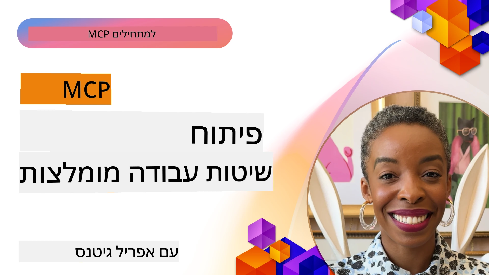

# שיטות עבודה מומלצות לפיתוח MCP

[](https://youtu.be/W56H9W7x-ao)

_(לחץ על התמונה למעלה כדי לצפות בסרטון של השיעור הזה)_

## סקירה כללית

השיעור הזה מתמקד בשיטות עבודה מומלצות מתקדמות לפיתוח, בדיקה, והפצת שרתי MCP ותכונות בסביבות ייצור. ככל שמערכות MCP מתפתחות ומורכבות יותר, עקיבה אחר דפוסים מבוססים מבטיחה אמינות, תחזוקה היטבית, ואינטראופרביליות. שיעור זה מאחד חוכמה מעשית שהושגה מתוך מימושי MCP אמיתיים כדי להנחות אותך ביצירת שרתים חזקים, יעילים עם משאבים, הנחיות, וכלים אפקטיביים.

## יעדי למידה

בסיום שיעור זה תוכל:

- ליישם שיטות עבודה מומלצות בתעשייה בעיצוב שרתי MCP ותכונות
- ליצור אסטרטגיות בדיקה מקיפות לשרתי MCP
- לעצב דפוסי זרימת עבודה יעילים, לשימוש חוזר, עבור יישומי MCP מורכבים
- ליישם טיפול שגיאות מתאים, רישום ומעקב בשרתי MCP
- לייעל מימושי MCP לביצועים, אבטחה ותחזוקה

## עקרונות יסודיים של MCP

לפני שנצלול לשיטות המימוש הספציפיות, חשוב להבין את העקרונות הבסיסיים שמנחים פיתוח MCP יעיל:

1. **תקשורת סטנדרטית**: MCP משתמש בפרוטוקול JSON-RPC 2.0 כבסיסו, המספק פורמט עקבי לבקשות, תגובות וטיפול בשגיאות בכל המימושים.

2. **עיצוב ממוקד משתמש**: תמיד תעדף הסכמה, שליטה, ושקיפות למשתמשים במימושי MCP שלך.

3. **אבטחה בראש ובראשונה**: יישם אמצעי אבטחה חזקים הכוללים אימות, הרשאה, אימות תקינות, והגבלת קצב.

4. **ארכיטקטורה מודולרית**: עצב את שרתי MCP שלך בגישה מודולרית, שבה לכל כלי ומשאב יש מטרה ברורה וממוקדת.

5. **חיבורים בעלי מצב**: נצל את יכולת MCP לשמור מצב על פני בקשות מרובות, לאינטראקציות קוהרנטיות ומבוססות הקשר.

## שיטות עבודה מומלצות רשמיות ל-MCP

שיטות העבודה המומלצות הבאות נגזרות מתיעוד פרוטוקול מודל-קונטקסט הרשמי:

### שיטות עבודה מומלצות לאבטחה

1. **הסכמה ושליטה של המשתמש**: דרוש תמיד הסכמה מפורשת מהמשתמש לפני גישה לנתונים או ביצוע פעולות. ספק שליטה ברורה על אילו נתונים משותפים ואילו פעולות מורשות.

2. **פרטיות נתונים**: חשוף נתוני משתמש רק עם הסכמה מפורשת והגן עליהם עם בקרות גישה מתאימות. מגן מפני העברת נתונים בלתי מורשית.

3. **בטיחות כלים**: דרוש הסכמה מפורשת מהמשתמש לפני קריאת כלי כלשהו. ודא שהמשתמשים מבינים את פונקציונליות הכלי ואכוף גבולות אבטחה חזקים.

4. **בקרת הרשאות לכלים**: קבע אילו כלים מותר למודל להשתמש בהם במהלך מושב, תוך הבטחה שרק כלים מורשים במפורש יהיו נגישים.

5. **אימות**: דרוש אימות נאות לפני הענקת גישה לכלים, משאבים, או פעולות רגישות באמצעות מפתחות API, אסימוני OAuth, או שיטות אימות מאובטחות אחרות.

6. **בדיקת תקינות פרמטרים**: האכף בדיקת תקינות לכל קריאות הכלים למניעת קלט פגום או זדוני המגיע למימושי הכלי.

7. **הגבלת קצב**: יישם הגבלת קצב למניעת ניצול לרעה והבטחת שימוש הוגן במשאבי השרת.

### שיטות עבודה מומלצות למימוש

1. **מיקוח יכולות**: במהלך הקמת החיבור, החלף מידע על תכונות נתמכות, גרסאות פרוטוקול, כלים ומשאבים זמינים.

2. **עיצוב כלים**: צור כלים ממוקדים שעושים דבר אחד טוב, במקום כלים מונוליתיים שמטפלים במספר תחומים.

3. **טיפול בשגיאות**: יישם הודעות שגיאה וקטעים סטנדרטיים לסיוע באבחון בעיות, טיפול בכישלונות בחן, ומתן משוב שניתן לפעול לפיו.

4. **רישום**: קבע רישום מובנה לצרכי ביקורת, איתור באגים, ומעקב אחר אינטראקציות הפרוטוקול.

5. **מעקב התקדמות**: עבור פעולות ארוכות טווח, דווח על עדכוני התקדמות לאפשר ממשקי משתמש מגיבים.

6. **ביטול בקשות**: אפשר ללקוחות לבטל בקשות בתנועה שאינן נדרשות יותר או שלוקחות זמן רב מדי.

## מקורות נוספים

לעדכונים השוטפים על שיטות עבודה מומלצות ל-MCP, עיין ב:

- [תיעוד MCP](https://modelcontextprotocol.io/)
- [מפרט MCP (2025-11-25)](https://spec.modelcontextprotocol.io/specification/2025-11-25/)
- [מאגר GitHub](https://github.com/modelcontextprotocol)
- [שיטות עבודה מומלצות לאבטחה](https://modelcontextprotocol.io/specification/draft/basic/security_best_practices)
- [OWASP MCP עשרת הגדולים](https://microsoft.github.io/mcp-azure-security-guide/mcp/) - סיכוני אבטחה ופתרונות
- [סמינר אבטחת MCP (Sherpa)](https://azure-samples.github.io/sherpa/) - אימון אבטחה מעשי

## דוגמאות מימוש מעשיות

### שיטות עבודה מומלצות לעיצוב כלים

#### 1. עיקרון האחריות היחידה

לכל כלי MCP צריך להיות מטרה ברורה וממוקדת. במקום ליצור כלים מונוליתיים המנסים לטפל בכמה נושאים, פתח כלים מיוחדים המצטיינים במשימות ספציפיות.

```csharp
// A focused tool that does one thing well
public class WeatherForecastTool : ITool
{
    private readonly IWeatherService _weatherService;
    
    public WeatherForecastTool(IWeatherService weatherService)
    {
        _weatherService = weatherService;
    }
    
    public string Name => "weatherForecast";
    public string Description => "Gets weather forecast for a specific location";
    
    public ToolDefinition GetDefinition()
    {
        return new ToolDefinition
        {
            Name = Name,
            Description = Description,
            Parameters = new Dictionary<string, ParameterDefinition>
            {
                ["location"] = new ParameterDefinition
                {
                    Type = ParameterType.String,
                    Description = "City or location name"
                },
                ["days"] = new ParameterDefinition
                {
                    Type = ParameterType.Integer,
                    Description = "Number of forecast days",
                    Default = 3
                }
            },
            Required = new[] { "location" }
        };
    }
    
    public async Task<ToolResponse> ExecuteAsync(IDictionary<string, object> parameters)
    {
        var location = parameters["location"].ToString();
        var days = parameters.ContainsKey("days") 
            ? Convert.ToInt32(parameters["days"]) 
            : 3;
            
        var forecast = await _weatherService.GetForecastAsync(location, days);
        
        return new ToolResponse
        {
            Content = new List<ContentItem>
            {
                new TextContent(JsonSerializer.Serialize(forecast))
            }
        };
    }
}
```

#### 2. טיפול שגיאות עקבי

יישם טיפול שגיאות חזק עם הודעות שגיאה אינפורמטיביות ומנגנוני התאוששות מתאימים.

```python
# דוגמה בפייתון עם טיפול שגיאות מקיף
class DataQueryTool:
    def get_name(self):
        return "dataQuery"
        
    def get_description(self):
        return "Queries data from specified database tables"
    
    async def execute(self, parameters):
        try:
            # אימות פרמטרים
            if "query" not in parameters:
                raise ToolParameterError("Missing required parameter: query")
                
            query = parameters["query"]
            
            # אימות אבטחה
            if self._contains_unsafe_sql(query):
                raise ToolSecurityError("Query contains potentially unsafe SQL")
            
            try:
                # פעולה במסד נתונים עם גבול זמן
                async with timeout(10):  # גבול זמן של 10 שניות
                    result = await self._database.execute_query(query)
                    
                return ToolResponse(
                    content=[TextContent(json.dumps(result))]
                )
            except asyncio.TimeoutError:
                raise ToolExecutionError("Database query timed out after 10 seconds")
            except DatabaseConnectionError as e:
                # שגיאות חיבור עשויות להיות זמניות
                self._log_error("Database connection error", e)
                raise ToolExecutionError(f"Database connection error: {str(e)}")
            except DatabaseQueryError as e:
                # שגיאות שאילתה הן ככל הנראה שגיאות לקוח
                self._log_error("Database query error", e)
                raise ToolExecutionError(f"Invalid query: {str(e)}")
                
        except ToolError:
            # אפשר לשגיאות ספציפיות לכלי לעבור
            raise
        except Exception as e:
            # תפיסה כוללת של שגיאות לא צפויות
            self._log_error("Unexpected error in DataQueryTool", e)
            raise ToolExecutionError(f"An unexpected error occurred: {str(e)}")
    
    def _contains_unsafe_sql(self, query):
        # יישום של גילוי הזרקת SQL
        pass
        
    def _log_error(self, message, error):
        # יישום של רישום שגיאות
        pass
```

#### 3. בדיקת תקינות פרמטרים

תמיד אמת פרמטרים ביסודיות כדי למנוע קלט פגום או זדוני.

```javascript
// דוגמת JavaScript/TypeScript עם אימות פרמטרים מפורט
class FileOperationTool {
  getName() {
    return "fileOperation";
  }
  
  getDescription() {
    return "Performs file operations like read, write, and delete";
  }
  
  getDefinition() {
    return {
      name: this.getName(),
      description: this.getDescription(),
      parameters: {
        operation: {
          type: "string",
          description: "Operation to perform",
          enum: ["read", "write", "delete"]
        },
        path: {
          type: "string",
          description: "File path (must be within allowed directories)"
        },
        content: {
          type: "string",
          description: "Content to write (only for write operation)",
          optional: true
        }
      },
      required: ["operation", "path"]
    };
  }
  
  async execute(parameters) {
    // 1. אימות נוכחות הפרמטר
    if (!parameters.operation) {
      throw new ToolError("Missing required parameter: operation");
    }
    
    if (!parameters.path) {
      throw new ToolError("Missing required parameter: path");
    }
    
    // 2. אימות סוגי הפרמטרים
    if (typeof parameters.operation !== "string") {
      throw new ToolError("Parameter 'operation' must be a string");
    }
    
    if (typeof parameters.path !== "string") {
      throw new ToolError("Parameter 'path' must be a string");
    }
    
    // 3. אימות ערכי הפרמטרים
    const validOperations = ["read", "write", "delete"];
    if (!validOperations.includes(parameters.operation)) {
      throw new ToolError(`Invalid operation. Must be one of: ${validOperations.join(", ")}`);
    }
    
    // 4. אימות נוכחות תוכן עבור פעולת כתיבה
    if (parameters.operation === "write" && !parameters.content) {
      throw new ToolError("Content parameter is required for write operation");
    }
    
    // 5. אימות בטיחות הנתיב
    if (!this.isPathWithinAllowedDirectories(parameters.path)) {
      throw new ToolError("Access denied: path is outside of allowed directories");
    }
    
    // יישום מבוסס על פרמטרים מאומתים
    // ...
  }
  
  isPathWithinAllowedDirectories(path) {
    // יישום בדיקת בטיחות הנתיב
    // ...
  }
}
```

### דוגמאות מימוש אבטחה

#### 1. אימות והרשאה

```java
// דוגמת Java עם אימות והרשאה
public class SecureDataAccessTool implements Tool {
    private final AuthenticationService authService;
    private final AuthorizationService authzService;
    private final DataService dataService;
    
    // הזרקת תלויות
    public SecureDataAccessTool(
            AuthenticationService authService,
            AuthorizationService authzService,
            DataService dataService) {
        this.authService = authService;
        this.authzService = authzService;
        this.dataService = dataService;
    }
    
    @Override
    public String getName() {
        return "secureDataAccess";
    }
    
    @Override
    public ToolResponse execute(ToolRequest request) {
        // 1. חילוץ הקשר האימות
        String authToken = request.getContext().getAuthToken();
        
        // 2. אימות משתמש
        UserIdentity user;
        try {
            user = authService.validateToken(authToken);
        } catch (AuthenticationException e) {
            return ToolResponse.error("Authentication failed: " + e.getMessage());
        }
        
        // 3. בדיקת הרשאה לפעולה ספציפית
        String dataId = request.getParameters().get("dataId").getAsString();
        String operation = request.getParameters().get("operation").getAsString();
        
        boolean isAuthorized = authzService.isAuthorized(user, "data:" + dataId, operation);
        if (!isAuthorized) {
            return ToolResponse.error("Access denied: Insufficient permissions for this operation");
        }
        
        // 4. המשך עם הפעולה המורשית
        try {
            switch (operation) {
                case "read":
                    Object data = dataService.getData(dataId, user.getId());
                    return ToolResponse.success(data);
                case "update":
                    JsonNode newData = request.getParameters().get("newData");
                    dataService.updateData(dataId, newData, user.getId());
                    return ToolResponse.success("Data updated successfully");
                default:
                    return ToolResponse.error("Unsupported operation: " + operation);
            }
        } catch (Exception e) {
            return ToolResponse.error("Operation failed: " + e.getMessage());
        }
    }
}
```

#### 2. הגבלת קצב

```csharp
// C# rate limiting implementation
public class RateLimitingMiddleware
{
    private readonly RequestDelegate _next;
    private readonly IMemoryCache _cache;
    private readonly ILogger<RateLimitingMiddleware> _logger;
    
    // Configuration options
    private readonly int _maxRequestsPerMinute;
    
    public RateLimitingMiddleware(
        RequestDelegate next,
        IMemoryCache cache,
        ILogger<RateLimitingMiddleware> logger,
        IConfiguration config)
    {
        _next = next;
        _cache = cache;
        _logger = logger;
        _maxRequestsPerMinute = config.GetValue<int>("RateLimit:MaxRequestsPerMinute", 60);
    }
    
    public async Task InvokeAsync(HttpContext context)
    {
        // 1. Get client identifier (API key or user ID)
        string clientId = GetClientIdentifier(context);
        
        // 2. Get rate limiting key for this minute
        string cacheKey = $"rate_limit:{clientId}:{DateTime.UtcNow:yyyyMMddHHmm}";
        
        // 3. Check current request count
        if (!_cache.TryGetValue(cacheKey, out int requestCount))
        {
            requestCount = 0;
        }
        
        // 4. Enforce rate limit
        if (requestCount >= _maxRequestsPerMinute)
        {
            _logger.LogWarning("Rate limit exceeded for client {ClientId}", clientId);
            
            context.Response.StatusCode = StatusCodes.Status429TooManyRequests;
            context.Response.Headers.Add("Retry-After", "60");
            
            await context.Response.WriteAsJsonAsync(new
            {
                error = "Rate limit exceeded",
                message = "Too many requests. Please try again later.",
                retryAfterSeconds = 60
            });
            
            return;
        }
        
        // 5. Increment request count
        _cache.Set(cacheKey, requestCount + 1, TimeSpan.FromMinutes(2));
        
        // 6. Add rate limit headers
        context.Response.Headers.Add("X-RateLimit-Limit", _maxRequestsPerMinute.ToString());
        context.Response.Headers.Add("X-RateLimit-Remaining", (_maxRequestsPerMinute - requestCount - 1).ToString());
        
        // 7. Continue with the request
        await _next(context);
    }
    
    private string GetClientIdentifier(HttpContext context)
    {
        // Implementation to extract API key or user ID
        // ...
    }
}
```

## שיטות עבודה מומלצות לבדיקות

### 1. בדיקות יחידה לכלי MCP

תמיד בדוק את הכלים שלך בבידוד, תוך הדמיית תלות חיצונית:

```typescript
// דוגמת בדיקת יחידה לכלי ב-TypeScript
describe('WeatherForecastTool', () => {
  let tool: WeatherForecastTool;
  let mockWeatherService: jest.Mocked<IWeatherService>;
  
  beforeEach(() => {
    // צור שירות מזג אוויר מדומה
    mockWeatherService = {
      getForecasts: jest.fn()
    } as any;
    
    // צור את הכלי עם התלות המדומה
    tool = new WeatherForecastTool(mockWeatherService);
  });
  
  it('should return weather forecast for a location', async () => {
    // הסדר
    const mockForecast = {
      location: 'Seattle',
      forecasts: [
        { date: '2025-07-16', temperature: 72, conditions: 'Sunny' },
        { date: '2025-07-17', temperature: 68, conditions: 'Partly Cloudy' },
        { date: '2025-07-18', temperature: 65, conditions: 'Rain' }
      ]
    };
    
    mockWeatherService.getForecasts.mockResolvedValue(mockForecast);
    
    // פעולה
    const response = await tool.execute({
      location: 'Seattle',
      days: 3
    });
    
    // אימות
    expect(mockWeatherService.getForecasts).toHaveBeenCalledWith('Seattle', 3);
    expect(response.content[0].text).toContain('Seattle');
    expect(response.content[0].text).toContain('Sunny');
  });
  
  it('should handle errors from the weather service', async () => {
    // הסדר
    mockWeatherService.getForecasts.mockRejectedValue(new Error('Service unavailable'));
    
    // פעולה ואימות
    await expect(tool.execute({
      location: 'Seattle',
      days: 3
    })).rejects.toThrow('Weather service error: Service unavailable');
  });
});
```

### 2. בדיקות אינטגרציה

בדוק את הזרימה המלאה מבקשות הלקוח ועד תגובות השרת:

```python
# דוגמת בדיקת אינטגרציה בפייתון
@pytest.mark.asyncio
async def test_mcp_server_integration():
    # הפעל שרת בדיקות
    server = McpServer()
    server.register_tool(WeatherForecastTool(MockWeatherService()))
    await server.start(port=5000)
    
    try:
        # צור לקוח
        client = McpClient("http://localhost:5000")
        
        # בדוק גילוי כלי
        tools = await client.discover_tools()
        assert "weatherForecast" in [t.name for t in tools]
        
        # בדוק ביצוע כלי
        response = await client.execute_tool("weatherForecast", {
            "location": "Seattle",
            "days": 3
        })
        
        # אמת תגובה
        assert response.status_code == 200
        assert "Seattle" in response.content[0].text
        assert len(json.loads(response.content[0].text)["forecasts"]) == 3
        
    finally:
        # נקה משאבים
        await server.stop()
```

## אופטימיזציה לביצועים

### 1. אסטרטגיות מטמון

יישם מטמון מתאים להפחתת השהיה ושימוש במשאבים:

```csharp
// C# example with caching
public class CachedWeatherTool : ITool
{
    private readonly IWeatherService _weatherService;
    private readonly IDistributedCache _cache;
    private readonly ILogger<CachedWeatherTool> _logger;
    
    public CachedWeatherTool(
        IWeatherService weatherService,
        IDistributedCache cache,
        ILogger<CachedWeatherTool> logger)
    {
        _weatherService = weatherService;
        _cache = cache;
        _logger = logger;
    }
    
    public string Name => "weatherForecast";
    
    public async Task<ToolResponse> ExecuteAsync(IDictionary<string, object> parameters)
    {
        var location = parameters["location"].ToString();
        var days = Convert.ToInt32(parameters.GetValueOrDefault("days", 3));
        
        // Create cache key
        string cacheKey = $"weather:{location}:{days}";
        
        // Try to get from cache
        string cachedForecast = await _cache.GetStringAsync(cacheKey);
        if (!string.IsNullOrEmpty(cachedForecast))
        {
            _logger.LogInformation("Cache hit for weather forecast: {Location}", location);
            return new ToolResponse
            {
                Content = new List<ContentItem>
                {
                    new TextContent(cachedForecast)
                }
            };
        }
        
        // Cache miss - get from service
        _logger.LogInformation("Cache miss for weather forecast: {Location}", location);
        var forecast = await _weatherService.GetForecastAsync(location, days);
        string forecastJson = JsonSerializer.Serialize(forecast);
        
        // Store in cache (weather forecasts valid for 1 hour)
        await _cache.SetStringAsync(
            cacheKey,
            forecastJson,
            new DistributedCacheEntryOptions
            {
                AbsoluteExpirationRelativeToNow = TimeSpan.FromHours(1)
            });
        
        return new ToolResponse
        {
            Content = new List<ContentItem>
            {
                new TextContent(forecastJson)
            }
        };
    }
}
```

#### 2. הזרקת תלות ויכולת בדיקה

עצב כלים שיקבלו את התלויות שלהם דרך הזרקת קונסטרקטור, מה שיהפוך אותם לניתנים לבדיקה ולהגדרה:

```java
// דוגמת Java עם הזרקת תלות
public class CurrencyConversionTool implements Tool {
    private final ExchangeRateService exchangeService;
    private final CacheService cacheService;
    private final Logger logger;
    
    // התלויות מוזרקות דרך הבנאי
    public CurrencyConversionTool(
            ExchangeRateService exchangeService,
            CacheService cacheService,
            Logger logger) {
        this.exchangeService = exchangeService;
        this.cacheService = cacheService;
        this.logger = logger;
    }
    
    // מימוש הכלי
    // ...
}
```

#### 3. כלים קומפוזביליים

עצב כלים שניתן להרכיב יחדיו ליצירת זרימות עבודה מורכבות יותר:

```python
# דוגמה בפייתון המציגה כלים שניתן להרכיב
class DataFetchTool(Tool):
    def get_name(self):
        return "dataFetch"
    
    # מימוש...

class DataAnalysisTool(Tool):
    def get_name(self):
        return "dataAnalysis"
    
    # כלי זה יכול להשתמש בתוצאות של כלי dataFetch
    async def execute_async(self, request):
        # מימוש...
        pass

class DataVisualizationTool(Tool):
    def get_name(self):
        return "dataVisualize"
    
    # כלי זה יכול להשתמש בתוצאות של כלי dataAnalysis
    async def execute_async(self, request):
        # מימוש...
        pass

# ניתן להשתמש בכלים אלו באופן עצמאי או כחלק מתהליך עבודה
```

### שיטות עבודה מומלצות לעיצוב סכמות

הסכמה היא החוזה בין המודל לכלי. סכמות מתוכננות היטב מובילות לשימושיות טובה יותר של הכלי.

#### 1. תיאורי פרמטרים ברורים

תמיד כלול מידע תיאורי לכל פרמטר:

```csharp
public object GetSchema()
{
    return new {
        type = "object",
        properties = new {
            query = new { 
                type = "string", 
                description = "Search query text. Use precise keywords for better results." 
            },
            filters = new {
                type = "object",
                description = "Optional filters to narrow down search results",
                properties = new {
                    dateRange = new { 
                        type = "string", 
                        description = "Date range in format YYYY-MM-DD:YYYY-MM-DD" 
                    },
                    category = new { 
                        type = "string", 
                        description = "Category name to filter by" 
                    }
                }
            },
            limit = new { 
                type = "integer", 
                description = "Maximum number of results to return (1-50)",
                default = 10
            }
        },
        required = new[] { "query" }
    };
}
```

#### 2. מגבלות אימות

כלול מגבלות אימות למניעת קלטים לא חוקיים:

```java
Map<String, Object> getSchema() {
    Map<String, Object> schema = new HashMap<>();
    schema.put("type", "object");
    
    Map<String, Object> properties = new HashMap<>();
    
    // מאפיין דוא"ל עם אימות פורמט
    Map<String, Object> email = new HashMap<>();
    email.put("type", "string");
    email.put("format", "email");
    email.put("description", "User email address");
    
    // מאפיין גיל עם מגבלות מספריות
    Map<String, Object> age = new HashMap<>();
    age.put("type", "integer");
    age.put("minimum", 13);
    age.put("maximum", 120);
    age.put("description", "User age in years");
    
    // מאפיין ממוספר
    Map<String, Object> subscription = new HashMap<>();
    subscription.put("type", "string");
    subscription.put("enum", Arrays.asList("free", "basic", "premium"));
    subscription.put("default", "free");
    subscription.put("description", "Subscription tier");
    
    properties.put("email", email);
    properties.put("age", age);
    properties.put("subscription", subscription);
    
    schema.put("properties", properties);
    schema.put("required", Arrays.asList("email"));
    
    return schema;
}
```

#### 3. מבני החזרה עקביים

שמור על עקביות במבני התגובה שלך כדי להקל על מודלים לפרש תוצאות:

```python
async def execute_async(self, request):
    try:
        # לעבד בקשה
        results = await self._search_database(request.parameters["query"])
        
        # תמיד להחזיר מבנה עקבי
        return ToolResponse(
            result={
                "matches": [self._format_item(item) for item in results],
                "totalCount": len(results),
                "queryTime": calculation_time_ms,
                "status": "success"
            }
        )
    except Exception as e:
        return ToolResponse(
            result={
                "matches": [],
                "totalCount": 0,
                "queryTime": 0,
                "status": "error",
                "error": str(e)
            }
        )
    
def _format_item(self, item):
    """Ensures each item has a consistent structure"""
    return {
        "id": item.id,
        "title": item.title,
        "summary": item.summary[:100] + "..." if len(item.summary) > 100 else item.summary,
        "url": item.url,
        "relevance": item.score
    }
```

### טיפול בשגיאות

טיפול שגיאות חזק הוא קריטי לכלי MCP לשמירת אמינות.

#### 1. טיפול שגיאות באופן אופרטיבי

טפל בשגיאות ברמות מתאימות וספק הודעות אינפורמטיביות:

```csharp
public async Task<ToolResponse> ExecuteAsync(ToolRequest request)
{
    try
    {
        string fileId = request.Parameters.GetProperty("fileId").GetString();
        
        try
        {
            var fileData = await _fileService.GetFileAsync(fileId);
            return new ToolResponse { 
                Result = JsonSerializer.SerializeToElement(fileData) 
            };
        }
        catch (FileNotFoundException)
        {
            throw new ToolExecutionException($"File not found: {fileId}");
        }
        catch (UnauthorizedAccessException)
        {
            throw new ToolExecutionException("You don't have permission to access this file");
        }
        catch (Exception ex) when (ex is IOException || ex is TimeoutException)
        {
            _logger.LogError(ex, "Error accessing file {FileId}", fileId);
            throw new ToolExecutionException("Error accessing file: The service is temporarily unavailable");
        }
    }
    catch (JsonException)
    {
        throw new ToolExecutionException("Invalid file ID format");
    }
    catch (Exception ex)
    {
        _logger.LogError(ex, "Unexpected error in FileAccessTool");
        throw new ToolExecutionException("An unexpected error occurred");
    }
}
```

#### 2. תגובות שגיאה מובנות

החזר מידע שגיאה מובנה כשאפשרי:

```java
@Override
public ToolResponse execute(ToolRequest request) {
    try {
        // יישום
    } catch (Exception ex) {
        Map<String, Object> errorResult = new HashMap<>();
        
        errorResult.put("success", false);
        
        if (ex instanceof ValidationException) {
            ValidationException validationEx = (ValidationException) ex;
            
            errorResult.put("errorType", "validation");
            errorResult.put("errorMessage", validationEx.getMessage());
            errorResult.put("validationErrors", validationEx.getErrors());
            
            return new ToolResponse.Builder()
                .setResult(errorResult)
                .build();
        }
        
        // להשליך מחדש חריגות אחרות כ-ToolExecutionException
        throw new ToolExecutionException("Tool execution failed: " + ex.getMessage(), ex);
    }
}
```

#### 3. לוגיקת ניסיון חוזר

יישם לוגיקת ניסיון חוזר מתאימה לכישלונות זמניים:

```python
async def execute_async(self, request):
    max_retries = 3
    retry_count = 0
    base_delay = 1  # שניות
    
    while retry_count < max_retries:
        try:
            # קריאה ל-API חיצוני
            return await self._call_api(request.parameters)
        except TransientError as e:
            retry_count += 1
            if retry_count >= max_retries:
                raise ToolExecutionException(f"Operation failed after {max_retries} attempts: {str(e)}")
                
            # נסיגה מעריכית
            delay = base_delay * (2 ** (retry_count - 1))
            logging.warning(f"Transient error, retrying in {delay}s: {str(e)}")
            await asyncio.sleep(delay)
        except Exception as e:
            # שגיאה שאינה זמנית, לא לנסות שוב
            raise ToolExecutionException(f"Operation failed: {str(e)}")
```

### אופטימיזציה לביצועים

#### 1. מטמון

יישם מטמון עבור פעולות יקרות:

```csharp
public class CachedDataTool : IMcpTool
{
    private readonly IDatabase _database;
    private readonly IMemoryCache _cache;
    
    public CachedDataTool(IDatabase database, IMemoryCache cache)
    {
        _database = database;
        _cache = cache;
    }
    
    public async Task<ToolResponse> ExecuteAsync(ToolRequest request)
    {
        var query = request.Parameters.GetProperty("query").GetString();
        
        // Create cache key based on parameters
        var cacheKey = $"data_query_{ComputeHash(query)}";
        
        // Try to get from cache first
        if (_cache.TryGetValue(cacheKey, out var cachedResult))
        {
            return new ToolResponse { Result = cachedResult };
        }
        
        // Cache miss - perform actual query
        var result = await _database.QueryAsync(query);
        
        // Store in cache with expiration
        var cacheOptions = new MemoryCacheEntryOptions()
            .SetAbsoluteExpiration(TimeSpan.FromMinutes(15));
            
        _cache.Set(cacheKey, JsonSerializer.SerializeToElement(result), cacheOptions);
        
        return new ToolResponse { Result = JsonSerializer.SerializeToElement(result) };
    }
    
    private string ComputeHash(string input)
    {
        // Implementation to generate stable hash for cache key
    }
}
```

#### 2. עיבוד אסינכרוני

השתמש בדפוסי תכנות אסינכרוניים עבור פעולות I/O:

```java
public class AsyncDocumentProcessingTool implements Tool {
    private final DocumentService documentService;
    private final ExecutorService executorService;
    
    @Override
    public ToolResponse execute(ToolRequest request) {
        String documentId = request.getParameters().get("documentId").asText();
        
        // עבור פעולות שמתמשכות זמן רב, החזר מיד מזהה עיבוד
        String processId = UUID.randomUUID().toString();
        
        // התחל עיבוד אסינכרוני
        CompletableFuture.runAsync(() -> {
            try {
                // בצע פעולה שמתמשכת זמן רב
                documentService.processDocument(documentId);
                
                // עדכן סטטוס (בדרך כלל יישמר במסד נתונים)
                processStatusRepository.updateStatus(processId, "completed");
            } catch (Exception ex) {
                processStatusRepository.updateStatus(processId, "failed", ex.getMessage());
            }
        }, executorService);
        
        // החזר תגובה מיידית עם מזהה התהליך
        Map<String, Object> result = new HashMap<>();
        result.put("processId", processId);
        result.put("status", "processing");
        result.put("estimatedCompletionTime", ZonedDateTime.now().plusMinutes(5));
        
        return new ToolResponse.Builder().setResult(result).build();
    }
    
    // כלי בדיקת סטטוס משלים
    public class ProcessStatusTool implements Tool {
        @Override
        public ToolResponse execute(ToolRequest request) {
            String processId = request.getParameters().get("processId").asText();
            ProcessStatus status = processStatusRepository.getStatus(processId);
            
            return new ToolResponse.Builder().setResult(status).build();
        }
    }
}
```

#### 3. הגבלת משאבים

יישם הגבלת משאבים למניעת עומסים:

```python
class ThrottledApiTool(Tool):
    def __init__(self):
        self.rate_limiter = TokenBucketRateLimiter(
            tokens_per_second=5,  # אפשר 5 בקשות לשנייה
            bucket_size=10        # אפשר זינוקים של עד 10 בקשות
        )
    
    async def execute_async(self, request):
        # בדוק אם אפשר להמשיך או צריך לחכות
        delay = self.rate_limiter.get_delay_time()
        
        if delay > 0:
            if delay > 2.0:  # אם זמן ההמתנה ארוך מדי
                raise ToolExecutionException(
                    f"Rate limit exceeded. Please try again in {delay:.1f} seconds."
                )
            else:
                # המתן במשך הזמן המתאים
                await asyncio.sleep(delay)
        
        # צרוך אסימון והמשך עם הבקשה
        self.rate_limiter.consume()
        
        # קריאה ל-API
        result = await self._call_api(request.parameters)
        return ToolResponse(result=result)

class TokenBucketRateLimiter:
    def __init__(self, tokens_per_second, bucket_size):
        self.tokens_per_second = tokens_per_second
        self.bucket_size = bucket_size
        self.tokens = bucket_size
        self.last_refill = time.time()
        self.lock = asyncio.Lock()
    
    async def get_delay_time(self):
        async with self.lock:
            self._refill()
            if self.tokens >= 1:
                return 0
            
            # חשב את הזמן עד שהאסימון הבא זמין
            return (1 - self.tokens) / self.tokens_per_second
    
    async def consume(self):
        async with self.lock:
            self._refill()
            self.tokens -= 1
    
    def _refill(self):
        now = time.time()
        elapsed = now - self.last_refill
        
        # הוסף אסימונים חדשים על בסיס הזמן שחלף
        new_tokens = elapsed * self.tokens_per_second
        self.tokens = min(self.bucket_size, self.tokens + new_tokens)
        self.last_refill = now
```

### שיטות עבודה מומלצות לאבטחה

#### 1. אימות קלט

תמיד אמת פרמטרי קלט ביסודיות:

```csharp
public async Task<ToolResponse> ExecuteAsync(ToolRequest request)
{
    // Validate parameters exist
    if (!request.Parameters.TryGetProperty("query", out var queryProp))
    {
        throw new ToolExecutionException("Missing required parameter: query");
    }
    
    // Validate correct type
    if (queryProp.ValueKind != JsonValueKind.String)
    {
        throw new ToolExecutionException("Query parameter must be a string");
    }
    
    var query = queryProp.GetString();
    
    // Validate string content
    if (string.IsNullOrWhiteSpace(query))
    {
        throw new ToolExecutionException("Query parameter cannot be empty");
    }
    
    if (query.Length > 500)
    {
        throw new ToolExecutionException("Query parameter exceeds maximum length of 500 characters");
    }
    
    // Check for SQL injection attacks if applicable
    if (ContainsSqlInjection(query))
    {
        throw new ToolExecutionException("Invalid query: contains potentially unsafe SQL");
    }
    
    // Proceed with execution
    // ...
}
```

#### 2. בדיקות הרשאה

יישם בדיקות הרשאה מתאימות:

```java
@Override
public ToolResponse execute(ToolRequest request) {
    // קבלת הקשר המשתמש מבקשה
    UserContext user = request.getContext().getUserContext();
    
    // בדוק אם למשתמש יש הרשאות נדרשות
    if (!authorizationService.hasPermission(user, "documents:read")) {
        throw new ToolExecutionException("User does not have permission to access documents");
    }
    
    // עבור משאבים ספציפיים, בדוק גישה למשאב זה
    String documentId = request.getParameters().get("documentId").asText();
    if (!documentService.canUserAccess(user.getId(), documentId)) {
        throw new ToolExecutionException("Access denied to the requested document");
    }
    
    // המשך בביצוע הכלי
    // ...
}
```

#### 3. טיפול במידע רגיש

טפל במידע רגיש בזהירות:

```python
class SecureDataTool(Tool):
    def get_schema(self):
        return {
            "type": "object",
            "properties": {
                "userId": {"type": "string"},
                "includeSensitiveData": {"type": "boolean", "default": False}
            },
            "required": ["userId"]
        }
    
    async def execute_async(self, request):
        user_id = request.parameters["userId"]
        include_sensitive = request.parameters.get("includeSensitiveData", False)
        
        # קבל נתוני משתמש
        user_data = await self.user_service.get_user_data(user_id)
        
        # סנן שדות רגישים אלא אם כן נדרש במפורש ואושר
        if not include_sensitive or not self._is_authorized_for_sensitive_data(request):
            user_data = self._redact_sensitive_fields(user_data)
        
        return ToolResponse(result=user_data)
    
    def _is_authorized_for_sensitive_data(self, request):
        # בדוק את רמת ההרשאה בהקשר הבקשה
        auth_level = request.context.get("authorizationLevel")
        return auth_level == "admin"
    
    def _redact_sensitive_fields(self, user_data):
        # צור עותק כדי להימנע משינוי המקור
        redacted = user_data.copy()
        
        # הסר מידע רגיש ספציפי
        sensitive_fields = ["ssn", "creditCardNumber", "password"]
        for field in sensitive_fields:
            if field in redacted:
                redacted[field] = "REDACTED"
        
        # הסר נתונים רגישים מקוננים
        if "financialInfo" in redacted:
            redacted["financialInfo"] = {"available": True, "accessRestricted": True}
        
        return redacted
```

## שיטות עבודה מומלצות לבדיקות כלי MCP

בדיקה מקיפה מוודאת שכלי MCP פועלים כהלכה, מטפלים במקרי קצה, ומשתלבים היטב עם שאר המערכת.

### בדיקות יחידה

#### 1. בדוק כל כלי בבידוד

צור בדיקות ממוקדות לפונקציונליות של כל כלי:

```csharp
[Fact]
public async Task WeatherTool_ValidLocation_ReturnsCorrectForecast()
{
    // Arrange
    var mockWeatherService = new Mock<IWeatherService>();
    mockWeatherService
        .Setup(s => s.GetForecastAsync("Seattle", 3))
        .ReturnsAsync(new WeatherForecast(/* test data */));
    
    var tool = new WeatherForecastTool(mockWeatherService.Object);
    
    var request = new ToolRequest(
        toolName: "weatherForecast",
        parameters: JsonSerializer.SerializeToElement(new { 
            location = "Seattle", 
            days = 3 
        })
    );
    
    // Act
    var response = await tool.ExecuteAsync(request);
    
    // Assert
    Assert.NotNull(response);
    var result = JsonSerializer.Deserialize<WeatherForecast>(response.Result);
    Assert.Equal("Seattle", result.Location);
    Assert.Equal(3, result.DailyForecasts.Count);
}

[Fact]
public async Task WeatherTool_InvalidLocation_ThrowsToolExecutionException()
{
    // Arrange
    var mockWeatherService = new Mock<IWeatherService>();
    mockWeatherService
        .Setup(s => s.GetForecastAsync("InvalidLocation", It.IsAny<int>()))
        .ThrowsAsync(new LocationNotFoundException("Location not found"));
    
    var tool = new WeatherForecastTool(mockWeatherService.Object);
    
    var request = new ToolRequest(
        toolName: "weatherForecast",
        parameters: JsonSerializer.SerializeToElement(new { 
            location = "InvalidLocation", 
            days = 3 
        })
    );
    
    // Act & Assert
    var exception = await Assert.ThrowsAsync<ToolExecutionException>(
        () => tool.ExecuteAsync(request)
    );
    
    Assert.Contains("Location not found", exception.Message);
}
```

#### 2. בדיקת תקינות הסכמה

בדוק שהסכמות תקפות ומאכפות מגבלות כראוי:

```java
@Test
public void testSchemaValidation() {
    // צור מופע של הכלי
    SearchTool searchTool = new SearchTool();
    
    // קבל סכימה
    Object schema = searchTool.getSchema();
    
    // המר סכימה ל-JSON לצורך אימות
    String schemaJson = objectMapper.writeValueAsString(schema);
    
    // אמת שהסכימה היא JSONSchema תקפה
    JsonSchemaFactory factory = JsonSchemaFactory.byDefault();
    JsonSchema jsonSchema = factory.getJsonSchema(schemaJson);
    
    // בדוק פרמטרים תקפים
    JsonNode validParams = objectMapper.createObjectNode()
        .put("query", "test query")
        .put("limit", 5);
        
    ProcessingReport validReport = jsonSchema.validate(validParams);
    assertTrue(validReport.isSuccess());
    
    // בדוק פרמטר דרוש חסר
    JsonNode missingRequired = objectMapper.createObjectNode()
        .put("limit", 5);
        
    ProcessingReport missingReport = jsonSchema.validate(missingRequired);
    assertFalse(missingReport.isSuccess());
    
    // בדוק סוג פרמטר לא תקין
    JsonNode invalidType = objectMapper.createObjectNode()
        .put("query", "test")
        .put("limit", "not-a-number");
        
    ProcessingReport invalidReport = jsonSchema.validate(invalidType);
    assertFalse(invalidReport.isSuccess());
}
```

#### 3. בדיקות טיפול שגיאות

צור בדיקות ספציפיות למקרי שגיאה:

```python
@pytest.mark.asyncio
async def test_api_tool_handles_timeout():
    # לסדר
    tool = ApiTool(timeout=0.1)  # זמן קצוב קצר מאוד
    
    # לזייף בקשה שתיגמר בזמן
    with aioresponses() as mocked:
        mocked.get(
            "https://api.example.com/data",
            callback=lambda *args, **kwargs: asyncio.sleep(0.5)  # ארוך יותר מהזמן הקצוב
        )
        
        request = ToolRequest(
            tool_name="apiTool",
            parameters={"url": "https://api.example.com/data"}
        )
        
        # לבצע ולהבטיח
        with pytest.raises(ToolExecutionException) as exc_info:
            await tool.execute_async(request)
        
        # לאמת את הודעת החריגה
        assert "timed out" in str(exc_info.value).lower()

@pytest.mark.asyncio
async def test_api_tool_handles_rate_limiting():
    # לסדר
    tool = ApiTool()
    
    # לזייף תגובה עם הגבלת קצב
    with aioresponses() as mocked:
        mocked.get(
            "https://api.example.com/data",
            status=429,
            headers={"Retry-After": "2"},
            body=json.dumps({"error": "Rate limit exceeded"})
        )
        
        request = ToolRequest(
            tool_name="apiTool",
            parameters={"url": "https://api.example.com/data"}
        )
        
        # לבצע ולהבטיח
        with pytest.raises(ToolExecutionException) as exc_info:
            await tool.execute_async(request)
        
        # לאמת שהחריגה מכילה מידע על הגבלת קצב
        error_msg = str(exc_info.value).lower()
        assert "rate limit" in error_msg
        assert "try again" in error_msg
```

### בדיקות אינטגרציה

#### 1. בדיקת שרשרת כלים

בדוק כלים העובדים יחד בשילובים צפויים:

```csharp
[Fact]
public async Task DataProcessingWorkflow_CompletesSuccessfully()
{
    // Arrange
    var dataFetchTool = new DataFetchTool(mockDataService.Object);
    var analysisTools = new DataAnalysisTool(mockAnalysisService.Object);
    var visualizationTool = new DataVisualizationTool(mockVisualizationService.Object);
    
    var toolRegistry = new ToolRegistry();
    toolRegistry.RegisterTool(dataFetchTool);
    toolRegistry.RegisterTool(analysisTools);
    toolRegistry.RegisterTool(visualizationTool);
    
    var workflowExecutor = new WorkflowExecutor(toolRegistry);
    
    // Act
    var result = await workflowExecutor.ExecuteWorkflowAsync(new[] {
        new ToolCall("dataFetch", new { source = "sales2023" }),
        new ToolCall("dataAnalysis", ctx => new { 
            data = ctx.GetResult("dataFetch"),
            analysis = "trend" 
        }),
        new ToolCall("dataVisualize", ctx => new {
            analysisResult = ctx.GetResult("dataAnalysis"),
            type = "line-chart"
        })
    });
    
    // Assert
    Assert.NotNull(result);
    Assert.True(result.Success);
    Assert.NotNull(result.GetResult("dataVisualize"));
    Assert.Contains("chartUrl", result.GetResult("dataVisualize").ToString());
}
```

#### 2. בדיקות שרת MCP

בדוק את שרת MCP עם הרשמת כלים מלאה וביצוע:

```java
@SpringBootTest
@AutoConfigureMockMvc
public class McpServerIntegrationTest {
    
    @Autowired
    private MockMvc mockMvc;
    
    @Autowired
    private ObjectMapper objectMapper;
    
    @Test
    public void testToolDiscovery() throws Exception {
        // בדוק את נקודת הקצה של הגילוי
        mockMvc.perform(get("/mcp/tools"))
            .andExpect(status().isOk())
            .andExpect(jsonPath("$.tools").isArray())
            .andExpect(jsonPath("$.tools[*].name").value(hasItems(
                "weatherForecast", "calculator", "documentSearch"
            )));
    }
    
    @Test
    public void testToolExecution() throws Exception {
        // צור בקשת כלי
        Map<String, Object> request = new HashMap<>();
        request.put("toolName", "calculator");
        
        Map<String, Object> parameters = new HashMap<>();
        parameters.put("operation", "add");
        parameters.put("a", 5);
        parameters.put("b", 7);
        request.put("parameters", parameters);
        
        // שלח בקשה ואמת את התגובה
        mockMvc.perform(post("/mcp/execute")
            .contentType(MediaType.APPLICATION_JSON)
            .content(objectMapper.writeValueAsString(request)))
            .andExpect(status().isOk())
            .andExpect(jsonPath("$.result.value").value(12));
    }
    
    @Test
    public void testToolValidation() throws Exception {
        // צור בקשת כלי לא חוקית
        Map<String, Object> request = new HashMap<>();
        request.put("toolName", "calculator");
        
        Map<String, Object> parameters = new HashMap<>();
        parameters.put("operation", "divide");
        parameters.put("a", 10);
        // חסר פרמטר "b"
        request.put("parameters", parameters);
        
        // שלח בקשה ואמת את תגובת השגיאה
        mockMvc.perform(post("/mcp/execute")
            .contentType(MediaType.APPLICATION_JSON)
            .content(objectMapper.writeValueAsString(request)))
            .andExpect(status().isBadRequest())
            .andExpect(jsonPath("$.error").exists());
    }
}
```

#### 3. בדיקות מקצה לקצה

בדוק זרימות עבודה שלמות מהנחיית המודל ועד ביצוע הכלי:

```python
@pytest.mark.asyncio
async def test_model_interaction_with_tool():
    # סידור - הקמת לקוח MCP ודגם מדומה
    mcp_client = McpClient(server_url="http://localhost:5000")
    
    # תגובות דגם מדומה
    mock_model = MockLanguageModel([
        MockResponse(
            "What's the weather in Seattle?",
            tool_calls=[{
                "tool_name": "weatherForecast",
                "parameters": {"location": "Seattle", "days": 3}
            }]
        ),
        MockResponse(
            "Here's the weather forecast for Seattle:\n- Today: 65°F, Partly Cloudy\n- Tomorrow: 68°F, Sunny\n- Day after: 62°F, Rain",
            tool_calls=[]
        )
    ])
    
    # תגובת כלי מזג אוויר מדומה
    with aioresponses() as mocked:
        mocked.post(
            "http://localhost:5000/mcp/execute",
            payload={
                "result": {
                    "location": "Seattle",
                    "forecast": [
                        {"date": "2023-06-01", "temperature": 65, "conditions": "Partly Cloudy"},
                        {"date": "2023-06-02", "temperature": 68, "conditions": "Sunny"},
                        {"date": "2023-06-03", "temperature": 62, "conditions": "Rain"}
                    ]
                }
            }
        )
        
        # ביצוע
        response = await mcp_client.send_prompt(
            "What's the weather in Seattle?",
            model=mock_model,
            allowed_tools=["weatherForecast"]
        )
        
        # אימות
        assert "Seattle" in response.generated_text
        assert "65" in response.generated_text
        assert "Sunny" in response.generated_text
        assert "Rain" in response.generated_text
        assert len(response.tool_calls) == 1
        assert response.tool_calls[0].tool_name == "weatherForecast"
```

### בדיקות ביצועים

#### 1. בדיקות עומס

בדוק כמה בקשות סימולטניות שרת MCP יכול לטפל:

```csharp
[Fact]
public async Task McpServer_HandlesHighConcurrency()
{
    // Arrange
    var server = new McpServer(
        name: "TestServer",
        version: "1.0",
        maxConcurrentRequests: 100
    );
    
    server.RegisterTool(new FastExecutingTool());
    await server.StartAsync();
    
    var client = new McpClient("http://localhost:5000");
    
    // Act
    var tasks = new List<Task<McpResponse>>();
    for (int i = 0; i < 1000; i++)
    {
        tasks.Add(client.ExecuteToolAsync("fastTool", new { iteration = i }));
    }
    
    var results = await Task.WhenAll(tasks);
    
    // Assert
    Assert.Equal(1000, results.Length);
    Assert.All(results, r => Assert.NotNull(r));
}
```

#### 2. בדיקות עומס קיצוני

בדוק את המערכת תחת עומס קיצוני:

```java
@Test
public void testServerUnderStress() {
    int maxUsers = 1000;
    int rampUpTimeSeconds = 60;
    int testDurationSeconds = 300;
    
    // להגדיר את JMeter לבדיקה תחת עומס
    StandardJMeterEngine jmeter = new StandardJMeterEngine();
    
    // להגדיר תכנית בדיקה ב-JMeter
    HashTree testPlanTree = new HashTree();
    
    // ליצור תכנית בדיקה, קבוצת נושאים, דגימות ועוד
    TestPlan testPlan = new TestPlan("MCP Server Stress Test");
    testPlanTree.add(testPlan);
    
    ThreadGroup threadGroup = new ThreadGroup();
    threadGroup.setNumThreads(maxUsers);
    threadGroup.setRampUp(rampUpTimeSeconds);
    threadGroup.setScheduler(true);
    threadGroup.setDuration(testDurationSeconds);
    
    testPlanTree.add(threadGroup);
    
    // להוסיף דגם HTTP להרצת הכלי
    HTTPSampler toolExecutionSampler = new HTTPSampler();
    toolExecutionSampler.setDomain("localhost");
    toolExecutionSampler.setPort(5000);
    toolExecutionSampler.setPath("/mcp/execute");
    toolExecutionSampler.setMethod("POST");
    toolExecutionSampler.addArgument("toolName", "calculator");
    toolExecutionSampler.addArgument("parameters", "{\"operation\":\"add\",\"a\":5,\"b\":7}");
    
    threadGroup.add(toolExecutionSampler);
    
    // להוסיף מאזינים
    SummaryReport summaryReport = new SummaryReport();
    threadGroup.add(summaryReport);
    
    // להריץ את הבדיקה
    jmeter.configure(testPlanTree);
    jmeter.run();
    
    // לאמת את התוצאות
    assertEquals(0, summaryReport.getErrorCount());
    assertTrue(summaryReport.getAverage() < 200); // זמן תגובה ממוצע < 200ms
    assertTrue(summaryReport.getPercentile(90.0) < 500); // האחוזון ה-90 < 500ms
}
```

#### 3. ניטור ופרופילינג

הגדר ניטור לניתוח ביצועים ארוך טווח:

```python
# הגדרת ניטור עבור שרת MCP
def configure_monitoring(server):
    # קביעת מדדי Prometheus
    prometheus_metrics = {
        "request_count": Counter("mcp_requests_total", "Total MCP requests"),
        "request_latency": Histogram(
            "mcp_request_duration_seconds", 
            "Request duration in seconds",
            buckets=[0.01, 0.05, 0.1, 0.5, 1.0, 2.5, 5.0, 10.0]
        ),
        "tool_execution_count": Counter(
            "mcp_tool_executions_total", 
            "Tool execution count",
            labelnames=["tool_name"]
        ),
        "tool_execution_latency": Histogram(
            "mcp_tool_duration_seconds", 
            "Tool execution duration in seconds",
            labelnames=["tool_name"],
            buckets=[0.01, 0.05, 0.1, 0.5, 1.0, 2.5, 5.0, 10.0]
        ),
        "tool_errors": Counter(
            "mcp_tool_errors_total",
            "Tool execution errors",
            labelnames=["tool_name", "error_type"]
        )
    }
    
    # הוספת שכבת ביניים למדידת זמן והקלטת מדדים
    server.add_middleware(PrometheusMiddleware(prometheus_metrics))
    
    # לחשוף נקודת קצה של מדדים
    @server.router.get("/metrics")
    async def metrics():
        return generate_latest()
    
    return server
```

## דפוסי עיצוב של זרימות עבודה ב-MCP

זרימות עבודה מתוכננות היטב משפרות יעילות, אמינות ותחזוקה. הנה דפוסים מרכזיים שיש לעקוב אחריהם:

### 1. דפוס שרשרת כלים

מחבר כלים מרובים ברצף שבו הפלט של כל כלי הופך לקלט של הבא:

```python
# יישום שרשרת כלים בפייתון
class ChainWorkflow:
    def __init__(self, tools_chain):
        self.tools_chain = tools_chain  # רשימת שמות כלים לביצוע ברצף
    
    async def execute(self, mcp_client, initial_input):
        current_result = initial_input
        all_results = {"input": initial_input}
        
        for tool_name in self.tools_chain:
            # הפעל כל כלי בשרשרת, תוך העברת התוצאה הקודמת
            response = await mcp_client.execute_tool(tool_name, current_result)
            
            # שמור את התוצאה והשתמש בה כקלט לכלי הבא
            all_results[tool_name] = response.result
            current_result = response.result
        
        return {
            "final_result": current_result,
            "all_results": all_results
        }

# דוגמה לשימוש
data_processing_chain = ChainWorkflow([
    "dataFetch",
    "dataCleaner",
    "dataAnalyzer",
    "dataVisualizer"
])

result = await data_processing_chain.execute(
    mcp_client,
    {"source": "sales_database", "table": "transactions"}
)
```

### 2. דפוס Dispatcher

השתמש בכלי מרכזי שמפנה לכלים מיוחדים בהתבסס על קלט:

```csharp
public class ContentDispatcherTool : IMcpTool
{
    private readonly IMcpClient _mcpClient;
    
    public ContentDispatcherTool(IMcpClient mcpClient)
    {
        _mcpClient = mcpClient;
    }
    
    public string Name => "contentProcessor";
    public string Description => "Processes content of various types";
    
    public object GetSchema()
    {
        return new {
            type = "object",
            properties = new {
                content = new { type = "string" },
                contentType = new { 
                    type = "string",
                    enum = new[] { "text", "html", "markdown", "csv", "code" }
                },
                operation = new { 
                    type = "string",
                    enum = new[] { "summarize", "analyze", "extract", "convert" }
                }
            },
            required = new[] { "content", "contentType", "operation" }
        };
    }
    
    public async Task<ToolResponse> ExecuteAsync(ToolRequest request)
    {
        var content = request.Parameters.GetProperty("content").GetString();
        var contentType = request.Parameters.GetProperty("contentType").GetString();
        var operation = request.Parameters.GetProperty("operation").GetString();
        
        // Determine which specialized tool to use
        string targetTool = DetermineTargetTool(contentType, operation);
        
        // Forward to the specialized tool
        var specializedResponse = await _mcpClient.ExecuteToolAsync(
            targetTool,
            new { content, options = GetOptionsForTool(targetTool, operation) }
        );
        
        return new ToolResponse { Result = specializedResponse.Result };
    }
    
    private string DetermineTargetTool(string contentType, string operation)
    {
        return (contentType, operation) switch
        {
            ("text", "summarize") => "textSummarizer",
            ("text", "analyze") => "textAnalyzer",
            ("html", _) => "htmlProcessor",
            ("markdown", _) => "markdownProcessor",
            ("csv", _) => "csvProcessor",
            ("code", _) => "codeAnalyzer",
            _ => throw new ToolExecutionException($"No tool available for {contentType}/{operation}")
        };
    }
    
    private object GetOptionsForTool(string toolName, string operation)
    {
        // Return appropriate options for each specialized tool
        return toolName switch
        {
            "textSummarizer" => new { length = "medium" },
            "htmlProcessor" => new { cleanUp = true, operation },
            // Options for other tools...
            _ => new { }
        };
    }
}
```

### 3. דפוס עיבוד מקבילי

הרץ כלים מרובים במקביל ליעילות:

```java
public class ParallelDataProcessingWorkflow {
    private final McpClient mcpClient;
    
    public ParallelDataProcessingWorkflow(McpClient mcpClient) {
        this.mcpClient = mcpClient;
    }
    
    public WorkflowResult execute(String datasetId) {
        // שלב 1: שלוף את מטא-נתוני קבוצת הנתונים (סינכרוני)
        ToolResponse metadataResponse = mcpClient.executeTool("datasetMetadata", 
            Map.of("datasetId", datasetId));
        
        // שלב 2: הפעל ניתוחים מרובים במקביל
        CompletableFuture<ToolResponse> statisticalAnalysis = CompletableFuture.supplyAsync(() ->
            mcpClient.executeTool("statisticalAnalysis", Map.of(
                "datasetId", datasetId,
                "type", "comprehensive"
            ))
        );
        
        CompletableFuture<ToolResponse> correlationAnalysis = CompletableFuture.supplyAsync(() ->
            mcpClient.executeTool("correlationAnalysis", Map.of(
                "datasetId", datasetId,
                "method", "pearson"
            ))
        );
        
        CompletableFuture<ToolResponse> outlierDetection = CompletableFuture.supplyAsync(() ->
            mcpClient.executeTool("outlierDetection", Map.of(
                "datasetId", datasetId,
                "sensitivity", "medium"
            ))
        );
        
        // המתן להשלמת כל המשימות במקביל
        CompletableFuture<Void> allAnalyses = CompletableFuture.allOf(
            statisticalAnalysis, correlationAnalysis, outlierDetection
        );
        
        allAnalyses.join();  // המתן להשלמה
        
        // שלב 3: שלב תוצאות
        Map<String, Object> combinedResults = new HashMap<>();
        combinedResults.put("metadata", metadataResponse.getResult());
        combinedResults.put("statistics", statisticalAnalysis.join().getResult());
        combinedResults.put("correlations", correlationAnalysis.join().getResult());
        combinedResults.put("outliers", outlierDetection.join().getResult());
        
        // שלב 4: הפק דוח סיכום
        ToolResponse summaryResponse = mcpClient.executeTool("reportGenerator", 
            Map.of("analysisResults", combinedResults));
        
        // החזר את תוצאת זרימת העבודה המלאה
        WorkflowResult result = new WorkflowResult();
        result.setDatasetId(datasetId);
        result.setAnalysisResults(combinedResults);
        result.setSummaryReport(summaryResponse.getResult());
        
        return result;
    }
}
```

### 4. דפוס התמודדות עם שגיאות

יישם התדרדרויות עדינות לכישלונות כלים:

```python
class ResilientWorkflow:
    def __init__(self, mcp_client):
        self.client = mcp_client
    
    async def execute_with_fallback(self, primary_tool, fallback_tool, parameters):
        try:
            # נסה תחילה את הכלי הראשי
            response = await self.client.execute_tool(primary_tool, parameters)
            return {
                "result": response.result,
                "source": "primary",
                "tool": primary_tool
            }
        except ToolExecutionException as e:
            # רישום הכישלון
            logging.warning(f"Primary tool '{primary_tool}' failed: {str(e)}")
            
            # חזור לכלי המשני
            try:
                # ייתכן שיהיה צורך לשנות את הפרמטרים לכלי המשני
                fallback_params = self._adapt_parameters(parameters, primary_tool, fallback_tool)
                
                response = await self.client.execute_tool(fallback_tool, fallback_params)
                return {
                    "result": response.result,
                    "source": "fallback",
                    "tool": fallback_tool,
                    "primaryError": str(e)
                }
            except ToolExecutionException as fallback_error:
                # שני הכלים נכשלו
                logging.error(f"Both primary and fallback tools failed. Fallback error: {str(fallback_error)}")
                raise WorkflowExecutionException(
                    f"Workflow failed: primary error: {str(e)}; fallback error: {str(fallback_error)}"
                )
    
    def _adapt_parameters(self, params, from_tool, to_tool):
        """Adapt parameters between different tools if needed"""
        # יישום זה תלוי בכלים הספציפיים
        # בדוגמה זו נחזיר רק את הפרמטרים המקוריים
        return params

# שימוש לדוגמה
async def get_weather(workflow, location):
    return await workflow.execute_with_fallback(
        "premiumWeatherService",  # API מזג אוויר ראשי (בתשלום)
        "basicWeatherService",    # API מזג אוויר משני (חינמי)
        {"location": location}
    )
```

### 5. דפוס קומפוזיציית זרימות עבודה

בנה זרימות מורכבות באמצעות הרכבת זורמות פשוטות יותר:

```csharp
public class CompositeWorkflow : IWorkflow
{
    private readonly List<IWorkflow> _workflows;
    
    public CompositeWorkflow(IEnumerable<IWorkflow> workflows)
    {
        _workflows = new List<IWorkflow>(workflows);
    }
    
    public async Task<WorkflowResult> ExecuteAsync(WorkflowContext context)
    {
        var results = new Dictionary<string, object>();
        
        foreach (var workflow in _workflows)
        {
            var workflowResult = await workflow.ExecuteAsync(context);
            
            // Store each workflow's result
            results[workflow.Name] = workflowResult;
            
            // Update context with the result for the next workflow
            context = context.WithResult(workflow.Name, workflowResult);
        }
        
        return new WorkflowResult(results);
    }
    
    public string Name => "CompositeWorkflow";
    public string Description => "Executes multiple workflows in sequence";
}

// Example usage
var documentWorkflow = new CompositeWorkflow(new IWorkflow[] {
    new DocumentFetchWorkflow(),
    new DocumentProcessingWorkflow(),
    new InsightGenerationWorkflow(),
    new ReportGenerationWorkflow()
});

var result = await documentWorkflow.ExecuteAsync(new WorkflowContext {
    Parameters = new { documentId = "12345" }
});
```

# בדיקת שרתי MCP: שיטות עבודה מומלצות ועצות מובילות

## סקירה כללית

בדיקה היא היבט קריטי בפיתוח שרתי MCP אמינים ואיכותיים. מדריך זה מספק שיטות עבודה וייעוץ מקיף לבדיקת שרתי MCP לאורך מחזור החיים של הפיתוח, מבדיקות יחידה ועד בדיקות אינטגרציה ואימות מקצה לקצה.

## מדוע בדיקה חשובה עבור שרתי MCP

שרתי MCP משמשים כסביבה אמצעית חיונית בין דגמי AI ליישומי לקוח. בדיקה יסודית מבטיחה:

- אמינות בסביבות ייצור
- טיפול מדויק בבקשות ותגובות
- יישום נכון של מפרטי MCP
- עמידות בפני כישלונות ומקרי קצה
- ביצועים עקביים תחת עומסים משתנים

## בדיקות יחידה לשרתים ב-MCP

### בדיקות יחידה (בסיס)

בדיקות יחידה מאמתות רכיבים בודדים של שרת MCP בבידוד.

#### מה לבדוק

1. **מטפלי משאבים**: בדוק את הלוגיקה של כל מטפל משאבים בנפרד  
2. **מימושי כלים**: אמת התנהגות כלים עם קלטים שונים  
3. **תבניות הנחיות**: וודא שתבניות ההנחיה מתפקדות נכון  
4. **בדיקת תקינות סכמות**: בדוק לוגיקת אימות פרמטרים  
5. **טיפול שגיאות**: אמת תגובות שגיאה עבור קלטים לא חוקיים  

#### שיטות עבודה מומלצות לבדיקה יחידה

```csharp
// Example unit test for a calculator tool in C#
[Fact]
public async Task CalculatorTool_Add_ReturnsCorrectSum()
{
    // Arrange
    var calculator = new CalculatorTool();
    var parameters = new Dictionary<string, object>
    {
        ["operation"] = "add",
        ["a"] = 5,
        ["b"] = 7
    };
    
    // Act
    var response = await calculator.ExecuteAsync(parameters);
    var result = JsonSerializer.Deserialize<CalculationResult>(response.Content[0].ToString());
    
    // Assert
    Assert.Equal(12, result.Value);
}
```

```python
# דוגמת מבחן יחידה לכלי מחשבון בפייתון
def test_calculator_tool_add():
    # סידור
    calculator = CalculatorTool()
    parameters = {
        "operation": "add",
        "a": 5,
        "b": 7
    }
    
    # ביצוע
    response = calculator.execute(parameters)
    result = json.loads(response.content[0].text)
    
    # אימות
    assert result["value"] == 12
```

### בדיקות אינטגרציה (שכבה אמצעית)

בדיקות אינטגרציה מאמתות אינטראקציות בין רכיבי שרת MCP.

#### מה לבדוק

1. **אתחול השרת**: בדוק אתחול השרת עם קונפיגורציות שונות  
2. **רישום נתיבים**: אמת שכל נקודות הסיום רשומות כהלכה  
3. **עיבוד בקשות**: בדוק את זרימת הבקשה-תגובה המלאה  
4. **הפצת שגיאות**: ודא שטיפול בשגיאות מתבצע כראוי בין רכיבים  
5. **אימות והרשאה**: בדוק מנגנוני אבטחה  

#### שיטות עבודה מומלצות לבדיקה אינטגרציה

```csharp
// Example integration test for MCP server in C#
[Fact]
public async Task Server_ProcessToolRequest_ReturnsValidResponse()
{
    // Arrange
    var server = new McpServer();
    server.RegisterTool(new CalculatorTool());
    await server.StartAsync();
    
    var request = new McpRequest
    {
        Tool = "calculator",
        Parameters = new Dictionary<string, object>
        {
            ["operation"] = "multiply",
            ["a"] = 6,
            ["b"] = 7
        }
    };
    
    // Act
    var response = await server.ProcessRequestAsync(request);
    
    // Assert
    Assert.NotNull(response);
    Assert.Equal(McpStatusCodes.Success, response.StatusCode);
    // Additional assertions for response content
    
    // Cleanup
    await server.StopAsync();
}
```

### בדיקות מקצה לקצה (שכבת עליונה)

בדיקות מקצה לקצה מאמתות את התנהגות המערכת המלאה מלקוח לשרת.

#### מה לבדוק

1. **תקשורת לקוח-שרת**: בדוק מחזורי בקשה-תגובה שלמים  
2. **SDK לקוח אמיתי**: בדוק עם מימושים אמיתיים של לקוח  
3. **ביצועים תחת עומס**: אמת התנהגות עם בקשות סימולטניות מרובות  
4. **התאוששות משגיאות**: בדוק התאוששות המערכת מכישלונות  
5. **פעולות ארוכות טווח**: אמת טיפול בזרימה ארוכה ופעולות ממושכות  

#### שיטות עבודה מומלצות לבדיקה מקצה לקצה

```typescript
// דוגמת מבחן E2E עם לקוח ב-TypeScript
describe('MCP Server E2E Tests', () => {
  let client: McpClient;
  
  beforeAll(async () => {
    // הפעל שרת בסביבת מבחן
    await startTestServer();
    client = new McpClient('http://localhost:5000');
  });
  
  afterAll(async () => {
    await stopTestServer();
  });
  
  test('Client can invoke calculator tool and get correct result', async () => {
    // פעולה
    const response = await client.invokeToolAsync('calculator', {
      operation: 'divide',
      a: 20,
      b: 4
    });
    
    // אימות
    expect(response.statusCode).toBe(200);
    expect(response.content[0].text).toContain('5');
  });
});
```

## אסטרטגיות הדמייה לבדיקות MCP

הדמיה חיונית לבידוד רכיבים במהלך הבדיקה.

### רכיבים שיש להדמות

1. **דגמי AI חיצוניים**: הדם תגובות מודל לצורך בדיקה צפויה  
2. **שירותים חיצוניים**: הדם תלות API (בסיסי מידע, שירותים צד שלישי)  
3. **שירותי אימות**: הדם ספקי זהות  
4. **ספקי משאבים**: הדם מטפלי משאבים יקרים  

### דוגמה: הדמיית תגובת מודל AI

```csharp
// C# example with Moq
var mockModel = new Mock<ILanguageModel>();
mockModel
    .Setup(m => m.GenerateResponseAsync(
        It.IsAny<string>(),
        It.IsAny<McpRequestContext>()))
    .ReturnsAsync(new ModelResponse { 
        Text = "Mocked model response",
        FinishReason = FinishReason.Completed
    });

var server = new McpServer(modelClient: mockModel.Object);
```

```python
# דוגמת פייתון עם unittest.mock
@patch('mcp_server.models.OpenAIModel')
def test_with_mock_model(mock_model):
    # הגדר מוקה
    mock_model.return_value.generate_response.return_value = {
        "text": "Mocked model response",
        "finish_reason": "completed"
    }
    
    # השתמש במוקה בבדיקה
    server = McpServer(model_client=mock_model)
    # המשך עם הבדיקה
```

## בדיקות ביצועים

בדיקות ביצועים חשובות לשרתי MCP בסביבת ייצור.

### מה למדוד

1. **שהיה**: זמן תגובה לבקשות  
2. **קצב העברה**: בקשות מטופלות לשנייה  
3. **שימוש במשאבים**: מעבד, זיכרון, שימוש ברשת  
4. **ניהול קונקרנציה**: התנהגות תחת בקשות במקביל  
5. **מאפייני סקיילינג**: ביצועים עם עליית עומס  

### כלים לבדיקות ביצועים

- **k6**: כלי קוד פתוח לבדיקת עומס  
- **JMeter**: בדיקות ביצועים מקיפות  
- **Locust**: בדיקות עומס מבוססות Python  
- **Azure Load Testing**: בדיקות ביצועים מבוססות ענן  

### דוגמה: בדיקת עומס בסיסית עם k6

```javascript
// סקריפט k6 לבדיקת עומס על שרת MCP
import http from 'k6/http';
import { check, sleep } from 'k6';

export const options = {
  vus: 10,  // 10 משתמשים וירטואליים
  duration: '30s',
};

export default function () {
  const payload = JSON.stringify({
    tool: 'calculator',
    parameters: {
      operation: 'add',
      a: Math.floor(Math.random() * 100),
      b: Math.floor(Math.random() * 100)
    }
  });

  const params = {
    headers: {
      'Content-Type': 'application/json',
      'Authorization': 'Bearer test-token'
    },
  };

  const res = http.post('http://localhost:5000/api/tools/invoke', payload, params);
  
  check(res, {
    'status is 200': (r) => r.status === 200,
    'response time < 500ms': (r) => r.timings.duration < 500,
  });
  
  sleep(1);
}
```

## אוטומציה של בדיקות לשרתי MCP

אוטומציה של הבדיקות מבטיחה איכות עקבית ומשובים מהירים.

### אינטגרציה ב-CI/CD
1. **הרצת בדיקות יחידה בביקורות משיכה**: ודא ששינויים בקוד אינם שוברים פונקציונליות קיימת  
2. **בדיקות אינטגרציה בסביבות סטייג'ינג**: הרץ בדיקות אינטגרציה בסביבות טרום-הפקה  
3. **בסיסי ביצועים**: שמור על קווי בסיס של ביצועים כדי לתפוס נסיגות  
4. **סריקות אבטחה**: הפעל בדיקות אבטחה אוטומטיות כחלק מצינור הפיתוח  

### דוגמה לצינור CI (GitHub Actions)

```yaml
name: MCP Server Tests

on:
  push:
    branches: [ main ]
  pull_request:
    branches: [ main ]

jobs:
  test:
    runs-on: ubuntu-latest
    
    steps:
    - uses: actions/checkout@v2
    
    - name: Set up Runtime
      uses: actions/setup-dotnet@v1
      with:
        dotnet-version: '8.0.x'
    
    - name: Restore dependencies
      run: dotnet restore
    
    - name: Build
      run: dotnet build --no-restore
    
    - name: Unit Tests
      run: dotnet test --no-build --filter Category=Unit
    
    - name: Integration Tests
      run: dotnet test --no-build --filter Category=Integration
      
    - name: Performance Tests
      run: dotnet run --project tests/PerformanceTests/PerformanceTests.csproj
```

## בדיקה להתאמה למפרט MCP

וודא שהשרת שלך מממש נכון את מפרט ה-MCP.

### תחומי התאמה מרכזיים

1. **נקודות קצה של API**: בדוק נקודות סוף נדרשות (/resources, /tools, וכו')
2. **פורמט בקשות/תגובות**: אמת עמידה בסכמת הנתונים  
3. **קודי שגיאה**: בדוק שהסטטוס קוד נכון במצבים שונים  
4. **סוגי תוכן**: בדוק טיפול בסוגי תוכן שונים  
5. **זרימת אימות**: אמת מנגנוני אימות התואמים למפרט  

### חבילת בדיקות התאמה

```csharp
[Fact]
public async Task Server_ResourceEndpoint_ReturnsCorrectSchema()
{
    // Arrange
    var client = new HttpClient();
    client.DefaultRequestHeaders.Add("Authorization", "Bearer test-token");
    
    // Act
    var response = await client.GetAsync("http://localhost:5000/api/resources");
    var content = await response.Content.ReadAsStringAsync();
    var resources = JsonSerializer.Deserialize<ResourceList>(content);
    
    // Assert
    Assert.Equal(HttpStatusCode.OK, response.StatusCode);
    Assert.NotNull(resources);
    Assert.All(resources.Resources, resource => 
    {
        Assert.NotNull(resource.Id);
        Assert.NotNull(resource.Type);
        // Additional schema validation
    });
}
```

## 10 טיפים מובילים לבדיקה יעילה של שרת MCP

1. **בדוק הגדרות כלים בנפרד**: אמת הגדרות סכמת הנתונים בנפרד מלוגיקת הכלי  
2. **השתמש בבדיקות פרמטריות**: בדוק כלים עם מגוון קלטים, כולל מקרים קיצוניים  
3. **בדוק תגובות שגיאה**: אמת טיפול נכון בשגיאות בכל המצבים האפשריים  
4. **בדוק לוגיקת הרשאות**: ודא שליטה נכונה בגישה לתפקידי משתמש שונים  
5. **עקוב אחרי כיסוי הבדיקות**: שאף לכיסוי גבוה של קוד בסלול קריטי  
6. **בדוק תגובות סטרימינג**: אמת טיפול נכון בתוכן זורם  
7. **סמלץ בעיות ברשת**: בדוק התנהגות בתנאי רשת לקויים  
8. **בדוק מגבלות משאבים**: אמת התנהגות כשמגיעים למכסות או מגבלות קצב  
9. **הפעל בדיקות רגרסיה אוטומטית**: בנה חבילה שרצה על כל שינוי בקוד  
10. **תעד מקרי בדיקה**: שמור תיעוד ברור של תרחישי בדיקה  

## כשלים נפוצים בבדיקות

- **תלות יתר בבדיקות שבילים שמחים**: ודא לבדוק מקרים של שגיאות באופן יסודי  
- **התעלמות מבדיקות ביצועים**: זיהוי צווארי בקבוק לפני שהם משפיעים על הייצור  
- **בדיקות בבידוד בלבד**: שלב בדיקות יחידה, אינטגרציה ו-End-to-End  
- **כיסוי API לא מלא**: ודא שכל נקודות הקצה והתכונות נבדקות  
- **סביבות בדיקה לא עקביות**: השתמש במכולות כדי להבטיח סביבות בדיקה אחידות  

## סיכום

אסטרטגיית בדיקה מקיפה חיונית לפיתוח שרתי MCP אמינים ואיכותיים. באמצעות יישום שיטות העבודה המומלצות והטיפים במדריך זה, תוכל להבטיח שממשקי MCP שלך יעמדו בסטנדרטים הגבוהים ביותר של איכות, אמינות וביצועים.  

## נקודות מפתח

1. **עיצוב כלים**: פעל לפי עקרון האחריות היחידה, השתמש בהזרקת תלויות, ועצב למרכיבים קומפוזיציוניים  
2. **עיצוב סכמות**: צור סכמות ברורות ומתועדות עם אילוצי אימות מתאימים  
3. **טיפול בשגיאות**: יישם טיפול שגיאות עדין, תגובות שגיאה מובנות ולוגיקת ניסיונות חוזרים  
4. **ביצועים**: השתמש במטמון, עיבוד אסינכרוני, והגבלת משאבים  
5. **אבטחה**: החל אימות קלט יסודי, בדיקות הרשאה, וטיפול בנתונים רגישים  
6. **בדיקות**: צור בדיקות יחידה, אינטגרציה ו-End-to-End מקיפות  
7. **תבניות זרימה**: יישם תבניות מוכרות כמו שרשרות, מפעילים ועיבוד מקבילי  

## תרגיל

עצב כלי MCP וזרימת עבודה למערכת עיבוד מסמכים ש:

1. מקבלת מסמכים בפורמטים מרובים (PDF, DOCX, TXT)  
2. מחלץ טקסט ומידע מפתח מהמסמכים  
3. מסווג מסמכים לפי סוג ותוכן  
4. מייצר תקציר לכל מסמך  

ממש סכמות כלי, טיפול בשגיאות, ותבנית זרימת עבודה המתאימה ביותר לתרחיש זה. שקול כיצד תבדוק את המימוש הזה.  

## משאבים

1. הצטרף לקהילת MCP ב-[Azure AI Foundry Discord Community](https://aka.ms/foundrydevs) כדי להתעדכן בהתפתחויות האחרונות  
2. תרום לפרויקטי [MCP קוד פתוח](https://github.com/modelcontextprotocol)  
3. החל עקרונות MCP ביוזמות AI בארגון שלך  
4. חקור מימושים ייעודיים ל-MCP עבור התעשייה שלך.  
5. שקול לקחת קורסים מתקדמים בנושא MCP ספציפי, כגון אינטגרציה מולטימודלית או אינטגרציה של אפליקציות ארגוניות.  
6. התנסה בבניית כלים וזרימות עבודה משלך עם העקרונות שלמדת באמצעות [Hands on Lab](../10-StreamliningAIWorkflowsBuildingAnMCPServerWithAIToolkit/README.md)  

## מה הלאה

הבא: [Case Studies](../09-CaseStudy/README.md)

---

<!-- CO-OP TRANSLATOR DISCLAIMER START -->
**כתב ויתור**:
מסמך זה תורגם באמצעות שירות תרגום מבוסס בינה מלאכותית [Co-op Translator](https://github.com/Azure/co-op-translator). למרות שאנו שואפים לדיוק, יש להיות מודעים לכך שתרגומים אוטומטיים עלולים להכיל שגיאות או אי-דיוקים. המסמך המקורי בשפתו המקורית נחשב למקור הסמכותי. למידע קריטי מומלץ להשתמש בתרגום מקצועי על ידי אדם. אנו לא נושאים באחריות לכל אי-הבנות או פירושים שגויים הנובעים משימוש בתרגום זה.
<!-- CO-OP TRANSLATOR DISCLAIMER END -->