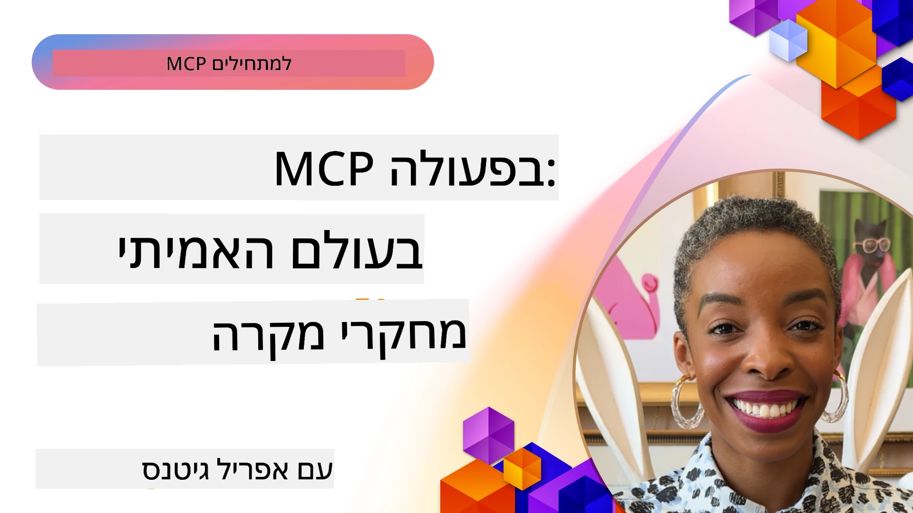

# MCP בפעולה: מחקרי מקרה מהעולם האמיתי

_(לחץ על התמונה למעלה לצפייה בסרטון של שיעור זה)_

פרוטוקול הקשר המודלי (MCP) משנה את האופן שבו יישומי AI מתקשרים עם נתונים, כלים ושירותים. בסעיף זה מוצגים מחקרי מקרה מהעולם האמיתי שמדגימים יישומים מעשיים של MCP בתרחישים ארגוניים מגוונים.

## סקירה כללית

בסעיף זה מוצגים דוגמאות קונקרטיות של יישומי MCP, המדגישות כיצד ארגונים מנצלים את הפרוטוקול הזה לפתרון אתגרים עסקיים מורכבים. באמצעות בחינת מחקרי מקרה אלה, תקבלו תובנות על גמישות, מדרגיות והיתרונות המעשיים של MCP בתרחישים מהעולם האמיתי.

## מטרות למידה מרכזיות

בחקירת מחקרי מקרה אלה, תלמדו:

- להבין כיצד ניתן ליישם את MCP לפתרון בעיות עסקיות ספציפיות
- ללמוד על דפוסי אינטגרציה שונים וגישות ארכיטקטוניות
- להכיר שיטות עבודה מומלצות ליישום MCP בסביבות ארגוניות
- לקבל תובנות על האתגרים והפתרונות שהופיעו ביישומים מהעולם האמיתי
- לזהות הזדמנויות ליישם דפוסים דומים בפרויקטים שלכם

## מחקרי מקרה מובלטים

### 1. [סוכני נסיעות מבוססי Azure AI – יישום התייחסות](./travelagentsample.md)

מחקר מקרה זה בוחן את הפתרון ההפניה המקיף של Microsoft המדגים כיצד לבנות אפליקציית תכנון נסיעה במערכת רב-סוכנית מבוססת AI באמצעות MCP, Azure OpenAI ו-Azure AI Search. הפרויקט מציג:

- תזמור רב-סוכני דרך MCP  
- אינטגרציה של נתוני ארגון עם Azure AI Search  
- ארכיטקטורה מאובטחת ומדרגית באמצעות שירותי Azure  
- כלי הרחבה עם רכיבי MCP לשימוש חוזר  
- חווית משתמש שיחתית מונעת על ידי Azure OpenAI

הארכיטקטורה ופרטי היישום מספקים תובנות חשובות לבניית מערכות רב-סוכניות מורכבות עם MCP כשכבת התיאום.

### 2. [עדכון פריטי Azure DevOps מנתונים מיוטיוב](./UpdateADOItemsFromYT.md)

מחקר מקרה זה מדגים יישום מעשי של MCP לאוטומציה של תהליכי עבודה. הוא מראה כיצד ניתן להשתמש בכלי MCP כדי:

- לחלץ נתונים מפלטפורמות מקוונות (YouTube)  
- לעדכן פריטי עבודה במערכות Azure DevOps  
- ליצור תהליכי עבודה אוטומטיים הניתנים לחזרה  
- לשלב נתונים בין מערכות נפרדות

דוגמה זו ממחישה כיצד יישומי MCP פשוטים יחסית יכולים להניב שיפורי יעילות משמעותיים על ידי אוטומציה של משימות שגרתיות ושיפור עקביות הנתונים בין המערכות.

### 3. [שליפת תיעוד בזמן אמת עם MCP](./docs-mcp/README.md)

מחקר מקרה זה מדריך אותך כיצד להתחבר לשרת Model Context Protocol (MCP) באמצעות לקוח Python להשלפת תיעוד Microsoft בזמן אמת, בהקשר-aware. תלמד כיצד:

- להתחבר לשרת MCP עם לקוח Python ו-SDK הרישמי של MCP  
- להשתמש בלקוחות HTTP בזרם לייעול השליפה בזמן אמת  
- לקרוא לכלי תיעוד בשרת ולרשום תגובות ישירות למסוף  
- לשלב תיעוד מעודכן של Microsoft לתוך זרימת העבודה ללא יציאה מהטרמינל

הפרק כולל משימה מעשית, דוגמת קוד מינימלית וקישורים למשאבים נוספים ללמידה מעמיקה יותר. ראה את ההובלה המלאה והקוד בפרק המקושר להבנה כיצד MCP יכול לשנות את הגישה לתיעוד ואת פרודוקטיביות המפתחים בסביבת הקונסול.

### 4. [אפליקציית ווב אינטראקטיבית ליצירת תוכנית לימודים עם MCP](./docs-mcp/README.md)

מחקר זה מדגים כיצד לבנות אפליקציית ווב אינטראקטיבית באמצעות Chainlit ו-Model Context Protocol (MCP) ליצירת תוכניות לימודים מותאמות אישית לכל נושא. המשתמשים יכולים לציין נושא (כגון "AI-900 certification") ומשך לימודים (למשל, 8 שבועות), והאפליקציה תספק חלוקה שבוע-בשבוע של תכנים מומלצים. Chainlit מאפשרת ממשק שיחה קולח ומותאם.

- אפליקציית ווב שיחתית מונעת על ידי Chainlit  
- דרישות משתמש לנושא ומשך  
- המלצות תוכן שבוע-בשבוע באמצעות MCP  
- תגובות בזמן אמת, מתאימות בממשק צ'אט  

הפרויקט ממחיש כיצד ניתן לשלב AI שיחתית ו-MCP ליצירת כלים חינוכיים דינמיים ומונעי משתמש בסביבת ווב מודרנית.

### 5. [תיעוד בתוך העורך עם MCP Server ב-VS Code](./docs-mcp/README.md)

מחקר מקרה זה מראה כיצד ניתן להביא את Microsoft Learn Docs ישירות לסביבת VS Code שלך באמצעות שרת MCP—בלי להחליף לשוניות בדפדפן! תראה כיצד:

- לחפש ולקרוא תיעוד בתוך VS Code באמצעות לוח MCP או פלטת הפקודות  
- להפנות לתיעוד ולהכניס קישורים ישירות לקובצי README או קורס  
- להשתמש ב-GitHub Copilot וב-MCP יחד לזרימות עבודה חלקות עם AI לתיעוד וקוד  
- לאמת ולשפר את התיעוד עם משוב בזמן אמת ודיוק מבוסס Microsoft  
- לשלב את MCP עם זרימות עבודה ב-GitHub לאימות תיעוד רציף  

היישום כולל:

- תצורת `.vscode/mcp.json` לדוגמה להקמה קלה  
- הליכות מבוססות צילומי מסך של חוויית העורך  
- טיפים לשילוב Copilot ו-MCP לפרודוקטיביות מקסימלית  

תרחיש זה אידיאלי למחברי קורסים, כותבי תיעוד ומפתחים שרוצים להישאר ממוקדים בעורך תוך עבודה עם תיעוד, Copilot וכלי אימות—כל זאת באמצעות MCP.

### 6. [יצירת שרת MCP ב-APIM](./apimsample.md)

מחקר מקרה זה מספק מדריך שלב אחר שלב ליצירת שרת MCP באמצעות Azure API Management (APIM). הוא מכסה:

- הקמת שרת MCP ב-Azure API Management  
- חשיפת פעולות API ככלי MCP  
- קביעת מדיניות להגבלת תעבורה ואבטחה  
- בדיקת שרת MCP באמצעות Visual Studio Code ו-GitHub Copilot  

דוגמה זו ממחישה כיצד לנצל את יכולות Azure ליצירת שרת MCP יציב שניתן להשתמש בו ביישומים שונים, המשפר את האינטגרציה של מערכות AI עם API ארגוניים.

### 7. [רישום MCP של GitHub — האצת אינטגרציה סוכנית](https://github.com/mcp)

מחקר מקרה זה בוחן כיצד רישום MCP של GitHub, שהושק בספטמבר 2025, מטפל באתגר קריטי באקוסיסטם של AI: גילוי ופריסה מפורמטים של שרתי Model Context Protocol (MCP).

#### סקירה כללית  
**רישום MCP** פותר את הכאב הגובר של פיזור שרתי MCP בין מאגרים ורישומים, שהאטו וגרמו לשגיאות באינטגרציה. שרתים אלו מאפשרים לסוכני AI לתקשר עם מערכות חיצוניות כמו API, מאגרי מידע ומקורות תיעוד.

#### הצגת הבעיה  
מפתחים שבונים זרימות עבודה סוכניות התמודדו עם אתגרים:  
- **קושי בגילוי** שרתי MCP בפלטפורמות שונות  
- **שאלות התקנה חוזרות** בפורומים ותיעוד  
- **סיכוני אבטחה** ממקורות לא מאומתים ובלתי מהימנים  
- **חוסר סטנדרטיזציה** באיכות ותקינות השרתים  

#### ארכיטקטורת פתרון  
רישום MCP של GitHub מרכז שרתי MCP מהימנים עם מאפיינים מרכזיים:  
- **התקנה בלחיצת כפתור** דרך VS Code להתקנה חלקה  
- **מיון אות מתוך הרעש** לפי כוכבים, פעילות ואימות קהילתי  
- **אינטגרציה ישירה** עם GitHub Copilot וכלי MCP תואמים נוספים  
- **מודל תרומה פתוח** מאפשר קהילה ושותפי ארגון לתרום  

#### השפעה עסקית  
הרישום סיפק שיפורים מדידים:  
- **קבלת משתמשים מהירה יותר** עם כלים כמו Microsoft Learn MCP Server, הזורם תיעוד רשמי ישירות לסוכנים  
- **שיפור פרודוקטיביות** בעזרת שרתים ייעודיים כמו `github-mcp-server`, המספקים אוטומציה שפתית טבעית ב-GitHub (יצירת PR, הרצת CI מחדש, סריקת קוד)  
- **אמון חזק יותר באקוסיסטם** עם רישומים מובחרים וסטנדרטים שקופים  

#### ערך אסטרטגי  
לעוסקים בניהול מחזור חיי סוכנים וזרימות עבודה ברות שחזור, רישום MCP מספק:  
- **יכולת פריסת סוכנים מודולרית** עם רכיבים סטנדרטיים  
- **צינורות הערכה בגיבוי הרישום** לבדיקות ואימות עקבי  
- **אינטראופרטביליות בין כלים** לשילוב חלק בין פלטפורמות AI שונות  

מחקר מקרה זה מדגים שרישום MCP הוא יותר מהורדה בלבד—זו פלטפורמה בסיסית לאינטגרציה מדרגית של מודלים ופריסת מערכות סוכניות.

## סיכום

שבע מחקרי מקרה מקיפים אלה מדגימים את הגמישות המרשימה והיישומים המעשיים של פרוטוקול הקשר המודלי במגוון תרחישים מהעולם האמיתי. ממערכות תכנון נסיעה רב-סוכניות מורכבות וניהול API ארגוני ועד לזרימות עבודה לתיעוד משופרות ורישום MCP החדשני של GitHub, הדוגמאות מדגימות כיצד MCP מספק דרך סטנדרטית ומדרגית לחיבור מערכות AI עם הכלים, הנתונים והשירותים הנדרשים להענקת ערך יוצא דופן.

מחקרי המקרה נוגעים בממדים שונים של יישום MCP:  
- **אינטגרציה ארגונית**: ניהול API באז'ור ואוטומציה ב-Azure DevOps  
- **תזמור רב-סוכני**: תכנון נסיעות עם סוכני AI מתואמים  
- **פרודוקטיביות מפתחים**: אינטגרציית VS Code וגישה לתיעוד בזמן אמת  
- **פיתוח אקוסיסטם**: רישום MCP של GitHub כפלטפורמה מבוססת  
- **יישומים חינוכיים**: מחוללי תוכניות לימוד אינטראקטיביים וממשקי שיחה  

בלמידת היישומים האלה, תרכשו תובנות קריטיות על:  
- **דפוסי ארכיטקטורה** בסקאלות ושימושים שונים  
- **אסטרטגיות יישום** שמאזנות פונקציונליות ותחזוקה  
- **אבטחה ומדרגיות** לפריסות ייצור  
- **שיטות עבודה מומלצות** לפיתוח שרתי MCP ואינטגרציה עם לקוחות  
- **חשיבה אקוסיסטמית** לבניית פתרונות AI מקושרים ומנוהלים  

דוגמאות אלו מדגימות במשותף כי MCP אינו רק מסגרת תיאורטית, אלא פרוטוקול בוגר ומוכן לפרודקשן המאפשר פתרונות מעשיים לאתגרים עסקיים מורכבים. בין שאתה בונה כלי אוטומציה פשוטים או מערכות רב-סוכניות משוכללות, הדפוסים והגישות המוצגים כאן מספקים בסיס איתן לפרויקטים שלך עם MCP.

## משאבים נוספים

- [מאגר GitHub של סוכני נסיעות Azure AI](https://github.com/Azure-Samples/azure-ai-travel-agents)  
- [כלי MCP ל-Azure DevOps](https://github.com/microsoft/azure-devops-mcp)  
- [כלי MCP ל-Playwright](https://github.com/microsoft/playwright-mcp)  
- [שרת MCP לתיעוד Microsoft](https://github.com/MicrosoftDocs/mcp)  
- [רישום MCP של GitHub — האצת אינטגרציה סוכנית](https://github.com/mcp)  
- [דוגמאות קהילת MCP](https://github.com/microsoft/mcp)  

## מה הלאה

- קודם: [מודול 8: שיטות עבודה מומלצות](../08-BestPractices/README.md)  
- הבא: [מודול 10: ייעול זרימות עבודה ב-AI: בניית שרת MCP עם כלי AI](../10-StreamliningAIWorkflowsBuildingAnMCPServerWithAIToolkit/README.md)

---

<!-- CO-OP TRANSLATOR DISCLAIMER START -->
**כתב ויתור**:  
מסמך זה תורגם באמצעות שירות תרגום מבוסס בינה מלאכותית [Co-op Translator](https://github.com/Azure/co-op-translator). אף שאנו שואפים לדיוק, יש לקחת בחשבון שתרגומים אוטומטיים עלולים להכיל שגיאות או אי-דיוקים. המסמך המקורי בשפת המקור שלו הוא המקור הסמכותי. עבור מידע קריטי, מומלץ להשתמש בתרגום מקצועי על ידי מתרגם אנושי. איננו אחראים על אי-הבנות או פרשנויות שגויות הנובעות משימוש בתרגום זה.
<!-- CO-OP TRANSLATOR DISCLAIMER END -->