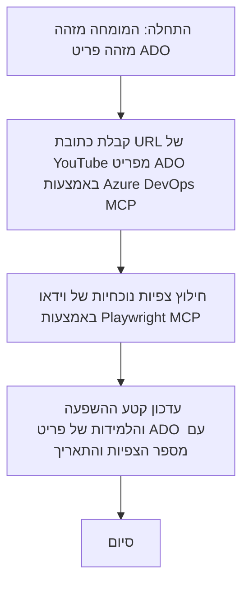

# מקרה בוחן: עדכון פריטי Azure DevOps מנתוני YouTube עם MCP

> **כתב ויתור:** קיימים כלים ודוחות מקוונים שיכולים לאוטומט את תהליך עדכון פריטי Azure DevOps עם נתונים מפלטפורמות כמו YouTube. התרחיש הבא מוצג כדוגמה לשימוש להמחשת כיצד ניתן ליישם כלי MCP למשימות אוטומציה ואינטגרציה.

## סקירה כללית

מקרה הבוחן הזה מדגים דוגמה אחת כיצד פרוטוקול הקשר מודל (MCP) וכליו יכולים לשמש לאוטומציה של תהליך עדכון פריטי עבודה ב-Azure DevOps (ADO) במידע שמקורו בפלטפורמות מקוונות, כגון YouTube. התרחיש המתואר הוא רק המחשה אחת של היכולות הרחבות של הכלים האלה, שניתן להתאיםן לצרכי אוטומציה דומים רבים.

בדוגמה זו, עורך דין (Advocate) עוקב אחר מושבים מקוונים באמצעות פריטי ADO, כאשר כל פריט כולל כתובת URL של סרטון YouTube. באמצעות כלי MCP, יכול ה-Advocate לשמור על פריטי ADO מעודכנים עם המדדים העדכניים של הסרטונים, כגון ספירת צפיות, בצורה חוזרת ואוטומטית. גישה זו ניתנת להכללה למקרים אחרים שבהם יש צורך לשלב מידע ממקורות מקוונים ל-ADO או למערכות אחרות.

## תרחיש

עורך דין אחראי למעקב אחר השפעת מושבים מקוונים ומעורבות הקהילה. כל מושב מתועד כפריט עבודה ב-ADO בפרויקט 'DevRel', ופריט העבודה מכיל שדה לכתובת ה-URL של סרטון YouTube. כדי לדווח במדויק על טווח ההגעה של המושב, צריך ה-Advocate לעדכן את פריט ה-ADO עם מספר הצפיות הנוכחי של הסרטון ותאריך שבו נאסף מידע זה.

## כלים בשימוש

- [Azure DevOps MCP](https://github.com/microsoft/azure-devops-mcp): מאפשר גישה מעשית ועדכונים לפריטי עבודה ב-ADO דרך MCP.
- [Playwright MCP](https://github.com/microsoft/playwright-mcp): מאוטומט פעולות דפדפן להוצאת נתונים חיים מדפי אינטרנט, כגון סטטיסטיקות של סרטוני YouTube.

## זרימת עבודה שלב-אחר-שלב

1. **זיהוי פריט ADO**: התחילו עם מזהה פריט העבודה של ADO (למשל, 1234) בפרויקט 'DevRel'.
2. **שליפת כתובת ה-YouTube**: השתמשו בכלי Azure DevOps MCP כדי לקבל את כתובת ה-URL של YouTube מפריט העבודה.
3. **הוצאת צפיות בסרטון**: השתמשו בכלי Playwright MCP כדי לנווט לכתובת YouTube ולהוציא את מספר הצפיות העדכני.
4. **עדכון פריט ה-ADO**: רשמו את ספירת הצפיות האחרונה ואת תאריך השליפה בקטגוריית 'השפעה ולמידות' בפריט העבודה ב-ADO באמצעות כלי Azure DevOps MCP.

## דוגמת פקודה

```bash
- Work with the ADO Item ID: 1234
- The project is '2025-Awesome'
- Get the YouTube URL for the ADO item
- Use Playwright to get the current views from the YouTube video
- Update the ADO item with the current video views and the updated date of the information
```

## דיאגרמת Mermaid


## יישום טכני

- **אורקסטרה של MCP**: זרימת העבודה מנוהלת על ידי שרת MCP, המתאם שימוש בשני כלי Azure DevOps MCP ו-Playwright MCP.
- **אוטומציה**: ניתן להפעיל את התהליך ידנית או לתזמן אותו לפעול במרווחי זמן סדירים כדי לשמור על עדכון פריטי ה-ADO.
- **הרחבה**: ניתן להרחיב את הדפוס הזה לעדכון פריטי ADO עם מדדים מקוונים אחרים (כגון לייקים, תגובות) או מפלטפורמות נוספות.

## תוצאות והשפעה

- **יעילות**: מפחית את המאמץ הידני עבור אדבוייטים על ידי אוטומציה של שליפת ועדכון מדדי סרטונים.
- **דיוק**: מבטיח שפריטי ADO משקפים את הנתונים העדכניים ביותר הזמינים ממקורות מקוונים.
- **ניתנות לחזרה**: מספק זרימת עבודה הניתנת לשימוש חוזר במקרים דומים הכוללים מקורות או מדדים אחרים.

## מאגרי מידע

- [Azure DevOps MCP](https://github.com/microsoft/azure-devops-mcp)
- [Playwright MCP](https://github.com/microsoft/playwright-mcp)
- [פרוטוקול הקשר מודל (MCP)](https://modelcontextprotocol.io/)

## מה הלאה

- חזרה אל: [סקירת מקרי בוחן](./README.md)
- הבא: [שליפה בזמן אמת של תיעוד עם MCP](./docs-mcp/README.md)

---

<!-- CO-OP TRANSLATOR DISCLAIMER START -->
**הצהרת אחריות**:  
מסמך זה תורגם באמצעות שירות התרגום האוטומטי [Co-op Translator](https://github.com/Azure/co-op-translator). למרות שאנו משתדלים לשמור על דיוק, יש להכיר בכך שתרגומים אוטומטיים עלולים להכיל שגיאות או אי-דיוקים. המסמך המקורי בשפת המקור מהווה את המקור המוסמך והמהימן. למידע קריטי מומלץ להיעזר בתרגום מקצועי על ידי אדם. אין אנו אחראים לאי-הבנות או לפרשנויות שגויות הנובעות משימוש בתרגום זה.
<!-- CO-OP TRANSLATOR DISCLAIMER END -->