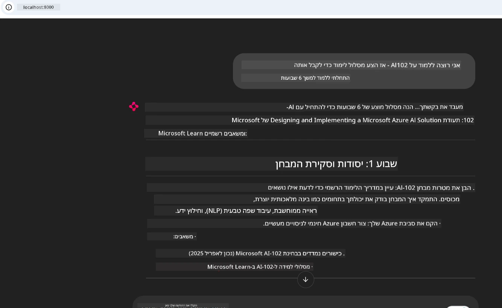

# מחקר מקרה: התחברות לשרת Microsoft Learn Docs MCP מלקוח

האם מצאת את עצמך אי פעם מתמרן בין אתרי תיעוד, Stack Overflow, וטאבים אינסופיים במנועי חיפוש, כשאתה מנסה לפתור בעיה בקוד שלך? אולי יש לך מסך שני רק לתיעוד, או שאתה כל הזמן עובר בין סביבת הפיתוח לגלישה בדפדפן. האם לא יהיה טוב יותר אם תוכל להביא את התיעוד ישירות אל סביבת העבודה שלך — משולב באפליקציות שלך, בסביבת הפיתוח, או אפילו בכלים מותאמים אישית שלך? במחקר המקרה הזה, נחקור כיצד לעשות בדיוק את זה על ידי התחברות ישירה לשרת Microsoft Learn Docs MCP מתוך אפליקציית הלקוח שלך.

## סקירה כללית

פיתוח מודרני הוא יותר מאשר כתיבת קוד — מדובר במציאת המידע הנכון בזמן הנכון. התיעוד נמצא בכל מקום, אבל לעיתים רחוקות במקום שבו הכי צריך אותו: בתוך הכלים וזרימות העבודה שלך. על ידי שילוב של אחזור תיעוד ישירות באפליקציות שלך, תוכל לחסוך זמן, להפחית את המעבר בין הקשרים, ולהגביר את היעילות. בחלק זה נציג כיצד להתחבר לשרת Microsoft Learn Docs MCP, כך שתוכל לקבל תיעוד בזמן אמת ומותאם הקשר מבלי לצאת מהאפליקציה שלך.

נעבור תהליך של הקמת החיבור, שליחת בקשה, וטיפול בתגובות סטרימינג בצורה יעילה. גישה זו לא רק מייעלת את זרימת העבודה שלך, אלא גם פותחת דלתות לבניית כלים חכמים ושימושיים יותר למפתחים.

## מטרות למידה

מדוע אנו עושים זאת? כי חוויות מפתחים הטובות ביותר הן אלה שמפחיתות חיכוך. דמיין עולם שבו עורך הקוד, צ'אטבוט או אפליקציית האינטרנט שלך יכולים לענות מיד על שאלות תיעוד, באמצעות התוכן העדכני ביותר מ-Microsoft Learn. בסיום פרק זה, תדע כיצד:

- להבין את יסודות התקשורת בין שרת ללקוח של MCP לתיעוד
- ליישם אפליקציה בקונסולה או אפליקציית ווב שמתחברת לשרת Microsoft Learn Docs MCP
- להשתמש בלקוחות HTTP סטרימינג לקבלת תיעוד בזמן אמת
- לרשום ולהסביר תגובות תיעוד באפליקציה שלך

תראה כיצד הכישורים האלו יכולים לעזור לך לבנות כלים שהם לא רק תגובתיים, אלא אינטראקטיביים ומותאמים להקשר.

## תרחיש 1 - אחזור תיעוד בזמן אמת עם MCP

בתרחיש זה נראה לך כיצד להתחבר לשרת Microsoft Learn Docs MCP, כך שתוכל לגשת לתיעוד בזמן אמת, המותאם להקשר, מבלי לעזוב את האפליקציה שלך.

בוא נעמיד את זה לפרקטיקה. המשימה שלך היא לכתוב אפליקציה שמתחברת לשרת Microsoft Learn Docs MCP, מפעילה את הכלי `microsoft_docs_search`, ורושמת את תגובת הסטרימינג לקונסולה.

### למה הגישה הזו?
כי זו הבסיס לבניית אינטגרציות מתקדמות יותר — בין אם אתה רוצה להניע צ'אטבוט, תוסף IDE, או לוח בקרה אינטרנטי.

תמצא את הקוד וההוראות לתרחיש זה בתיקיית [`solution`](./solution/README.md) שבתוך מחקר המקרה. השלבים ינחו אותך כיצד להגדיר את החיבור:
- להשתמש ב-SDK הרשמי של MCP ולקוח HTTP סטרימינג לחיבור
- לקרוא לכלי `microsoft_docs_search` עם פרמטר שאלה לקבלת התיעוד
- ליישם רישום נכון וטיפול בשגיאות
- ליצור ממשק אינטראקטיבי בקונסולה שיאפשר למשתמשים להזין שאילתות חיפוש מרובות

תרחיש זה ממחיש כיצד:
- להתחבר לשרת Docs MCP
- לשלוח שאילתה
- לפרש ולהדפיס את התוצאות

כך עשוי להיראות הרצת הפתרון:

```
Prompt> What is Azure Key Vault?
Answer> Azure Key Vault is a cloud service for securely storing and accessing secrets. ...
```

להלן דוגמת פתרון מינימלית. הקוד המלא והפרטים זמינים בתיקיית הפתרון.

<details>
<summary>פייתון</summary>

```python
import asyncio
from mcp.client.streamable_http import streamablehttp_client
from mcp import ClientSession

async def main():
    async with streamablehttp_client("https://learn.microsoft.com/api/mcp") as (read_stream, write_stream, _):
        async with ClientSession(read_stream, write_stream) as session:
            await session.initialize()
            result = await session.call_tool("microsoft_docs_search", {"query": "Azure Functions best practices"})
            print(result.content)

if __name__ == "__main__":
    asyncio.run(main())
```

- למימוש ורישום מלאים, ראו את [`scenario1.py`](../../../../09-CaseStudy/docs-mcp/solution/python/scenario1.py).
- להוראות התקנה ושימוש, ראו את קובץ [`README.md`](./solution/python/README.md) באותה תיקייה.
</details>

## תרחיש 2 - אפליקציית ווב אינטראקטיבית לייצור תוכנית לימודים עם MCP

בתרחיש זה תלמד כיצד לשלב Docs MCP בפרויקט פיתוח ווב. המטרה היא לאפשר למשתמשים לחפש תיעוד מ-Microsoft Learn ישירות מממשק ווב, כך שהתיעוד יהיה נגיש מיד בתוך האפליקציה או האתר שלך.

תראה כיצד:
- להגדיר אפליקציית ווב
- להתחבר לשרת Docs MCP
- לטפל בקלט משתמש ולהציג תוצאות

כך עשוי להיראות הרצת הפתרון:

```
User> I want to learn about AI102 - so suggest the roadmap to get it started from learn for 6 weeks

Assistant> Here’s a detailed 6-week roadmap to start your preparation for the AI-102: Designing and Implementing a Microsoft Azure AI Solution certification, using official Microsoft resources and focusing on exam skills areas:

---
## Week 1: Introduction & Fundamentals
- **Understand the Exam**: Review the [AI-102 exam skills outline](https://learn.microsoft.com/en-us/credentials/certifications/exams/ai-102/).
- **Set up Azure**: Sign up for a free Azure account if you don't have one.
- **Learning Path**: [Introduction to Azure AI services](https://learn.microsoft.com/en-us/training/modules/intro-to-azure-ai/)
- **Focus**: Get familiar with Azure portal, AI capabilities, and necessary tools.

....more weeks of the roadmap...

Let me know if you want module-specific recommendations or need more customized weekly tasks!
```

להלן דוגמת פתרון מינימלית. הקוד המלא והפרטים זמינים בתיקיית הפתרון.



<details>
<summary>פייתון (Chainlit)</summary>

Chainlit הוא מסגרת לבניית אפליקציות ווב מבוססות שיח מבוסס AI. הוא מקל על יצירת צ'אטבוטים ואסיסטנטים אינטראקטיביים שיכולים לקרוא לכלי MCP ולהציג תוצאות בזמן אמת. הוא אידיאלי לפרוטוטייפים מהירים וממשקים ידידותיים למשתמש.

```python
import chainlit as cl
import requests

MCP_URL = "https://learn.microsoft.com/api/mcp"

@cl.on_message
def handle_message(message):
    query = {"question": message}
    response = requests.post(MCP_URL, json=query)
    if response.ok:
        result = response.json()
        cl.Message(content=result.get("answer", "No answer found.")).send()
    else:
        cl.Message(content="Error: " + response.text).send()
```

- למימוש מלא, ראו את [`scenario2.py`](../../../../09-CaseStudy/docs-mcp/solution/python/scenario2.py).
- להוראות התקנה והרצה, ראו את [`README.md`](./solution/python/README.md).
</details>

## תרחיש 3: תיעוד בתוך עורך עם שרת MCP ב-VS Code

אם ברצונך לקבל את תיעוד Microsoft Learn ישירות בתוך VS Code (במקום לעבור בין טאבים בדפדפן), תוכל להשתמש בשרת MCP בתוך העורך שלך. זה מאפשר לך:
- לחפש ולקרוא תיעוד ב-VS Code מבלי לצאת מסביבת הקידוד שלך.
- להפנות לתיעוד ולשלב קישורים ישירות בקבצי README או קורסים.
- לנצל את GitHub Copilot ו-MCP יחד עבור זרימת עבודה חלקה ומונעת בינה מלאכותית.

**תראה כיצד:**
- להוסיף קובץ תקף `.vscode/mcp.json` לשורש סביבת העבודה שלך (ראו דוגמה למטה).
- לפתוח את הפאנל של MCP או להשתמש בפלטת הפקודות ב-VS Code בשביל לחפש ולשלב תיעוד.
- להפנות לתיעוד ישירות בקבצי Markdown בזמן שאתה עובד.
- לשלב את זרימת העבודה עם GitHub Copilot להגדלת הפרודוקטיביות.

הנה דוגמה כיצד להגדיר את שרת MCP ב-VS Code:

```json
{
  "servers": {
    "LearnDocsMCP": {
      "url": "https://learn.microsoft.com/api/mcp"
    }
  }
}
```

</details>

> לפרטי מדריך צעד-אחר-צעד עם צילומי מסך, ראו את [`README.md`](./solution/scenario3/README.md).


גישה זו אידיאלית לכל מי שבונה קורסים טכניים, כותב תיעוד או מפתח קוד עם צורך תדיר בהפניות.

## נקודות מרכזיות

שילוב תיעוד ישירות בכלים שלך הוא לא רק נוחות — זו מהפכה ליעילות. על ידי חיבור לשרת Microsoft Learn Docs MCP מלקוח שלך, תוכל:

- לבטל את המעבר בין הקוד לבין התיעוד
- לקבל תיעוד מעודכן ומותאם הקשר בזמן אמת
- לבנות כלים חכמים, אינטראקטיביים ומותאמים יותר למפתחים

הכישורים האלו יעזרו לך ליצור פתרונות שהם לא רק יעילים, אלא גם נעימים לשימוש.

## משאבים נוספים

להעמקת ההבנה שלך, חקור את המשאבים הרשמיים הללו:

- [Microsoft Learn Docs MCP Server (GitHub)](https://github.com/MicrosoftDocs/mcp)
- [התחל עם Azure MCP Server (mcp-python)](https://learn.microsoft.com/en-us/azure/developer/azure-mcp-server/get-started#create-the-python-app)
- [מהו Azure MCP Server?](https://learn.microsoft.com/en-us/azure/developer/azure-mcp-server/)
- [הקדמה לפרוטוקול הקשר מודל (MCP)](https://modelcontextprotocol.io/introduction)
- [הוסף תוספים משרת MCP (פייתון)](https://learn.microsoft.com/en-us/semantic-kernel/concepts/plugins/adding-mcp-plugins)

## מה הלאה

- חזרה אל: [סקירת מחקרים](../README.md)
- המשך אל: [מודול 10: ייעול זרימות עבודה של AI עם ערכת כלים של AI](../../10-StreamliningAIWorkflowsBuildingAnMCPServerWithAIToolkit/README.md)

---

<!-- CO-OP TRANSLATOR DISCLAIMER START -->
**כתב ויתור**:  
מסמך זה תורגם באמצעות שירות תרגום מבוסס בינה מלאכותית [Co-op Translator](https://github.com/Azure/co-op-translator). למרות שאנו שואפים לדיוק, יש לקחת בחשבון כי תרגומים אוטומטיים עלולים לכלול שגיאות או אי-דיוקים. המסמך המקורי בשפת המקור שלו נחשב למקור הסמכותי. למידע קריטי מומלץ לפנות לתרגום מקצועי על ידי בני אדם. איננו נושאים באחריות לכל אי-הבנות או פרשנויות שגויות הנובעות משימוש בתרגום זה.
<!-- CO-OP TRANSLATOR DISCLAIMER END -->