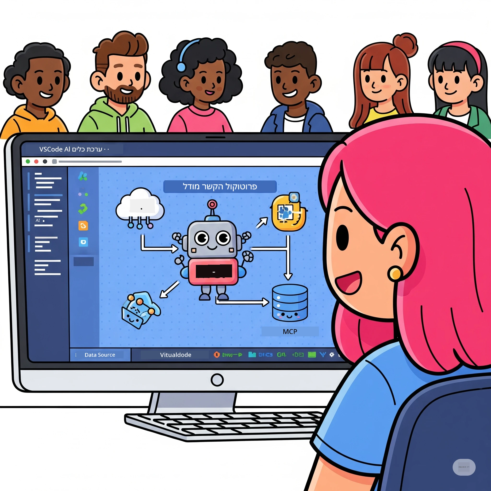
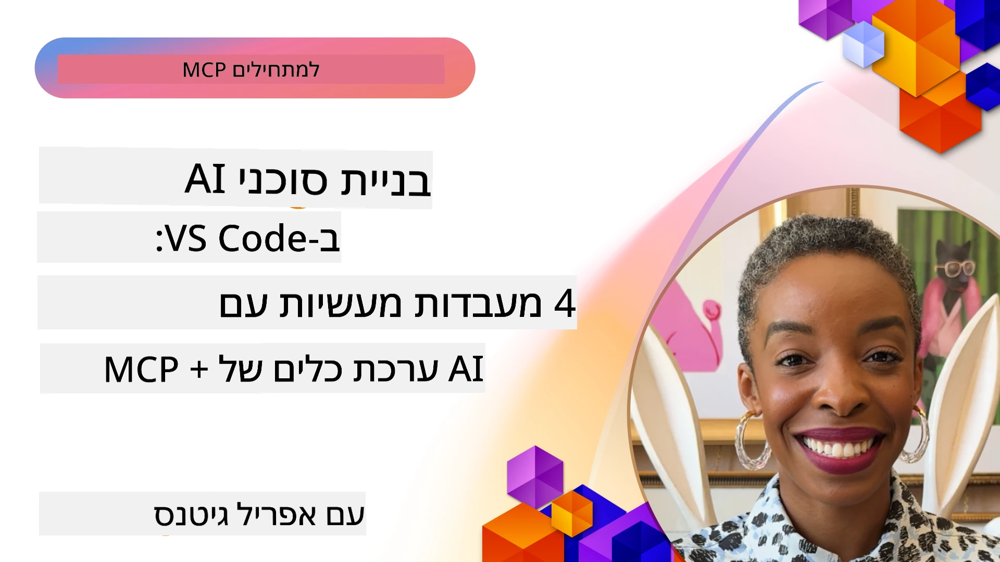

# ייעול זרימות עבודה בינה מלאכותית: בניית שרת MCP עם ערכת כלים לבינה מלאכותית

## 🎯 סקירה כללית

_(לחצו על התמונה למעלה לצפייה בסרטון של השיעור)_

ברוכים הבאים ל-**הסדנה של פרוטוקול הקשר מודל (MCP)**! סדנת עבודה מעשית ומקיפה זו משלבת שתי טכנולוגיות מתקדמות לשינוי מהפכני בפיתוח יישומי בינה מלאכותית:

- **🔗 פרוטוקול הקשר מודל (MCP)**: תקן פתוח לאינטגרציה חסרת תפרים בין כלי בינה מלאכותית
- **🛠️ ערכת כלים לבינה מלאכותית עבור Visual Studio Code (AITK)**: תוסף הפיתוח החזק של מיקרוסופט לבינה מלאכותית

### 🎓 מה תלמדו

בסיום הסדנה, תשלוטו באמנות בניית יישומים חכמים המחברים מודלים של בינה מלאכותית עם כלים ושירותים מהעולם האמיתי. מבדיקות אוטומטיות ועד אינטגרציות API מותאמות, תרכשו מיומנויות מעשיות לפתרון אתגרים עסקיים מורכבים.

## 🏗️ מערך טכנולוגי

### 🔌 פרוטוקול הקשר מודל (MCP)

MCP הוא ה-**"USB-C של הבינה המלאכותית"** - תקן אוניברסלי שמחבר בין מודלי בינה מלאכותית לכלים ולמקורות נתונים חיצוניים.

**✨ תכונות מרכזיות:**

- 🔄 **אינטגרציה סטנדרטית:** ממשק אוניברסלי לחיבור כלי בינה מלאכותית
- 🏛️ **ארכיטקטורה גמישה:** שרתים מקומיים ומרוחקים באמצעות סטדיו/SSE
- 🧰 **אקוסיסטם עשיר:** כלים, פקודות ומשאבים בפרוטוקול אחד
- 🔒 **מוכנות ארגונית:** אבטחה ואמינות מובנות

**🎯 למה MCP חשוב:**
בדיוק כפי ש-USB-C ביטל את העומס בכבלים, MCP מבטל את המורכבות של אינטגרציות בינה מלאכותית. פרוטוקול אחד, אינסוף אפשרויות.

### 🤖 ערכת כלים לבינה מלאכותית עבור Visual Studio Code (AITK)

תוסף הדגל של מיקרוסופט לפיתוח בינה מלאכותית המהפך את VS Code למרכז כוח AI.

**🚀 יכולות מרכזיות:**

- 📦 **קטלוג מודלים:** גישה למודלים מ-Azure AI, GitHub, Hugging Face, Ollama
- ⚡ **הסקה מקומית:** ביצוע אופטימלי ב-CPU/GPU/NPU עם ONNX
- 🏗️ **בונה סוכנים:** פיתוח סוכני בינה מלאכותית ויזואלי עם אינטגרציית MCP
- 🎭 **רב מודלי:** תמיכה בטקסט, ויזואליה ותוצרים מובנים

**💡 יתרונות פיתוח:**

- פריסת מודלים ללא הגדרות
- הנדסת פקודות ויזואלית
- סביבת בדיקות בזמן אמת
- אינטגרציה חלקה עם שרת MCP

## 📚 מסלול למידה

### [🚀 מודול 1: יסודות ערכת כלים לבינה מלאכותית](./lab1/README.md)

**משך:** 15 דקות

- 🛠️ התקנה וקונפיגורציה של ערכת הכלים לבינה מלאכותית עבור VS Code
- 🗂️ חקירת קטלוג המודלים (מעל 100 מודלים מ-GitHub, ONNX, OpenAI, Anthropic, Google)
- 🎮 שליטה ב-Interactive Playground לבחינת מודלים בזמן אמת
- 🤖 בניית סוכן הבינה מלאכותית הראשון עם בונה סוכנים
- 📊 הערכת ביצועי מודלים עם מדדים מובנים (F1, רלוונטיות, דמיון, קוהרנטיות)
- ⚡ למידה על עיבוד מחולק ותמיכת רב מודל

**🎯 תוצאה:** יצירת סוכן בינה מלאכותית פונקציונלי עם הבנה מעמיקה של יכולות AITK

### [🌐 מודול 2: יסודות MCP עם ערכת כלים לבינה מלאכותית](./lab2/README.md)

**משך:** 20 דקות

- 🧠 שליטה בארכיטקטורה ובמושגים של פרוטוקול הקשר מודל (MCP)
- 🌐 חקירת אקוסיסטם שרתי MCP של מיקרוסופט
- 🤖 בניית סוכן אוטומציה לדפדפן באמצעות שרת MCP Playwright
- 🔧 אינטגרציה של שרתי MCP עם בונה סוכני AI Toolkit
- 📊 קונפיגורציה ובדיקה של כלי MCP בסוכנים שלכם
- 🚀 ייצוא ופריסת סוכני MCP לשימוש בייצור

**🎯 תוצאה:** פריסת סוכן AI מחוזק עם כלים חיצוניים דרך MCP

### [🔧 מודול 3: פיתוח מתקדם של MCP עם ערכת כלים לבינה מלאכותית](./lab3/README.md)

**משך:** 20 דקות

- 💻 יצירת שרתי MCP מותאמים אישית באמצעות AI Toolkit
- 🐍 קונפיגורציה ושימוש בערכת הפיתוח MCP Python SDK (v1.9.3)
- 🔍 הקמה ושימוש ב-MCP Inspector לדיבוג
- 🛠️ בניית שרת מזג אוויר MCP עם תהליכי דיבוג מקצועיים
- 🧪 דיבוג שרתי MCP בסביבות בונה סוכנים ו-Inspector

**🎯 תוצאה:** פיתוח ודיבוג של שרתי MCP מותאמים עם כלים מודרניים

### [🐙 מודול 4: פיתוח מעשי של MCP - שרת שיבוט GitHub מותאם אישית](./lab4/README.md)

**משך:** 30 דקות

- 🏗️ בניית שרת GitHub Clone אמיתי לזרימות עבודה בפיתוח
- 🔄 יישום שיבוט חכם עם בדיקות ולכידת שגיאות
- 📁 יצירת ניהול תיקיות אינטיליגנטי ואינטגרציה עם VS Code
- 🤖 שימוש במצב סוכן GitHub Copilot עם כלי MCP מותאמים
- 🛡️ יישום אמינות מוכנה לייצור ותאימות חד-פלטפורמית

**🎯 תוצאה:** פריסת שרת MCP מוכן לייצור שמייעל זרימות עבודה אמיתיות בפיתוח

## 💡 יישומים והשפעות מהעולם האמיתי

### 🏢 מקרי שימוש ארגוניים

#### 🔄 אוטומציה בתפעול DevOps

שדרוג זרימות הפיתוח באוטומציה חכמה:

- **ניהול מאגרי חכמה:** סקירת קוד והחלטות מיזוג מונעות בינה מלאכותית
- **CI/CD אינטיליגנטי:** אופטימיזציה אוטומטית של צינורות מבוססת שינויים בקוד
- **טיראציה של תקלות:** סיווג אוטומטי והקצאת באגים

#### 🧪 מהפכת אבטחת איכות

שיפור הבדיקות באוטומציה מבוססת AI:

- **יצירת מבחנים אינטיליגנטית:** הפקת ערכות בדיקה מקיפות באופן אוטומטי
- **בדיקות ויזואליות לרגרסיה:** זיהוי שינויים בממשק משתמש עם בינה מלאכותית
- **מעקב ביצועים:** זיהוי מוקדם של בעיות ופתרונן

#### 📊 אינטיליגנציה בנתיבי נתונים

בניית זרימות עבודה מתוחכמות לעיבוד נתונים:

- **תהליכי ETL אדפטיביים:** טרנספורמציות נתונים משפרות עצמם
- **זיהוי חריגות:** ניטור איכות נתונים בזמן אמת
- **ניתוב חכם:** ניהול זרימת נתונים אינטיליגנטי

#### 🎧 שיפור חווית הלקוח

יצירת אינטראקציות יוצאות דופן עם לקוחות:

- **תמיכה מודעת להקשר:** סוכני AI עם גישה להיסטוריית הלקוח
- **פתרון בעיות פרואקטיבי:** שירות לקוחות חזוי
- **אינטגרציה רב-ערוצית:** חווית AI מאוחדת בפלטפורמות שונות

## 🛠️ דרישות מוקדמות והגדרות

### 💻 דרישות מערכת

| רכיב        | דרישות       | הערות                   |
|-------------|--------------|-------------------------|
| **מערכת הפעלה** | Windows 10+, macOS 10.15+, Linux | כל מערכת הפעלה מודרנית |
| **Visual Studio Code** | הגרסה היציבה העדכנית ביותר | דרוש ל-AITK           |
| **Node.js**   | גרסה 18.0+ ו-npm | לפיתוח שרת MCP       |
| **Python**    | 3.10+         | אופציונלי לשרתי MCP בפייתון |
| **זיכרון**   | מינימום 8GB RAM | מומלץ 16GB למודלים מקומיים |

### 🔧 סביבת פיתוח

#### הרחבות מומלצות ל-VS Code

- **AI Toolkit** (ms-windows-ai-studio.windows-ai-studio)
- **Python** (ms-python.python)
- **Python Debugger** (ms-python.debugpy)
- **GitHub Copilot** (GitHub.copilot) - אופציונלי אך מועיל

#### כלים אופציונליים

- **uv**: מנהל חבילות פייתון מודרני
- **MCP Inspector**: כלי דיבוג ויזואלי לשרתי MCP
- **Playwright**: לדוגמאות אוטומציה באינטרנט

## 🎖️ תוצאות למידה ונתיב הסמכה

### 🏆 רשימת שליטה במיומנויות

בסיום סדנה זו, תשיגו מומחיות ב:

#### 🎯 יכולות יסוד

- [ ] **שליטה בפרוטוקול MCP:** הבנה עמוקה של ארכיטקטורה ותבניות יישום
- [ ] **אטטישות AITK:** שימוש ברמה מקצועית בערכת הכלים לבינה מלאכותית לפיתוח מהיר
- [ ] **פיתוח שרתים מותאמים אישית:** בנייה, פריסה ותחזוקה של שרתי MCP לייצור
- [ ] **מצוינות באינטגרציית כלים:** חיבור חלק של AI עם זרימות פיתוח קיימות
- [ ] **יישום פתרון בעיות:** שימוש במיומנויות שנלמדו לאתגרים עסקיים אמיתיים

#### 🔧 מיומנויות טכניות

- [ ] הקמה וקונפיגורציה של AI Toolkit ב-VS Code
- [ ] עיצוב ויישום שרתי MCP מותאמים אישית
- [ ] אינטגרציית מודלים מ-GitHub עם ארכיטקטורת MCP
- [ ] בניית זרימות בדיקות אוטומטיות עם Playwright
- [ ] פריסה של סוכני AI לשימוש בייצור
- [ ] דיבוג ואופטימיזציה של ביצועי שרת MCP

#### 🚀 יכולות מתקדמות

- [ ] ארכיטקטורות אינטגרציית AI בקנה מידה ארגוני
- [ ] יישום אמצעי אבטחה מיטביים ליישומי AI
- [ ] עיצוב ארכיטקטורות שרת MCP הניתנות להרחבה
- [ ] יצירת שרשרות כלי מותאמים לתחומים ספציפיים
- [ ] הדרכת אחרים בפיתוח יליד AI

## 📖 משאבים נוספים

- [מפרט MCP (2025-11-25)](https://spec.modelcontextprotocol.io/specification/2025-11-25/)
- [מאגר קוד AI Toolkit ב-GitHub](https://github.com/microsoft/vscode-ai-toolkit)
- [אוסף שרתי MCP לדוגמה](https://github.com/modelcontextprotocol/servers)
- [מדריך לשיטות עבודה מומלצות](https://modelcontextprotocol.io/docs/best-practices)
- [10 הראשונים של OWASP MCP](https://microsoft.github.io/mcp-azure-security-guide/mcp/) - שיטות אבטחה מומלצות

---

**🚀 מוכנים למהפכה בזרימת פיתוח ה-AI שלכם?**

בואו נבנה יחד את עתיד היישומים החכמים עם MCP ו-AI Toolkit!

## מה הלאה

המשיכו ל: [מודול 11: מעבדות מעשיות של שרת MCP](../11-MCPServerHandsOnLabs/README.md)

---

<!-- CO-OP TRANSLATOR DISCLAIMER START -->
**כתב ויתור**:
מסמך זה תורגם באמצעות שירות תרגום מבוסס בינה מלאכותית [Co-op Translator](https://github.com/Azure/co-op-translator). למרות שאנו שואפים לדייק, יש לקחת בחשבון שתרגומים אוטומטיים עלולים להכיל שגיאות או אי-דיוקים. המסמך המקורי בשפת המקור נחשב למקור הסמכותי. למידע קריטי מומלץ להיעזר בתרגום מקצועי על ידי אדם. אנו לא נשתמש באחריות על כל אי-הבנה או פרשנות שגויה הנובעת משימוש בתרגום זה.
<!-- CO-OP TRANSLATOR DISCLAIMER END -->