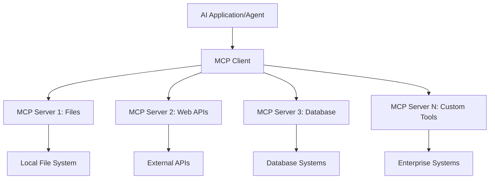

# 🌐 מודול 2: יסודות MCP עם ערכת כלים ל-AI

[]()
[]()
[]()

## 📋 מטרות הלמידה

בסיום מודול זה, תוכל:
- ✅ להבין את ארכיטקטורת Model Context Protocol (MCP) ואת היתרונות שלה
- ✅ לחקור את מערכת השרתים של MCP של מיקרוסופט
- ✅ לשלב שרתי MCP עם AI Toolkit Agent Builder
- ✅ לבנות סוכן אוטומציה לדפדפן באמצעות Playwright MCP
- ✅ להגדיר ולבדוק כלים של MCP בתוך הסוכנים שלך
- ✅ לייצא ולפרוס סוכנים המונעים על ידי MCP לשימוש בפרודקשן

## 🎯 המשך למודול 1

במודול 1 רכשנו את יסודות ערכת הכלים ל-AI ויצרנו את סוכן הפייתון הראשון שלנו. עכשיו נוכל **להעצים** את הסוכנים שלך על ידי חיבורם לכלים ושירותים חיצוניים דרך הפרוטוקול המהפכני **Model Context Protocol (MCP)**.

תחשוב על זה כעל שדרוג ממחשבון פשוט למחשב מלא – הסוכנים שלך יקבלו את היכולת:
- 🌐 לגלוש ולהתממשק עם אתרי אינטרנט
- 📁 לגשת ולנהל קבצים
- 🔧 להשתלב עם מערכות ארגוניות
- 📊 לעבד נתונים בזמן אמת מ-APIs

## 🧠 הבנת Model Context Protocol (MCP)

### 🔍 מה זה MCP?

Model Context Protocol (MCP) הוא ה"USB-C של יישומי AI" – תקן פתוח מהפכני שמחבר מודלים שפתיים גדולים (LLMs) לכלים חיצוניים, מקורות נתונים ושירותים. כמו ש-USB-C ביטל את הכאוס של כבלים על ידי מתן מחבר אוניברסלי אחד, כך MCP מפשט את האינטגרציה של AI עם פרוטוקול סטנדרטי אחד.

### 🎯 הבעיה ש-MCP פותר

**לפני MCP:**
- 🔧 אינטגרציות מותאמות אישית לכל כלי
- 🔄 תלות בספקים עם פתרונות קנייניים  
- 🔒 פרצות אבטחה מחיבורים אקראיים
- ⏱️ חודשים של פיתוח לאינטגרציות בסיסיות

**עם MCP:**
- ⚡ אינטגרציה פשוטה של כלים מוכנים לשימוש
- 🔄 ארכיטקטורה בלתי תלויה בספקים
- 🛡️ שיטות אבטחה מובנות
- 🚀 דקות להוספת יכולות חדשות

### 🏗️ מבט מעמיק על ארכיטקטורת MCP

MCP פועל במבנה **לקוח-שרת** שיוצר מערכת אקולוגית מאובטחת וניתנת להרחבה:



**🔧 רכיבים מרכזיים:**

| רכיב | תפקיד | דוגמאות |
|-----------|------|----------|
| **MCP Hosts** | יישומים שצורכים שירותי MCP | Claude Desktop, VS Code, AI Toolkit |
| **MCP Clients** | מטפלי פרוטוקול (1:1 עם שרתים) | משולבים ביישומי ה-host |
| **MCP Servers** | חושפים יכולות דרך פרוטוקול סטנדרטי | Playwright, Files, Azure, GitHub |
| **שכבת תקשורת** | שיטות תקשורת | stdio, HTTP, WebSockets |


## 🏢 מערכת שרתי MCP של מיקרוסופט

מיקרוסופט מובילה את מערכת ה-MCP עם חבילת שרתים ארגוניים מקיפה שמטפלת בצרכים עסקיים אמיתיים.

### 🌟 שרתי MCP מובילים של מיקרוסופט

#### 1. ☁️ שרת Azure MCP  
**🔗 מאגר**: [azure/azure-mcp](https://github.com/azure/azure-mcp)  
**🎯 מטרה**: ניהול משאבי Azure מקיף עם אינטגרציה ל-AI

**✨ תכונות עיקריות:**  
- פרוביזיונינג תשתיתי דקלרטיבי  
- ניטור משאבים בזמן אמת  
- המלצות לאופטימיזציית עלויות  
- בדיקת תאימות אבטחה  

**🚀 מקרים לשימוש:**  
- Infrastructure-as-Code עם סיוע AI  
- סקיילינג אוטומטי של משאבים  
- אופטימיזציית עלויות ענן  
- אוטומציה של תהליכי DevOps  

#### 2. 📊 Microsoft Dataverse MCP  
**📚 תיעוד**: [Microsoft Dataverse Integration](https://go.microsoft.com/fwlink/?linkid=2320176)  
**🎯 מטרה**: ממשק שפה טבעית לנתוני עסק

**✨ תכונות עיקריות:**  
- שאילתות שפתיות טבעיות למסדי נתונים  
- הבנת הקשר עסקי  
- תבניות פרומפט מותאמות  
- ממשל נתונים ארגוני  

**🚀 מקרים לשימוש:**  
- דוחות בינה עסקית  
- ניתוח נתוני לקוחות  
- תובנות על צינור מכירות  
- שאילתות תאימות  

#### 3. 🌐 שרת Playwright MCP  
**🔗 מאגר**: [microsoft/playwright-mcp](https://github.com/microsoft/playwright-mcp)  
**🎯 מטרה**: אוטומציה לדפדפן ויכולות אינטראקציה עם רשת

**✨ תכונות עיקריות:**  
- אוטומציה חוצת דפדפנים (Chrome, Firefox, Safari)  
- זיהוי אלמנטים חכם  
- יצירת צילומי מסך ו-PDF  
- ניטור תעבורת רשת  

**🚀 מקרים לשימוש:**  
- תהליכי בדיקה אוטומטיים  
- גרידת אתרים וחילוץ נתונים  
- ניטור UI/UX  
- אוטומציה לניתוח תחרות  

#### 4. 📁 שרת Files MCP  
**🔗 מאגר**: [microsoft/files-mcp-server](https://github.com/microsoft/files-mcp-server)  
**🎯 מטרה**: ניהול חכם של מערכת קבצים

**✨ תכונות עיקריות:**  
- ניהול קבצים דקלרטיבי  
- סינכרון תוכן  
- אינטגרציה עם בקרת גרסאות  
- חילוץ מטא-דאטה  

**🚀 מקרים לשימוש:**  
- ניהול תיעוד  
- ארגון מאגרי קוד  
- תהליכי פרסום תוכן  
- טיפול בקבצים בצינורות נתונים  

#### 5. 📝 שרת MarkItDown MCP  
**🔗 מאגר**: [microsoft/markitdown](https://github.com/microsoft/markitdown)  
**🎯 מטרה**: עיבוד ומניפולציה מתקדמת של Markdown

**✨ תכונות עיקריות:**  
- ניתוח Markdown עשיר  
- המרת פורמטים (MD ↔ HTML ↔ PDF)  
- ניתוח מבנה תוכן  
- עיבוד תבניות  

**🚀 מקרים לשימוש:**  
- תהליכי תיעוד טכני  
- מערכות ניהול תוכן  
- יצירת דוחות  
- אוטומציה של בסיסי ידע  

#### 6. 📈 שרת Clarity MCP  
**📦 חבילה**: [@microsoft/clarity-mcp-server](https://www.npmjs.com/package/@microsoft/clarity-mcp-server)  
**🎯 מטרה**: ניתוחי ווב ותובנות על התנהגות משתמשים

**✨ תכונות עיקריות:**  
- ניתוח נתוני Heatmap  
- הקלטות סשנים של משתמשים  
- מדדי ביצועים  
- ניתוח משפך המרה  

**🚀 מקרים לשימוש:**  
- אופטימיזציית אתרים  
- מחקר חוויית משתמש  
- ניתוח A/B Testing  
- לוחות בקרה לבינה עסקית  

### 🌍 מערכת אקולוגית קהילתית

מעבר לשרתי מיקרוסופט, מערכת ה-MCP כוללת:  
- **🐙 GitHub MCP**: ניהול מאגרים וניתוח קוד  
- **🗄️ Database MCPs**: אינטגרציות עם PostgreSQL, MySQL, MongoDB  
- **☁️ ספקי ענן MCPs**: כלים ל-AWS, GCP, Digital Ocean  
- **📧 תקשורת MCPs**: אינטגרציות עם Slack, Teams, Email  

## 🛠️ מעבדה מעשית: בניית סוכן אוטומציה לדפדפן

**🎯 מטרה בפרויקט**: ליצור סוכן אוטומציה חכם לדפדפן באמצעות שרת Playwright MCP שיכול לגלוש באתרים, לחלץ מידע ולבצע אינטראקציות מורכבות ברשת.

### 🚀 שלב 1: הקמת בסיס הסוכן

#### שלב 1: אתחול הסוכן שלך  
1. **פתח את AI Toolkit Agent Builder**  
2. **צור סוכן חדש** עם ההגדרות הבאות:  
   - **שם**: `BrowserAgent`  
   - **דגם**: בחר GPT-4o  


### 🔧 שלב 2: תהליך אינטגרציית MCP

#### שלב 3: הוסף אינטגרציית שרת MCP  
1. **גש לקטגוריית כלים** ב-Agent Builder  
2. **לחץ על "Add Tool"** כדי לפתוח את תפריט האינטגרציה  
3. **בחר "MCP Server"** מתוך האפשרויות הזמינות  


**🔍 הבנת סוגי כלים:**  
- **כלים מובנים**: פונקציות AI Toolkit מוגדרות מראש  
- **שרתי MCP**: אינטגרציות לשירותים חיצוניים  
- **APIs מותאמים אישית**: נקודות קצה של השירות שלך  
- **קריאת פונקציות**: גישה ישירה לפונקציות של המודל  

#### שלב 4: בחירת שרת MCP  
1. **בחר באפשרות "MCP Server"** להמשך  


2. **עיין בקטלוג MCP** כדי לבדוק את האינטגרציות הזמינות  


### 🎮 שלב 3: הגדרת Playwright MCP

#### שלב 5: בחר והגדר את Playwright  
1. **לחץ על "Use Featured MCP Servers"** כדי לגשת לשרתי מיקרוסופט המאומתים  
2. **בחר "Playwright"** מהרשימה המובחרת  
3. **אשר את מזהה ה-MCP ברירת המחדל** או התאם לסביבתך  


#### שלב 6: הפעל את יכולות Playwright  
**🔑 שלב קריטי**: בחר **את כל** שיטות Playwright הזמינות למקסימום פונקציונליות  


**🛠️ כלים חיוניים של Playwright:**  
- **ניווט**: `goto`, `goBack`, `goForward`, `reload`  
- **אינטראקציה**: `click`, `fill`, `press`, `hover`, `drag`  
- **חילוץ**: `textContent`, `innerHTML`, `getAttribute`  
- **אימות**: `isVisible`, `isEnabled`, `waitForSelector`  
- **תפיסה**: `screenshot`, `pdf`, `video`  
- **רשת**: `setExtraHTTPHeaders`, `route`, `waitForResponse`  

#### שלב 7: אמת את הצלחת האינטגרציה  
**✅ סימני הצלחה:**  
- כל הכלים מופיעים בממשק Agent Builder  
- אין הודעות שגיאה בפאנל האינטגרציה  
- סטטוס שרת Playwright מציג "Connected"  


**🔧 פתרון בעיות נפוצות:**  
- **כשל בחיבור**: בדוק את חיבור האינטרנט והגדרות חומת האש  
- **כלים חסרים**: ודא שכל היכולות נבחרו במהלך ההגדרה  
- **שגיאות הרשאה**: וודא של-VS Code יש הרשאות מערכת נדרשות  

### 🎯 שלב 4: הנדסת פרומפטים מתקדמת

#### שלב 8: עצב פרומפטים חכמים למערכת  
צור פרומפטים מתוחכמים שמנצלים את כל יכולות Playwright:

```markdown
# Web Automation Expert System Prompt

## Core Identity
You are an advanced web automation specialist with deep expertise in browser automation, web scraping, and user experience analysis. You have access to Playwright tools for comprehensive browser control.

## Capabilities & Approach
### Navigation Strategy
- Always start with screenshots to understand page layout
- Use semantic selectors (text content, labels) when possible
- Implement wait strategies for dynamic content
- Handle single-page applications (SPAs) effectively

### Error Handling
- Retry failed operations with exponential backoff
- Provide clear error descriptions and solutions
- Suggest alternative approaches when primary methods fail
- Always capture diagnostic screenshots on errors

### Data Extraction
- Extract structured data in JSON format when possible
- Provide confidence scores for extracted information
- Validate data completeness and accuracy
- Handle pagination and infinite scroll scenarios

### Reporting
- Include step-by-step execution logs
- Provide before/after screenshots for verification
- Suggest optimizations and alternative approaches
- Document any limitations or edge cases encountered

## Ethical Guidelines
- Respect robots.txt and rate limiting
- Avoid overloading target servers
- Only extract publicly available information
- Follow website terms of service
```

#### שלב 9: עצב פרומפטים דינמיים למשתמש  
עצב פרומפטים שמדגימים יכולות שונות:

**🌐 דוגמה לניתוח רשת:**  
```markdown
Navigate to github.com/kinfey and provide a comprehensive analysis including:
1. Repository structure and organization
2. Recent activity and contribution patterns  
3. Documentation quality assessment
4. Technology stack identification
5. Community engagement metrics
6. Notable projects and their purposes

Include screenshots at key steps and provide actionable insights.
```


### 🚀 שלב 5: ביצוע ובדיקה

#### שלב 10: הרץ את האוטומציה הראשונה שלך  
1. **לחץ על "Run"** כדי להפעיל את רצף האוטומציה  
2. **עקוב אחרי ביצוע בזמן אמת**:  
   - דפדפן Chrome נפתח אוטומטית  
   - הסוכן גולש לאתר היעד  
   - צילומי מסך מתועדים בכל שלב מרכזי  
   - תוצאות הניתוח זורמות בזמן אמת  


#### שלב 11: נתח תוצאות ותובנות  
סקור ניתוח מקיף בממשק Agent Builder:


### 🌟 שלב 6: יכולות מתקדמות ופריסה

#### שלב 12: ייצא ופרוס לפרודקשן  
Agent Builder תומך באפשרויות פריסה מגוונות:


## 🎓 סיכום מודול 2 ושלבים הבאים

### 🏆 הישג שהושג: מאסטר באינטגרציית MCP

**✅ מיומנויות שנרכשו:**  
- [ ] הבנת ארכיטקטורת MCP ויתרונותיה  
- [ ] ניווט במערכת שרתי MCP של מיקרוסופט  
- [ ] שילוב Playwright MCP עם AI Toolkit  
- [ ] בניית סוכני אוטומציה לדפדפן מתקדמים  
- [ ] הנדסת פרומפטים מתקדמת לאוטומציה ברשת  

### 📚 משאבים נוספים

- **🔗 מפרט MCP**: [תיעוד רשמי של הפרוטוקול](https://modelcontextprotocol.io/)  
- **🛠️ Playwright API**: [מדריך שיטות מלא](https://playwright.dev/docs/api/class-playwright)  
- **🏢 שרתי MCP של מיקרוסופט**: [מדריך אינטגרציה ארגונית](https://github.com/microsoft/mcp-servers)  
- **🌍 דוגמאות קהילתיות**: [גלריית שרתי MCP](https://github.com/modelcontextprotocol/servers)  

**🎉 כל הכבוד!** שלטת בהצלחה באינטגרציית MCP ועכשיו תוכל לבנות סוכני AI מוכנים לפרודקשן עם יכולות כלים חיצוניים!


### 🔜 המשך למודול הבא

מוכן לקחת את מיומנויות ה-MCP שלך לשלב הבא? המשך ל-**[מודול 3: פיתוח MCP מתקדם עם AI Toolkit](../lab3/README.md)** שם תלמד כיצד:  
- ליצור שרתי MCP מותאמים אישית משלך  
- להגדיר ולהשתמש ב-SDK האחרון של MCP בפייתון  
- להגדיר את MCP Inspector לצורך דיבוג  
- לשלוט בתהליכי פיתוח מתקדמים של שרתי MCP
- לבנות שרת Weather MCP מאפס

**כתב ויתור**:  
מסמך זה תורגם באמצעות שירות תרגום מבוסס בינה מלאכותית [Co-op Translator](https://github.com/Azure/co-op-translator). למרות שאנו שואפים לדיוק, יש לקחת בחשבון כי תרגומים אוטומטיים עלולים להכיל שגיאות או אי-דיוקים. המסמך המקורי בשפת המקור שלו נחשב למקור הסמכותי. למידע קריטי מומלץ להשתמש בתרגום מקצועי על ידי מתרגם אנושי. אנו לא נושאים באחריות לכל אי-הבנה או פרשנות שגויה הנובעת משימוש בתרגום זה.