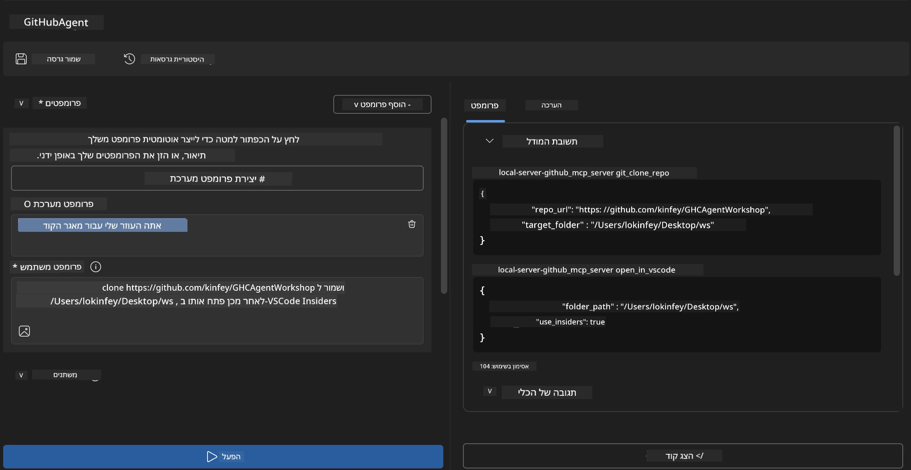
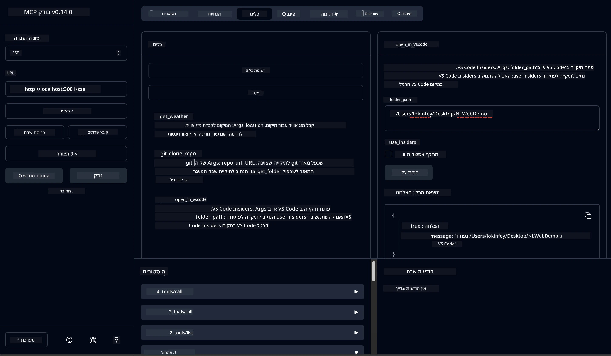

# 🐙 מודול 4: פיתוח MCP מעשי – שרת ייחודי לשכפול GitHub


> **⚡ התחלה מהירה:** בנה שרת MCP מוכן לייצור שמבצע שכפול אוטומטי של מאגרים ב-GitHub ואינטגרציה עם VS Code תוך 30 דקות בלבד!

## 🎯 מטרות למידה

בסיום המעבדה הזו תוכל:

- ✅ ליצור שרת MCP מותאם אישית לזרימות עבודה בפיתוח בעולם האמיתי  
- ✅ לממש פונקציונליות של שכפול מאגרים ב-GitHub דרך MCP  
- ✅ לשלב שרתי MCP מותאמים עם VS Code ו-Agent Builder  
- ✅ להשתמש במצב Agent של GitHub Copilot עם כלי MCP מותאמים  
- ✅ לבצע בדיקות ופריסה של שרתי MCP מותאמים בסביבות ייצור  

## 📋 דרישות מקדימות

- השלמת מעבדות 1-3 (יסודות MCP ופיתוח מתקדם)  
- מנוי ל-GitHub Copilot ([הירשם בחינם כאן](https://github.com/github-copilot/signup))  
- VS Code עם הרחבות AI Toolkit ו-GitHub Copilot  
- התקנת Git CLI וכולל תצורה  

## 🏗️ סקירת הפרויקט

### **אתגר פיתוח בעולם האמיתי**  
כמפתחים, אנו משתמשים לעיתים קרובות ב-GitHub לשכפול מאגרים ופתיחתם ב-VS Code או VS Code Insiders. התהליך הידני כולל:  
1. פתיחת טרמינל/שורת פקודה  
2. ניווט לתיקיה הרצויה  
3. הרצת פקודת `git clone`  
4. פתיחת VS Code בתיקיה המשוכפלת  

**פתרון ה-MCP שלנו מייעל את כל זה לפקודה חכמה אחת!**

### **מה תבנה**  
שרת MCP לשכפול GitHub (`git_mcp_server`) המציע:

| תכונה | תיאור | יתרון |
|---------|-------------|---------|
| 🔄 **שכפול חכם של מאגרים** | שכפול מאגרים מ-GitHub עם אימות | בדיקת שגיאות אוטומטית |
| 📁 **ניהול תיקיות אינטיליגנטי** | בדיקה ויצירת תיקיות בצורה בטוחה | מונע מחיקה לא רצויה |
| 🚀 **אינטגרציה בין-פלטפורמתית עם VS Code** | פתיחת פרויקטים ב-VS Code/Insiders | מעבר חלק בזרימת העבודה |
| 🛡️ **טיפול מוקפד בשגיאות** | טיפול בבעיות רשת, הרשאות ונתיבים | אמינות מוכנה לייצור |

---

## 📖 מימוש שלב-אחרי-שלב

### שלב 1: יצירת סוכן GitHub ב-Agent Builder

1. **הפעל את Agent Builder** דרך תוסף AI Toolkit  
2. **צור סוכן חדש** עם התצורה הבאה:  
   ```
   Agent Name: GitHubAgent
   ```
  
3. **אתחל שרת MCP מותאם אישית:**  
   - עבור ל-**כלים** → **הוסף כלי** → **שרת MCP**  
   - בחר **"צור שרת MCP חדש"**  
   - בחר תבנית Python לגמישות מירבית  
   - **שם השרת:** `git_mcp_server`  

### שלב 2: הגדרת מצב Agent עבור GitHub Copilot

1. **פתח את GitHub Copilot** ב-VS Code (Ctrl/Cmd + Shift + P → "GitHub Copilot: Open")  
2. **בחר מודל סוכן** בממשק Copilot  
3. **בחר במודל Claude 3.7** לשיפור היכולת ההיגיונית  
4. **אפשר אינטגרציית MCP** לגישה לכלים  

> **💡 טיפ מקצועי:** Claude 3.7 מספק הבנה מעמיקה יותר של זרימות עבודה בפיתוח ודפוסי טיפול בשגיאות.  

### שלב 3: מימוש פונקציונליות ליבת שרת MCP

**השתמש בדרישת הפירוט הבאה עם מצב Agent של GitHub Copilot:**  

```
Create two MCP tools with the following comprehensive requirements:

🔧 TOOL A: clone_repository
Requirements:
- Clone any GitHub repository to a specified local folder
- Return the absolute path of the successfully cloned project
- Implement comprehensive validation:
  ✓ Check if target directory already exists (return error if exists)
  ✓ Validate GitHub URL format (https://github.com/user/repo)
  ✓ Verify git command availability (prompt installation if missing)
  ✓ Handle network connectivity issues
  ✓ Provide clear error messages for all failure scenarios

🚀 TOOL B: open_in_vscode
Requirements:
- Open specified folder in VS Code or VS Code Insiders
- Cross-platform compatibility (Windows/Linux/macOS)
- Use direct application launch (not terminal commands)
- Auto-detect available VS Code installations
- Handle cases where VS Code is not installed
- Provide user-friendly error messages

Additional Requirements:
- Follow MCP 1.9.3 best practices
- Include proper type hints and documentation
- Implement logging for debugging purposes
- Add input validation for all parameters
- Include comprehensive error handling
```
  
### שלב 4: בדוק את שרת MCP שלך

#### 4א. בדיקה ב-Agent Builder

1. **הפעל תצורת דיבוג** ב-Agent Builder  
2. **הגדר את הסוכן שלך עם דרישת מערכת זו:**  

```
SYSTEM_PROMPT:
You are my intelligent coding repository assistant. You help developers efficiently clone GitHub repositories and set up their development environment. Always provide clear feedback about operations and handle errors gracefully.
```
  
3. **בצע בדיקות עם תרחישי משתמש מציאותיים:**  

```
USER_PROMPT EXAMPLES:

Scenario : Basic Clone and Open
"Clone {Your GitHub Repo link such as https://github.com/kinfey/GHCAgentWorkshop
 } and save to {The global path you specify}, then open it with VS Code Insiders"
```
  
  

**תוצאות צפויות:**  
- ✅ שכפול מוצלח עם אישור נתיב  
- ✅ פתיחה אוטומטית של VS Code  
- ✅ הודעות שגיאה ברורות במקרים לא חוקיים  
- ✅ טיפול תקין במצבים חריגים  

#### 4ב. בדיקה ב-MCP Inspector



---


**🎉 מזל טוב!** יצרת בהצלחה שרת MCP מעשי ומוכן לייצור שפותר את אתגרי זרימות העבודה בפיתוח אמתיות. שרת השכפול המותאם שלך מדגים את כוחו של MCP לאוטומציה ולשיפור פרודוקטיביות המפתחים.

### 🏆 הישג פתוח:  
- ✅ **מפתח MCP** – יצרת שרת MCP מותאם  
- ✅ **מייעל זרימות עבודה** – ייעלת תהליכי פיתוח  
- ✅ **מומחה אינטגרציה** – חיברת כלים שונים לפיתוח  
- ✅ **מוכן לייצור** – בנית פתרונות הניתנים לפריסה  

---

## 🎓 השלמת סדנה: המסע שלך עם פרוטוקול הקשר מודל

**משתתף/ת יקר/ה,**

ברכות על סיום כל ארבעת המודולים של סדנת Model Context Protocol! הגעת מרחק רב מהבנת יסודות AI Toolkit לבניית שרתי MCP מוכנים לייצור שמטפלים באתגרים אמיתיים של פיתוח בעולם האמיתי.

### 🚀 סיכום מסלול הלמידה שלך:

**[מודול 1](../lab1/README.md)**: התחלת בחקר יסודות AI Toolkit, בדיקות מודלים ויצירת סוכן AI ראשון.

**[מודול 2](../lab2/README.md)**: למדת ארכיטקטורת MCP, שילבת Playwright MCP ובנית סוכן אוטומציה לדפדפן ראשון.

**[מודול 3](../lab3/README.md)**: התקדמת לפיתוח שרת MCP מותאם אישית עם שרת Weather MCP ושליטת כלים מתקדמים לדיבוג.

**[מודול 4](../lab4/README.md)**: כעת יישמת הכל ליצור כלי אוטומציה מעשי לזרימות עבודה עם מאגרים ב-GitHub.

### 🌟 מה שלטת בו:

- ✅ **מערכת AI Toolkit**: מודלים, סוכנים ודפוסי אינטגרציה  
- ✅ **ארכיטקטורת MCP**: עיצוב לקוח-שרת, פרוטוקולי תעבורה ואבטחה  
- ✅ **כלי מפתחים**: מ-Playground ל-Inspector ועד פריסת ייצור  
- ✅ **פיתוח מותאם אישית**: בנייה, בדיקה ופריסה של שרתי MCP משלך  
- ✅ **יישומים מעשיים**: פתרון אתגרים אמיתיים עם AI  

### 🔮 צעדים הבאים שלך:

1. **בנה שרת MCP משלך**: יישם את הכישורים לאוטומציה של זרימות העבודה הייחודיות שלך  
2. **הצטרף לקהילת MCP**: שתף את יצירותיך ולמד מאחרים  
3. **חקור אינטגרציה מתקדמת**: חבר שרתי MCP למערכות ארגוניות  
4. **תורם לקוד פתוח**: סייע בשיפור כלי MCP והתיעוד  

זכור, הסדנה היא רק ההתחלה. מערכת Model Context Protocol מתפתחת במהירות, וכעת אתה מצויד להיות בחזית כלים מונחי AI לפיתוח.

**תודה על השתתפותך ומסירותך ללמידה!**

אנו מקווים שסדנה זו עוררה רעיונות שישנו את הדרך בה אתה מפתח ומתקשר עם כלי AI במסע הפיתוח שלך.

**קידוד מהנה!**

---

## מה הלאה

ברכות על השלמת כל המעבדות במודול 10!

- חזרה ל: [סקירת מודול 10](../README.md)  
- המשך ל: [מודול 11: מעבדות מעשיות לשרת MCP](../../11-MCPServerHandsOnLabs/README.md)

---

<!-- CO-OP TRANSLATOR DISCLAIMER START -->
**כתב ויתור**:  
מסמך זה תורגם באמצעות שירות תרגום מבוסס בינה מלאכותית [Co-op Translator](https://github.com/Azure/co-op-translator). למרות שאנו שואפים לדייק, יש לקחת בחשבון כי תרגומים ממוכנים עלולים להכיל שגיאות או אי דיוקים. המסמך המקורי בשפת המקור נחשב למקור הסמכותי. למידע קריטי מומלץ להשתמש בתרגום מקצועי על ידי אדם. אין אנו אחראים לכל אי הבנה או פרשנות שגויה הנובעות מהשימוש בתרגום זה.
<!-- CO-OP TRANSLATOR DISCLAIMER END -->