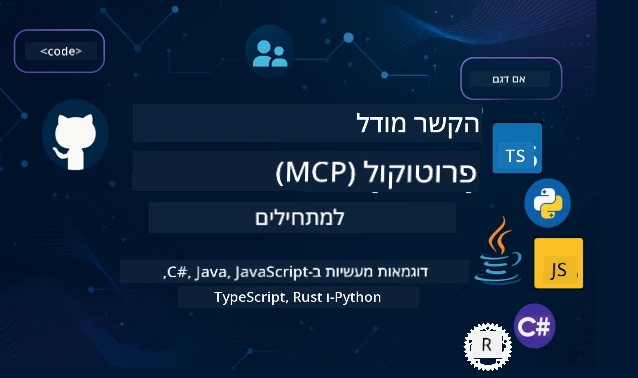

 

[](https://GitHub.com/microsoft/mcp-for-beginners/graphs/contributors)
[](https://GitHub.com/microsoft/mcp-for-beginners/issues)
[](https://GitHub.com/microsoft/mcp-for-beginners/pulls)
[](http://makeapullrequest.com)

[](https://GitHub.com/microsoft/mcp-for-beginners/watchers)
[](https://GitHub.com/microsoft/mcp-for-beginners/fork)
[](https://GitHub.com/microsoft/mcp-for-beginners/stargazers)


[](https://discord.gg/nTYy5BXMWG)

עקבו אחר השלבים הבאים כדי להתחיל להשתמש במשאבים אלו:
1. **צור Fork למאגר**: לחץ על [](https://GitHub.com/microsoft/mcp-for-beginners/fork)
2. **שכפל את המאגר**:   `git clone https://github.com/microsoft/mcp-for-beginners.git`
3. **הצטרף ל-** [](https://discord.gg/nTYy5BXMWG)


### 🌐 תמיכה בריבוי שפות

#### נתמכת באמצעות GitHub Action (אוטומטית ותמיד מעודכנת)

<!-- CO-OP TRANSLATOR LANGUAGES TABLE START -->
[Arabic](../ar/README.md) | [Bengali](../bn/README.md) | [Bulgarian](../bg/README.md) | [Burmese (Myanmar)](../my/README.md) | [Chinese (Simplified)](../zh-CN/README.md) | [Chinese (Traditional, Hong Kong)](../zh-HK/README.md) | [Chinese (Traditional, Macau)](../zh-MO/README.md) | [Chinese (Traditional, Taiwan)](../zh-TW/README.md) | [Croatian](../hr/README.md) | [Czech](../cs/README.md) | [Danish](../da/README.md) | [Dutch](../nl/README.md) | [Estonian](../et/README.md) | [Finnish](../fi/README.md) | [French](../fr/README.md) | [German](../de/README.md) | [Greek](../el/README.md) | [Hebrew](./README.md) | [Hindi](../hi/README.md) | [Hungarian](../hu/README.md) | [Indonesian](../id/README.md) | [Italian](../it/README.md) | [Japanese](../ja/README.md) | [Kannada](../kn/README.md) | [Korean](../ko/README.md) | [Lithuanian](../lt/README.md) | [Malay](../ms/README.md) | [Malayalam](../ml/README.md) | [Marathi](../mr/README.md) | [Nepali](../ne/README.md) | [Nigerian Pidgin](../pcm/README.md) | [Norwegian](../no/README.md) | [Persian (Farsi)](../fa/README.md) | [Polish](../pl/README.md) | [Portuguese (Brazil)](../pt-BR/README.md) | [Portuguese (Portugal)](../pt-PT/README.md) | [Punjabi (Gurmukhi)](../pa/README.md) | [Romanian](../ro/README.md) | [Russian](../ru/README.md) | [Serbian (Cyrillic)](../sr/README.md) | [Slovak](../sk/README.md) | [Slovenian](../sl/README.md) | [Spanish](../es/README.md) | [Swahili](../sw/README.md) | [Swedish](../sv/README.md) | [Tagalog (Filipino)](../tl/README.md) | [Tamil](../ta/README.md) | [Telugu](../te/README.md) | [Thai](../th/README.md) | [Turkish](../tr/README.md) | [Ukrainian](../uk/README.md) | [Urdu](../ur/README.md) | [Vietnamese](../vi/README.md)

> **מעדיפים לשכפל מקומית?**
>
> מאגר זה כולל למעלה מ-50 תרגומים לשפות שונות, מה שמגדיל משמעותית את גודל ההורדה. כדי לשכפל ללא תרגומים, השתמש ב-sparse checkout:
>
> **Bash / macOS / Linux:**
> ```bash
> git clone --filter=blob:none --sparse https://github.com/microsoft/mcp-for-beginners.git
> cd mcp-for-beginners
> git sparse-checkout set --no-cone '/*' '!translations' '!translated_images'
> ```
>
> **CMD (Windows):**
> ```cmd
> git clone --filter=blob:none --sparse https://github.com/microsoft/mcp-for-beginners.git
> cd mcp-for-beginners
> git sparse-checkout set --no-cone "/*" "!translations" "!translated_images"
> ```
>
> זה נותן לכם את כל מה שצריך כדי להשלים את הקורס עם הורדה מהירה הרבה יותר.
<!-- CO-OP TRANSLATOR LANGUAGES TABLE END -->

# 🚀 תכנית הלימודים של פרוטוקול הקשר למודל (MCP) למתחילים

## **למדו MCP עם דוגמאות קוד פרקטיות ב-C#, Java, JavaScript, Rust, Python ו-TypeScript**

## 🧠 סקירה כללית של תכנית הלימודים של פרוטוקול הקשר למודל
ברוכים הבאים למסע שלכם לתוך פרוטוקול הקשר למודל! אם תהיתם אי פעם כיצד אפליקציות בינה מלאכותית מתקשרות עם כלים ושירותים שונים, אתם עומדים לגלות את הפתרון האלגנטי שמשנה את הדרך שבה מפתחים בונים מערכות חכמות.

תחשבו על MCP כמתרגם אוניברסלי לאפליקציות בינה מלאכותית - בדיוק כמו שפתחות USB מאפשרות לחבר כל מכשיר למחשב, MCP מאפשר למודלים של בינה מלאכותית להתחבר לכל כלי או שירות בדרך סטנדרטית. בין אם אתם בונים את הצ'אטבוט הראשון שלכם או עובדים על זרימות עבודה מורכבות בבינה מלאכותית, הבנת MCP תיתן לכם את הכוח ליצור אפליקציות גמישות ומתקדמות יותר.

תכנית לימודים זו עוצבה בסבלנות ובדאגה למסע הלמידה שלכם. נתחיל מרעיונות פשוטים שאתם כבר מכירים ונבנה בהדרגה את המומחיות שלכם באמצעות תרגול מעשי בשפת התכנות האהובה עליכם. כל שלב כולל הסברים ברורים, דוגמאות מעשיות והרבה עידוד לאורך הדרך.

בסיום המסע הזה, יהיה לכם הביטחון לבנות שרתי MCP משלכם, לשלב אותם עם פלטפורמות AI פופולריות ולהבין כיצד הטכנולוגיה הזו משנה את עתיד הפיתוח של בינה מלאכותית. בואו נתחיל בהרפתקה המרגשת הזו יחד!

### תיעוד רשמי ומפרטים

תכנית הלימודים הזו מתואמת עם **מפרט MCP 2025-11-25** (הגרסה התקנית העדכנית ביותר). מפרט MCP משתמש בגרסאות המבוססות על תאריך (פורמט YYYY-MM-DD) כדי להבטיח מעקב ברור אחר גרסאות הפרוטוקול.

משאבים אלה הופכים ליותר בעלי ערך ככל שההבנה שלכם מתעמקת, אבל אל תרגישו לחוצים לקרוא הכל מיד. התחילו באזורים שמעניינים אתכם ביותר!  
- 📘 [תיעוד MCP](https://modelcontextprotocol.io/) – המשאב שלכם למדריכים שלב-אחר-שלב ומדריכי משתמש. התיעוד נכתב מן ההתחלה עם מתמקדים במתחילים, ומספק דוגמאות ברורות שתוכלו לעקוב אחריהן בקצב שלכם.  
- 📜 [מפרט MCP](https://modelcontextprotocol.io/specification/2025-11-25) – ראו זאת כמדריך המקיף שלכם. עם ההתקדמות בתכנית הלימודים, תחזרו לכאן כדי לחפש פרטים ספציפיים ולחקור תכונות מתקדמות.  
- 📜 [גרסאות מפרט MCP](https://modelcontextprotocol.io/specification/versioning) – כאן תמצאו מידע על היסטוריית גרסאות הפרוטוקול ואיך MCP משתמש בגרסאות המבוססות תאריך (פורמט YYYY-MM-DD).  
- 🧑‍💻 [מאגר GitHub של MCP](https://github.com/modelcontextprotocol) – כאן תמצאו SDK, כלים ודוגמאות קוד בשפות תכנות שונות. זהו אוצר של דוגמאות פרקטיות ורכיבים מוכנים לשימוש.  
- 🌐 [קהילת MCP](https://github.com/orgs/modelcontextprotocol/discussions) – הצטרפו ללומדים אחרים ולמפתחים מנוסים בדיונים על MCP. זוהי קהילה תומכת שבה שאלות מתקבלות בברכה והידע משתף באופן חופשי.

## יעדי למידה

בסיום תכנית הלימודים הזו, תרגישו בטוחים ונרגשים מהיכולות החדשות שלכם. הנה מה שתשיגו:

• **הבנת יסודות MCP**: תבינו מהו פרוטוקול הקשר למודל ולמה הוא משנה את האופן שבו אפליקציות בינה מלאכותית עובדות יחד, באמצעות אנלוגיות ודוגמאות בהירות.

• **בניית שרת MCP ראשון שלכם**: תיצרו שרת MCP עובד בשפת התכנות המועדפת עליכם, מתחילים מדוגמאות פשוטות ומגדילים את המיומנות שלב אחר שלב.

• **חיבור מודלים של AI לכלים אמיתיים**: תלמדו איך לגשר על הפער בין מודלים של AI לשירותים ממשיים, וכך תאפשרו לאפליקציות שלכם יכולות חדשות ועוצמתיות.

• **יישום שיטות אבטחה מיטביות**: תבינו איך לשמור על יישומי MCP בטוחים ומוגנים, כך שתישמרו הן האפליקציות והן המשתמשים שלכם.

• **פריסה עם ביטחון**: תדעו כיצד לקחת את פרויקטי MCP שלכם משלב הפיתוח עד לשלב ההפצה, עם אסטרטגיות פריסה פרקטיות שעובדות בשטח.

• **הצטרפות לקהילת MCP**: תהפכו לחלק מקהילה מתפתחת של מפתחים המעצבנת את עתיד הפיתוח של אפליקציות בינה מלאכותית.

## רקע חיוני

לפני שנצלול לפרטים הספציפיים של MCP, נוודא שאתם מרגישים בנוח עם כמה מושגים בסיסיים. אל תדאגו אם אינכם מומחים בתחומים אלו - נסביר את כל מה שצריך תוך כדי ההתקדמות!

### הבנת פרוטוקולים (הבסיס)

תחשבו על פרוטוקול כמו על כללים לשיחה. כשאתם מתקשרים עם חבר, אתם יודעים לומר "שלום" כשאתם עונים, לתפוס תורות בדיבור, לומר "להתראות" כשמסיימים. תוכניות מחשב זקוקות לכללים דומים כדי לתקשר ביעילות.

MCP הוא פרוטוקול - סט של כללים מוסכמים שמסייעים למודלים של בינה מלאכותית ולאפליקציות לנהל "שיחות" פורות עם כלים ושירותים. בדיוק כמו שכללי שיחה עושים את התקשורת האנושית חלקה יותר, כך MCP הופך את התקשורת בין אפליקציות AI לאמינה ועוצמתית יותר.

### יחסי לקוח-שרת (איך התוכניות עובדות יחד)

כבר אתם משתמשים ביחסי לקוח-שרת כל יום! כשאתם משתמשים בדפדפן (הלקוח) כדי לבקר באתר אינטרנט, אתם מתקשרים עם שרת ווב ששולח לכם את תוכן הדף. הדפדפן יודע כיצד לבקש מידע, והשרת יודע איך להשיב.

ב-MCP יש לנו קשר דומה: מודלים של AI הם הלקוחות שמבקשים מידע או פעולות, בעוד ששרתי MCP מספקים את היכולות הללו. זה כמו לעזור לעוזר (שרת) שאליו ה-AI יכול לפנות כדי לבצע משימות ספציפיות.

### למה חשוב תקן (לגרום לדברים לעבוד ביחד)

תארו לכם אם כל יצרן רכב היה משתמש בצינורות דלק בצורות שונות - הייתם צריכים מתאם שונה לכל רכב! תקן משמעו הסכמה על גישות משותפות כדי לגרום לדברים לעבוד חלק ביחד.

MCP מספק תקן זה לאפליקציות AI. במקום שכל מודל AI יזדקק לקוד מותאם אישית לעבודה עם כל כלי, MCP יוצר דרך אוניברסלית לתקשורת ביניהם. משמעות הדבר היא שמפתחים יכולים לבנות כלים פעם אחת ולהשתמש בהם עם מערכות AI רבות ושונות.

## 🧭 סקירה כללית של מסלול הלמידה שלך

מסע ה-MCP שלך בנוי בקפידה כדי לבנות את הביטחון והמיומנויות שלך בהדרגה. כל שלב מציג רעיונות חדשים תוך חיזוק מה שלמדת עד כה.

### 🌱 שלב היסודות: הבנת הבסיס (מודולים 0-2)

כאן מתחילה ההרפתקה שלך! נציג בפניך את מושגי MCP באמצעות אנלוגיות מוכרות ודוגמאות פשוטות. תבין מהו MCP, למה הוא קיים, ואיך הוא משתלב בעולם הרחב של פיתוח בינה מלאכותית.

• **מודול 0 - מבוא ל-MCP**: נתחיל בחקירת מה זה MCP ולמה זה כל כך חשוב לאפליקציות בינה מלאכותית מודרניות. תראה דוגמאות אמיתיות של MCP בפעולה ותבין איך הוא פותר בעיות נפוצות שמפתחים מתמודדים איתן.

• **מודול 1 - הסבר מושגים מרכזיים**: כאן תלמד את אבני הבניין החיוניות של MCP. נשתמש בהרבה אנלוגיות ודוגמאות ויזואליות כדי לוודא שהמושגים האלו ירגישו טבעיים ומובנים.

• **מודול 2 - אבטחה ב-MCP**: אבטחה יכולה להישמע מפחידה, אבל נציג לך איך MCP כולל תכונות בטיחות מובנות ונלמד אותך שיטות עבודה מומלצות שמגנות על האפליקציות שלך מההתחלה.

### 🔨 שלב הבנייה: יצירת היישומים הראשונים שלך (מודול 3)

עכשיו הכיף האמיתי מתחיל! תקבלו ניסיון מעשי בבניית שרתי MCP ולקוחות אמיתיים. אל תדאג - נתחיל בפשטות ונכוון אתכם בכל שלב.
מודול זה כולל מספר מדריכים מעשיים המאפשרים לך להתאמן בשפת התכנות המועדפת עליך. תיצור את השרת הראשון שלך, תבנה לקוח שיתחבר אליו, ואפילו תשתלב עם כלי פיתוח פופולריים כמו VS Code.

כל מדריך כולל דוגמאות קוד מלאות, טיפים לפתרון בעיות, והסברים מדוע אנו עושים בחירות עיצוביות מסוימות. בסוף שלב זה, יהיו לך יישומי MCP עובדים שתוכל להתגאות בהם!

### 🚀 שלב הצמיחה: מושגים מתקדמים ויישום בעולם האמיתי (מודולים 4-5)

עם שליטת הבסיס, אתה מוכן לחקור תכונות מתוחכמות יותר של MCP. נכסה אסטרטגיות יישום מעשיות, טכניקות ניפוי שגיאות, ונושאים מתקדמים כמו אינטגרציה של AI מולטי-מודאלי.

בנוסף, תלמד כיצד להרחיב את יישומי ה-MCP שלך לשימוש בפרודקשן ואינטגרציה עם פלטפורמות ענן כמו Azure. מודולים אלו מכינים אותך לבנות פתרונות MCP שיכולים להתמודד עם דרישות מהעולם האמיתי.

### 🌟 שלב המאסטר: קהילה והתמחות (מודולים 6-11)

השלב האחרון מתמקד בהצטרפות לקהילת MCP ובהתמחות בתחומים שמעניינים אותך ביותר. תלמד כיצד לתרום לפרויקטי MCP בקוד פתוח, ליישם תבניות אימות מתקדמות, ולבנות פתרונות מקיפים המשולבים בבסיסי נתונים.

מודול 11 ראוי לציון מיוחד - זהו מסלול לימוד מעשי של 13 מעבדות המדריך אותך לבניית שרתי MCP מוכנים לייצור עם אינטגרציה ל-PostgreSQL. מדובר בפרויקט שיא שמאגד את כל מה שלמדת!

### 📚 מבנה תכנית הלימודים המלאה

| מודול | נושא | תיאור | קישור |
|--------|-------|-------------|------|
| **מודולים 0-3: יסודות** | | | |
| 00 | מבוא ל-MCP | סקירה של פרוטוקול מודל הקונטקסט ומשמעותו בצינורות AI | [קרא עוד](./00-Introduction/README.md) |
| 01 | הסבר מושגי יסוד | חקר מעמיק של מושגי יסוד ב-MCP | [קרא עוד](./01-CoreConcepts/README.md) |
| 02 | אבטחה ב-MCP | איומי אבטחה ושיטות עבודה מומלצות | [קרא עוד](./02-Security/README.md) |
| 03 | התחלה עם MCP | הכנת סביבה, שרתים/לקוחות בסיסיים, אינטגרציה | [קרא עוד](./03-GettingStarted/README.md) |
| **מודול 3: בניית השרת והלקוח הראשון שלך** | | | |
| 3.1 | השרת הראשון | צור את שרת ה-MCP הראשון שלך | [מדריך](./03-GettingStarted/01-first-server/README.md) |
| 3.2 | הלקוח הראשון | פתח לקוח MCP בסיסי | [מדריך](./03-GettingStarted/02-client/README.md) |
| 3.3 | לקוח עם LLM | אינטגרציה של מודלים שפתיים גדולים | [מדריך](./03-GettingStarted/03-llm-client/README.md) |
| 3.4 | אינטגרציה עם VS Code | צרוך שרתי MCP ב-VS Code | [מדריך](./03-GettingStarted/04-vscode/README.md) |
| 3.5 | שרת stdio | צור שרתים בעזרת תובלה stdio | [מדריך](./03-GettingStarted/05-stdio-server/README.md) |
| 3.6 | סטרימינג HTTP | יישום סטרימינג HTTP ב-MCP | [מדריך](./03-GettingStarted/06-http-streaming/README.md) |
| 3.7 | ערכת כלים AI | השתמש בערכת כלים AI עם MCP | [מדריך](./03-GettingStarted/07-aitk/README.md) |
| 3.8 | בדיקות | בדוק את יישום שרת ה-MCP שלך | [מדריך](./03-GettingStarted/08-testing/README.md) |
| 3.9 | פריסה | פרוס שרתי MCP לפרודקשן | [מדריך](./03-GettingStarted/09-deployment/README.md) |
| 3.10 | שימוש מתקדם בשרת | השתמש בשרתים מתקדמים עבור שימוש תכונות מורכבות ושיפור ארכיטקטורה | [מדריך](./03-GettingStarted/10-advanced/README.md) |
| 3.11 | אימות פשוט | פרק המראה אימות מההתחלה ו-RBAC | [מדריך](./03-GettingStarted/11-simple-auth/README.md) |
| 3.12 | מארחי MCP | הגדר את Claude Desktop, Cursor, Cline ומארחי MCP נוספים | [מדריך](./03-GettingStarted/12-mcp-hosts/README.md) |
| 3.13 | בודק MCP | נפה שגיאות ובדוק שרות MCP עם כלי Inspector | [מדריך](./03-GettingStarted/13-mcp-inspector/README.md) |
| **מודולים 4-5: מעשי ומתקדם** | | | |
| 04 | יישום מעשי | SDKים, ניפוי שגיאות, בדיקות, תבניות פרומפט לשימוש חוזר | [קרא עוד](./04-PracticalImplementation/README.md) |
| 4.1 | פגינציה | טיפול בערכות תוצאות גדולות עם פגינציה מבוססת סמן | [מדריך](./04-PracticalImplementation/pagination/README.md) |
| 05 | נושאים מתקדמים ב-MCP | AI מולטי-מודאלי, סקיילינג, שימוש ארגוני | [קרא עוד](./05-AdvancedTopics/README.md) |
| 5.1 | אינטגרציה עם Azure | אינטגרציה של MCP עם Azure | [מדריך](./05-AdvancedTopics/mcp-integration/README.md) |
| 5.2 | מולטי-מודאליות | עבודה עם מודליות מרובות | [מדריך](./05-AdvancedTopics/mcp-multi-modality/README.md) |
| 5.3 | הדגמת OAuth2 | יישום אימות OAuth2 | [מדריך](./05-AdvancedTopics/mcp-oauth2-demo/README.md) |
| 5.4 | קונטקסטים שורשיים | הבנת יישום קונטקסטים שורשיים | [מדריך](./05-AdvancedTopics/mcp-root-contexts/README.md) |
| 5.5 | ניתוב | אסטרטגיות ניתוב ב-MCP | [מדריך](./05-AdvancedTopics/mcp-routing/README.md) |
| 5.6 | דגימה | טכניקות דגימה ב-MCP | [מדריך](./05-AdvancedTopics/mcp-sampling/README.md) |
| 5.7 | סקיילינג | הרחבת יישומי MCP | [מדריך](./05-AdvancedTopics/mcp-scaling/README.md) |
| 5.8 | אבטחה | שיקולי אבטחה מתקדמים | [מדריך](./05-AdvancedTopics/mcp-security/README.md) |
| 5.9 | חיפוש ברשת | יישום יכולות חיפוש באינטרנט | [מדריך](./05-AdvancedTopics/web-search-mcp/README.md) |
| 5.10 | סטרימינג בזמן אמת | בניית פונקציונליות סטרימינג בזמן אמת | [מדריך](./05-AdvancedTopics/mcp-realtimestreaming/README.md) |
| 5.11 | חיפוש בזמן אמת | יישום חיפוש בזמן אמת | [מדריך](./05-AdvancedTopics/mcp-realtimesearch/README.md) |
| 5.12 | אימות Entra ID | אימות עם Microsoft Entra ID | [מדריך](./05-AdvancedTopics/mcp-security-entra/README.md) |
| 5.13 | אינטגרציה עם Foundry | אינטגרציה עם Azure AI Foundry | [מדריך](./05-AdvancedTopics/mcp-foundry-agent-integration/README.md) |
| 5.14 | הנדסת קונטקסט | טכניקות להנדסת קונטקסט יעילה | [מדריך](./05-AdvancedTopics/mcp-contextengineering/README.md) |
| 5.15 | תובלה מותאמת אישית ב-MCP | יישומי תובלה מותאמת אישית | [מדריך](./05-AdvancedTopics/mcp-transport/README.md) |
| 5.16 | תכונות פרוטוקול | התראות התקדמות, ביטול, תבניות משאבים | [מדריך](./05-AdvancedTopics/mcp-protocol-features/README.md) |
| **מודולים 6-10: קהילה ושיטות עבודה מומלצות** | | | |
| 06 | תרומות קהילתיות | כיצד לתרום לאקו-סיסטם של MCP | [מדריך](./06-CommunityContributions/README.md) |
| 07 | תובנות מאימוץ מוקדם | סיפורי יישום מהעולם האמיתי | [מדריך](./07-LessonsfromEarlyAdoption/README.md) |
| 08 | שיטות עבודה מומלצות ל-MCP | ביצועים, עמידות בתקלות, עמידות | [מדריך](./08-BestPractices/README.md) |
| 09 | מקרי בוחן של MCP | דוגמאות יישום מעשיות | [מדריך](./09-CaseStudy/README.md) |
| 10 | סדנה מעשית | בניית שרת MCP עם ערכת כלים AI | [מעבדה](./10-StreamliningAIWorkflowsBuildingAnMCPServerWithAIToolkit/README.md) |
| **מודול 11: מעבדת שרת MCP מעשית** | | | |
| 11 | אינטגרציה של שרת MCP עם בסיס נתונים | מסלול למידה מעשי של 13 מעבדות לאינטגרציה עם PostgreSQL | [מעבדות](./11-MCPServerHandsOnLabs/README.md) |
| 11.1 | מבוא | סקירה של MCP עם אינטגרציה לבסיס נתונים ומקרה שימוש אנליטיקה קמעונאית | [מעבדה 00](./11-MCPServerHandsOnLabs/00-Introduction/README.md) |
| 11.2 | ארכיטקטורת ליבה | הבנת ארכיטקטורת שרת MCP, שכבות בסיס נתונים, ותבניות אבטחה | [מעבדה 01](./11-MCPServerHandsOnLabs/01-Architecture/README.md) |
| 11.3 | אבטחה וריבוי שוכרים | אבטחה ברמת שורה, אימות, וגישה לריבוי שוכרים | [מעבדה 02](./11-MCPServerHandsOnLabs/02-Security/README.md) |
| 11.4 | הכנת סביבה | הכנת סביבת פיתוח, Docker, משאבי Azure | [מעבדה 03](./11-MCPServerHandsOnLabs/03-Setup/README.md) |
| 11.5 | עיצוב בסיס נתונים | הגדרת PostgreSQL, עיצוב סכמת ריטייל, ודאטה לדוגמה | [מעבדה 04](./11-MCPServerHandsOnLabs/04-Database/README.md) |
| 11.6 | יישום שרת MCP | בניית שרת FastMCP עם אינטגרציה לבסיס נתונים | [מעבדה 05](./11-MCPServerHandsOnLabs/05-MCP-Server/README.md) |
| 11.7 | פיתוח כלי עזר | יצירת כלי שאילתות בסיס נתונים ואינטראוספקשן סכמות | [מעבדה 06](./11-MCPServerHandsOnLabs/06-Tools/README.md) |
| 11.8 | חיפוש סמנטי | יישום הטמעות וקטוריות עם Azure OpenAI ו-pgvector | [מעבדה 07](./11-MCPServerHandsOnLabs/07-Semantic-Search/README.md) |
| 11.9 | בדיקות וניפוי שגיאות | אסטרטגיות בדיקה, כלים לניפוי שגיאות, וגישות אימות | [מעבדה 08](./11-MCPServerHandsOnLabs/08-Testing/README.md) |
| 11.10 | אינטגרציה עם VS Code | הגדרת אינטגרציית MCP עם VS Code ושימוש בצ׳אט AI | [מעבדה 09](./11-MCPServerHandsOnLabs/09-VS-Code/README.md) |
| 11.11 | אסטרטגיות פריסה | פריסת Docker, Azure Container Apps, ושיקולי סקיילינג | [מעבדה 10](./11-MCPServerHandsOnLabs/10-Deployment/README.md) |
| 11.12 | ניתוח ביצועים | Application Insights, רישום לוגים, ניטור ביצועים | [מעבדה 11](./11-MCPServerHandsOnLabs/11-Monitoring/README.md) |
| 11.13 | שיטות עבודה מומלצות | אופטימיזציה של ביצועים, חיזוק אבטחה, וטיפים לפרודקשן | [מעבדה 12](./11-MCPServerHandsOnLabs/12-Best-Practices/README.md) |

### 💻 פרויקטי קוד לדוגמה

אחד החלקים המרגשים בלימוד MCP הוא לראות את כישורי הקוד שלך מתפתחים בהדרגה. עיצבנו את דוגמאות הקוד שלנו כך שיתחילו פשוטות ויתקדם באופן מתוחכם ככל שההבנה שלך מתהדקת. כך אנו מציגים מושגים - עם קוד שקל להבין אך מדגים עקרונות אמיתיים של MCP, תבין לא רק מה הקוד עושה, אלא גם מדוע הוא מבנה כך וכיצד הוא משתלב ביישומי MCP גדולים יותר.

#### דוגמאות בסיסיות למחשבון MCP

| שפה | תיאור | קישור |
|----------|-------------|------|
| C# | דוגמה של שרת MCP | [הצג קוד](./03-GettingStarted/samples/csharp/README.md) |
| Java | מחשבון MCP | [הצג קוד](./03-GettingStarted/samples/java/calculator/README.md) |
| JavaScript | דמו של MCP | [הצג קוד](./03-GettingStarted/samples/javascript/README.md) |
| Python | שרת MCP | [הצג קוד](../../03-GettingStarted/samples/python/mcp_calculator_server.py) |
| TypeScript | דוגמת MCP | [הצג קוד](./03-GettingStarted/samples/typescript/README.md) |
| Rust | דוגמת MCP | [הצג קוד](./03-GettingStarted/samples/rust/README.md) |

#### יישומי MCP מתקדמים

| שפה | תיאור | קישור |
|----------|-------------|------|
| C# | דוגמה מתקדמת | [הצג קוד](./04-PracticalImplementation/samples/csharp/README.md) |
| Java עם Spring | דוגמת אפליקציית מכולה | [הצג קוד](./04-PracticalImplementation/samples/java/containerapp/README.md) |
| JavaScript | דוגמה מתקדמת | [הצג קוד](./04-PracticalImplementation/samples/javascript/README.md) |
| Python | יישום מורכב | [הצג קוד](./04-PracticalImplementation/samples/python/README.md) |
| TypeScript | דוגמת מכולה | [הצג קוד](./04-PracticalImplementation/samples/typescript/README.md) |


## 🎯 דרישות מוקדמות ללימוד MCP

כדי להפיק את המרב מתכנית הלימודים הזו, מומלץ שתהיה לך:

- ידע בסיסי בתכנות לפחות באחת מהשפות הבאות: C#, Java, JavaScript, Python או TypeScript
- הבנה של מודל לקוח-שרת ו-APIs
- היכרות עם מושגי REST ו-HTTP
- (אופציונלי) רקע במושגי AI/ML

- השתתפות בדיונים בקהילה שלנו לתמיכה

## 📚 מדריך לימודים ומשאבים

מאגר זה כולל מספר משאבים שיעזרו לך לנווט וללמוד בצורה יעילה:

### מדריך לימודים
מדריך [לימוד מקיף](./study_guide.md) זמין כדי לעזור לך לנווט במאגר זה ביעילות. מפת תוכנית הלימודים הוויזואלית הזו מראה כיצד כל הנושאים קשורים ומספקת הנחיות כיצד להשתמש בפרויקטים לדוגמה ביעילות. זה יעיל במיוחד אם אתה לומד ויזואלי שאוהב לראות את התמונה הגדולה.

המדריך כולל:
- מפת תוכנית לימודים ויזואלית המציגה את כל הנושאים המכוסים
- פירוט מפורט של כל חלק במאגר
- הנחיות לשימוש בפרויקטים לדוגמה
- מסלולי לימוד מומלצים לרמות מיומנות שונות
- משאבים נוספים להשלמת מסע הלמידה שלך

### יומן שינויים

אנו מנהלים יומן שינויים מפורט [Changelog](./changelog.md) שעוקב אחר כל העדכונים המשמעותיים בחומרי תוכנית הלימודים, כך שתוכל להישאר מעודכן בשיפורים ובהוספות האחרונות.
- הוספות תוכן חדשות
- שינויים מבניים
- שיפורי תכונות
- עדכוני תיעוד

## 🛠️ כיצד להשתמש בתוכנית לימודים זו ביעילות

כל שיעור במדריך זה כולל:

1. הסברים ברורים על מושגי MCP  
2. דוגמאות קוד חיות במספר שפות  
3. תרגילים לבניית יישומי MCP אמיתיים  
4. משאבים נוספים ללומדים מתקדמים

### בואו נלמד MCP עם C# - סדרת הדרכות  
בואו נלמד על פרוטוקול הקשר מודל (MCP), מסגרת חדשנית שנועדה לאחיד את האינטראקציות בין מודלי AI ליישומי לקוח. באמצעות מפגש ידידותי למתחילים זה, נציג לך את MCP ונדריך אותך ביצירת השרת הראשון שלך ב-MCP.  
#### C#: [https://aka.ms/letslearnmcp-csharp](https://aka.ms/letslearnmcp-csharp)  
#### Java: [https://aka.ms/letslearnmcp-java](https://aka.ms/letslearnmcp-java)  
#### JavaScript: [https://aka.ms/letslearnmcp-javascript](https://aka.ms/letslearnmcp-javascript)  
#### Python: [https://aka.ms/letslearnmcp-python](https://aka.ms/letslearnmcp-python)  

## 🎓 מסע ה-MCP שלך מתחיל כאן

ברכות! זהו הצעד הראשון במסע מרגש שיזם את יכולות התכנות שלך ויחבר אותך לקצה החוד של פיתוח AI.

### מה שכבר השגת

על ידי קריאת ההקדמה הזו, התחלת כבר לבנות את יסודות הידע שלך ב-MCP. אתה מבין מהו MCP, מדוע הוא חשוב, וכיצד תכנית לימודים זו תתמוך במסע הלימוד שלך. זו הישג משמעותי והתחלה למומחיות שלך בטכנולוגיה חשובה זו.

### ההרפתקה שמולך

כשאתה מתקדם במודולים, זכור שכל מומחה היה פעם מתחיל. המושגים שעשויים להיראות מורכבים כעת יהפכו לטבע שני ככל שתתאמן ותיישם אותם. כל צעד קטן בונה לכישורים חזקים שישרתו אותך לאורך כל קריירת הפיתוח שלך.

### רשת התמיכה שלך

אתה מצטרף לקהילה של לומדים ומומחים הנלהבים לגבי MCP ומוכנים לעזור לאחרים להצליח. בין אם אתה נתקל באתגר קידוד או מתרגש לשתף פריצת דרך, הקהילה כאן לתמוך במסע שלך.

אם תיתקל בקשיים או יש לך שאלות בנוגע לבניית יישומי AI, הצטרף ללומדים אחרים ולמפתחים מנוסים בדיונים על MCP. זוהי קהילה תמיכתית שבה שאלות מתקבלות בשמחה והידע משתף בחופשיות.

[](https://discord.gg/nTYy5BXMWG)

אם יש לך משוב על מוצר או שגיאות בזמן הבנייה בקר באתר:

[](https://aka.ms/foundry/forum)

### מוכן להתחיל?

הרפתקת ה-MCP שלך מתחילה עכשיו! התחל במודול 0 כדי להיכנס לניסיונות מעשיים ראשונים ב-MCP, או חקור את פרויקטי הדוגמה כדי לראות מה תבנה. זכור - כל מומחה התחיל בדיוק איפה שאתה עכשיו, ובסבלנות ותרגול, תהיה מופתע ממה שתוכל להשיג.

ברוכים הבאים לעולם פיתוח פרוטוקול הקשר מודל. בוא נבנה משהו מדהים יחד!

## 🤝 תרומה לקהילת הלימוד

תוכנית לימודים זו מתעצמת בזכות תרומות של לומדים כמוך! בין אם אתה מתקן טעות הקלדה, מציע הסבר ברור יותר או מוסיף דוגמה חדשה, התרומות שלך עוזרות למתחילים אחרים להצליח.

תודה ל-[Shivam Goyal](https://www.linkedin.com/in/shivam2003/), אנשי מקצוע מוערך במיקרוסופט, על מתן דוגמאות קוד.

תהליך התרומה מתוכנן להיות מזמין ותומך. רוב התרומות דורשות הסכם רישיון תורם (CLA), אך הכלים האוטומטיים ינחו אותך בתהליך בקלות.

## 📜 לימוד קוד פתוח

כל תוכנית הלימודים הזו זמינה תחת רישיון MIT [LICENSE](../../LICENSE), כלומר אתה יכול להשתמש, לשנות ולשתף אותה בחופשיות. זה תומך במשימתנו להפוך את ידע ה-MCP לנגיש למפתחים בכל מקום.  
## 🤝 קווים מנחים לתרומה

הפרויקט מקבל בברכה תרומות והצעות. רוב התרומות מחייבות הסכמה להסכם רישיון תורם (CLA) שמצהיר כי יש לך את הזכות, ובפועל אתה מעניק לנו את הזכויות להשתמש בתרומתך. לפרטים, בקר בכתובת <https://cla.opensource.microsoft.com>.

כאשר אתה מגיש בקשת משיכה, בוט CLA יקבע אוטומטית אם עליך לספק CLA ויעטר את בקשת המשיכה בהתאם (למשל, בדיקת סטטוס, תגובה). פשוט פעל לפי ההוראות שהבוט נותן. תצטרך לעשות זאת רק פעם אחת בכל המאגרי קוד המשתמשים ב-CLA שלנו.

הפרויקט אימץ את [קוד ההתנהגות של מיקרוסופט לקוד פתוח](https://opensource.microsoft.com/codeofconduct/). למידע נוסף עיין ב-[שאלות נפוצות לגבי קוד ההתנהגות](https://opensource.microsoft.com/codeofconduct/faq/) או פנה ל-[opencode@microsoft.com](mailto:opencode@microsoft.com) לכל שאלה או הערה נוספת.

---

*מוכן להתחיל את מסע ה-MCP שלך? התחל עם [מודול 00 - מבוא ל-MCP](./00-Introduction/README.md) וצעד את צעדיך הראשונים לעולם פיתוח פרוטוקול הקשר מודל!*

## 🎒 קורסים נוספים  
הצוות שלנו מפיק קורסים נוספים! בדוק:  

<!-- CO-OP TRANSLATOR OTHER COURSES START -->
### LangChain  
[](https://aka.ms/langchain4j-for-beginners)  
[](https://aka.ms/langchainjs-for-beginners?WT.mc_id=m365-94501-dwahlin)  
[](https://github.com/microsoft/langchain-for-beginners?WT.mc_id=m365-94501-dwahlin)  
---

### Azure / Edge / MCP / Agents  
[](https://github.com/microsoft/AZD-for-beginners?WT.mc_id=academic-105485-koreyst)  
[](https://github.com/microsoft/edgeai-for-beginners?WT.mc_id=academic-105485-koreyst)  
[](https://github.com/microsoft/mcp-for-beginners?WT.mc_id=academic-105485-koreyst)  
[](https://github.com/microsoft/ai-agents-for-beginners?WT.mc_id=academic-105485-koreyst)  

---

### סדרת AI גנרטיבי  
[](https://github.com/microsoft/generative-ai-for-beginners?WT.mc_id=academic-105485-koreyst)  
[-9333EA?style=for-the-badge&labelColor=E5E7EB&color=9333EA)](https://github.com/microsoft/Generative-AI-for-beginners-dotnet?WT.mc_id=academic-105485-koreyst)  
[-C084FC?style=for-the-badge&labelColor=E5E7EB&color=C084FC)](https://github.com/microsoft/generative-ai-for-beginners-java?WT.mc_id=academic-105485-koreyst)  
[-E879F9?style=for-the-badge&labelColor=E5E7EB&color=E879F9)](https://github.com/microsoft/generative-ai-with-javascript?WT.mc_id=academic-105485-koreyst)  

---

### לימוד בסיסי  
[](https://aka.ms/ml-beginners?WT.mc_id=academic-105485-koreyst)  
[](https://aka.ms/datascience-beginners?WT.mc_id=academic-105485-koreyst)  
[](https://aka.ms/ai-beginners?WT.mc_id=academic-105485-koreyst)  
[](https://github.com/microsoft/Security-101?WT.mc_id=academic-96948-sayoung)  
[](https://aka.ms/webdev-beginners?WT.mc_id=academic-105485-koreyst)  
[](https://aka.ms/iot-beginners?WT.mc_id=academic-105485-koreyst)  
[](https://github.com/microsoft/xr-development-for-beginners?WT.mc_id=academic-105485-koreyst)  

---

### סדרת Copilot  
[](https://aka.ms/GitHubCopilotAI?WT.mc_id=academic-105485-koreyst)
[](https://github.com/microsoft/mastering-github-copilot-for-dotnet-csharp-developers?WT.mc_id=academic-105485-koreyst)
[](https://github.com/microsoft/CopilotAdventures?WT.mc_id=academic-105485-koreyst)
<!-- CO-OP TRANSLATOR OTHER COURSES END -->

---

<!-- CO-OP TRANSLATOR DISCLAIMER START -->
**כתב ויתור**:  
מסמך זה תורגם באמצעות שירות תרגום מבוסס בינה מלאכותית [Co-op Translator](https://github.com/Azure/co-op-translator). למרות שאנו שואפים לדיוק, יש לקחת בחשבון שתרגומים אוטומטיים עלולים להכיל שגיאות או אי-דיוקים. יש להסתכל על המסמך המקורי בשפת המקור כסמכות הרשמית. למידע קריטי מומלץ להשתמש בתרגום מקצועי אנושי. איננו אחראים על אי-הבנות או שגיאות בפרשנות הנובעות מהשימוש בתרגום זה.
<!-- CO-OP TRANSLATOR DISCLAIMER END -->