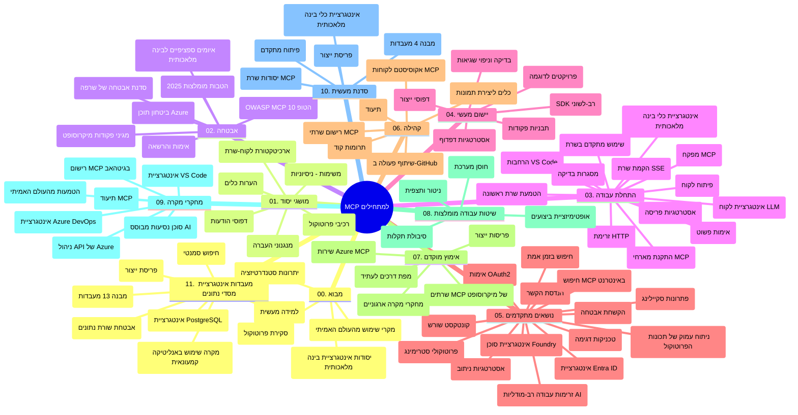

# פרוטוקול הקשר למודלים (MCP) למתחילים - מדריך לימוד

מדריך לימוד זה מספק סקירה כללית של מבנה ותוכן המאגר עבור תכנית הלימודים "פרוטוקול הקשר למודלים (MCP) למתחילים". השתמש במדריך זה כדי לנווט במאגר ביעילות ולהפיק את המרב מהמשאבים הזמינים.

## סקירת המאגר

פרוטוקול הקשר למודלים (MCP) הוא מסגרת סטנדרטית לאינטראקציות בין מודלי בינה מלאכותית ליישומי לקוח. נוצר במקור על ידי Anthropic, MCP מנוהל כיום על ידי קהילת MCP הרחבה דרך הארגון הרשמי ב-GitHub. מאגר זה מספק תכנית לימודים מקיפה עם דוגמאות קוד מעשיות ב-C#, Java, JavaScript, Python ו-TypeScript, המיועדת למפתחים בינה מלאכותית, אדריכלי מערכות ומהנדסי תוכנה.

## מפת תכנית לימודים ויזואלית

## מבנה המאגר

המאגר מאורגן באחת עשרה סעיפים עיקריים, כאשר כל אחד מתמקד בהיבטים שונים של MCP:

1. **הקדמה (00-Introduction/)**
   - סקירה כללית של פרוטוקול הקשר למודלים
   - למה סטנדרטיזציה חשובה בצינורות בינה מלאכותית
   - מקרי שימוש ויתרונות מעשיים

2. **מושגים מרכזיים (01-CoreConcepts/)**
   - ארכיטקטורת לקוח-שרת
   - רכיבים מרכזיים בפרוטוקול
   - דפוסי הודעות ב-MCP

3. **אבטחה (02-Security/)**
   - איומי אבטחה במערכות מבוססות MCP
   - שיטות עבודה מומלצות לאבטחת יישומים
   - אסטרטגיות אימות והרשאה
   - **תיעוד אבטחה מקיף**:
     - שיטות עבודה מומלצות לאבטחת MCP לשנת 2025
     - מדריך יישום אבטחת תוכן Azure
     - בקרות וטכניקות אבטחה ב-MCP
     - הפניה מהירה לשיטות עבודה מומלצות ב-MCP
   - **נושאי אבטחה מרכזיים**:
     - התקפות הזרקת פרומפטים ו-"רעילות" של כלים
     - חטיפת סשנים ובעיות תפקיד מבולבל
     - פגיעות בהעברת טוקנים
     - הרשאות מופרזות ושליטת גישה
     - אבטחת שרשרת אספקה לרכיבי בינה מלאכותית
     - אינטגרציה של Microsoft Prompt Shields

4. **התחלה מהירה (03-GettingStarted/)**
   - הקמת סביבה וקונפיגורציה
   - יצירת שרתי ולקוחות MCP בסיסיים
   - אינטגרציה עם יישומים קיימים
   - כולל סעיפים עבור:
     - יישום שרת ראשון
     - פיתוח לקוח
     - אינטגרציית לקוח LLM
     - אינטגרציה עם VS Code
     - שרת Server-Sent Events (SSE)
     - שימוש מתקדם בשרת
     - סטרימינג HTTP
     - אינטגרציה עם AI Toolkit
     - אסטרטגיות בדיקה
     - הנחיות הפצה

5. **יישום מעשי (04-PracticalImplementation/)**
   - שימוש ב-SDKs בשפות תכנות שונות
   - טכניקות דיבוג, בדיקה ואימות
   - יצירת תבניות פרומפטים וזרימות עבודה רב-שימושיות
   - פרויקטים לדוגמה עם דוגמאות יישום

6. **נושאים מתקדמים (05-AdvancedTopics/)**
   - טכניקות הנדסת הקשר
   - אינטגרציה עם Foundry agent
   - זרימות עבודה מולטי-מודליות של בינה מלאכותית 
   - הדגמות OAuth2 לאימות
   - יכולות חיפוש בזמן אמת
   - סטרימינג בזמן אמת
   - יישום הקשרים שורשיים
   - אסטרטגיות ניתוב
   - טכניקות דגימה
   - גישות סקיילינג
   - שיקולי אבטחה
   - אינטגרציה לאבטחה ב-Entra ID
   - אינטגרציה עם חיפוש ברשת

7. **תרומות הקהילה (06-CommunityContributions/)**
   - כיצד לתרום קוד ותיעוד
   - שיתוף פעולה דרך GitHub
   - הרחבות והמשוב מונחי קהילה
   - שימוש בלקוחות MCP שונים (Claude Desktop, Cline, VSCode)
   - עבודה עם שרתי MCP פופולריים כולל יצירת תמונות

8. **לקחים מאימוץ מוקדם (07-LessonsfromEarlyAdoption/)**
   - יישומים במציאות וסיפורי הצלחה
   - בנייה והפצה של פתרונות מבוססי MCP
   - מגמות ומפת דרכים לעתיד
   - **מדריך שרתי Microsoft MCP**: מדריך מקיף לעשרה שרתי MCP מיקרוסופט מוכנים לייצור הכוללים:
     - Microsoft Learn Docs MCP Server
     - Azure MCP Server (עם 15+ מחברים מתמחים)
     - GitHub MCP Server
     - Azure DevOps MCP Server
     - MarkItDown MCP Server
     - SQL Server MCP Server
     - Playwright MCP Server
     - Dev Box MCP Server
     - Azure AI Foundry MCP Server
     - Microsoft 365 Agents Toolkit MCP Server

9. **שיטות עבודה מומלצות (08-BestPractices/)**
   - כוונון ביצועים ואופטימיזציה
   - עיצוב מערכות MCP חסינות לתקלות
   - אסטרטגיות בדיקה וחוסן

10. **מקרי בוחן (09-CaseStudy/)**
    - **שבעה מקרי בוחן מקיפים** המדגימים את גמישות MCP במצבים מגוונים:
    - **סוכני נסיעות בינה מלאכותית של Azure**: תיאום מולטי-סוכן עם Azure OpenAI וחיפוש AI
    - **אינטגרציית Azure DevOps**: אוטומציה של תהליכי עבודה עם עדכוני נתונים מיוטיוב
    - **שליפת תיעוד בזמן אמת**: לקוח קונסול Python עם סטרימינג HTTP
    - **מחולל תוכנית לימוד אינטראקטיבי**: אפליקציית Chainlit עם בינה מלאכותית שיחתית
    - **תיעוד בתוך עורך**: אינטגרציית VS Code עם זרימות עבודה ב-GitHub Copilot
    - **ניהול API של Azure**: אינטגרציית API ארגונית עם יצירת שרת MCP
    - **רישום MCP ב-GitHub**: פלטפורמת פיתוח ומיזוג סוכני אקוסיסטם
    - דוגמאות יישום המכסות אינטגרציה ארגונית, פרודוקטיביות מפתחים ופיתוח אקוסיסטם

11. **סדנת עבודה מעשית (10-StreamliningAIWorkflowsBuildingAnMCPServerWithAIToolkit/)**
    - סדנה מעשית מקיפה המשלבת MCP עם AI Toolkit
    - בניית אפליקציות חכמות המחברות בין מודלי AI לכלים בעולם האמיתי
    - מודולים מעשיים המכסים יסודות, פיתוח שרת מותאם ואסטרטגיות הפצה לייצור
    - **מבנה המעבדה**:
      - מעבדה 1: יסודות שרת MCP
      - מעבדה 2: פיתוח שרת MCP מתקדם
      - מעבדה 3: אינטגרציית AI Toolkit
      - מעבדה 4: הפצה והרחבה בייצור
    - גישה ללמידה מבוססת מעבדות עם הוראות צעד-אחר-צעד

12. **מעבדות אינטגרציית מסדי נתונים לשרת MCP (11-MCPServerHandsOnLabs/)**
    - **מסלול למידה מקיף של 13 מעבדות** לבניית שרתי MCP מוכנים לייצור עם אינטגרציית PostgreSQL
    - **יישום ניתוחים ריטייל בעולם האמיתי** בעזרת מקרה השימוש Zava Retail
    - **דפוסי ארגוני מתקדמים** כולל Row Level Security (RLS), חיפוש סמנטי וגישה לנתונים מרובי שוכרים
    - **מבנה מעבדה מלא**:
      - **מעבדות 00-03: יסודות** - הקדמה, ארכיטקטורה, אבטחה, הקמת סביבה
      - **מעבדות 04-06: בניית שרת MCP** - עיצוב מסד נתונים, יישום שרת MCP, פיתוח כלים
      - **מעבדות 07-09: תכונות מתקדמות** - חיפוש סמנטי, בדיקות ודיבוג, אינטגרציה עם VS Code
      - **מעבדות 10-12: ייצור ושיטות עבודה מומלצות** - הפצה, ניטור, אופטימיזציה
    - **טכנולוגיות המכוסות**: מסגרת FastMCP, PostgreSQL, Azure OpenAI, Azure Container Apps, Application Insights
    - **תוצאות למידה**: שרתי MCP מוכנים לייצור, דפוסי אינטגרציית מסדי נתונים, ניתוחי בינה מלאכותית, אבטחה ארגונית

## משאבים נוספים

המאגר כולל משאבים תומכים:

- **תיקיית תמונות**: מכילה דיאגרמות והמחשות המשמשות לאורך תכנית הלימודים
- **תרגומים**: תמיכה בריבוי שפות עם תרגומים אוטומטיים של תיעוד
- **משאבי MCP רשמיים**:
  - [תיעוד MCP](https://modelcontextprotocol.io/)
  - [מפרט MCP](https://spec.modelcontextprotocol.io/)
  - [מאגר MCP ב-GitHub](https://github.com/modelcontextprotocol)

## כיצד להשתמש במאגר זה

1. **למידה סדרתית**: עקוב אחר הפרקים לפי הסדר (00 עד 11) לחוויית למידה מסודרת.
2. **מיקוד בשפה ספציפית**: אם אתה מתעניין בשפת תכנות מסוימת, חקור את תיקיות הדוגמאות ליישומים בשפה המועדפת עליך.
3. **יישום מעשי**: התחל בסעיף "התחלה מהירה" כדי להקים את סביבת העבודה שלך וליצור את שרת ולקוח MCP הראשונים שלך.
4. **חקירה מתקדמת**: ברגע שאתה מורגל ביסודות, העמק בנושאים המתקדמים להרחבת הידע.
5. **מעורבות קהילתית**: הצטרף לקהילת MCP דרך דיוני GitHub וערוצי Discord כדי להתחבר עם מומחים ומפתחים אחרים.

## לקוחות וכלים של MCP

תכנית הלימודים מכסה לקוחות וכלים שונים של MCP:

1. **לקוחות רשמיים**:
   - Visual Studio Code
   - MCP ב-Visual Studio Code
   - Claude Desktop
   - Claude ב-VSCode
   - Claude API

2. **לקוחות קהילתיים**:
   - Cline (ממשק שורת פקודה)
   - Cursor (עורך קוד)
   - ChatMCP
   - Windsurf

3. **כלי ניהול MCP**:
   - MCP CLI
   - MCP Manager
   - MCP Linker
   - MCP Router

## שרתי MCP פופולריים

המאגר מציג שרתי MCP שונים, כולל:

1. **שרתי MCP רשמיים של מיקרוסופט**:
   - Microsoft Learn Docs MCP Server
   - Azure MCP Server (עם 15+ מחברים מתמחים)
   - GitHub MCP Server
   - Azure DevOps MCP Server
   - MarkItDown MCP Server
   - SQL Server MCP Server
   - Playwright MCP Server
   - Dev Box MCP Server
   - Azure AI Foundry MCP Server
   - Microsoft 365 Agents Toolkit MCP Server

2. **שרתי ייחוס רשמיים**:
   - Filesystem
   - Fetch
   - Memory
   - Sequential Thinking

3. **יצירת תמונות**:
   - Azure OpenAI DALL-E 3
   - Stable Diffusion WebUI
   - Replicate

4. **כלי פיתוח**:
   - Git MCP
   - Terminal Control
   - Code Assistant

5. **שרתי לתחומים מיוחדים**:
   - Salesforce
   - Microsoft Teams
   - Jira & Confluence

## תרומה

מאגר זה מקבל בברכה תרומות מהקהילה. ראה את סעיף תרומות הקהילה למידע על אופן התרומה היעילה לאקוסיסטם של MCP.

----

*מדריך לימוד זה עודכן לאחרונה ב-5 בפברואר 2026, ומשקף את מפרט MCP העדכני מ-25-11-2025 ומספק סקירה כללית של המאגר נכון לאותו מועד. תוכן המאגר עשוי להתעדכן לאחר תאריך זה.*

---

<!-- CO-OP TRANSLATOR DISCLAIMER START -->
**הצהרת אחריות**:  
מסמך זה תורגם באמצעות שירות תרגום מבוסס בינה מלאכותית [Co-op Translator](https://github.com/Azure/co-op-translator). למרות שאנו שואפים לדיוק, יש להיות מודעים לכך שתרגומים אוטומטיים יכולים להכיל שגיאות או אי-דיוקים. המסמך המקורי בשפתו המקורית נחשב למקור הסמכותי. למידע קריטי, מומלץ לפנות לתרגום מקצועי מבני אדם. איננו אחראים לכל אי-הבנות או פרשנויות שגויות הנובעות מהשימוש בתרגום זה.
<!-- CO-OP TRANSLATOR DISCLAIMER END -->