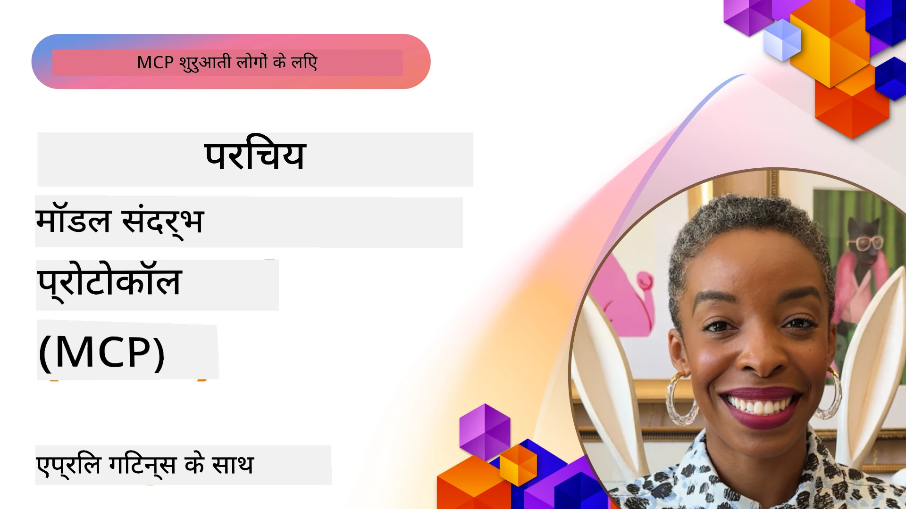
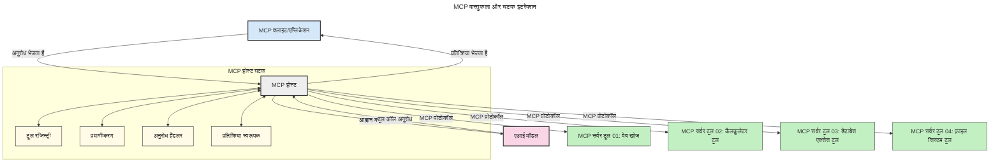

# मॉडल संदर्भ प्रोटोकॉल (MCP) का परिचय: स्केलेबल AI अनुप्रयोगों के लिए क्यों महत्वपूर्ण है

[](https://youtu.be/agBbdiOPLQA)

_(इस पाठ का वीडियो देखने के लिए ऊपर की छवि पर क्लिक करें)_

जनरेटिव AI ऐप्लिकेशन एक बड़ा कदम हैं क्योंकि वे अक्सर उपयोगकर्ता को प्राकृतिक भाषा संकेतों का उपयोग करके ऐप के साथ इंटरैक्ट करने देते हैं। हालांकि, जैसे-जैसे इन ऐप्स में अधिक समय और संसाधन निवेशित होते हैं, आप यह सुनिश्चित करना चाहते हैं कि आप कार्यक्षमताओं और संसाधनों को इस तरह से आसानी से एकीकृत कर सकें कि इसे बढ़ाना आसान हो, आपका ऐप एक से अधिक मॉडल के उपयोग को संभाल सके, और विभिन्न मॉडल की जटिलताओं का प्रबंधन कर सके। संक्षेप में, जनरेटिव AI एप्लिकेशन बनाना शुरू में आसान है, लेकिन जैसे-जैसे वे बढ़ते हैं और अधिक जटिल होते हैं, आपको एक आर्किटेक्चर परिभाषित करना शुरू करना होगा और संभवतः आपको सुनिश्चित करने के लिए एक मानक पर निर्भर होना पड़ेगा कि आपके ऐप्स सुसंगत तरीके से बनाए गए हैं। यहीं पर MCP चीजों को व्यवस्थित करने और एक मानक प्रदान करने के लिए आता है।

---

## **🔍 मॉडल संदर्भ प्रोटोकॉल (MCP) क्या है?**

**मॉडल संदर्भ प्रोटोकॉल (MCP)** एक **ओपन, मानकीकृत इंटरफेस** है जो बड़े भाषा मॉडल (LLMs) को बाहरी उपकरणों, APIs, और डेटा स्रोतों के साथ सहजता से इंटरैक्ट करने की अनुमति देता है। यह AI मॉडल की कार्यक्षमता को उनके प्रशिक्षण डेटा से परे बढ़ाने के लिए एक सुसंगत आर्किटेक्चर प्रदान करता है, जिससे अधिक बुद्धिमान, स्केलेबल, और अधिक प्रतिक्रियाशील AI सिस्टम बनते हैं।

---

## **🎯 AI में मानकीकरण क्यों आवश्यक है**

जैसे-जैसे जनरेटिव AI ऐप्लिकेशन अधिक जटिल होते जाते हैं, ऐसे मानकों को अपनाना आवश्यक हो जाता है जो **स्केलेबिलिटी, एक्स्टेंसिबिलिटी, मेंटेनबिलिटी**, और **वेंडर लॉक-इन से बचाव** सुनिश्चित करें। MCP इन आवश्यकताओं को पूरा करता है:

- मॉडल-टूल इंटीग्रेशन को एकीकृत करके
- टूटने वाले, एकल-बार के कस्टम समाधानों को कम करके
- विभिन्न विक्रेताओं के कई मॉडल को एक ही इकोसिस्टम में सह-अस्तित्व की अनुमति देकर

**नोट:** जबकि MCP खुद को एक ओपन स्टैंडर्ड के रूप में प्रस्तुत करता है, IEEE, IETF, W3C, ISO या किसी अन्य मानक निकाय के माध्यम से MCP को मानकीकृत करने की कोई योजना नहीं है।

---

## **📚 सीखने के उद्देश्य**

इस लेख के अंत तक, आप सक्षम होंगे:

- **मॉडल संदर्भ प्रोटोकॉल (MCP)** को परिभाषित करना और इसके उपयोग केस समझना
- यह समझना कि MCP मॉडल-टूल संचार को कैसे मानकीकृत करता है
- MCP आर्किटेक्चर के मुख्य घटकों की पहचान करना
- MCP के उद्यम और विकास संदर्भों में वास्तविक दुनिया के अनुप्रयोगों का अन्वेषण करना

---

## **💡 मॉडल संदर्भ प्रोटोकॉल (MCP) क्यों गेम-चेंजर है**

### **🔗 MCP AI इंटरैक्शन में विखंडन को हल करता है**

MCP से पहले, मॉडल और उपकरणों को एकीकृत करने के लिए आवश्यकता थी:

- प्रत्येक टूल-मॉडल जोड़ी के लिए कस्टम कोड
- प्रत्येक विक्रेता के लिए गैर-मानकीकृत API
- अपडेट के कारण बार-बार टूटना
- अधिक उपकरणों के साथ खराब स्केलेबिलिटी

### **✅ MCP मानकीकरण के लाभ**

| **लाभ**                 | **विवरण**                                                                        |
|-------------------------|---------------------------------------------------------------------------------|
| इंटरऑपरेबिलिटी         | LLM विभिन्न विक्रेताओं के उपकरणों के साथ सहजता से काम करते हैं                 |
| सुसंगतता                | प्लेटफार्मों और उपकरणों में समान व्यवहार                                       |
| पुन: उपयोग              | एक बार बने उपकरणों का विभिन्न परियोजनाओं और सिस्टम में उपयोग                   |
| विकास में तेजी           | मानकीकृत, प्लग-एंड-प्ले इंटरफेस का उपयोग करके विकास समय कम करना               |

---

## **🧱 उच्च-स्तरीय MCP आर्किटेक्चर अवलोकन**

MCP एक **क्लाइंट-सर्वर मॉडल** का अनुसरण करता है, जहाँ:

- **MCP होस्ट** AI मॉडल चलाते हैं
- **MCP क्लाइंट** अनुरोध शुरू करते हैं
- **MCP सर्वर** संदर्भ, उपकरण, और क्षमताएं प्रदान करते हैं

### **मुख्य घटक:**

- **संसाधन** – मॉडल के लिए स्थैतिक या गतिशील डेटा  
- **प्रॉम्प्ट** – निर्देशित जेनरेशन के लिए पूर्व निर्दिष्ट कार्यप्रवाह  
- **उपकरण** – खोज, गणना जैसे निष्पादन योग्य फ़ंक्शन  
- **सैम्पलिंग** – पुनरावर्ती इंटरैक्शन के माध्यम से एजेंटिक व्यवहार  
- **एलीसिटेशन** – उपयोगकर्ता इनपुट के लिए सर्वर-प्रेरित अनुरोध  
- **रूट्स** – सर्वर एक्सेस नियंत्रण के लिए फाइल सिस्टम सीमाएं

### **प्रोटोकॉल आर्किटेक्चर:**

MCP दो-स्तरीय आर्किटेक्चर का उपयोग करता है:
- **डेटा लेयर**: JSON-RPC 2.0 आधारित संचार जिसमें जीवनचक्र प्रबंधन और प्रिमिटिव्स शामिल हैं
- **ट्रांसपोर्ट लेयर**: STDIO (स्थानीय) और स्ट्रीमेबल HTTP के साथ SSE (रिमोट) संचार चैनल

---

## MCP सर्वर कैसे काम करते हैं

MCP सर्वर निम्नलिखित तरीके से काम करते हैं:

- **अनुरोध प्रवाह**:
    1. एक अनुरोध एक अंतिम उपयोगकर्ता या उनके प्रतिनिधित्व करने वाले सॉफ़्टवेयर द्वारा शुरू किया जाता है।
    2. **MCP क्लाइंट** उस अनुरोध को एक **MCP होस्ट** को भेजता है, जो AI मॉडल रनटाइम का प्रबंधन करता है।
    3. **AI मॉडल** उपयोगकर्ता के प्रॉम्प्ट को प्राप्त करता है और एक या अधिक टूल कॉल के माध्यम से बाहरी उपकरण या डेटा तक पहुँच का अनुरोध कर सकता है।
    4. **MCP होस्ट**, सीधे मॉडल के बजाय, उपयुक्त **MCP सर्वर(ओं)** के साथ मानकीकृत प्रोटोकॉल का उपयोग करके संचार करता है।
- **MCP होस्ट कार्यक्षमता**:
    - **टूल रजिस्ट्री**: उपलब्ध उपकरणों और उनकी क्षमताओं की सूची बनाए रखता है।
    - **प्रमाणीकरण**: उपकरण पहुँच अनुमतियों की पुष्टि करता है।
    - **अनुरोध हैंडलर**: मॉडल से आने वाले उपकरण अनुरोधों को संसाधित करता है।
    - **प्रतिक्रिया प्रारूपक**: उपकरण आउटपुट को ऐसे प्रारूप में संरचित करता है जिसे मॉडल समझ सके।
- **MCP सर्वर निष्पादन**:
    - **MCP होस्ट** टूल कॉल को एक या अधिक **MCP सर्वर** को मार्गित करता है, जिनमें प्रत्येक विशेषीकृत फ़ंक्शन (जैसे खोज, गणना, डेटाबेस क्वेरी) प्रदान करता है।
    - **MCP सर्वर** अपने संबंधित संचालन करते हैं और परिणामों को एक सुसंगत प्रारूप में **MCP होस्ट** को लौटाते हैं।
    - **MCP होस्ट** इन परिणामों को प्रारूपित करता है और AI मॉडल को भेजता है।
- **प्रतिक्रिया समाप्ति**:
    - **AI मॉडल** उपकरण आउटपुट को अंतिम प्रतिक्रिया में सम्मिलित करता है।
    - **MCP होस्ट** यह प्रतिक्रिया वापस **MCP क्लाइंट** को भेजता है, जो इसे अंतिम उपयोगकर्ता या कॉलिंग सॉफ़्टवेयर तक पहुंचाता है।
    


## 👨‍💻 MCP सर्वर कैसे बनाएं (उदाहरणों के साथ)

MCP सर्वर आपको LLM क्षमताओं का विस्तार करने की अनुमति देते हैं, डेटा और कार्यक्षमता प्रदान करके।

क्या आप इसे आज़माने के लिए तैयार हैं? यहाँ विभिन्न भाषाओं/स्टैक्स में सरल MCP सर्वर बनाने के उदाहरणों के साथ भाषा/स्टैक-विशिष्ट SDK दिए गए हैं:

- **Python SDK**: https://github.com/modelcontextprotocol/python-sdk

- **TypeScript SDK**: https://github.com/modelcontextprotocol/typescript-sdk

- **Java SDK**: https://github.com/modelcontextprotocol/java-sdk

- **C#/.NET SDK**: https://github.com/modelcontextprotocol/csharp-sdk


## 🌍 MCP के वास्तविक दुनिया उपयोग के मामले

MCP AI क्षमताओं का विस्तार करके विभिन्न प्रकार के अनुप्रयोग सक्षम करता है:

| **अनुप्रयोग**                | **विवरण**                                                                     |
|------------------------------|-------------------------------------------------------------------------------|
| एंटरप्राइज डेटा इंटीग्रेशन   | LLM को डेटाबेस, CRM, या आंतरिक उपकरणों से जोड़ना                             |
| एजेंटिक AI सिस्टम            | उपकरण पहुँच और निर्णय-निर्माण कार्यप्रवाहों के साथ स्वायत्त एजेंट सक्षम करना  |
| मल्टी-मोडल एप्लिकेशन        | एक एकीकृत AI ऐप में टेक्स्ट, इमेज, और ऑडियो उपकरणों को संयोजित करना          |
| रियल-टाइम डेटा इंटीग्रेशन    | अधिक सटीक, वर्तमान आउटपुट के लिए AI इंटरैक्शन में लाइव डेटा लाना             |


### 🧠 MCP = AI इंटरैक्शन के लिए सार्वभौमिक मानक

मॉडल संदर्भ प्रोटोकॉल (MCP) AI इंटरैक्शन के लिए एक सार्वभौमिक मानक के रूप में कार्य करता है, जैसे USB-C ने उपकरणों के भौतिक कनेक्शनों को मानकीकृत किया। AI की दुनिया में, MCP एक सुसंगत इंटरफेस प्रदान करता है, जिससे मॉडल (क्लाइंट) बाहरी उपकरणों और डेटा प्रदाताओं (सर्वर) के साथ सहजता से एकीकृत हो सकते हैं। इससे प्रत्येक API या डेटा स्रोत के लिए विविध, कस्टम प्रोटोकॉल की आवश्यकता समाप्त हो जाती है।

MCP के तहत, एक MCP-संगत उपकरण (जिसे MCP सर्वर कहा जाता है) एक एकीकृत मानक का पालन करता है। ये सर्वर उन उपकरणों या क्रियाओं को सूचीबद्ध कर सकते हैं जो वे प्रदान करते हैं और AI एजेंट द्वारा अनुरोध किए जाने पर उन क्रियाओं को निष्पादित करते हैं। MCP का समर्थन करने वाले AI एजेंट प्लेटफॉर्म उपकरणों को सर्वरों से खोजने और इस मानक प्रोटोकॉल के माध्यम से उन्हें कॉल करने में सक्षम होते हैं।

### 💡 ज्ञान तक पहुंच की सुविधा

उपकरण प्रदान करने के अलावा, MCP ज्ञान तक पहुंच भी सरल बनाता है। यह अनुप्रयोगों को बड़े भाषा मॉडलों (LLMs) के लिए संदर्भ प्रदान करने में सक्षम बनाता है, उन्हें विभिन्न डेटा स्रोतों से जोड़कर। उदाहरण के लिए, एक MCP सर्वर कंपनी के दस्तावेज़ रिपॉजिटरी का प्रतिनिधित्व कर सकता है, जिससे एजेंट मांग पर प्रासंगिक जानकारी पुनः प्राप्त कर सकते हैं। एक अन्य सर्वर विशिष्ट कार्यों का प्रबंधन कर सकता है जैसे ईमेल भेजना या रिकॉर्ड अपडेट करना। एजेंट के दृष्टिकोण से, ये बस उपकरण हैं जिन्हें वह उपयोग कर सकता है—कुछ उपकरण डेटा (ज्ञान संदर्भ) लौटाते हैं, जबकि अन्य क्रियाएँ करते हैं। MCP दोनों का कुशलतापूर्वक प्रबंधन करता है।

एक एजेंट MCP सर्वर से कनेक्ट होने पर स्वचालित रूप से मानक प्रारूप के माध्यम से सर्वर की उपलब्ध क्षमताओं और सुलभ डेटा को सीखता है। यह मानकीकरण गतिशील उपकरण उपलब्धता सक्षम करता है। उदाहरण के लिए, एजेंट की प्रणाली में नया MCP सर्वर जोड़ना उसके कार्यों को तुरंत उपयोगी बना देता है बिना एजेंट के निर्देशों में और अनुकूलन के।

यह सुव्यवस्थित एकीकरण निम्नलिखित आरेख में दिखाए गए प्रवाह के अनुरूप है, जहां सर्वर दोनों उपकरण और ज्ञान प्रदान करते हैं, यह सुनिश्चित करते हुए कि सिस्टम के बीच निर्बाध सहयोग हो।

### 👉 उदाहरण: स्केलेबल एजेंट समाधान

```mermaid
---
title: MCP के साथ स्केलेबल एजेंट समाधान
description: एक आरेख जो दर्शाता है कि एक उपयोगकर्ता कैसे LLM के साथ इंटरैक्ट करता है जो कई MCP सर्वरों से जुड़ा होता है, प्रत्येक सर्वर ज्ञान और टूल्स दोनों प्रदान करता है, एक स्केलेबल AI सिस्टम आर्किटेक्चर बनाते हुए
---
graph TD
    User -->|प्रॉम्प्ट| LLM
    LLM -->|प्रतिक्रिया| User
    LLM -->|MCP| ServerA
    LLM -->|MCP| ServerB
    ServerA -->|यूनिवर्सल कनेक्टर| ServerB
    ServerA --> KnowledgeA
    ServerA --> ToolsA
    ServerB --> KnowledgeB
    ServerB --> ToolsB

    subgraph Server A
        KnowledgeA[ज्ञान]
        ToolsA[उपकरण]
    end

    subgraph Server B
        KnowledgeB[ज्ञान]
        ToolsB[उपकरण]
    end
``` यूनिवर्सल कनेक्टर MCP सर्वरों को एक-दूसरे के साथ संवाद करने और क्षमताएँ साझा करने में सक्षम बनाता है, जिससे ServerA ServerB को कार्य सौंप सकता है या उसके उपकरणों और ज्ञान तक पहुँच सकता है। यह टूल और डेटा को सर्वरों के बीच फैडरेट करता है, जिससे स्केलेबल और मॉड्यूलर एजेंट आर्किटेक्चर समर्थित होते हैं। चूँकि MCP उपकरण उद्घाटन को मानकीकृत करता है, एजेंट सर्वरों के बीच अनुरोधों की खोज और रूटिंग गतिशील रूप से कर सकते हैं बिना हार्डकोडेड इंटीग्रेशन के।

उपकरण और ज्ञान फेडरेशन: उपकरण और डेटा सर्वरों के बीच पहुंच योग्य हो सकते हैं, जिससे अधिक स्केलेबल और मॉड्यूलर एजेंटिक आर्किटेक्चर संभव होते हैं।

### 🔄 क्लाइंट-साइड LLM इंटीग्रेशन के साथ उन्नत MCP परिदृश्य

मूल MCP आर्किटेक्चर से परे, ऐसे उन्नत परिदृश्य हैं जहाँ क्लाइंट और सर्वर दोनों में LLM होते हैं, जो अधिक परिष्कृत इंटरैक्शन को सक्षम बनाते हैं। निम्न आरेख में, **क्लाइंट ऐप** एक IDE हो सकता है जिसमें LLM द्वारा उपयोग के लिए कई MCP उपकरण उपलब्ध हैं:

```mermaid
---
title: क्लाइंट-सर्वर LLM एकीकरण के साथ उन्नत MCP परिदृश्य
description: एक अनुक्रम आरेख जो उपयोगकर्ता, क्लाइंट एप्लिकेशन, क्लाइंट LLM, कई MCP सर्वर, और सर्वर LLM के बीच विस्तृत इंटरैक्शन फ्लो दिखाता है, उपकरण खोज, उपयोगकर्ता इंटरैक्शन, सीधे उपकरण कॉलिंग, और फीचर नेगोसिएशन चरणों को दर्शाता है
---
sequenceDiagram
    autonumber
    actor User as 👤 उपयोगकर्ता
    participant ClientApp as 🖥️ क्लाइंट ऐप
    participant ClientLLM as 🧠 क्लाइंट LLM
    participant Server1 as 🔧 MCP सर्वर 1
    participant Server2 as 📚 MCP सर्वर 2
    participant ServerLLM as 🤖 सर्वर LLM
    
    %% Discovery Phase
    rect rgb(220, 240, 255)
        Note over ClientApp, Server2: उपकरण खोज चरण
        ClientApp->>+Server1: उपलब्ध उपकरण/संसाधन अनुरोध करें
        Server1-->>-ClientApp: उपकरण सूची वापस करें (JSON)
        ClientApp->>+Server2: उपलब्ध उपकरण/संसाधन अनुरोध करें
        Server2-->>-ClientApp: उपकरण सूची वापस करें (JSON)
        Note right of ClientApp: सम्मिलित उपकरण<br/>कैटलॉग स्थानीय रूप से संग्रहीत करें
    end
    
    %% User Interaction
    rect rgb(255, 240, 220)
        Note over User, ClientLLM: उपयोगकर्ता इंटरैक्शन चरण
        User->>+ClientApp: प्राकृतिक भाषा संकेत दर्ज करें
        ClientApp->>+ClientLLM: संकेत + उपकरण कैटलॉग अग्रेषित करें
        ClientLLM->>-ClientLLM: संकेत विश्लेषण करें और उपकरण चुनें
    end
    
    %% Scenario A: Direct Tool Calling
    alt सीधे उपकरण कॉलिंग
        rect rgb(220, 255, 220)
            Note over ClientApp, Server1: परिदृश्य A: सीधे उपकरण कॉलिंग
            ClientLLM->>+ClientApp: उपकरण निष्पादन अनुरोध करें
            ClientApp->>+Server1: विशिष्ट उपकरण निष्पादित करें
            Server1-->>-ClientApp: परिणाम वापस करें
            ClientApp->>+ClientLLM: परिणाम संसाधित करें
            ClientLLM-->>-ClientApp: प्रतिक्रिया उत्पन्न करें
            ClientApp-->>-User: अंतिम उत्तर दिखाए
        end
    
    %% Scenario B: Feature Negotiation (VS Code style)
    else फीचर नेगोसिएशन (VS कोड शैली)
        rect rgb(255, 220, 220)
            Note over ClientApp, ServerLLM: परिदृश्य B: फीचर नेगोसिएशन
            ClientLLM->>+ClientApp: आवश्यक क्षमताएँ पहचानें
            ClientApp->>+Server2: फीचर्स/क्षमताओं पर बातचीत करें
            Server2->>+ServerLLM: अतिरिक्त संदर्भ अनुरोध करें
            ServerLLM-->>-Server2: संदर्भ प्रदान करें
            Server2-->>-ClientApp: उपलब्ध फीचर्स वापस करें
            ClientApp->>+Server2: बातचीत किए गए उपकरण कॉल करें
            Server2-->>-ClientApp: परिणाम वापस करें
            ClientApp->>+ClientLLM: परिणाम संसाधित करें
            ClientLLM-->>-ClientApp: प्रतिक्रिया उत्पन्न करें
            ClientApp-->>-User: अंतिम उत्तर दिखाए
        end
    end
```
## 🔐 MCP के व्यावहारिक लाभ

MCP के उपयोग के व्यावहारिक लाभ:

- **ताजगी**: मॉडल अपने प्रशिक्षण डेटा से परे नवीनतम जानकारी तक पहुँच सकते हैं
- **क्षमता विस्तार**: मॉडल उन कार्यों के लिए विशेष उपकरणों का उपयोग कर सकते हैं जिनके लिए वे प्रशिक्षित नहीं थे
- **हलुसीनेशन में कमी**: बाहरी डेटा स्रोत तथ्यों की पुष्टि प्रदान करते हैं
- **गोपनीयता**: संवेदनशील डेटा सुरक्षित वातावरण में रह सकता है बजाय प्रॉम्प्ट में अंतर्निहित होने के

## 📌 प्रमुख निष्कर्ष

MCP के उपयोग के लिए महत्वपूर्ण निष्कर्ष:

- **MCP** AI मॉडल के उपकरण और डेटा के साथ इंटरैक्शन को मानकीकृत करता है
- **एक्स्टेंसिबिलिटी, सुसंगतता, और इंटरऑपरेबिलिटी** को बढ़ावा देता है
- MCP विकास समय कम करने, विश्वसनीयता बढ़ाने, और मॉडल क्षमताओं का विस्तार करने में सहायता करता है
- क्लाइंट-सर्वर आर्किटेक्चर लचीले, एक्स्टेंसिबल AI अनुप्रयोगों को सक्षम बनाता है

## 🧠 अभ्यास

अपने द्वारा बनाए जाने वाले किसी AI अनुप्रयोग के बारे में सोचें।

- किन **बाहरी उपकरणों या डेटा** से इसकी क्षमताएं बढ़ सकती हैं?
- MCP इंटीग्रेशन को कैसे **सरल और अधिक विश्वसनीय** बना सकता है?

## अतिरिक्त संसाधन

- [MCP GitHub रिपोजिटरी](https://github.com/modelcontextprotocol)


## आगे क्या है

अगला: [अध्याय 1: मुख्य अवधारणाएँ](../01-CoreConcepts/README.md)

---

<!-- CO-OP TRANSLATOR DISCLAIMER START -->
**अस्वीकरण**:  
यह दस्तावेज़ AI अनुवाद सेवा [Co-op Translator](https://github.com/Azure/co-op-translator) का उपयोग करके अनूदित किया गया है। यद्यपि हम सटीकता के लिए प्रयासरत हैं, कृपया ध्यान दें कि स्वचालित अनुवादों में त्रुटियाँ या असंगतियाँ हो सकती हैं। मूल भाषा में दस्तावेज़ को अधिकारिक स्रोत माना जाना चाहिए। महत्वपूर्ण जानकारी के लिए, पेशेवर मानव अनुवाद की सलाह दी जाती है। इस अनुवाद के उपयोग से उत्पन्न किसी भी गलतफहमी या भ्रामक व्याख्या के लिए हम जिम्मेदार नहीं हैं।
<!-- CO-OP TRANSLATOR DISCLAIMER END -->