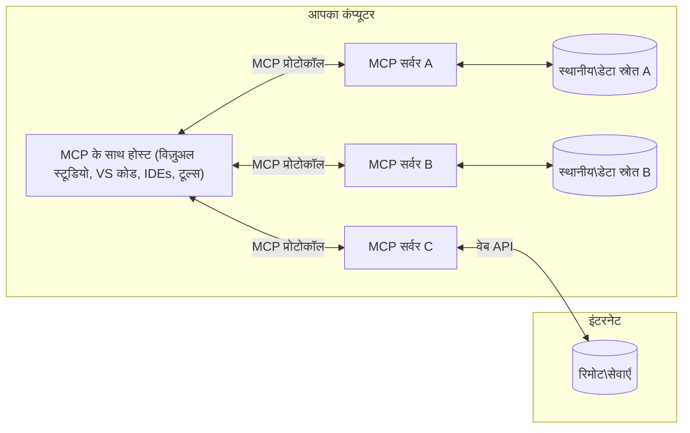

# MCP कोर अवधारणाएँ: AI एकीकरण के लिए मॉडल संदर्भ प्रोटोकॉल में महारत हासिल करना

[](https://youtu.be/earDzWGtE84)

_(इस पाठ का वीडियो देखने के लिए ऊपर की छवि पर क्लिक करें)_

[मॉडल संदर्भ प्रोटोकॉल (MCP)](https://github.com/modelcontextprotocol) एक शक्तिशाली, मानकीकृत फ्रेमवर्क है जो बड़े भाषा मॉडल्स (LLMs) और बाहरी टूल्स, अनुप्रयोगों, और डेटा स्रोतों के बीच संचार को अनुकूलित करता है।  
यह गाइड आपको MCP की कोर अवधारणाओं से परिचित कराएगा। आप इसके क्लाइंट-सर्वर आर्किटेक्चर, आवश्यक घटकों, संचार तंत्र, और कार्यान्वयन सर्वोत्तम प्रथाओं के बारे में सीखेंगे।

- **स्पष्ट उपयोगकर्ता अनुमति**: सभी डेटा एक्सेस और संचालन निष्पादन से पहले स्पष्ट उपयोगकर्ता अनुमोदन आवश्यक है। उपयोगकर्ताओं को स्पष्ट रूप से समझना चाहिए कि कौन सा डेटा एक्सेस किया जाएगा और कौन से कार्य किए जाएंगे, और अनुमतियों व प्रमाणीकरण पर सूक्ष्म नियंत्रण होना चाहिए।

- **डेटा गोपनीयता संरक्षण**: उपयोगकर्ता डेटा केवल स्पष्ट अनुमति के साथ ही प्रदर्शित किया जाता है और पूरे इंटरैक्शन जीवनचक्र के दौरान मजबूत एक्सेस नियंत्रण द्वारा संरक्षित होना चाहिए। कार्यान्वयन अनधिकृत डेटा संचार को रोकने और कड़े गोपनीयता सीमाओं को बनाए रखने चाहिए।

- **टूल निष्पादन सुरक्षा**: प्रत्येक टूल इनवोकेशन के लिए स्पष्ट उपयोगकर्ता अनुमति आवश्यक है, जिसमें टूल की कार्यप्रणाली, पैरामीटर, और संभावित प्रभाव की स्पष्ट समझ हो। मजबूत सुरक्षा सीमाएं आकस्मिक, असुरक्षित, या दुर्भावनापूर्ण टूल निष्पादन को रोकती हैं।

- **ट्रांसपोर्ट लेयर सुरक्षा**: सभी संचार चैनलों में उचित एन्क्रिप्शन और प्रमाणीकरण तंत्र होना चाहिए। रिमोट कनेक्शन को सुरक्षित ट्रांसपोर्ट प्रोटोकॉल और उचित क्रेडेंशियल प्रबंधन लागू करना चाहिए।

#### कार्यान्वयन दिशानिर्देश:

- **अनुमति प्रबंधन**: उपयोगकर्ताओं को यह नियंत्रित करने के लिए सूक्ष्म अनुमति प्रणाली लागू करें कि कौन से सर्वर, टूल, और संसाधन उपलब्ध हैं  
- **प्रमाणीकरण और प्राधिकरण**: सुरक्षित प्रमाणीकरण विधियाँ (OAuth, API keys) उपयोग करें, उचित टोकन प्रबंधन व समाप्ति के साथ  
- **इन्पुट सत्यापन**: परिभाषित स्कीमाओं के अनुसार सभी पैरामीटर और डेटा इनपुट सत्यापित करें ताकि इंजेक्शन हमलों को रोका जा सके  
- **ऑडिट लॉगिंग**: सुरक्षा निगरानी और अनुपालन के लिए सभी संचालन के व्यापक लॉग बनाएँ

## अवलोकन

यह पाठ मॉडल संदर्भ प्रोटोकॉल (MCP) पारिस्थितिकी तंत्र की मौलिक आर्किटेक्चर और घटकों का अन्वेषण करता है। आप क्लाइंट-सर्वर आर्किटेक्चर, मुख्य घटकों, और संचार यंत्रणाओं के बारे में जानेंगे जो MCP इंटरैक्शन्स को संचालित करते हैं।

## मुख्य सीखने के उद्देश्य

इस पाठ के अंत तक, आप:

- MCP क्लाइंट-सर्वर आर्किटेक्चर को समझेंगे।  
- होस्ट, क्लाइंट, और सर्वर की भूमिकाओं और जिम्मेदारियों की पहचान करेंगे।  
- MCP को एक लचीले एकीकरण स्तर के रूप में बनाने वाले कोर फीचर्स का विश्लेषण करेंगे।  
- समझेंगे कि MCP पारिस्थितिकी तंत्र में सूचना कैसे प्रवाहित होती है।  
- .NET, जावा, पायथन, और जावास्क्रिप्ट में कोड उदाहरणों के माध्यम से व्यावहारिक अंतर्दृष्टि प्राप्त करेंगे।

## MCP आर्किटेक्चर: एक गहरा दृष्टिकोण

MCP पारिस्थितिकी तंत्र क्लाइंट-सर्वर मॉडल पर आधारित है। यह मॉड्यूलर संरचना AI अनुप्रयोगों को टूल्स, डेटाबेस, APIs, और संदर्भात्मक संसाधनों के साथ कुशलता से इंटरैक्ट करने देती है। आइए इस आर्किटेक्चर को इसके कोर घटकों में विभाजित करें।

मूलतः, MCP क्लाइंट-सर्वर आर्किटेक्चर का पालन करता है जहाँ एक होस्ट एप्लिकेशन कई सर्वरों से कनेक्ट हो सकता है:


- **MCP होस्ट्स**: वीएसकोड, क्लॉड डेस्कटॉप, IDEs, या AI टूल्स जैसे प्रोग्राम जो MCP के माध्यम से डेटा एक्सेस करना चाहते हैं  
- **MCP क्लाइंट्स**: प्रोटोकॉल क्लाइंट जो सर्वरों के साथ 1:1 कनेक्शन बनाए रखते हैं  
- **MCP सर्वर्स**: हल्के प्रोग्राम जो मानकीकृत मॉडल संदर्भ प्रोटोकॉल के माध्यम से विशिष्ट क्षमताएं प्रदान करते हैं  
- **स्थानीय डेटा स्रोत**: आपके कंप्यूटर की फाइलें, डेटाबेस, और सेवाएं जिन तक MCP सर्वर सुरक्षित रूप से पहुंच सकते हैं  
- **रिमोट सेवाएं**: इंटरनेट के जरिए उपलब्ध बाहरी सिस्टम जिनसे MCP सर्वर APIs के माध्यम से जुड़ सकते हैं।

MCP प्रोटोकॉल डेट-बेस्ड संस्करण (YYYY-MM-DD फॉर्मेट) का उपयोग करते हुए विकसित हो रहा मानक है। वर्तमान प्रोटोकॉल संस्करण **2025-11-25** है। आप [प्रोटोकॉल विनिर्देशन](https://modelcontextprotocol.io/specification/2025-11-25/) में नवीनतम अपडेट देख सकते हैं।

### 1. होस्ट्स

मॉडल संदर्भ प्रोटोकॉल (MCP) में, **होस्ट्स** AI अनुप्रयोग हैं जो उपयोगकर्ताओं के लिए प्रोटोकॉल के साथ इंटरफेस का मुख्य माध्यम होते हैं। होस्ट्स कई MCP सर्वरों से कनेक्शन का समन्वय और प्रबंधन करते हैं और हर सर्वर कनेक्शन के लिए समर्पित MCP क्लाइंट बनाते हैं। होस्ट्स के उदाहरण हैं:

- **AI अनुप्रयोग**: Claude Desktop, Visual Studio Code, Claude Code  
- **विकास पर्यावरण**: IDEs और कोड संपादक जिनमें MCP एकीकरण हो  
- **कस्टम अनुप्रयोग**: उद्देश्यमूलक AI एजेंट और टूल्स

**होस्ट्स** AI मॉडल इंटरैक्शन का समन्वय करते हैं। वे:

- **AI मॉडल का संचालन करते हैं**: LLMs के साथ इंटरैक्ट कर उत्तर उत्पन्न करते हैं और AI वर्कफ़्लोज़ का समन्वय करते हैं  
- **क्लाइंट कनेक्शन प्रबंधित करते हैं**: प्रत्येक MCP सर्वर कनेक्शन के लिए एक MCP क्लाइंट बनाते और बनाए रखते हैं  
- **उपयोगकर्ता इंटरफेस नियंत्रित करते हैं**: बातचीत के प्रवाह, उपयोगकर्ता इंटरैक्शन, और प्रतिक्रिया प्रस्तुति को संभालते हैं   
- **सुरक्षा लागू करते हैं**: अनुमतियां, सुरक्षा सीमाएं, और प्रमाणीकरण नियंत्रित करते हैं  
- **उपयोगकर्ता अनुमति संभालते हैं**: डेटा साझा करने और टूल निष्पादन के लिए उपयोगकर्ता अनुमोदन का प्रबंधन करते हैं

### 2. क्लाइंट्स

**क्लाइंट्स** आवश्यक घटक हैं जो होस्ट्स और MCP सर्वरों के बीच समर्पित एक-से-एक कनेक्शन बनाए रखते हैं। प्रत्येक MCP क्लाइंट को होस्ट द्वारा एक विशिष्ट MCP सर्वर से कनेक्ट होने के लिए इंस्टैंशिएट किया जाता है, ताकि सुव्यवस्थित और सुरक्षित संचार चैनल सुनिश्चित हो सकें। कई क्लाइंट होस्ट को एकाधिक सर्वरों से एक साथ कनेक्ट करने की अनुमति देते हैं।

**क्लाइंट्स** होस्ट एप्लिकेशन के भीतर कनेक्टर घटक होते हैं। वे:

- **प्रोटोकॉल संचार**: प्रॉम्प्ट और निर्देशों के साथ JSON-RPC 2.0 अनुरोध सर्वरों को भेजते हैं  
- **क्षमता वार्ता**: प्रारंभिक चरण में सर्वरों के साथ समर्थित फीचर्स और प्रोटोकॉल संस्करणों पर बातचीत करते हैं  
- **टूल निष्पादन**: मॉडल से टूल निष्पादन अनुरोधों का प्रबंधन करते हैं और प्रतिक्रियाओं को संसाधित करते हैं  
- **रियल-टाइम अपडेट्स**: सर्वरों से सूचनाएं और रीयल-टाइम अपडेट हैंडल करते हैं  
- **प्रतिक्रिया प्रसंस्करण**: उपयोगकर्ताओं को दिखाने के लिए सर्वर प्रतिक्रियाओं को प्रोसेस और स्वरूपित करते हैं

### 3. सर्वर्स

**सर्वर्स** प्रोग्राम हैं जो MCP क्लाइंट्स को संदर्भ, टूल्स, और क्षमताएं प्रदान करते हैं। ये स्थानीय (होस्ट के समान मशीन पर) या रिमोट (बाहरी प्लेटफॉर्म पर) चल सकते हैं, क्लाइंट अनुरोधों को संभालने और संरचित प्रतिक्रियाएं देने के लिए ज़िम्मेदार हैं। सर्वर्स मानकीकृत मॉडल संदर्भ प्रोटोकॉल के माध्यम से विशिष्ट कार्यक्षमता एक्सपोज़ करते हैं।

**सर्वर्स** सेवाएं हैं जो संदर्भ और क्षमताएं प्रदान करती हैं। वे:

- **फ़ीचर पंजीकरण**: उपलब्ध प्रिमिटिव्स (संसाधन, प्रॉम्प्ट, टूल्स) क्लाइंट्स को पंजीकृत और प्रदर्शित करते हैं  
- **अनुरोध संसाधन**: क्लाइंट्स से टूल कॉल, संसाधन अनुरोध, और प्रॉम्प्ट अनुरोध प्राप्त करते हैं और निष्पादित करते हैं  
- **संदर्भ प्रदान करते हैं**: मॉडल प्रतिक्रियाओं को बढ़ाने के लिए संदर्भात्मक जानकारी और डेटा प्रदान करते हैं  
- **स्थिति प्रबंधन**: सत्र की स्थिति बनाए रखते हैं और आवश्यकतानुसार स्थिति-संबंधी इंटरैक्शन संभालते हैं  
- **रियल-टाइम सूचनाएं**: क्षमताओं में परिवर्तन और अपडेट के बारे में जुड़े क्लाइंट्स को सूचनाएं भेजते हैं

सर्वर्स किसी भी व्यक्ति द्वारा विशेष कार्यक्षमता के साथ मॉडल क्षमताओं का विस्तार करने के लिए विकसित किए जा सकते हैं, और वे स्थानीय और रिमोट दोनों परिनियोजन परिदृश्यों का समर्थन करते हैं।

### 4. सर्वर प्रिमिटिव्स

मॉडल संदर्भ प्रोटोकॉल (MCP) में सर्वर तीन मुख्य **प्रिमिटिव्स** प्रदान करते हैं जो क्लाइंट्स, होस्ट्स, और भाषा मॉडलों के बीच समृद्ध इंटरैक्शनों के मौलिक निर्माण ब्लॉक को परिभाषित करते हैं। ये प्रिमिटिव्स निर्दिष्ट करते हैं कि प्रोटोकॉल के माध्यम से कौन से संदर्भात्मक जानकारी और क्रियाएं उपलब्ध हैं।

MCP सर्वर निम्नलिखित तीन कोर प्रिमिटिव्स का कोई भी संयोजन एक्सपोज़ कर सकते हैं:

#### संसाधन (Resources)

**संसाधन** डेटा स्रोत हैं जो AI अनुप्रयोगों को संदर्भात्मक जानकारी देते हैं। ये स्थिर या डायनेमिक सामग्री का प्रतिनिधित्व करते हैं जो मॉडल की समझ और निर्णय लेने को बेहतर बनाते हैं:

- **संदर्भात्मक डेटा**: AI मॉडल उपयोग के लिए संरचित सूचना और संदर्भ  
- **ज्ञान आधार**: दस्तावेज़ भंडार, लेख, मैनुअल, और शोध पत्र  
- **स्थानीय डेटा स्रोत**: फाइलें, डेटाबेस, और स्थानीय सिस्टम जानकारी  
- **बाहरी डेटा**: API प्रतिक्रियाएं, वेब सेवाएं, और दूरस्थ सिस्टम डेटा  
- **डायनेमिक सामग्री**: बाहरी परिस्थितियों के अनुसार अपडेट होने वाले रियल-टाइम डेटा

संसाधन URI से पहचाने जाते हैं और `resources/list` के माध्यम से खोज और `resources/read` के माध्यम से पुनःप्राप्ति का समर्थन करते हैं:

```text
file://documents/project-spec.md
database://production/users/schema
api://weather/current
```


#### प्रॉम्प्ट्स (Prompts)

**प्रॉम्प्ट्स** पुन: प्रयोज्य टेम्पलेट हैं जो भाषा मॉडलों के साथ इंटरैक्शन को संरचित करने में मदद करते हैं। ये मानकीकृत इंटरैक्शन पैटर्न और टेम्प्लेटेड वर्कफ़्लोज़ प्रदान करते हैं:

- **टेम्प्लेट-आधारित इंटरैक्शन**: पूर्व-संरचित संदेश और वार्तालाप प्रारंभकर्ता  
- **वर्कफ़्लो टेम्प्लेट्स**: सामान्य कार्यों और इंटरैक्शन के लिए मानकीकृत अनुक्रम  
- **फ़्यू-शॉट उदाहरण**: मॉडल निर्देश के लिए उदाहरण-आधारित टेम्प्लेट  
- **सिस्टम प्रॉम्प्ट्स**: मॉडल व्यवहार और संदर्भ को परिभाषित करने वाले मौलिक प्रॉम्प्ट  
- **डायनेमिक टेम्प्लेट्स**: पैरामीटरयुक्त प्रॉम्प्ट्स जो विशिष्ट संदर्भों के अनुसार अनुकूलित होते हैं

प्रॉम्प्ट्स वेरिएबल प्रतिस्थापन का समर्थन करते हैं और `prompts/list` के जरिए खोजे जा सकते हैं तथा `prompts/get` द्वारा पुनःप्राप्त किए जा सकते हैं:

```markdown
Generate a {{task_type}} for {{product}} targeting {{audience}} with the following requirements: {{requirements}}
```


#### टूल्स (Tools)

**टूल्स** निष्पादित करने योग्य फंक्शन्स हैं जिन्हें AI मॉडल विशिष्ट क्रियाएं करने के लिए कॉल कर सकते हैं। ये MCP पारिस्थितिकी तंत्र के "क्रियाओं" का प्रतिनिधित्व करते हैं, जिससे मॉडल्स बाहरी सिस्टम के साथ इंटरैक्ट कर पाते हैं:

- **निष्पादित फंक्शन**: अलग-अलग ऑपरेशन जिन्हें मॉडल विशिष्ट पैरामीटर के साथ कॉल कर सकते हैं  
- **बाहरी सिस्टम एकीकरण**: API कॉल, डेटाबेस क्वेरी, फाइल ऑपरेशन, गणना  
- **अद्वितीय पहचान**: प्रत्येक टूल का एक अलग नाम, विवरण और पैरामीटर स्कीमा होता है  
- **संरचित I/O**: टूल मान्य पैरामीटर स्वीकार करते हैं और संरचित, टाइप्ड प्रतिक्रिया देते हैं  
- **कार्यात्मक क्षमताएं**: मॉडल को वास्तविक दुनिया के कार्य करने और लाइव डेटा प्राप्त करने में सक्षम बनाते हैं

टूल्स पैरामीटर सत्यापन के लिए JSON Schema के साथ परिभाषित हैं और `tools/list` के माध्यम से खोजे जाते हैं तथा `tools/call` के द्वारा निष्पादित होते हैं। टूल में बेहतर UI प्रस्तुति के लिए **आइकन** भी अतिरिक्त मेटाडेटा के रूप में शामिल हो सकते हैं।

**टूल एनोटेशन**: टूल्स व्यवहार एनोटेशन (जैसे `readOnlyHint`, `destructiveHint`) का समर्थन करते हैं जो बताते हैं कि टूल केवल पढ़ने वाला है या विनाशकारी, जिससे क्लाइंट्स टूल निष्पादन के बारे में सूचित निर्णय ले सकें।

उदाहरण टूल परिभाषा:

```typescript
server.tool(
  "search_products", 
  {
    query: z.string().describe("Search query for products"),
    category: z.string().optional().describe("Product category filter"),
    max_results: z.number().default(10).describe("Maximum results to return")
  }, 
  async (params) => {
    // खोज चलाएं और संरचित परिणाम वापस करें
    return await productService.search(params);
  }
);
```


## क्लाइंट प्रिमिटिव्स

मॉडल संदर्भ प्रोटोकॉल (MCP) में, **क्लाइंट्स** ऐसे प्रिमिटिव्स एक्सपोज़ कर सकते हैं जो सर्वरों को होस्ट एप्लिकेशन से अतिरिक्त क्षमताएं अनुरोध करने की अनुमति देते हैं। ये क्लाइंट-पक्ष प्रिमिटिव्स अधिक समृद्ध, इंटरैक्टिव सर्वर कार्यान्वयन प्रदान करते हैं जो AI मॉडल क्षमताओं और उपयोगकर्ता इंटरैक्शन को एक्सेस कर सकते हैं।

### सैम्पलिंग (Sampling)

**सैम्पलिंग** सर्वरों को क्लाइंट के AI एप्लिकेशन से भाषा मॉडल पूर्णता (completions) का अनुरोध करने की अनुमति देती है। यह प्रिमिटिव सर्वरों को बिना अपने मॉडल निर्भरता शामिल किए LLM क्षमताओं तक पहुंचने देता है:

- **मॉडल-स्वतंत्र पहुँच**: सर्वर पूर्णताएं अनुरोध कर सकते हैं बिना LLM SDKs शामिल किए या मॉडल एक्सेस प्रबंधित किए  
- **सर्वर-प्रेरित AI**: सर्वरों को क्लाइंट के AI मॉडल का उपयोग कर स्वतः सामग्री उत्पन्न करने देता है  
- **पुनरावर्ती LLM इंटरैक्शन**: जटिल परिदृश्यों का समर्थन करता है जहाँ सर्वरों को प्रसंस्करण के लिए AI सहायता चाहिए  
- **डायनेमिक कंटेंट जनरेशन**: होस्ट मॉडल का उपयोग कर संदर्भात्मक प्रतिक्रियाएं बनाने की अनुमति देता है  
- **टूल कॉलिंग समर्थन**: सर्वर `tools` और `toolChoice` पैरामीटर शामिल कर सकते हैं ताकि क्लाइंट का मॉडल सैम्पलिंग के दौरान टूल्स को इनवोक कर सके

सैम्पलिंग `sampling/complete` मेथड के माध्यम से शुरू की जाती है, जहाँ सर्वर पूर्णता अनुरोध क्लाइंट्स को भेजते हैं।

### रूट्स (Roots)

**रूट्स** सर्वरों को फ़ाइल सिस्टम सीमाएं एक्सपोज़ करने का मानकीकृत तरीका प्रदान करते हैं, जिससे सर्वर समझ सकते हैं कि वे किन डायरेक्टरी और फाइलों तक पहुंच सकते हैं:

- **फ़ाइल सिस्टम सीमाएं**: निर्दिष्ट करते हैं कि सर्वर फ़ाइल सिस्टम की किन सीमाओं के भीतर कार्य कर सकते हैं  
- **पहुंच नियंत्रण**: सर्वरों को समझने में मदद करते हैं कि वे किन डायरेक्टरी और फाइलों तक अनुमति प्राप्त हैं  
- **डायनेमिक अपडेट्स**: रूट सूची में बदलाव होने पर क्लाइंट सर्वरों को सूचित कर सकते हैं  
- **URI-आधारित पहचान**: रूट `file://` URIs का उपयोग करते हैं जो सुलभ डायरेक्टरी और फाइलों को पहचानते हैं

रूट्स `roots/list` मेथड के माध्यम से खोजे जाते हैं, और जब रूट्स बदलते हैं क्लाइंट `notifications/roots/list_changed` भेजते हैं।

### अनुरोध (Elicitation)

**अनुरोध** सर्वरों को क्लाइंट इंटरफेस के माध्यम से उपयोगकर्ताओं से अतिरिक्त जानकारी या पुष्टि मांगने में सक्षम बनाता है:

- **उपयोगकर्ता इनपुट अनुरोध**: जब टूल निष्पादन के लिए अतिरिक्त जानकारी चाहिए होती है तो सर्वर मांग कर सकते हैं  
- **पुष्टिकरण संवाद**: संवेदनशील या प्रभावशाली ऑपरेशन के लिए उपयोगकर्ता अनुमोदन का अनुरोध करें  
- **इंटरैक्टिव वर्कफ़्लोज़**: चरण-दर-चरण उपयोगकर्ता इंटरैक्शन बनाने के लिए सक्षम बनाता है  
- **डायनेमिक पैरामीटर संग्रह**: टूल निष्पादन के दौरान लापता या वैकल्पिक पैरामीटर इकट्ठा करें

अनुरोध अनुरूप `elicitation/request` मेथड का उपयोग करके क्लाइंट इंटरफेस के माध्यम से उपयोगकर्ता इनपुट संग्रहित करने के लिए किया जाता है।

**URL मोड अनुरोध**: सर्वर URL-आधारित उपयोगकर्ता इंटरैक्शन का भी अनुरोध कर सकते हैं, जिससे वे उपयोगकर्ताओं को बाहरी वेब पेजों पर प्रमाणीकरण, पुष्टि, या डेटा प्रविष्टि के लिए निर्देशित कर सकें।

### लॉगिंग (Logging)

**लॉगिंग** सर्वरों को क्लाइंट्स को डिबगिंग, निगरानी, और संचालन दृश्यता के लिए संरचित लॉग संदेश भेजने की अनुमति देती है:

- **डिबगिंग समर्थन**: सर्वरों को त्रुटि निवारण के लिए विस्तृत निष्पादन लॉग प्रदान करने की अनुमति देती है  
- **संचालन निगरानी**: क्लाइंट्स को स्थिति अपडेट और प्रदर्शन मेट्रिक्स भेजें  
- **त्रुटि रिपोर्टिंग**: विस्तृत त्रुटि संदर्भ और डायग्नोस्टिक जानकारी प्रदान करें  
- **ऑडिट ट्रेल्स**: सर्वर संचालन और निर्णयों के व्यापक लॉग बनाएँ

लॉगिंग संदेश क्लाइंट्स को भेजे जाते हैं ताकि सर्वर संचालन में पारदर्शिता मिल सके और डिबगिंग सुगम हो।

## MCP में सूचना प्रवाह

मॉडल संदर्भ प्रोटोकॉल (MCP) होस्ट्स, क्लाइंट्स, सर्वर्स, और मॉडलों के बीच सूचना के संरचित प्रवाह को परिभाषित करता है। इस प्रवाह को समझना यह स्पष्ट करता है कि उपयोगकर्ता अनुरोध कैसे संसाधित होते हैं और बाहरी टूल्स व डेटा मॉडल प्रतिक्रियाओं में कैसे एकीकृत होते हैं।

- **होस्ट कनेक्शन प्रारंभ करता है**  
  होस्ट एप्लिकेशन (जैसे IDE या चैट इंटरफ़ेस) आमतौर पर STDIO, WebSocket, या किसी अन्य समर्थित ट्रांसपोर्ट के जरिए MCP सर्वर से कनेक्शन स्थापित करता है।

- **क्षमता वार्ता**  
  क्लाइंट (जो होस्ट में एम्बेडेड है) और सर्वर अपनी समर्थित फीचर्स, टूल्स, संसाधन, और प्रोटोकॉल संस्करणों की जानकारी का आदान-प्रदान करते हैं। इससे दोनों पक्ष यह सुनिश्चित करते हैं कि सत्र के लिए कौन-कौन सी क्षमताएं उपलब्ध हैं।

- **उपयोगकर्ता अनुरोध**  
  उपयोगकर्ता होस्ट के साथ इंटरैक्ट करता है (जैसे एक प्रॉम्प्ट या कमांड दर्ज करता है)। होस्ट इस इनपुट को संकलित करता है और संसाधन के लिए क्लाइंट को पास करता है।

- **संसाधन या टूल उपयोग**  
  - क्लाइंट अतिरिक्त संदर्भ या संसाधनों के लिए सर्वर से अनुरोध कर सकता है (जैसे फाइलें, डेटाबेस एंट्री, या ज्ञान आधार लेख) ताकि मॉडल की समझ बढ़ सके।  
  - यदि मॉडल देखता है कि टूल की आवश्यकता है (जैसे डेटा प्राप्त करना, गणना करना, या API कॉल करना), तो क्लाइंट टूल इनवोकेशन अनुरोध सर्वर को भेजता है, जिसमें टूल का नाम और पैरामीटर निर्दिष्ट होते हैं।

- **सर्वर निष्पादन**
  सर्वर संसाधन या उपकरण अनुरोध प्राप्त करता है, आवश्यक क्रियाएँ करता है (जैसे किसी फ़ंक्शन को चलाना, डेटाबेस से क्वेरी करना, या फ़ाइल प्राप्त करना), और परिणामों को संरचित प्रारूप में क्लाइंट को लौटाता है।

- **प्रतिक्रिया जनरेशन**  
  क्लाइंट सर्वर की प्रतिक्रियाओं (संसाधन डेटा, उपकरण आउटपुट आदि) को चल रहे मॉडल इंटरैक्शन में एकीकृत करता है। मॉडल इस जानकारी का उपयोग एक व्यापक और संदर्भानुकूल प्रतिक्रिया उत्पन्न करने के लिए करता है।

- **परिणाम प्रस्तुति**  
  होस्ट क्लाइंट से अंतिम आउटपुट प्राप्त करता है और इसे उपयोगकर्ता को प्रस्तुत करता है, अक्सर मॉडल द्वारा उत्पन्न पाठ और उपकरण निष्पादन या संसाधन खोज के किसी भी परिणाम दोनों को शामिल करता है।

यह प्रवाह MCP को उन्नत, इंटरैक्टिव, और संदर्भ-संवेदनशील AI अनुप्रयोगों का समर्थन करने में सक्षम बनाता है, जो मॉडल को बाहरी उपकरणों और डेटा स्रोतों से सहज तरीके से जोड़ता है।

## प्रोटोकॉल आर्किटेक्चर और परतें

MCP दो भिन्न वास्तुशिल्प परतों से बना है जो मिलकर एक संपूर्ण संचार फ्रेमवर्क प्रदान करती हैं:

### डेटा परत

**डेटा परत** MCP प्रोटोकॉल के कोर को **JSON-RPC 2.0** के आधार पर लागू करती है। यह परत संदेश संरचना, अर्थ, और इंटरैक्शन पैटर्न को परिभाषित करती है:

#### मुख्य घटक:

- **JSON-RPC 2.0 प्रोटोकॉल**: सभी संचार मेथड कॉल, प्रतिक्रियाएँ, और नोटिफिकेशन के लिए मानकीकृत JSON-RPC 2.0 संदेश प्रारूप का उपयोग करता है
- **लाइफसायकल प्रबंधन**: क्लाइंट और सर्वर के बीच कनेक्शन प्रारंभ, क्षमता वार्ता, और सत्र समाप्ति को संभालता है
- **सर्वर प्रिमिटिव्स**: सर्वरों को उपकरणों, संसाधनों, और प्रांप्ट के माध्यम से मूल कार्यक्षमता प्रदान करने सक्षम बनाता है
- **क्लाइंट प्रिमिटिव्स**: सर्वरों को LLM से सैंपलिंग करने, उपयोगकर्ता इनपुट प्राप्त करने, और लॉग संदेश भेजने सक्षम बनाता है
- **रीयल-टाइम नोटिफिकेशन**: पॉलिंग के बिना गतिशील अपडेट के लिए असिंक्रोनस नोटिफिकेशन का समर्थन करता है

#### प्रमुख विशेषताएँ:

- **प्रोटोकॉल संस्करण वार्ता**: संगतता सुनिश्चित करने के लिए तिथि-आधारित संस्करण (YYYY-MM-DD) का उपयोग करता है
- **क्षमता खोज**: प्रारंभिककरण के दौरान क्लाइंट और सर्वर समर्थित फीचर जानकारी का आदान-प्रदान करते हैं
- **राज्यपूर्ण सत्र**: संदर्भ निरंतरता के लिए कई इंटरैक्शन के पार कनेक्शन स्थिति बनाए रखता है

### ट्रांसपोर्ट परत

**ट्रांसपोर्ट लेयर** MCP प्रतिभागियों के बीच संचार चैनल, संदेश फ्रेमिंग, और प्रमाणीकरण का प्रबंधन करती है:

#### समर्थित ट्रांसपोर्ट तंत्र:

1. **STDIO ट्रांसपोर्ट**:
   - डायरेक्ट प्रोसेस संचार के लिए मानक इनपुट/आउटपुट स्ट्रीम का उपयोग करता है
   - एक ही मशीन पर स्थानीय प्रक्रियाओं के लिए आदर्श, बिना नेटवर्क ओवरहेड के
   - स्थानीय MCP सर्वर कार्यान्वयन के लिए सामान्यतया उपयोग किया जाता है

2. **स्ट्रीम योग्य HTTP ट्रांसपोर्ट**:
   - क्लाइंट से सर्वर संदेशों के लिए HTTP POST का उपयोग करता है  
   - विकल्प के रूप में सर्वर-सेंट इवेंट्स (SSE) सर्वर-क्लाइंट स्ट्रीमिंग के लिए
   - नेटवर्कों पर दूरस्थ सर्वर संचार सक्षम करता है
   - मानक HTTP प्रमाणीकरण का समर्थन करता है (बेयरर टोकन, API कीज, कस्टम हेडर)
   - MCP सुरक्षित टोकन-आधारित प्रमाणीकरण के लिए OAuth की सलाह देता है

#### ट्रांसपोर्ट अमूर्तन:

ट्रांसपोर्ट लेयर डेटा लेयर से संचार विवरणों को अमूर्त करता है, जिससे सभी ट्रांसपोर्ट तंत्रों में समान JSON-RPC 2.0 संदेश प्रारूप संभव होता है। यह अमूर्तन अनुप्रयोगों को स्थानीय और दूरस्थ सर्वरों के बीच सहज स्विच करने की अनुमति देता है।

### सुरक्षा विचार

MCP कार्यान्वयन कई महत्वपूर्ण सुरक्षा सिद्धांतों का पालन करना चाहिए ताकि सभी प्रोटोकॉल ऑपरेशनों में सुरक्षित, विश्वसनीय, और सुरक्षित इंटरैक्शन सुनिश्चित हो सके:

- **उपयोगकर्ता सहमति और नियंत्रण**: किसी भी डेटा तक पहुँचने या ऑपरेशन करने से पहले उपयोगकर्ताओं से स्पष्ट सहमति आवश्यक है। उन्हें यह स्पष्ट नियंत्रण होना चाहिए कि कौन-सा डेटा साझा किया जा रहा है और कौन-सी क्रियाएँ अधिकृत हैं, साथ ही समीक्षा और अनुमोदन के लिए सहज उपयोगकर्ता इंटरफेस द्वारा समर्थित।

- **डेटा गोपनीयता**: उपयोगकर्ता डेटा केवल स्पष्ट सहमति के साथ ही प्रदर्शित किया जाना चाहिए और उचित पहुंच नियंत्रण द्वारा संरक्षित होना चाहिए। MCP कार्यान्वयन अनधिकृत डेटा ट्रांसमिशन से सुरक्षा और गोपनीयता के संरक्षण को सभी इंटरैक्शन में सुनिश्चित करना चाहिए।

- **उपकरण सुरक्षा**: किसी भी उपकरण को कॉल करने से पहले स्पष्ट उपयोगकर्ता सहमति होनी चाहिए। उपयोगकर्ताओं को प्रत्येक उपकरण की कार्यक्षमता की स्पष्ट समझ होनी चाहिए, और अनचाहे या असुरक्षित उपकरण निष्पादन को रोकने के लिए मजबूत सुरक्षा सीमाएँ प्रवर्तित की जानी चाहिए।

इन सुरक्षा सिद्धांतों का पालन करके, MCP उपयोगकर्ता विश्वास, गोपनीयता, और सुरक्षा को सभी प्रोटोकॉल इंटरैक्शन के दौरान बनाए रखता है, जबकि शक्तिशाली AI एकीकरण सक्षम करता है।

## कोड उदाहरण: मुख्य घटक

नीचे कुछ लोकप्रिय प्रोग्रामिंग भाषाओं में कोड उदाहरण हैं जो दिखाते हैं कि कैसे प्रमुख MCP सर्वर घटकों और उपकरणों को लागू किया जा सकता है।

### .NET उदाहरण: टूल्स के साथ एक सरल MCP सर्वर बनाना

यहाँ एक व्यावहारिक .NET कोड उदाहरण है जो दिखाता है कि कैसे एक सरल MCP सर्वर कस्टम टूल्स के साथ लागू करें। यह उदाहरण दिखाता है कि उपकरणों को कैसे परिभाषित और पंजीकृत किया जाए, अनुरोधों को कैसे संभाला जाए, और मॉडल संदर्भ प्रोटोकॉल का उपयोग करके सर्वर को कैसे जोड़ा जाए।

```csharp
using System;
using System.Threading.Tasks;
using ModelContextProtocol.Server;
using ModelContextProtocol.Server.Transport;
using ModelContextProtocol.Server.Tools;

public class WeatherServer
{
    public static async Task Main(string[] args)
    {
        // Create an MCP server
        var server = new McpServer(
            name: "Weather MCP Server",
            version: "1.0.0"
        );
        
        // Register our custom weather tool
        server.AddTool<string, WeatherData>("weatherTool", 
            description: "Gets current weather for a location",
            execute: async (location) => {
                // Call weather API (simplified)
                var weatherData = await GetWeatherDataAsync(location);
                return weatherData;
            });
        
        // Connect the server using stdio transport
        var transport = new StdioServerTransport();
        await server.ConnectAsync(transport);
        
        Console.WriteLine("Weather MCP Server started");
        
        // Keep the server running until process is terminated
        await Task.Delay(-1);
    }
    
    private static async Task<WeatherData> GetWeatherDataAsync(string location)
    {
        // This would normally call a weather API
        // Simplified for demonstration
        await Task.Delay(100); // Simulate API call
        return new WeatherData { 
            Temperature = 72.5,
            Conditions = "Sunny",
            Location = location
        };
    }
}

public class WeatherData
{
    public double Temperature { get; set; }
    public string Conditions { get; set; }
    public string Location { get; set; }
}
```

### Java उदाहरण: MCP सर्वर घटक

यह उदाहरण ऊपर दिए गए .NET उदाहरण के समान MCP सर्वर और टूल पंजीकरण को दिखाता है, लेकिन इसे Java में लागू किया गया है।

```java
import io.modelcontextprotocol.server.McpServer;
import io.modelcontextprotocol.server.McpToolDefinition;
import io.modelcontextprotocol.server.transport.StdioServerTransport;
import io.modelcontextprotocol.server.tool.ToolExecutionContext;
import io.modelcontextprotocol.server.tool.ToolResponse;

public class WeatherMcpServer {
    public static void main(String[] args) throws Exception {
        // एक MCP सर्वर बनाएं
        McpServer server = McpServer.builder()
            .name("Weather MCP Server")
            .version("1.0.0")
            .build();
            
        // एक मौसम उपकरण पंजीकृत करें
        server.registerTool(McpToolDefinition.builder("weatherTool")
            .description("Gets current weather for a location")
            .parameter("location", String.class)
            .execute((ToolExecutionContext ctx) -> {
                String location = ctx.getParameter("location", String.class);
                
                // मौसम डेटा प्राप्त करें (सरलीकृत)
                WeatherData data = getWeatherData(location);
                
                // स्वरूपित प्रतिक्रिया लौटाएं
                return ToolResponse.content(
                    String.format("Temperature: %.1f°F, Conditions: %s, Location: %s", 
                    data.getTemperature(), 
                    data.getConditions(), 
                    data.getLocation())
                );
            })
            .build());
        
        // stdio ट्रांसपोर्ट का उपयोग करके सर्वर कनेक्ट करें
        try (StdioServerTransport transport = new StdioServerTransport()) {
            server.connect(transport);
            System.out.println("Weather MCP Server started");
            // प्रक्रिया समाप्त होने तक सर्वर चलाते रहें
            Thread.currentThread().join();
        }
    }
    
    private static WeatherData getWeatherData(String location) {
        // कार्यान्वयन एक मौसम API को कॉल करेगा
        // उदाहरण के उद्देश्यों के लिए सरलीकृत
        return new WeatherData(72.5, "Sunny", location);
    }
}

class WeatherData {
    private double temperature;
    private String conditions;
    private String location;
    
    public WeatherData(double temperature, String conditions, String location) {
        this.temperature = temperature;
        this.conditions = conditions;
        this.location = location;
    }
    
    public double getTemperature() {
        return temperature;
    }
    
    public String getConditions() {
        return conditions;
    }
    
    public String getLocation() {
        return location;
    }
}
```

### Python उदाहरण: MCP सर्वर बनाना

यह उदाहरण fastmcp का उपयोग करता है, इसलिए कृपया पहले इसे स्थापित करें:

```python
pip install fastmcp
```
कोड नमूना:

```python
#!/usr/bin/env python3
import asyncio
from fastmcp import FastMCP
from fastmcp.transports.stdio import serve_stdio

# एक FastMCP सर्वर बनाएं
mcp = FastMCP(
    name="Weather MCP Server",
    version="1.0.0"
)

@mcp.tool()
def get_weather(location: str) -> dict:
    """Gets current weather for a location."""
    return {
        "temperature": 72.5,
        "conditions": "Sunny",
        "location": location
    }

# एक कक्षा का उपयोग करके वैकल्पिक तरीका
class WeatherTools:
    @mcp.tool()
    def forecast(self, location: str, days: int = 1) -> dict:
        """Gets weather forecast for a location for the specified number of days."""
        return {
            "location": location,
            "forecast": [
                {"day": i+1, "temperature": 70 + i, "conditions": "Partly Cloudy"}
                for i in range(days)
            ]
        }

# कक्षा टूल्स पंजीकृत करें
weather_tools = WeatherTools()

# सर्वर शुरू करें
if __name__ == "__main__":
    asyncio.run(serve_stdio(mcp))
```

### JavaScript उदाहरण: MCP सर्वर बनाना

यह उदाहरण JavaScript में MCP सर्वर बनाना और दो मौसम से संबंधित टूल पंजीकृत करना दिखाता है।

```javascript
// आधिकारिक मॉडल कॉन्टेक्स्ट प्रोटोकॉल SDK का उपयोग करना
import { McpServer } from "@modelcontextprotocol/sdk/server/mcp.js";
import { StdioServerTransport } from "@modelcontextprotocol/sdk/server/stdio.js";
import { z } from "zod"; // पैरामीटर सत्यापन के लिए

// एक MCP सर्वर बनाएं
const server = new McpServer({
  name: "Weather MCP Server",
  version: "1.0.0"
});

// एक वेदर टूल परिभाषित करें
server.tool(
  "weatherTool",
  {
    location: z.string().describe("The location to get weather for")
  },
  async ({ location }) => {
    // यह सामान्यतः एक वेदर API को कॉल करेगा
    // प्रदर्शन के लिए सरलित
    const weatherData = await getWeatherData(location);
    
    return {
      content: [
        { 
          type: "text", 
          text: `Temperature: ${weatherData.temperature}°F, Conditions: ${weatherData.conditions}, Location: ${weatherData.location}` 
        }
      ]
    };
  }
);

// एक पूर्वानुमान टूल परिभाषित करें
server.tool(
  "forecastTool",
  {
    location: z.string(),
    days: z.number().default(3).describe("Number of days for forecast")
  },
  async ({ location, days }) => {
    // यह सामान्यतः एक वेदर API को कॉल करेगा
    // प्रदर्शन के लिए सरलित
    const forecast = await getForecastData(location, days);
    
    return {
      content: [
        { 
          type: "text", 
          text: `${days}-day forecast for ${location}: ${JSON.stringify(forecast)}` 
        }
      ]
    };
  }
);

// सहायक फ़ंक्शन
async function getWeatherData(location) {
  // API कॉल का अनुकरण करें
  return {
    temperature: 72.5,
    conditions: "Sunny",
    location: location
  };
}

async function getForecastData(location, days) {
  // API कॉल का अनुकरण करें
  return Array.from({ length: days }, (_, i) => ({
    day: i + 1,
    temperature: 70 + Math.floor(Math.random() * 10),
    conditions: i % 2 === 0 ? "Sunny" : "Partly Cloudy"
  }));
}

// stdio ट्रांसपोर्ट का उपयोग करके सर्वर को कनेक्ट करें
const transport = new StdioServerTransport();
server.connect(transport).catch(console.error);

console.log("Weather MCP Server started");
```

यह JavaScript उदाहरण दिखाता है कि कैसे एक MCP क्लाइंट बनाया जाए जो सर्वर से जुड़ता है, एक प्रॉम्प्ट भेजता है, और प्रतिक्रिया को किसी भी किए गए टूल कॉल के साथ संसाधित करता है।

## सुरक्षा और प्राधिकरण

MCP में सुरक्षा और प्राधिकरण प्रबंधन के लिए कई अंतर्निर्मित अवधारणाएँ और तंत्र शामिल हैं जो पूरे प्रोटोकॉल में लागू होते हैं:

1. **टूल अनुमति नियंत्रण**:  
  क्लाइंट सत्र के दौरान मॉडल को कौन से टूल उपयोग करने की अनुमति है, इसे निर्दिष्ट कर सकता है। इससे यह सुनिश्चित होता है कि केवल स्पष्ट रूप से अधिकृत टूल ही पहुँचा जा सकता है, जो अनिवार्य या असुरक्षित संचालन के जोखिम को कम करता है। अनुमतियां उपयोगकर्ता प्राथमिकताओं, संगठन नीतियों, या इंटरैक्शन के संदर्भ के आधार पर गतिशील रूप से कॉन्फ़िगर की जा सकती हैं।

2. **प्रमाणीकरण**:  
  सर्वर टूल, संसाधन, या संवेदनशील ऑपरेशनों तक पहुँच से पहले प्रमाणीकरण आवश्यक कर सकते हैं। इसमें API की, OAuth टोकन, या अन्य प्रमाणीकरण योजनाएँ शामिल हो सकती हैं। उचित प्रमाणीकरण केवल विश्वसनीय क्लाइंट और उपयोगकर्ताओं को सर्वर-साइड क्षमताओं को कॉल करने योग्य बनाता है।

3. **वैधता जाँच**:  
  सभी टूल इनवोकेशन्स के लिए पैरामीटर वैधता लागू की जाती है। प्रत्येक टूल अपने पैरामीटर के अपेक्षित प्रकार, प्रारूप, और सीमाएँ परिभाषित करता है, और सर्वर आने वाले अनुरोधों को उसी के अनुसार सत्यापित करता है। यह उपकरण कार्यान्वयन तक दोषपूर्ण या दुर्भावनापूर्ण इनपुट पहुँचने से रोकता है और ऑपरेशनों की अखंडता बनाए रखता है।

4. **रेट लिमिटिंग**:  
  दुरुपयोग से बचने और सर्वर संसाधनों के उचित उपयोग सुनिश्चित करने के लिए, MCP सर्वर टूल कॉल और संसाधन पहुँच के लिए दर सीमा लागू कर सकते हैं। दर सीमाएं उपयोगकर्ता, सत्र, या वैश्विक स्तर पर लागू की जा सकती हैं, जो डिनायल-ऑफ़-सर्विस हमलों या अत्यधिक संसाधन खपत से सुरक्षा करती हैं।

इन तंत्रों को संयोजित करके, MCP भाषा मॉडलों को बाहरी टूल्स और डेटा स्रोतों के साथ सुरक्षित एकीकरण के लिए एक मजबूत आधार प्रदान करता है, साथ ही उपयोगकर्ताओं और डेवलपर्स को पहुँच और उपयोग पर सूक्ष्म नियंत्रण देता है।

## प्रोटोकॉल संदेश और संचार प्रवाह

MCP संचार स्पष्ट और विश्वसनीय इंटरैक्शन को सक्षम करने के लिए संरचित **JSON-RPC 2.0** संदेशों का उपयोग करता है। प्रोटोकॉल विभिन्न प्रकार के ऑपरेशनों के लिए विशिष्ट संदेश पैटर्न को परिभाषित करता है:

### मुख्य संदेश प्रकार:

#### **Initialization Messages**
- **`initialize` अनुरोध**: कनेक्शन स्थापित करता है और प्रोटोकॉल संस्करण तथा क्षमताओं की बातचीत करता है
- **`initialize` प्रतिक्रिया**: समर्थित फीचर्स और सर्वर जानकारी की पुष्टि करता है  
- **`notifications/initialized`**: संकेत करता है कि प्रारंभिककरण पूरा हो गया है और सत्र तैयार है

#### **Discovery Messages**
- **`tools/list` अनुरोध**: सर्वर से उपलब्ध उपकरण खोजता है
- **`resources/list` अनुरोध**: उपलब्ध संसाधनों (डेटा स्रोतों) की सूची प्राप्त करता है
- **`prompts/list` अनुरोध**: उपलब्ध प्रॉम्प्ट टेम्पलेट प्राप्त करता है

#### **Execution Messages**  
- **`tools/call` अनुरोध**: प्रदान किए गए पैरामीटर्स के साथ किसी विशिष्ट उपकरण को चलाता है
- **`resources/read` अनुरोध**: किसी विशिष्ट संसाधन से सामग्री प्राप्त करता है
- **`prompts/get` अनुरोध**: ऐच्छिक पैरामीटर्स के साथ प्रॉम्प्ट टेम्पलेट लाता है

#### **Client-side Messages**
- **`sampling/complete` अनुरोध**: सर्वर क्लाइंट से LLM पूर्णता का अनुरोध करता है
- **`elicitation/request`**: सर्वर क्लाइंट इंटरफ़ेस के माध्यम से उपयोगकर्ता इनपुट का अनुरोध करता है
- **लॉगिंग संदेश**: सर्वर क्लाइंट को संरचित लॉग संदेश भेजता है

#### **Notification Messages**
- **`notifications/tools/list_changed`**: सर्वर उपकरण परिवर्तनों के लिए क्लाइंट को सूचित करता है
- **`notifications/resources/list_changed`**: सर्वर संसाधन परिवर्तनों के लिए क्लाइंट को सूचित करता है  
- **`notifications/prompts/list_changed`**: सर्वर प्रॉम्प्ट परिवर्तनों के लिए क्लाइंट को सूचित करता है

### संदेश संरचना:

सभी MCP संदेश JSON-RPC 2.0 प्रारूप का पालन करते हैं जिसमें:
- **अनुरोध संदेश**: `id`, `method`, और वैकल्पिक `params` शामिल होते हैं
- **प्रतिक्रिया संदेश**: `id` और या तो `result` या `error` शामिल होते हैं  
- **नोटिफिकेशन संदेश**: `method` और वैकल्पिक `params` शामिल होते हैं (कोई `id` या प्रतिक्रिया अपेक्षित नहीं)

यह संरचित संचार विश्वसनीय, ट्रैकेबल, और विस्तृत इंटरैक्शन सुनिश्चित करता है जो रीयल-टाइम अपडेट्स, टूल चेनिंग, और मजबूत त्रुटि प्रबंधन जैसे उन्नत परिदृश्यों का समर्थन करता है।

### कार्य (प्रयोगात्मक)

**कार्य** एक प्रयोगात्मक फीचर है जो टिकाऊ निष्पादन रैपर प्रदान करता है, जिससे MCP अनुरोधों के लिए परिणाम प्राप्ति और स्थिति ट्रैकिंग स्थगित की जा सकती है:

- **दीर्घकालिक संचालन**: महंगे कैलकुलेशन, वर्कफ़्लो ऑटोमेशन, और बैच प्रोसेसिंग को ट्रैक करता है
- **स्थगित परिणाम**: कार्य स्थिति के लिए पॉलिंग करता है और संचालन पूरा होने पर परिणाम प्राप्त करता है
- **स्थिति ट्रैकिंग**: परिभाषित जीवनचक्र अवस्थाओं के माध्यम से कार्य की प्रगति की निगरानी करता है
- **मल्टी-स्टेप ऑपरेशंस**: कई इंटरैक्शनों में विस्तारित जटिल वर्कफ़्लो का समर्थन करता है

कार्य मानक MCP अनुरोधों को रैप करते हैं ताकि उन ऑपरेशनों के लिए असिंक्रोनस निष्पादन पैटर्न सक्षम हों जो तुरंत पूरा नहीं हो सकते।

## मुख्य बिंदु

- **आर्किटेक्चर**: MCP एक क्लाइंट-सर्वर आर्किटेक्चर का उपयोग करता है जहां होस्ट सर्वरों को कई क्लाइंट कनेक्शन प्रबंधित करते हैं
- **प्रतिभागी**: पारिस्थितिकी तंत्र में होस्ट (AI एप्लिकेशन), क्लाइंट (प्रोटोकॉल कनेक्टर्स), और सर्वर (क्षमता प्रदाता) शामिल हैं
- **ट्रांसपोर्ट तंत्र**: संचार में STDIO (स्थानीय) और स्ट्रीम योग्य HTTP के साथ ऐच्छिक SSE (दूरस्थ) शामिल हैं
- **कोर प्रिमिटिव्स**: सर्वर उपकरण (कार्यशील फ़ंक्शन), संसाधन (डेटा स्रोत), और प्रॉम्प्ट (टेम्पलेट) का प्रदर्शन करते हैं
- **क्लाइंट प्रिमिटिव्स**: सर्वर सैंपलिंग (टूल कॉलिंग समर्थन के साथ LLM पूर्णता), प्रेरणा (यूज़र इनपुट जिसमें URL मोड शामिल है), रूट (फ़ाइल सिस्टम सीमाएँ), और लॉगिंग मांग सकते हैं
- **प्रयोगात्मक फीचर**: कार्य टिकाऊ निष्पादन रैपर लम्बे संचालन के लिए प्रदान करते हैं
- **प्रोटोकॉल आधार**: JSON-RPC 2.0 पर आधारित, तिथि-आधारित संस्करण नियंत्रण के साथ (वर्तमान: 2025-11-25)
- **रीयल-टाइम क्षमताएं**: गतिशील अपडेट और रीयल-टाइम सिंक्रोनाइज़ेशन के लिए नोटिफिकेशन का समर्थन करता है
- **सुरक्षा पहले**: स्पष्ट उपयोगकर्ता सहमति, डेटा गोपनीयता संरक्षण, और सुरक्षित ट्रांसपोर्ट मुख्य आवश्यकताएं हैं

## अभ्यास

अपने डोमेन में उपयोगी एक सरल MCP टूल डिज़ाइन करें। परिभाषित करें:
1. टूल का नाम क्या होगा
2. यह कौन से पैरामीटर स्वीकार करेगा
3. यह क्या आउटपुट लौटाएगा
4. मॉडल इस टूल का उपयोग उपयोगकर्ता की समस्या हल करने के लिए कैसे कर सकता है


---

## अगला क्या है

अगला: [अध्याय 2: सुरक्षा](../02-Security/README.md)

---

<!-- CO-OP TRANSLATOR DISCLAIMER START -->
**अस्वीकरण**:
यह दस्तावेज़ AI अनुवाद सेवा [Co-op Translator](https://github.com/Azure/co-op-translator) का उपयोग करके अनूदित किया गया है। हम सटीकता के लिए प्रयासरत हैं, कृपया ध्यान दें कि स्वचालित अनुवादों में त्रुटियाँ या अपूर्णताएँ हो सकती हैं। मूल भाषा में मूल दस्तावेज़ को अधिकारिक स्रोत माना जाना चाहिए। महत्वपूर्ण जानकारी के लिए, पेशेवर मानव अनुवाद की सलाह दी जाती है। इस अनुवाद के उपयोग से उत्पन्न किसी भी गलतफहमी या गलत व्याख्या के लिए हम जिम्मेदार नहीं हैं।
<!-- CO-OP TRANSLATOR DISCLAIMER END -->