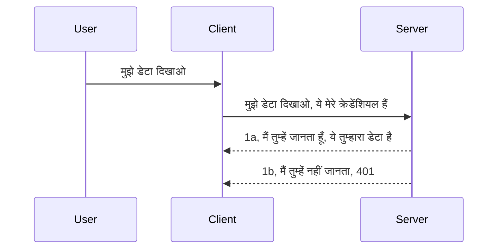

# सरल प्रमाणीकरण

MCP SDKs OAuth 2.1 के उपयोग का समर्थन करते हैं जो कि एक काफी जटिल प्रक्रिया है जिसमें प्रमाणीकरण सर्वर, संसाधन सर्वर, प्रमाण-पत्र भेजना, कोड प्राप्त करना, उस कोड को एक बीयरर टोकन से बदलना शामिल है जब तक कि आप अंततः अपने संसाधन डेटा तक पहुँच न सकें। अगर आप OAuth के उपयोग में नए हैं जो कि लागू करने के लिए एक बहुत अच्छी चीज़ है, तो कुछ बुनियादी स्तर के प्रमाणीकरण से शुरू करना और बेहतर और बेहतर सुरक्षा की ओर बढ़ना एक अच्छा विचार है। इसलिए यह अध्याय मौजूद है, आपको अधिक उन्नत प्रमाणीकरण की ओर बढ़ाने के लिए।

## प्रमाणीकरण, हमारा मतलब क्या है?

प्रमाणीकरण शब्द का संक्षिप्त रूप Authentication और Authorization के लिए है। विचार यह है कि हमें दो चीजें करनी हैं:

- **Authentication**: यह प्रक्रिया है यह पता लगाने की कि क्या हम किसी व्यक्ति को हमारे घर में प्रवेश करने दें, कि उनके पास "यहाँ" होने का अधिकार है, यानी हमारे संसाधन सर्वर तक पहुँच है जहाँ हमारे MCP सर्वर के फीचर्स मौजूद हैं।
- **Authorization**: यह प्रक्रिया है यह पता लगाने की कि क्या उपयोगकर्ता को वे विशिष्ट संसाधन मिलना चाहिए जिनकी वे मांग कर रहे हैं, जैसे ये ऑर्डर या ये उत्पाद, या क्या उन्हें सामग्री पढ़ने की अनुमति है लेकिन हटाने की नहीं, जैसा एक दूसरा उदाहरण।

## प्रमाण-पत्र: हम सिस्टम को कैसे बताते हैं कि हम कौन हैं

अधिकांश वेब डेवलपर्स सर्वर को एक प्रमाण-पत्र प्रदान करने के बारे में सोचते हैं, आमतौर पर एक सीक्रेट जो यह बताता है कि क्या उन्हें यहाँ होने की अनुमति है ("Authentication")। यह प्रमाण-पत्र आमतौर पर यूजरनेम और पासवर्ड का बेस64 एन्कोडेड संस्करण होता है या एक API कुंजी जो एक विशिष्ट उपयोगकर्ता की पहचान करती है।

इसमें इसे "Authorization" नामक हेडर के माध्यम से भेजना शामिल है, इस प्रकार:

```json
{ "Authorization": "secret123" }
```

इस प्रकार के प्रमाणीकरण को आमतौर पर basic authentication कहा जाता है। कुल प्रवाह इस प्रकार काम करता है:


अब जब हमें प्रवाह के दृष्टिकोण से समझ में आ गया कि यह कैसे काम करता है, तो हम इसे कैसे लागू करें? अधिकांश वेब सर्वरों में middleware की अवधारणा होती है, एक कोड का हिस्सा जो अनुरोध का हिस्सा के रूप में चलता है और जो प्रमाण-पत्रों को सत्यापित कर सकता है, और यदि प्रमाण-पत्र वैध हैं, तो अनुरोध को आगे बढ़ने देता है। यदि अनुरोध में मान्य प्रमाण-पत्र नहीं हैं तो आपको एक प्रमाणीकरण त्रुटि मिलती है। आइए देखें कि इसे कैसे लागू किया जा सकता है:

**Python**

```python
class AuthMiddleware(BaseHTTPMiddleware):
    async def dispatch(self, request, call_next):

        has_header = request.headers.get("Authorization")
        if not has_header:
            print("-> Missing Authorization header!")
            return Response(status_code=401, content="Unauthorized")

        if not valid_token(has_header):
            print("-> Invalid token!")
            return Response(status_code=403, content="Forbidden")

        print("Valid token, proceeding...")
       
        response = await call_next(request)
        # किसी भी कस्टमर हेडर को जोड़ें या प्रतिक्रिया में किसी तरह का परिवर्तन करें
        return response


starlette_app.add_middleware(CustomHeaderMiddleware)
```

यहाँ हमारे पास है:

- एक middleware बनाया गया है जिसका नाम `AuthMiddleware` है, जिसमें इसका `dispatch` मेथड वेब सर्वर द्वारा बुलाया जाता है।
- Middleware को वेब सर्वर में जोड़ा गया है:

    ```python
    starlette_app.add_middleware(AuthMiddleware)
    ```

- जांच का लॉजिक लिखा गया है जो देखता है कि Authorization हेडर मौजूद है या नहीं और जो सीक्रेट भेजा जा रहा है वह वैध है या नहीं:

    ```python
    has_header = request.headers.get("Authorization")
    if not has_header:
        print("-> Missing Authorization header!")
        return Response(status_code=401, content="Unauthorized")

    if not valid_token(has_header):
        print("-> Invalid token!")
        return Response(status_code=403, content="Forbidden")
    ```

    यदि सीक्रेट मौजूद है और वैध है, तब हम `call_next` को कॉल कर अनुरोध को पास करते हैं और प्रतिक्रिया लौटाते हैं।

    ```python
    response = await call_next(request)
    # कोई भी कस्टमर हेडर जोड़ें या प्रतिक्रिया में किसी प्रकार का परिवर्तन करें
    return response
    ```

यह इस प्रकार काम करता है कि जब भी वेब अनुरोध सर्वर की ओर किया जाता है तो middleware को बुलाया जाता है और इसकी कार्यान्वयन के अनुसार यह या तो अनुरोध को पास कर देगा या एक त्रुटि लौटाएगा जो दर्शाती है कि क्लाइंट को आगे बढ़ने की अनुमति नहीं है।

**TypeScript**

यहाँ हम लोकप्रिय फ्रेमवर्क Express के साथ एक middleware बनाते हैं और MCP सर्वर तक पहुँचने से पहले अनुरोध को रोकते हैं। यहाँ इसका कोड है:

```typescript
function isValid(secret) {
    return secret === "secret123";
}

app.use((req, res, next) => {
    // 1. प्राधिकरण हेडर मौजूद है?
    if(!req.headers["Authorization"]) {
        res.status(401).send('Unauthorized');
    }
    
    let token = req.headers["Authorization"];

    // 2. वैधता जांचें।
    if(!isValid(token)) {
        res.status(403).send('Forbidden');
    }

   
    console.log('Middleware executed');
    // 3. अनुरोध पाइपलाइन में अगले चरण को अनुरोध भेजें।
    next();
});
```

इस कोड में हम:

1. सबसे पहले चेक करते हैं कि Authorization हेडर मौजूद है या नहीं, यदि नहीं है तो 401 त्रुटि भेजते हैं।
2. प्रमाण-पत्र/टोकन को वैध मानते हैं, यदि नहीं है तो 403 त्रुटि भेजते हैं।
3. अंततः अनुरोध पाइपलाइन में अनुरोध को आगे बढ़ाते हैं और मांगे गए संसाधन को लौटाते हैं।

## अभ्यास: प्रमाणीकरण लागू करें

आइए अपने ज्ञान का उपयोग करके इसे लागू करने का प्रयास करें। योजना इस प्रकार है:

सर्वर

- एक वेब सर्वर और MCP इंस्टेंस बनाएं।
- सर्वर के लिए एक middleware लागू करें।

क्लाइंट

- प्रमाण-पत्र के साथ वेब अनुरोध भेजें, हेडर द्वारा।

### -1- एक वेब सर्वर और MCP इंस्टेंस बनाएं

अपने पहले चरण में, हमें वेब सर्वर इंस्टेंस और MCP सर्वर बनाना होगा।

**Python**

यहाँ हम MCP सर्वर का एक इंस्टेंस बनाते हैं, starlette वेब ऐप बनाते हैं और उसे uvicorn के साथ होस्ट करते हैं।

```python
# MCP सर्वर बना रहा है

app = FastMCP(
    name="MCP Resource Server",
    instructions="Resource Server that validates tokens via Authorization Server introspection",
    host=settings["host"],
    port=settings["port"],
    debug=True
)

# स्टारलेट वेब ऐप बना रहा है
starlette_app = app.streamable_http_app()

# uvicorn के माध्यम से ऐप सर्विंग कर रहा है
async def run(starlette_app):
    import uvicorn
    config = uvicorn.Config(
            starlette_app,
            host=app.settings.host,
            port=app.settings.port,
            log_level=app.settings.log_level.lower(),
        )
    server = uvicorn.Server(config)
    await server.serve()

run(starlette_app)
```

इस कोड में हम:

- MCP सर्वर बनाते हैं।
- MCP सर्वर से starlette वेब ऐप बना रहे हैं, `app.streamable_http_app()`।
- वेब ऐप को uvicorn के साथ होस्ट और सर्व कर रहे हैं `server.serve()`।

**TypeScript**

यहाँ हम MCP सर्वर का एक इंस्टेंस बनाते हैं।

```typescript
const server = new McpServer({
      name: "example-server",
      version: "1.0.0"
    });

    // ... सर्वर संसाधन, उपकरण, और प्रॉम्प्ट्स सेट करें ...
```

यह MCP सर्वर निर्माण हमारे POST /mcp रूट डिफिनिशन के अंतर्गत होना चाहिए, तो चलिए उपरोक्त कोड को इस तरह ले चलते हैं:

```typescript
import express from "express";
import { randomUUID } from "node:crypto";
import { McpServer } from "@modelcontextprotocol/sdk/server/mcp.js";
import { StreamableHTTPServerTransport } from "@modelcontextprotocol/sdk/server/streamableHttp.js";
import { isInitializeRequest } from "@modelcontextprotocol/sdk/types.js"

const app = express();
app.use(express.json());

// सत्र आईडी द्वारा ट्रांसपोर्ट स्टोर करने के लिए मानचित्र
const transports: { [sessionId: string]: StreamableHTTPServerTransport } = {};

// क्लाइंट-से-सर्वर संचार के लिए POST अनुरोध संभालें
app.post('/mcp', async (req, res) => {
  // मौजूदा सत्र आईडी जांचें
  const sessionId = req.headers['mcp-session-id'] as string | undefined;
  let transport: StreamableHTTPServerTransport;

  if (sessionId && transports[sessionId]) {
    // मौजूदा ट्रांसपोर्ट पुन: उपयोग करें
    transport = transports[sessionId];
  } else if (!sessionId && isInitializeRequest(req.body)) {
    // नया इनिशियलाइज़ेशन अनुरोध
    transport = new StreamableHTTPServerTransport({
      sessionIdGenerator: () => randomUUID(),
      onsessioninitialized: (sessionId) => {
        // सत्र आईडी द्वारा ट्रांसपोर्ट स्टोर करें
        transports[sessionId] = transport;
      },
      // DNS रीबाइंडिंग सुरक्षा डिफ़ॉल्ट रूप से पीछे की संगतता के लिए अक्षम है। यदि आप यह सर्वर
      // स्थानीय रूप से चला रहे हैं, तो सुनिश्चित करें कि सेट करें:
      // enableDnsRebindingProtection: true,
      // allowedHosts: ['127.0.0.1'],
    });

    // बंद होने पर ट्रांसपोर्ट साफ़ करें
    transport.onclose = () => {
      if (transport.sessionId) {
        delete transports[transport.sessionId];
      }
    };
    const server = new McpServer({
      name: "example-server",
      version: "1.0.0"
    });

    // ... सर्वर संसाधन, उपकरण, और प्रॉम्प्ट सेट करें ...

    // MCP सर्वर से कनेक्ट करें
    await server.connect(transport);
  } else {
    // अमान्य अनुरोध
    res.status(400).json({
      jsonrpc: '2.0',
      error: {
        code: -32000,
        message: 'Bad Request: No valid session ID provided',
      },
      id: null,
    });
    return;
  }

  // अनुरोध संभालें
  await transport.handleRequest(req, res, req.body);
});

// GET और DELETE अनुरोधों के लिए पुन: उपयोगयोग्य हैंडलर
const handleSessionRequest = async (req: express.Request, res: express.Response) => {
  const sessionId = req.headers['mcp-session-id'] as string | undefined;
  if (!sessionId || !transports[sessionId]) {
    res.status(400).send('Invalid or missing session ID');
    return;
  }
  
  const transport = transports[sessionId];
  await transport.handleRequest(req, res);
};

// SSE के माध्यम से सर्वर-से-क्लाइंट सूचनाओं के लिए GET अनुरोध संभालें
app.get('/mcp', handleSessionRequest);

// सत्र समाप्ति के लिए DELETE अनुरोध संभालें
app.delete('/mcp', handleSessionRequest);

app.listen(3000);
```

अब आप देख सकते हैं कि MCP सर्वर निर्माण `app.post("/mcp")` के भीतर कैसे स्थानांतरित किया गया है।

आइए अगले चरण पर चलते हैं middleware बनाने के लिए ताकि हम आने वाले प्रमाण-पत्र को मान्य कर सकें।

### -2- सर्वर के लिए middleware लागू करें

अब middleware भाग की बारी है। यहाँ हम ऐसा middleware बनाएंगे जो `Authorization` हेडर में प्रमाण-पत्र ढूंढेगा और उसकी पुष्टि करेगा। यदि स्वीकार्य हो तो अनुरोध उस काम के लिए आगे बढ़ जाएगा जो करना है (जैसे टूल्स सूचीबद्ध करना, संसाधन पढ़ना या कोई भी MCP फ़ंक्शन जो क्लाइंट मांग रहा हो)।

**Python**

middleware बनाने के लिए, हमें एक ऐसा क्लास बनाना होगा जो `BaseHTTPMiddleware` से इनहेरिट करता हो। इसमें दो महत्वपूर्ण चीजें हैं:

- अनुरोध `request`, जिससे हम हेडर की जानकारी पढ़ते हैं।
- `call_next`, वह कॉलबैक जिसे हमें कॉल करना होता है यदि क्लाइंट ने कोई स्वीकार्य प्रमाण-पत्र भेजा हो।

सबसे पहले, अगर `Authorization` हेडर गायब हो तो उसे संभालना होगा:

```python
has_header = request.headers.get("Authorization")

# कोई हेडर मौजूद नहीं, 401 के साथ असफल, अन्यथा आगे बढ़ें।
if not has_header:
    print("-> Missing Authorization header!")
    return Response(status_code=401, content="Unauthorized")
```

यहाँ हम 401 unauthorized संदेश भेजते हैं क्योंकि क्लाइंट प्रमाणीकरण में विफल हो रहा है।

इसके बाद, यदि एक प्रमाण-पत्र भेजा गया था, तो उसकी वैधता इस प्रकार जांचें:

```python
 if not valid_token(has_header):
    print("-> Invalid token!")
    return Response(status_code=403, content="Forbidden")
```

देखें कि ऊपर हमने 403 forbidden संदेश भेजा है। नीचे पूरी middleware देखिए जिसमें हमने ऊपर कही गई सब कुछ लागू किया है:

```python
class AuthMiddleware(BaseHTTPMiddleware):
    async def dispatch(self, request, call_next):

        has_header = request.headers.get("Authorization")
        if not has_header:
            print("-> Missing Authorization header!")
            return Response(status_code=401, content="Unauthorized")

        if not valid_token(has_header):
            print("-> Invalid token!")
            return Response(status_code=403, content="Forbidden")

        print("Valid token, proceeding...")
        print(f"-> Received {request.method} {request.url}")
        response = await call_next(request)
        response.headers['Custom'] = 'Example'
        return response

```

बहुत बढ़िया, लेकिन `valid_token` फंक्शन क्या है? यह यहाँ है नीचे:
:

```python
# उत्पादन के लिए उपयोग न करें - इसे सुधारें !!
def valid_token(token: str) -> bool:
    # "Bearer " उपसर्ग को हटा दें
    if token.startswith("Bearer "):
        token = token[7:]
        return token == "secret-token"
    return False
```

यह निश्चित रूप से बेहतर हो सकता है।

महत्वपूर्ण: आपको कभी भी ऐसे सीक्रेट्स कोड में नहीं रखना चाहिए। आपको ideally मूल्य की तुलना किसी डेटा स्रोत या IDP (identity service provider) से करनी चाहिए, या बेहतर यह होगा कि IDP ही वैधता जांच करे।

**TypeScript**

Express के साथ इसे लागू करने के लिए, हमें `use` मेथड को कॉल करना होगा जो middleware फंक्शन्स लेता है।

हमें करना होगा:

- `Authorization` प्रॉपर्टी में पास किए गए प्रमाण-पत्र को जांचने के लिए अनुरोध वेरिएबल के साथ इंटरैक्ट करना।
- प्रमाण-पत्र को जांचना, और यदि वैध हो तो अनुरोध को जारी रखना ताकि क्लाइंट का MCP अनुरोध अपना काम कर सके (जैसे टूल्स सूचीबद्ध करना, संसाधन पढ़ना आदि)।

यहाँ, हम देख रहे हैं कि `Authorization` हेडर मौजूद है या नहीं, और यदि नहीं है, तो अनुरोध को रोका जाता है:

```typescript
if(!req.headers["authorization"]) {
    res.status(401).send('Unauthorized');
    return;
}
```

यदि हेडर कभी नहीं मिला तो आप 401 पाते हैं।

इसके बाद, हम जांचते हैं कि प्रमाण-पत्र वैध है या नहीं, अगर नहीं तो हम फिर से अनुरोध को रोक देते हैं लेकिन संदेश थोड़ा अलग होता है:

```typescript
if(!isValid(token)) {
    res.status(403).send('Forbidden');
    return;
} 
```

अब आपको 403 त्रुटि मिलती है।

यहाँ पूरा कोड है:

```typescript
app.use((req, res, next) => {
    console.log('Request received:', req.method, req.url, req.headers);
    console.log('Headers:', req.headers["authorization"]);
    if(!req.headers["authorization"]) {
        res.status(401).send('Unauthorized');
        return;
    }
    
    let token = req.headers["authorization"];

    if(!isValid(token)) {
        res.status(403).send('Forbidden');
        return;
    }  

    console.log('Middleware executed');
    next();
});
```

हमने वेब सर्वर को ऐसा middleware स्वीकार करने के लिए सेट किया है जो क्लाइंट द्वारा भेजे जाने की आशा वाले प्रमाण-पत्र की जांच करे। क्लाइंट पर क्या?

### -3- प्रमाण-पत्र के साथ वेब अनुरोध भेजें

हमें सुनिश्चित करना होगा कि क्लाइंट प्रमाण-पत्र हेडर के माध्यम से भेज रहा है। चूंकि हम MCP क्लाइंट का उपयोग करने जा रहे हैं, हमें पता लगाना होगा कि यह कैसे किया जाता है।

**Python**

क्लाइंट के लिए, हमें इस प्रकार एक हेडर में प्रमाण-पत्र पास करना होगा:

```python
# मान को हार्डकोड न करें, इसे कम से कम एक पर्यावरण चर या अधिक सुरक्षित संग्रह में रखें
token = "secret-token"

async with streamablehttp_client(
        url = f"http://localhost:{port}/mcp",
        headers = {"Authorization": f"Bearer {token}"}
    ) as (
        read_stream,
        write_stream,
        session_callback,
    ):
        async with ClientSession(
            read_stream,
            write_stream
        ) as session:
            await session.initialize()
      
            # TODO, क्लाइंट में आप क्या करना चाहते हैं, जैसे टूल्स की सूची बनाना, टूल्स को कॉल करना आदि।
```

देखें कि हमने `headers` प्रॉपर्टी को इस तरह पॉपुलेट किया ` headers = {"Authorization": f"Bearer {token}"}`।

**TypeScript**

हम इसे दो चरणों में हल कर सकते हैं:

1. अपने प्रमाण-पत्र के साथ एक कॉन्फ़िगरेशन ऑब्जेक्ट बनाएं।
2. उस कॉन्फ़िगरेशन ऑब्जेक्ट को ट्रांसपोर्ट को पास करें।

```typescript

// यहाँ दिखाए गए जैसा मान को हार्डकोड न करें। कम से कम इसे एक पर्यावरण चर के रूप में रखें और विकास मोड में dotenv जैसे कुछ का उपयोग करें।
let token = "secret123"

// एक क्लाइंट ट्रांसपोर्ट विकल्प वस्तु परिभाषित करें
let options: StreamableHTTPClientTransportOptions = {
  sessionId: sessionId,
  requestInit: {
    headers: {
      "Authorization": "secret123"
    }
  }
};

// विकल्प वस्तु को ट्रांसपोर्ट को पास करें
async function main() {
   const transport = new StreamableHTTPClientTransport(
      new URL(serverUrl),
      options
   );
```

यहाँ आप देख सकते हैं कि हमें `options` ऑब्जेक्ट बनाना पड़ा और हमारे हेडर को `requestInit` प्रॉपर्टी के अंतर्गत रखना पड़ा।

महत्वपूर्ण: यहाँ से हम इसे कैसे सुधारते हैं? वर्तमान कार्यान्वयन में कुछ समस्याएँ हैं। सबसे पहले, ऐसे प्रमाण-पत्र भेजना विशेष रूप से जोखिम भरा है जब तक कि आपके पास कम से कम HTTPS न हो। तब भी, प्रमाण-पत्र चोरी हो सकता है इसलिए आपको एक प्रणाली चाहिए जहां आप आसानी से टोकन को रद्द कर सकें और अतिरिक्त चेक जोड़ सकें जैसे कि यह दुनिया के कहाँ से आ रहा है, क्या अनुरोध बहुत बार हो रहा है (बॉट जैसी गतिविधि), संक्षेप में, कई चिंताएँ हैं।

फिर भी, यह कहा जाना चाहिए कि बहुत सरल APIs के लिए जहाँ आप नहीं चाहते कि कोई बिना प्रमाणीकरण के आपकी API को कॉल करे, और जो हमारे यहाँ है, वह एक अच्छा शुरुआती बिंदु है।

इतना कहने के बाद, चलिए सुरक्षा को थोड़ा मजबूत करते हैं JSON Web Token, जिसे JWT या "JOT" टोकन भी कहा जाता है, के उपयोग से।

## JSON Web Tokens, JWT

तो, हम बहुत सरल प्रमाण-पत्र भेजने से बेहतर करने की कोशिश कर रहे हैं। JWT अपनाने से हमें तुरंत क्या सुधार मिलता है?

- **सुरक्षा सुधार**। बुनियादी प्रमाणीकरण में, आप यूजरनेम और पासवर्ड बार-बार बेस64 एन्कोडेड टोकन के रूप में भेजते हैं (या API कुंजी भेजते हैं) जो जोखिम बढ़ाता है। JWT के साथ, आप अपना यूजरनेम और पासवर्ड भेजते हैं और बदले में एक टोकन प्राप्त करते हैं जो समय सीमा बंधित होता है यानी यह समाप्त हो जाएगा। JWT आपको सहजता से रोल, स्कोप और अनुमति आदि का उपयोग करते हुए सूक्ष्म-सतही एक्सेस नियंत्रण करने देता है।
- **राज्यहीनता और स्केलेबिलिटी**। JWT स्वयं-संवाहित होते हैं, वे सभी उपयोगकर्ता जानकारी साथ लाते हैं और सर्वर-साइड सत्र संग्रहण की आवश्यकता को समाप्त करते हैं। टोकन को स्थानीय रूप से भी मान्य किया जा सकता है।
- **इंटरऑपरेबिलिटी और संघटन**। JWT Open ID Connect का केंद्र है और ज्ञात पहचान प्रदाताओं जैसे Entra ID, Google Identity और Auth0 के साथ उपयोग किया जाता है। वे सिंगल साइन-ऑन और बहुत कुछ को संभव बनाते हैं जिससे यह उद्यम-ग्रेड हो जाता है।
- **मॉड्यूलैरिटी और लचीलापन**। JWT को Azure API Management, NGINX जैसे API गेटवे के साथ भी इस्तेमाल किया जा सकता है। यह उपयोग प्रमाणीकरण परिदृश्यों और सेवा से सेवा संचार जिसमें नकल और प्रतिनिधित्व परिदृश्यों को भी समर्थन करता है।
- **प्रदर्शन और कैशिंग**। JWT को डिकोड करने के बाद कैश किया जा सकता है जो पार्सिंग की आवश्यकता को कम करता है। यह उच्च ट्रैफ़िक ऐप्स के लिए मददगार है क्योंकि यह थ्रूपुट में सुधार करता है और आपके चुने हुए इन्फ्रास्ट्रक्चर पर लोड को कम करता है।
- **उन्नत फीचर**। यह introspection (सर्वर पर वैधता जांच) और रद्दीकरण (टोकन को अमान्य बनाना) को भी समर्थन करता है।

इन सभी फ़ायदों के साथ, आइए देखें कि हम अपनी कार्यान्वयन को अगले स्तर तक कैसे ले जा सकते हैं।

## बेसिक ऑथ को JWT में बदलना

तो, हमें उच्च-स्तरीय स्तर पर जिन बदलावों की जरूरत है वे हैं:

- **JWT टोकन बनाना सीखना** और इसे क्लाइंट से सर्वर तक भेजने के लिए तैयार करना।
- **JWT टोकन सत्यापित करना**, और यदि वैध हो तो क्लाइंट को हमारे संसाधन देना।
- **सुरक्षित टोकन भंडारण**। हम इस टोकन को कैसे संग्रह करते हैं।
- **रूट्स की सुरक्षा**। हमें रूट्स, हमारे मामले में MCP के विशिष्ट फीचर्स को सुरक्षा प्रदान करनी होगी।
- **रिफ्रेश टोकन जोड़ना**। सुनिश्चित करें कि हम छोटे जीवनकाल वाले टोकन बनाएं लेकिन साथ में लंबे जीवनकाल के रिफ्रेश टोकन भी जो समाप्त होने पर नए टोकन प्राप्त करने के लिए उपयोग किए जा सकें। साथ ही रिफ्रेश एन्डपॉइंट और रोटेशन रणनीति हो।

### -1- JWT टोकन बनाना

सबसे पहले, एक JWT टोकन में निम्न भाग होते हैं:

- **हेडर**, इस्तेमाल किए गए एल्गोरिदम और टोकन प्रकार।
- **पेलोड**, क्लेम्स, जैसे sub (जो उपयोगकर्ता या संस्था टोकन का प्रतिनिधित्व करता है। प्रमाणीकरण परिदृश्य में यह आमतौर पर userid होता है), exp (यह कब समाप्त होगा) रोल (भूमिका)
- **सिग्नेचर**, जो किसी सीक्रेट या निजी कुंजी से साइन किया गया हो।

इसके लिए, हमें हेडर, पेलोड बनाना होगा और एन्कोडेड टोकन तैयार करना होगा।

**Python**

```python

import jwt
import jwt
from jwt.exceptions import ExpiredSignatureError, InvalidTokenError
import datetime

# JWT को साइन करने के लिए उपयोग किया गया गुप्त कुंजी
secret_key = 'your-secret-key'

header = {
    "alg": "HS256",
    "typ": "JWT"
}

# उपयोगकर्ता जानकारी और इसके दावे और समाप्ति समय
payload = {
    "sub": "1234567890",               # विषय (उपयोगकर्ता आईडी)
    "name": "User Userson",                # कस्टम दावा
    "admin": True,                     # कस्टम दावा
    "iat": datetime.datetime.utcnow(),# जारी किया गया
    "exp": datetime.datetime.utcnow() + datetime.timedelta(hours=1)  # समाप्ति
}

# इसे एन्कोड करें
encoded_jwt = jwt.encode(payload, secret_key, algorithm="HS256", headers=header)
```

ऊपर के कोड में हमने:

- HS256 एल्गोरिदम का उपयोग करते हुए और टोकन प्रकार JWT निर्धारित किया।
- एक पेलोड बनाया जिसमें सब्जेक्ट या उपयोगकर्ता आईडी, उपयोगकर्ता नाम, भूमिका, जारी करने का समय और समाप्ति समय शामिल हैं जिससे हमने ऊपर बताया समय-सीमा संबंधी पहलू लागू किया।

**TypeScript**

यहाँ हमें कुछ निर्भरता चाहिए जो हमें JWT टोकन बनाने में मदद करेंगी।

निर्भरता

```sh

npm install jsonwebtoken
npm install --save-dev @types/jsonwebtoken
```

अब जब यह हो गया है, तो चलिए हेडर, पेलोड बनाएं और उसके माध्यम से एन्कोडेड टोकन बनाएं।

```typescript
import jwt from 'jsonwebtoken';

const secretKey = 'your-secret-key'; // प्रोडक्शन में env vars का उपयोग करें

// पेलोड को परिभाषित करें
const payload = {
  sub: '1234567890',
  name: 'User usersson',
  admin: true,
  iat: Math.floor(Date.now() / 1000), // जारी किया गया
  exp: Math.floor(Date.now() / 1000) + 60 * 60 // 1 घंटे में समाप्त हो जाता है
};

// हेडर को परिभाषित करें (वैकल्पिक, jsonwebtoken डिफ़ॉल्ट सेट करता है)
const header = {
  alg: 'HS256',
  typ: 'JWT'
};

// टोकन बनाएं
const token = jwt.sign(payload, secretKey, {
  algorithm: 'HS256',
  header: header
});

console.log('JWT:', token);
```

यह टोकन:

HS256 का उपयोग करके हस्ताक्षरित है,
1 घंटे के लिए मान्य है,
जिसमें sub, name, admin, iat, और exp जैसे क्लेम्स शामिल हैं।

### -2- टोकन सत्यापित करना

हमें टोकन को सत्यापित भी करना होगा, यह कुछ ऐसा है जो हमें सर्वर पर करना चाहिए यह सुनिश्चित करने के लिए कि क्लाइंट जो टोकन भेज रहा है वह वास्तव में वैध है। यहाँ हमें इसकी संरचना और वैधता सहित कई चेक करने चाहिए। आपको यह भी प्रोत्साहित किया जाता है कि आप अतिरिक्त जांच करें जैसे कि उपयोगकर्ता हमारी प्रणाली में है या नहीं और अन्य।

टोकन को सत्यापित करने के लिए हमें इसे डिकोड करना होगा ताकि हम इसे पढ़ सकें और फिर उसकी वैधता की जाँच करें:

**Python**

```python

# JWT को डिकोड करें और सत्यापित करें
try:
    decoded = jwt.decode(token, secret_key, algorithms=["HS256"])
    print("✅ Token is valid.")
    print("Decoded claims:")
    for key, value in decoded.items():
        print(f"  {key}: {value}")
except ExpiredSignatureError:
    print("❌ Token has expired.")
except InvalidTokenError as e:
    print(f"❌ Invalid token: {e}")

```

इस कोड में, हम `jwt.decode` को कॉल करते हैं जो टोकन, सीक्रेट कुंजी और चुने गए एल्गोरिदम को इनपुट के रूप में लेता है। ध्यान दें कि हम try-catch संरचना का उपयोग करते हैं क्योंकि असफल सत्यापन पर त्रुटि उत्पन्न होती है।

**TypeScript**

यहाँ हमें `jwt.verify` को कॉल करना होगा ताकि टोकन का डिकोडेड संस्करण प्राप्त हो जो हम आगे विश्लेषण कर सकें। यदि यह कॉल विफल हो जाती है, तो इसका अर्थ है कि टोकन का ढांचा गलत है या वह अब वैध नहीं है।

```typescript

try {
  const decoded = jwt.verify(token, secretKey);
  console.log('Decoded Payload:', decoded);
} catch (err) {
  console.error('Token verification failed:', err);
}
```

ध्यान दें: जैसा कि पहले बताया गया, हमें यह सुनिश्चित करने के लिए अतिरिक्त जांच करनी चाहिए कि यह टोकन हमारे सिस्टम में किसी उपयोगकर्ता को दर्शाता है और उपयोगकर्ता के पास वह अधिकार हैं जो वह दावा करता है।
Next, चलिए role based access control, जिसे RBAC भी कहा जाता है, के बारे में देखते हैं।

## Adding role based access control

विचार यह है कि हम यह बताना चाहते हैं कि विभिन्न रोल्स के पास विभिन्न अनुमतियाँ होती हैं। उदाहरण के लिए, हम मानते हैं कि एक एडमिन सब कुछ कर सकता है और कि सामान्य उपयोगकर्ता पढ़/लिख सकते हैं और एक गेस्ट केवल पढ़ सकता है। इसलिए, यहाँ कुछ संभावित अनुमति स्तर हैं:

- Admin.Write 
- User.Read
- Guest.Read

आइए देखें कि हम इसे middleware के साथ कैसे लागू कर सकते हैं। Middlewares को प्रत्येक route पर या सभी routes के लिए जोड़ा जा सकता है।

**Python**

```python
from starlette.middleware.base import BaseHTTPMiddleware
from starlette.responses import JSONResponse
import jwt

# कोड में रहस्य न रखें, यह केवल प्रदर्शन उद्देश्य के लिए है। इसे एक सुरक्षित स्थान से पढ़ें।
SECRET_KEY = "your-secret-key" # इसे env वेरिएबल में डालें।
REQUIRED_PERMISSION = "User.Read"

class JWTPermissionMiddleware(BaseHTTPMiddleware):
    async def dispatch(self, request, call_next):
        auth_header = request.headers.get("Authorization")
        if not auth_header or not auth_header.startswith("Bearer "):
            return JSONResponse({"error": "Missing or invalid Authorization header"}, status_code=401)

        token = auth_header.split(" ")[1]
        try:
            decoded = jwt.decode(token, SECRET_KEY, algorithms=["HS256"])
        except jwt.ExpiredSignatureError:
            return JSONResponse({"error": "Token expired"}, status_code=401)
        except jwt.InvalidTokenError:
            return JSONResponse({"error": "Invalid token"}, status_code=401)

        permissions = decoded.get("permissions", [])
        if REQUIRED_PERMISSION not in permissions:
            return JSONResponse({"error": "Permission denied"}, status_code=403)

        request.state.user = decoded
        return await call_next(request)


```

middleware जोड़ने के कुछ विभिन्न तरीके हैं, नीचे देखें:

```python

# विकल्प 1: स्टारलेट ऐप बनाते समय मिडलवेयर जोड़ें
middleware = [
    Middleware(JWTPermissionMiddleware)
]

app = Starlette(routes=routes, middleware=middleware)

# विकल्प 2: स्टारलेट ऐप पहले से बनाया गया है उसके बाद मिडलवेयर जोड़ें
starlette_app.add_middleware(JWTPermissionMiddleware)

# विकल्प 3: प्रत्येक रूट के लिए मिडलवेयर जोड़ें
routes = [
    Route(
        "/mcp",
        endpoint=..., # हैंडलर
        middleware=[Middleware(JWTPermissionMiddleware)]
    )
]
```

**TypeScript**

हम `app.use` और एक middleware का उपयोग कर सकते हैं जो सभी अनुरोधों के लिए चलेगा।

```typescript
app.use((req, res, next) => {
    console.log('Request received:', req.method, req.url, req.headers);
    console.log('Headers:', req.headers["authorization"]);

    // 1. जांचें कि क्या प्राधिकरण हेडर भेजा गया है

    if(!req.headers["authorization"]) {
        res.status(401).send('Unauthorized');
        return;
    }
    
    let token = req.headers["authorization"];

    // 2. जांचें कि टोकन वैध है या नहीं
    if(!isValid(token)) {
        res.status(403).send('Forbidden');
        return;
    }  

    // 3. जांचें कि टोकन उपयोगकर्ता हमारे सिस्टम में मौजूद है या नहीं
    if(!isExistingUser(token)) {
        res.status(403).send('Forbidden');
        console.log("User does not exist");
        return;
    }
    console.log("User exists");

    // 4. सत्यापित करें कि टोकन के पास सही अनुमतियाँ हैं
    if(!hasScopes(token, ["User.Read"])){
        res.status(403).send('Forbidden - insufficient scopes');
    }

    console.log("User has required scopes");

    console.log('Middleware executed');
    next();
});

```

हमारे middleware को कई चीजें करनी चाहिए और कर सकती हैं, अर्थात:

1. जांचें कि authorization header मौजूद है या नहीं
2. जांचें कि token वैध है, हम `isValid` कॉल करते हैं जो हमने लिखा एक method है जो JWT token की अखंडता और वैधता की जांच करता है।
3. verify करें कि user हमारे सिस्टम में मौजूद है, यह हमें चेक करना चाहिए।

   ```typescript
    // DB में उपयोगकर्ता
   const users = [
     "user1",
     "User usersson",
   ]

   function isExistingUser(token) {
     let decodedToken = verifyToken(token);

     // TODO, जांचें कि उपयोगकर्ता DB में मौजूद है या नहीं
     return users.includes(decodedToken?.name || "");
   }
   ```

ऊपर, हमने एक बहुत सरल `users` सूची बनाई है, जो स्पष्ट रूप से डेटाबेस में होनी चाहिए।

4. इसके अलावा, हमें यह भी जांचना चाहिए कि token में सही permissions हैं।

   ```typescript
   if(!hasScopes(token, ["User.Read"])){
        res.status(403).send('Forbidden - insufficient scopes');
   }
   ```

इस कोड में middleware से, हम जांचते हैं कि token में User.Read permission शामिल है या नहीं, यदि नहीं तो हम 403 error भेज देते हैं। नीचे `hasScopes` हेल्पर method है।

   ```typescript
   function hasScopes(scope: string, requiredScopes: string[]) {
     let decodedToken = verifyToken(scope);
    return requiredScopes.every(scope => decodedToken?.scopes.includes(scope));
  }
   ```

Have a think which additional checks you should be doing, but these are the absolute minimum of checks you should be doing.

Using Express as a web framework is a common choice. There are helpers library when you use JWT so you can write less code.

- `express-jwt`, helper library that provides a middleware that helps decode your token.
- `express-jwt-permissions`, this provides a middleware `guard` that helps check if a certain permission is on the token.

Here's what these libraries can look like when used:

```typescript
const express = require('express');
const jwt = require('express-jwt');
const guard = require('express-jwt-permissions')();

const app = express();
const secretKey = 'your-secret-key'; // put this in env variable

// Decode JWT and attach to req.user
app.use(jwt({ secret: secretKey, algorithms: ['HS256'] }));

// Check for User.Read permission
app.use(guard.check('User.Read'));

// multiple permissions
// app.use(guard.check(['User.Read', 'Admin.Access']));

app.get('/protected', (req, res) => {
  res.json({ message: `Welcome ${req.user.name}` });
});

// Error handler
app.use((err, req, res, next) => {
  if (err.code === 'permission_denied') {
    return res.status(403).send('Forbidden');
  }
  next(err);
});

```

अब आपने देखा कि middleware को authentication और authorization दोनों के लिए उपयोग किया जा सकता है, लेकिन MCP के लिए क्या होता है, क्या यह auth के तरीके को बदलता है? आइए अगली सेक्शन में पता लगाएं।

### -3- MCP में RBAC जोड़ना

अब तक आपने देखा कि आप RBAC को middleware के माध्यम से कैसे जोड़ सकते हैं, हालाँकि, MCP के लिए प्रत्येक MCP फीचर के लिए RBAC जोड़ना आसान नहीं है, तो हम क्या करते हैं? खैर, हमें बस ऐसा कोड जोड़ना होगा जो जांचे कि इस मामले में क्लाइंट के पास किसी विशेष टूल को कॉल करने के अधिकार हैं या नहीं:

आपके पास प्रति फीचर RBAC पूरा करने के लिए कुछ विभिन्न विकल्प हैं, यहाँ कुछ हैं:

- प्रत्येक टूल, resource, prompt के लिए जांच जोड़ें जहाँ आपको permission स्तर चेक करना है।

   **python**

   ```python
   @tool()
   def delete_product(id: int):
      try:
          check_permissions(role="Admin.Write", request)
      catch:
        pass # क्लाइंट प्राधिकरण में विफल रहा, प्राधिकरण त्रुटि उठाएं
   ```

   **typescript**

   ```typescript
   server.registerTool(
    "delete-product",
    {
      title: Delete a product",
      description: "Deletes a product",
      inputSchema: { id: z.number() }
    },
    async ({ id }) => {
      
      try {
        checkPermissions("Admin.Write", request);
        // करना है, productService और remote entry को id भेजना है
      } catch(Exception e) {
        console.log("Authorization error, you're not allowed");  
      }

      return {
        content: [{ type: "text", text: `Deletected product with id ${id}` }]
      };
    }
   );
   ```


- advanced server approach और request handlers का उपयोग करें ताकि आप जांच पूछने की जगहों की संख्या को कम कर सकें।

   **Python**

   ```python
   
   tool_permission = {
      "create_product": ["User.Write", "Admin.Write"],
      "delete_product": ["Admin.Write"]
   }

   def has_permission(user_permissions, required_permissions) -> bool:
      # user_permissions: उपयोगकर्ता के पास अनुमतियों की सूची
      # required_permissions: टूल के लिए आवश्यक अनुमतियों की सूची
      return any(perm in user_permissions for perm in required_permissions)

   @server.call_tool()
   async def handle_call_tool(
     name: str, arguments: dict[str, str] | None
   ) -> list[types.TextContent]:
    # मान लें कि request.user.permissions उपयोगकर्ता के लिए अनुमतियों की एक सूची है
     user_permissions = request.user.permissions
     required_permissions = tool_permission.get(name, [])
     if not has_permission(user_permissions, required_permissions):
        # त्रुटि उठाएं "आपके पास टूल {name} को कॉल करने की अनुमति नहीं है"
        raise Exception(f"You don't have permission to call tool {name}")
     # जारी रखें और टूल कॉल करें
     # ...
   ```   
   

   **TypeScript**

   ```typescript
   function hasPermission(userPermissions: string[], requiredPermissions: string[]): boolean {
       if (!Array.isArray(userPermissions) || !Array.isArray(requiredPermissions)) return false;
       // यदि उपयोगकर्ता के पास कम से कम एक आवश्यक अनुमति है तो true लौटाएं
       
       return requiredPermissions.some(perm => userPermissions.includes(perm));
   }
  
   server.setRequestHandler(CallToolRequestSchema, async (request) => {
      const { params: { name } } = request;
  
      let permissions = request.user.permissions;
  
      if (!hasPermission(permissions, toolPermissions[name])) {
         return new Error(`You don't have permission to call ${name}`);
      }
  
      // जारी रखें..
   });
   ```

   ध्यान दें, आपको यह सुनिश्चित करना होगा कि आपका middleware एक decoded token को request के user property में असाइन करे ताकि ऊपर दिया गया कोड सरल हो जाए।

### संक्षेप में

अब जब हमने सामान्य रूप से और विशेष रूप से MCP के लिए RBAC समर्थन जोड़ने पर चर्चा की है, तो समय है कि आप सुरक्षा को स्वयं लागू करने का प्रयास करें ताकि आप प्रस्तुत अवधारणाओं को समझ सकें।

## Assignment 1: बेसिक ऑथेंटिकेशन का उपयोग करके mcp सर्वर और mcp क्लाइंट बनाएं

यहाँ आप उन बातों को समझेंगे जो आपने credentials हेडर के माध्यम से भेजने के संदर्भ में सीखी हैं।

## Solution 1

[Solution 1](./code/basic/README.md)

## Assignment 2: असाइनमेंट 1 से समाधान को JWT का उपयोग करने के लिए अपग्रेड करें

पहले समाधान को लें लेकिन इस बार, चलिए इसे बेहतर बनाते हैं।

Basic Auth के बजाय, चलिए JWT का उपयोग करते हैं।

## Solution 2

[Solution 2](./solution/jwt-solution/README.md)

## Challenge

उस RBAC को प्रति टूल जोड़ें जैसा कि हमने सेक्शन "Add RBAC to MCP" में वर्णित किया है।

## Summary

आपने उम्मीद है कि इस अध्याय में बहुत कुछ सीखा होगा, बिलकुल बिना सुरक्षा से लेकर बेसिक सुरक्षा, JWT और इसे MCP में कैसे जोड़ा जा सकता है।

हमने कस्टम JWTs के साथ एक ठोस आधार बनाया है, लेकिन जैसे-जैसे हम स्केल करते हैं, हम मानक आधारित पहचान मॉडल की ओर बढ़ रहे हैं। Entra या Keycloak जैसे IdP को अपनाने से हमें token जारी करना, मान्य करना, और lifecycle प्रबंधन एक भरोसेमंद प्लेटफ़ॉर्म पर छोड़ने का मौका मिलता है — जिससे हम app लॉजिक और उपयोगकर्ता अनुभव पर ध्यान केंद्रित कर सकें।

उसके लिए, हमारे पास Entra पर एक अधिक [उन्नत अध्याय](../../05-AdvancedTopics/mcp-security-entra/README.md) है।

## What's Next

- अगला: [MCP Hosts सेटअप करना](../12-mcp-hosts/README.md)

---

<!-- CO-OP TRANSLATOR DISCLAIMER START -->
**स्वीकार्य शर्त**:
इस दस्तावेज़ का अनुवाद AI अनुवाद सेवा [Co-op Translator](https://github.com/Azure/co-op-translator) का उपयोग करके किया गया है। जबकि हम सटीकता के लिए प्रयासरत हैं, कृपया ध्यान रखें कि स्वचालित अनुवाद में त्रुटियाँ या गलतियां हो सकती हैं। मूल भाषा में दस्तावेज़ को ही प्रामाणिक स्रोत माना जाना चाहिए। महत्वपूर्ण जानकारी के लिए, पेशेवर मानव अनुवाद की सलाह दी जाती है। इस अनुवाद के उपयोग से उत्पन्न किसी भी गलतफहमी या गलत व्याख्या के लिए हम उत्तरदायी नहीं हैं।
<!-- CO-OP TRANSLATOR DISCLAIMER END -->