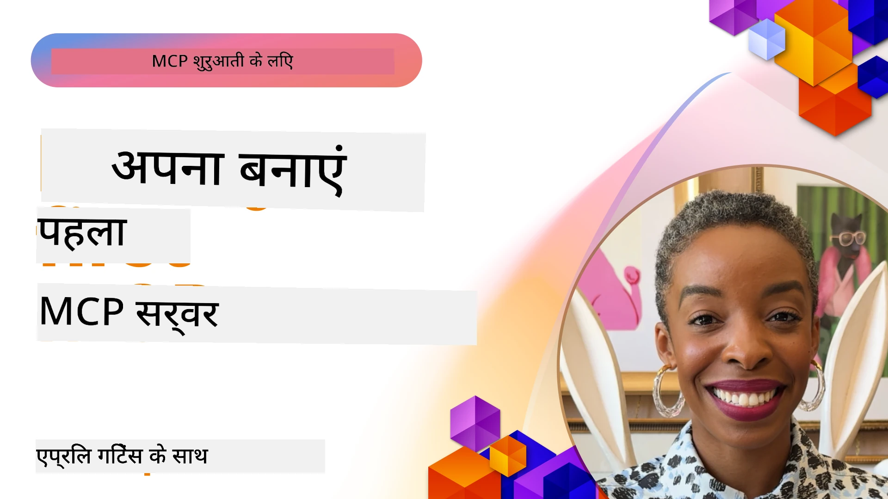

## Getting Started  

_(इस पाठ का वीडियो देखने के लिए ऊपर की छवि पर क्लिक करें)_

यह अनुभाग कई पाठों से मिलकर बना है:

- **1 आपका पहला सर्वर**, इस पहले पाठ में, आप अपना पहला सर्वर बनाना सीखेंगे और इसे इंस्पेक्टर टूल के साथ निरीक्षण करेंगे, जो आपके सर्वर को टेस्ट और डिबग करने का एक मूल्यवान तरीका है, [पाठ के लिए](01-first-server/README.md)

- **2 क्लाइंट**, इस पाठ में, आप सीखेंगे कि कैसे एक क्लाइंट लिखा जाता है जो आपके सर्वर से जुड़ सकता है, [पाठ के लिए](02-client/README.md)

- **3 LLM के साथ क्लाइंट**, क्लाइंट लिखने का एक बेहतर तरीका है कि उसमें LLM जोड़ा जाए ताकि वह आपके सर्वर के साथ "मोल-भाव" कर सके कि क्या करना है, [पाठ के लिए](03-llm-client/README.md)

- **4 GitHub Copilot एजेंट मोड के साथ एक सर्वर का उपयोग Visual Studio Code में**। यहाँ, हम Visual Studio Code के भीतर अपने MCP सर्वर को चलाने को देख रहे हैं, [पाठ के लिए](04-vscode/README.md)

- **5 stdio ट्रांसपोर्ट सर्वर** stdio ट्रांसपोर्ट स्थानीय MCP सर्वर-से-क्लाइंट संचार के लिए अनुशंसित मानक है, जो सुरक्षित सबप्रोसेस-आधारित संचार प्रदान करता है और इसमें अंतर्निहित प्रोसेस अलगाव होता है [पाठ के लिए](05-stdio-server/README.md)

- **6 MCP के साथ HTTP स्ट्रीमिंग (Streamable HTTP)**। आधुनिक HTTP स्ट्रीमिंग ट्रांसपोर्ट के बारे में सीखें (जो [MCP विनिर्देश 2025-11-25](https://spec.modelcontextprotocol.io/specification/2025-11-25/basic/transports/#streamable-http) के अनुसार दूरस्थ MCP सर्वरों के लिए अनुशंसित तरीका है), प्रगति सूचनाएं, और कैसे Streamable HTTP का उपयोग करके स्केलेबल, रियल-टाइम MCP सर्वर और क्लाइंट बनाएँ। [पाठ के लिए](06-http-streaming/README.md)

- **7 VSCode के लिए AI टूलकिट का उपयोग** अपने MCP क्लाइंट्स और सर्वरों को उपभोग और परीक्षण करने के लिए [पाठ के लिए](07-aitk/README.md)

- **8 परीक्षण**। यहाँ हम खासतौर पर देखेंगे कि हम अपने सर्वर और क्लाइंट को विभिन्न तरीकों से कैसे टेस्ट कर सकते हैं, [पाठ के लिए](08-testing/README.md)

- **9 डिप्लॉयमेंट**। यह अध्याय आपके MCP समाधानों को डिप्लॉय करने के विभिन्न तरीकों को देखेगा, [पाठ के लिए](09-deployment/README.md)

- **10 उन्नत सर्वर उपयोग**। यह अध्याय उन्नत सर्वर उपयोग को कवर करता है, [पाठ के लिए](./10-advanced/README.md)

- **11 प्रमाणीकरण**। यह अध्याय सरल प्रमाणीकरण जोड़ने के बारे में है, Basic Auth से JWT और RBAC तक। आपसे प्रोत्साहित किया जाता है कि आप यहाँ से शुरुआत करें और फिर अध्याय 5 के उन्नत विषय देखें और अध्याय 2 में अनुशंसाओं के अनुसार अतिरिक्त सुरक्षा मजबूत करें, [पाठ के लिए](./11-simple-auth/README.md)

- **12 MCP होस्ट्स**। लोकप्रिय MCP होस्ट क्लाइंट्स जैसे Claude Desktop, Cursor, Cline, और Windsurf को कॉन्फ़िगर और उपयोग करें। ट्रांसपोर्ट प्रकार और समस्या निवारण सीखें, [पाठ के लिए](./12-mcp-hosts/README.md)

- **13 MCP इंस्पेक्टर**। MCP इंस्पेक्टर टूल का उपयोग करके अपने MCP सर्वरों को इंटरैक्टिव रूप से डिबग और टेस्ट करें। उपकरणों, संसाधनों और प्रोटोकॉल संदेशों की समस्या निवारण सीखें, [पाठ के लिए](./13-mcp-inspector/README.md)

मॉडल कॉन्टेक्स्ट प्रोटोकॉल (MCP) एक खुला प्रोटोकॉल है जो यह मानकीकृत करता है कि आवेदन LLMs को संदर्भ कैसे प्रदान करते हैं। MCP को AI अनुप्रयोगों के लिए एक USB-C पोर्ट के रूप में सोचें - यह AI मॉडल को विभिन्न डेटा स्रोतों और उपकरणों से जोड़ने का एक मानकीकृत तरीका प्रदान करता है।

## सीखने के उद्देश्य

इस पाठ के अंत तक, आप सक्षम होंगे:

- C#, Java, Python, TypeScript, और JavaScript में MCP के लिए विकास पर्यावरण सेट अप करना
- कस्टम फीचर्स (संसाधन, प्रॉम्प्ट, और उपकरण) के साथ बुनियादी MCP सर्वर बनाना और तैनात करना
- होस्ट अनुप्रयोग बनाना जो MCP सर्वरों से जुड़ते हैं
- MCP कार्यान्वयन का परीक्षण और डिबग करना
- सामान्य सेटअप चुनौतियों और उनके समाधान को समझना
- अपने MCP कार्यान्वयनों को लोकप्रिय LLM सेवाओं से जोड़ना

## अपना MCP पर्यावरण सेट करना

MCP के साथ काम शुरू करने से पहले, अपने विकास पर्यावरण को तैयार करना और बुनियादी कार्यप्रवाह को समझना महत्वपूर्ण है। यह अनुभाग आपको शुरुआती सेटअप चरणों से मार्गदर्शन करेगा ताकि MCP के साथ एक सहज शुरुआत सुनिश्चित हो सके।

### आवश्यकताएँ

MCP विकास में हाथ डालने से पहले, सुनिश्चित करें कि आपके पास है:

- **विकास पर्यावरण**: आपकी चुनी हुई भाषा (C#, Java, Python, TypeScript, या JavaScript) के लिए
- **IDE/एडिटर**: Visual Studio, Visual Studio Code, IntelliJ, Eclipse, PyCharm, या कोई आधुनिक कोड संपादक
- **पैकेज मैनेजर्स**: NuGet, Maven/Gradle, pip, या npm/yarn
- **API कुंजियाँ**: उन किसी भी AI सेवाओं के लिए जिनका आप होस्ट एप्लिकेशन में उपयोग करने की योजना बनाते हैं

### आधिकारिक SDKs

आगामी अध्यायों में आप Python, TypeScript, Java, और .NET का उपयोग करके बनाए गए समाधान देखेंगे। यहाँ सभी आधिकारिक समर्थित SDKs हैं।

MCP कई भाषाओं के लिए आधिकारिक SDKs प्रदान करता है ([MCP विनिर्देश 2025-11-25](https://spec.modelcontextprotocol.io/specification/2025-11-25/) के अनुरूप):
- [C# SDK](https://github.com/modelcontextprotocol/csharp-sdk) - Microsoft के सहयोग से बनाए रखा गया
- [Java SDK](https://github.com/modelcontextprotocol/java-sdk) - Spring AI के सहयोग से बनाए रखा गया
- [TypeScript SDK](https://github.com/modelcontextprotocol/typescript-sdk) - आधिकारिक TypeScript कार्यान्वयन
- [Python SDK](https://github.com/modelcontextprotocol/python-sdk) - आधिकारिक Python कार्यान्वयन (FastMCP)
- [Kotlin SDK](https://github.com/modelcontextprotocol/kotlin-sdk) - आधिकारिक Kotlin कार्यान्वयन
- [Swift SDK](https://github.com/modelcontextprotocol/swift-sdk) - Loopwork AI के सहयोग से बनाए रखा गया
- [Rust SDK](https://github.com/modelcontextprotocol/rust-sdk) - आधिकारिक Rust कार्यान्वयन
- [Go SDK](https://github.com/modelcontextprotocol/go-sdk) - आधिकारिक Go कार्यान्वयन

## मुख्य बिंदु

- MCP विकास पर्यावरण सेट करना भाषा-विशिष्ट SDKs के साथ सरल है
- MCP सर्वर बनाने में स्पष्ट स्कीमाओं के साथ उपकरण बनाना और पंजीकृत करना शामिल है
- MCP क्लाइंट सर्वर और मॉडलों से जुड़ते हैं ताकि विस्तारित क्षमताओं का लाभ लिया जा सके
- विश्वसनीय MCP कार्यान्वयन के लिए परीक्षण और डिबगिंग आवश्यक हैं
- डिप्लॉयमेंट विकल्प स्थानीय विकास से क्लाउड-आधारित समाधानों तक होते हैं

## अभ्यास

हमारे पास नमूनों का एक सेट है जो इस अनुभाग में सभी अध्यायों में देखे जाने वाले अभ्यासों को पूरा करता है। इसके अतिरिक्त प्रत्येक अध्याय के अपने अभ्यास और असाइनमेंट भी हैं

- [Java कैलकुलेटर](./samples/java/calculator/README.md)
- [.Net कैलकुलेटर](../../../03-GettingStarted/samples/csharp)
- [JavaScript कैलकुलेटर](./samples/javascript/README.md)
- [TypeScript कैलकुलेटर](./samples/typescript/README.md)
- [Python कैलकुलेटर](../../../03-GettingStarted/samples/python)

## अतिरिक्त संसाधन

- [Azure पर Model Context Protocol का उपयोग करके एजेंट बनाएं](https://learn.microsoft.com/azure/developer/ai/intro-agents-mcp)
- [Azure Container Apps के साथ Remote MCP (Node.js/TypeScript/JavaScript)](https://learn.microsoft.com/samples/azure-samples/mcp-container-ts/mcp-container-ts/)
- [.NET OpenAI MCP एजेंट](https://learn.microsoft.com/samples/azure-samples/openai-mcp-agent-dotnet/openai-mcp-agent-dotnet/)

## आगे क्या है

पहले पाठ से शुरू करें: [अपना पहला MCP सर्वर बनाना](01-first-server/README.md)

इस मॉड्यूल को पूरा करने के बाद, जारी रखें: [मॉड्यूल 4: व्यावहारिक कार्यान्वयन](../04-PracticalImplementation/README.md)

---

<!-- CO-OP TRANSLATOR DISCLAIMER START -->
**अस्वीकरण**:
इस दस्तावेज़ का अनुवाद AI अनुवाद सेवा [Co-op Translator](https://github.com/Azure/co-op-translator) का उपयोग करके किया गया है। हम सटीकता के लिए प्रयासरत हैं, लेकिन कृपया ध्यान दें कि स्वचालित अनुवाद में त्रुटियां या गलतियां हो सकती हैं। मूल भाषा में दिया गया दस्तावेज़ ही आधिकारिक स्रोत माना जाना चाहिए। महत्वपूर्ण जानकारी के लिए पेशेवर मानव अनुवाद की सिफारिश की जाती है। इस अनुवाद के उपयोग से उत्पन्न किसी भी गलतफहमी या गलत व्याख्या के लिए हम उत्तरदायी नहीं हैं।
<!-- CO-OP TRANSLATOR DISCLAIMER END -->