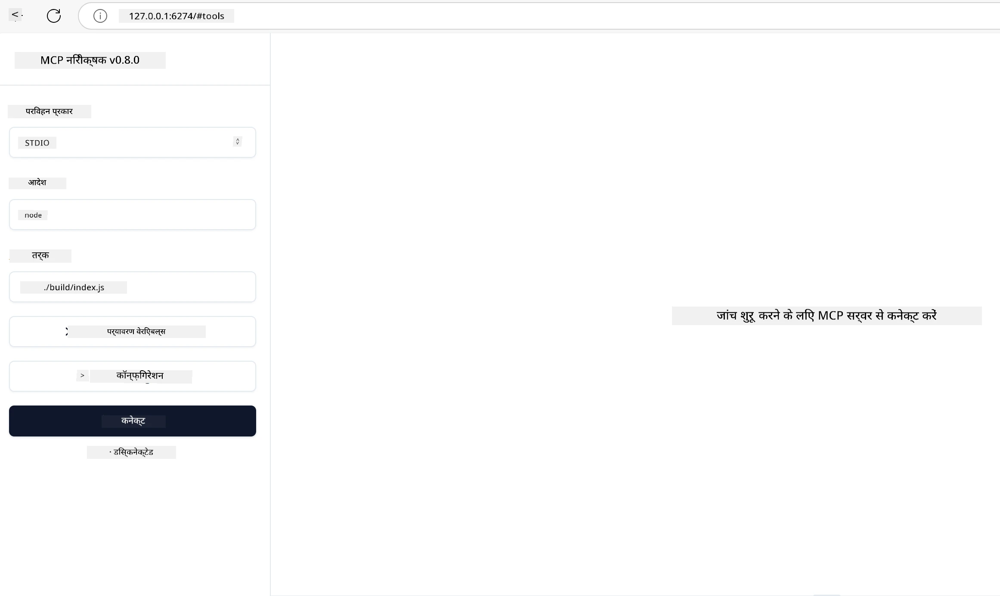

# व्यावहारिक कार्यान्वयन

[](https://youtu.be/vCN9-mKBDfQ)

_(इस पाठ का वीडियो देखने के लिए ऊपर छवि पर क्लिक करें)_

व्यावहारिक कार्यान्वयन वह जगह है जहाँ मॉडल संदर्भ प्रोटोकॉल (MCP) की शक्ति मूर्त रूप में आती है। जबकि MCP के पीछे के सिद्धांत और वास्तुकला को समझना महत्वपूर्ण है, असली मूल्य तब उभरता है जब आप इन अवधारणाओं को वास्तविक दुनिया की समस्याओं को हल करने वाले समाधान बनाने, परीक्षण करने और तैनात करने के लिए लागू करते हैं। यह अध्याय वैचारिक ज्ञान और व्यावहारिक विकास के बीच का अंतर कम करता है, और आपको MCP-आधारित एप्लिकेशन को जीवन में लाने की प्रक्रिया के माध्यम से मार्गदर्शन करता है।

चाहे आप बुद्धिमान सहायक विकसित कर रहे हों, व्यवसाय कार्यप्रवाहों में AI एकीकृत कर रहे हों, या डेटा प्रसंस्करण के लिए कस्टम टूल्स बना रहे हों, MCP एक लचीला आधार प्रदान करता है। इसकी भाषा-स्वतंत्र डिजाइन और लोकप्रिय प्रोग्रामिंग भाषाओं के लिए आधिकारिक SDK इसे विभिन्न प्रकार के डेवलपर्स के लिए सुलभ बनाते हैं। इन SDK का उपयोग करके, आप तेजी से प्रोटोटाइप बना सकते हैं, पुनरावृत्ति कर सकते हैं, और विभिन्न प्लेटफार्मों और वातावरणों में अपने समाधानों को स्केल कर सकते हैं।

अगले अनुभागों में, आप व्यावहारिक उदाहरण, नमूना कोड, और तैनाती रणनीतियाँ पाएंगे जो दिखाती हैं कि C#, Java के साथ Spring, TypeScript, JavaScript, और Python में MCP को कैसे लागू किया जाए। आप यह भी सीखेंगे कि MCP सर्वरों को कैसे डिबग और टेस्ट करें, API प्रबंधित करें, और Azure का उपयोग करके क्लाउड में समाधान तैनात करें। ये व्यावहारिक संसाधन आपकी सीखने की गति को बढ़ाने और मजबूत, प्रोडक्शन-तैयार MCP एप्लिकेशन बनाने में आपकी सहायता करने के लिए डिज़ाइन किए गए हैं।

## अवलोकन

यह पाठ MCP के व्यावहारिक पहलुओं पर केंद्रित है जो कई प्रोग्रामिंग भाषाओं में लागू किए जा सकते हैं। हम MCP SDKs का उपयोग C#, Java के साथ Spring, TypeScript, JavaScript, और Python में कैसे करें, मजबूत एप्लिकेशन कैसे बनाएं, MCP सर्वरों को डिबग और टेस्ट करें, और पुन: उपयोग किए जा सकने वाले संसाधनों, प्रॉम्प्ट्स और टूल्स कैसे बनाएं, इन सबकी खोज करेंगे।

## सीखने के उद्देश्य

इस पाठ के अंत तक, आप सक्षम होंगे:

- विभिन्न प्रोग्रामिंग भाषाओं में आधिकारिक SDKs का उपयोग करके MCP समाधान लागू करना
- MCP सर्वरों को व्यवस्थित रूप से डिबग और टेस्ट करना
- सर्वर सुविधाओं (संसाधन, प्रॉम्प्ट, और टूल्स) का निर्माण और उपयोग करना
- जटिल कार्यों के लिए प्रभावी MCP वर्कफ़्लोज़ डिज़ाइन करना
- प्रदर्शन और विश्वसनीयता के लिए MCP कार्यान्वयन को अनुकूलित करना

## आधिकारिक SDK संसाधन

मॉडल संदर्भ प्रोटोकॉल कई भाषाओं के लिए आधिकारिक SDK प्रदान करता है (जो [MCP विनिर्देशन 2025-11-25](https://spec.modelcontextprotocol.io/specification/2025-11-25/) के अनुरूप हैं):

- [C# SDK](https://github.com/modelcontextprotocol/csharp-sdk)
- [Java with Spring SDK](https://github.com/modelcontextprotocol/java-sdk) **टिप्पणी:** इसके लिए [Project Reactor](https://projectreactor.io) पर निर्भरता आवश्यक है। (देखें [चर्चा मुद्दा 246](https://github.com/orgs/modelcontextprotocol/discussions/246)।)
- [TypeScript SDK](https://github.com/modelcontextprotocol/typescript-sdk)
- [Python SDK](https://github.com/modelcontextprotocol/python-sdk)
- [Kotlin SDK](https://github.com/modelcontextprotocol/kotlin-sdk)
- [Go SDK](https://github.com/modelcontextprotocol/go-sdk)

## MCP SDKs के साथ काम करना

यह अनुभाग विभिन्न प्रोग्रामिंग भाषाओं में MCP कार्यान्वयन के व्यावहारिक उदाहरण प्रदान करता है। आप `samples` निर्देशिका में भाषा के अनुसार संगठित नमूना कोड पा सकते हैं।

### उपलब्ध नमूने

भंडार में निम्नलिखित भाषाओं के [नमूना कार्यान्वयन](../../../04-PracticalImplementation/samples) शामिल हैं:

- [C#](./samples/csharp/README.md)
- [Java with Spring](./samples/java/containerapp/README.md)
- [TypeScript](./samples/typescript/README.md)
- [JavaScript](./samples/javascript/README.md)
- [Python](./samples/python/README.md)

प्रत्येक नमूना उस विशेष भाषा और इकोसिस्टम के लिए मुख्य MCP अवधारणाओं और कार्यान्वयन पैटर्न को दर्शाता है।

### व्यावहारिक मार्गदर्शिकाएँ

अतिरिक्त मार्गदर्शिकाएँ MCP के व्यावहारिक कार्यान्वयन के लिए:

- [पेजिनेशन और बड़े परिणाम सेट](./pagination/README.md) - टूल्स, संसाधनों, और बड़े डेटासेट के लिए कर्सर-आधारित पेजिनेशन को संभालना

## कोर सर्वर फीचर्स

MCP सर्वर निम्नलिखित विशेषताओं का कोई भी संयोजन लागू कर सकते हैं:

### संसाधन

संसाधन उपयोगकर्ता या AI मॉडल के उपयोग के लिए संदर्भ और डेटा प्रदान करते हैं:

- दस्तावेज़ रिपॉजिटरी
- ज्ञान आधार
- संरचित डेटा स्रोत
- फ़ाइल सिस्टम

### प्रॉम्प्ट

प्रॉम्प्ट उपयोगकर्ताओं के लिए टेम्पलेटेड संदेश और वर्कफ़्लोज़ हैं:

- पूर्व-परिभाषित वार्तालाप टेम्प्लेट
- निर्देशित इंटरैक्शन पैटर्न
- विशिष्ट संवाद संरचनाएँ

### टूल्स

टूल्स AI मॉडल के निष्पादित करने के लिए कार्य हैं:

- डेटा प्रसंस्करण उपयोगिताएँ
- बाहरी API एकीकरण
- गणनात्मक क्षमताएँ
- खोज कार्यक्षमता

## नमूना कार्यान्वयन: C# कार्यान्वयन

आधिकारिक C# SDK रिपॉजिटरी में कई नमूना कार्यान्वयन हैं जो MCP के विभिन्न पहलुओं को प्रदर्शित करते हैं:

- **बुनियादी MCP क्लाइंट**: एक सरल उदाहरण जो दिखाता है कि कैसे MCP क्लाइंट बनाया जाए और टूल्स को कॉल किया जाए
- **बुनियादी MCP सर्वर**: मामूली सर्वर कार्यान्वयन जिसमें बुनियादी टूल पंजीकरण है
- **उन्नत MCP सर्वर**: टूल पंजीकरण, प्रमाणीकरण, और त्रुटि प्रबंधन के साथ पूर्ण-विशिष्ट सर्वर
- **ASP.NET एकीकरण**: ASP.NET Core के साथ एकीकरण दिखाने वाले उदाहरण
- **टूल कार्यान्वयन पैटर्न**: विभिन्न जटिलता स्तरों के साथ टूल कार्यान्वयन के लिए विभिन्न पैटर्न

MCP C# SDK अभी प्रीव्यू में है और APIs में परिवर्तन हो सकते हैं। हम SDK के विकास के साथ निरंतर इस ब्लॉग को अपडेट करते रहेंगे।

### मुख्य विशेषताएँ

- [C# MCP Nuget ModelContextProtocol](https://www.nuget.org/packages/ModelContextProtocol)
- आपका [पहला MCP सर्वर बनाना](https://devblogs.microsoft.com/dotnet/build-a-model-context-protocol-mcp-server-in-csharp/)।

पूर्ण C# कार्यान्वयन नमूने के लिए, आधिकारिक [C# SDK नमूना रिपॉजिटरी](https://github.com/modelcontextprotocol/csharp-sdk) पर जाएँ।

## नमूना कार्यान्वयन: Java with Spring कार्यान्वयन

Java with Spring SDK एम्प्लीफाइड MCP कार्यान्वयन विकल्पों के साथ एंटरप्राइज़-ग्रेड फीचर्स प्रदान करता है।

### मुख्य विशेषताएँ

- Spring Framework एकीकरण
- मजबूत टाइप सुरक्षा
- रिएक्टिव प्रोग्रामिंग समर्थन
- व्यापक त्रुटि प्रबंधन

Java with Spring के लिए पूर्ण कार्यान्वयन नमूना के लिए, नमूना निर्देशिका में [Java with Spring नमूना](samples/java/containerapp/README.md) देखें।

## नमूना कार्यान्वयन: JavaScript कार्यान्वयन

JavaScript SDK MCP कार्यान्वयन के लिए हल्का और लचीला दृष्टिकोण प्रदान करता है।

### मुख्य विशेषताएँ

- Node.js और ब्राउज़र समर्थन
- प्रॉमिस-आधारित API
- Express और अन्य फ्रेमवर्क के साथ आसान एकीकरण
- स्ट्रीमिंग के लिए WebSocket समर्थन

पूर्ण JavaScript कार्यान्वयन नमूना के लिए, नमूना निर्देशिका में [JavaScript नमूना](samples/javascript/README.md) देखें।

## नमूना कार्यान्वयन: Python कार्यान्वयन

Python SDK उत्कृष्ट ML फ्रेमवर्क एकीकरण के साथ MCP कार्यान्वयन के लिए एक पाइथोनिक दृष्टिकोण प्रदान करता है।

### मुख्य विशेषताएँ

- asyncio के साथ Async/await समर्थन
- FastAPI एकीकरण
- सरल टूल पंजीकरण
- लोकप्रिय ML लाइब्रेरीज के साथ मूल एकीकरण

पूर्ण Python कार्यान्वयन नमूना के लिए, नमूना निर्देशिका में [Python नमूना](samples/python/README.md) देखें।

## API प्रबंधन

Azure API Management MCP सर्वरों को सुरक्षित करने के लिए एक बेहतरीन समाधान है। विचार यह है कि आप अपने MCP सर्वर के सामने Azure API Management इंस्टेंस रखें और वह निम्नलिखित जैसी सुविधाओं को संभालेगा:

- रेट लिमिटिंग
- टोकन प्रबंधन
- मॉनिटरिंग
- लोड बैलेंसिंग
- सुरक्षा

### Azure नमूना

यहाँ एक Azure नमूना है जो बिल्कुल ऐसा करता है, अर्थात् [MCP सर्वर बनाना और Azure API Management के साथ इसे सुरक्षित करना](https://github.com/Azure-Samples/remote-mcp-apim-functions-python)।

नीचे छवि में देखें कि प्रमाणीकरण प्रक्रिया कैसे होती है:


पिछली छवि में, निम्नलिखित होता है:

- Microsoft Entra का उपयोग करके प्रमाणीकरण/प्राधिकरण होता है।
- Azure API Management एक गेटवे के रूप में कार्य करता है और नीतियों का उपयोग करके ट्रैफ़िक को मार्गदर्शित और प्रबंधित करता है।
- Azure Monitor सभी अनुरोधों को लॉग करता है ताकि आगे विश्लेषण किया जा सके।

#### प्राधिकरण प्रवाह

आइए प्राधिकरण प्रवाह को अधिक विस्तार से देखें:


#### MCP प्राधिकरण विनिर्देशन

[MCP प्राधिकरण विनिर्देशन](https://spec.modelcontextprotocol.io/specification/2025-11-25/basic/authorization/) के बारे में अधिक जानें।

## Azure पर Remote MCP Server तैनात करें

आइए देखें कि क्या हम पहले उल्लेखित नमूना तैनात कर सकते हैं:

1. रिपॉजिटरी क्लोन करें

    ```bash
    git clone https://github.com/Azure-Samples/remote-mcp-apim-functions-python.git
    cd remote-mcp-apim-functions-python
    ```

1. `Microsoft.App` संसाधन प्रदाता पंजीकृत करें।

   - यदि आप Azure CLI का उपयोग कर रहे हैं, तो `az provider register --namespace Microsoft.App --wait` चलाएं।
   - यदि आप Azure PowerShell का उपयोग कर रहे हैं, तो `Register-AzResourceProvider -ProviderNamespace Microsoft.App` चलाएं। फिर पंजीकरण पूरा होने की जांच के लिए कुछ समय बाद `(Get-AzResourceProvider -ProviderNamespace Microsoft.App).RegistrationState` चलाएं।

1. इस [azd](https://aka.ms/azd) कमांड को चलाकर API प्रबंधन सेवा, फ़ंक्शन ऐप (कोड के साथ) और अन्य आवश्यक Azure संसाधन प्रदान करें

    ```shell
    azd up
    ```

    यह कमांड Azure पर सभी क्लाउड संसाधनों को तैनात कर देगा।

### MCP Inspector के साथ अपने सर्वर का परीक्षण करें

1. **नए टर्मिनल विंडो** में, MCP Inspector इंस्टॉल करें और चलाएं

    ```shell
    npx @modelcontextprotocol/inspector
    ```

    आपको ऐसा इंटरफेस दिखना चाहिए:

    

1. URL द्वारा प्रदर्शित MCP Inspector वेब ऐप (जैसे [http://127.0.0.1:6274/#resources](http://127.0.0.1:6274/#resources)) को CTRL क्लिक करके खोलें
1. ट्रांसपोर्ट प्रकार को `SSE` पर सेट करें
1. URL को अपने चल रहे API प्रबंधन SSE एंडपॉइंट पर सेट करें जो `azd up` के बाद प्रदर्शित होता है और **Connect** करें:

    ```shell
    https://<apim-servicename-from-azd-output>.azure-api.net/mcp/sse
    ```

1. **List Tools** पर क्लिक करें, फिर किसी टूल पर क्लिक करें और **Run Tool** करें।

यदि सभी कदम सफल रहे, तो अब आप MCP सर्वर से जुड़ गए हैं और किसी टूल को कॉल करने में सफल रहे हैं।

## Azure के लिए MCP सर्वर

[Remote-mcp-functions](https://github.com/Azure-Samples/remote-mcp-functions-dotnet): यह रिपॉजिटरी सेट Azure Functions का उपयोग करते हुए Python, C# .NET या Node/TypeScript के साथ कस्टम रिमोट MCP (मॉडल संदर्भ प्रोटोकॉल) सर्वर बनाने और तैनात करने के लिए त्वरित प्रारंभ टेम्पलेट हैं।

यह नमूने डेवलपर्स को एक पूर्ण समाधान प्रदान करते हैं जो सक्षम बनाता है:

- लोकल रूप से निर्माण और चलाएं: स्थानीय मशीन पर MCP सर्वर विकसित करें और डिबग करें
- Azure पर तैनात करें: सरल azd up कमांड के साथ क्लाउड में आसानी से तैनाती करें
- क्लाइंट्स से कनेक्ट करें: VS Code के Copilot एजेंट मोड और MCP Inspector टूल सहित विभिन्न क्लाइंट्स से MCP सर्वर से कनेक्ट करें

### मुख्य विशेषताएँ

- डिजाइन द्वारा सुरक्षा: MCP सर्वर कुंजियों और HTTPS का उपयोग करके सुरक्षित है
- प्रमाणीकरण विकल्प: बिल्ट-इन auth और/या API प्रबंधन का उपयोग करके OAuth समर्थन
- नेटवर्क पृथक्करण: Azure वर्चुअल नेटवर्क (VNET) का उपयोग करके नेटवर्क पृथक्करण की अनुमति
- सर्वरलेस आर्किटेक्चर: स्केलेबल, ईवेंट-चालित निष्पादन के लिए Azure Functions का उपयोग
- स्थानीय विकास: व्यापक स्थानीय विकास और डिबगिंग समर्थन
- सरल तैनाती: Azure पर तैनाती प्रक्रिया सरल बनाई गई

यह रिपॉजिटरी सभी आवश्यक कॉन्फ़िगरेशन फ़ाइलें, स्रोत कोड, और इन्फ्रास्ट्रक्चर परिभाषाएँ शामिल करती है ताकि आप तेजी से प्रोडक्शन-तैयार MCP सर्वर कार्यान्वयन शुरू कर सकें।

- [Azure Remote MCP Functions Python](https://github.com/Azure-Samples/remote-mcp-functions-python) - Python के साथ Azure Functions का उपयोग कर MCP का नमूना कार्यान्वयन

- [Azure Remote MCP Functions .NET](https://github.com/Azure-Samples/remote-mcp-functions-dotnet) - C# .NET के साथ Azure Functions का उपयोग कर MCP का नमूना कार्यान्वयन

- [Azure Remote MCP Functions Node/Typescript](https://github.com/Azure-Samples/remote-mcp-functions-typescript) - Node/TypeScript के साथ Azure Functions का उपयोग कर MCP का नमूना कार्यान्वयन।

## मुख्य बिंदु

- MCP SDK भाषानुसार टूल्स प्रदान करते हैं जो मजबूत MCP समाधान लागू करने के लिए हैं
- डिबगिंग और परीक्षण प्रक्रिया विश्वसनीय MCP एप्लिकेशन के लिए महत्वपूर्ण है
- पुन: उपयोग योग्य प्रॉम्प्ट टेम्प्लेट AI इंटरैक्शंस को सुसंगत बनाते हैं
- अच्छी डिज़ाइन की गई वर्कफ़्लोज़ कई टूल्स का उपयोग करके जटिल कार्यों को संचालन कर सकती हैं
- MCP समाधान लागू करते समय सुरक्षा, प्रदर्शन, और त्रुटि प्रबंधन पर विचार करना आवश्यक है

## व्यायाम

अपने डोमेन में एक वास्तविक समस्या को संबोधित करने वाला व्यावहारिक MCP वर्कफ़्लो डिज़ाइन करें:

1. इस समस्या को हल करने के लिए 3-4 उपयोगी टूल्स पहचानें
2. एक वर्कफ़्लो आरेख बनाएं जो दिखाए कि ये टूल्स कैसे इंटरैक्ट करते हैं
3. अपनी पसंदीदा भाषा का उपयोग करके एक टूल का बुनियादी संस्करण लागू करें
4. एक प्रॉम्प्ट टेम्प्लेट बनाएं जो मॉडल को प्रभावी ढंग से आपके टूल का उपयोग करने में मदद करे

## अतिरिक्त संसाधन

---

## अगला क्या है

अगला: [उन्नत विषय](../05-AdvancedTopics/README.md)

---

<!-- CO-OP TRANSLATOR DISCLAIMER START -->
**अस्वीकरण**:  
इस दस्तावेज़ का अनुवाद AI अनुवाद सेवा [Co-op Translator](https://github.com/Azure/co-op-translator) का उपयोग करके किया गया है। जबकि हम सटीकता के लिए प्रयासरत हैं, कृपया ध्यान दें कि स्वचालित अनुवादों में त्रुटियाँ या गलतियां हो सकती हैं। मूल दस्तावेज़ को उसकी मातृभाषा में प्रामाणिक स्रोत माना जाना चाहिए। महत्वपूर्ण जानकारी के लिए, पेशेवर मानव अनुवाद की सलाह दी जाती है। इस अनुवाद के उपयोग से उत्पन्न किसी भी गलतफहमी या गलत व्याख्या के लिए हम जिम्मेदार नहीं हैं।
<!-- CO-OP TRANSLATOR DISCLAIMER END -->