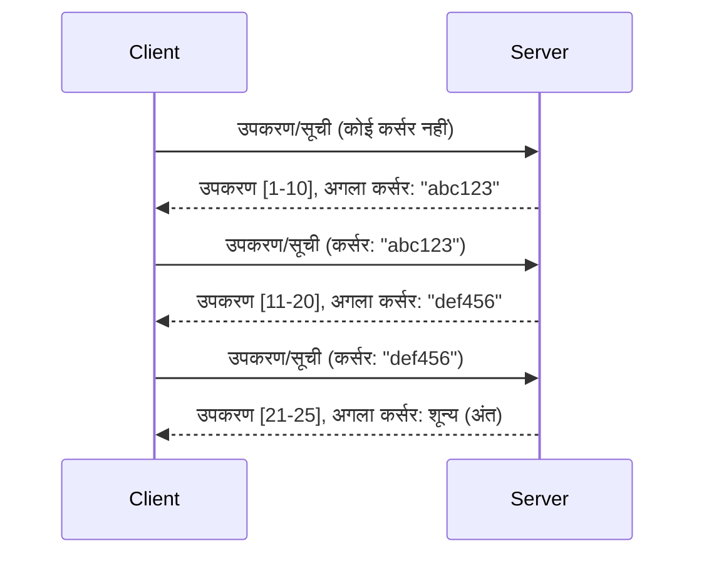

# MCP में पेजिनेशन और बड़े परिणाम सेट

जब आपका MCP सर्वर बड़े डेटा सेट हैंडल करता है - चाहे हजारों फाइलों को सूचीबद्ध करना हो, डेटाबेस रिकॉर्ड या खोज परिणाम - तब मेमोरी को कुशलतापूर्वक प्रबंधित करने और उत्तरदायी उपयोगकर्ता अनुभव प्रदान करने के लिए पेजिनेशन आवश्यक है। यह गाइड MCP में पेजिनेशन को लागू करने और उपयोग करने के बारे में बताता है।

## पेजिनेशन क्यों महत्वपूर्ण है

बिना पेजिनेशन के, बड़े उत्तर इससे समस्याएं हो सकती हैं:

- **मेमोरी ख़त्म होना** - एक बार में लाखों रिकॉर्ड लोड करना
- **धीरे उत्तर मिलने का समय** - उपयोगकर्ता सभी डेटा लोड होने तक इंतजार करते हैं
- **समय सीमा त्रुटियां** - अनुरोध समय सीमा सीमा पार कर जाते हैं
- **खराब AI प्रदर्शन** - LLM बड़े संदर्भ के साथ संघर्ष करते हैं

MCP परिणाम सेट के माध्यम से विश्वसनीय और सुसंगत पेजिंग के लिए **कर्सर-आधारित पेजिनेशन** का उपयोग करता है।

---

## MCP पेजिनेशन कैसे काम करता है

### कर्सर का विचार

एक **कर्सर** एक अस्पष्ट स्ट्रिंग है जो परिणाम सेट में आपकी स्थिति को चिह्नित करता है। इसे एक लंबे पुस्तक में बुकमार्क की तरह सोचें।


### MCP विधियों में पेजिनेशन

ये MCP विधियाँ पेजिनेशन का समर्थन करती हैं:

| विधि | लौटाता है | कर्सर समर्थन |
|--------|---------|----------------|
| `tools/list` | टूल परिभाषाएँ | ✅ |
| `resources/list` | संसाधन परिभाषाएँ | ✅ |
| `prompts/list` | प्रॉम्प्ट परिभाषाएँ | ✅ |
| `resources/templates/list` | संसाधन टेम्पलेट्स | ✅ |

---

## सर्वर कार्यान्वयन

### पाइथन (FastMCP)

```python
from mcp.server import Server
from mcp.types import Tool, ListToolsResult
import math

app = Server("paginated-server")

# अनुकरण किया गया बड़ा डेटा सेट
ALL_TOOLS = [
    Tool(name=f"tool_{i}", description=f"Tool number {i}", inputSchema={})
    for i in range(100)
]

PAGE_SIZE = 10

@app.list_tools()
async def list_tools(cursor: str | None = None) -> ListToolsResult:
    """List tools with pagination support."""
    
    # प्रारंभिक सूचकांक प्राप्त करने के लिए कर्सर को डिकोड करें
    start_index = 0
    if cursor:
        try:
            start_index = int(cursor)
        except ValueError:
            start_index = 0
    
    # परिणामों का पृष्ठ प्राप्त करें
    end_index = min(start_index + PAGE_SIZE, len(ALL_TOOLS))
    page_tools = ALL_TOOLS[start_index:end_index]
    
    # अगला कर्सर गणना करें
    next_cursor = None
    if end_index < len(ALL_TOOLS):
        next_cursor = str(end_index)
    
    return ListToolsResult(
        tools=page_tools,
        nextCursor=next_cursor
    )
```

### टाइपस्क्रिप्ट

```typescript
import { Server } from "@modelcontextprotocol/sdk/server/index.js";
import { ListToolsResultSchema } from "@modelcontextprotocol/sdk/types.js";

const server = new Server({
  name: "paginated-server",
  version: "1.0.0"
});

// अनुकरण किया गया बड़ा डेटा सेट
const ALL_TOOLS = Array.from({ length: 100 }, (_, i) => ({
  name: `tool_${i}`,
  description: `Tool number ${i}`,
  inputSchema: { type: "object", properties: {} }
}));

const PAGE_SIZE = 10;

server.setRequestHandler(ListToolsResultSchema, async (request) => {
  // कर्सर डिकोड करें
  let startIndex = 0;
  if (request.params?.cursor) {
    startIndex = parseInt(request.params.cursor, 10) || 0;
  }
  
  // परिणामों का पृष्ठ प्राप्त करें
  const endIndex = Math.min(startIndex + PAGE_SIZE, ALL_TOOLS.length);
  const pageTools = ALL_TOOLS.slice(startIndex, endIndex);
  
  // अगला कर्सर गणना करें
  const nextCursor = endIndex < ALL_TOOLS.length ? String(endIndex) : undefined;
  
  return {
    tools: pageTools,
    nextCursor
  };
});
```

### जावा (Spring MCP)

```java
@Service
public class PaginatedToolService {
    
    private static final int PAGE_SIZE = 10;
    private final List<Tool> allTools;
    
    public PaginatedToolService() {
        // बड़े डेटा सेट को प्रारंभ करें
        this.allTools = IntStream.range(0, 100)
            .mapToObj(i -> new Tool("tool_" + i, "Tool number " + i, Map.of()))
            .collect(Collectors.toList());
    }
    
    @McpMethod("tools/list")
    public ListToolsResult listTools(@Param("cursor") String cursor) {
        // कर्सर डिकोड करें
        int startIndex = 0;
        if (cursor != null && !cursor.isEmpty()) {
            try {
                startIndex = Integer.parseInt(cursor);
            } catch (NumberFormatException e) {
                startIndex = 0;
            }
        }
        
        // परिणामों का पृष्ठ प्राप्त करें
        int endIndex = Math.min(startIndex + PAGE_SIZE, allTools.size());
        List<Tool> pageTools = allTools.subList(startIndex, endIndex);
        
        // अगला कर्सर गणना करें
        String nextCursor = endIndex < allTools.size() ? String.valueOf(endIndex) : null;
        
        return new ListToolsResult(pageTools, nextCursor);
    }
}
```

---

## क्लाइंट कार्यान्वयन

### पाइथन क्लाइंट

```python
from mcp import ClientSession

async def get_all_tools(session: ClientSession) -> list:
    """Fetch all tools using pagination."""
    all_tools = []
    cursor = None
    
    while True:
        result = await session.list_tools(cursor=cursor)
        all_tools.extend(result.tools)
        
        if result.nextCursor is None:
            break
        cursor = result.nextCursor
    
    return all_tools

# उपयोग
async with client_session as session:
    tools = await get_all_tools(session)
    print(f"Found {len(tools)} tools")
```

### टाइपस्क्रिप्ट क्लाइंट

```typescript
import { Client } from "@modelcontextprotocol/sdk/client/index.js";

async function getAllTools(client: Client): Promise<Tool[]> {
  const allTools: Tool[] = [];
  let cursor: string | undefined = undefined;
  
  do {
    const result = await client.listTools({ cursor });
    allTools.push(...result.tools);
    cursor = result.nextCursor;
  } while (cursor);
  
  return allTools;
}

// उपयोग
const tools = await getAllTools(client);
console.log(`Found ${tools.length} tools`);
```

### लेजी लोडिंग पैटर्न

बहुत बड़े डेटा सेट के लिए, मांग पर पृष्ठ लोड करें:

```python
class PaginatedToolIterator:
    """Lazily iterate through paginated tools."""
    
    def __init__(self, session: ClientSession):
        self.session = session
        self.cursor = None
        self.buffer = []
        self.exhausted = False
    
    async def __anext__(self):
        # यदि उपलब्ध हो तो बफ़र से लौटें
        if self.buffer:
            return self.buffer.pop(0)
        
        # जांचें कि क्या हमने सभी पृष्ठ समाप्त कर लिए हैं
        if self.exhausted:
            raise StopAsyncIteration
        
        # अगला पृष्ठ प्राप्त करें
        result = await self.session.list_tools(cursor=self.cursor)
        self.buffer = list(result.tools)
        self.cursor = result.nextCursor
        
        if self.cursor is None:
            self.exhausted = True
        
        if not self.buffer:
            raise StopAsyncIteration
        
        return self.buffer.pop(0)
    
    def __aiter__(self):
        return self

# उपयोग - बड़े डेटा सेट के लिए स्मृति कुशल
async for tool in PaginatedToolIterator(session):
    process_tool(tool)
```

---

## संसाधनों के लिए पेजिनेशन

डायरेक्टरी या बड़े डेटा सेट के लिए अक्सर संसाधनों को पेजिनेशन की आवश्यकता होती है:

```python
from mcp.server import Server
from mcp.types import Resource, ListResourcesResult
import os

app = Server("file-server")

@app.list_resources()
async def list_resources(cursor: str | None = None) -> ListResourcesResult:
    """List files in directory with pagination."""
    
    directory = "/data/files"
    all_files = sorted(os.listdir(directory))
    
    # कर्सर को डिकोड करें (फ़ाइल इंडेक्स)
    start_index = int(cursor) if cursor else 0
    page_size = 20
    end_index = min(start_index + page_size, len(all_files))
    
    # इस पेज के लिए संसाधन सूची बनाएं
    resources = []
    for filename in all_files[start_index:end_index]:
        filepath = os.path.join(directory, filename)
        resources.append(Resource(
            uri=f"file://{filepath}",
            name=filename,
            mimeType="application/octet-stream"
        ))
    
    # अगला कर्सर गणना करें
    next_cursor = str(end_index) if end_index < len(all_files) else None
    
    return ListResourcesResult(
        resources=resources,
        nextCursor=next_cursor
    )
```

---

## कर्सर डिज़ाइन रणनीतियाँ

### रणनीति 1: इंडेक्स-आधारित (सरल)

```python
# कर्सर केवल सूची सूचकांक है
cursor = "50"  # आइटम 50 से शुरू करें
```

**फायदे:** सरल, स्टेटलेस  
**नुकसान:** आइटम जोड़ने/हटाने पर परिणाम शिफ्ट हो सकते हैं

### रणनीति 2: ID-आधारित (स्थिर)

```python
# कर्सर अंतिम देखी गई आईडी है
cursor = "item_abc123"  # इस आइटम के बाद शुरू करें
```

**फायदे:** आइटम बदलने पर भी स्थिर रहता है  
**नुकसान:** क्रमित IDs की आवश्यकता होती है

### रणनीति 3: एन्कोडेड स्थिति (जटिल)

```python
import base64
import json

def encode_cursor(state: dict) -> str:
    return base64.b64encode(json.dumps(state).encode()).decode()

def decode_cursor(cursor: str) -> dict:
    return json.loads(base64.b64decode(cursor).decode())

# कर्सर में कई स्थिति क्षेत्र होते हैं
cursor = encode_cursor({
    "offset": 50,
    "filter": "active",
    "sort": "name"
})
```

**फायदे:** जटिल स्थिति को एन्कोड कर सकता है  
**नुकसान:** अधिक जटिल, बड़े कर्सर स्ट्रिंग्स

---

## सर्वोत्तम अभ्यास

### 1. उपयुक्त पृष्ठ आकार चुनें

```python
# डेटा आकार पर विचार करें
PAGE_SIZE_SMALL_ITEMS = 100   # सरल मेटाडेटा
PAGE_SIZE_MEDIUM_ITEMS = 20   # समृद्ध वस्तुएं
PAGE_SIZE_LARGE_ITEMS = 5     # जटिल सामग्री
```

### 2. अमान्य कर्सर को सुसंगत रूप से संभालें

```python
@app.list_tools()
async def list_tools(cursor: str | None = None) -> ListToolsResult:
    try:
        start_index = int(cursor) if cursor else 0
        if start_index < 0 or start_index >= len(ALL_TOOLS):
            start_index = 0  # शुरुआत में रीसेट करें
    except (ValueError, TypeError):
        start_index = 0  # अमान्य कर्सर, नई शुरुआत करें
    # ...
```

### 3. कुल गिनती शामिल करें (वैकल्पिक)

```python
return ListToolsResult(
    tools=page_tools,
    nextCursor=next_cursor,
    # कुछ कार्यान्वयन UI प्रगति के लिए कुल शामिल करते हैं
    _meta={"total": len(ALL_TOOLS)}
)
```

### 4. किनारे के मामलों का परीक्षण करें

```python
async def test_pagination():
    # खाली परिणाम सेट
    result = await session.list_tools()
    assert result.tools == []
    assert result.nextCursor is None
    
    # एकल पृष्ठ
    result = await session.list_tools()
    assert len(result.tools) <= PAGE_SIZE
    
    # अमान्य कर्सर
    result = await session.list_tools(cursor="invalid")
    assert result.tools  # पहले पृष्ठ को वापस करना चाहिए
```

---

## सामान्य गलतियाँ

### ❌ सभी परिणाम लौटाना फिर क्लाइंट-साइड पेजिनेशन

```python
# खराब: सब कुछ मेमोरी में लोड करता है
@app.list_tools()
async def list_tools() -> ListToolsResult:
    all_tools = load_all_tools()  # 1 मिलियन उपकरण!
    return ListToolsResult(tools=all_tools)
```

### ✅ डेटा स्रोत पर पेजिनेशन करें

```python
# अच्छा: केवल आवश्यक चीज़ों को लोड करता है
@app.list_tools()
async def list_tools(cursor: str | None = None) -> ListToolsResult:
    offset = int(cursor) if cursor else 0
    tools = await db.query_tools(offset=offset, limit=PAGE_SIZE)
    return ListToolsResult(tools=tools, nextCursor=...)
```

---

## अगला क्या है

- [मॉड्यूल 5.14 - संदर्भ इंजीनियरिंग](../../05-AdvancedTopics/mcp-contextengineering/README.md)  
- [मॉड्यूल 8 - सर्वोत्तम अभ्यास](../../08-BestPractices/README.md)  
- [3.8 - आपका MCP सर्वर परीक्षण करना](../../03-GettingStarted/08-testing/README.md)  

---

## अतिरिक्त संसाधन

- [MCP विनिर्देशन - पेजिनेशन](https://spec.modelcontextprotocol.io/specification/2025-11-25/)  
- [कर्सर-आधारित पेजिनेशन समझाया गया](https://slack.engineering/evolving-api-pagination-at-slack/)  
- [पाइथन SDK पेजिनेशन परीक्षण](https://github.com/modelcontextprotocol/python-sdk/blob/main/tests/client/test_list_methods_cursor.py)

---

<!-- CO-OP TRANSLATOR DISCLAIMER START -->
**अस्वीकरण**:  
यह दस्तावेज़ AI अनुवाद सेवा [Co-op Translator](https://github.com/Azure/co-op-translator) का उपयोग करके अनुवादित किया गया है। जबकि हम सटीकता के लिए प्रयासरत हैं, कृपया ध्यान दें कि स्वचालित अनुवादों में त्रुटियाँ या अशुद्धियाँ हो सकती हैं। मूल दस्तावेज़ जो अपनी मूल भाषा में है, उसे अधिकारिक स्रोत माना जाना चाहिए। महत्वपूर्ण जानकारी के लिए पेशेवर मानव अनुवाद की सिफारिश की जाती है। इस अनुवाद के उपयोग से उत्पन्न किसी भी गलतफहमी या गलत व्याख्या के लिए हम उत्तरदायी नहीं हैं।
<!-- CO-OP TRANSLATOR DISCLAIMER END -->