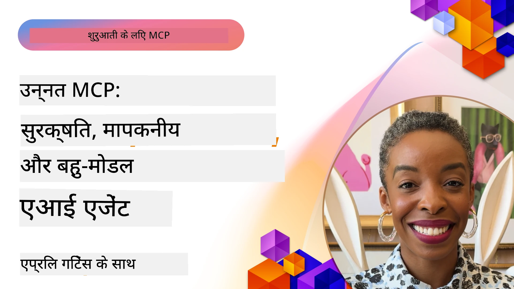

# MCP में उन्नत विषय

_(इस पाठ का वीडियो देखने के लिए ऊपर की छवि पर क्लिक करें)_

यह अध्याय Model Context Protocol (MCP) के कार्यान्वयन में कई उन्नत विषयों को कवर करता है, जिसमें मल्टी-मोडल इंटीग्रेशन, स्केलेबिलिटी, सुरक्षा सर्वोत्तम अभ्यास, और एंटरप्राइज़ इंटीग्रेशन शामिल हैं। ये विषय आधुनिक एआई सिस्टम की मांगों को पूरा करने वाले मजबूत और प्रोडक्शन-तैयार MCP अनुप्रयोग बनाने के लिए महत्वपूर्ण हैं।

## अवलोकन

यह पाठ Model Context Protocol के कार्यान्वयन में उन्नत अवधारणाओं की पड़ताल करता है, जिसमें मल्टी-मोडल इंटीग्रेशन, स्केलेबिलिटी, सुरक्षा सर्वोत्तम अभ्यास, और एंटरप्राइज़ इंटीग्रेशन पर ध्यान केंद्रित किया गया है। ये विषय एंटरप्राइज़ वातावरण में जटिल आवश्यकताओं को संभालने वाले प्रोडक्शन-ग्रेड MCP अनुप्रयोग बनाने के लिए आवश्यक हैं।

## सीखने के उद्देश्य

इस पाठ के अंत तक, आप सक्षम होंगे:

- MCP फ्रेमवर्क के भीतर मल्टी-मोडल क्षमताओं को लागू करना
- उच्च-मांग परिदृश्यों के लिए स्केलेबल MCP आर्किटेक्चर डिजाइन करना
- MCP की सुरक्षा सिद्धांतों के अनुरूप सुरक्षा सर्वोत्तम प्रथाओं को लागू करना
- एंटरप्राइज़ एआई सिस्टम और फ्रेमवर्क के साथ MCP का एकीकरण करना
- प्रोडक्शन वातावरण में प्रदर्शन और विश्वसनीयता का अनुकूलन करना

## पाठ्यक्रम और नमूना परियोजनाएँ

| लिंक | शीर्षक | विवरण |
|------|-------|-------------|
| [5.1 Integration with Azure](./mcp-integration/README.md) | Azure के साथ एकीकरण | सीखें कि अपने MCP सर्वर को Azure पर कैसे एकीकृत करें |
| [5.2 Multi modal sample](./mcp-multi-modality/README.md) | MCP मल्टी मोडल नमूने | ऑडियो, छवि और मल्टी मोडल प्रतिक्रिया के लिए नमूने |
| [5.3 MCP OAuth2 sample](../../../05-AdvancedTopics/mcp-oauth2-demo) | MCP OAuth2 डेमो | न्यूनतम स्प्रिंग बूट ऐप जो MCP के साथ OAuth2 को दिखाता है, दोनों के रूप में एथोराइजेशन और रिसोर्स सर्वर। सुरक्षित टोकन जारी करना, संरक्षित एंडपॉइंट्स, Azure कंटेनर ऐप्स पर तैनाती, और API प्रबंधन का एकीकरण प्रदर्शित करता है। |
| [5.4 Root Contexts](./mcp-root-contexts/README.md) | रूट कॉन्टेक्स्ट | रूट कॉन्टेक्स्ट के बारे में अधिक जानें और इसे कैसे लागू करें |
| [5.5 Routing](./mcp-routing/README.md) | राउटिंग | विभिन्न प्रकार की राउटिंग सीखें |
| [5.6 Sampling](./mcp-sampling/README.md) | सैंपलिंग | सैंपलिंग के साथ काम करना सीखें |
| [5.7 Scaling](./mcp-scaling/README.md) | स्केलिंग | स्केलिंग के बारे में जानें |
| [5.8 Security](./mcp-security/README.md) | सुरक्षा | अपने MCP सर्वर को सुरक्षित करें |
| [5.9 Web Search sample](./web-search-mcp/README.md) | वेब सर्च MCP | Python MCP सर्वर और क्लाइंट जो SerpAPI के साथ रियल-टाइम वेब, समाचार, उत्पाद खोज, और Q&A का एकीकरण करता है। मल्टी-टूल ऑर्केस्ट्रेशन, बाहरी API एकीकरण, और मजबूत त्रुटि प्रबंधन दिखाता है। |
| [5.10 Realtime Streaming](./mcp-realtimestreaming/README.md) | स्ट्रीमिंग | रियल-टाइम डेटा स्ट्रीमिंग आज के डेटा-चालित विश्व में आवश्यक हो गई है, जहाँ व्यवसाय और अनुप्रयोग तुरंत जानकारी तक पहुंच की आवश्यकता रखते हैं ताकि समय पर निर्णय लिए जा सकें। |
| [5.11 Realtime Web Search](./mcp-realtimesearch/README.md) | वेब सर्च | रियल-टाइम वेब सर्च कैसे MCP एआई मॉडलों, सर्च इंजनों, और अनुप्रयोगों के बीच कॉन्टेक्स्ट प्रबंधन के लिए मानकीकृत दृष्टिकोण प्रदान करके रियल-टाइम वेब सर्च को परिवर्तित करता है। |
| [5.12  Entra ID Authentication for Model Context Protocol Servers](./mcp-security-entra/README.md) | Entra ID प्रमाणीकरण | Microsoft Entra ID एक मजबूत क्लाउड-आधारित पहचान और पहुँच प्रबंधन समाधान प्रदान करता है, जो सुनिश्चित करता है कि केवल अधिकृत उपयोगकर्ता और अनुप्रयोग आपके MCP सर्वर के साथ इंटरैक्ट कर सकें। |
| [5.13 Azure AI Foundry Agent Integration](./mcp-foundry-agent-integration/README.md) | Azure AI Foundry एकीकरण | Model Context Protocol सर्वरों को Azure AI Foundry एजेंट्स के साथ कैसे एकीकृत करें, शक्तिशाली टूल ऑर्केस्ट्रेशन और एंटरप्राइज़ AI क्षमताओं को मानकीकृत बाहरी डेटा स्रोत कनेक्शनों के साथ सक्षम बनाएं। |
| [5.14 Context Engineering](./mcp-contextengineering/README.md) | कॉन्टेक्स्ट इंजीनियरिंग | MCP सर्वरों के लिए कॉन्टेक्स्ट इंजीनियरिंग तकनीकों का भविष्य, जिसमें कॉन्टेक्स्ट अनुकूलन, गतिशील कॉन्टेक्स्ट प्रबंधन, और MCP फ्रेमवर्क के भीतर प्रभावी प्रॉम्प्ट इंजीनियरिंग के लिए रणनीतियाँ शामिल हैं। |
| [5.15 MCP Custom Transport](./mcp-transport/README.md) | कस्टम ट्रांसपोर्ट | विशेष MCP संचार परिदृश्यों के लिए कस्टम ट्रांसपोर्ट तंत्र लागू करना सीखें। |
| [5.16 Protocol Features Deep Dive](./mcp-protocol-features/README.md) | प्रोटोकॉल फीचर्स | प्रगति सूचनाओं, अनुरोध रद्द करने, संसाधन टेम्प्लेट्स, और त्रुटि प्रबंधन पैटर्न सहित उन्नत प्रोटोकॉल विशेषताओं में महारत हासिल करें। |

> **MCP विनिर्देशन 2025-11-25 में नया**: विनिर्देशन अब **Tasks** (प्रगति ट्रैकिंग के साथ लंबी अवधि के संचालन), **Tool Annotations** (सुरक्षा के लिए उपकरण व्यवहार के मेटाडेटा), **URL Mode Elicitation** (ग्राहकों से विशिष्ट URL सामग्री का अनुरोध), और उन्नत **Roots** (वर्कस्पेस कॉन्टेक्स्ट प्रबंधन के लिए) के लिए प्रायोगिक समर्थन शामिल करता है। पूर्ण विवरण के लिए [MCP Specification चेंजलॉग](https://spec.modelcontextprotocol.io/) देखें।

## अतिरिक्त संदर्भ

उन्नत MCP विषयों पर सबसे अद्यतित जानकारी के लिए देखें:
- [MCP Documentation](https://modelcontextprotocol.io/)
- [MCP Specification (2025-11-25)](https://spec.modelcontextprotocol.io/specification/2025-11-25/)
- [GitHub Repository](https://github.com/modelcontextprotocol)
- [OWASP MCP Top 10](https://microsoft.github.io/mcp-azure-security-guide/mcp/) - सुरक्षा जोखिम और निवारण
- [MCP Security Summit Workshop (Sherpa)](https://azure-samples.github.io/sherpa/) - व्यावहारिक सुरक्षा प्रशिक्षण

## मुख्य बिंदु

- मल्टी-मोडल MCP कार्यान्वयन टेक्स्ट प्रोसेसिंग से परे AI क्षमताओं का विस्तार करते हैं
- स्केलेबिलिटी एंटरप्राइज़ तैनाती के लिए आवश्यक है और इसे हॉरिजॉन्टल और वर्टिकल स्केलिंग के माध्यम से संबोधित किया जा सकता है
- व्यापक सुरक्षा उपाय डेटा की रक्षा करते हैं और उचित पहुँच नियंत्रण सुनिश्चित करते हैं
- Azure OpenAI और Microsoft AI Foundry जैसे प्लेटफ़ॉर्म के साथ एंटरप्राइज़ एकीकरण MCP क्षमताओं को बढ़ाता है
- उन्नत MCP कार्यान्वयन अनुकूलित आर्किटेक्चर और सावधानीपूर्वक संसाधन प्रबंधन से लाभान्वित होते हैं

## अभ्यास

एक विशिष्ट उपयोग मामले के लिए एंटरप्राइज़-ग्रेड MCP कार्यान्वयन डिजाइन करें:

1. अपने उपयोग मामले के लिए मल्टी-मोडल आवश्यकताओं की पहचान करें
2. संवेदनशील डेटा की सुरक्षा के लिए आवश्यक सुरक्षा नियंत्रणों की रूपरेखा बनाएं
3. एक स्केलेबल आर्किटेक्चर डिजाइन करें जो विभिन्न लोड को संभाल सके
4. एंटरप्राइज़ AI सिस्टम के साथ एकीकरण बिंदुओं की योजना बनाएं
5. संभावित प्रदर्शन बाधाओं और शमन रणनीतियों को दस्तावेज़ित करें

## अतिरिक्त संसाधन

- [Azure OpenAI Documentation](https://learn.microsoft.com/en-us/azure/ai-services/openai/)
- [Microsoft AI Foundry Documentation](https://learn.microsoft.com/en-us/ai-services/)

---

## अगला क्या है

इस मॉड्यूल में पाठ्यक्रमों का अन्वेषण करें, शुरू करें: [5.1 MCP Integration](./mcp-integration/README.md)

एक बार जब आपने यह मॉड्यूल पूरा कर लिया, तो आगे बढ़ें: [मॉड्यूल 6: कॉम्युनिटी कॉन्ट्रिब्यूशन्स](../06-CommunityContributions/README.md)

---

<!-- CO-OP TRANSLATOR DISCLAIMER START -->
**अस्वीकरण**:  
यह दस्तावेज़ AI अनुवाद सेवा [Co-op Translator](https://github.com/Azure/co-op-translator) का उपयोग करके अनुवादित किया गया है। जबकि हम सटीकता के लिए प्रयासरत हैं, कृपया ध्यान दें कि स्वचालित अनुवादों में त्रुटियाँ या गलतियाँ हो सकती हैं। मूल भाषा में उपलब्ध दस्तावेज़ को अधिकारिक स्रोत माना जाना चाहिए। महत्वपूर्ण जानकारी के लिए, पेशेवर मानव अनुवाद की सिफारिश की जाती है। इस अनुवाद के उपयोग से उत्पन्न किसी भी गलतफहमी या गलत व्याख्या के लिए हम जिम्मेदार नहीं हैं।
<!-- CO-OP TRANSLATOR DISCLAIMER END -->