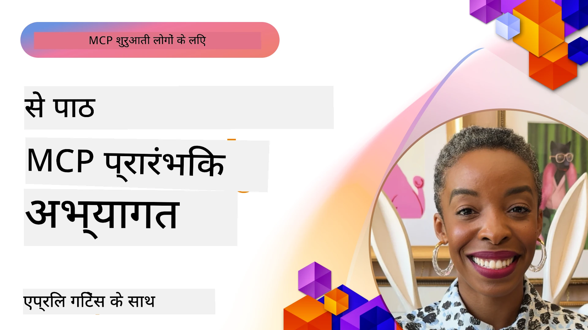

# 🌟 शुरुआती अपनाने वालों से सीखें

[](https://youtu.be/jds7dSmNptE)

_(इस विषय का वीडियो देखने के लिए ऊपर की छवि पर क्लिक करें)_

## 🎯 यह मॉड्यूल क्या कवर करता है

यह मॉड्यूल वास्तविक संगठन और डेवलपर्स मॉडल कंटेक्स्ट प्रोटोकॉल (MCP) का उपयोग कैसे कर रहे हैं, वास्तविक चुनौतियों को हल करने और नवाचार को संचालित करने के लिए इसका पता लगाता है। विस्तृत केस स्टडीज़, व्यावहारिक परियोजनाओं और उदाहरणों के माध्यम से, आप जानेंगे कि कैसे MCP सुरक्षित, स्केलेबल AI एकीकरण को सक्षम बनाता है जो भाषा मॉडल, टूल और एंटरप्राइज डेटा को जोड़ता है।

### 📚 MCP को क्रियान्वित देखें

क्या आप इन सिद्धांतों को उत्पादन-तैयार टूल्स पर लागू होते देखना चाहते हैं? हमारे [**10 Microsoft MCP सर्वर जो डेवलपर उत्पादकता को बदल रहे हैं**](microsoft-mcp-servers.md) को देखें, जो वास्तविक Microsoft MCP सर्वर दिखाते हैं जिन्हें आप आज ही उपयोग कर सकते हैं।

## अवलोकन

यह पाठ यह पता लगाता है कि शुरुआती अपनाने वालों ने मॉडल कंटेक्स्ट प्रोटोकॉल (MCP) का उपयोग कैसे करके विभिन्न उद्योगों में वास्तविक चुनौतियों को हल किया और नवाचार को बढ़ावा दिया। विस्तृत केस स्टडीज़ और व्यावहारिक परियोजनाओं के माध्यम से, आप देखेंगे कि कैसे MCP मानकीकृत, सुरक्षित और स्केलेबल AI एकीकरण सक्षम करता है—जो बड़े भाषा मॉडल, टूल्स, और एंटरप्राइज डेटा को एक एकीकृत ढांचे में जोड़ता है। आप MCP-आधारित समाधानों को डिज़ाइन और बनाने का व्यावहारिक अनुभव प्राप्त करेंगे, सिद्ध कार्यान्वयन पैटर्न्स से सीखेंगे, और उत्पादन वातावरण में MCP को तैनात करने के लिए सर्वश्रेष्ठ प्रथाओं को जानेंगे। यह पाठ उभरती प्रवृत्तियों, भविष्य के रुझानों, और ओपन-सोर्स संसाधनों को भी उजागर करता है, जिससे आप MCP तकनीक और इसके विकसित होते इकोसिस्टम के अग्रिम पथ पर बने रह सकें।

## सीखने के लक्ष्य

- विभिन्न उद्योगों में वास्तविक विश्व MCP कार्यान्वयन का विश्लेषण करें
- पूर्ण MCP-आधारित एप्लिकेशन डिज़ाइन और बनाएं
- MCP तकनीक में उभरती प्रवृत्तियों और भविष्य के रुझानों का अन्वेषण करें
- वास्तविक विकास परिदृश्यों में सर्वश्रेष्ठ प्रथाओं को लागू करें

## वास्तविक विश्व MCP कार्यान्वयन

### केस स्टडी 1: एंटरप्राइज ग्राहक सहायता स्वचालन

एक बहुराष्ट्रीय निगम ने अपने ग्राहक सहायता प्रणालियों में AI इंटरैक्शन को मानकीकृत करने के लिए एक MCP-आधारित समाधान लागू किया। इससे उन्हें यह करने में मदद मिली:

- कई LLM प्रदाताओं के लिए एक एकीकृत इंटरफ़ेस बनाना
- विभागों में सुसंगत प्रांप्ट प्रबंधन बनाए रखना
- मजबूत सुरक्षा और अनुपालन नियंत्रण लागू करना
- विशिष्ट आवश्यकताओं के आधार पर विभिन्न AI मॉडलों के बीच आसानी से स्विच करना

**तकनीकी कार्यान्वयन:**

```python
# ग्राहक सहायता के लिए Python MCP सर्वर कार्यान्वयन
import logging
import asyncio
from modelcontextprotocol import create_server, ServerConfig
from modelcontextprotocol.server import MCPServer
from modelcontextprotocol.transports import create_http_transport
from modelcontextprotocol.resources import ResourceDefinition
from modelcontextprotocol.prompts import PromptDefinition
from modelcontextprotocol.tool import ToolDefinition

# लॉगिंग कॉन्फ़िगर करें
logging.basicConfig(level=logging.INFO)

async def main():
    # सर्वर कॉन्फ़िगरेशन बनाएँ
    config = ServerConfig(
        name="Enterprise Customer Support Server",
        version="1.0.0",
        description="MCP server for handling customer support inquiries"
    )
    
    # MCP सर्वर प्रारंभ करें
    server = create_server(config)
    
    # ज्ञान आधार संसाधन पंजीकृत करें
    server.resources.register(
        ResourceDefinition(
            name="customer_kb",
            description="Customer knowledge base documentation"
        ),
        lambda params: get_customer_documentation(params)
    )
    
    # प्रॉम्प्ट टेम्प्लेट पंजीकृत करें
    server.prompts.register(
        PromptDefinition(
            name="support_template",
            description="Templates for customer support responses"
        ),
        lambda params: get_support_templates(params)
    )
    
    # सहायता उपकरण पंजीकृत करें
    server.tools.register(
        ToolDefinition(
            name="ticketing",
            description="Create and update support tickets"
        ),
        handle_ticketing_operations
    )
    
    # HTTP ट्रांसपोर्ट के साथ सर्वर शुरू करें
    transport = create_http_transport(port=8080)
    await server.run(transport)

if __name__ == "__main__":
    asyncio.run(main())
```

**परिणाम:** मॉडल लागतों में 30% कमी, प्रतिक्रिया स्थिरता में 45% सुधार, और वैश्विक संचालन में बेहतर अनुपालन।

### केस स्टडी 2: स्वास्थ्य देखभाल निदान सहायक

एक स्वास्थ्य सेवा प्रदाता ने कई विशिष्ट मेडिकल AI मॉडलों को जोड़ने के लिए MCP अवसंरचना विकसित की, जबकि संवेदनशील रोगी डेटा की सुरक्षा सुनिश्चित की:

- सामान्य और विशेषज्ञ मेडिकल मॉडलों के बीच निर्बाध स्विचिंग
- कड़े गोपनीयता नियंत्रण और ऑडिट ट्रेल्स
- मौजूदा इलेक्ट्रॉनिक हेल्थ रिकॉर्ड (EHR) प्रणालियों के साथ एकीकरण
- मेडिकल शब्दावली के लिए सुसंगत प्रांप्ट इंजीनियरिंग

**तकनीकी कार्यान्वयन:**

```csharp
// C# MCP host application implementation in healthcare application
using Microsoft.Extensions.DependencyInjection;
using ModelContextProtocol.SDK.Client;
using ModelContextProtocol.SDK.Security;
using ModelContextProtocol.SDK.Resources;

public class DiagnosticAssistant
{
    private readonly MCPHostClient _mcpClient;
    private readonly PatientContext _patientContext;
    
    public DiagnosticAssistant(PatientContext patientContext)
    {
        _patientContext = patientContext;
        
        // Configure MCP client with healthcare-specific settings
        var clientOptions = new ClientOptions
        {
            Name = "Healthcare Diagnostic Assistant",
            Version = "1.0.0",
            Security = new SecurityOptions
            {
                Encryption = EncryptionLevel.Medical,
                AuditEnabled = true
            }
        };
        
        _mcpClient = new MCPHostClientBuilder()
            .WithOptions(clientOptions)
            .WithTransport(new HttpTransport("https://healthcare-mcp.example.org"))
            .WithAuthentication(new HIPAACompliantAuthProvider())
            .Build();
    }
    
    public async Task<DiagnosticSuggestion> GetDiagnosticAssistance(
        string symptoms, string patientHistory)
    {
        // Create request with appropriate resources and tool access
        var resourceRequest = new ResourceRequest
        {
            Name = "patient_records",
            Parameters = new Dictionary<string, object>
            {
                ["patientId"] = _patientContext.PatientId,
                ["requestingProvider"] = _patientContext.ProviderId
            }
        };
        
        // Request diagnostic assistance using appropriate prompt
        var response = await _mcpClient.SendPromptRequestAsync(
            promptName: "diagnostic_assistance",
            parameters: new Dictionary<string, object>
            {
                ["symptoms"] = symptoms,
                patientHistory = patientHistory,
                relevantGuidelines = _patientContext.GetRelevantGuidelines()
            });
            
        return DiagnosticSuggestion.FromMCPResponse(response);
    }
}
```

**परिणाम:** चिकित्सकों के लिए बेहतर निदान सुझाव, पूर्ण HIPAA अनुपालन के साथ, और प्रणालियों के बीच संदर्भ-स्विचिंग में महत्वपूर्ण कमी।

### केस स्टडी 3: वित्तीय सेवा जोखिम विश्लेषण

एक वित्तीय संस्था ने विभिन्न विभागों में अपने जोखिम विश्लेषण प्रक्रियाओं को मानकीकृत करने के लिए MCP लागू किया:

- क्रेडिट जोखिम, धोखाधड़ी पता लगाने, और निवेश जोखिम मॉडलों के लिए एक एकीकृत इंटरफ़ेस बनाया
- कड़े पहुंच नियंत्रण और मॉडल संस्करण प्रबंधन लागू किया
- सभी AI सिफारिशों की ऑडिट योग्यता सुनिश्चित की
- विविध प्रणालियों में सुसंगत डेटा स्वरूपण बनाए रखा

**तकनीकी कार्यान्वयन:**

```java
// वित्तीय जोखिम मूल्यांकन के लिए जावा MCP सर्वर
import org.mcp.server.*;
import org.mcp.security.*;

public class FinancialRiskMCPServer {
    public static void main(String[] args) {
        // वित्तीय अनुपालन विशेषताओं के साथ MCP सर्वर बनाएं
        MCPServer server = new MCPServerBuilder()
            .withModelProviders(
                new ModelProvider("risk-assessment-primary", new AzureOpenAIProvider()),
                new ModelProvider("risk-assessment-audit", new LocalLlamaProvider())
            )
            .withPromptTemplateDirectory("./compliance/templates")
            .withAccessControls(new SOCCompliantAccessControl())
            .withDataEncryption(EncryptionStandard.FINANCIAL_GRADE)
            .withVersionControl(true)
            .withAuditLogging(new DatabaseAuditLogger())
            .build();
            
        server.addRequestValidator(new FinancialDataValidator());
        server.addResponseFilter(new PII_RedactionFilter());
        
        server.start(9000);
        
        System.out.println("Financial Risk MCP Server running on port 9000");
    }
}
```

**परिणाम:** बेहतर नियामक अनुपालन, 40% तेज मॉडल परिनियोजन चक्र, और विभागों में जोखिम आकलन की स्थिरता में सुधार।

### केस स्टडी 4: Microsoft Playwright MCP सर्वर फॉर ब्राउज़र ऑटोमेशन

Microsoft ने [Playwright MCP सर्वर](https://github.com/microsoft/playwright-mcp) विकसित किया, जो मॉडल कंटेक्स्ट प्रोटोकॉल के माध्यम से सुरक्षित, मानकीकृत ब्राउज़र ऑटोमेशन सक्षम करता है। यह उत्पादन-तैयार सर्वर AI एजेंट और LLMs को नियंत्रित, ऑडिटेबल, और विस्तारित तरीके से वेब ब्राउज़र के साथ इंटरैक्ट करने देता है—जैसे स्वचालित वेब परीक्षण, डेटा निष्कर्षण, और एंड-टू-एंड वर्कफ़्लो।

> **🎯 उत्पादन-तैयार उपकरण**  
> यह केस स्टडी एक वास्तविक MCP सर्वर प्रदर्शित करती है जिसे आप आज ही उपयोग कर सकते हैं! Playwright MCP Server और अन्य 9 Microsoft MCP सर्वरों के बारे में अधिक जानें हमारे [**Microsoft MCP सर्वर गाइड**](microsoft-mcp-servers.md#8--playwright-mcp-server) में।

**मुख्य विशेषताएँ:**
- ब्राउज़र ऑटोमेशन क्षमताओं (नेविगेशन, फॉर्म भरना, स्क्रीनशॉट कैप्चर आदि) को MCP टूल्स के रूप में प्रस्तुत करता है
- अनधिकृत क्रियाओं को रोकने के लिए कड़े पहुंच नियंत्रण और सैंडबॉक्सिंग लागू करता है
- सभी ब्राउज़र इंटरैक्शन के लिए विस्तृत ऑडिट लॉग प्रदान करता है
- एजेंट-चालित ऑटोमेशन के लिए Azure OpenAI और अन्य LLM प्रदाताओं के साथ एकीकरण का समर्थन करता है
- वेब ब्राउज़िंग क्षमताओं के साथ GitHub Copilot के कोडिंग एजेंट को पावर देता है

**तकनीकी कार्यान्वयन:**

```typescript
// टाइपस्क्रिप्ट: MCP सर्वर में Playwright ब्राउज़र ऑटोमेशन टूल्स को रजिस्टर करना
import { createServer, ToolDefinition } from 'modelcontextprotocol';
import { launch } from 'playwright';

const server = createServer({
  name: 'Playwright MCP Server',
  version: '1.0.0',
  description: 'MCP server for browser automation using Playwright'
});

// URL पर नेविगेट करने और स्क्रीनशॉट कैप्चर करने के लिए एक टूल रजिस्टर करें
server.tools.register(
  new ToolDefinition({
    name: 'navigate_and_screenshot',
    description: 'Navigate to a URL and capture a screenshot',
    parameters: {
      url: { type: 'string', description: 'The URL to visit' }
    }
  }),
  async ({ url }) => {
    const browser = await launch();
    const page = await browser.newPage();
    await page.goto(url);
    const screenshot = await page.screenshot();
    await browser.close();
    return { screenshot };
  }
);

// MCP सर्वर शुरू करें
server.listen(8080);
```

**परिणाम:**

- AI एजेंट और LLM के लिए सुरक्षित, प्रोग्रामेटिक ब्राउज़र ऑटोमेशन सक्षम किया
- मैनुअल परीक्षण प्रयास कम किए और वेब ऐप्लिकेशन के लिए परीक्षण कवरेज में सुधार किया
- एंटरप्राइज वातावरण में ब्राउज़र-आधारित टूल एकीकरण के लिए पुन: उपयोग योग्य, विस्तारित फ्रेमवर्क प्रदान किया
- GitHub Copilot की वेब ब्राउज़िंग क्षमताओं को सशक्त बनाया

**संदर्भ:**

- [Playwright MCP Server GitHub Repository](https://github.com/microsoft/playwright-mcp)
- [Microsoft AI and Automation Solutions](https://azure.microsoft.com/en-us/products/ai-services/)

### केस स्टडी 5: Azure MCP – एंटरप्राइज-ग्रेड मॉडल कंटेक्स्ट प्रोटोकॉल as a Service

Azure MCP Server ([https://aka.ms/azmcp](https://aka.ms/azmcp)) Microsoft का मैनेज्ड, एंटरप्राइज-ग्रेड मॉडल कंटेक्स्ट प्रोटोकॉल कार्यान्वयन है, जो क्लाउड सेवा के रूप में स्केलेबल, सुरक्षित, और अनुपालन योग्य MCP सर्वर क्षमताएं प्रदान करता है। Azure MCP संगठनों को MCP सर्वरों को Azure AI, डेटा, और सुरक्षा सेवाओं के साथ तेजी से तैनात, प्रबंधित, और एकीकृत करने में सक्षम बनाता है, जिससे परिचालन भार कम होता है और AI अपनाने में तेजी आती है।

> **🎯 उत्पादन-तैयार उपकरण**  
> यह एक वास्तविक MCP सर्वर है जिसे आप आज ही उपयोग कर सकते हैं! Azure AI Foundry MCP Server के बारे में और जानें हमारे [**Microsoft MCP Servers Guide**](microsoft-mcp-servers.md) में।

- अंतर्निहित स्केलिंग, निगरानी, और सुरक्षा के साथ पूर्ण प्रबंधित MCP सर्वर होस्टिंग
- Azure OpenAI, Azure AI Search, और अन्य Azure सेवाओं के साथ मूल एकीकरण
- Microsoft Entra ID के माध्यम से एंटरप्राइज प्रमाणीकरण और प्राधिकरण
- कस्टम टूल्स, प्रांप्ट टेम्पलेट्स, और संसाधन कनेक्टर्स के लिए समर्थन
- एंटरप्राइज सुरक्षा और नियामक आवश्यकताओं के अनुपालन

**तकनीकी कार्यान्वयन:**

```yaml
# Example: Azure MCP server deployment configuration (YAML)
apiVersion: mcp.microsoft.com/v1
kind: McpServer
metadata:
  name: enterprise-mcp-server
spec:
  modelProviders:
    - name: azure-openai
      type: AzureOpenAI
      endpoint: https://<your-openai-resource>.openai.azure.com/
      apiKeySecret: <your-azure-keyvault-secret>
  tools:
    - name: document_search
      type: AzureAISearch
      endpoint: https://<your-search-resource>.search.windows.net/
      apiKeySecret: <your-azure-keyvault-secret>
  authentication:
    type: EntraID
    tenantId: <your-tenant-id>
  monitoring:
    enabled: true
    logAnalyticsWorkspace: <your-log-analytics-id>
```

**परिणाम:**  
- तैयार, अनुपालन योग्य MCP सर्वर प्लेटफ़ॉर्म प्रदान करके एंटरप्राइज AI परियोजनाओं के लिए समय को कम किया
- LLMs, टूल्स, और एंटरप्राइज डेटा स्रोतों का सरलीकृत एकीकरण
- MCP वर्कलोड के लिए बेहतर सुरक्षा, प्रेक्षणीयता और परिचालन दक्षता
- Azure SDK सर्वश्रेष्ठ प्रथाओं और नवीनतम प्रमाणीकरण पैटर्न के साथ कोड गुणवत्ता में सुधार

**संदर्भ:**  
- [Azure MCP Documentation](https://aka.ms/azmcp)
- [Azure MCP Server GitHub Repository](https://github.com/Azure/azure-mcp)
- [Azure AI Services](https://azure.microsoft.com/en-us/products/ai-services/)
- [Microsoft MCP Center](https://mcp.azure.com)

## केस स्टडी 6: NLWeb  
MCP (Model Context Protocol) एक उभरता हुआ प्रोटोकॉल है चैटबॉट्स और AI सहायकों को टूल्स के साथ संवाद करने के लिए। हर NLWeb इंस्टेंस भी एक MCP सर्वर है, जो एक मुख्य विधि, ask का समर्थन करता है, जिसका उपयोग किसी वेबसाइट से प्राकृतिक भाषा में प्रश्न पूछने के लिए किया जाता है। प्राप्त उत्तर schema.org का उपयोग करता है, जो वेब डेटा का वर्णन करने के लिए व्यापक रूप से प्रयुक्त शब्दावली है। संक्षेप में, MCP वही है जो Http है HTML के लिए। NLWeb प्रोटोकॉल, Schema.org प्रारूप, और नमूना कोड को जोड़ता है ताकि साइटें तेजी से ये अंत बिंदु बना सकें, जो मनुष्यों के लिए वार्तालाप इंटरफेस और मशीनों के लिए प्राकृतिक एजेंट-से-एजेंट इंटरैक्शन का लाभ प्रदान करता है।

NLWeb के दो अलग घटक हैं।  
- एक प्रोटोकॉल, जो एक साइट के साथ प्राकृतिक भाषा में इंटरफेस करने के लिए बहुत सरल प्रारंभिक विधि है, और एक प्रारूप, जो प्रत्युत्तर के लिए json और schema.org का उपयोग करता है। अधिक विवरण के लिए REST API के दस्तावेज़ देखें।  
- (1) का एक सरल कार्यान्वयन जो मौजूदा मार्कअप का उपयोग करता है, उन साइट्स के लिए जो उत्पादों, रेसिपी, आकर्षण, समीक्षाओं आदि की सूचियों के रूप में अमूर्त हो सकती हैं। उपयोगकर्ता इंटरफेस विजेट्स के एक सेट के साथ, साइट्स आसानी से अपनी सामग्री के लिए वार्तालाप इंटरफेस प्रदान कर सकती हैं। यह कैसे काम करता है इसके लिए Life of a chat query के दस्तावेज़ देखें।

**संदर्भ:**  
- [Azure MCP Documentation](https://aka.ms/azmcp)  
- [NLWeb](https://github.com/microsoft/NlWeb)  

### केस स्टडी 7: Azure AI Foundry MCP Server – एंटरप्राइज AI एजेंट एकीकरण

Azure AI Foundry MCP सर्वर दिखाते हैं कि एंटरप्राइज वातावरण में MCP का उपयोग AI एजेंट और वर्कफ़्लोज़ का समन्वय और प्रबंधन करने के लिए कैसे किया जा सकता है। MCP को Azure AI Foundry के साथ एकीकृत करके, संगठन एजेंट इंटरैक्शन को मानकीकृत कर सकते हैं, Foundry के वर्कफ़्लो प्रबंधन का लाभ उठा सकते हैं, और सुरक्षित, स्केलेबल तैनाती सुनिश्चित कर सकते हैं।

> **🎯 उत्पादन-तैयार उपकरण**  
> यह एक वास्तविक MCP सर्वर है जिसे आप आज ही उपयोग कर सकते हैं! Azure AI Foundry MCP Server के बारे में और जानें हमारे [**Microsoft MCP Servers Guide**](microsoft-mcp-servers.md#9--azure-ai-foundry-mcp-server) में।

**मुख्य विशेषताएँ:**  
- मॉडल कैटलॉग और परिनियोजन प्रबंधन सहित Azure के AI पारिस्थितिकी तंत्र तक व्यापक पहुंच  
- RAG अनुप्रयोगों के लिए Azure AI Search के साथ ज्ञान सूचीकरण  
- AI मॉडल प्रदर्शन और गुणवत्ता आश्वासन के लिए मूल्यांकन उपकरण  
- Azure AI Foundry कैटलॉग और लैब्स के साथ नवीनतम अनुसंधान मॉडल एकीकरण  
- उत्पादन परिदृश्यों के लिए एजेंट प्रबंधन और मूल्यांकन क्षमताएं  

**परिणाम:**  
- AI एजेंट वर्कफ़्लोज़ के तेज प्रोटोटाइपिंग और मजबूत निगरानी  
- उन्नत परिदृश्यों के लिए Azure AI सेवाओं के साथ सहज एकीकरण  
- एजेंट पाइपलाइनों के निर्माण, तैनाती और निगरानी के लिए एकीकृत इंटरफेस  
- एंटरप्राइज के लिए बेहतर सुरक्षा, अनुपालन, और परिचालन दक्षता  
- जटिल एजेंट-चालित प्रक्रियाओं पर नियंत्रण बनाये रखते हुए AI अपनाने में तेजी  

**संदर्भ:**  
- [Azure AI Foundry MCP Server GitHub Repository](https://github.com/azure-ai-foundry/mcp-foundry)  
- [Integrating Azure AI Agents with MCP (Microsoft Foundry Blog)](https://devblogs.microsoft.com/foundry/integrating-azure-ai-agents-mcp/)  

### केस स्टडी 8: Foundry MCP Playground – प्रयोग और प्रोटोटाइपिंग

Foundry MCP Playground MCP सर्वरों और Azure AI Foundry एकीकरण के साथ प्रयोग करने के लिए एक तैयार-से-उपयोग वातावरण प्रदान करता है। डेवलपर्स तेजी से AI मॉडल और एजेंट वर्कफ़्लोज़ का प्रोटोटाइप, परीक्षण, और मूल्यांकन कर सकते हैं, Azure AI Foundry कैटलॉग और लैब्स के संसाधनों का उपयोग करके। यह प्लेग्राउंड सेटअप को सरल बनाता है, नमूना परियोजनाएं प्रदान करता है, और सहकार्यात्मक विकास का समर्थन करता है, जिससे न्यूनतम बाधाओं के साथ सर्वोत्तम प्रथाओं और नए परिदृश्यों को अन्वेषण करना आसान होता है। यह विशेष रूप से उन टीमों के लिए उपयोगी है जो विचारों को सत्यापित करना, प्रयोग साझा करना, और सीखने में तेजी लाना चाहती हैं, बिना जटिल инфраструктure की आवश्यकता के। बाधा कम करके, यह प्लेग्राउंड MCP और Azure AI Foundry इकोसिस्टम में नवाचार और सामुदायिक योगदान को बढ़ावा देता है।

**संदर्भ:**

- [Foundry MCP Playground GitHub Repository](https://github.com/azure-ai-foundry/foundry-mcp-playground)

### केस स्टडी 9: Microsoft Learn Docs MCP Server – AI-संचालित दस्तावेज़ पहुँच

Microsoft Learn Docs MCP Server एक क्लाउड-होस्टेड सेवा है जो AI सहायकों को मॉडल कंटेक्स्ट प्रोटोकॉल के माध्यम से आधिकारिक Microsoft दस्तावेज़ों तक वास्तविक समय में पहुंच प्रदान करती है। यह उत्पादन-तैयार सर्वर व्यापक Microsoft Learn इकोसिस्टम से जुड़ता है और सभी आधिकारिक Microsoft स्रोतों में अर्थपूर्ण खोज सक्षम करता है।

> **🎯 उत्पादन-तैयार उपकरण**  
> यह एक वास्तविक MCP सर्वर है जिसे आप आज ही उपयोग कर सकते हैं! Microsoft Learn Docs MCP Server के बारे में अधिक जानें हमारे [**Microsoft MCP Servers Guide**](microsoft-mcp-servers.md#1--microsoft-learn-docs-mcp-server) में।

**मुख्य विशेषताएँ:**  
- आधिकारिक Microsoft दस्तावेज़ों, Azure डॉक्स, और Microsoft 365 दस्तावेज़ों तक वास्तविक समय में पहुंच  
- संदर्भ और इरादे को समझने वाली उन्नत अर्थपूर्ण खोज क्षमताएं  
- Microsoft Learn सामग्री प्रकाशित होते ही हमेशा अपडेटेड जानकारी  
- Microsoft Learn, Azure डॉक्स, और Microsoft 365 स्रोतों में व्यापक कवरेज  
- लेख शीर्षक और URL के साथ 10 उच्च गुणवत्ता वाले कंटेंट टुकड़े तक लौटाता है  

**महत्व क्यों है:**  
- Microsoft तकनीकों के लिए "पुरानी AI ज्ञान" समस्या को हल करता है  
- AI सहायकों को नवीनतम .NET, C#, Azure, और Microsoft 365 सुविधाओं तक पहुंच सुनिश्चित करता है  
- सटीक कोड जनरेशन के लिए प्राधिकृत, प्रथम-पक्ष जानकारी प्रदान करता है  
- तेजी से विकसित हो रही Microsoft तकनीकों के साथ काम करने वाले डेवलपर्स के लिए आवश्यक  

**परिणाम:**  
- Microsoft तकनीकों के लिए AI-जनरेटेड कोड की सटीकता में नाटकीय सुधार  
- वर्तमान दस्तावेज़ों और सर्वश्रेष्ठ प्रथाओं की खोज में समय की बचत  
- संदर्भ-सूचित दस्तावेज़ पुनर्प्राप्ति के साथ डेवलपर उत्पादकता बढ़ी  
- IDE छोड़ने के बिना विकास वर्कफ़्लोज़ के साथ सहज एकीकरण  

**संदर्भ:**  
- [Microsoft Learn Docs MCP Server GitHub Repository](https://github.com/MicrosoftDocs/mcp)  
- [Microsoft Learn Documentation](https://learn.microsoft.com/)  

## व्यावहारिक परियोजनाएं

### परियोजना 1: मल्टी-प्रदाता MCP सर्वर बनाएं

**उद्देश्य:** एक MCP सर्वर बनाएं जो विशिष्ट मानदंडों के आधार पर कई AI मॉडल प्रदाताओं को अनुरोध भेज सके।

**आवश्यकताएँ:**

- कम से कम तीन अलग-अलग मॉडल प्रदाताओं का समर्थन करें (जैसे OpenAI, Anthropic, स्थानीय मॉडल)
- अनुरोध मेटाडेटा के आधार पर रूटिंग तंत्र लागू करें
- प्रदाता क्रेडेंशियल्स के प्रबंधन के लिए कॉन्फ़िगरेशन सिस्टम बनाएं
- प्रदर्शन और लागत को अनुकूलित करने के लिए कैशिंग जोड़ें
- उपयोग की निगरानी के लिए एक सरल डैशबोर्ड बनाएं

**कार्यान्वयन चरण:**

1. मूल MCP सर्वर अवसंरचना सेटअप करें
2. प्रत्येक AI मॉडल सेवा के लिए प्रदाता एडाप्टर लागू करें
3. अनुरोध गुणों के आधार पर रूटिंग तर्क बनाएं
4. बार-बार अनुरोधों के लिए कैशिंग तंत्र जोड़ें
5. निगरानी डैशबोर्ड विकसित करें
6. विभिन्न अनुरोध पैटर्न के साथ परीक्षण करें

**प्रौद्योगिकियां:** अपनी पसंद के आधार पर Python (.NET/Java/Python), कैशिंग के लिए Redis, और डैशबोर्ड के लिए सरल वेब फ्रेमवर्क चुनें।

### परियोजना 2: एंटरप्राइज प्रांप्ट प्रबंधन प्रणाली
**उद्देश्य:** एक MCP-आधारित प्रणाली विकसित करना जो संगठन में प्रॉम्प्ट टेम्पलेट्स का प्रबंधन, संस्करण नियंत्रण, और परिनियोजन कर सके।

**आवश्यकताएं:**

- प्रॉम्प्ट टेम्पलेट्स के लिए एक केंद्रीकृत रिपॉजिटरी बनाएं
- संस्करण नियंत्रण और स्वीकृति कार्यप्रवाह लागू करें
- नमूना इनपुट के साथ टेम्पलेट परीक्षण क्षमताएँ बनाएं
- भूमिका-आधारित एक्सेस नियंत्रण विकसित करें
- टेम्पलेट पुनःप्राप्ति और परिनियोजन के लिए एक API बनाएं

**कार्यान्वयन चरण:**

1. टेम्पलेट भंडारण के लिए डेटाबेस स्कीमा डिज़ाइन करें
2. टेम्पलेट CRUD संचालन के लिए मुख्य API बनाएँ
3. संस्करण नियंत्रण प्रणाली लागू करें
4. स्वीकृति कार्यप्रवाह बनाएं
5. परीक्षण फ्रेमवर्क विकसित करें
6. प्रबंधन के लिए एक सरल वेब इंटरफ़ेस बनाएं
7. एक MCP सर्वर के साथ एकीकरण करें

**प्रौद्योगिकियां:** आपकी पसंद का बैकएंड फ्रेमवर्क, SQL या NoSQL डेटाबेस, और प्रबंधन इंटरफ़ेस के लिए एक फ्रंटेंड फ्रेमवर्क।

### परियोजना 3: MCP-आधारित सामग्री निर्माण प्लेटफ़ॉर्म

**उद्देश्य:** एक सामग्री निर्माण प्लेटफ़ॉर्म बनाएँ जो MCP का उपयोग करके विभिन्न सामग्री प्रकारों में समान रूप से परिणाम प्रदान करे।

**आवश्यकताएं:**

- कई सामग्री प्रारूपों का समर्थन (ब्लॉग पोस्ट, सोशल मीडिया, मार्केटिंग कॉपी)
- अनुकूलन विकल्पों के साथ टेम्पलेट-आधारित जनरेशन लागू करें
- सामग्री समीक्षा और प्रतिक्रिया प्रणाली बनाएं
- सामग्री प्रदर्शन मेट्रिक्स ट्रैक करें
- सामग्री संस्करण नियंत्रण और पुनरावृत्ति का समर्थन करें

**कार्यान्वयन चरण:**

1. MCP क्लाइंट इन्फ्रास्ट्रक्चर सेट अप करें
2. विभिन्न सामग्री प्रकारों के लिए टेम्पलेट बनाएं
3. सामग्री निर्माण पाइपलाइन बनाएं
4. समीक्षा प्रणाली लागू करें
5. मेट्रिक्स ट्रैकिंग सिस्टम विकसित करें
6. टेम्पलेट प्रबंधन और सामग्री निर्माण के लिए एक उपयोगकर्ता इंटरफ़ेस बनाएं

**प्रौद्योगिकियां:** आपकी पसंदीदा प्रोग्रामिंग भाषा, वेब फ्रेमवर्क, और डेटाबेस सिस्टम।

## MCP प्रौद्योगिकी के लिए भविष्य की दिशाएँ

### उभरती प्रवृत्तियाँ

1. **मल्टी-मोडल MCP**
   - छवि, ऑडियो, और वीडियो मॉडल के साथ इंटरैक्शन को मानकीकृत करने के लिए MCP का विस्तार
   - क्रॉस-मोडल तर्क क्षमता का विकास
   - विभिन्न प्रकार के लिए मानकीकृत प्रॉम्प्ट प्रारूप

2. **फेडरेटेड MCP इन्फ्रास्ट्रक्चर**
   - वितरित MCP नेटवर्क जो संगठनों के बीच संसाधन साझा कर सकते हैं
   - सुरक्षित मॉडल साझाकरण के लिए मानकीकृत प्रोटोकॉल
   - गोपनीयता-संरक्षित गणना तकनीकें

3. **MCP मार्केटप्लेस**
   - MCP टेम्पलेट्स और प्लगइन्स साझा करने और मुद्रीकृत करने के लिए इकोसिस्टम
   - गुणवत्ता आश्वासन और प्रमाणन प्रक्रियाएं
   - मॉडल मार्केटप्लेस के साथ एकीकरण

4. **एज कंप्यूटिंग के लिए MCP**
   - संसाधन-सीमित एज डिवाइसों के लिए MCP मानकों का अनुकूलन
   - कम बैंडविड्थ वातावरण के लिए अनुकूलित प्रोटोकॉल
   - IoT इकोसिस्टम के लिए विशेष MCP कार्यान्वयन

5. **नियामक ढाँचा**
   - नियामक अनुपालन के लिए MCP एक्सटेंशन्स का विकास
   - मानकीकृत ऑडिट ट्रेल और व्याख्यात्मक इंटरफेस
   - उभरते AI शासन ढाँचों के साथ एकीकरण

### माइक्रोसॉफ्ट से MCP समाधान

माइक्रोसॉफ्ट और Azure ने विभिन्न परिदृश्यों में MCP को लागू करने में मदद के लिए कई ओपन-सोर्स रिपॉजिटरी विकसित की हैं:

#### Microsoft Organization

1. [playwright-mcp](https://github.com/microsoft/playwright-mcp) - ब्राउज़र ऑटोमेशन और परीक्षण के लिए Playwright MCP सर्वर
2. [files-mcp-server](https://github.com/microsoft/files-mcp-server) - स्थानीय परीक्षण और सामुदायिक योगदान के लिए OneDrive MCP सर्वर कार्यान्वयन
3. [NLWeb](https://github.com/microsoft/NlWeb) - NLWeb खुले प्रोटोकॉल और संबंधित ओपन सोर्स टूल्स का संग्रह है। इसका मुख्य फोकस AI वेब के लिए एक आधारभूत परत स्थापित करना है

#### Azure-Samples Organization

1. [mcp](https://github.com/Azure-Samples/mcp) - Azure पर MCP सर्वर बनाने और एकीकृत करने के लिए विभिन्न भाषाओं में नमूने, टूल, और संसाधनों के लिंक
2. [mcp-auth-servers](https://github.com/Azure-Samples/mcp-auth-servers) - वर्तमान Model Context Protocol विनिर्देशन के साथ प्रमाणीकरण को प्रदर्शित करने वाले संदर्भ MCP सर्वर
3. [remote-mcp-functions](https://github.com/Azure-Samples/remote-mcp-functions) - Azure Functions में रिमोट MCP सर्वर कार्यान्वयन के लिए लैंडिंग पेज, भाषा-विशिष्ट रिपोजिटरी के लिंक के साथ
4. [remote-mcp-functions-python](https://github.com/Azure-Samples/remote-mcp-functions-python) - Azure Functions के साथ Python का उपयोग करके कस्टम रिमोट MCP सर्वर बनाने और तैनात करने के लिए क्विकस्टार्ट टेम्पलेट
5. [remote-mcp-functions-dotnet](https://github.com/Azure-Samples/remote-mcp-functions-dotnet) - Azure Functions के साथ .NET/C# का उपयोग करके कस्टम रिमोट MCP सर्वर बनाने और तैनात करने के लिए क्विकस्टार्ट टेम्पलेट
6. [remote-mcp-functions-typescript](https://github.com/Azure-Samples/remote-mcp-functions-typescript) - Azure Functions के साथ TypeScript का उपयोग करके कस्टम रिमोट MCP सर्वर बनाने और तैनात करने के लिए क्विकस्टार्ट टेम्पलेट
7. [remote-mcp-apim-functions-python](https://github.com/Azure-Samples/remote-mcp-apim-functions-python) - Python के उपयोग से Remote MCP सर्वरों के लिए Azure API प्रबंधन को AI गेटवे के रूप में
8. [AI-Gateway](https://github.com/Azure-Samples/AI-Gateway) - APIM ❤️ AI प्रयोग, जिसमें MCP क्षमताएं, Azure OpenAI और AI Foundry के साथ एकीकरण शामिल हैं

ये रिपॉजिटरी विभिन्न प्रोग्रामिंग भाषाओं और Azure सेवाओं में Model Context Protocol के साथ काम करने के लिए विभिन्न कार्यान्वयन, टेम्पलेट और संसाधन प्रदान करती हैं। ये मूल सर्वर कार्यान्वयन से लेकर प्रमाणीकरण, क्लाउड परिनियोजन, और उद्यम एकीकरण परिदृश्यों तक कई उपयोग मामलों को कवर करती हैं।

#### MCP संसाधन निर्देशिका

[MCP Resources directory](https://github.com/microsoft/mcp/tree/main/Resources) आधिकारिक Microsoft MCP रिपॉजिटरी में Model Context Protocol सर्वरों के साथ उपयोग के लिए नमूना संसाधन, प्रॉम्प्ट टेम्पलेट्स, और टूल परिभाषाओं का संग्रह प्रदान करता है। यह निर्देशिका डेवलपर्स को जल्दी शुरुआत करने में मदद करने के लिए पुन: प्रयोज्य बिल्डिंग ब्लॉक्स और सर्वश्रेष्ठ प्रथाओं के उदाहरण प्रदान करती है:

- **प्रॉम्प्ट टेम्पलेट्स:** सामान्य AI कार्यों और परिदृश्यों के लिए तैयार उपयोग प्रॉम्प्ट टेम्पलेट, जिन्हें आपकी अपनी MCP सर्वर कार्यान्वयन के लिए अनुकूलित किया जा सकता है।
- **टूल परिभाषाएँ:** उदाहरण टूल स्कीमास और मेटाडेटा जो विभिन्न MCP सर्वरों में टूल इंटीग्रेशन और आमंत्रण को मानकीकृत करते हैं।
- **संसाधन नमूने:** MCP फ्रेमवर्क के भीतर डेटा स्रोतों, API, और बाहरी सेवाओं से कनेक्ट करने के लिए उदाहरण संसाधन परिभाषाएं।
- **संदर्भ कार्यान्वयन:** व्यावहारिक नमूने जो दिखाते हैं कि वास्तविक दुनिया के MCP प्रोजेक्ट्स में संसाधनों, प्रॉम्प्ट्स, और टूल्स को कैसे संरचित और व्यवस्थित करें।

ये संसाधन विकास को गति देते हैं, मानकीकरण को बढ़ावा देते हैं, और MCP-आधारित समाधानों के निर्माण और परिनियोजन के दौरान सर्वोत्तम प्रथाओं को सुनिश्चित करते हैं।

#### MCP संसाधन निर्देशिका

- [MCP Resources (Sample Prompts, Tools, and Resource Definitions)](https://github.com/microsoft/mcp/tree/main/Resources)

### अनुसंधान के अवसर

- MCP फ्रेमवर्क के भीतर प्रभावी प्रॉम्प्ट अनुकूलन तकनीकें
- मल्टी-टेनेंट MCP परिनियोजन के लिए सुरक्षा मॉडल
- विभिन्न MCP कार्यान्वयनों में प्रदर्शन बेंचमार्किंग
- MCP सर्वरों के लिए औपचारिक सत्यापन विधियां

## निष्कर्ष

Model Context Protocol (MCP) जल्दी से उद्योगों में मानकीकृत, सुरक्षित, और इंटरऑपरेबल AI एकीकरण के भविष्य को आकार दे रहा है। इस पाठ में केस स्टडीज़ और व्यावहारिक परियोजनाओं के माध्यम से, आपने देखा कि शुरुआती उपयोगकर्ता—जिसमें Microsoft और Azure शामिल हैं—MCP का उपयोग वास्तविक दुनिया की चुनौतियों को हल करने, AI अंगीकरण को तेज करने, और अनुपालन, सुरक्षा, और मापनीयता सुनिश्चित करने के लिए कैसे कर रहे हैं। MCP का मॉड्यूलर दृष्टिकोण संगठनों को बड़े भाषा मॉडल, टूल्स, और उद्यम डेटा को एक एकीकृत, ऑडिटेबल फ्रेमवर्क में जोड़ने में सक्षम बनाता है। जैसे-जैसे MCP विकसित होता रहेगा, समुदाय के साथ जुड़ा रहना, ओपन सोर्स संसाधनों का अन्वेषण करना, और सर्वोत्तम प्रथाओं को लागू करना मजबूत, भविष्य-सिद्ध AI समाधान बनाने की कुंजी होगी।

## अतिरिक्त संसाधन

- [MCP Foundry GitHub Repository](https://github.com/azure-ai-foundry/mcp-foundry)
- [Foundry MCP Playground](https://github.com/azure-ai-foundry/foundry-mcp-playground)
- [Azure AI एजेंट्स को MCP के साथ एकीकृत करना (Microsoft Foundry Blog)](https://devblogs.microsoft.com/foundry/integrating-azure-ai-agents-mcp/)
- [MCP GitHub Repository (Microsoft)](https://github.com/microsoft/mcp)
- [MCP Resources Directory (Sample Prompts, Tools, and Resource Definitions)](https://github.com/microsoft/mcp/tree/main/Resources)
- [MCP Community & Documentation](https://modelcontextprotocol.io/introduction)
- [MCP Specification (2025-11-25)](https://spec.modelcontextprotocol.io/specification/2025-11-25/)
- [Azure MCP Documentation](https://aka.ms/azmcp)
- [OWASP MCP Top 10](https://microsoft.github.io/mcp-azure-security-guide/mcp/) - सुरक्षा सर्वोत्तम प्रथाएं
- [Playwright MCP Server GitHub Repository](https://github.com/microsoft/playwright-mcp)
- [Files MCP Server (OneDrive)](https://github.com/microsoft/files-mcp-server)
- [Azure-Samples MCP](https://github.com/Azure-Samples/mcp)
- [MCP Auth Servers (Azure-Samples)](https://github.com/Azure-Samples/mcp-auth-servers)
- [Remote MCP Functions (Azure-Samples)](https://github.com/Azure-Samples/remote-mcp-functions)
- [Remote MCP Functions Python (Azure-Samples)](https://github.com/Azure-Samples/remote-mcp-functions-python)
- [Remote MCP Functions .NET (Azure-Samples)](https://github.com/Azure-Samples/remote-mcp-functions-dotnet)
- [Remote MCP Functions TypeScript (Azure-Samples)](https://github.com/Azure-Samples/remote-mcp-functions-typescript)
- [Remote MCP APIM Functions Python (Azure-Samples)](https://github.com/Azure-Samples/remote-mcp-apim-functions-python)
- [AI-Gateway (Azure-Samples)](https://github.com/Azure-Samples/AI-Gateway)
- [Microsoft AI and Automation Solutions](https://azure.microsoft.com/en-us/products/ai-services/)

## अभ्यास

1. एक केस स्टडी का विश्लेषण करें और एक वैकल्पिक कार्यान्वयन दृष्टिकोण प्रस्तावित करें।
2. परियोजना विचारों में से एक चुनें और एक विस्तृत तकनीकी विनिर्देश बनाएं।
3. एक उद्योग का शोध करें जो केस स्टडीज़ में शामिल नहीं है और यह रेखांकित करें कि MCP इसकी विशिष्ट चुनौतियों को कैसे संबोधित कर सकता है।
4. भविष्य की दिशा में से एक का अन्वेषण करें और इसे समर्थित करने के लिए एक नए MCP एक्सटेंशन का अवधारणा बनाएं।

## आगे क्या है

अधिक अन्वेषण करें: [Microsoft MCP Servers](./microsoft-mcp-servers.md)

जारी रखें: [Module 8: Best Practices](../08-BestPractices/README.md)

---

<!-- CO-OP TRANSLATOR DISCLAIMER START -->
**अस्वीकरण**:
यह दस्तावेज़ AI अनुवाद सेवा [Co-op Translator](https://github.com/Azure/co-op-translator) का उपयोग करके अनुवादित किया गया है। जबकि हम सटीकता के लिए प्रयास करते हैं, कृपया ध्यान दें कि स्वचालित अनुवादों में त्रुटियां या असंगतियां हो सकती हैं। मूल दस्तावेज़ अपनी स्थानीय भाषा में प्राधिकृत स्रोत माना जाना चाहिए। महत्वपूर्ण जानकारी के लिए, पेशेवर मानव अनुवाद की सलाह दी जाती है। इस अनुवाद के उपयोग से उत्पन्न किसी भी गलतफहमी या व्याख्या के लिए हम उत्तरदायी नहीं हैं।
<!-- CO-OP TRANSLATOR DISCLAIMER END -->