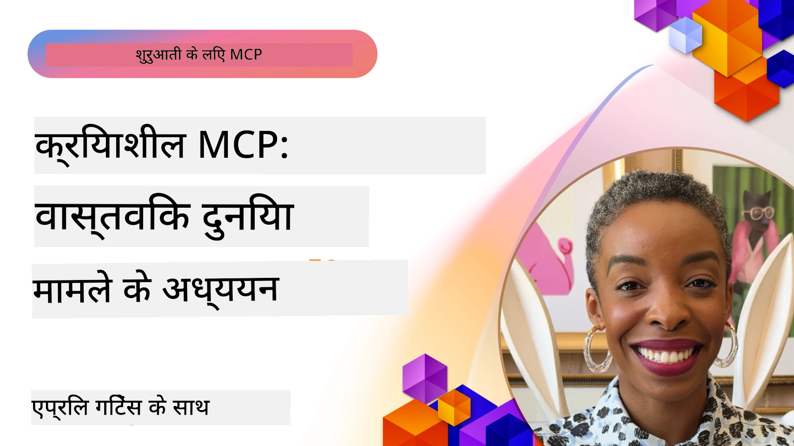

# MCP का परिचय: वास्तविक दुनिया के केस स्टडीज़

_(इस लेसन का वीडियो देखने के लिए ऊपर की छवि पर क्लिक करें)_

मॉडल कॉन्टेक्स्ट प्रोटोकॉल (MCP) यह रूपांतरित कर रहा है कि AI एप्लिकेशन डेटा, टूल्स, और सेवाओं के साथ कैसे इंटरैक्ट करते हैं। यह अनुभाग वास्तविक दुनिया के केस स्टडीज़ प्रस्तुत करता है जो विभिन्न एंटरप्राइज परिदृश्यों में MCP के व्यावहारिक अनुप्रयोगों को प्रदर्शित करते हैं।

## अवलोकन

यह अनुभाग MCP कार्यान्वयन के ठोस उदाहरण दिखाता है, यह रेखांकित करता है कि संगठन इस प्रोटोकॉल का किस प्रकार उपयोग कर जटिल व्यावसायिक चुनौतियों को हल कर रहे हैं। इन केस स्टडीज़ की जांच करके, आप वास्तविक दुनिया की परिस्थितियों में MCP की बहुमुखी प्रतिभा, स्केलेबिलिटी, और व्यावहारिक लाभों के बारे में जानकारी प्राप्त करेंगे।

## मुख्य सीखने के उद्देश्य

इन केस स्टडीज़ का अन्वेषण करके, आप:

- समझेंगे कि MCP का उपयोग विशिष्ट व्यावसायिक समस्याओं को हल करने के लिए कैसे किया जा सकता है
- विभिन्न इंटीग्रेशन पैटर्न और वास्तुशिल्प दृष्टिकोणों के बारे में जानेंगे
- एंटरप्राइज वातावरण में MCP को लागू करने के सर्वोत्तम तरीकों को पहचानेंगे
- वास्तविक दुनिया के कार्यान्वयन में सामने आने वाली चुनौतियों और समाधानों की जानकारी प्राप्त करेंगे
- अपने स्वयं के प्रोजेक्ट्स में समान पैटर्न लागू करने के अवसरों की पहचान करेंगे

## प्रमुख केस स्टडीज़

### 1. [Azure AI Travel Agents – संदर्भ कार्यान्वयन](./travelagentsample.md)

यह केस स्टडी Microsoft के व्यापक संदर्भ समाधान की समीक्षा करता है जो दिखाता है कि कैसे MCP, Azure OpenAI, और Azure AI Search का उपयोग करके एक मल्टी-एजेंट, AI-समर्थित ट्रैवल प्लानिंग एप्लिकेशन बनाया जाए। यह प्रोजेक्ट दर्शाता है:

- MCP के माध्यम से मल्टी-एजेंट ऑर्केस्ट्रेशन
- Azure AI Search के साथ एंटरप्राइज डेटा इंटीग्रेशन
- Azure सेवाओं का उपयोग करके सुरक्षित, स्केलेबल आर्किटेक्चर
- पुन: प्रयोज्य MCP कंपोनेंट्स के साथ एक्स्टेंसिबल टूलिंग
- Azure OpenAI द्वारा संचालित संवादात्मक उपयोगकर्ता अनुभव

आर्किटेक्चर और कार्यान्वयन विवरण MCP को समन्वय परत के रूप में उपयोग करते हुए जटिल मल्टी-एजेंट सिस्टम बनाने की महत्वपूर्ण जानकारी प्रदान करते हैं।

### 2. [YouTube डेटा से Azure DevOps आइटम अपडेट करना](./UpdateADOItemsFromYT.md)

यह केस स्टडी MCP के व्यावहारिक अनुप्रयोग को दिखाती है जो वर्कफ़्लो प्रक्रियाओं को स्वचालित करती है। यह दिखाता है कि MCP टूल्स का उपयोग कैसे किया जा सकता है:

- ऑनलाइन प्लेटफ़ॉर्म (YouTube) से डेटा निकालने के लिए
- Azure DevOps सिस्टम में वर्क आइटम अपडेट करने के लिए
- पुनरावृत्ति योग्य स्वचालन वर्कफ़्लो बनाने के लिए
- भिन्न प्रणालियों के बीच डेटा एकीकरण के लिए

यह उदाहरण दर्शाता है कि कैसे अपेक्षाकृत सरल MCP कार्यान्वयन भी नियमित कार्यों को स्वचालित करके और सिस्टम्स में डेटा की स्थिरता बढ़ाकर महत्वपूर्ण दक्षता लाभ प्रदान कर सकते हैं।

### 3. [MCP के साथ रियल-टाइम दस्तावेज़ पुनर्प्राप्ति](./docs-mcp/README.md)

यह केस स्टडी आपको एक Python कंसोल क्लाइंट को Model Context Protocol (MCP) सर्वर से जोड़ने के लिए मार्गदर्शन करती है ताकि रियल-टाइम, संदर्भ-सचेत Microsoft दस्तावेज़ प्राप्त और लॉग किया जा सके। आप सीखेंगे कि:

- आधिकारिक MCP SDK का उपयोग करके Python क्लाइंट से MCP सर्वर से कनेक्ट कैसे करें
- कुशल, रियल-टाइम डेटा पुनर्प्राप्ति के लिए स्ट्रीमिंग HTTP क्लाइंट्स का उपयोग करें
- सर्वर पर डाक्यूमेंटेशन टूल्स को कॉल करें और प्रतिक्रिया सीधे कंसोल में लॉग करें
- अपने वर्कफ़्लो में टर्मिनल छोड़े बिना अपडेट Microsoft दस्तावेज़ीकरण को इन्टीग्रेट करें

अध्याय में एक व्यावहारिक असाइनमेंट, न्यूनतम कार्यशील कोड नमूना, और गहराई से सीखने के लिए अतिरिक्त संसाधनों के लिंक शामिल हैं। लिंक किए गए अध्याय में पूर्ण वॉकथ्रू और कोड देखें कि कैसे MCP कंसोल-आधारित वातावरण में डेवलपर उत्पादकता और दस्तावेज़ीकरण पहुँच को बदल सकता है।

### 4. [MCP के साथ इंटरैक्टिव अध्ययन योजना जनरेटर वेब ऐप](./docs-mcp/README.md)

यह केस स्टडी Chainlit और Model Context Protocol (MCP) का उपयोग करके किसी भी विषय के लिए व्यक्तिगत अध्ययन योजनाएं उत्पन्न करने वाला एक इंटरैक्टिव वेब ऐप बनाने का तरीका दिखाती है। उपयोगकर्ता एक विषय (जैसे "AI-900 प्रमाणन") और अध्ययन अवधि (जैसे, 8 हफ्ते) निर्दिष्ट कर सकते हैं, और ऐप साप्ताहिक अनुशंसित सामग्री का विभाजन प्रदान करेगा। Chainlit एक संवादात्मक चैट इंटरफ़ेस सक्षम करता है, जो अनुभव को आकर्षक और अनुकूल बनाता है।

- Chainlit द्वारा संचालित संवादात्मक वेब ऐप
- विषय और अवधि के लिए उपयोगकर्ता-प्रेरित प्रांप्ट
- MCP के साथ सप्ताह-दर-सप्ताह सामग्री सिफारिशें
- चैट इंटरफ़ेस में रियल-टाइम, अनुकूल प्रतिक्रियाएं

प्रोजेक्ट दर्शाता है कि कैसे संवादात्मक AI और MCP को संयोजित करके आधुनिक वेब वातावरण में गतिशील, उपयोगकर्ता-चालित शैक्षिक उपकरण बनाए जा सकते हैं।

### 5. [VS Code में MCP सर्वर के साथ इन-एडिटर दस्तावेज़](./docs-mcp/README.md)

यह केस स्टडी दिखाती है कि कैसे MCP सर्वर का उपयोग करके Microsoft Learn Docs को सीधे VS Code वातावरण में लाया जा सकता है—अब ब्राउज़र टैब स्विच करने की ज़रूरत नहीं! आप देखेंगे कि कैसे:

- MCP पैनल या कमांड पैलेट का उपयोग करके VS Code के अंदर तुरन्त दस्तावेज़ खोजें और पढ़ें
- सीधे अपने README या कोर्स मार्कडाउन फाइलों में संदर्भित दस्तावेज़ और लिंक डालें
- GitHub Copilot और MCP को साथ में उपयोग करके निर्बाध, AI-संचालित दस्तावेज़ और कोड वर्कफ़्लोज़ बनाएं
- वास्तविक समय फ़ीडबैक और Microsoft-प्राप्त सटीकता के साथ अपने दस्तावेज़ों को मान्य और बढ़ायें
- निरंतर दस्तावेज़ सत्यापन के लिए MCP को GitHub वर्कफ़्लोज़ के साथ इंटीग्रेट करें

कार्यान्वयन में शामिल हैं:

- आसान सेटअप के लिए उदाहरण `.vscode/mcp.json` कॉन्फ़िगरेशन
- इन-एडिटर अनुभव के स्क्रीनशॉट-आधारित वॉकथ्रू
- अधिकतम उत्पादकता के लिए Copilot और MCP के संयोजन के टिप्स

यह परिदृश्य कोर्स लेखक, दस्तावेज़ लेखक, और डेवलपर्स के लिए आदर्श है जो दस्तावेज़, Copilot, और सत्यापन उपकरण के साथ काम करते हुए अपने एडिटर में केंद्रित रहना चाहते हैं—सब MCP द्वारा संचालित।

### 6. [APIM MCP सर्वर निर्माण](./apimsample.md)

यह केस स्टडी Azure API Management (APIM) का उपयोग करके MCP सर्वर बनाने के लिए चरण-दर-चरण मार्गदर्शन प्रदान करता है। इसमें शामिल है:

- Azure API Management में MCP सर्वर सेटअप करना
- API ऑपरेशंस को MCP टूल्स के रूप में एक्सपोज़ करना
- दर सीमा निर्धारण और सुरक्षा के लिए नीतियां कॉन्फ़िगर करना
- Visual Studio Code और GitHub Copilot का उपयोग करके MCP सर्वर का परीक्षण करना

यह उदाहरण Azure की क्षमताओं का लाभ उठाकर एक मजबूत MCP सर्वर बनाने का तरीका दिखाता है जो विभिन्न अनुप्रयोगों में इस्तेमाल किया जा सकता है, जिससे AI सिस्टमों का एंटरप्राइज API के साथ समेकन बेहतर होता है।

### 7. [GitHub MCP रजिस्ट्री — एजेंटिक एकीकरण में तेजी](https://github.com/mcp)

यह केस स्टडी GitHub के MCP रजिस्ट्री की जांच करती है, जो सितंबर 2025 में लॉन्च हुई, और AI पारिस्थितिकी तंत्र में एक महत्वपूर्ण चुनौती को संबोधित करती है: Model Context Protocol (MCP) सर्वरों की टुकड़ों में खोज और तैनाती।

#### अवलोकन
**MCP रजिस्ट्री** विभाजित MCP सर्वरों की बढ़ती समस्या का समाधान करती है जो पहले एकीकरण को धीमा और त्रुटिपूर्ण बनाते थे। ये सर्वर AI एजेंटों को APIs, डेटाबेस, और दस्तावेज़ स्रोतों जैसी बाहरी प्रणालियों के साथ इंटरैक्ट करने में सक्षम बनाते हैं।

#### समस्या कथन
एजेंटिक वर्कफ़्लोज़ बनाने वाले डेवलपर्स को कई चुनौतियों का सामना करना पड़ा:
- विभिन्न प्लेटफार्मों पर MCP सर्वरों की **खराब खोज योग्यता**
- फोरम और दस्तावेज़ीकरण में बिखरे हुए **अधिको सेटअप प्रश्न**
- अनियमित और अविश्वसनीय स्रोतों से सुरक्षा जोखिम
- सर्वरों की गुणवत्ता और संगतता में **मानकीकरण की कमी**

#### समाधान वास्तुकला
GitHub की MCP रजिस्ट्री भरोसेमंद MCP सर्वरों को केंद्रीकृत करती है, जिनकी प्रमुख विशेषताएं हैं:
- VS Code के माध्यम से **वन-क्लिक इंस्टॉल** इंटीग्रेशन के लिए सुगम सेटअप
- सितारों, गतिविधि, और समुदाय सत्यापन द्वारा **शोर से संकेत छंटनी**
- GitHub Copilot और अन्य MCP-अनुकूल टूल्स के साथ **प्रत्यक्ष एकीकरण**
- समुदाय और एंटरप्राइज भागीदारों दोनों के योगदान की अनुमति देने वाला **ओपन योगदान मॉडल**

#### व्यावसायिक प्रभाव
रजिस्ट्री ने मापनीय सुधार लाए हैं:
- Microsoft Learn MCP सर्वर जैसे टूल्स का उपयोग करते डेवलपर्स के लिए **तेज ऑनबोर्डिंग**, जो आधिकारिक दस्तावेज़ सीधे एजेंटों में स्ट्रीम करता है
- `github-mcp-server` जैसे विशेषीकृत सर्वरों के माध्यम से **बेहतर उत्पादकता**, जो प्राकृतिक भाषा के साथ GitHub स्वचालन (PR बनाना, CI पुनः चलाना, कोड स्कैन) सक्षम करते हैं
- क्यूरेटेड लिस्टिंग और पारदर्शी कॉन्फ़िगरेशन मानकों के माध्यम से **मजबूत पारिस्थितिकी तंत्र का विश्वास**

#### रणनीतिक मूल्य
एजेंट लाइफ़साइकल प्रबंधन और पुनरुत्पादनीय वर्कफ़्लोज़ में विशेषज्ञों के लिए, MCP रजिस्ट्री प्रदान करती है:
- मानकीकृत कंपोनेंट के साथ **मॉड्यूलर एजेंट तैनाती**
- सुसंगत परीक्षण और मान्यता के लिए **रजिस्ट्री समर्थित मूल्यांकन पाइपलाइंस**
- विभिन्न AI प्लेटफार्मों के बीच निर्बाध इंटीग्रेशन सक्षम करने वाला **क्रॉस-टूल इंटरऑपरेबिलिटी**

यह केस स्टडी दिखाती है कि MCP रजिस्ट्री केवल एक डायरेक्टरी नहीं है—यह स्केलेबल, वास्तविक दुनिया मॉडल इंटीग्रेशन और एजेंटिक प्रणाली तैनाती के लिए एक बुनियादी प्लेटफॉर्म है।

## निष्कर्ष

ये सात व्यापक केस स्टडी MCP की आश्चर्यजनक बहुमुखी प्रतिभा और व्यावहारिक अनुप्रयोगों को विविध वास्तविक दुनिया के परिदृश्यों में प्रदर्शित करती हैं। जटिल मल्टी-एजेंट ट्रैवल योजना प्रणालियों और एंटरप्राइज API प्रबंधन से लेकर सुव्यवस्थित दस्तावेज़ वर्कफ़्लोज़ और क्रांतिकारी GitHub MCP रजिस्ट्री तक, ये उदाहरण दिखाते हैं कि MCP एआई सिस्टमों को आवश्यक टूल्स, डेटा, और सेवाओं से जोड़ने के लिए एक मानकीकृत, स्केलेबल तरीका प्रदान करता है जो असाधारण मूल्य प्रदान करता है।

केस स्टडीज़ MCP कार्यान्वयन के कई आयामों को कवर करती हैं:
- **एंटरप्राइज इंटीग्रेशन**: Azure API Management और Azure DevOps स्वचालन
- **मल्टी-एजेंट ऑर्केस्ट्रेशन**: समन्वित AI एजेंटों के साथ ट्रैवल योजना
- **डेवलपर उत्पादकता**: VS Code इंटीग्रेशन और रियल-टाइम दस्तावेज़ीकरण पहुँच
- **पारिस्थितिकी तंत्र विकास**: GitHub की MCP रजिस्ट्री एक बुनियादी प्लेटफॉर्म के रूप में
- **शैक्षिक अनुप्रयोग**: इंटरैक्टिव अध्ययन योजना जनरेटर और संवादात्मक इंटरफ़ेस

इन कार्यान्वयनों का अध्ययन करके, आप महत्वपूर्ण अंतर्दृष्टि प्राप्त करेंगे:
- विभिन्न पैमाने और उपयोग मामलों के लिए **आर्किटेक्चरल पैटर्न**
- कार्यक्षमता और रखरखाव के बीच संतुलन रखने वाली **कार्यान्वयन रणनीतियाँ**
- उत्पादन तैनाती के लिए **सुरक्षा और स्केलेबिलिटी** पर विचार
- MCP सर्वर विकास और क्लाइंट इंटीग्रेशन के लिए **सर्वोत्तम प्रथाएँ**
- आपस में जुड़े AI-संचालित समाधान बनाने के लिए **पारिस्थितिकी तंत्र सोच**

ये उदाहरण मिलकर प्रमाणित करते हैं कि MCP केवल एक सैद्धांतिक फ्रेमवर्क नहीं है बल्कि एक परिपक्व, उत्पादन-तैयार प्रोटोकॉल है जो जटिल व्यावसायिक चुनौतियों के व्यावहारिक समाधान सक्षम करता है। चाहे आप सरल स्वचालन टूल्स बना रहे हों या परिष्कृत मल्टी-एजेंट सिस्टम, यहां दर्शाए गए पैटर्न और दृष्टिकोण आपके अपने MCP प्रोजेक्ट्स के लिए एक मजबूत आधार प्रदान करते हैं।

## अतिरिक्त संसाधन

- [Azure AI Travel Agents GitHub रिपोजिटरी](https://github.com/Azure-Samples/azure-ai-travel-agents)
- [Azure DevOps MCP टूल](https://github.com/microsoft/azure-devops-mcp)
- [Playwright MCP टूल](https://github.com/microsoft/playwright-mcp)
- [Microsoft Docs MCP सर्वर](https://github.com/MicrosoftDocs/mcp)
- [GitHub MCP रजिस्ट्री — एजेंटिक एकीकरण में तेजी](https://github.com/mcp)
- [MCP समुदाय उदाहरण](https://github.com/microsoft/mcp)

## अगला क्या है

- पिछला: [मॉड्यूल 8: सर्वोत्तम प्रथाएँ](../08-BestPractices/README.md)
- अगला: [मॉड्यूल 10: AI वर्कफ़्लोज़ को सुव्यवस्थित करना: AI टूलकिट के साथ MCP सर्वर बनाना](../10-StreamliningAIWorkflowsBuildingAnMCPServerWithAIToolkit/README.md)

---

<!-- CO-OP TRANSLATOR DISCLAIMER START -->
**अस्वीकरण**:
यह दस्तावेज़ एआई अनुवाद सेवा [Co-op Translator](https://github.com/Azure/co-op-translator) का उपयोग करके अनूदित किया गया है। जबकि हम सटीकता के लिए प्रयासरत हैं, कृपया ध्यान दें कि स्वचालित अनुवाद में त्रुटियाँ या असंगतियाँ हो सकती हैं। मूल दस्तावेज़ अपनी मूल भाषा में प्रामाणिक स्रोत माना जाना चाहिए। महत्वपूर्ण जानकारी के लिए, पेशेवर मानव अनुवाद की सिफारिश की जाती है। इस अनुवाद के उपयोग से उत्पन्न किसी भी गलतफहमी या व्याख्या के लिए हम उत्तरदायी नहीं हैं।
<!-- CO-OP TRANSLATOR DISCLAIMER END -->