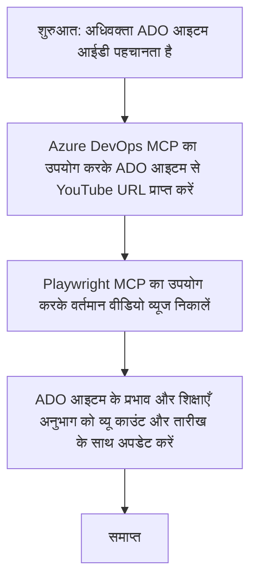

# केस स्टडी: MCP के साथ YouTube डेटा से Azure DevOps आइटम अपडेट करना

> **डिस्क्लेमर:** ऑनलाइन प्लेटफार्मों जैसे YouTube से डेटा के साथ Azure DevOps आइटम अपडेट करने की प्रक्रिया को स्वचालित करने वाले मौजूदा ऑनलाइन टूल और रिपोर्ट्स उपलब्ध हैं। निम्न दृश्य केवल एक नमूना उपयोग मामला प्रस्तुत करने के लिए दिया गया है ताकि यह दिखाया जा सके कि MCP टूल्स का स्वचालन और एकीकरण कार्यों के लिए कैसे उपयोग किया जा सकता है।

## अवलोकन

यह केस स्टडी एक उदाहरण प्रस्तुत करती है कि मॉडल संदर्भ प्रोटोकॉल (MCP) और इसके टूल्स का उपयोग ऑनलाइन प्लेटफार्मों, जैसे YouTube से प्राप्त जानकारी के साथ Azure DevOps (ADO) वर्क आइटम अपडेट करने की प्रक्रिया को स्वचालित करने के लिए कैसे किया जा सकता है। वर्णित परिदृश्य इन टूल्स की व्यापक क्षमताओं का केवल एक उदाहरण है, जिसे कई समान स्वचालन आवश्यकताओं के लिए अनुकूलित किया जा सकता है।

इस उदाहरण में, एक एडवोकेट ऑनलाइन सत्रों को ADO आइटम की मदद से ट्रैक करता है, जहाँ प्रत्येक आइटम में YouTube वीडियो URL होता है। MCP टूल्स का उपयोग करके, एडवोकेट ADO आइटम्स को नवीनतम वीडियो मेट्रिक्स जैसे व्यू काउंट के साथ पुनरावृत्ति योग्य और स्वचालित तरीके से अद्यतित रख सकता है। यह तरीका अन्य उपयोग मामलों में भी सामान्यीकृत किया जा सकता है जहाँ ऑनलाइन स्रोतों से जानकारी ADO या अन्य सिस्टमों में सम्मिलित करने की आवश्यकता होती है।

## परिदृश्य

एक एडवोकेट ऑनलाइन सत्रों और समुदाय की सहभागिता के प्रभाव को ट्रैक करने के लिए उत्तरदायी है। प्रत्येक सत्र को 'DevRel' प्रोजेक्ट में ADO वर्क आइटम के रूप में लॉग किया जाता है, और वर्क आइटम में YouTube वीडियो URL के लिए एक फ़ील्ड होता है। सत्र की पहुंच की सही रिपोर्टिंग के लिए, एडवोकेट को ADO आइटम को वर्तमान वीडियो व्यूज की संख्या और जब यह जानकारी प्राप्त हुई थी, उस तारीख के साथ अपडेट करना होता है।

## उपयोग किए गए टूल्स

- [Azure DevOps MCP](https://github.com/microsoft/azure-devops-mcp): MCP के माध्यम से ADO वर्क आइटम्स तक प्रोग्रामेटिक पहुंच और अपडेट सक्षम करता है।
- [Playwright MCP](https://github.com/microsoft/playwright-mcp): ब्राउज़र क्रियाओं को स्वचालित करके वेब पेजों से लाइव डेटा निकालता है, जैसे YouTube वीडियो के आँकड़े।

## स्टेप-बाय-स्टेप वर्कफ़्लो

1. **ADO आइटम की पहचान करें**: 'DevRel' प्रोजेक्ट में ADO वर्क आइटम आईडी (जैसे 1234) के साथ शुरुआत करें।
2. **YouTube URL निकालें**: Azure DevOps MCP टूल का उपयोग करके वर्क आइटम से YouTube URL प्राप्त करें।
3. **वीडियो व्यूज निकालें**: Playwright MCP टूल का उपयोग करके YouTube URL पर जाएं और वर्तमान व्यू काउंट निकालें।
4. **ADO आइटम अपडेट करें**: नवीनतम व्यू काउंट और प्राप्ति की तारीख को Azure DevOps MCP टूल का उपयोग करते हुए ADO वर्क आइटम के 'Impact and Learnings' सेक्शन में लिखें।

## उदाहरण प्रॉम्प्ट

```bash
- Work with the ADO Item ID: 1234
- The project is '2025-Awesome'
- Get the YouTube URL for the ADO item
- Use Playwright to get the current views from the YouTube video
- Update the ADO item with the current video views and the updated date of the information
```

## मर्मेड फ़्लोचार्ट


## तकनीकी कार्यान्वयन

- **MCP ऑर्केस्ट्रेशन**: वर्कफ़्लो एक MCP सर्वर द्वारा संचालित होता है, जो Azure DevOps MCP और Playwright MCP टूल्स के उपयोग का समन्वय करता है।
- **स्वचालन**: प्रक्रिया मैन्युअल रूप से ट्रिगर की जा सकती है या नियमित अंतराल पर चलाने के लिए अनुसूचित की जा सकती है ताकि ADO आइटम्स अद्यतित रहें।
- **विस्तारणीयता**: इसी पैटर्न का विस्तार अन्य ऑनलाइन मेट्रिक्स (जैसे लाइक, टिप्पणियाँ) या अन्य प्लेटफार्मों से ADO आइटम्स अपडेट करने के लिए किया जा सकता है।

## परिणाम और प्रभाव

- **कुशलता**: वीडियो मेट्रिक्स की प्राप्ति और अपडेटिंग प्रक्रिया को स्वचालित करके एडवोकेट्स के मैन्युअल प्रयास को कम करता है।
- **सटीकता**: सुनिश्चित करता है कि ADO आइटम ऑनलाइन स्रोतों से उपलब्ध सबसे ताज़ा डेटा को दर्शाएँ।
- **पुनरावृत्तीयता**: अन्य डेटा स्रोतों या मेट्रिक्स वाले समान परिदृश्यों के लिए पुन: प्रयोज्य वर्कफ़्लो प्रदान करता है।

## संदर्भ

- [Azure DevOps MCP](https://github.com/microsoft/azure-devops-mcp)
- [Playwright MCP](https://github.com/microsoft/playwright-mcp)
- [Model Context Protocol (MCP)](https://modelcontextprotocol.io/)

## आगे क्या

- वापस जाएं: [Case Studies Overview](./README.md)
- अगला: [Real-Time Documentation Retrieval with MCP](./docs-mcp/README.md)

---

<!-- CO-OP TRANSLATOR DISCLAIMER START -->
**अस्वीकरण**:  
इस दस्तावेज़ का अनुवाद AI अनुवाद सेवा [Co-op Translator](https://github.com/Azure/co-op-translator) का उपयोग करके किया गया है। जबकि हम सटीकता के लिए प्रयासरत हैं, कृपया ध्यान दें कि स्वचालित अनुवाद में त्रुटियाँ या गलतियां हो सकती हैं। मूल भाषा में मौलिक दस्तावेज़ को आधिकारिक स्रोत माना जाना चाहिए। महत्वपूर्ण जानकारी के लिए, प्रोफेशनल मानव अनुवाद की सिफारिश की जाती है। इस अनुवाद के उपयोग से होने वाली किसी भी गलतफहमी या गलत व्याख्या के लिए हम जिम्मेदार नहीं हैं।
<!-- CO-OP TRANSLATOR DISCLAIMER END -->