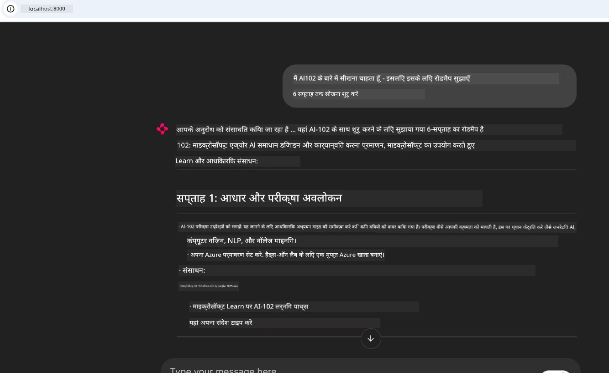
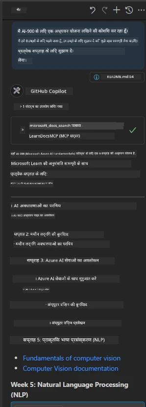

# केस स्टडी: क्लाइंट से Microsoft Learn Docs MCP सर्वर से कनेक्ट करना

क्या आपने कभी खुद को दस्तावेज़ साइटों, Stack Overflow, और अंतहीन सर्च इंजन टैब के बीच झूझते हुए पाया है, जब आप अपने कोड में कोई समस्या हल करने की कोशिश कर रहे होते हैं? शायद आपके पास डॉक्यूमेंट्स के लिए एक दूसरा मॉनिटर होता है, या आप लगातार अपने IDE और ब्राउज़र के बीच Alt-Tab करते रहते हैं। क्या बेहतर नहीं होगा अगर आप दस्तावेज़ सामग्री को सीधे अपने वर्कफ़्लो में ला सकें — अपने ऐप्स, अपने IDE, या यहां तक कि अपनी कस्टम टूल्स में एकीकृत करके? इस केस स्टडी में, हम ठीक यही करेंगे — Microsoft Learn Docs MCP सर्वर से सीधे अपने क्लाइंट एप्लिकेशन से कनेक्ट होंगे।

## अवलोकन

आधुनिक विकास केवल कोड लिखने से ज्यादा है — यह सही समय पर सही जानकारी खोजने के बारे में है। दस्तावेज़ हर जगह मौजूद हैं, लेकिन वे शायद ही कभी वहां होते हैं जहां आपको सबसे ज्यादा ज़रूरत होती है: आपके टूल्स और वर्कफ़्लो के अंदर। दस्तावेज़ पुनःप्राप्ति को सीधे अपने अनुप्रयोगों में एकीकृत करके, आप समय बचा सकते हैं, संदर्भ स्विचिंग कम कर सकते हैं, और उत्पादकता बढ़ा सकते हैं। इस खंड में, हम आपको दिखाएंगे कि कैसे एक क्लाइंट को Microsoft Learn Docs MCP सर्वर से जोड़ें, ताकि आप बिना अपने ऐप छोड़े, वास्तविक समय और संदर्भ-सूचित दस्तावेज़ सामग्री तक पहुंच सकें।

हम कनेक्शन स्थापित करने, अनुरोध भेजने, और स्ट्रीमिंग प्रतिक्रियाओं को कुशलतापूर्वक संभालने की प्रक्रिया से गुजरेंगे। यह तरीका न केवल आपके वर्कफ़्लो को सरल बनाता है बल्कि अधिक स्मार्ट, उपयोगी डेवलपर टूल्स बनाने के द्वार भी खोलता है।

## सीखने के उद्देश्य

हम ऐसा क्यों कर रहे हैं? क्योंकि सबसे अच्छे डेवलपर अनुभव वे होते हैं जो अवरोधों को खत्म कर देते हैं। कल्पना कीजिए एक ऐसी दुनिया जहां आपका कोड एडिटर, चैटबोट, या वेब ऐप आपकी दस्तावेज़ संबंधी प्रश्नों का तुरंत उत्तर दे सके, Microsoft Learn की नवीनतम सामग्री का उपयोग करके। इस अध्याय के अंत तक, आप यह जान पाएंगे कि कैसे:

- दस्तावेज़ के लिए MCP सर्वर-क्लाइंट संचार की मूल बातें समझें
- Microsoft Learn Docs MCP सर्वर से कनेक्ट करने के लिए एक कंसोल या वेब एप्लिकेशन लागू करें
- वास्तविक समय दस्तावेज़ पुनःप्राप्ति के लिए स्ट्रीमिंग HTTP क्लाइंट्स का उपयोग करें
- अपने एप्लिकेशन में दस्तावेज़ प्रतिक्रियाओं को लॉग और व्याख्या करें

आप देखेंगे कि ये कौशल कैसे आपको ऐसे टूल बनाने में मदद करते हैं जो केवल प्रतिक्रियाशील नहीं बल्कि वास्तव में इंटरैक्टिव और संदर्भ-सूचित होते हैं।

## परिदृश्य 1 - MCP के साथ वास्तविक समय दस्तावेज़ पुनःप्राप्ति

इस परिदृश्य में, हम आपको दिखाएंगे कि कैसे एक क्लाइंट को Microsoft Learn Docs MCP सर्वर से जोड़कर, आप बिना अपने ऐप छोड़े, वास्तविक समय और संदर्भ-सूचित दस्तावेज़ सामग्री तक पहुंच सकते हैं।

आइए इसे व्यावहारिक रूप में करें। आपका कार्य है एक ऐसा ऐप लिखना जो Microsoft Learn Docs MCP सर्वर से जुड़े, `microsoft_docs_search` टूल को कॉल करे, और स्ट्रीमिंग प्रतिक्रिया को कंसोल पर लॉग करे।

### यह तरीका क्यों?
क्योंकि यह अधिक उन्नत इंटीग्रेशन बनाने की नींव है—चाहे आप एक चैटबोट, IDE एक्सटेंशन, या वेब डैशबोर्ड पावर करना चाहते हों।

आपको इस परिदृश्य का कोड और निर्देश इस केस स्टडी के [`solution`](./solution/README.md) फ़ोल्डर में मिलेंगे। ये कदम आपको कनेक्शन सेट अप करने में मार्गदर्शन देंगे:
- कनेक्शन के लिए आधिकारिक MCP SDK और स्ट्रीमेबल HTTP क्लाइंट का उपयोग करें
- दस्तावेज़ पुनःप्राप्ति के लिए क्वेरी पैरामीटर के साथ `microsoft_docs_search` टूल को कॉल करें
- उचित लॉगिंग और एरर हैंडलिंग लागू करें
- कई खोज क्वेरी दर्ज करने के लिए एक इंटरैक्टिव कंसोल इंटरफ़ेस बनाएं

यह परिदृश्य दिखाता है कि कैसे:
- Docs MCP सर्वर से कनेक्ट करें
- एक क्वेरी भेजें
- परिणामों का पार्स करें और प्रिंट करें

यहाँ समाधान चलाने का एक उदाहरण है:

```
Prompt> What is Azure Key Vault?
Answer> Azure Key Vault is a cloud service for securely storing and accessing secrets. ...
```

नीचे एक न्यूनतम नमूना समाधान है। पूरा कोड और विवरण समाधान फ़ोल्डर में उपलब्ध हैं।

<details>
<summary>Python</summary>

```python
import asyncio
from mcp.client.streamable_http import streamablehttp_client
from mcp import ClientSession

async def main():
    async with streamablehttp_client("https://learn.microsoft.com/api/mcp") as (read_stream, write_stream, _):
        async with ClientSession(read_stream, write_stream) as session:
            await session.initialize()
            result = await session.call_tool("microsoft_docs_search", {"query": "Azure Functions best practices"})
            print(result.content)

if __name__ == "__main__":
    asyncio.run(main())
```

- पूर्ण कार्यान्वयन और लॉगिंग के लिए, [`scenario1.py`](../../../../09-CaseStudy/docs-mcp/solution/python/scenario1.py) देखें।
- स्थापना और उपयोग निर्देशों के लिए, उसी फ़ोल्डर में [`README.md`](./solution/python/README.md) फ़ाइल देखें।
</details>


## परिदृश्य 2 - MCP के साथ इंटरैक्टिव स्टडी प्लान जनरेटर वेब ऐप

इस परिदृश्य में, आप सीखेंगे कि Docs MCP को वेब विकास परियोजना में कैसे एकीकृत किया जाए। उद्देश्य है उपयोगकर्ताओं को Microsoft Learn दस्तावेज़ को सीधे वेब इंटरफ़ेस से खोजने के लिए सक्षम बनाना, जिससे दस्तावेज़ सामग्री तुरंत आपके ऐप या वेबसाइट के भीतर सुलभ हो।

आप जानेंगे कि कैसे:
- एक वेब ऐप सेट अप करें
- Docs MCP सर्वर से कनेक्ट करें
- उपयोगकर्ता इनपुट को संभालें और परिणाम प्रदर्शित करें

यहाँ समाधान चलाने का एक उदाहरण है:

```
User> I want to learn about AI102 - so suggest the roadmap to get it started from learn for 6 weeks

Assistant> Here’s a detailed 6-week roadmap to start your preparation for the AI-102: Designing and Implementing a Microsoft Azure AI Solution certification, using official Microsoft resources and focusing on exam skills areas:

---
## Week 1: Introduction & Fundamentals
- **Understand the Exam**: Review the [AI-102 exam skills outline](https://learn.microsoft.com/en-us/credentials/certifications/exams/ai-102/).
- **Set up Azure**: Sign up for a free Azure account if you don't have one.
- **Learning Path**: [Introduction to Azure AI services](https://learn.microsoft.com/en-us/training/modules/intro-to-azure-ai/)
- **Focus**: Get familiar with Azure portal, AI capabilities, and necessary tools.

....more weeks of the roadmap...

Let me know if you want module-specific recommendations or need more customized weekly tasks!
```

नीचे एक न्यूनतम नमूना समाधान है। पूरा कोड और विवरण समाधान फ़ोल्डर में उपलब्ध हैं।



<details>
<summary>Python (Chainlit)</summary>

Chainlit एक फ्रेमवर्क है संवादात्मक AI वेब ऐप बनाने के लिए। यह आपको इंटरैक्टिव चैटबोट और असिस्टेंट बनाने में मदद करता है जो MCP टूल्स को कॉल कर सकते हैं और वास्तविक समय में परिणाम दिखा सकते हैं। यह त्वरित प्रोटोटाइपिंग और उपयोगकर्ता-अनुकूल इंटरफेस के लिए आदर्श है।

```python
import chainlit as cl
import requests

MCP_URL = "https://learn.microsoft.com/api/mcp"

@cl.on_message
def handle_message(message):
    query = {"question": message}
    response = requests.post(MCP_URL, json=query)
    if response.ok:
        result = response.json()
        cl.Message(content=result.get("answer", "No answer found.")).send()
    else:
        cl.Message(content="Error: " + response.text).send()
```

- पूर्ण कार्यान्वयन के लिए, [`scenario2.py`](../../../../09-CaseStudy/docs-mcp/solution/python/scenario2.py) देखें।
- सेटअप और चलाने के निर्देश के लिए, [`README.md`](./solution/python/README.md) देखें।
</details>


## परिदृश्य 3: VS Code में MCP सर्वर के साथ इन-एडिटर डॉक्यूमेंटेशन

यदि आप Microsoft Learn Docs को सीधे VS Code के अंदर प्राप्त करना चाहते हैं (ब्राउज़र टैब स्विच किए बिना), तो आप अपने एडिटर में MCP सर्वर का उपयोग कर सकते हैं। यह आपको सक्षम करता है:
- VS Code में कोडिंग वातावरण छोड़ने के बिना दस्तावेज़ खोजने और पढ़ने के लिए।
- सीधे अपने README या कोर्स फाइलों में संदर्भित दस्तावेज़ सामग्री और लिंक सम्मिलित करने के लिए।
- GitHub Copilot और MCP को एक साथ उपयोग करने के लिए एक सहज, AI-संचालित दस्तावेज़ वर्कफ़्लो के लिए।

**आप देखेंगे कि कैसे:**
- अपने वर्कस्पेस रूट में एक वैध `.vscode/mcp.json` फ़ाइल जोड़ें (नीचे उदाहरण देखें)।
- MCP पैनल खोलें या VS Code में कमांड पैलेट का उपयोग करके दस्तावेज़ खोजें और सम्मिलित करें।
- जैसे ही आप काम कर रहे हों, सीधे अपने मार्कडाउन फाइलों में दस्तावेज़ संदर्भ जोड़ें।
- यह वर्कफ़्लो GitHub Copilot के साथ जोड़कर और भी अधिक उत्पादकता हासिल करें।

यहाँ MCP सर्वर को VS Code में सेट अप करने का एक उदाहरण है:

```json
{
  "servers": {
    "LearnDocsMCP": {
      "url": "https://learn.microsoft.com/api/mcp"
    }
  }
}
```

</details>

> चित्रों और चरण-दर-चरण मार्गदर्शिका के साथ विस्तृत वॉकथ्रू के लिए, [`README.md`](./solution/scenario3/README.md) देखें।



यह तरीका उन सभी के लिए आदर्श है जो तकनीकी कोर्स बना रहे हों, दस्तावेज़ीकरण लिख रहे हों, या बार-बार संदर्भ की आवश्यकता वाले कोड का विकास कर रहे हों।

## मुख्य निष्कर्ष

दस्तावेज़ सामग्री को सीधे अपने टूल्स में जोड़ना केवल एक सुविधा नहीं है—यह उत्पादकता के लिए एक गेम चेंजर है। अपने क्लाइंट से Microsoft Learn Docs MCP सर्वर से जुड़कर, आप:

- अपने कोड और दस्तावेज़ के बीच संदर्भ स्विचिंग को समाप्त करें
- वास्तविक समय में अद्यतित, संदर्भ-सूचित दस्तावेज़ प्राप्त करें
- स्मार्ट, अधिक इंटरैक्टिव डेवलपर टूल्स बनाएं

ये कौशल आपको ऐसे समाधान बनाने में मदद करेंगे जो न केवल प्रभावी हैं, बल्कि उपयोग में आनंददायक भी हैं।

## अतिरिक्त संसाधन

अपनी समझ को गहरा करने के लिए, इन आधिकारिक संसाधनों का अन्वेषण करें:

- [Microsoft Learn Docs MCP Server (GitHub)](https://github.com/MicrosoftDocs/mcp)
- [Azure MCP Server (mcp-python) के साथ शुरुआत करें](https://learn.microsoft.com/en-us/azure/developer/azure-mcp-server/get-started#create-the-python-app)
- [Azure MCP Server क्या है?](https://learn.microsoft.com/en-us/azure/developer/azure-mcp-server/)
- [मॉडल कंटेक्स्ट प्रोटोकॉल (MCP) परिचय](https://modelcontextprotocol.io/introduction)
- [MCP सर्वर से प्लगइन्स जोड़ें (Python)](https://learn.microsoft.com/en-us/semantic-kernel/concepts/plugins/adding-mcp-plugins)

## आगे क्या है

- वापस जाएं: [केस स्टडीज अवलोकन](../README.md)
- जारी रखें: [मॉड्यूल 10: AI टूलकिट के साथ AI वर्कफ़्लो को सरल बनाना](../../10-StreamliningAIWorkflowsBuildingAnMCPServerWithAIToolkit/README.md)

---

<!-- CO-OP TRANSLATOR DISCLAIMER START -->
**अस्वीकरण**:
इस दस्तावेज़ का अनुवाद AI अनुवाद सेवा [Co-op Translator](https://github.com/Azure/co-op-translator) का उपयोग करके किया गया है। हालांकि हम सटीकता के लिए प्रयासरत हैं, कृपया ध्यान दें कि स्वतः अनुवाद में त्रुटियाँ या असंगतियाँ हो सकती हैं। मूल भाषाशैली में उपलब्ध दस्तावेज़ को प्रामाणिक स्रोत माना जाना चाहिए। महत्वपूर्ण जानकारी के लिए पेशेवर मानव अनुवाद की सलाह दी जाती है। इस अनुवाद के उपयोग से उत्पन्न किसी भी गलतफहमी या गलत व्याख्या के लिए हम जिम्मेदार नहीं हैं।
<!-- CO-OP TRANSLATOR DISCLAIMER END -->