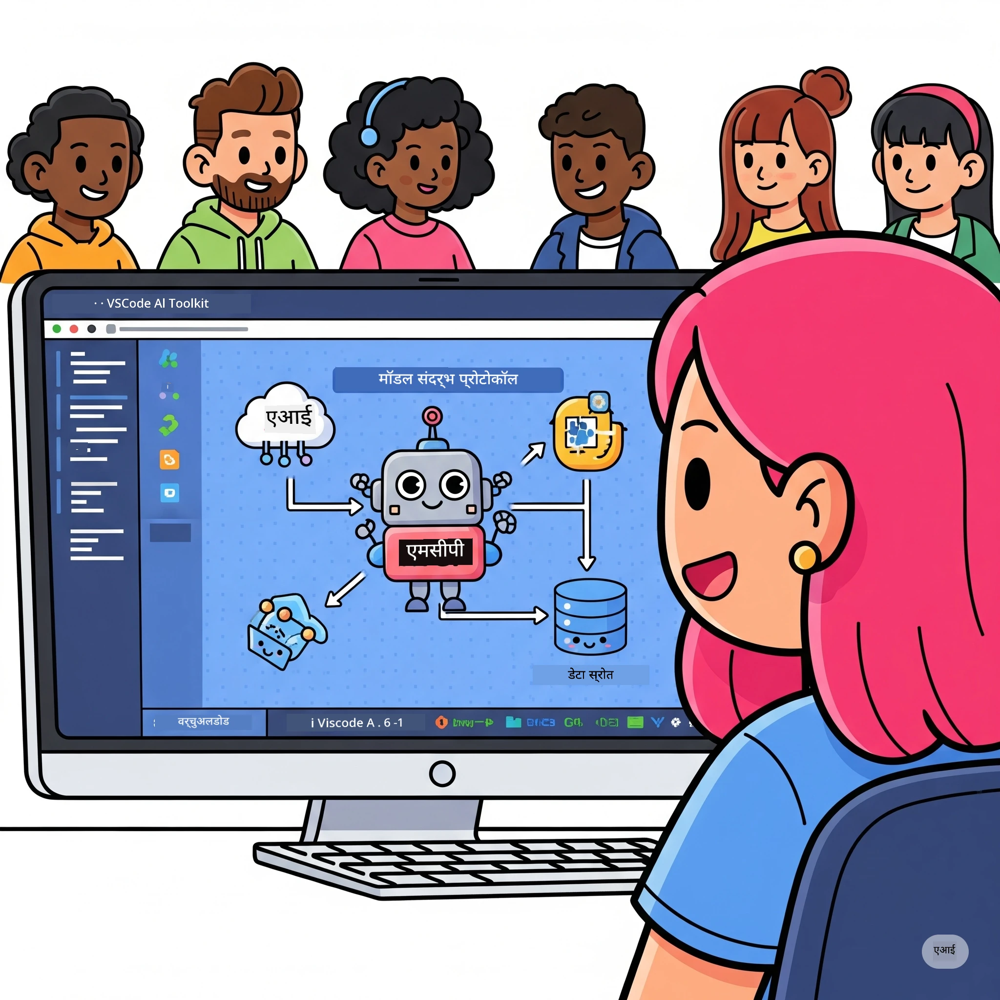
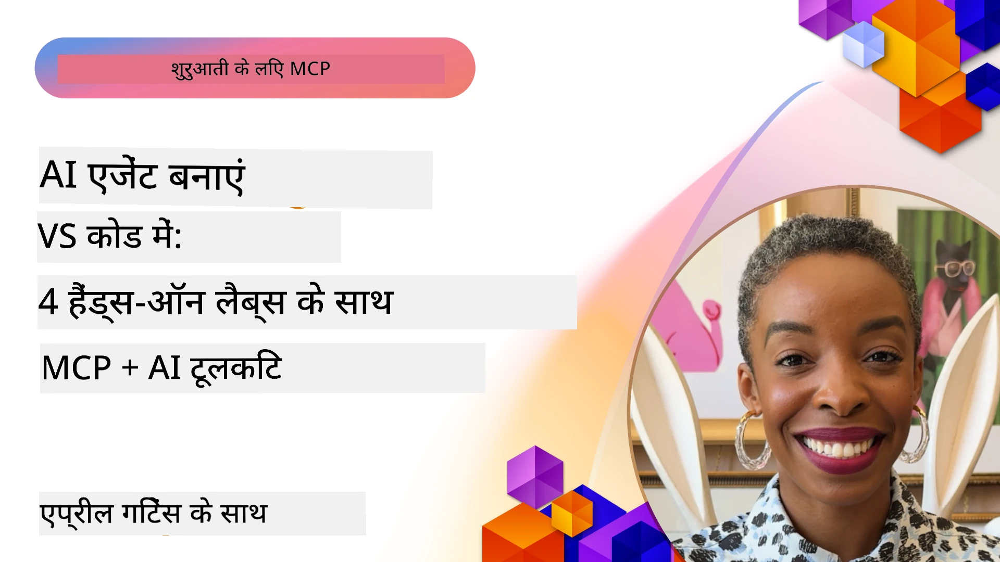

# AI वर्कफ़्लोज़ को सरल बनाना: AI टूलकिट के साथ एक MCP सर्वर बनाना

## 🎯 अवलोकन

_(इस पाठ का वीडियो देखने के लिए ऊपर की छवि पर क्लिक करें)_

**मॉडल कॉन्टेक्स्ट प्रोटोकॉल (MCP) वर्कशॉप** में आपका स्वागत है! यह व्यापक व्यावहारिक कार्यशाला दो अत्याधुनिक तकनीकों को मिलाकर AI एप्लिकेशन विकास में क्रांति लाती है:

- **🔗 मॉडल कॉन्टेक्स्ट प्रोटोकॉल (MCP)**: AI-टूल इंटीग्रेशन के लिए एक ओपन स्टैंडर्ड
- **🛠️ AI टूलकिट फॉर विजुअल स्टूडियो कोड (AITK)**: Microsoft का शक्तिशाली AI विकास विस्तार

### 🎓 आप क्या सीखेंगे

इस वर्कशॉप के अंत तक, आप बुद्धिमान एप्लिकेशन बनाने की कला में महारत हासिल कर लेंगे जो AI मॉडल को वास्तविक दुनिया के टूल और सेवाओं से जोड़ते हैं। स्वचालित परीक्षण से लेकर कस्टम API इंटीग्रेशन तक, आप जटिल व्यावसायिक चुनौतियों को हल करने के लिए व्यावहारिक कौशल प्राप्त करेंगे।

## 🏗️ प्रौद्योगिकी स्टैक

### 🔌 मॉडल कॉन्टेक्स्ट प्रोटोकॉल (MCP)

MCP **"AI के लिए USB-C"** है - एक सार्वभौमिक स्टैंडर्ड जो AI मॉडल्स को बाहरी टूल्स और डेटा स्रोतों से जोड़ता है।

**✨ मुख्य विशेषताएं:**

- 🔄 **मानकीकृत इंटीग्रेशन**: AI-टूल कनेक्शन के लिए सार्वभौमिक इंटरफ़ेस
- 🏛️ **लचीली वास्तुकला**: stdio/SSE ट्रांसपोर्ट के माध्यम से स्थानीय और रिमोट सर्वर
- 🧰 **समृद्ध पारिस्थितिकी तंत्र**: एक प्रोटोकॉल में टूल्स, प्रॉम्प्ट्स और संसाधन
- 🔒 **एंटरप्राइज-तैयार**: अंतर्निहित सुरक्षा और विश्वसनीयता

**🎯 MCP क्यों महत्वपूर्ण है:**
जैसे USB-C ने केबल की जटिलता दूर की, वैसे ही MCP AI इंटीग्रेशन की जटिलताओं को समाप्त करता है। एक प्रोटोकॉल, अनंत संभावनाएं।

### 🤖 AI टूलकिट फॉर विजुअल स्टूडियो कोड (AITK)

माइक्रोसॉफ्ट का प्रमुख AI विकास विस्तार जो VS Code को AI पावरहाउस में बदल देता है।

**🚀 मुख्य क्षमताएं:**

- 📦 **मॉडल कैटलॉग**: Azure AI, GitHub, Hugging Face, Ollama से मॉडल्स का एक्सेस
- ⚡ **स्थानीय पूर्वानुमान**: ONNX-अनुकूलित CPU/GPU/NPU एक्सीक्यूशन
- 🏗️ **एजेंट बिल्डर**: MCP इंटीग्रेशन के साथ विजुअल AI एजेंट विकास
- 🎭 **मल्टी-मोडल**: टेक्स्ट, विज़न, और संरचित आउटपुट सपोर्ट

**💡 विकास लाभ:**

- ज़ीरो-कॉन्फ़िग मॉडल तैनाती
- विजुअल प्रॉम्प्ट इंजीनियरिंग
- वास्तविक समय परीक्षण प्लेग्राउंड
- सहज MCP सर्वर इंटीग्रेशन

## 📚 सीखने की यात्रा

### [🚀 मॉड्यूल 1: AI टूलकिट फंडामेंटल्स](./lab1/README.md)

**समय**: 15 मिनट

- 🛠️ VS Code के लिए AI टूलकिट स्थापित और कॉन्फ़िगर करें
- 🗂️ मॉडल कैटलॉग का पता लगाएं (100+ मॉडल GitHub, ONNX, OpenAI, Anthropic, Google से)
- 🎮 रियल-टाइम मॉडल परीक्षण के लिए इंटरैक्टिव प्लेग्राउंड में महारत हासिल करें
- 🤖 एजेंट बिल्डर से अपना पहला AI एजेंट बनाएं
- 📊 अंतर्निर्मित मेट्रिक्स (F1, प्रासंगिकता, समानता, सुसंगतता) के साथ मॉडल प्रदर्शन का मूल्यांकन करें
- ⚡ बैच प्रोसेसिंग और मल्टी-मोडल सपोर्ट की क्षमताएँ सीखें

**🎯 सीखने का नतीजा**: AITK क्षमताओं की व्यापक समझ के साथ एक कार्यात्मक AI एजेंट बनाना

### [🌐 मॉड्यूल 2: MCP के साथ AI टूलकिट फंडामेंटल्स](./lab2/README.md)

**समय**: 20 मिनट

- 🧠 मॉडल कॉन्टेक्स्ट प्रोटोकॉल (MCP) वास्तुकला और अवधारणाओं में महारत हासिल करें
- 🌐 माइक्रोसॉफ्ट के MCP सर्वर पारिस्थितिकी तंत्र का अन्वेषण करें
- 🤖 Playwright MCP सर्वर का उपयोग करके ब्राउज़र ऑटोमेशन एजेंट बनाएं
- 🔧 MCP सर्वरों को AI टूलकिट एजेंट बिल्डर के साथ एकीकृत करें
- 📊 अपने एजेंट्स में MCP टूल्स को कॉन्फ़िगर और टेस्ट करें
- 🚀 MCP-संचालित एजेंट्स को निर्यात और उत्पादन उपयोग के लिए तैनात करें

**🎯 सीखने का नतीजा**: बाहरी टूल्स के साथ सुपरचार्ज्ड AI एजेंट तैनात करें जो MCP के माध्यम से हो

### [🔧 मॉड्यूल 3: AI टूलकिट के साथ उन्नत MCP विकास](./lab3/README.md)

**समय**: 20 मिनट

- 💻 AI टूलकिट का उपयोग करके कस्टम MCP सर्वर बनाएं
- 🐍 नवीनतम MCP Python SDK (v1.9.3) को कॉन्फ़िगर और उपयोग करें
- 🔍 डिबगिंग के लिए MCP इंस्पेक्टर सेट करें और उपयोग करें
- 🛠️ व्यावसायिक डिबगिंग वर्कफ़्लोज़ के साथ एक वेदर MCP सर्वर बनाएं
- 🧪 एजेंट बिल्डर और इंस्पेक्टर दोनों वातावरणों में MCP सर्वरों का डिबग करें

**🎯 सीखने का नतीजा**: आधुनिक उपकरणों के साथ कस्टम MCP सर्वर विकसित और डिबग करें

### [🐙 मॉड्यूल 4: व्यावहारिक MCP विकास - कस्टम GitHub क्लोन सर्वर](./lab4/README.md)

**समय**: 30 मिनट

- 🏗️ विकास वर्कफ़्लोज़ के लिए एक वास्तविक GitHub क्लोन MCP सर्वर बनाएं
- 🔄 सत्यापन और त्रुटि हैंडलिंग के साथ स्मार्ट रिपॉजिटरी क्लोनिंग लागू करें
- 📁 बुद्धिमान डिरेक्टरी प्रबंधन और VS Code इंटीग्रेशन बनाएं
- 🤖 कस्टम MCP टूल्स के साथ GitHub Copilot एजेंट मोड का उपयोग करें
- 🛡️ उत्पादन-तैयार विश्वसनीयता और क्रॉस-प्लेटफ़ॉर्म संगतता लागू करें

**🎯 सीखने का नतीजा**: एक उत्पादन-तैयार MCP सर्वर तैनात करें जो वास्तविक विकास वर्कफ़्लोज़ को सरल बनाता है

## 💡 वास्तविक दुनिया के अनुप्रयोग और प्रभाव

### 🏢 एंटरप्राइज उपयोग मामलों

#### 🔄 DevOps ऑटोमेशन

बुद्धिमान ऑटोमेशन के साथ अपने विकास वर्कफ़्लो को बदलें:

- **स्मार्ट रिपॉजिटरी प्रबंधन**: AI-चालित कोड समीक्षा और मर्ज निर्णय
- **बुद्धिमान CI/CD**: कोड परिवर्तन के आधार पर स्वचालित पाइपलाइन अनुकूलन
- **इश्यू ट्रायज**: स्वत: बग वर्गीकरण और असाइनमेंट

#### 🧪 गुणवत्ता आश्वासन में क्रांति

AI-संचालित ऑटोमेशन के साथ परीक्षण को बेहतर बनाएं:

- **बुद्धिमान परीक्षण निर्माण**: स्वचालित रूप से व्यापक परीक्षण सूट बनाएँ
- **विज़ुअल रिग्रेशन टेस्टिंग**: AI-संचालित UI परिवर्तन पहचान
- **प्रदर्शन निगरानी**: सक्रिय समस्या पहचान और समाधान

#### 📊 डेटा पाइपलाइन बुद्धिमत्ता

स्मार्ट डेटा प्रोसेसिंग वर्कफ़्लोज़ बनाएं:

- **अनुकूलनीय ETL प्रक्रियाएं**: स्व-प्रगतिशील डेटा रूपांतरण
- **अनोमली डिटेक्शन**: वास्तविक समय डेटा गुणवत्ता निगरानी
- **बुद्धिमान रुटिंग**: स्मार्ट डेटा फ्लो प्रबंधन

#### 🎧 ग्राहक अनुभव में सुधार

उत्कृष्ट ग्राहक इंटरैक्शन बनाएं:

- **संदर्भ-सजग समर्थन**: ग्राहक इतिहास तक पहुँच वाले AI एजेंट
- **निष्क्रिय समस्या समाधान**: पूर्वानुमान आधारित ग्राहक सेवा
- **मल्टी-चैनल इंटीग्रेशन**: प्लेटफ़ॉर्मों में एकीकृत AI अनुभव

## 🛠️ पूर्वापेक्षाएँ और सेटअप

### 💻 सिस्टम आवश्यकताएँ

| घटक | आवश्यकता | नोट्स |
|-----------|-------------|-------|
| **ऑपरेटिंग सिस्टम** | Windows 10+, macOS 10.15+, Linux | कोई भी आधुनिक OS |
| **विजुअल स्टूडियो कोड** | नवीनतम स्थिर संस्करण | AITK के लिए आवश्यक |
| **Node.js** | v18.0+ और npm | MCP सर्वर विकास के लिए |
| **Python** | 3.10+ | Python MCP सर्वरों के लिए वैकल्पिक |
| **मेमोरी** | न्यूनतम 8GB RAM | स्थानीय मॉडल के लिए 16GB अनुशंसित |

### 🔧 विकास पर्यावरण

#### अनुशंसित VS Code एक्सटेंशंस

- **AI टूलकिट** (ms-windows-ai-studio.windows-ai-studio)
- **Python** (ms-python.python)
- **Python Debugger** (ms-python.debugpy)
- **GitHub Copilot** (GitHub.copilot) - वैकल्पिक लेकिन सहायक

#### वैकल्पिक टूल्स

- **uv**: आधुनिक Python पैकेज प्रबंधक
- **MCP इंस्पेक्टर**: MCP सर्वरों के लिए विजुअल डिबगिंग टूल
- **Playwright**: वेब ऑटोमेशन उदाहरणों के लिए

## 🎖️ सीखने के परिणाम और प्रमाणन मार्ग

### 🏆 कौशल मास्टरी चेकलिस्ट

इस वर्कशॉप को पूरा करके, आप निम्न में महारत हासिल करेंगे:

#### 🎯 मुख्य कौशल

- [ ] **MCP प्रोटोकॉल मास्टरी**: वास्तुकला और कार्यान्वयन पैटर्न की गहरी समझ
- [ ] **AITK दक्षता**: AI टूलकिट का विशेषज्ञ स्तर पर उपयोग
- [ ] **कस्टम सर्वर विकास**: उत्पादन MCP सर्वरों का निर्माण, तैनाती और रखरखाव
- [ ] **टूल इंटीग्रेशन उत्कृष्टता**: AI को मौजूदा विकास वर्कफ़्लोज़ के साथ सहज रूप से जोड़ना
- [ ] **समस्या-समाधान अनुप्रयोग**: सीखे गए कौशल को वास्तविक व्यावसायिक चुनौतियों में लागू करना

#### 🔧 तकनीकी कौशल

- [ ] VS Code में AI टूलकिट सेटअप और कॉन्फ़िगर करना
- [ ] कस्टम MCP सर्वरों का डिजाइन और कार्यान्वयन
- [ ] GitHub मॉडल्स को MCP वास्तुकला के साथ इंटीग्रेट करना
- [ ] Playwright के साथ स्वचालित परीक्षण वर्कफ़्लोज़ बनाना
- [ ] उत्पादन उपयोग के लिए AI एजेंट तैनात करना
- [ ] MCP सर्वर प्रदर्शन का डिबग और अनुकूलन करना

#### 🚀 उन्नत क्षमताएं

- [ ] एंटरप्राइज-स्केल AI इंटीग्रेशन की वास्तुकला बनाना
- [ ] AI अनुप्रयोगों के लिए सुरक्षा सर्वोत्तम प्रथाओं को लागू करना
- [ ] स्केलेबल MCP सर्वर वास्तुकला डिजाइन करना
- [ ] विशिष्ट डोमेन के लिए कस्टम टूल चेन बनाना
- [ ] AI-नेटिव विकास में दूसरों का मार्गदर्शन करना

## 📖 अतिरिक्त संसाधन

- [MCP विनिर्देशन (2025-11-25)](https://spec.modelcontextprotocol.io/specification/2025-11-25/)
- [AI टूलकिट GitHub रिपॉजिटरी](https://github.com/microsoft/vscode-ai-toolkit)
- [सैंपल MCP सर्वर्स संग्रह](https://github.com/modelcontextprotocol/servers)
- [श्रेष्ठ प्रथाएँ गाइड](https://modelcontextprotocol.io/docs/best-practices)
- [OWASP MCP शीर्ष 10](https://microsoft.github.io/mcp-azure-security-guide/mcp/) - सुरक्षा सर्वोत्तम प्रथाएँ

---

**🚀 क्या आप अपने AI विकास वर्कफ़्लो में क्रांति लाने के लिए तैयार हैं?**

आईए MCP और AI टूलकिट के साथ मिलकर बुद्धिमान एप्लिकेशन के भविष्य का निर्माण करें!

## आगे क्या है

जारी रखें: [मॉड्यूल 11: MCP सर्वर हैंड्स-ऑन लैब्स](../11-MCPServerHandsOnLabs/README.md)

---

<!-- CO-OP TRANSLATOR DISCLAIMER START -->
**अस्वीकरण**:  
यह दस्तावेज़ AI अनुवाद सेवा [Co-op Translator](https://github.com/Azure/co-op-translator) का उपयोग करके अनुवादित किया गया है। जबकि हम सटीकता के लिए प्रयासरत हैं, कृपया ध्यान दें कि स्वचालित अनुवादों में त्रुटियाँ या असंगतियाँ हो सकती हैं। मूल भाषा में मूल दस्तावेज़ को अधिकारिक स्रोत माना जाना चाहिए। महत्वपूर्ण जानकारी के लिए पेशेवर मानव अनुवाद की सिफारिश की जाती है। इस अनुवाद के उपयोग से उत्पन्न किसी भी गलतफहमी या गलत व्याख्या के लिए हम उत्तरदायी नहीं हैं।
<!-- CO-OP TRANSLATOR DISCLAIMER END -->