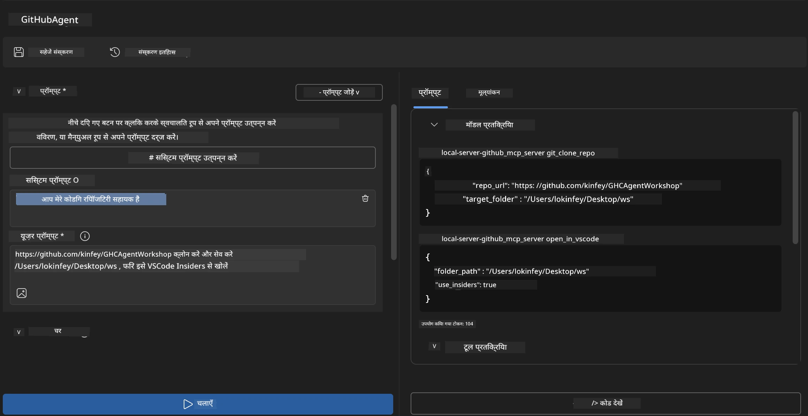
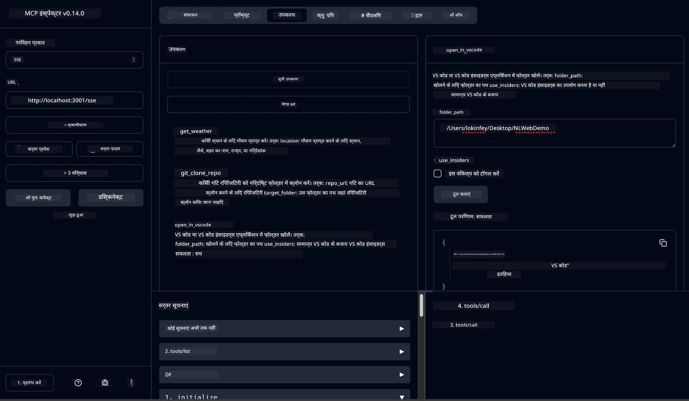

# 🐙 मॉड्यूल 4: व्यावहारिक MCP विकास - कस्टम GitHub क्लोन सर्वर


> **⚡ त्वरित शुरुआत:** केवल 30 मिनट में एक प्रोडक्शन-तैयार MCP सर्वर बनाएं जो GitHub रिपोजिटरी क्लोनिंग और VS Code इंटीग्रेशन को स्वचालित करता है!

## 🎯 सीखने के उद्देश्य

इस लैब को समाप्त करने तक, आप सक्षम होंगे:

- ✅ वास्तविक दुनिया के विकास कार्यप्रवाहों के लिए एक कस्टम MCP सर्वर बनाना
- ✅ MCP के माध्यम से GitHub रिपोजिटरी क्लोनिंग कार्यक्षमता लागू करना
- ✅ कस्टम MCP सर्वरों को VS Code और Agent Builder के साथ एकीकृत करना
- ✅ कस्टम MCP टूल्स के साथ GitHub Copilot Agent Mode का उपयोग करना
- ✅ प्रोडक्शन पर्यावरण में कस्टम MCP सर्वरों का परीक्षण और परिनियोजन करना

## 📋 पूर्व आवश्यकताएँ

- लैब 1-3 (MCP मूल बातें और उन्नत विकास) की पूर्णता
- GitHub Copilot सदस्यता ([मुफ्त साइनअप उपलब्ध](https://github.com/github-copilot/signup))
- AI Toolkit और GitHub Copilot एक्सटेंशन्स के साथ VS Code
- Git CLI इंस्टॉल और कॉन्फ़िगर किया हुआ

## 🏗️ परियोजना अवलोकन

### **वास्तविक दुनिया का विकास चुनौती**
डेवलपर्स के रूप में, हम अक्सर GitHub का उपयोग रिपोजिटरी क्लोन करने और उन्हें VS Code या VS Code Insiders में खोलने के लिए करते हैं। यह मैनुअल प्रक्रिया शामिल होती है:
1. टर्मिनल/कमांड प्रॉम्प्ट खोलना
2. इच्छित निर्देशिका में जाना
3. `git clone` कमांड चलाना
4. क्लोन की गई निर्देशिका में VS Code खोलना

**हमारा MCP समाधान इसे एक बुद्धिमान कमांड में बदल देता है!**

### **आप क्या बनाएंगे**
एक **GitHub Clone MCP Server** (`git_mcp_server`) जो प्रदान करता है:

| विशेषता | विवरण | लाभ |
|---------|-------------|---------|
| 🔄 **स्मार्ट रिपोजिटरी क्लोनिंग** | सत्यापन के साथ GitHub रिपोजिटरी क्लोन करें | स्वचालित त्रुटि जांच |
| 📁 **बुद्धिमान निर्देशिका प्रबंधन** | सुरक्षित रूप से निर्देशिकाओं की जांच और निर्माण करें | ओवरराइटिंग से बचाता है |
| 🚀 **क्रॉस-प्लेटफ़ॉर्म VS Code इंटीग्रेशन** | परियोजनाओं को VS Code/Insiders में खोलें | निर्बाध वर्कफ़्लो ट्रांजिशन |
| 🛡️ **मजबूत त्रुटि हैंडलिंग** | नेटवर्क, अनुमति, और पथ समस्याओं को संभालें | प्रोडक्शन-तैयार विश्वसनीयता |

---

## 📖 चरण-दर-चरण कार्यान्वयन

### चरण 1: Agent Builder में GitHub एजेंट बनाएं

1. AI Toolkit एक्सटेंशन के माध्यम से **Agent Builder लॉन्च करें**
2. निम्न कॉन्फ़िगरेशन के साथ **एक नया एजेंट बनाएँ:**
   ```
   Agent Name: GitHubAgent
   ```

3. **कस्टम MCP सर्वर आरंभ करें:**
   - **Tools** → **Add Tool** → **MCP Server** पर जाएं
   - चुनें **"Create A new MCP Server"**
   - अधिकतम लचीलापन के लिए **Python टेम्पलेट** चुनें
   - **सर्वर नाम:** `git_mcp_server`

### चरण 2: GitHub Copilot Agent Mode कॉन्फ़िगर करें

1. VS Code में **GitHub Copilot खोलें** (Ctrl/Cmd + Shift + P → "GitHub Copilot: Open")
2. Copilot इंटरफ़ेस में **Agent Model चुनें**
3. बेहतर तर्क क्षमता के लिए **Claude 3.7 मॉडल चुनें**
4. **टूल एक्सेस के लिए MCP इंटीग्रेशन सक्षम करें**

> **💡 प्रो टिप:** Claude 3.7 विकास वर्कफ़्लो और त्रुटि हैंडलिंग पैटर्न की बेहतर समझ प्रदान करता है।

### चरण 3: मुख्य MCP सर्वर फ़ंक्शनलिटी लागू करें

**GitHub Copilot Agent Mode के साथ निम्न विस्तृत प्रॉम्प्ट का उपयोग करें:**

```
Create two MCP tools with the following comprehensive requirements:

🔧 TOOL A: clone_repository
Requirements:
- Clone any GitHub repository to a specified local folder
- Return the absolute path of the successfully cloned project
- Implement comprehensive validation:
  ✓ Check if target directory already exists (return error if exists)
  ✓ Validate GitHub URL format (https://github.com/user/repo)
  ✓ Verify git command availability (prompt installation if missing)
  ✓ Handle network connectivity issues
  ✓ Provide clear error messages for all failure scenarios

🚀 TOOL B: open_in_vscode
Requirements:
- Open specified folder in VS Code or VS Code Insiders
- Cross-platform compatibility (Windows/Linux/macOS)
- Use direct application launch (not terminal commands)
- Auto-detect available VS Code installations
- Handle cases where VS Code is not installed
- Provide user-friendly error messages

Additional Requirements:
- Follow MCP 1.9.3 best practices
- Include proper type hints and documentation
- Implement logging for debugging purposes
- Add input validation for all parameters
- Include comprehensive error handling
```

### चरण 4: अपने MCP सर्वर का परीक्षण करें

#### 4a. Agent Builder में परीक्षण करें

1. Agent Builder के लिए **डिबग कॉन्फ़िगरेशन लॉन्च करें**
2. इस सिस्टम प्रॉम्प्ट के साथ अपने एजेंट को कॉन्फ़िगर करें:

```
SYSTEM_PROMPT:
You are my intelligent coding repository assistant. You help developers efficiently clone GitHub repositories and set up their development environment. Always provide clear feedback about operations and handle errors gracefully.
```

3. वास्तविक उपयोगकर्ता परिदृश्यों के साथ परीक्षण करें:

```
USER_PROMPT EXAMPLES:

Scenario : Basic Clone and Open
"Clone {Your GitHub Repo link such as https://github.com/kinfey/GHCAgentWorkshop
 } and save to {The global path you specify}, then open it with VS Code Insiders"
```



**अपेक्षित परिणाम:**
- ✅ पथ पुष्टि के साथ सफल क्लोनिंग
- ✅ स्वचालित VS Code लॉन्च
- ✅ अमान्य परिदृश्यों के लिए स्पष्ट त्रुटि संदेश
- ✅ किनारे के मामलों का सही प्रबंधन

#### 4b. MCP Inspector में परीक्षण करें




---


**🎉 बधाई हो!** आपने एक व्यावहारिक, प्रोडक्शन-तैयार MCP सर्वर सफलतापूर्वक बनाया है जो वास्तविक विकास वर्कफ़्लो समस्याओं को हल करता है। आपका कस्टम GitHub क्लोन सर्वर MCP की शक्ति को वास्तविक डेवलपर उत्पादकता को स्वचालित और बेहतर बनाने के लिए दर्शाता है।

### 🏆 उपलब्धि प्राप्त:
- ✅ **MCP डेवलपर** - कस्टम MCP सर्वर बनाया
- ✅ **वर्कफ़्लो ऑटोमेटर** - विकास प्रक्रियाओं को सुव्यवस्थित किया  
- ✅ **इंटीग्रेशन एक्सपर्ट** - कई विकास टूल्स को कनेक्ट किया
- ✅ **प्रोडक्शन रेडी** - परिनियोज्य समाधान बनाए

---

## 🎓 कार्यशाला पूर्णता: आपकी Model Context Protocol के साथ यात्रा

**प्रिय कार्यशाला प्रतिभागी,**

Model Context Protocol कार्यशाला के सभी चार मॉड्यूल पूरा करने पर बधाई! आपने AI Toolkit की मूल अवधारणाओं को समझने से लेकर प्रोडक्शन-तैयार MCP सर्वर बनाने तक का लंबा सफर तय किया है जो वास्तविक विकास चुनौतियों का समाधान करते हैं।

### 🚀 आपकी सीखने की यात्रा सारांश:

**[मॉड्यूल 1](../lab1/README.md)**: आपने AI Toolkit की मूल बातें, मॉडल परीक्षण, और अपना पहला AI एजेंट बनाना शुरू किया।

**[मॉड्यूल 2](../lab2/README.md)**: आपने MCP आर्किटेक्चर सीखा, Playwright MCP को एकीकृत किया, और पहला ब्राउज़र ऑटोमेशन एजेंट बनाया।

**[मॉड्यूल 3](../lab3/README.md)**: आपने कस्टम MCP सर्वर विकास में प्रगति की Weather MCP सर्वर के साथ तथा डिबगिंग उपकरणों में महारत हासिल की।

**[मॉड्यूल 4](../lab4/README.md)**: अब आपने सब कुछ लागू करते हुए एक व्यावहारिक GitHub रिपोजिटरी वर्कफ़्लो ऑटोमेशन टूल बनाया है।

### 🌟 आपने क्या सीखा:

- ✅ **AI Toolkit इकोसिस्टम**: मॉडल, एजेंट, और इंटीग्रेशन पैटर्न
- ✅ **MCP आर्किटेक्चर**: क्लाइंट-सर्वर डिज़ाइन, ट्रांसपोर्ट प्रोटोकॉल, और सुरक्षा
- ✅ **डेवलपर टूल्स**: Playground से Inspector तक प्रोडक्शन परिनियोजन
- ✅ **कस्टम विकास**: अपने खुद के MCP सर्वर बनाना, परीक्षण करना और परिनियोजित करना
- ✅ **व्यावहारिक अनुप्रयोग**: AI के साथ वास्तविक वर्कफ़्लो चुनौतियों का समाधान

### 🔮 आपके अगले कदम:

1. **अपना MCP सर्वर बनाएं**: इन कौशलों को लागू करके अपने अनोखे वर्कफ़्लो को स्वचालित करें
2. **MCP समुदाय में शामिल हों**: अपनी रचनाएं साझा करें और दूसरों से सीखें
3. **उन्नत इंटीग्रेशन एक्सप्लोर करें**: MCP सर्वरों को एंटरप्राइज सिस्टम से कनेक्ट करें
4. **ओपन सोर्स में योगदान दें**: MCP टूलिंग और डाक्यूमेंटेशन सुधारने में मदद करें

ध्यान रखें, यह कार्यशाला केवल शुरुआत है। Model Context Protocol इकोसिस्टम तेजी से विकसित हो रहा है, और आप अब AI-संचालित विकास टूल्स की अग्रिम पंक्ति में हैं।

**आपकी भागीदारी और सीखने की प्रतिबद्धता के लिए धन्यवाद!**

हमें उम्मीद है कि इस कार्यशाला ने ऐसी विचारधाराएँ उत्पन्न की हैं जो आपके विकास यात्रा में AI टूल्स के निर्माण और इंटरैक्शन को बदल देंगी।

**कोडिंग शुभ हो!**

---

## आगे क्या है

मॉड्यूल 10 के सभी लैब्स पूरे करने पर बधाई!

- वापस जाएं: [मॉड्यूल 10 अवलोकन](../README.md)
- जारी रखें: [मॉड्यूल 11: MCP सर्वर हैंड्स-ऑन लैब्स](../../11-MCPServerHandsOnLabs/README.md)

---

<!-- CO-OP TRANSLATOR DISCLAIMER START -->
**अस्वीकरण**:  
यह दस्तावेज़ एआई अनुवाद सेवा [Co-op Translator](https://github.com/Azure/co-op-translator) का उपयोग करके अनुवादित किया गया है। हम सटीकता के लिए प्रयासरत हैं, लेकिन कृपया ध्यान दें कि स्वचालित अनुवादों में त्रुटियाँ या गलतियाँ हो सकती हैं। मूल दस्तावेज़, जो इसकी मूल भाषा में है, उसे अधिकृत स्रोत माना जाना चाहिए। महत्वपूर्ण जानकारी के लिए, पेशेवर मानव अनुवाद की अनुशंसा की जाती है। इस अनुवाद के उपयोग से उत्पन्न किसी भी गलतफहमी या गलती के लिए हम जिम्मेदार नहीं हैं।
<!-- CO-OP TRANSLATOR DISCLAIMER END -->