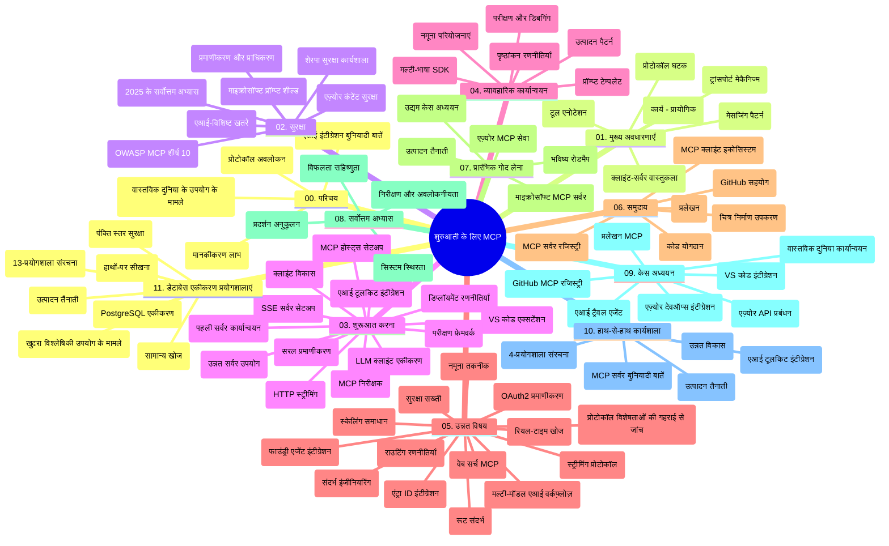

# शुरुआती के लिए मॉडल कॉन्टेक्स्ट प्रोटोकॉल (MCP) - अध्ययन गाइड

यह अध्ययन गाइड "शुरुआती के लिए मॉडल कॉन्टेक्स्ट प्रोटोकॉल (MCP)" पाठ्यक्रम के लिए रिपॉजिटरी संरचना और सामग्री का अवलोकन प्रदान करता है। इस गाइड का उपयोग रिपॉजिटरी को कुशलतापूर्वक नेविगेट करने और उपलब्ध संसाधनों का अधिकतम लाभ उठाने के लिए करें।

## रिपॉजिटरी अवलोकन

मॉडल कॉन्टेक्स्ट प्रोटोकॉल (MCP) एआई मॉडलों और क्लाइंट एप्लिकेशन के बीच इंटरैक्शन के लिए एक मानकीकृत फ्रेमवर्क है। प्रारंभ में Anthropic द्वारा बनाया गया, MCP अब आधिकारिक GitHub संगठन के माध्यम से व्यापक MCP समुदाय द्वारा बनाए रखा जाता है। यह रिपॉजिटरी C#, Java, JavaScript, Python, और TypeScript में व्यावहारिक कोड उदाहरणों के साथ एक व्यापक पाठ्यक्रम प्रदान करती है, जो AI डेवलपर्स, सिस्टम आर्किटेक्ट्स, और सॉफ्टवेयर इंजीनियरों के लिए डिज़ाइन की गई है।

## दृश्य पाठ्यक्रम मानचित्र

## रिपॉजिटरी संरचना

रिपॉजिटरी को ग्यारह मुख्य अनुभागों में व्यवस्थित किया गया है, जो MCP के विभिन्न पहलुओं पर ध्यान केंद्रित करते हैं:

1. **परिचय (00-Introduction/)**
   - मॉडल कॉन्टेक्स्ट प्रोटोकॉल का अवलोकन
   - AI पाइपलाइनों में मानकीकरण क्यों महत्वपूर्ण है
   - व्यावहारिक उपयोग केस और लाभ

2. **कोर अवधारणाएं (01-CoreConcepts/)**
   - क्लाइंट-सर्वर आर्किटेक्चर
   - प्रमुख प्रोटोकॉल घटक
   - MCP में मैसेजिंग पैटर्न

3. **सुरक्षा (02-Security/)**
   - MCP-आधारित सिस्टम में सुरक्षा खतरे
   - कार्यान्वयन को सुरक्षित करने के लिए सर्वोत्तम अभ्यास
   - प्रमाणीकरण और प्राधिकरण रणनीतियां
   - **व्यापक सुरक्षा दस्तावेज़ीकरण**:
     - MCP सुरक्षा सर्वोत्तम अभ्यास 2025
     - Azure सामग्री सुरक्षा कार्यान्वयन गाइड
     - MCP सुरक्षा नियंत्रण और तकनीकें
     - MCP सर्वोत्तम अभ्यास त्वरित संदर्भ
   - **प्रमुख सुरक्षा विषय**:
     - प्रॉम्प्ट इंजेक्शन और टूल जहर हमला
     - सत्र अपहरण और भ्रमित डिप्टी समस्याएं
     - टोकन पासथ्रू कमजोरियां
     - अत्यधिक अनुमतियाँ और अभिगम नियंत्रण
     - AI घटकों के लिए सप्लाई चेन सुरक्षा
     - Microsoft प्रॉम्प्ट शील्ड्स एकीकरण

4. **शुरुआत करना (03-GettingStarted/)**
   - पर्यावरण सेटअप और कॉन्फ़िगरेशन
   - बुनियादी MCP सर्वर और क्लाइंट बनाना
   - मौजूदा अनुप्रयोगों के साथ एकीकरण
   - शामिल अनुभाग:
     - पहला सर्वर कार्यान्वयन
     - क्लाइंट विकास
     - LLM क्लाइंट एकीकरण
     - VS Code एकीकरण
     - सर्वर-सेंट इवेंट्स (SSE) सर्वर
     - उन्नत सर्वर उपयोग
     - HTTP स्ट्रीमिंग
     - AI टूलकिट एकीकरण
     - परीक्षण रणनीतियाँ
     - परिनियोजन मार्गदर्शन

5. **व्यावहारिक कार्यान्वयन (04-PracticalImplementation/)**
   - विभिन्न प्रोग्रामिंग भाषाओं में SDK का उपयोग
   - डिबग, परीक्षण, और सत्यापन तकनीकें
   - पुन: प्रयोज्य प्रॉम्प्ट टेम्पलेट और वर्कफ़्लो बनाना
   - कार्यान्वयन उदाहरणों के साथ नमूना प्रोजेक्ट

6. **उन्नत विषय (05-AdvancedTopics/)**
   - कॉन्टेक्स्ट इंजीनियरिंग तकनीकें
   - Foundry एजेंट एकीकरण
   - मल्टी-मोडल AI वर्कफ़्लो
   - OAuth2 प्रमाणीकरण डेमो
   - रियल-टाइम खोज सुविधाएँ
   - रियल-टाइम स्ट्रीमिंग
   - रूट कॉन्टेक्स्ट का कार्यान्वयन
   - रूटिंग रणनीतियाँ
   - सैंपलिंग तकनीकें
   - स्केलिंग उपाय
   - सुरक्षा विचार
   - Entra ID सुरक्षा एकीकरण
   - वेब खोज एकीकरण

7. **समुदाय योगदान (06-CommunityContributions/)**
   - कोड और दस्तावेज़ीकरण में योगदान कैसे करें
   - GitHub के माध्यम से सहयोग
   - सामुदायिक प्रेरित सुधार और प्रतिक्रिया
   - विभिन्न MCP क्लाइंट का उपयोग (Claude Desktop, Cline, VSCode)
   - लोकप्रिय MCP सर्वर जैसे छवि उत्पादन के साथ काम करना

8. **प्रारंभिक अपनाने से सीख (07-LessonsfromEarlyAdoption/)**
   - वास्तविक दुनिया के कार्यान्वयन और सफलता की कहानियां
   - MCP-आधारित समाधान का निर्माण और परिनियोजन
   - रुझान और भविष्य रोडमैप
   - **Microsoft MCP सर्वर्स गाइड**: 10 उत्पादन-तैयार Microsoft MCP सर्वरों के लिए व्यापक मार्गदर्शिका जिसमें शामिल हैं:
     - Microsoft Learn Docs MCP Server
     - Azure MCP Server (15+ विशेष कनेक्टर्स)
     - GitHub MCP Server
     - Azure DevOps MCP Server
     - MarkItDown MCP Server
     - SQL Server MCP Server
     - Playwright MCP Server
     - Dev Box MCP Server
     - Azure AI Foundry MCP Server
     - Microsoft 365 Agents Toolkit MCP Server

9. **सर्वोत्तम अभ्यास (08-BestPractices/)**
   - प्रदर्शन ट्यूनिंग और अनुकूलन
   - दोष-प्रतिरोधी MCP सिस्टम डिजाइन
   - परीक्षण और लचीलापन रणनीतियाँ

10. **केस अध्ययन (09-CaseStudy/)**
    - **सात व्यापक केस अध्ययन** जो विविध परिदृश्यों में MCP की बहुमुखी प्रतिभा दिखाते हैं:
    - **Azure AI ट्रैवल एजेंट्स**: Azure OpenAI और AI Search के साथ मल्टी-एजेंट ऑर्केस्ट्रेशन
    - **Azure DevOps एकीकरण**: YouTube डेटा अपडेट के साथ वर्कफ़्लो प्रक्रियाओं का स्वचालन
    - **रियल-टाइम दस्तावेज़ पुनर्प्राप्ति**: स्ट्रीमिंग HTTP के साथ Python कंसोल क्लाइंट
    - **इंटरेक्टिव अध्ययन योजना जनरेटर**: चैनीट वेब ऐप के साथ संवादात्मक AI
    - **एडिटर के अंदर दस्तावेज़ीकरण**: GitHub Copilot वर्कफ़्लो के साथ VS Code एकीकरण
    - **Azure API प्रबंधन**: MCP सर्वर निर्माण के साथ एंटरप्राइज API एकीकरण
    - **GitHub MCP रजिस्ट्री**: पारिस्थितिकी तंत्र विकास और एजेंटिक एकीकरण मंच
    - उद्यम एकीकरण, डेवलपर उत्पादकता, और पारिस्थितिकी तंत्र विकास में कार्यान्वयन उदाहरण

11. **व्यावहारिक कार्यशाला (10-StreamliningAIWorkflowsBuildingAnMCPServerWithAIToolkit/)**
    - MCP और AI टूलकिट को संयोजित करने वाली व्यापक व्यावहारिक कार्यशाला
    - AI मॉडलों को वास्तविक दुनिया के टूल्स के साथ जोड़ने वाले बुद्धिमान अनुप्रयोगों का निर्माण
    - मूल बातें, कस्टम सर्वर विकास, और उत्पादन परिनियोजन रणनीतियों के व्यावहारिक मॉड्यूल
    - **प्रयोगशाला संरचना**:
      - लैब 1: MCP सर्वर आधारभूत बातें
      - लैब 2: उन्नत MCP सर्वर विकास
      - लैब 3: AI टूलकिट एकीकरण
      - लैब 4: उत्पादन परिनियोजन और स्केलिंग
    - चरण-दर-चरण निर्देशों के साथ लैब-आधारित सीखने का तरीका

12. **MCP सर्वर डेटाबेस एकीकरण लैब (11-MCPServerHandsOnLabs/)**
    - PostgreSQL एकीकरण के साथ उत्पादन-तैयार MCP सर्वर बनाने के लिए **13-लैब सीखने का मार्ग**
    - Zava रिटेल उपयोग केस के साथ वास्तविक दुनिया की रिटेल एनालिटिक्स कार्यान्वयन
    - **एंटरप्राइज-ग्रेड पैटर्न** जिसमें रो लेवल सुरक्षा (RLS), सेमाटिक सर्च, और बहु-भाड़ी डेटा अभिगम शामिल हैं
    - **पूर्ण लैब संरचना**:
      - **लैब 00-03: आधार** - परिचय, आर्किटेक्चर, सुरक्षा, पर्यावरण सेटअप
      - **लैब 04-06: MCP सर्वर निर्माण** - डेटाबेस डिज़ाइन, MCP सर्वर कार्यान्वयन, टूल विकास
      - **लैब 07-09: उन्नत फीचर्स** - सेमाटिक सर्च, परीक्षण और डिबगिंग, VS Code एकीकरण
      - **लैब 10-12: उत्पादन और सर्वोत्तम अभ्यास** - परिनियोजन, निगरानी, अनुकूलन
    - **कवर किए गए प्रौद्योगिकी**: FastMCP फ्रेमवर्क, PostgreSQL, Azure OpenAI, Azure कंटेनर ऐप्स, एप्लिकेशन इनसाइट्स
    - **सीखने के परिणाम**: उत्पादन-तैयार MCP सर्वर, डेटाबेस एकीकरण पैटर्न, AI-शक्ति वाले एनालिटिक्स, उद्यम सुरक्षा

## अतिरिक्त संसाधन

रिपॉजिटरी में सहायक संसाधन शामिल हैं:

- **Images फोल्डर**: पाठ्यक्रम के दौरान उपयोग किए गए आरेख और चित्रण
- **अनुवाद**: दस्तावेज़ीकरण के स्वचालित अनुवाद के साथ बहुभाषी समर्थन
- **आधिकारिक MCP संसाधन**:
  - [MCP Documentation](https://modelcontextprotocol.io/)
  - [MCP Specification](https://spec.modelcontextprotocol.io/)
  - [MCP GitHub Repository](https://github.com/modelcontextprotocol)

## इस रिपॉजिटरी का उपयोग कैसे करें

1. **क्रमिक सीखना**: संरचित सीखने के लिए अध्यायों को क्रम में (00 से 11 तक) पढ़ें।
2. **भाषा-विशिष्ट फोकस**: यदि आप किसी विशेष प्रोग्रामिंग भाषा में रुचि रखते हैं, तो अपनी पसंदीदा भाषा में कार्यान्वयन के लिए सैंपल निर्देशिकाओं का अन्वेषण करें।
3. **व्यावहारिक कार्यान्वयन**: अपना पर्यावरण सेटअप करने और अपना पहला MCP सर्वर और क्लाइंट बनाने के लिए "शुरुआत करना" अनुभाग से शुरुआत करें।
4. **उन्नत अन्वेषण**: मूल बातों को समझने के बाद, अपने ज्ञान को बढ़ाने के लिए उन्नत विषयों में गहराई से जाएं।
5. **समुदाय सहभागिता**: GitHub चर्चाओं और Discord चैनलों के माध्यम से MCP समुदाय में शामिल हों ताकि विशेषज्ञों और अन्य डेवलपर्स से जुड़ सकें।

## MCP क्लाइंट और टूल्स

पाठ्यक्रम विभिन्न MCP क्लाइंट और टूल्स को कवर करता है:

1. **आधिकारिक क्लाइंट्स**:
   - Visual Studio Code
   - MCP इन Visual Studio Code
   - Claude Desktop
   - VSCode में Claude
   - Claude API

2. **समुदाय क्लाइंट्स**:
   - Cline (टर्मिनल-आधारित)
   - Cursor (कोड संपादक)
   - ChatMCP
   - Windsurf

3. **MCP प्रबंधन टूल्स**:
   - MCP CLI
   - MCP Manager
   - MCP Linker
   - MCP Router

## लोकप्रिय MCP सर्वर

रिपॉजिटरी विभिन्न MCP सर्वर पेश करता है, जिनमें शामिल हैं:

1. **आधिकारिक Microsoft MCP सर्वर**:
   - Microsoft Learn Docs MCP Server
   - Azure MCP Server (15+ विशेष कनेक्टर्स)
   - GitHub MCP Server
   - Azure DevOps MCP Server
   - MarkItDown MCP Server
   - SQL Server MCP Server
   - Playwright MCP Server
   - Dev Box MCP Server
   - Azure AI Foundry MCP Server
   - Microsoft 365 Agents Toolkit MCP Server

2. **आधिकारिक संदर्भ सर्वर**:
   - Filesystem
   - Fetch
   - Memory
   - Sequential Thinking

3. **इमेज जनरेशन**:
   - Azure OpenAI DALL-E 3
   - Stable Diffusion WebUI
   - Replicate

4. **विकास टूल्स**:
   - Git MCP
   - Terminal Control
   - Code Assistant

5. **विशेषीकृत सर्वर**:
   - Salesforce
   - Microsoft Teams
   - Jira & Confluence

## योगदान

यह रिपॉजिटरी समुदाय से योगदानों का स्वागत करता है। MCP पारिस्थितिकी तंत्र में प्रभावी योगदान के लिए समुदाय योगदान अनुभाग देखें।

----

*यह अध्ययन गाइड अंतिम बार 5 फरवरी, 2026 को अपडेट किया गया था, नवीनतम MCP विनिर्देशन 2025-11-25 को दर्शाते हुए, और उस तिथि तक की रिपॉजिटरी का अवलोकन प्रदान करता है। इस तिथि के बाद रिपॉजिटरी सामग्री अपडेट हो सकती है।*

---

<!-- CO-OP TRANSLATOR DISCLAIMER START -->
**अस्वीकरण**:  
इस दस्तावेज़ का अनुवाद एआई अनुवाद सेवा [Co-op Translator](https://github.com/Azure/co-op-translator) का उपयोग करके किया गया है। यद्यपि हम सटीकता के लिए प्रयास करते हैं, कृपया ध्यान दें कि स्वचालित अनुवाद में त्रुटियाँ या अस्पष्टताएँ हो सकती हैं। मूल दस्तावेज़ अपनी मूल भाषा में अधिकृत स्रोत माना जाना चाहिए। महत्वपूर्ण जानकारी के लिए, पेशेवर मानव अनुवाद की सिफारिश की जाती है। इस अनुवाद के उपयोग से उत्पन्न किसी भी गलतफहमी या गलत व्याख्या के लिए हम उत्तरदायित्व स्वीकार नहीं करते हैं।
<!-- CO-OP TRANSLATOR DISCLAIMER END -->