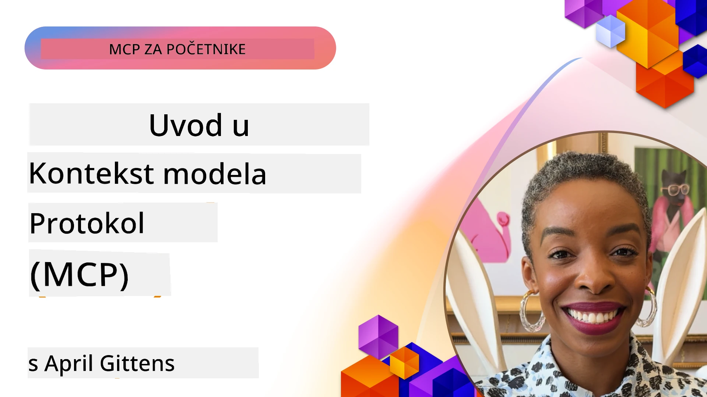
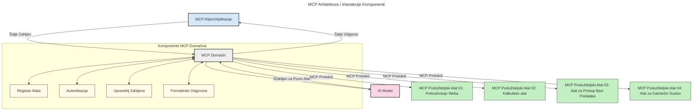

# Uvod u Model Context Protocol (MCP): Zašto je važan za skalabilne AI aplikacije

[](https://youtu.be/agBbdiOPLQA)

_(Kliknite gornju sliku za gledanje video lekcije)_

Generativne AI aplikacije predstavljaju veliki korak naprijed jer često omogućuju korisniku da komunicira s aplikacijom pomoću prirodnih jezičnih upita. Međutim, kako se u takve aplikacije ulaže više vremena i resursa, želite biti sigurni da možete lako integrirati funkcionalnosti i resurse na takav način da je jednostavno proširiti ih, da vaša aplikacija može podržati korištenje više od jednog modela i da se nosi s raznim složenostima modela. Ukratko, izgradnja Gen AI aplikacija na početku je jednostavna, ali kako rastu i postaju složenije, potrebno je početi definirati arhitekturu i vjerojatno se osloniti na standard koji osigurava da su vaše aplikacije izgrađene na dosljedan način. Tu dolazi MCP da organizira stvari i pruži standard.

---

## **🔍 Što je Model Context Protocol (MCP)?**

**Model Context Protocol (MCP)** je **otvoreno, standardizirano sučelje** koje omogućuje velikim jezičnim modelima (LLM-ovima) da bešavno surađuju s vanjskim alatima, API-jima i izvorima podataka. Pruža dosljednu arhitekturu za proširenje funkcionalnosti AI modela izvan njihovih podataka za treniranje, omogućujući pametnije, skalabilnije i responzivnije AI sustave.

---

## **🎯 Zašto je standardizacija u AI važna**

Kako generativne AI aplikacije postaju složenije, bitno je usvojiti standarde koji osiguravaju **skalabilnost, proširivost, održivost** i **izbjegavanje vezivanja uz proizvođača**. MCP adresira ove potrebe kroz:

- Ujedinjenje integracija modela i alata
- Smanjenje lomljivih, jednokratnih prilagođenih rješenja
- Omogućavanje suradnje više modela različitih proizvođača unutar jedinstvenog ekosustava

**Napomena:** Iako se MCP predstavlja kao otvoreni standard, nema planova da se standardizira putem postojećih tijela za standardizaciju poput IEEE, IETF, W3C, ISO ili bilo kojeg drugog tijela za standarde.

---

## **📚 Ciljevi učenja**

Na kraju ovog članka moći ćete:

- Definirati **Model Context Protocol (MCP)** i njegove slučajeve korištenja
- Razumjeti kako MCP standardizira komunikaciju modela s alatima
- Prepoznati ključne komponente MCP arhitekture
- Istražiti primjere stvarne primjene MCP-a u poduzećima i razvojnim kontekstima

---

## **💡 Zašto je Model Context Protocol (MCP) revolucionaran**

### **🔗 MCP rješava fragmentaciju u AI interakcijama**

Prije MCP-a, integracija modela s alatima zahtijevala je:

- Prilagođeni kod za svaki par alat-model
- Nestandardne API-je za svakog proizvođača
- Česte prekide zbog ažuriranja
- Lošu skalabilnost s većim brojem alata

### **✅ Prednosti standardizacije MCP-a**

| **Prednost**             | **Opis**                                                                    |
|-------------------------|-----------------------------------------------------------------------------|
| Interoperabilnost       | LLM-ovi besprijekorno rade s alatima različitih proizvođača                |
| Dosljednost             | Jednako ponašanje na platformama i alatima                                 |
| Ponovna upotrebljivost  | Alati napravljeni jednom mogu se koristiti u različitim projektima i sustavima |
| Ubrzani razvoj          | Smanjuje vrijeme razvoja koristeći standardizirana, plug-and-play sučelja   |

---

## **🧱 Prikaz arhitekture MCP-a na visokoj razini**

MCP slijedi **klijent-poslužitelj** model, gdje:

- **MCP Hostovi** pokreću AI modele
- **MCP Klijenti** iniciraju zahtjeve
- **MCP Poslužitelji** opslužuju kontekst, alate i mogućnosti

### **Ključne komponente:**

- **Resursi** – Statički ili dinamički podaci za modele  
- **Upiti (Prompts)** – Unaprijed definirani tijekovi rada za vođenu generaciju  
- **Alati** – Izvršne funkcije poput pretraživanja, izračuna  
- **Uzorak (Sampling)** – Agentno ponašanje putem rekurzivnih interakcija  
- **Izazivanje (Elicitation)** – Zahtjevi koje pokreće poslužitelj za unos korisnika  
- **Korijeni (Roots)** – Granice datotečnog sustava za kontrolu pristupa poslužitelja

### **Arhitektura protokola:**

MCP koristi dvoslojnu arhitekturu:  
- **Sloj podataka**: komunikacija temeljem JSON-RPC 2.0 s upravljanjem životnim ciklusom i primitivima  
- **Transportni sloj**: STDIO (lokalna) i prenosiva HTTP komunikacija s SSE (udaljena)

---

## Kako MCP poslužitelji rade

MCP poslužitelji rade na sljedeći način:

- **Tok zahtjeva**:  
    1. Zahtjev inicira krajnji korisnik ili softver koji djeluje u njegovo ime.  
    2. **MCP Klijent** šalje zahtjev na **MCP Host**, koji upravlja izvođenjem AI modela.  
    3. **AI Model** prima korisnički upit i može zatražiti pristup vanjskim alatima ili podacima putem jedne ili više poziva alata.  
    4. **MCP Host**, a ne sam model, komunicira s odgovarajućim **MCP Poslužiteljem/ima** koristeći standardizirani protokol.  
- **Funkcionalnost MCP Host-a**:  
    - **Registar alata**: Održava katalog dostupnih alata i njihovih mogućnosti.  
    - **Autentikacija**: Provjerava dopuštenja za pristup alatima.  
    - **Upravitelj zahtjeva**: Procesira dolazne zahtjeve za alate od modela.  
    - **Formatiranje odgovora**: Strukturira izlaze alata u formatu koji model razumije.  
- **Izvršenje MCP Poslužitelja**:  
    - **MCP Host** usmjerava pozive alata na jednog ili više **MCP Poslužitelja**, od kojih svaki izlaže specijalizirane funkcije (npr. pretraživanje, izračuni, upiti baze podataka).  
    - **MCP Poslužitelji** obavljaju svoje operacije i vraćaju rezultate natrag **MCP Hostu** u dosljednom formatu.  
    - **MCP Host** formatira i prenosi ove rezultate **AI Modelu**.  
- **Završetak odgovora**:  
    - **AI Model** uključi rezultate alata u konačni odgovor.  
    - **MCP Host** šalje taj odgovor natrag **MCP Klijentu**, koji ga dostavlja krajnjem korisniku ili pozivajućem softveru.  
    


## 👨‍💻 Kako izgraditi MCP poslužitelj (s primjerima)

MCP poslužitelji vam omogućuju proširivanje mogućnosti LLM-ova pružajući podatke i funkcionalnosti.

Spremni za isprobavanje? Evo jezično/pristupnih SDK-ova s primjerima za izradu jednostavnih MCP poslužitelja u različitim jezicima/okruženjima:

- **Python SDK**: https://github.com/modelcontextprotocol/python-sdk

- **TypeScript SDK**: https://github.com/modelcontextprotocol/typescript-sdk

- **Java SDK**: https://github.com/modelcontextprotocol/java-sdk

- **C#/.NET SDK**: https://github.com/modelcontextprotocol/csharp-sdk


## 🌍 Primjeri stvarnih upotreba MCP-a

MCP omogućuje širok spektar aplikacija proširujući AI mogućnosti:

| **Primjena**               | **Opis**                                                                      |
|----------------------------|-------------------------------------------------------------------------------|
| Integracija podataka u poduzeću | Povezivanje LLM-ova s bazama podataka, CRM sustavima ili internim alatima        |
| Agentni AI sustavi          | Omogućavanje autonomnim agentima pristup alatima i tijekovima donošenja odluka |
| Multimodalne aplikacije     | Kombinacija teksta, slike i audio alata unutar jedinstvene AI aplikacije       |
| Integracija podataka u stvarnom vremenu | Uvođenje uživo podataka u AI interakcije za preciznije, aktualne rezultate        |


### 🧠 MCP = Univerzalni standard za AI interakcije

Model Context Protocol (MCP) djeluje kao univerzalni standard za AI interakcije, poput USB-C standardizacije fizičkih priključaka za uređaje. U svijetu AI-a, MCP nudi dosljedno sučelje koje omogućuje modelima (klijentima) bešavnu integraciju s vanjskim alatima i pružateljima podataka (poslužiteljima). Time se uklanja potreba za različitim, prilagođenim protokolima za svaki API ili izvor podataka.

Prema MCP-u, alat kompatibilan s MCP-om (poznat kao MCP poslužitelj) slijedi ujednačeni standard. Ti poslužitelji mogu navesti alate ili akcije koje nude i izvršavati ih na zahtjev AI agenta. Platforme AI agenata koje podržavaju MCP mogu otkrivati dostupne alate na poslužiteljima i pozivati ih putem ovog standardiziranog protokola.

### 💡 Omogućava pristup znanju

Osim što nudi alate, MCP također omogućuje pristup znanju. Omogućuje aplikacijama da pruže kontekst velikim jezičnim modelima (LLM-ovima) povezujući ih s različitim izvorima podataka. Na primjer, MCP poslužitelj može predstavljati spremište dokumenata tvrtke, što agentima omogućuje dohvaćanje relevantnih informacija na zahtjev. Drugi poslužitelj može upravljati specifičnim akcijama poput slanja e-pošte ili ažuriranja zapisa. Iz perspektive agenta, to su jednostavno alati koje može koristiti — neki alati vraćaju podatke (kontekst znanja), dok drugi izvršavaju akcije. MCP učinkovito upravlja oboje.

Agent koji se povezuje s MCP poslužiteljem automatski uči o dostupnim mogućnostima poslužitelja i pristupačnim podacima kroz standardizirani format. Ova standardizacija omogućuje dinamičku dostupnost alata. Na primjer, dodavanje novog MCP poslužitelja u sustav agenta čini njegove funkcije odmah dostupnima bez dodatnih prilagodbi uputa za agenta.

Ova pojednostavljena integracija usklađena je s protokom prikazanim na sljedećoj dijagramu, gdje poslužitelji pružaju i alate i znanje, osiguravajući besprijekornu suradnju među sustavima.

### 👉 Primjer: skalabilno agentno rješenje

```mermaid
---
title: Rješenje skalabilnog agenta s MCP-om
description: Dijagram koji ilustrira kako korisnik komunicira s LLM-om koji se povezuje s više MCP servera, pri čemu svaki server pruža i znanje i alate, stvarajući skalabilnu arhitekturu AI sustava
---
graph TD
    User -->|Upit| LLM
    LLM -->|Odgovor| User
    LLM -->|MCP| ServerA
    LLM -->|MCP| ServerB
    ServerA -->|Univerzalni konektor| ServerB
    ServerA --> KnowledgeA
    ServerA --> ToolsA
    ServerB --> KnowledgeB
    ServerB --> ToolsB

    subgraph Server A
        KnowledgeA[Znanje]
        ToolsA[Alati]
    end

    subgraph Server B
        KnowledgeB[Znanje]
        ToolsB[Alati]
    end
```Universalni konektor omogućuje MCP poslužiteljima da međusobno komuniciraju i dijele mogućnosti, dopuštajući ServerA da delegira zadatke ServerB-u ili pristupi njegovim alatima i znanju. Time se alatima i podacima upravlja preko više poslužitelja, podupirući skalabilne i modularne agentne arhitekture. Budući da MCP standardizira izlaganje alata, agenti ih mogu dinamički otkrivati i upravljati zahtjevima između poslužitelja bez kodiranih integracija.

Federacija alata i znanja: Alatima i podacima se može upravljati preko poslužitelja, omogućujući skalabilnije i modularnije agentne arhitekture.

### 🔄 Napredni MCP scenariji s integracijom LLM-a na strani klijenta

Osim osnovne MCP arhitekture, postoje napredni scenariji u kojima i klijent i poslužitelj sadrže LLM-ove, što omogućuje sofisticiranije interakcije. Na sljedećem dijagramu, **Klijentska aplikacija** može biti IDE s nizom dostupnih MCP alata za korištenje od strane LLM-a:

```mermaid
---
title: Napredni MCP scenariji s integracijom klijent-poslužitelj LLM-a
description: Dijagram sekvence koji prikazuje detaljni tijek interakcije između korisnika, klijentske aplikacije, klijentskog LLM-a, više MCP poslužitelja i poslužiteljskog LLM-a, ilustrirajući faze otkrivanja alata, interakcije s korisnikom, izravnog poziva alata i pregovora o značajkama
---
sequenceDiagram
    autonumber
    actor User as 👤 Korisnik
    participant ClientApp as 🖥️ Klijentska aplikacija
    participant ClientLLM as 🧠 Klijentski LLM
    participant Server1 as 🔧 MCP poslužitelj 1
    participant Server2 as 📚 MCP poslužitelj 2
    participant ServerLLM as 🤖 Poslužiteljski LLM
    
    %% Discovery Phase
    rect rgb(220, 240, 255)
        Note over ClientApp, Server2: FAZA OTKRIVANJA ALATA
        ClientApp->>+Server1: Zahtjev za dostupnim alatima/resursima
        Server1-->>-ClientApp: Povratak popisa alata (JSON)
        ClientApp->>+Server2: Zahtjev za dostupnim alatima/resursima
        Server2-->>-ClientApp: Povratak popisa alata (JSON)
        Note right of ClientApp: Spremi kombinirani katalog<br/>alata lokalno
    end
    
    %% User Interaction
    rect rgb(255, 240, 220)
        Note over User, ClientLLM: FAZA INTERAKCIJE S KORISNIKOM
        User->>+ClientApp: Unesi upit na prirodnom jeziku
        ClientApp->>+ClientLLM: Proslijedi upit + katalog alata
        ClientLLM->>-ClientLLM: Analiziraj upit i odaberi alate
    end
    
    %% Scenario A: Direct Tool Calling
    alt Izravni poziv alata
        rect rgb(220, 255, 220)
            Note over ClientApp, Server1: SCENARIJ A: IZRAVNI POZIV ALATA
            ClientLLM->>+ClientApp: Zahtjev za izvršenjem alata
            ClientApp->>+Server1: Izvrši određeni alat
            Server1-->>-ClientApp: Vrati rezultate
            ClientApp->>+ClientLLM: Obradi rezultate
            ClientLLM-->>-ClientApp: Generiraj odgovor
            ClientApp-->>-User: Prikaži konačan odgovor
        end
    
    %% Scenario B: Feature Negotiation (VS Code style)
    else Pregovaranje o značajkama (stil VS Code)
        rect rgb(255, 220, 220)
            Note over ClientApp, ServerLLM: SCENARIJ B: PREGOVARANJE O ZNAČAJKAMA
            ClientLLM->>+ClientApp: Identificiraj potrebne mogućnosti
            ClientApp->>+Server2: Pregovaraj o značajkama/mogućnostima
            Server2->>+ServerLLM: Zahtjev za dodatnim kontekstom
            ServerLLM-->>-Server2: Pruži kontekst
            Server2-->>-ClientApp: Vrati dostupne značajke
            ClientApp->>+Server2: Pozovi pregovarane alate
            Server2-->>-ClientApp: Vrati rezultate
            ClientApp->>+ClientLLM: Obradi rezultate
            ClientLLM-->>-ClientApp: Generiraj odgovor
            ClientApp-->>-User: Prikaži konačan odgovor
        end
    end
```
## 🔐 Praktične prednosti MCP-a

Evo praktičnih prednosti korištenja MCP-a:

- **Svježina**: Modeli mogu pristupati aktualnim informacijama izvan svojih podataka za treniranje  
- **Proširenje mogućnosti**: Modeli mogu koristiti specijalizirane alate za zadatke za koje nisu trenirani  
- **Smanjenje halucinacija**: Vanjski izvori podataka pružaju činjenice kao osnovu  
- **Privatnost**: Osjetljivi podaci mogu ostati u sigurnom okruženju umjesto da budu ugrađeni u upite  

## 📌 Ključne napomene

Evo glavnih zaključaka za korištenje MCP-a:

- **MCP** standardizira način na koji AI modeli komuniciraju s alatima i podacima  
- Potiče **proširivost, dosljednost i interoperabilnost**  
- MCP pomaže **skratiti vrijeme razvoja, poboljšati pouzdanost i proširiti mogućnosti modela**  
- Klijent-poslužitelj arhitektura **omogućuje fleksibilne i proširive AI aplikacije**

## 🧠 Vježba

Razmislite o AI aplikaciji koju vas zanima izgraditi.

- Koji **vanjski alati ili podaci** bi mogli poboljšati njezine mogućnosti?  
- Kako MCP može učiniti integraciju **jednostavnijom i pouzdanijom?**

## Dodatni resursi

- [MCP GitHub spremište](https://github.com/modelcontextprotocol)


## Što slijedi

Sljedeće: [Poglavlje 1: Osnovni koncepti](../01-CoreConcepts/README.md)

---

<!-- CO-OP TRANSLATOR DISCLAIMER START -->
**Odricanje od odgovornosti**:  
Ovaj je dokument preveden pomoću AI usluge za prevođenje [Co-op Translator](https://github.com/Azure/co-op-translator). Iako nastojimo postići točnost, imajte na umu da automatizirani prijevodi mogu sadržavati pogreške ili netočnosti. Izvorni dokument na njegovom izvornom jeziku treba smatrati autoritativnim izvorom. Za kritične informacije preporučuje se profesionalni ljudski prijevod. Nismo odgovorni za eventualne nesporazume ili pogrešna tumačenja koja proizlaze iz upotrebe ovog prijevoda.
<!-- CO-OP TRANSLATOR DISCLAIMER END -->