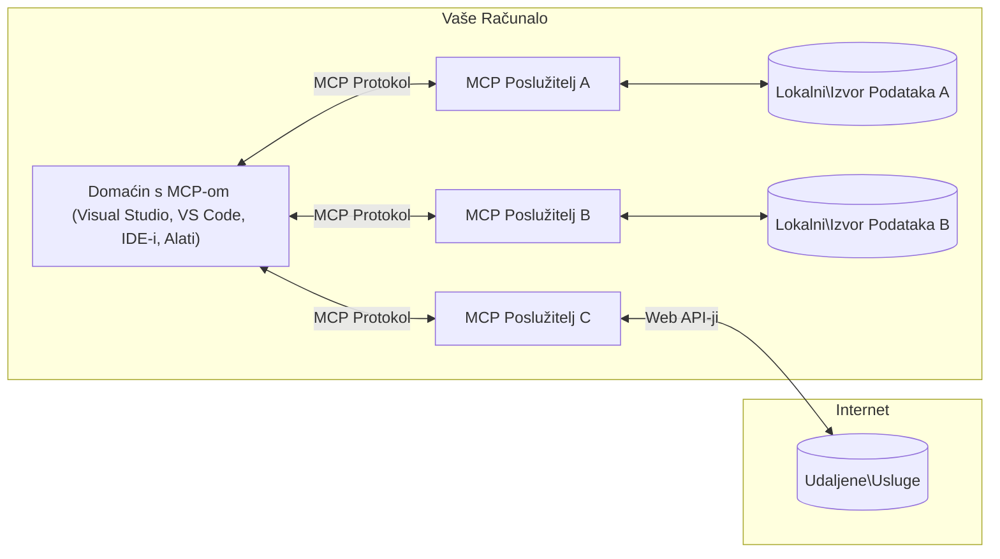

# MCP Core Concepts: Savladavanje Model Context Protocola za AI integraciju

[](https://youtu.be/earDzWGtE84)

_(Kliknite sliku iznad za pregled video lekcije)_

[Model Context Protocol (MCP)](https://github.com/modelcontextprotocol) je moćan, standardizirani okvir koji optimizira komunikaciju između velikih jezičnih modela (LLM) i vanjskih alata, aplikacija i izvora podataka.  
Ovaj vodič će vas provesti kroz osnovne koncepte MCP-a. Naučit ćete o njegovoj klijent-poslužiteljskoj arhitekturi, ključnim komponentama, mehanici komunikacije i najboljim praksama implementacije.

- **Izričiti korisnički pristanak**: Sav pristup podacima i operacije zahtijevaju izričiti odobrenje korisnika prije izvršenja. Korisnici moraju jasno razumjeti koje će se podatke pristupati i koje će se akcije obaviti, uz detaljnu kontrolu dozvola i autorizacija.

- **Zaštita privatnosti podataka**: Korisnički podaci izlažu se samo uz izričiti pristanak i moraju biti zaštićeni robusnom kontrolom pristupa kroz cijeli životni ciklus interakcije. Implementacije moraju spriječiti neovlašteni prijenos podataka i održavati stroge granice privatnosti.

- **Sigurnost izvođenja alata**: Svako pozivanje alata zahtijeva izričiti korisnički pristanak uz jasno razumijevanje funkcionalnosti alata, parametara i potencijalnih posljedica. Robusne sigurnosne granice moraju spriječiti neželjeno, nesigurno ili zlonamjerno izvršenje alata.

- **Sigurnost transportnog sloja**: Svi komunikacijski kanali trebaju koristiti odgovarajuće mehanizme enkripcije i autentifikacije. Udaljene veze trebaju implementirati sigurne protokole transporta te pravilno upravljanje vjerodajnicama.

#### Smjernice za implementaciju:

- **Upravljanje dozvolama**: Implementirajte sustave finog upravljanja dozvolama koji omogućavaju korisnicima kontrolu nad kojim su serverima, alatima i resursima dostupni  
- **Autentifikacija i autorizacija**: Koristite sigurne metode autentifikacije (OAuth, API ključevi) uz pravilno upravljanje tokenima i istekom  
- **Validacija unosa**: Validirajte sve parametre i ulaze podataka prema definiranim šemama radi sprječavanja napada ubacivanjem  
- **Evidencija aktivnosti**: Održavajte opsežne zapise svih operacija za sigurnosni nadzor i usklađenost

## Pregled

Ova lekcija istražuje osnovnu arhitekturu i komponente koje čine Model Context Protocol (MCP) ekosustav. Naučit ćete o klijent-poslužiteljskoj arhitekturi, ključnim komponentama i mehanizmima komunikacije koji pokreću MCP interakcije.

## Ključni ciljevi učenja

Do kraja ove lekcije, moći ćete:

- Razumjeti MCP klijent-poslužiteljsku arhitekturu.  
- Identificirati uloge i odgovornosti Hostova, Klijenata i Poslužitelja.  
- Analizirati ključne značajke koje čine MCP fleksibilnim slojem za integraciju.  
- Naučiti kako informacije teku unutar MCP ekosustava.  
- Steći praktične uvide kroz primjere koda u .NET, Java, Python i JavaScript.

## MCP arhitektura: detaljniji pogled

MCP ekosustav temelji se na modelu klijent-poslužitelj. Ova modularna struktura omogućava AI aplikacijama učinkovitu interakciju s alatima, bazama podataka, API-jima i kontekstualnim resursima. Razložit ćemo ovu arhitekturu na njezine ključne komponente.

U svojoj srži, MCP slijedi klijent-poslužiteljsku arhitekturu gdje host aplikacija može povezati više poslužitelja:


- **MCP Hostovi**: Programi poput VSCode, Claude Desktop, IDE-ovi ili AI alati koji žele pristupiti podacima putem MCP-a  
- **MCP Klijenti**: Protokol klijenti koji održavaju 1:1 veze s poslužiteljima  
- **MCP Poslužitelji**: Lagani programi koji svaki izlažu specifične mogućnosti putem standardiziranog Model Context Protocola  
- **Lokalni izvori podataka**: Datoteke, baze podataka i servisi na vašem računalu kojima MCP poslužitelji mogu sigurno pristupiti  
- **Udaljene usluge**: Vanjski sustavi dostupni preko interneta kojima se MCP poslužitelji mogu povezati putem API-ja

MCP Protokol je razvojni standard koji koristi verzioniranje temeljeno na datumu (format YYYY-MM-DD). Trenutna verzija protokola je **2025-11-25**. Najnovije nadopune možete vidjeti u [specifikaciji protokola](https://modelcontextprotocol.io/specification/2025-11-25/)

### 1. Hostovi

U Model Context Protocolu (MCP), **Hostovi** su AI aplikacije koje služe kao primarno sučelje kroz koje korisnici komuniciraju s protokolom. Hostovi koordiniraju i upravljaju vezama prema višestrukim MCP poslužiteljima stvarajući namjenske MCP klijente za svaku poslužiteljsku vezu. Primjeri Hostova uključuju:

- **AI aplikacije**: Claude Desktop, Visual Studio Code, Claude Code  
- **Razvojna okruženja**: IDE-ovi i uređivači koda s MCP integracijom  
- **Prilagođene aplikacije**: Posebno izrađeni AI agenti i alati

**Hostovi** su aplikacije koje koordiniraju AI model interakcije. Oni:

- **Orkestriraju AI modele**: Izvršavaju ili komuniciraju s LLM-ovima za generiranje odgovora i koordinaciju AI tijeka rada  
- **Upravljaju klijentskim vezama**: Kreiraju i održavaju jednog MCP klijenta po svakoj MCP poslužiteljskoj vezi  
- **Kontroliraju korisničko sučelje**: Rukovode tijekom razgovora, korisničkim interakcijama i prikazom odgovora  
- **Provode sigurnost**: Kontroliraju dozvole, sigurnosna ograničenja i autentifikaciju  
- **Rukovode korisničkim pristankom**: Upravljaju odobravanjem korisnika za dijeljenje podataka i izvršenje alata

### 2. Klijenti

**Klijenti** su ključne komponente koje održavaju namjenske veze jedan-na-jedan između Hostova i MCP poslužitelja. Svaki MCP klijent instancira Host za povezivanje s određenim MCP poslužiteljem, osiguravajući organizirane i sigurne komunikacijske kanale. Više klijenata omogućuje Hostovima istovremeno povezivanje s više poslužitelja.

**Klijenti** su povezničke komponente unutar host aplikacije. Oni:

- **Komunikacija protokolom**: Šalju JSON-RPC 2.0 zahtjeve poslužiteljima s promptovima i uputama  
- **Pregovaranje o mogućnostima**: Tijekom inicijalizacije pregovaraju o podržanim značajkama i verzijama protokola s poslužiteljima  
- **Izvršenje alata**: Upravljaju zahtjevima za izvršenje alata od modela i obrađuju odgovore  
- **Ažuriranja u stvarnom vremenu**: Rukovode obavijestima i ažuriranjima u realnom vremenu s poslužitelja  
- **Obrada odgovora**: Procesuiraju i formatiraju odgovore poslužitelja za prikaz korisnicima

### 3. Poslužitelji

**Poslužitelji** su programi koji pružaju kontekst, alate i mogućnosti MCP klijentima. Mogu raditi lokalno (na istom računalu kao Host) ili udaljeno (na vanjskim platformama) te su odgovorni za obradu zahtjeva klijenta i pružanje strukturiranih odgovora. Poslužitelji izlažu specifične funkcionalnosti kroz standardizirani Model Context Protocol.

**Poslužitelji** su servisi koji pružaju kontekst i mogućnosti. Oni:

- **Registracija značajki**: Registriraju i izlažu dostupne primitivne elemente (resurse, promptove, alate) klijentima  
- **Obrada zahtjeva**: Primaju i izvršavaju pozive alata, zahtjeve za resursima i promptove od klijenata  
- **Pružanje konteksta**: Osiguravaju kontekstualne informacije i podatke za poboljšanje odgovora modela  
- **Upravljanje stanjem**: Održavaju stanje sesije i rukuju stanja vezanim interakcijama po potrebi  
- **Obavijesti u stvarnom vremenu**: Šalju obavijesti o promjenama mogućnosti i ažuriranjima povezanim klijentima

Poslužitelji mogu biti razvijeni od strane bilo koga za proširenje model mogućnosti specijaliziranim funkcionalnostima, te podržavaju lokalne i udaljene scenarije implementacije.

### 4. Poslužiteljski primitivni elementi

Poslužitelji u Model Context Protocolu (MCP) pružaju tri osnovna **primitiva** koja definiraju temeljne građevne blokove za bogate interakcije između klijenata, hostova i jezičnih modela. Ovi primitivni elementi specificiraju vrste kontekstualnih informacija i dostupnih radnji kroz protokol.

MCP poslužitelji mogu izlagati bilo koju kombinaciju sljedeća tri osnovna primitiva:

#### Resursi

**Resursi** su izvori podataka koji pružaju kontekstualne informacije AI aplikacijama. Predstavljaju statički ili dinamički sadržaj koji može unaprijediti razumijevanje modela i donošenje odluka:

- **Kontekstualni podaci**: Strukturirane informacije i kontekst za potrošnju od AI modela  
- **Baze znanja**: Repozitoriji dokumenata, članci, priručnici i znanstveni radovi  
- **Lokalni izvori podataka**: Datoteke, baze podataka i lokalne sistemske informacije  
- **Vanjski podaci**: Odgovori API-ja, web servisi i podaci udaljenih sustava  
- **Dinamički sadržaj**: Podaci u realnom vremenu koji se ažuriraju na temelju vanjskih uvjeta

Resursi su identificirani URI-jevima i podržavaju otkrivanje kroz metode `resources/list` i dohvat putem `resources/read`:

```text
file://documents/project-spec.md
database://production/users/schema
api://weather/current
```

#### Promptovi

**Promptovi** su višekratno upotrebljivi predlošci koji pomažu strukturirati interakcije s jezičnim modelima. Pružaju standardizirane obrasce interakcija i predloške toka rada:

- **Interakcije temeljene na predlošcima**: Unaprijed strukturirane poruke i pokretači razgovora  
- **Predlošci tijeka rada**: Standardizirane sekvence za uobičajene zadatke i interakcije  
- **Few-shot primjeri**: Primjeri predložaka za upute modelu  
- **Sistemski promptovi**: Temeljni promptovi koji definiraju ponašanje i kontekst modela  
- **Dinamični predlošci**: Parametrizirani promptovi koji se prilagođavaju specifičnim kontekstima

Promptovi podržavaju zamjenu varijabli i mogu se otkriti metodama `prompts/list` te dohvatiti putem `prompts/get`:

```markdown
Generate a {{task_type}} for {{product}} targeting {{audience}} with the following requirements: {{requirements}}
```

#### Alati

**Alati** su izvršne funkcije koje AI modeli mogu pozivati za izvođenje specifičnih akcija. Oni predstavljaju "glagole" MCP ekosustava, omogućujući modelima interakciju s vanjskim sustavima:

- **Izvršne funkcije**: Diskretne operacije koje modeli mogu pozvati sa specifičnim parametrima  
- **Integracija s vanjskim sustavima**: Pozivi API-ja, upiti baza podataka, operacije nad datotekama, izračuni  
- **Jedinstveni identitet**: Svaki alat ima jedinstveno ime, opis i šemu parametara  
- **Strukturirani ulaz/izlaz**: Alati prihvaćaju validirane parametre i vraćaju strukturirane, tipizirane odgovore  
- **Mogućnosti akcije**: Omogućuju modelima izvođenje stvarnih radnji i dohvat uživo podataka

Alati su definirani JSON Shemom za validaciju parametara, otkrivaju se putem `tools/list` i izvršavaju preko `tools/call`. Alati također mogu sadržavati **ikone** kao dodatne metapodatke za bolju prezentaciju UI-a.

**Annotacije alata**: Alati podržavaju ponašajne annotacije (npr. `readOnlyHint`, `destructiveHint`) koje opisuju je li alat samo za čitanje ili destruktivan, pomažući klijentima u donošenju informiranih odluka o izvršenju alata.

Primjer definicije alata:

```typescript
server.tool(
  "search_products", 
  {
    query: z.string().describe("Search query for products"),
    category: z.string().optional().describe("Product category filter"),
    max_results: z.number().default(10).describe("Maximum results to return")
  }, 
  async (params) => {
    // Izvršite pretragu i vratite strukturirane rezultate
    return await productService.search(params);
  }
);
```

## Klijentski primitivni elementi

U Model Context Protocolu (MCP), **klijenti** mogu izlagati primitiva koje omogućuju poslužiteljima da zatraže dodatne mogućnosti od host aplikacije. Ovi klijentski primitivni elementi dopuštaju bogatije, interaktivnije implementacije poslužitelja koje mogu pristupiti AI model mogućnostima i korisničkim interakcijama.

### Uzorkovanje

**Uzorkovanje** omogućuje poslužiteljima da zatraže dovršetke jezičnih modela od AI aplikacije klijenta. Ovaj primitiv omogućava poslužiteljima pristup LLM mogućnostima bez ugrađivanja vlastitih ovisnosti modela:

- **Pristup neovisno o modelu**: Poslužitelji mogu tražiti dovršetke bez uključivanja SDK-ova LLM-a ili upravljanja pristupom modelu  
- **Poslužiteljem inicirani AI**: Omogućuje poslužiteljima autonomno generiranje sadržaja koristeći klijentov AI model  
- **Rekurzivne LLM interakcije**: Podržava složene scenarije gdje poslužitelji trebaju AI pomoć za obradu  
- **Dinamična generacija sadržaja**: Dopušta poslužiteljima stvaranje kontekstualnih odgovora koristeći hostov model  
- **Podrška za pozivanje alata**: Poslužitelji mogu uključiti parametre `tools` i `toolChoice` za omogućavanje klijentovom modelu pozivanje alata tijekom uzorkovanja

Uzorkovanje se inicira putem metode `sampling/complete` gdje poslužitelji šalju zahtjeve za dovršetke klijentima.

### Korijeni (Roots)

**Korijeni** pružaju standardizirani način za klijente da izlože granice datotečnog sustava poslužiteljima, pomažući poslužiteljima razumjeti do kojih direktorija i datoteka imaju pristup:

- **Granice datotečnog sustava**: Definiraju granice unutar kojih poslužitelji mogu djelovati u datotečnom sustavu  
- **Kontrola pristupa**: Pomažu poslužiteljima razumjeti koje direktorije i datoteke smiju pristupati  
- **Dinamična ažuriranja**: Klijenti mogu obavijestiti poslužitelje kada se promijeni popis korijena  
- **Identifikacija temeljem URI-ja**: Korijeni koriste `file://` URI-je za identifikaciju dostupnih direktorija i datoteka

Korijeni se otkrivaju kroz metodu `roots/list`, a klijenti šalju `notifications/roots/list_changed` kada se korijeni izmijene.

### Izazivanje (Elicitation)

**Izazivanje** omogućava poslužiteljima da zatraže dodatne informacije ili potvrdu od korisnika putem klijentskog sučelja:

- **Zahtjevi korisničkog unosa**: Poslužitelji mogu zatražiti dodatne informacije kad su potrebne za izvršenje alata  
- **Dijalozi za potvrdu**: Traže korisničku suglasnost za osjetljive ili rizične operacije  
- **Interaktivni tokovi rada**: Omogućuju poslužiteljima stvaranje korak-po-korak korisničkih interakcija  
- **Dinamičko prikupljanje parametara**: Prikuplja nedostajuće ili opcionalne parametre tijekom izvršenja alata

Zahtjevi izazivanja šalju se metodom `elicitation/request` za prikupljanje korisničkog unosa kroz klijentovo sučelje.

**Izazivanje putem URL načina**: Poslužitelji također mogu zatražiti korisničke interakcije temeljene na URL-u, što im omogućuje da korisnike usmjere na vanjske web stranice za autentikaciju, potvrdu ili unos podataka.

### Evidencija (Logging)

**Evidencija** omogućuje poslužiteljima slanje strukturiranih log poruka klijentima za ispravljanje pogrešaka, nadzor i operativnu vidljivost:

- **Podrška za ispravljanje pogrešaka**: Omogućava poslužiteljima detaljne zapise izvršenja za otklanjanje problema  
- **Operativni nadzor**: Šalje statusne informacije i metrike performansi klijentima  
- **Izvještavanje o pogreškama**: Pruža detaljan kontekst pogrešaka i dijagnostičke informacije  
- **Auditni tragovi**: Kreira opsežne zapise poslužiteljskih operacija i odluka

Poruke evidencije šalju se klijentima kako bi se osigurala transparentnost poslužiteljskih operacija i olakšalo ispravljanje pogrešaka.

## Tok informacija u MCP-u

Model Context Protocol (MCP) definira strukturirani tijek informacija između hostova, klijenata, poslužitelja i modela. Razumijevanje ovog toka pomaže razjasniti kako se korisnički zahtjevi obrađuju i kako se vanjski alati i podaci integriraju u odgovore modela.

- **Host inicira vezu**  
  Host aplikacija (poput IDE-a ili chat sučelja) uspostavlja vezu s MCP poslužiteljem, obično putem STDIO, WebSocket ili drugog podržanog transporta.

- **Pregovaranje mogućnosti**  
  Klijent (ugrađen u host) i poslužitelj razmjenjuju informacije o podržanim značajkama, alatima, resursima i verzijama protokola. To osigurava da obje strane razumiju koje su mogućnosti dostupne za sesiju.

- **Korisnički zahtjev**  
  Korisnik komunicira s hostom (npr. unosi prompt ili naredbu). Host skuplja ovaj unos i prosljeđuje ga klijentu na obradu.

- **Korištenje resursa ili alata**  
  - Klijent može zatražiti dodatni kontekst ili resurse od poslužitelja (poput datoteka, unosa u bazu podataka ili članaka baze znanja) za obogaćivanje razumijevanja modela.  
  - Ako model zaključi da je potreban alat (npr. za dohvat podataka, izvođenje izračuna ili pozivanje API-ja), klijent šalje poslužitelju zahtjev za pozivanje alata, specificirajući naziv alata i parametre.

- **Izvršenje poslužitelja**  

  Poslužitelj prima zahtjev za resursom ili alatom, izvršava potrebne operacije (kao što je izvođenje funkcije, upit baze podataka ili dohvat datoteke) i vraća rezultate klijentu u strukturiranom formatu.

- **Generiranje odgovora**  
  Klijent integrira odgovore poslužitelja (podatke resursa, izlaze alata itd.) u tekuću interakciju modela. Model koristi te informacije za generiranje sveobuhvatnog i kontekstualno relevantnog odgovora.

- **Prezentacija rezultata**  
  Domaćin prima konačni izlaz od klijenta i prikazuje ga korisniku, često uključujući i tekst koji je generirao model kao i bilo koje rezultate izvršavanja alata ili pretraživanja resursa.

Ovaj proces omogućuje MCP-u potporu naprednim, interaktivnim i kontekstualno svjesnim AI aplikacijama tako da bešavno povezuje modele s vanjskim alatima i izvorima podataka.

## Arhitektura i slojevi protokola

MCP se sastoji od dva različita arhitektonska sloja koji zajedno djeluju kako bi pružili cjeloviti komunikacijski okvir:

### Sloj podataka

**Sloj podataka** implementira osnovni MCP protokol koristeći **JSON-RPC 2.0** kao svoju osnovu. Ovaj sloj definira strukturu poruka, semantiku i obrasce interakcije:

#### Osnovne komponente:

- **JSON-RPC 2.0 protokol**: Cjelokupna komunikacija koristi standardizirani JSON-RPC 2.0 format poruka za pozive metoda, odgovore i obavijesti
- **Upravljanje životnim ciklusom**: Rukuje inicijalizacijom veze, pregovaranjem mogućnosti i završetkom sesije između klijenata i poslužitelja
- **Poslužiteljske primitivne funkcije**: Omogućuju poslužiteljima da pružaju osnovne funkcionalnosti kroz alate, resurse i upute
- **Klijentske primitivne funkcije**: Omogućuju poslužiteljima da traže uzorkovanje iz velikih jezičnih modela (LLM), poticanje unosa korisnika i slanje poruka zapisnika
- **Obavijesti u stvarnom vremenu**: Podržavaju asinhrone obavijesti za dinamičke nadopune bez potrebe za ispitivanjem (polling)

#### Ključne značajke:

- **Pregovaranje verzije protokola**: Koristi verzioniranje bazirano na datumu (GGGG-MM-DD) za osiguranje kompatibilnosti
- **Otkriće mogućnosti**: Klijenti i poslužitelji razmjenjuju informacije o podržanim značajkama tijekom inicijalizacije
- **Sesije s očuvanjem stanja**: Održava stanje veze kroz višestruke interakcije radi kontinuiteta konteksta

### Transportni sloj

**Transportni sloj** upravlja komunikacijskim kanalima, umotavanjem poruka i autentikacijom između sudionika MCP-a:

#### Podržani transportni mehanizmi:

1. **STDIO transport**:  
   - Koristi standardne ulazno/izlazne tokove za direktnu komunikaciju procesa  
   - Optimalan za lokalne procese na istoj mašini bez mrežnog opterećenja  
   - Često korišten za lokalne implementacije MCP poslužitelja

2. **Streamable HTTP transport**:  
   - Koristi HTTP POST za poruke od klijenta do poslužitelja  
   - Opcionalni Server-Sent Events (SSE) za streaming od poslužitelja do klijenta  
   - Omogućuje komunikaciju s udaljenim poslužiteljima preko mreža  
   - Podržava standardnu HTTP autentikaciju (bearer tokeni, API ključevi, prilagođeni zaglavlja)  
   - MCP preporučuje OAuth za sigurnu autentikaciju temeljem tokena

#### Transportna apstrakcija:

Transportni sloj apstrahira detalje komunikacije od sloja podataka, omogućujući isti JSON-RPC 2.0 format poruka kroz sve transportne mehanizme. Ova apstrakcija omogućava aplikacijama glatku izmjenu između lokalnih i udaljenih poslužitelja.

### Sigurnosne napomene

Implementacije MCP-a moraju pridržavati nekoliko ključnih sigurnosnih načela kako bi osigurale sigurne, pouzdane i zaštićene interakcije tijekom svih protokolskih operacija:

- **Slaženje i kontrola korisnika**: Korisnici moraju dati izričit pristanak prije pristupa bilo kakvim podacima ili izvođenja operacija. Trebaju imati jasnu kontrolu nad time koji se podaci dijele i koje su akcije ovlaštene, podržano intuitivnim korisničkim sučeljima za pregledavanje i odobravanje aktivnosti.

- **Privatnost podataka**: Korisnički podaci trebaju biti izloženi samo uz izričit pristanak i moraju biti zaštićeni odgovarajućim kontrolama pristupa. Implementacije MCP-a moraju štititi od neovlaštenog prijenosa podataka i osigurati da se privatnost održava kroz sve interakcije.

- **Sigurnost alata**: Prije poziva bilo kojeg alata potreban je izričit pristanak korisnika. Korisnici trebaju jasno razumjeti funkcionalnost svakog alata, a snažne sigurnosne granice moraju biti provedene kako bi se spriječilo nenamjerno ili nesigurno izvršavanje alata.

Slijeđenjem ovih sigurnosnih načela MCP osigurava povjerenje korisnika, zaštitu privatnosti i sigurnost tijekom svih protokolskih interakcija, istovremeno omogućujući snažne AI integracije.

## Primjeri koda: Ključne komponente

U nastavku su primjeri koda na popularnim programskim jezicima koji ilustriraju kako implementirati ključne MCP poslužiteljske komponente i alate.

### .NET primjer: Kreiranje jednostavnog MCP poslužitelja s alatima

Ovdje je praktični .NET primjer koda koji pokazuje kako implementirati jednostavan MCP poslužitelj s prilagođenim alatima. Ovaj primjer prikazuje kako definirati i registrirati alate, obrađivati zahtjeve i povezati poslužitelj koristeći Model Context Protocol.

```csharp
using System;
using System.Threading.Tasks;
using ModelContextProtocol.Server;
using ModelContextProtocol.Server.Transport;
using ModelContextProtocol.Server.Tools;

public class WeatherServer
{
    public static async Task Main(string[] args)
    {
        // Create an MCP server
        var server = new McpServer(
            name: "Weather MCP Server",
            version: "1.0.0"
        );
        
        // Register our custom weather tool
        server.AddTool<string, WeatherData>("weatherTool", 
            description: "Gets current weather for a location",
            execute: async (location) => {
                // Call weather API (simplified)
                var weatherData = await GetWeatherDataAsync(location);
                return weatherData;
            });
        
        // Connect the server using stdio transport
        var transport = new StdioServerTransport();
        await server.ConnectAsync(transport);
        
        Console.WriteLine("Weather MCP Server started");
        
        // Keep the server running until process is terminated
        await Task.Delay(-1);
    }
    
    private static async Task<WeatherData> GetWeatherDataAsync(string location)
    {
        // This would normally call a weather API
        // Simplified for demonstration
        await Task.Delay(100); // Simulate API call
        return new WeatherData { 
            Temperature = 72.5,
            Conditions = "Sunny",
            Location = location
        };
    }
}

public class WeatherData
{
    public double Temperature { get; set; }
    public string Conditions { get; set; }
    public string Location { get; set; }
}
```

### Java primjer: MCP poslužiteljske komponente

Ovaj primjer demonstrira isti MCP poslužitelj i registraciju alata kao gornji .NET primjer, ali implementiran u Javi.

```java
import io.modelcontextprotocol.server.McpServer;
import io.modelcontextprotocol.server.McpToolDefinition;
import io.modelcontextprotocol.server.transport.StdioServerTransport;
import io.modelcontextprotocol.server.tool.ToolExecutionContext;
import io.modelcontextprotocol.server.tool.ToolResponse;

public class WeatherMcpServer {
    public static void main(String[] args) throws Exception {
        // Kreiraj MCP poslužitelj
        McpServer server = McpServer.builder()
            .name("Weather MCP Server")
            .version("1.0.0")
            .build();
            
        // Registriraj alat za vremensku prognozu
        server.registerTool(McpToolDefinition.builder("weatherTool")
            .description("Gets current weather for a location")
            .parameter("location", String.class)
            .execute((ToolExecutionContext ctx) -> {
                String location = ctx.getParameter("location", String.class);
                
                // Dohvati podatke o vremenu (pojednostavljeno)
                WeatherData data = getWeatherData(location);
                
                // Vrati formatirani odgovor
                return ToolResponse.content(
                    String.format("Temperature: %.1f°F, Conditions: %s, Location: %s", 
                    data.getTemperature(), 
                    data.getConditions(), 
                    data.getLocation())
                );
            })
            .build());
        
        // Poveži poslužitelj koristeći stdio transport
        try (StdioServerTransport transport = new StdioServerTransport()) {
            server.connect(transport);
            System.out.println("Weather MCP Server started");
            // Održi poslužitelj aktivnim dok se proces ne završi
            Thread.currentThread().join();
        }
    }
    
    private static WeatherData getWeatherData(String location) {
        // Implementacija bi pozvala vremenski API
        // Pojednostavljeno za potrebe primjera
        return new WeatherData(72.5, "Sunny", location);
    }
}

class WeatherData {
    private double temperature;
    private String conditions;
    private String location;
    
    public WeatherData(double temperature, String conditions, String location) {
        this.temperature = temperature;
        this.conditions = conditions;
        this.location = location;
    }
    
    public double getTemperature() {
        return temperature;
    }
    
    public String getConditions() {
        return conditions;
    }
    
    public String getLocation() {
        return location;
    }
}
```

### Python primjer: Izgradnja MCP poslužitelja

Ovaj primjer koristi fastmcp, stoga ga prvo instalirajte:

```python
pip install fastmcp
```
Primjer koda:

```python
#!/usr/bin/env python3
import asyncio
from fastmcp import FastMCP
from fastmcp.transports.stdio import serve_stdio

# Kreiraj FastMCP poslužitelj
mcp = FastMCP(
    name="Weather MCP Server",
    version="1.0.0"
)

@mcp.tool()
def get_weather(location: str) -> dict:
    """Gets current weather for a location."""
    return {
        "temperature": 72.5,
        "conditions": "Sunny",
        "location": location
    }

# Alternativni pristup koristeći klasu
class WeatherTools:
    @mcp.tool()
    def forecast(self, location: str, days: int = 1) -> dict:
        """Gets weather forecast for a location for the specified number of days."""
        return {
            "location": location,
            "forecast": [
                {"day": i+1, "temperature": 70 + i, "conditions": "Partly Cloudy"}
                for i in range(days)
            ]
        }

# Registriraj klasu alate
weather_tools = WeatherTools()

# Pokreni poslužitelj
if __name__ == "__main__":
    asyncio.run(serve_stdio(mcp))
```

### JavaScript primjer: Kreiranje MCP poslužitelja

Ovaj primjer pokazuje kreiranje MCP poslužitelja u JavaScriptu i registraciju dva alata vezana uz vremenske prilike.

```javascript
// Koristeći službeni Model Context Protocol SDK
import { McpServer } from "@modelcontextprotocol/sdk/server/mcp.js";
import { StdioServerTransport } from "@modelcontextprotocol/sdk/server/stdio.js";
import { z } from "zod"; // Za provjeru parametara

// Kreiraj MCP poslužitelj
const server = new McpServer({
  name: "Weather MCP Server",
  version: "1.0.0"
});

// Definiraj vremenski alat
server.tool(
  "weatherTool",
  {
    location: z.string().describe("The location to get weather for")
  },
  async ({ location }) => {
    // Ovo bi normalno pozivalo vremenski API
    // Pojednostavljeno za demonstraciju
    const weatherData = await getWeatherData(location);
    
    return {
      content: [
        { 
          type: "text", 
          text: `Temperature: ${weatherData.temperature}°F, Conditions: ${weatherData.conditions}, Location: ${weatherData.location}` 
        }
      ]
    };
  }
);

// Definiraj alat za prognozu
server.tool(
  "forecastTool",
  {
    location: z.string(),
    days: z.number().default(3).describe("Number of days for forecast")
  },
  async ({ location, days }) => {
    // Ovo bi normalno pozivalo vremenski API
    // Pojednostavljeno za demonstraciju
    const forecast = await getForecastData(location, days);
    
    return {
      content: [
        { 
          type: "text", 
          text: `${days}-day forecast for ${location}: ${JSON.stringify(forecast)}` 
        }
      ]
    };
  }
);

// Pomoćne funkcije
async function getWeatherData(location) {
  // Simuliraj poziv API-ja
  return {
    temperature: 72.5,
    conditions: "Sunny",
    location: location
  };
}

async function getForecastData(location, days) {
  // Simuliraj poziv API-ja
  return Array.from({ length: days }, (_, i) => ({
    day: i + 1,
    temperature: 70 + Math.floor(Math.random() * 10),
    conditions: i % 2 === 0 ? "Sunny" : "Partly Cloudy"
  }));
}

// Spoji poslužitelj koristeći stdio transport
const transport = new StdioServerTransport();
server.connect(transport).catch(console.error);

console.log("Weather MCP Server started");
```

Ovaj JavaScript primjer demonstrira kako kreirati MCP klijenta koji se povezuje na poslužitelj, šalje prompt i obrađuje odgovor uključujući i sve pozive alata koji su izvršeni.

## Sigurnost i autorizacija

MCP uključuje nekoliko ugrađenih koncepata i mehanizama za upravljanje sigurnošću i autorizacijom tijekom cijelog protokola:

1. **Kontrola dopuštenja za alate**:  
  Klijenti mogu specificirati koje alate model smije koristiti tijekom sesije. To osigurava da su dostupni samo eksplicitno ovlašteni alati, smanjujući rizik od nenamjernih ili nesigurnih operacija. Dozvole se mogu dinamički konfigurirati na temelju korisničkih preferencija, organizacijskih pravila ili konteksta interakcije.

2. **Autentikacija**:  
  Poslužitelji mogu zahtijevati autentikaciju prije dodjele pristupa alatima, resursima ili osjetljivim operacijama. To može uključivati API ključeve, OAuth tokene ili druge sheme autentikacije. Ispravna autentikacija osigurava da samo pouzdani klijenti i korisnici mogu koristiti mogućnosti poslužitelja.

3. **Validacija**:  
  Validacija parametara se provodi za sve pozive alata. Svaki alat definira očekivane tipove, formate i ograničenja svojih parametara, a poslužitelj validira dolazne zahtjeve u skladu s tim. Ovo sprječava da nepodudaran ili zlonamjeran unos dođe do implementacija alata i pomaže u održavanju integriteta operacija.

4. **Ograničenje brzine (rate limiting)**:  
  Kako bi se spriječila zloupotreba i osigurala poštena upotreba resursa poslužitelja, MCP poslužitelji mogu implementirati ograničenje brzine poziva alata i pristupa resursima. Ograničenja se mogu primjenjivati po korisniku, sesiji ili globalno, i pomažu u zaštiti od DoS napada ili prekomjerne potrošnje resursa.

Kombiniranjem tih mehanizama, MCP pruža sigurnu osnovu za integraciju jezičnih modela s vanjskim alatima i izvorima podataka, dok korisnicima i developerima daje detaljnu kontrolu pristupa i korištenja.

## Poruke protokola i tijek komunikacije

MCP komunikacija koristi strukturirane **JSON-RPC 2.0** poruke za jasan i pouzdan tijek interakcije između domaćina, klijenata i poslužitelja. Protokol definira specifične obrasce poruka za različite vrste operacija:

### Osnovne vrste poruka:

#### **Poruke za inicijalizaciju**
- **`initialize` Zahtjev**: Uspostavlja vezu i pregovara verziju protokola i mogućnosti
- **`initialize` Odgovor**: Potvrđuje podržane značajke i informacije o poslužitelju  
- **`notifications/initialized`**: Signalizira da je inicijalizacija dovršena i da je sesija spremna

#### **Poruke za otkrivanje**
- **`tools/list` Zahtjev**: Otkriva dostupne alate na poslužitelju
- **`resources/list` Zahtjev**: Navodi dostupne resurse (izvore podataka)
- **`prompts/list` Zahtjev**: Dohvaća dostupne predloške uputa

#### **Poruke izvođenja**  
- **`tools/call` Zahtjev**: Izvodi specifičan alat s danim parametrima
- **`resources/read` Zahtjev**: Dohvaća sadržaj iz određenog resursa
- **`prompts/get` Zahtjev**: Dohvaća predložak uputa s opcijskim parametrima

#### **Poruke s klijentske strane**
- **`sampling/complete` Zahtjev**: Poslužitelj traži dovršetak iz LLM-a od klijenta
- **`elicitation/request`**: Poslužitelj traži unos korisnika putem klijentskog sučelja
- **Poruke zapisnika**: Poslužitelj šalje strukturirane zapise klijentu

#### **Poruke obavijesti**
- **`notifications/tools/list_changed`**: Poslužitelj obavještava klijenta o promjenama alata
- **`notifications/resources/list_changed`**: Poslužitelj obavještava klijenta o promjenama resursa  
- **`notifications/prompts/list_changed`**: Poslužitelj obavještava klijenta o promjenama uputa

### Struktura poruke:

Sve MCP poruke slijede JSON-RPC 2.0 format s:  
- **Zahtjevne poruke**: Uključuju `id`, `method` i opcionalno `params`  
- **Odgovorne poruke**: Uključuju `id` i ili `result` ili `error`  
- **Obavijesne poruke**: Uključuju `method` i opcionalno `params` (bez `id` i bez očekivanog odgovora)

Ova strukturirana komunikacija osigurava pouzdane, prenosive i proširive interakcije koje podržavaju napredne scenarije poput ažuriranja u stvarnom vremenu, lančanja alata i robusnog upravljanja greškama.

### Zadaci (eksperimentalno)

**Zadaci** su eksperimentalna značajka koja pruža trajne omotače za izvođenje, omogućujući odgođeni dohvat rezultata i praćenje statusa za MCP zahtjeve:

- **Dugotrajne operacije**: Praćenje skupih računalnih procesa, automatizacija tijeka rada i obrada u serijama  
- **Odgođeni rezultati**: Ispitivanje statusa zadatka i dohvat rezultata kada operacije završe  
- **Praćenje statusa**: Nadzor napretka zadatka kroz definirane faze životnog ciklusa  
- **Višestupanjske operacije**: Podrška za složene tijekove rada kroz više interakcija

Zadaci omotavaju standardne MCP zahtjeve kako bi omogućili asinhrone obrasce izvođenja za operacije koje se ne mogu odmah dovršiti.

## Ključne poruke

- **Arhitektura**: MCP koristi klijent-poslužitelj arhitekturu gdje domaćini upravljaju višestrukim povezivanjem klijenata na poslužitelje  
- **Sudionici**: Ekosustav uključuje domaćine (AI aplikacije), klijente (protokolske konektore) i poslužitelje (provajdere mogućnosti)  
- **Transportni mehanizmi**: Komunikacija podržava STDIO (lokalni) i Streamable HTTP s opcionalnim SSE (udaljeni)  
- **Osnovni primitivni objekti**: Poslužitelji izlažu alate (izvršne funkcije), resurse (izvore podataka) i upute (predloške)  
- **Klijentski primitivni objekti**: Poslužitelji mogu tražiti uzorkovanje (LLM dovršetke s podrškom za pozivanje alata), poticanje (unos korisnika uključujući URL način rada), granice (ograničenja datotečnog sustava) i zapisnike od klijenata  
- **Eksperimentalne značajke**: Zadaci pružaju trajne omotače za dugotrajne operacije  
- **Temelj protokola**: Izgrađen na JSON-RPC 2.0 s verzioniranjem baziranim na datumu (trenutni: 2025-11-25)  
- **Značajke u stvarnom vremenu**: Podržava obavijesti za dinamičke nadopune i sinkronizaciju u stvarnom vremenu  
- **Sigurnost na prvom mjestu**: Izričit pristanak korisnika, zaštita privatnosti podataka i sigurni transport su ključni zahtjevi

## Vježba

Dizajnirajte jednostavan MCP alat koji bi bio koristan u vašem području. Definirajte:  
1. Kako bi se alat zvao  
2. Koje bi parametre primao  
3. Koji bi izlaz vraćao  
4. Kako bi model mogao koristiti ovaj alat za rješavanje problema korisnika


---

## Što je sljedeće

Sljedeće: [Poglavlje 2: Sigurnost](../02-Security/README.md)

---

<!-- CO-OP TRANSLATOR DISCLAIMER START -->
**Izjava o odricanju odgovornosti**:
Ovaj dokument preveden je korištenjem AI usluge prevođenja [Co-op Translator](https://github.com/Azure/co-op-translator). Iako težimo točnosti, imajte na umu da automatski prijevodi mogu sadržavati pogreške ili netočnosti. Izvorni dokument na izvornom jeziku treba smatrati službenim i autoritativnim izvorom. Za važne informacije preporučujemo profesionalni ljudski prijevod. Ne snosimo odgovornost za bilo kakva nesporazume ili pogrešna tumačenja koja proizlaze iz korištenja ovog prijevoda.
<!-- CO-OP TRANSLATOR DISCLAIMER END -->