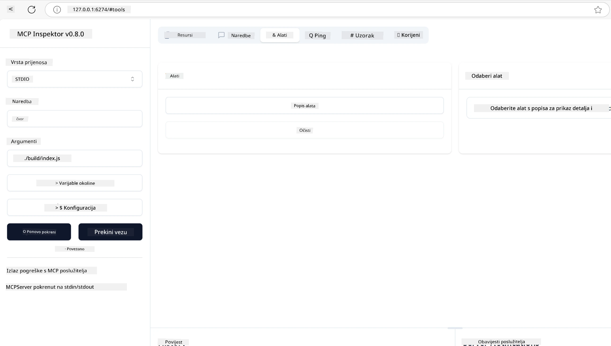
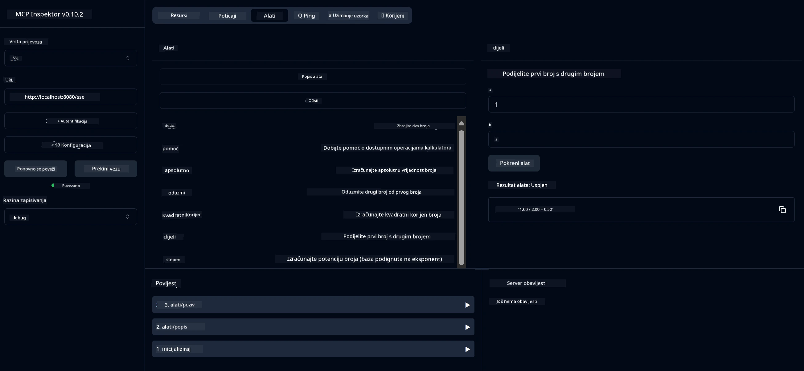
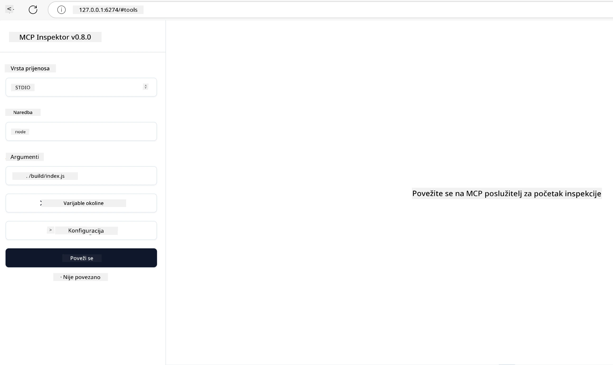
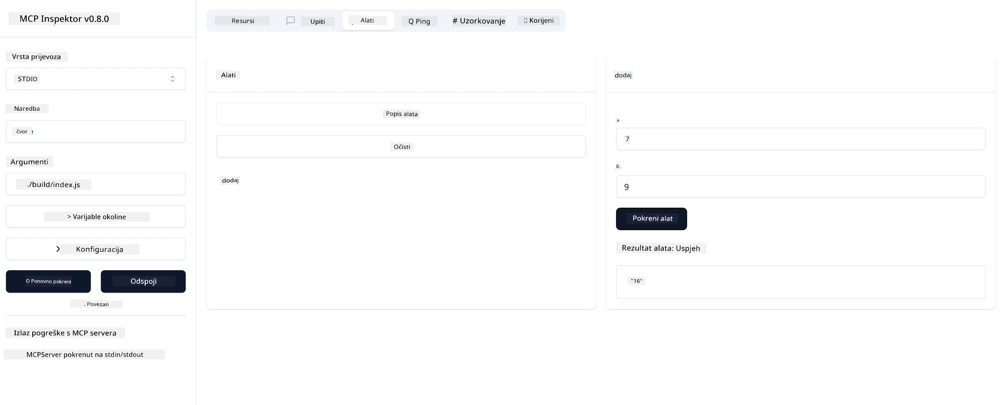

# Početak rada s MCP-om

Dobrodošli u svoje prve korake s Model Context Protocolom (MCP)! Bilo da ste novi u MCP-u ili želite produbiti svoje razumijevanje, ovaj vodič će vas provesti kroz osnovni postupak postavljanja i razvoja. Otkrit ćete kako MCP omogućuje besprijekornu integraciju između AI modela i aplikacija te naučiti kako brzo pripremiti svoje okruženje za izgradnju i testiranje rješenja pokretanih MCP-om.

> TLDR; Ako izrađujete AI aplikacije, znate da možete dodati alate i druge resurse svom LLM-u (velikom jezičnom modelu) kako biste LLM učinili informiranijim. Međutim, ako te alate i resurse postavite na poslužitelj, mogućnosti aplikacije i poslužitelja mogu koristiti bilo koji klijent s ili bez LLM-a.

## Pregled

Ova lekcija pruža praktične upute za postavljanje MCP okruženja i izradu vaših prvih MCP aplikacija. Naučit ćete kako postaviti potrebne alate i okvire, izgraditi osnovne MCP poslužitelje, kreirati host aplikacije i testirati svoje implementacije.

Model Context Protocol (MCP) je otvoreni protokol koji standardizira način na koji aplikacije pružaju kontekst LLM-ovima. Zamislite MCP kao USB-C priključak za AI aplikacije – pruža standardizirani način povezivanja AI modela s različitim izvorima podataka i alatima.

## Ciljevi učenja

Do kraja ove lekcije moći ćete:

- Postaviti razvojna okruženja za MCP u C#, Javi, Pythonu, TypeScriptu i Rustu
- Izgraditi i implementirati osnovne MCP poslužitelje s prilagođenim značajkama (resursi, upiti i alati)
- Kreirati host aplikacije koje se povezuju s MCP poslužiteljima
- Testirati i otklanjati pogreške u MCP implementacijama

## Postavljanje vašeg MCP okruženja

Prije nego što počnete raditi s MCP-om, važno je pripremiti razvojno okruženje i razumjeti osnovni tijek rada. Ovaj odjeljak će vas voditi kroz početne korake postavljanja kako biste osigurali glatki početak s MCP-om.

### Preduvjeti

Prije nego što zaronite u razvoj MCP-a, osigurajte da imate:

- **Razvojno okruženje**: Za odabrani jezik (C#, Java, Python, TypeScript ili Rust)
- **IDE/Uređivač**: Visual Studio, Visual Studio Code, IntelliJ, Eclipse, PyCharm ili bilo koji moderni uređivač koda
- **Upravitelji paketa**: NuGet, Maven/Gradle, pip, npm/yarn ili Cargo
- **API ključevi**: Za bilo koje AI usluge koje planirate koristiti u svojim host aplikacijama

## Osnovna struktura MCP poslužitelja

MCP poslužitelj obično uključuje:

- **Konfiguracija poslužitelja**: Postavljanje porta, autentikacije i drugih postavki
- **Resursi**: Podaci i kontekst dostupni LLM-ovima
- **Alati**: Funkcionalnosti koje modeli mogu pozivati
- **Upiti**: Predlošci za generiranje ili strukturiranje teksta

Evo pojednostavljenog primjera u TypeScriptu:

```typescript
import { McpServer, ResourceTemplate } from "@modelcontextprotocol/sdk/server/mcp.js";
import { StdioServerTransport } from "@modelcontextprotocol/sdk/server/stdio.js";
import { z } from "zod";

// Kreiraj MCP poslužitelj
const server = new McpServer({
  name: "Demo",
  version: "1.0.0"
});

// Dodaj alat za zbrajanje
server.tool("add",
  { a: z.number(), b: z.number() },
  async ({ a, b }) => ({
    content: [{ type: "text", text: String(a + b) }]
  })
);

// Dodaj dinamički resurs za pozdrav
server.resource(
  "file",
  // Parametar 'list' kontrolira kako resurs prikazuje dostupne datoteke. Postavljanje na undefined onemogućuje prikazivanje popisa za ovaj resurs.
  new ResourceTemplate("file://{path}", { list: undefined }),
  async (uri, { path }) => ({
    contents: [{
      uri: uri.href,
      text: `File, ${path}!`
    }]
  })
);

// Dodaj resurs datoteke koji čita sadržaj datoteke
server.resource(
  "file",
  new ResourceTemplate("file://{path}", { list: undefined }),
  async (uri, { path }) => {
    let text;
    try {
      text = await fs.readFile(path, "utf8");
    } catch (err) {
      text = `Error reading file: ${err.message}`;
    }
    return {
      contents: [{
        uri: uri.href,
        text
      }]
    };
  }
);

server.prompt(
  "review-code",
  { code: z.string() },
  ({ code }) => ({
    messages: [{
      role: "user",
      content: {
        type: "text",
        text: `Please review this code:\n\n${code}`
      }
    }]
  })
);

// Počni primati poruke na stdin i slati poruke na stdout
const transport = new StdioServerTransport();
await server.connect(transport);
```

U prethodnom kodu smo:

- Uvezli potrebne klase iz MCP TypeScript SDK-a.
- Kreirali i konfigurirali novu instancu MCP poslužitelja.
- Registrirali prilagođeni alat (`calculator`) s funkcijom rukovanja.
- Pokrenuli poslužitelj da sluša dolazne MCP zahtjeve.

## Testiranje i otklanjanje pogrešaka

Prije nego što počnete testirati svoj MCP poslužitelj, važno je razumjeti dostupne alate i najbolje prakse za otklanjanje pogrešaka. Učinkovito testiranje osigurava da se vaš poslužitelj ponaša kako se očekuje i pomaže vam brzo identificirati i riješiti probleme. Sljedeći odjeljak opisuje preporučene pristupe za provjeru vaše MCP implementacije.

MCP pruža alate koji vam pomažu testirati i otkloniti pogreške na vašim poslužiteljima:

- **Inspector alat**, ovaj grafički sučelje omogućuje vam povezivanje s vašim poslužiteljem i testiranje vaših alata, upita i resursa.
- **curl**, također se možete povezati s poslužiteljem koristeći alat naredbenog retka poput curl-a ili druge klijente koji mogu stvarati i izvršavati HTTP naredbe.

### Korištenje MCP Inspectora

[MCP Inspector](https://github.com/modelcontextprotocol/inspector) je vizualni alat za testiranje koji vam pomaže:

1. **Otkrivanje mogućnosti poslužitelja**: Automatski otkriva dostupne resurse, alate i upite
2. **Testiranje izvršavanja alata**: Isprobajte različite parametre i vidite odgovore u stvarnom vremenu
3. **Pregled metapodataka poslužitelja**: Pregledajte informacije o poslužitelju, sheme i konfiguracije

```bash
# primjer TypeScript, instalacija i pokretanje MCP Inspektora
npx @modelcontextprotocol/inspector node build/index.js
```

Kada pokrenete gore navedene naredbe, MCP Inspector će pokrenuti lokalno web sučelje u vašem pregledniku. Možete očekivati da ćete vidjeti nadzornu ploču koja prikazuje vaše registrirane MCP poslužitelje, njihove dostupne alate, resurse i upite. Sučelje vam omogućuje interaktivno testiranje izvršavanja alata, pregled metapodataka poslužitelja i prikaz odgovora u stvarnom vremenu, što olakšava provjeru i otklanjanje pogrešaka u vašim MCP implementacijama.

Evo snimke zaslona kako to može izgledati:



## Uobičajeni problemi s postavljanjem i rješenja

| Problem | Moguće rješenje |
|---------|-----------------|
| Veza odbijena | Provjerite je li poslužitelj pokrenut i je li port ispravan |
| Pogreške pri izvršavanju alata | Pregledajte validaciju parametara i rukovanje pogreškama |
| Neuspjeh autentikacije | Provjerite API ključeve i dozvole |
| Pogreške validacije sheme | Osigurajte da parametri odgovaraju definiranoj shemi |
| Poslužitelj se ne pokreće | Provjerite sukobe portova ili nedostajuće ovisnosti |
| CORS pogreške | Konfigurirajte ispravne CORS zaglavlja za zahtjeve s različitih izvora |
| Problemi s autentikacijom | Provjerite valjanost tokena i dozvole |

## Lokalni razvoj

Za lokalni razvoj i testiranje možete pokretati MCP poslužitelje izravno na svom računalu:

1. **Pokrenite proces poslužitelja**: Pokrenite svoju MCP poslužiteljsku aplikaciju
2. **Konfigurirajte mrežu**: Osigurajte da je poslužitelj dostupan na očekivanom portu
3. **Povežite klijente**: Koristite lokalne URL-ove za povezivanje poput `http://localhost:3000`

```bash
# Primjer: Pokretanje TypeScript MCP servera lokalno
npm run start
# Server radi na http://localhost:3000
```

## Izgradnja vašeg prvog MCP poslužitelja

Obradili smo [Osnovne koncepte](/01-CoreConcepts/README.md) u prethodnoj lekciji, sada je vrijeme da to znanje primijenimo.

### Što poslužitelj može raditi

Prije nego što počnemo pisati kod, podsjetimo se što poslužitelj može raditi:

MCP poslužitelj može, na primjer:

- Pristupati lokalnim datotekama i bazama podataka
- Povezivati se s udaljenim API-jima
- Izvoditi izračune
- Integrirati se s drugim alatima i uslugama
- Pružati korisničko sučelje za interakciju

Odlično, sada kada znamo što možemo za njega napraviti, krenimo s kodiranjem.

## Vježba: Kreiranje poslužitelja

Za kreiranje poslužitelja trebate slijediti ove korake:

- Instalirajte MCP SDK.
- Kreirajte projekt i postavite strukturu projekta.
- Napišite kod poslužitelja.
- Testirajte poslužitelj.

### -1- Kreirajte projekt

#### TypeScript

```sh
# Kreirajte direktorij projekta i inicijalizirajte npm projekt
mkdir calculator-server
cd calculator-server
npm init -y
```

#### Python

```sh
# Kreiraj direktorij projekta
mkdir calculator-server
cd calculator-server
# Otvori mapu u Visual Studio Code - Preskoči ovo ako koristiš drugi IDE
code .
```

#### .NET

```sh
dotnet new console -n McpCalculatorServer
cd McpCalculatorServer
```

#### Java

Za Javu, kreirajte Spring Boot projekt:

```bash
curl https://start.spring.io/starter.zip \
  -d dependencies=web \
  -d javaVersion=21 \
  -d type=maven-project \
  -d groupId=com.example \
  -d artifactId=calculator-server \
  -d name=McpServer \
  -d packageName=com.microsoft.mcp.sample.server \
  -o calculator-server.zip
```

Raspakirajte zip datoteku:

```bash
unzip calculator-server.zip -d calculator-server
cd calculator-server
# opcionalno uklonite neiskorišteni test
rm -rf src/test/java
```

Dodajte sljedeću kompletnu konfiguraciju u svoju *pom.xml* datoteku:

```xml
<?xml version="1.0" encoding="UTF-8"?>
<project xmlns="http://maven.apache.org/POM/4.0.0"
    xmlns:xsi="http://www.w3.org/2001/XMLSchema-instance"
    xsi:schemaLocation="http://maven.apache.org/POM/4.0.0 http://maven.apache.org/xsd/maven-4.0.0.xsd">
    <modelVersion>4.0.0</modelVersion>
    
    <!-- Spring Boot parent for dependency management -->
    <parent>
        <groupId>org.springframework.boot</groupId>
        <artifactId>spring-boot-starter-parent</artifactId>
        <version>3.5.0</version>
        <relativePath />
    </parent>

    <!-- Project coordinates -->
    <groupId>com.example</groupId>
    <artifactId>calculator-server</artifactId>
    <version>0.0.1-SNAPSHOT</version>
    <name>Calculator Server</name>
    <description>Basic calculator MCP service for beginners</description>

    <!-- Properties -->
    <properties>
        <java.version>21</java.version>
        <maven.compiler.source>21</maven.compiler.source>
        <maven.compiler.target>21</maven.compiler.target>
    </properties>

    <!-- Spring AI BOM for version management -->
    <dependencyManagement>
        <dependencies>
            <dependency>
                <groupId>org.springframework.ai</groupId>
                <artifactId>spring-ai-bom</artifactId>
                <version>1.0.0-SNAPSHOT</version>
                <type>pom</type>
                <scope>import</scope>
            </dependency>
        </dependencies>
    </dependencyManagement>

    <!-- Dependencies -->
    <dependencies>
        <dependency>
            <groupId>org.springframework.ai</groupId>
            <artifactId>spring-ai-starter-mcp-server-webflux</artifactId>
        </dependency>
        <dependency>
            <groupId>org.springframework.boot</groupId>
            <artifactId>spring-boot-starter-actuator</artifactId>
        </dependency>
        <dependency>
         <groupId>org.springframework.boot</groupId>
         <artifactId>spring-boot-starter-test</artifactId>
         <scope>test</scope>
      </dependency>
    </dependencies>

    <!-- Build configuration -->
    <build>
        <plugins>
            <plugin>
                <groupId>org.springframework.boot</groupId>
                <artifactId>spring-boot-maven-plugin</artifactId>
            </plugin>
            <plugin>
                <groupId>org.apache.maven.plugins</groupId>
                <artifactId>maven-compiler-plugin</artifactId>
                <configuration>
                    <release>21</release>
                </configuration>
            </plugin>
        </plugins>
    </build>

    <!-- Repositories for Spring AI snapshots -->
    <repositories>
        <repository>
            <id>spring-milestones</id>
            <name>Spring Milestones</name>
            <url>https://repo.spring.io/milestone</url>
            <snapshots>
                <enabled>false</enabled>
            </snapshots>
        </repository>
        <repository>
            <id>spring-snapshots</id>
            <name>Spring Snapshots</name>
            <url>https://repo.spring.io/snapshot</url>
            <releases>
                <enabled>false</enabled>
            </releases>
        </repository>
    </repositories>
</project>
```

#### Rust

```sh
mkdir calculator-server
cd calculator-server
cargo init
```

### -2- Dodajte ovisnosti

Sada kada ste kreirali projekt, dodajmo ovisnosti:

#### TypeScript

```sh
# Ako već nije instaliran, instalirajte TypeScript globalno
npm install typescript -g

# Instalirajte MCP SDK i Zod za validaciju sheme
npm install @modelcontextprotocol/sdk zod
npm install -D @types/node typescript
```

#### Python

```sh
# Kreirajte virtualno okruženje i instalirajte ovisnosti
python -m venv venv
venv\Scripts\activate
pip install "mcp[cli]"
```

#### Java

```bash
cd calculator-server
./mvnw clean install -DskipTests
```

#### Rust

```sh
cargo add rmcp --features server,transport-io
cargo add serde
cargo add tokio --features rt-multi-thread
```

### -3- Kreirajte datoteke projekta

#### TypeScript

Otvorite *package.json* datoteku i zamijenite sadržaj sljedećim kako biste osigurali da možete izgraditi i pokrenuti poslužitelj:

```json
{
  "name": "calculator-server",
  "version": "1.0.0",
  "main": "index.js",
  "type": "module",
  "scripts": {
    "build": "tsc",
    "start": "npm run build && node ./build/index.js",
  },
  "keywords": [],
  "author": "",
  "license": "ISC",
  "description": "A simple calculator server using Model Context Protocol",
  "dependencies": {
    "@modelcontextprotocol/sdk": "^1.16.0",
    "zod": "^3.25.76"
  },
  "devDependencies": {
    "@types/node": "^24.0.14",
    "typescript": "^5.8.3"
  }
}
```

Kreirajte *tsconfig.json* s ovim sadržajem:

```json
{
  "compilerOptions": {
    "target": "ES2022",
    "module": "Node16",
    "moduleResolution": "Node16",
    "outDir": "./build",
    "rootDir": "./src",
    "strict": true,
    "esModuleInterop": true,
    "skipLibCheck": true,
    "forceConsistentCasingInFileNames": true
  },
  "include": ["src/**/*"],
  "exclude": ["node_modules"]
}
```

Kreirajte direktorij za svoj izvorni kod:

```sh
mkdir src
touch src/index.ts
```

#### Python

Kreirajte datoteku *server.py*

```sh
touch server.py
```

#### .NET

Instalirajte potrebne NuGet pakete:

```sh
dotnet add package ModelContextProtocol --prerelease
dotnet add package Microsoft.Extensions.Hosting
```

#### Java

Za Java Spring Boot projekte, struktura projekta se automatski kreira.

#### Rust

Za Rust, *src/main.rs* datoteka se kreira prema zadanim postavkama kada pokrenete `cargo init`. Otvorite datoteku i obrišite zadani kod.

### -4- Kreirajte kod poslužitelja

#### TypeScript

Kreirajte datoteku *index.ts* i dodajte sljedeći kod:

```typescript
import { McpServer, ResourceTemplate } from "@modelcontextprotocol/sdk/server/mcp.js";
import { StdioServerTransport } from "@modelcontextprotocol/sdk/server/stdio.js";
import { z } from "zod";
 
// Kreirajte MCP poslužitelj
const server = new McpServer({
  name: "Calculator MCP Server",
  version: "1.0.0"
});
```

Sada imate poslužitelj, ali on ne radi mnogo, popravimo to.

#### Python

```python
# server.py
from mcp.server.fastmcp import FastMCP

# Kreiraj MCP poslužitelj
mcp = FastMCP("Demo")
```

#### .NET

```csharp
using Microsoft.Extensions.DependencyInjection;
using Microsoft.Extensions.Hosting;
using Microsoft.Extensions.Logging;
using ModelContextProtocol.Server;
using System.ComponentModel;

var builder = Host.CreateApplicationBuilder(args);
builder.Logging.AddConsole(consoleLogOptions =>
{
    // Configure all logs to go to stderr
    consoleLogOptions.LogToStandardErrorThreshold = LogLevel.Trace;
});

builder.Services
    .AddMcpServer()
    .WithStdioServerTransport()
    .WithToolsFromAssembly();
await builder.Build().RunAsync();

// add features
```

#### Java

Za Javu, kreirajte osnovne komponente poslužitelja. Prvo, izmijenite glavnu klasu aplikacije:

*src/main/java/com/microsoft/mcp/sample/server/McpServerApplication.java*:

```java
package com.microsoft.mcp.sample.server;

import org.springframework.ai.tool.ToolCallbackProvider;
import org.springframework.ai.tool.method.MethodToolCallbackProvider;
import org.springframework.boot.SpringApplication;
import org.springframework.boot.autoconfigure.SpringBootApplication;
import org.springframework.context.annotation.Bean;
import com.microsoft.mcp.sample.server.service.CalculatorService;

@SpringBootApplication
public class McpServerApplication {

    public static void main(String[] args) {
        SpringApplication.run(McpServerApplication.class, args);
    }
    
    @Bean
    public ToolCallbackProvider calculatorTools(CalculatorService calculator) {
        return MethodToolCallbackProvider.builder().toolObjects(calculator).build();
    }
}
```

Kreirajte servis kalkulatora *src/main/java/com/microsoft/mcp/sample/server/service/CalculatorService.java*:

```java
package com.microsoft.mcp.sample.server.service;

import org.springframework.ai.tool.annotation.Tool;
import org.springframework.stereotype.Service;

/**
 * Service for basic calculator operations.
 * This service provides simple calculator functionality through MCP.
 */
@Service
public class CalculatorService {

    /**
     * Add two numbers
     * @param a The first number
     * @param b The second number
     * @return The sum of the two numbers
     */
    @Tool(description = "Add two numbers together")
    public String add(double a, double b) {
        double result = a + b;
        return formatResult(a, "+", b, result);
    }

    /**
     * Subtract one number from another
     * @param a The number to subtract from
     * @param b The number to subtract
     * @return The result of the subtraction
     */
    @Tool(description = "Subtract the second number from the first number")
    public String subtract(double a, double b) {
        double result = a - b;
        return formatResult(a, "-", b, result);
    }

    /**
     * Multiply two numbers
     * @param a The first number
     * @param b The second number
     * @return The product of the two numbers
     */
    @Tool(description = "Multiply two numbers together")
    public String multiply(double a, double b) {
        double result = a * b;
        return formatResult(a, "*", b, result);
    }

    /**
     * Divide one number by another
     * @param a The numerator
     * @param b The denominator
     * @return The result of the division
     */
    @Tool(description = "Divide the first number by the second number")
    public String divide(double a, double b) {
        if (b == 0) {
            return "Error: Cannot divide by zero";
        }
        double result = a / b;
        return formatResult(a, "/", b, result);
    }

    /**
     * Calculate the power of a number
     * @param base The base number
     * @param exponent The exponent
     * @return The result of raising the base to the exponent
     */
    @Tool(description = "Calculate the power of a number (base raised to an exponent)")
    public String power(double base, double exponent) {
        double result = Math.pow(base, exponent);
        return formatResult(base, "^", exponent, result);
    }

    /**
     * Calculate the square root of a number
     * @param number The number to find the square root of
     * @return The square root of the number
     */
    @Tool(description = "Calculate the square root of a number")
    public String squareRoot(double number) {
        if (number < 0) {
            return "Error: Cannot calculate square root of a negative number";
        }
        double result = Math.sqrt(number);
        return String.format("√%.2f = %.2f", number, result);
    }

    /**
     * Calculate the modulus (remainder) of division
     * @param a The dividend
     * @param b The divisor
     * @return The remainder of the division
     */
    @Tool(description = "Calculate the remainder when one number is divided by another")
    public String modulus(double a, double b) {
        if (b == 0) {
            return "Error: Cannot divide by zero";
        }
        double result = a % b;
        return formatResult(a, "%", b, result);
    }

    /**
     * Calculate the absolute value of a number
     * @param number The number to find the absolute value of
     * @return The absolute value of the number
     */
    @Tool(description = "Calculate the absolute value of a number")
    public String absolute(double number) {
        double result = Math.abs(number);
        return String.format("|%.2f| = %.2f", number, result);
    }

    /**
     * Get help about available calculator operations
     * @return Information about available operations
     */
    @Tool(description = "Get help about available calculator operations")
    public String help() {
        return "Basic Calculator MCP Service\n\n" +
               "Available operations:\n" +
               "1. add(a, b) - Adds two numbers\n" +
               "2. subtract(a, b) - Subtracts the second number from the first\n" +
               "3. multiply(a, b) - Multiplies two numbers\n" +
               "4. divide(a, b) - Divides the first number by the second\n" +
               "5. power(base, exponent) - Raises a number to a power\n" +
               "6. squareRoot(number) - Calculates the square root\n" + 
               "7. modulus(a, b) - Calculates the remainder of division\n" +
               "8. absolute(number) - Calculates the absolute value\n\n" +
               "Example usage: add(5, 3) will return 5 + 3 = 8";
    }

    /**
     * Format the result of a calculation
     */
    private String formatResult(double a, String operator, double b, double result) {
        return String.format("%.2f %s %.2f = %.2f", a, operator, b, result);
    }
}
```

**Opcionalne komponente za proizvodni servis:**

Kreirajte konfiguraciju pokretanja *src/main/java/com/microsoft/mcp/sample/server/config/StartupConfig.java*:

```java
package com.microsoft.mcp.sample.server.config;

import org.springframework.boot.CommandLineRunner;
import org.springframework.context.annotation.Bean;
import org.springframework.context.annotation.Configuration;

@Configuration
public class StartupConfig {
    
    @Bean
    public CommandLineRunner startupInfo() {
        return args -> {
            System.out.println("\n" + "=".repeat(60));
            System.out.println("Calculator MCP Server is starting...");
            System.out.println("SSE endpoint: http://localhost:8080/sse");
            System.out.println("Health check: http://localhost:8080/actuator/health");
            System.out.println("=".repeat(60) + "\n");
        };
    }
}
```

Kreirajte kontroler zdravlja *src/main/java/com/microsoft/mcp/sample/server/controller/HealthController.java*:

```java
package com.microsoft.mcp.sample.server.controller;

import org.springframework.http.ResponseEntity;
import org.springframework.web.bind.annotation.GetMapping;
import org.springframework.web.bind.annotation.RestController;
import java.time.LocalDateTime;
import java.util.HashMap;
import java.util.Map;

@RestController
public class HealthController {
    
    @GetMapping("/health")
    public ResponseEntity<Map<String, Object>> healthCheck() {
        Map<String, Object> response = new HashMap<>();
        response.put("status", "UP");
        response.put("timestamp", LocalDateTime.now().toString());
        response.put("service", "Calculator MCP Server");
        return ResponseEntity.ok(response);
    }
}
```

Kreirajte rukovatelja iznimkama *src/main/java/com/microsoft/mcp/sample/server/exception/GlobalExceptionHandler.java*:

```java
package com.microsoft.mcp.sample.server.exception;

import org.springframework.http.HttpStatus;
import org.springframework.http.ResponseEntity;
import org.springframework.web.bind.annotation.ExceptionHandler;
import org.springframework.web.bind.annotation.RestControllerAdvice;

@RestControllerAdvice
public class GlobalExceptionHandler {

    @ExceptionHandler(IllegalArgumentException.class)
    public ResponseEntity<ErrorResponse> handleIllegalArgumentException(IllegalArgumentException ex) {
        ErrorResponse error = new ErrorResponse(
            "Invalid_Input", 
            "Invalid input parameter: " + ex.getMessage());
        return new ResponseEntity<>(error, HttpStatus.BAD_REQUEST);
    }

    public static class ErrorResponse {
        private String code;
        private String message;

        public ErrorResponse(String code, String message) {
            this.code = code;
            this.message = message;
        }

        // Dohvatitelji
        public String getCode() { return code; }
        public String getMessage() { return message; }
    }
}
```

Kreirajte prilagođeni banner *src/main/resources/banner.txt*:

```text
_____      _            _       _             
 / ____|    | |          | |     | |            
| |     __ _| | ___ _   _| | __ _| |_ ___  _ __ 
| |    / _` | |/ __| | | | |/ _` | __/ _ \| '__|
| |___| (_| | | (__| |_| | | (_| | || (_) | |   
 \_____\__,_|_|\___|\__,_|_|\__,_|\__\___/|_|   
                                                
Calculator MCP Server v1.0
Spring Boot MCP Application
```

</details>

#### Rust

Dodajte sljedeći kod na vrh *src/main.rs* datoteke. Ovo uvozi potrebne biblioteke i module za vaš MCP poslužitelj.

```rust
use rmcp::{
    handler::server::{router::tool::ToolRouter, tool::Parameters},
    model::{ServerCapabilities, ServerInfo},
    schemars, tool, tool_handler, tool_router,
    transport::stdio,
    ServerHandler, ServiceExt,
};
use std::error::Error;
```

Kalkulator poslužitelj bit će jednostavan koji može zbrajati dva broja. Kreirajmo strukturu koja predstavlja zahtjev kalkulatora.

```rust
#[derive(Debug, serde::Deserialize, schemars::JsonSchema)]
pub struct CalculatorRequest {
    pub a: f64,
    pub b: f64,
}
```

Zatim, kreirajte strukturu koja predstavlja kalkulator poslužitelj. Ova struktura će držati usmjerivač alata, koji se koristi za registraciju alata.

```rust
#[derive(Debug, Clone)]
pub struct Calculator {
    tool_router: ToolRouter<Self>,
}
```

Sada možemo implementirati `Calculator` strukturu za kreiranje nove instance poslužitelja i implementirati rukovatelja poslužitelja za pružanje informacija o poslužitelju.

```rust
#[tool_router]
impl Calculator {
    pub fn new() -> Self {
        Self {
            tool_router: Self::tool_router(),
        }
    }
}

#[tool_handler]
impl ServerHandler for Calculator {
    fn get_info(&self) -> ServerInfo {
        ServerInfo {
            instructions: Some("A simple calculator tool".into()),
            capabilities: ServerCapabilities::builder().enable_tools().build(),
            ..Default::default()
        }
    }
}
```

Na kraju, trebamo implementirati glavnu funkciju za pokretanje poslužitelja. Ova funkcija će kreirati instancu `Calculator` strukture i služiti je preko standardnog ulaza/izlaza.

```rust
#[tokio::main]
async fn main() -> Result<(), Box<dyn Error>> {
    let service = Calculator::new().serve(stdio()).await?;
    service.waiting().await?;
    Ok(())
}
```

Poslužitelj je sada postavljen da pruža osnovne informacije o sebi. Sljedeće ćemo dodati alat za izvođenje zbrajanja.

### -5- Dodavanje alata i resursa

Dodajte alat i resurs dodavanjem sljedećeg koda:

#### TypeScript

```typescript
server.tool(
  "add",
  { a: z.number(), b: z.number() },
  async ({ a, b }) => ({
    content: [{ type: "text", text: String(a + b) }]
  })
);

server.resource(
  "greeting",
  new ResourceTemplate("greeting://{name}", { list: undefined }),
  async (uri, { name }) => ({
    contents: [{
      uri: uri.href,
      text: `Hello, ${name}!`
    }]
  })
);
```

Vaš alat prima parametre `a` i `b` i izvršava funkciju koja proizvodi odgovor u obliku:

```typescript
{
  contents: [{
    type: "text", content: "some content"
  }]
}
```

Vaš resurs se pristupa putem stringa "greeting" i prima parametar `name` te proizvodi sličan odgovor kao alat:

```typescript
{
  uri: "<href>",
  text: "a text"
}
```

#### Python

```python
# Dodajte alat za zbrajanje
@mcp.tool()
def add(a: int, b: int) -> int:
    """Add two numbers"""
    return a + b


# Dodajte dinamički resurs za pozdrav
@mcp.resource("greeting://{name}")
def get_greeting(name: str) -> str:
    """Get a personalized greeting"""
    return f"Hello, {name}!"
```

U prethodnom kodu smo:

- Definirali alat `add` koji prima parametre `a` i `b`, oba cijeli brojevi.
- Kreirali resurs nazvan `greeting` koji prima parametar `name`.

#### .NET

Dodajte ovo u svoju Program.cs datoteku:

```csharp
[McpServerToolType]
public static class CalculatorTool
{
    [McpServerTool, Description("Adds two numbers")]
    public static string Add(int a, int b) => $"Sum {a + b}";
}
```

#### Java

Alati su već kreirani u prethodnom koraku.

#### Rust

Dodajte novi alat unutar `impl Calculator` bloka:

```rust
#[tool(description = "Adds a and b")]
async fn add(
    &self,
    Parameters(CalculatorRequest { a, b }): Parameters<CalculatorRequest>,
) -> String {
    (a + b).to_string()
}
```

### -6- Završni kod

Dodajmo posljednji kod koji nam treba da poslužitelj može početi raditi:

#### TypeScript

```typescript
// Počni primati poruke na stdin i slati poruke na stdout
const transport = new StdioServerTransport();
await server.connect(transport);
```

Evo kompletnog koda:

```typescript
// index.ts
import { McpServer, ResourceTemplate } from "@modelcontextprotocol/sdk/server/mcp.js";
import { StdioServerTransport } from "@modelcontextprotocol/sdk/server/stdio.js";
import { z } from "zod";

// Kreiraj MCP poslužitelj
const server = new McpServer({
  name: "Calculator MCP Server",
  version: "1.0.0"
});

// Dodaj alat za zbrajanje
server.tool(
  "add",
  { a: z.number(), b: z.number() },
  async ({ a, b }) => ({
    content: [{ type: "text", text: String(a + b) }]
  })
);

// Dodaj dinamički resurs pozdrava
server.resource(
  "greeting",
  new ResourceTemplate("greeting://{name}", { list: undefined }),
  async (uri, { name }) => ({
    contents: [{
      uri: uri.href,
      text: `Hello, ${name}!`
    }]
  })
);

// Počni primati poruke na stdin i slati poruke na stdout
const transport = new StdioServerTransport();
server.connect(transport);
```

#### Python

```python
# server.py
from mcp.server.fastmcp import FastMCP

# Kreiraj MCP poslužitelj
mcp = FastMCP("Demo")


# Dodaj alat za zbrajanje
@mcp.tool()
def add(a: int, b: int) -> int:
    """Add two numbers"""
    return a + b


# Dodaj dinamički resurs za pozdrav
@mcp.resource("greeting://{name}")
def get_greeting(name: str) -> str:
    """Get a personalized greeting"""
    return f"Hello, {name}!"

# Glavni blok izvršavanja - ovo je potrebno za pokretanje poslužitelja
if __name__ == "__main__":
    mcp.run()
```

#### .NET

Kreirajte Program.cs datoteku sa sljedećim sadržajem:

```csharp
using Microsoft.Extensions.DependencyInjection;
using Microsoft.Extensions.Hosting;
using Microsoft.Extensions.Logging;
using ModelContextProtocol.Server;
using System.ComponentModel;

var builder = Host.CreateApplicationBuilder(args);
builder.Logging.AddConsole(consoleLogOptions =>
{
    // Configure all logs to go to stderr
    consoleLogOptions.LogToStandardErrorThreshold = LogLevel.Trace;
});

builder.Services
    .AddMcpServer()
    .WithStdioServerTransport()
    .WithToolsFromAssembly();
await builder.Build().RunAsync();

[McpServerToolType]
public static class CalculatorTool
{
    [McpServerTool, Description("Adds two numbers")]
    public static string Add(int a, int b) => $"Sum {a + b}";
}
```

#### Java

Vaša kompletna glavna klasa aplikacije trebala bi izgledati ovako:

```java
// McpServerApplication.java
package com.microsoft.mcp.sample.server;

import org.springframework.ai.tool.ToolCallbackProvider;
import org.springframework.ai.tool.method.MethodToolCallbackProvider;
import org.springframework.boot.SpringApplication;
import org.springframework.boot.autoconfigure.SpringBootApplication;
import org.springframework.context.annotation.Bean;
import com.microsoft.mcp.sample.server.service.CalculatorService;

@SpringBootApplication
public class McpServerApplication {

    public static void main(String[] args) {
        SpringApplication.run(McpServerApplication.class, args);
    }
    
    @Bean
    public ToolCallbackProvider calculatorTools(CalculatorService calculator) {
        return MethodToolCallbackProvider.builder().toolObjects(calculator).build();
    }
}
```

#### Rust

Završni kod za Rust poslužitelj trebao bi izgledati ovako:

```rust
use rmcp::{
    ServerHandler, ServiceExt,
    handler::server::{router::tool::ToolRouter, tool::Parameters},
    model::{ServerCapabilities, ServerInfo},
    schemars, tool, tool_handler, tool_router,
    transport::stdio,
};
use std::error::Error;

#[derive(Debug, serde::Deserialize, schemars::JsonSchema)]
pub struct CalculatorRequest {
    pub a: f64,
    pub b: f64,
}

#[derive(Debug, Clone)]
pub struct Calculator {
    tool_router: ToolRouter<Self>,
}

#[tool_router]
impl Calculator {
    pub fn new() -> Self {
        Self {
            tool_router: Self::tool_router(),
        }
    }
    
    #[tool(description = "Adds a and b")]
    async fn add(
        &self,
        Parameters(CalculatorRequest { a, b }): Parameters<CalculatorRequest>,
    ) -> String {
        (a + b).to_string()
    }
}

#[tool_handler]
impl ServerHandler for Calculator {
    fn get_info(&self) -> ServerInfo {
        ServerInfo {
            instructions: Some("A simple calculator tool".into()),
            capabilities: ServerCapabilities::builder().enable_tools().build(),
            ..Default::default()
        }
    }
}

#[tokio::main]
async fn main() -> Result<(), Box<dyn Error>> {
    let service = Calculator::new().serve(stdio()).await?;
    service.waiting().await?;
    Ok(())
}
```

### -7- Testirajte poslužitelj

Pokrenite poslužitelj sljedećom naredbom:

#### TypeScript

```sh
npm run build
```

#### Python

```sh
mcp run server.py
```

> Za korištenje MCP Inspectora, koristite `mcp dev server.py` koji automatski pokreće Inspector i pruža potrebni proxy session token. Ako koristite `mcp run server.py`, morat ćete ručno pokrenuti Inspector i konfigurirati vezu.

#### .NET

Provjerite jeste li u direktoriju svog projekta:

```sh
cd McpCalculatorServer
dotnet run
```

#### Java

```bash
./mvnw clean install -DskipTests
java -jar target/calculator-server-0.0.1-SNAPSHOT.jar
```

#### Rust

Pokrenite sljedeće naredbe za formatiranje i pokretanje poslužitelja:

```sh
cargo fmt
cargo run
```

### -8- Pokretanje pomoću inspectora

Inspector je izvrstan alat koji može pokrenuti vaš poslužitelj i omogućiti vam interakciju s njim kako biste testirali da radi. Pokrenimo ga:

> [!NOTE]
> može izgledati drugačije u polju "command" jer sadrži naredbu za pokretanje poslužitelja s vašim specifičnim runtime-om

#### TypeScript

```sh
npx @modelcontextprotocol/inspector node build/index.js
```

ili ga dodajte u svoj *package.json* ovako: `"inspector": "npx @modelcontextprotocol/inspector node build/index.js"` i zatim pokrenite `npm run inspector`

#### Python

Python koristi Node.js alat nazvan inspector. Moguće je pozvati taj alat ovako:

```sh
mcp dev server.py
```

Međutim, ne implementira sve metode dostupne na alatu pa se preporučuje da pokrenete Node.js alat izravno kao dolje:

```sh
npx @modelcontextprotocol/inspector mcp run server.py
```

Ako koristite alat ili IDE koji vam omogućuje konfiguriranje naredbi i argumenata za pokretanje skripti,
pobrinite se da je u polju `Command` postavljen `python`, a u polju `Arguments` `server.py`. To osigurava ispravan rad skripte.

#### .NET

Provjerite jeste li u direktoriju svog projekta:

```sh
cd McpCalculatorServer
npx @modelcontextprotocol/inspector dotnet run
```

#### Java

Provjerite da je vaš kalkulator server pokrenut
Zatim pokrenite inspektor:

```cmd
npx @modelcontextprotocol/inspector
```

U web sučelju inspektora:

1. Odaberite "SSE" kao tip prijenosa
2. Postavite URL na: `http://localhost:8080/sse`
3. Kliknite "Connect"



**Sada ste povezani sa serverom**
**Sekcija testiranja Java servera je sada završena**

Sljedeća sekcija odnosi se na interakciju sa serverom.

Trebali biste vidjeti sljedeće korisničko sučelje:



1. Povežite se sa serverom odabirom gumba Connect
  Nakon povezivanja sa serverom, trebali biste vidjeti sljedeće:

  

1. Odaberite "Tools" i "listTools", trebali biste vidjeti da se pojavljuje "Add", odaberite "Add" i ispunite vrijednosti parametara.

  Trebali biste vidjeti sljedeći odgovor, tj. rezultat iz "add" alata:

  

Čestitamo, uspjeli ste kreirati i pokrenuti svoj prvi server!

#### Rust

Za pokretanje Rust servera s MCP Inspector CLI-jem, koristite sljedeću naredbu:

```sh
npx @modelcontextprotocol/inspector cargo run --cli --method tools/call --tool-name add --tool-arg a=1 b=2
```

### Službeni SDK-ovi

MCP pruža službene SDK-ove za više jezika:

- [C# SDK](https://github.com/modelcontextprotocol/csharp-sdk) - Održava se u suradnji s Microsoftom
- [Java SDK](https://github.com/modelcontextprotocol/java-sdk) - Održava se u suradnji sa Spring AI
- [TypeScript SDK](https://github.com/modelcontextprotocol/typescript-sdk) - Službena TypeScript implementacija
- [Python SDK](https://github.com/modelcontextprotocol/python-sdk) - Službena Python implementacija
- [Kotlin SDK](https://github.com/modelcontextprotocol/kotlin-sdk) - Službena Kotlin implementacija
- [Swift SDK](https://github.com/modelcontextprotocol/swift-sdk) - Održava se u suradnji s Loopwork AI
- [Rust SDK](https://github.com/modelcontextprotocol/rust-sdk) - Službena Rust implementacija

## Ključne spoznaje

- Postavljanje MCP razvojne okoline je jednostavno uz SDK-ove specifične za jezik
- Izgradnja MCP servera uključuje kreiranje i registraciju alata s jasnim shemama
- Testiranje i otklanjanje pogrešaka su ključni za pouzdane MCP implementacije

## Primjeri

- [Java Calculator](../samples/java/calculator/README.md)
- [.Net Calculator](../../../../03-GettingStarted/samples/csharp)
- [JavaScript Calculator](../samples/javascript/README.md)
- [TypeScript Calculator](../samples/typescript/README.md)
- [Python Calculator](../../../../03-GettingStarted/samples/python)
- [Rust Calculator](../../../../03-GettingStarted/samples/rust)

## Zadatak

Kreirajte jednostavan MCP server s alatom po vašem izboru:

1. Implementirajte alat u željenom jeziku (.NET, Java, Python, TypeScript ili Rust).
2. Definirajte ulazne parametre i povratne vrijednosti.
3. Pokrenite inspektor alat kako biste osigurali da server radi ispravno.
4. Testirajte implementaciju s različitim ulazima.

## Rješenje

[Rješenje](./solution/README.md)

## Dodatni resursi

- [Izgradnja agenata koristeći Model Context Protocol na Azureu](https://learn.microsoft.com/azure/developer/ai/intro-agents-mcp)
- [Remote MCP s Azure Container Apps (Node.js/TypeScript/JavaScript)](https://learn.microsoft.com/samples/azure-samples/mcp-container-ts/mcp-container-ts/)
- [.NET OpenAI MCP Agent](https://learn.microsoft.com/samples/azure-samples/openai-mcp-agent-dotnet/openai-mcp-agent-dotnet/)

## Što slijedi

Sljedeće: [Uvod u MCP klijente](../02-client/README.md)

---

<!-- CO-OP TRANSLATOR DISCLAIMER START -->
**Odricanje od odgovornosti**:
Ovaj dokument preveden je pomoću AI usluge za prevođenje [Co-op Translator](https://github.com/Azure/co-op-translator). Iako nastojimo postići točnost, imajte na umu da automatski prijevodi mogu sadržavati pogreške ili netočnosti. Izvorni dokument na izvornom jeziku treba smatrati autoritativnim izvorom. Za kritične informacije preporučuje se profesionalni ljudski prijevod. Ne snosimo odgovornost za bilo kakva nesporazuma ili pogrešna tumačenja koja proizlaze iz korištenja ovog prijevoda.
<!-- CO-OP TRANSLATOR DISCLAIMER END -->