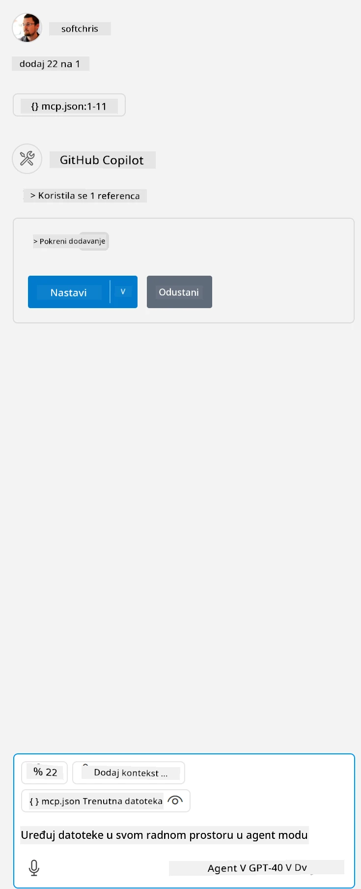

Ovo odgovara pokretanju naredbe poput: `node build/index.js`.

- Promijenite ovaj unos servera tako da odgovara lokaciji vaše server datoteke ili onome što je potrebno za pokretanje servera, ovisno o odabranom runtime-u i lokaciji servera.

## Korištenje značajki u serveru

- Kliknite na ikonu `play`, nakon što ste dodali *mcp.json* u mapu *./vscode*,

    Primijetite promjenu ikone alata koja pokazuje povećanje broja dostupnih alata. Ikona alata nalazi se odmah iznad polja za chat u GitHub Copilot-u.

## Pokretanje alata

- Upišite upit u prozor chata koji odgovara opisu vašeg alata. Na primjer, za pokretanje alata `add` upišite nešto poput "add 3 to 20".

    Trebali biste vidjeti alat prikazan iznad tekstnog okvira za chat koji vas poziva da ga odaberete za pokretanje, kao na ovom prikazu:

    

    Odabirom alata trebali biste dobiti numerički rezultat "23" ako je vaš upit bio kao što smo prethodno naveli.

**Odricanje od odgovornosti**:  
Ovaj dokument je preveden korištenjem AI usluge za prevođenje [Co-op Translator](https://github.com/Azure/co-op-translator). Iako težimo točnosti, imajte na umu da automatski prijevodi mogu sadržavati pogreške ili netočnosti. Izvorni dokument na izvornom jeziku treba smatrati službenim i autoritativnim izvorom. Za kritične informacije preporučuje se profesionalni ljudski prijevod. Ne snosimo odgovornost za bilo kakva nesporazuma ili pogrešna tumačenja koja proizlaze iz korištenja ovog prijevoda.