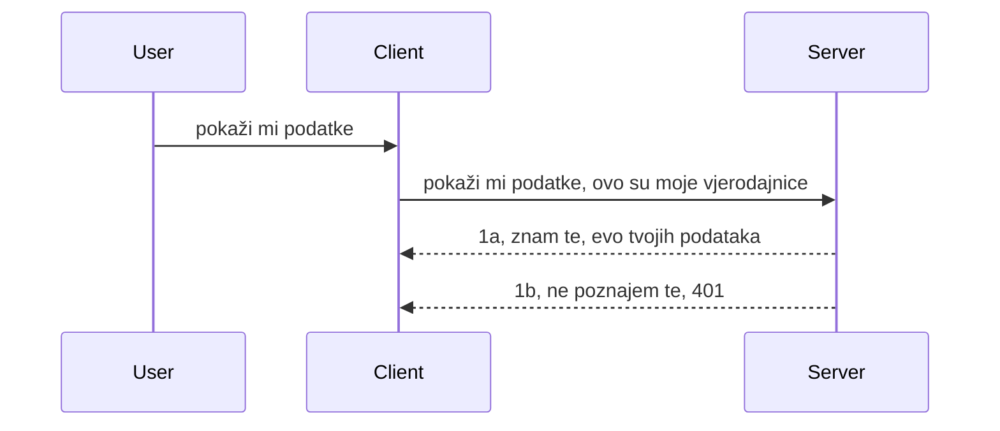

# Simple auth

MCP SDK podržavaju korištenje OAuth 2.1 što je, da budemo iskreni, prilično složen proces koji uključuje koncepte poput auth servera, resource servera, slanja vjerodajnica, dobivanja koda, zamjene koda za bearer token dok konačno ne dobijete podatke resursa. Ako niste upoznati s OAuth-om, što je sjajna stvar za implementirati, dobra je ideja početi s nekom osnovnom razinom autentikacije i razvijati se prema sve boljoj i boljoj sigurnosti. Zato ovaj poglavlje postoji, da vas izgradi do naprednije autentikacije.

## Auth, što pod tim mislimo?

Auth je skraćenica za autentikaciju i autorizaciju. Ideja je da treba učiniti dvije stvari:

- **Autentikacija**, što je proces utvrđivanja dopuštamo li osobi da uđe u naš dom, da li imaju pravo biti "ovdje", odnosno imati pristup našem resource serveru gdje se nalaze značajke našeg MCP Servera.
- **Autorizacija**, je proces utvrđivanja ima li korisnik pristup tim specifičnim resursima za koje traži pristup, na primjer te narudžbe ili ti proizvodi ili smije li samo čitati sadržaj, ali ne i brisati kao drugi primjer.

## Vjerodajnice: kako kažemo sustavu tko smo

Većina web programera obično razmišlja u smislu slanja vjerodajnice serveru, obično tajni podatak koji kaže imaju li dozvolu biti ovdje "Autentikacija". Ta vjerodajnica obično je base64 kodirana verzija korisničkog imena i lozinke ili API ključ koji jedinstveno identificira određenog korisnika.

To uključuje slanje putem zaglavlja nazvanog "Authorization" ovako:

```json
{ "Authorization": "secret123" }
```

Ovo se obično naziva osnovna autentikacija (basic authentication). Kako ukupni tijek zatim funkcionira je na sljedeći način:


Sad kad razumijemo kako to funkcionira s aspekta tijeka, kako ga implementirati? Većina web servera ima koncept koji se zove middleware, dio koda koji se izvršava kao dio zahtjeva i može provjeriti vjerodajnice, a ako su vjerodajnice valjane može pustiti zahtjev da prođe. Ako zahtjev nema valjane vjerodajnice, dobit ćete auth grešku. Pogledajmo kako se to može implementirati:

**Python**

```python
class AuthMiddleware(BaseHTTPMiddleware):
    async def dispatch(self, request, call_next):

        has_header = request.headers.get("Authorization")
        if not has_header:
            print("-> Missing Authorization header!")
            return Response(status_code=401, content="Unauthorized")

        if not valid_token(has_header):
            print("-> Invalid token!")
            return Response(status_code=403, content="Forbidden")

        print("Valid token, proceeding...")
       
        response = await call_next(request)
        # dodajte bilo koje korisničke zaglavlja ili na neki način promijenite odgovor
        return response


starlette_app.add_middleware(CustomHeaderMiddleware)
```

Ovdje imamo:

- Kreiran middleware nazvan `AuthMiddleware` čija se metoda `dispatch` poziva od strane web servera.
- Dodan middleware u web server:

    ```python
    starlette_app.add_middleware(AuthMiddleware)
    ```

- Napisana logika validacije koja provjerava nalazi li se zaglavlje Authorization i je li poslana tajna valjana:

    ```python
    has_header = request.headers.get("Authorization")
    if not has_header:
        print("-> Missing Authorization header!")
        return Response(status_code=401, content="Unauthorized")

    if not valid_token(has_header):
        print("-> Invalid token!")
        return Response(status_code=403, content="Forbidden")
    ```

    Ako je tajna prisutna i valjana, pustimo zahtjev da prođe pozivom `call_next` i vratimo odgovor.

    ```python
    response = await call_next(request)
    # dodajte bilo koje korisničke zaglavlja ili na neki način promijenite odgovor
    return response
    ```

Kako to radi je da će middleware biti pozvan ako se napravi web zahtjev prema serveru i s obzirom na implementaciju, ili će pustiti zahtjev da prođe ili će vratiti grešku koja indicira da klijent nema pravo nastaviti.

**TypeScript**

Ovdje kreiramo middleware s popularnim frameworkom Express i prekidamo zahtjev prije nego što dođe do MCP Servera. Evo koda za to:

```typescript
function isValid(secret) {
    return secret === "secret123";
}

app.use((req, res, next) => {
    // 1. Je li zaglavlje ovlaštenja prisutno?
    if(!req.headers["Authorization"]) {
        res.status(401).send('Unauthorized');
    }
    
    let token = req.headers["Authorization"];

    // 2. Provjerite valjanost.
    if(!isValid(token)) {
        res.status(403).send('Forbidden');
    }

   
    console.log('Middleware executed');
    // 3. Prosljeđuje zahtjev na sljedeći korak u cjevovodu zahtjeva.
    next();
});
```

U ovom kodu:

1. Provjeravamo je li zaglavlje Authorization uopće prisutno, ako nije, šaljemo 401 grešku.
2. Provjeravamo je li vjerodajnica/token valjan, ako nije, šaljemo 403 grešku.
3. Na kraju prosljeđuje zahtjev u cijev zahtjeva i vraća traženi resurs.

## Vježba: Implementirajte autentikaciju

Uzmemo naše znanje i pokušamo implementirati. Evo plana:

Server

- Kreirati web server i MCP instancu.
- Implementirati middleware za server.

Klijent

- Poslati web zahtjev, s vjerodajnicom, preko zaglavlja.

### -1- Kreirajte web server i MCP instancu

U prvom koraku moramo kreirati instancu web servera i MCP Server.

**Python**

Ovdje kreiramo instancu MCP servera, kreiramo starlette web aplikaciju i hostamo je putem uvicorn.

```python
# kreiranje MCP poslužitelja

app = FastMCP(
    name="MCP Resource Server",
    instructions="Resource Server that validates tokens via Authorization Server introspection",
    host=settings["host"],
    port=settings["port"],
    debug=True
)

# kreiranje starlette web aplikacije
starlette_app = app.streamable_http_app()

# pokretanje aplikacije putem uvicorn
async def run(starlette_app):
    import uvicorn
    config = uvicorn.Config(
            starlette_app,
            host=app.settings.host,
            port=app.settings.port,
            log_level=app.settings.log_level.lower(),
        )
    server = uvicorn.Server(config)
    await server.serve()

run(starlette_app)
```

U ovom kodu:

- Kreiramo MCP Server.
- Konstruiramo starlette web app iz MCP Servera, `app.streamable_http_app()`.
- Hostamo i služimo web app koristeći uvicorn `server.serve()`.

**TypeScript**

Ovdje kreiramo MCP Server instancu.

```typescript
const server = new McpServer({
      name: "example-server",
      version: "1.0.0"
    });

    // ... postavite resurse poslužitelja, alate i upute ...
```

Ovu kreaciju MCP Servera moramo napraviti unutar definicije rute POST /mcp, pa uzmimo gornji kod i premjestimo ga ovako:

```typescript
import express from "express";
import { randomUUID } from "node:crypto";
import { McpServer } from "@modelcontextprotocol/sdk/server/mcp.js";
import { StreamableHTTPServerTransport } from "@modelcontextprotocol/sdk/server/streamableHttp.js";
import { isInitializeRequest } from "@modelcontextprotocol/sdk/types.js"

const app = express();
app.use(express.json());

// Mapa za spremanje transporta po ID-u sesije
const transports: { [sessionId: string]: StreamableHTTPServerTransport } = {};

// Obradi POST zahtjeve za komunikaciju klijent-poslužitelj
app.post('/mcp', async (req, res) => {
  // Provjeri postoji li ID sesije
  const sessionId = req.headers['mcp-session-id'] as string | undefined;
  let transport: StreamableHTTPServerTransport;

  if (sessionId && transports[sessionId]) {
    // Ponovno upotrijebi postojeći transport
    transport = transports[sessionId];
  } else if (!sessionId && isInitializeRequest(req.body)) {
    // Novi zahtjev za inicijalizaciju
    transport = new StreamableHTTPServerTransport({
      sessionIdGenerator: () => randomUUID(),
      onsessioninitialized: (sessionId) => {
        // Spremi transport po ID-u sesije
        transports[sessionId] = transport;
      },
      // Zaštita od DNS rebindinga je prema zadanim postavkama isključena radi unatrag kompatibilnosti. Ako pokrećete ovaj poslužitelj
      // lokalno, pobrinite se da postavite:
      // enableDnsRebindingProtection: true,
      // allowedHosts: ['127.0.0.1'],
    });

    // Očisti transport kada se zatvori
    transport.onclose = () => {
      if (transport.sessionId) {
        delete transports[transport.sessionId];
      }
    };
    const server = new McpServer({
      name: "example-server",
      version: "1.0.0"
    });

    // ... postavi resurse poslužitelja, alate i naredbe ...

    // Poveži se na MCP poslužitelj
    await server.connect(transport);
  } else {
    // Nevažeći zahtjev
    res.status(400).json({
      jsonrpc: '2.0',
      error: {
        code: -32000,
        message: 'Bad Request: No valid session ID provided',
      },
      id: null,
    });
    return;
  }

  // Obradi zahtjev
  await transport.handleRequest(req, res, req.body);
});

// Ponovno upotrebljivi rukovatelj za GET i DELETE zahtjeve
const handleSessionRequest = async (req: express.Request, res: express.Response) => {
  const sessionId = req.headers['mcp-session-id'] as string | undefined;
  if (!sessionId || !transports[sessionId]) {
    res.status(400).send('Invalid or missing session ID');
    return;
  }
  
  const transport = transports[sessionId];
  await transport.handleRequest(req, res);
};

// Obradi GET zahtjeve za obavijesti s poslužitelja na klijenta preko SSE-a
app.get('/mcp', handleSessionRequest);

// Obradi DELETE zahtjeve za završetak sesije
app.delete('/mcp', handleSessionRequest);

app.listen(3000);
```

Sada vidite kako je kreacija MCP Servera premještena unutar `app.post("/mcp")`.

Krenimo na sljedeći korak stvaranja middlewarea kako bismo mogli validirati dolazne vjerodajnice.

### -2- Implementirajte middleware za server

Sljedeće je implementacija middleware dijela. Ovdje ćemo napraviti middleware koji traži vjerodajnicu u `Authorization` zaglavlju i validira je. Ako je prihvatljiva, zahtjev će ići dalje da radi što treba (npr. navesti alate, čitati resurs ili bilo koju MCP funkcionalnost za koju klijent traži).

**Python**

Za kreiranje middlewarea, trebamo napraviti klasu koja nasljeđuje `BaseHTTPMiddleware`. Dva su zanimljiva dijela:

- Zahtjev `request`, iz kojeg čitamo zaglavlja.
- `call_next` callback koji trebamo pozvati ako klijent ima prihvatljivu vjerodajnicu.

Prvo, moramo obraditi slučaj ako `Authorization` zaglavlje nedostaje:

```python
has_header = request.headers.get("Authorization")

# ne postoji zaglavlje, neuspjeh s 401, inače nastavi dalje.
if not has_header:
    print("-> Missing Authorization header!")
    return Response(status_code=401, content="Unauthorized")
```

Ovdje šaljemo poruku 401 unauthorized jer klijent nije uspio u autentikaciji.

Sljedeće, ako je vjerodajnica poslana, provjeravamo je li valjana ovako:

```python
 if not valid_token(has_header):
    print("-> Invalid token!")
    return Response(status_code=403, content="Forbidden")
```

Primijetite kako ovdje šaljemo poruku 403 forbidden. Pogledajmo cjeloviti middleware koji implementira sve gore navedeno:

```python
class AuthMiddleware(BaseHTTPMiddleware):
    async def dispatch(self, request, call_next):

        has_header = request.headers.get("Authorization")
        if not has_header:
            print("-> Missing Authorization header!")
            return Response(status_code=401, content="Unauthorized")

        if not valid_token(has_header):
            print("-> Invalid token!")
            return Response(status_code=403, content="Forbidden")

        print("Valid token, proceeding...")
        print(f"-> Received {request.method} {request.url}")
        response = await call_next(request)
        response.headers['Custom'] = 'Example'
        return response

```

Super, ali što je s funkcijom `valid_token`? Evo je ispod:
:

```python
# NE koristite za produkciju - poboljšajte to !!
def valid_token(token: str) -> bool:
    # uklonite prefiks "Bearer "
    if token.startswith("Bearer "):
        token = token[7:]
        return token == "secret-token"
    return False
```

Ovo se naravno može unaprijediti.

VAŽNO: Nikada ne biste smjeli imati tajne poput ovih u kodu. Idealno je da vrijednost s kojom se uspoređujete dohvatite iz izvora podataka ili od IDP (identity service provider) ili još bolje, neka IDP izvrši validaciju.

**TypeScript**

Za implementaciju s Express-om, treba pozvati metodu `use` koja prima middleware funkcije.

Moramo:

- Interagirati s varijablom zahtjeva kako bismo provjerili poslanu vjerodajnicu u svojstvu `Authorization`.
- Validirati vjerodajnicu, a ako je valjana dozvoliti zahtjevu da nastavi i da MCP zahtjev klijenta izvrši što treba (npr. navesti alate, čitati resurs ili bilo što drugo vezano za MCP).

Ovdje provjeravamo postoji li `Authorization` zaglavlje i ako ne, zaustavljamo zahtjev:

```typescript
if(!req.headers["authorization"]) {
    res.status(401).send('Unauthorized');
    return;
}
```

Ako zaglavlje uopće nije poslano, dobijete 401.

Sljedeće, provjeravamo je li vjerodajnica valjana, ako nije opet zaustavljamo zahtjev, ali s porukom malo drugačijom:

```typescript
if(!isValid(token)) {
    res.status(403).send('Forbidden');
    return;
} 
```

Primijetite da sada dobijate 403 grešku.

Evo cjelovitog koda:

```typescript
app.use((req, res, next) => {
    console.log('Request received:', req.method, req.url, req.headers);
    console.log('Headers:', req.headers["authorization"]);
    if(!req.headers["authorization"]) {
        res.status(401).send('Unauthorized');
        return;
    }
    
    let token = req.headers["authorization"];

    if(!isValid(token)) {
        res.status(403).send('Forbidden');
        return;
    }  

    console.log('Middleware executed');
    next();
});
```

Postavili smo web server da prihvati middleware koji provjerava vjerodajnicu koju nam klijent šalje. A što s klijentom?

### -3- Pošaljite web zahtjev s vjerodajnicom preko zaglavlja

Moramo osigurati da klijent šalje vjerodajnicu kroz zaglavlje. Kako ćemo koristiti MCP klijenta za to, moramo saznati kako se to radi.

**Python**

Za klijenta, moramo poslati zaglavlje s vjerodajnicom ovako:

```python
# NEMOJTE tvrdo kodirati vrijednost, držite je barem u varijabli okoline ili u sigurnijem spremištu
token = "secret-token"

async with streamablehttp_client(
        url = f"http://localhost:{port}/mcp",
        headers = {"Authorization": f"Bearer {token}"}
    ) as (
        read_stream,
        write_stream,
        session_callback,
    ):
        async with ClientSession(
            read_stream,
            write_stream
        ) as session:
            await session.initialize()
      
            # TODO, što želite da se napravi na klijentu, npr. popis alata, poziv alata itd.
```

Primijetite kako popunjavamo svojstvo `headers` ovako ` headers = {"Authorization": f"Bearer {token}"}`.

**TypeScript**

Ovo možemo riješiti u dva koraka:

1. Popuniti konfiguracijski objekt našom vjerodajnicom.
2. Proslijediti konfiguracijski objekt transportu.

```typescript

// NEMOJTE tvrdo kodirati vrijednost kao što je prikazano ovdje. Najmanje je imajte kao varijablu okoline i koristite nešto poput dotenv (u razvojnom načinu).
let token = "secret123"

// definirajte objekt opcija klijentskog prijenosa
let options: StreamableHTTPClientTransportOptions = {
  sessionId: sessionId,
  requestInit: {
    headers: {
      "Authorization": "secret123"
    }
  }
};

// proslijedite objekt opcija prijenosu
async function main() {
   const transport = new StreamableHTTPClientTransport(
      new URL(serverUrl),
      options
   );
```

Ovdje vidite kako smo morali napraviti `options` objekt i staviti zaglavlja unutar svojstva `requestInit`.

VAŽNO: Kako to dalje unaprijediti? Trenutna implementacija ima nekoliko problema. Prvo, slanje vjerodajnice ovako je prilično rizično osim ako nemate barem HTTPS. Čak i tada, vjerodajnica može biti ukradena pa trebate sustav gdje lako možete opozvati token i dodati dodatne provjere poput odakle u svijetu dolazi, događa li se zahtjev prečesto (ponašanje poput bota), ukratko, postoji cijeli niz problema.

Ipak treba reći, za vrlo jednostavne API-je gdje ne želite da netko poziva vaš API bez autentikacije, ovo što imamo ovdje je dobar početak.

S tim rečeno, pokušajmo ojačati sigurnost malo koristeći standardizirani format poput JSON Web Tokena, također poznatih kao JWT ili "JOT" tokeni.

## JSON Web Tokeni, JWT

Dakle, pokušavamo unaprijediti stvari u odnosu na slanje vrlo jednostavnih vjerodajnica. Koje su neposredne prednosti koje dobivamo usvajanjem JWT?

- **Poboljšanja sigurnosti**. U osnovnoj autentikaciji šaljete korisničko ime i lozinku kao base64 kodirani token (ili šaljete API ključ) iznova i iznova, što povećava rizik. S JWT-om šaljete korisničko ime i lozinku i dobivate token zauzvrat, a on je vremenski ograničen što znači da će isteći. JWT omogućuje jednostavnu upotrebu detaljne kontrole pristupa koristeći uloge, opsege i dozvole.
- **Bezstanje i skalabilnost**. JWT-ovi su samostalni, nose sve korisničke informacije i eliminiraju potrebu pohrane sessiona na strani servera. Token se također može lokalno validirati.
- **Interoperabilnost i federacija**. JWT je srž Open ID Connecta i koristi se s poznatim davateljima identiteta poput Entra ID, Google Identity i Auth0. Također omogućuje korištenje single sign on i mnogo više, što ga čini razinom poduzeća.
- **Modularnost i fleksibilnost**. JWT se može koristiti i s API Gateway-ima kao što su Azure API Management, NGINX i drugi. Podržava scenarije autentikacije i komunikaciju server-server uključujući scenarije impersonacije i delegacije.
- **Performanse i cacheiranje**. JWT se može keširati nakon dekodiranja što smanjuje potrebu za parsanjem. Ovo pomaže osobito kod aplikacija s velikim prometom jer poboljšava propusnost i smanjuje opterećenje na infrastrukturu.
- **Napredne značajke**. Podržava introspekciju (provjeru valjanosti na serveru) i opoziv (nedozvoljavanje tokena).

Sa svim ovim prednostima, pogledajmo kako možemo podići našu implementaciju na višu razinu.

## Pretvaranje osnovne autentikacije u JWT

Dakle, promjene koje trebamo napraviti na visokoj razini su:

- **Naučiti kako konstruirati JWT token** i pripremiti ga za slanje od klijenta do servera.
- **Validirati JWT token** i ako je valjan, dati klijentu pristup našim resursima.
- **Sigurno spremanje tokena**. Kako pohranjujemo token.
- **Zaštititi rute**. Trebamo zaštititi rute, u našem slučaju zaštititi rute i određene MCP funkcionalnosti.
- **Dodati refresh tokene**. Osigurati da kreiramo tokene koji su kratkotrajnog vijeka, ali i refresh tokene koji su dugotrajnog vijeka i mogu se koristiti za dobivanje novih tokena ako istekne. Također, osigurati postojanje refresh endpointa i strategiju rotacije.

### -1- Konstruirajte JWT token

Prvo, JWT token ima sljedeće dijelove:

- **zaglavlje (header)**, korišteni algoritam i tip tokena.
- **payload**, tvrdnje (claims), poput sub (korisnik ili entitet kojeg token predstavlja. U auth scenariju to je obično userid), exp (kad isteče) uloga (role)
- **potpis (signature)**, potpisan s tajnim ključem ili privatnim ključem.

Za ovo ćemo trebati konstruirati header, payload i kodirani token.

**Python**

```python

import jwt
import jwt
from jwt.exceptions import ExpiredSignatureError, InvalidTokenError
import datetime

# Tajni ključ korišten za potpisivanje JWT-a
secret_key = 'your-secret-key'

header = {
    "alg": "HS256",
    "typ": "JWT"
}

# korisničke informacije i njihove tvrdnje te vrijeme isteka
payload = {
    "sub": "1234567890",               # Subjekt (ID korisnika)
    "name": "User Userson",                # Prilagođena tvrdnja
    "admin": True,                     # Prilagođena tvrdnja
    "iat": datetime.datetime.utcnow(),# Vrijeme izdavanja
    "exp": datetime.datetime.utcnow() + datetime.timedelta(hours=1)  # Vrijeme isteka
}

# kodiraj to
encoded_jwt = jwt.encode(payload, secret_key, algorithm="HS256", headers=header)
```

U gornjem kodu:

- Definirali smo header koristeći HS256 kao algoritam i tip JWT.
- Konstruirali payload koji sadrži subjekt ili korisnički id, korisničko ime, ulogu, kada je izdan i kada istječe, implementirajući vremenski ograničeni aspekt koji smo spomenuli ranije.

**TypeScript**

Ovdje ćemo trebati neke ovisnosti koje će nam pomoći u konstrukciji JWT tokena.

Ovisnosti

```sh

npm install jsonwebtoken
npm install --save-dev @types/jsonwebtoken
```

Sad kad imamo to na mjestu, kreirajmo header, payload i kroz to kreirajmo kodirani token.

```typescript
import jwt from 'jsonwebtoken';

const secretKey = 'your-secret-key'; // Koristite varijable okoline u produkciji

// Definirajte podatke
const payload = {
  sub: '1234567890',
  name: 'User usersson',
  admin: true,
  iat: Math.floor(Date.now() / 1000), // Izdan u
  exp: Math.floor(Date.now() / 1000) + 60 * 60 // Istječe za 1 sat
};

// Definirajte zaglavlje (opcionalno, jsonwebtoken postavlja zadane vrijednosti)
const header = {
  alg: 'HS256',
  typ: 'JWT'
};

// Kreirajte token
const token = jwt.sign(payload, secretKey, {
  algorithm: 'HS256',
  header: header
});

console.log('JWT:', token);
```

Ovaj token je:

Potpisan korištenjem HS256
Vrijedi 1 sat
Uključuje tvrdnje kao sub, name, admin, iat i exp.

### -2- Validirajte token

Također ćemo trebati validirati token, to trebamo raditi na serveru kako bismo osigurali da je ono što nam klijent šalje zaista valjano. Postoji niz provjera koje treba učiniti od validacije njegove strukture do valjanosti. Također se potiče da dodate dodatne provjere da vidite nalazi li se korisnik u vašem sustavu i slično.

Za validaciju tokena, trebamo ga dekodirati da bismo ga mogli pročitati i započeti provjeru valjanosti:

**Python**

```python

# Dekodirajte i provjerite JWT
try:
    decoded = jwt.decode(token, secret_key, algorithms=["HS256"])
    print("✅ Token is valid.")
    print("Decoded claims:")
    for key, value in decoded.items():
        print(f"  {key}: {value}")
except ExpiredSignatureError:
    print("❌ Token has expired.")
except InvalidTokenError as e:
    print(f"❌ Invalid token: {e}")

```

U ovom kodu pozivamo `jwt.decode` koristeći token, tajni ključ i odabrani algoritam kao ulaz. Primijetite kako koristimo try-catch konstrukciju jer neuspjela validacija baca grešku.

**TypeScript**

Ovdje trebamo pozvati `jwt.verify` da dobijemo dekodiranu verziju tokena koju možemo dalje analizirati. Ako ovaj poziv ne uspije, to znači da je struktura tokena neispravna ili više nije valjan.

```typescript

try {
  const decoded = jwt.verify(token, secretKey);
  console.log('Decoded Payload:', decoded);
} catch (err) {
  console.error('Token verification failed:', err);
}
```

NAPOMENA: Kao što je ranije spomenuto, trebali bismo napraviti dodatne provjere kako bismo osigurali da ovaj token označava korisnika u našem sustavu i da korisnik posjeduje prava koja tvrdi da ima.
Sljedeće, pogledajmo kontrolu pristupa temeljenu na ulogama, također poznatu kao RBAC.

## Dodavanje kontrole pristupa temeljenog na ulogama

Ideja je da želimo izraziti da različite uloge imaju različite ovlasti. Na primjer, pretpostavljamo da admin može sve, da obični korisnici mogu čitati/pisati, a da gost može samo čitati. Stoga, evo nekoliko mogućih razina dopuštenja:

- Admin.Write 
- User.Read
- Guest.Read

Pogledajmo kako možemo implementirati takvu kontrolu pomoću middleware-a. Middleware se može dodavati po ruti kao i za sve rute.

**Python**

```python
from starlette.middleware.base import BaseHTTPMiddleware
from starlette.responses import JSONResponse
import jwt

# NEMOJTE imati tajnu u kodu, ovo je samo za demonstraciju. Pročitajte je s sigurnog mjesta.
SECRET_KEY = "your-secret-key" # stavite ovo u varijablu okoline
REQUIRED_PERMISSION = "User.Read"

class JWTPermissionMiddleware(BaseHTTPMiddleware):
    async def dispatch(self, request, call_next):
        auth_header = request.headers.get("Authorization")
        if not auth_header or not auth_header.startswith("Bearer "):
            return JSONResponse({"error": "Missing or invalid Authorization header"}, status_code=401)

        token = auth_header.split(" ")[1]
        try:
            decoded = jwt.decode(token, SECRET_KEY, algorithms=["HS256"])
        except jwt.ExpiredSignatureError:
            return JSONResponse({"error": "Token expired"}, status_code=401)
        except jwt.InvalidTokenError:
            return JSONResponse({"error": "Invalid token"}, status_code=401)

        permissions = decoded.get("permissions", [])
        if REQUIRED_PERMISSION not in permissions:
            return JSONResponse({"error": "Permission denied"}, status_code=403)

        request.state.user = decoded
        return await call_next(request)


```

Postoji nekoliko različitih načina za dodavanje middleware-a kao u nastavku:

```python

# Alt 1: dodaj middleware tijekom konstrukcije starlette aplikacije
middleware = [
    Middleware(JWTPermissionMiddleware)
]

app = Starlette(routes=routes, middleware=middleware)

# Alt 2: dodaj middleware nakon što je starlette aplikacija već konstruirana
starlette_app.add_middleware(JWTPermissionMiddleware)

# Alt 3: dodaj middleware po ruti
routes = [
    Route(
        "/mcp",
        endpoint=..., # rukovatelj
        middleware=[Middleware(JWTPermissionMiddleware)]
    )
]
```

**TypeScript**

Možemo koristiti `app.use` i middleware koji će se pokrenuti za sve zahtjeve.

```typescript
app.use((req, res, next) => {
    console.log('Request received:', req.method, req.url, req.headers);
    console.log('Headers:', req.headers["authorization"]);

    // 1. Provjerite je li zaglavlje autorizacije poslano

    if(!req.headers["authorization"]) {
        res.status(401).send('Unauthorized');
        return;
    }
    
    let token = req.headers["authorization"];

    // 2. Provjerite je li token valjan
    if(!isValid(token)) {
        res.status(403).send('Forbidden');
        return;
    }  

    // 3. Provjerite postoji li korisnik tokena u našem sustavu
    if(!isExistingUser(token)) {
        res.status(403).send('Forbidden');
        console.log("User does not exist");
        return;
    }
    console.log("User exists");

    // 4. Potvrdite ima li token odgovarajuće dozvole
    if(!hasScopes(token, ["User.Read"])){
        res.status(403).send('Forbidden - insufficient scopes');
    }

    console.log("User has required scopes");

    console.log('Middleware executed');
    next();
});

```

Postoji prilično mnogo stvari koje možemo dopustiti našem middleware-u i koje NAŠ middleware TREBA raditi, naime:

1. Provjeriti je li zaglavlje za autorizaciju prisutno
2. Provjeriti je li token valjan, zovemo `isValid` što je metoda koju smo napisali za provjeru integriteta i valjanosti JWT tokena.
3. Provjeriti da korisnik postoji u našem sustavu, to bi trebali provjeriti.

   ```typescript
    // korisnici u bazi podataka
   const users = [
     "user1",
     "User usersson",
   ]

   function isExistingUser(token) {
     let decodedToken = verifyToken(token);

     // TODO, provjeriti postoji li korisnik u bazi podataka
     return users.includes(decodedToken?.name || "");
   }
   ```

   Iznad smo kreirali vrlo jednostavnu listu `users`, koja bi naravno trebala biti u bazi podataka.

4. Dodatno, također bismo trebali provjeriti ima li token odgovarajuća dopuštenja.

   ```typescript
   if(!hasScopes(token, ["User.Read"])){
        res.status(403).send('Forbidden - insufficient scopes');
   }
   ```

   U ovom kodu iz middleware-a gore provjeravamo da li token sadrži dopuštenje User.Read, ako ne, šaljemo 403 grešku. Dolje je pomoćna metoda `hasScopes`.

   ```typescript
   function hasScopes(scope: string, requiredScopes: string[]) {
     let decodedToken = verifyToken(scope);
    return requiredScopes.every(scope => decodedToken?.scopes.includes(scope));
  }
   ```

Have a think which additional checks you should be doing, but these are the absolute minimum of checks you should be doing.

Using Express as a web framework is a common choice. There are helpers library when you use JWT so you can write less code.

- `express-jwt`, helper library that provides a middleware that helps decode your token.
- `express-jwt-permissions`, this provides a middleware `guard` that helps check if a certain permission is on the token.

Here's what these libraries can look like when used:

```typescript
const express = require('express');
const jwt = require('express-jwt');
const guard = require('express-jwt-permissions')();

const app = express();
const secretKey = 'your-secret-key'; // put this in env variable

// Decode JWT and attach to req.user
app.use(jwt({ secret: secretKey, algorithms: ['HS256'] }));

// Check for User.Read permission
app.use(guard.check('User.Read'));

// multiple permissions
// app.use(guard.check(['User.Read', 'Admin.Access']));

app.get('/protected', (req, res) => {
  res.json({ message: `Welcome ${req.user.name}` });
});

// Error handler
app.use((err, req, res, next) => {
  if (err.code === 'permission_denied') {
    return res.status(403).send('Forbidden');
  }
  next(err);
});

```

Sada ste vidjeli kako se middleware može koristiti i za autentikaciju i za autorizaciju, što je s MCP-om, mijenja li to način na koji radimo autentikaciju? Pogledajmo u sljedećem poglavlju.

### -3- Dodavanje RBAC-a u MCP

Do sada ste vidjeli kako možete dodati RBAC preko middleware-a, no za MCP nema jednostavan način da se doda RBAC po značajci MCP-a, pa što onda učiniti? Pa, jednostavno morate dodati kod poput ovoga koji provjerava u ovom slučaju ima li klijent prava za pozivanje određenog alata:

Imate nekoliko različitih opcija kako postići RBAC po značajci, evo nekih:

- Dodajte provjeru za svaki alat, resurs, prompt gdje trebate provjeriti razinu dopuštenja.

   **python**

   ```python
   @tool()
   def delete_product(id: int):
      try:
          check_permissions(role="Admin.Write", request)
      catch:
        pass # klijent nije uspio autorizaciju, podigni grešku autorizacije
   ```

   **typescript**

   ```typescript
   server.registerTool(
    "delete-product",
    {
      title: Delete a product",
      description: "Deletes a product",
      inputSchema: { id: z.number() }
    },
    async ({ id }) => {
      
      try {
        checkPermissions("Admin.Write", request);
        // za napraviti, poslati id u productService i udaljeni unos
      } catch(Exception e) {
        console.log("Authorization error, you're not allowed");  
      }

      return {
        content: [{ type: "text", text: `Deletected product with id ${id}` }]
      };
    }
   );
   ```


- Koristite napredni pristup serveru i rukovatelje zahtjeva kako biste minimalizirali broj mjesta na kojima morate napraviti provjeru.

   **Python**

   ```python
   
   tool_permission = {
      "create_product": ["User.Write", "Admin.Write"],
      "delete_product": ["Admin.Write"]
   }

   def has_permission(user_permissions, required_permissions) -> bool:
      # user_permissions: popis dozvola koje korisnik ima
      # required_permissions: popis dozvola potrebnih za alat
      return any(perm in user_permissions for perm in required_permissions)

   @server.call_tool()
   async def handle_call_tool(
     name: str, arguments: dict[str, str] | None
   ) -> list[types.TextContent]:
    # Pretpostavi da je request.user.permissions popis dozvola za korisnika
     user_permissions = request.user.permissions
     required_permissions = tool_permission.get(name, [])
     if not has_permission(user_permissions, required_permissions):
        # Podigni pogrešku "Nemate dozvolu za pozivanje alata {name}"
        raise Exception(f"You don't have permission to call tool {name}")
     # nastavi i pozovi alat
     # ...
   ```   
   

   **TypeScript**

   ```typescript
   function hasPermission(userPermissions: string[], requiredPermissions: string[]): boolean {
       if (!Array.isArray(userPermissions) || !Array.isArray(requiredPermissions)) return false;
       // Vraća true ako korisnik ima barem jednu potrebnu dozvolu
       
       return requiredPermissions.some(perm => userPermissions.includes(perm));
   }
  
   server.setRequestHandler(CallToolRequestSchema, async (request) => {
      const { params: { name } } = request;
  
      let permissions = request.user.permissions;
  
      if (!hasPermission(permissions, toolPermissions[name])) {
         return new Error(`You don't have permission to call ${name}`);
      }
  
      // nastavi..
   });
   ```

   Napomena, trebat ćete osigurati da vaš middleware dodijeli dekodirani token u svojstvo user objekta zahtjeva kako bi gornji kod bio pojednostavljen.

### Sažetak

Sada kada smo raspravili kako dodati podršku za RBAC općenito i za MCP posebno, vrijeme je da pokušate implementirati sigurnost samostalno kako biste bili sigurni da ste razumjeli koncepte koji su vam predstavljeni.

## Zadatak 1: Izgradite MCP server i MCP klijenta koristeći osnovnu autentikaciju

Ovdje ćete primijeniti ono što ste naučili o slanju vjerodajnica putem zaglavlja.

## Rješenje 1

[Rješenje 1](./code/basic/README.md)

## Zadatak 2: Nadogradite rješenje iz zadatka 1 na korištenje JWT-a

Uzmite prvo rješenje, ali ovaj put ga poboljšajmo.

Umjesto osnovne autentikacije, koristimo JWT.

## Rješenje 2

[Rješenje 2](./solution/jwt-solution/README.md)

## Izazov

Dodajte RBAC po alatu koji smo opisali u odjeljku "Dodavanje RBAC-a u MCP".

## Sažetak

Nadamo se da ste puno naučili u ovom poglavlju, od nikakve sigurnosti, preko osnovne sigurnosti, do JWT-a i kako ga dodati u MCP.

Izgradili smo solidnu osnovu s prilagođenim JWT-ovima, ali kako rastemo, pomičemo se prema modelu identiteta temeljenom na standardima. Usvajanje IdP-a kao što su Entra ili Keycloak omogućuje nam da prebacimo izdavanje tokena, provjeru i upravljanje životnim ciklusom na pouzdanu platformu — oslobađajući nas da se usredotočimo na logiku aplikacije i korisničko iskustvo.

Za to imamo naprednije [poglavlje o Entr-i](../../05-AdvancedTopics/mcp-security-entra/README.md)

## Što slijedi

- Sljedeće: [Postavljanje MCP hostova](../12-mcp-hosts/README.md)

---

<!-- CO-OP TRANSLATOR DISCLAIMER START -->
**Odricanje od odgovornosti**:
Ovaj je dokument preveden pomoću AI usluge za prevođenje [Co-op Translator](https://github.com/Azure/co-op-translator). Iako težimo točnosti, imajte na umu da automatski prijevodi mogu sadržavati pogreške ili netočnosti. Izvorni dokument na izvornom jeziku treba smatrati autoritativnim izvorom. Za kritične informacije preporuča se profesionalni ljudski prijevod. Ne snosimo odgovornost za bilo kakve nesporazume ili pogrešne interpretacije koje proizlaze iz korištenja ovog prijevoda.
<!-- CO-OP TRANSLATOR DISCLAIMER END -->