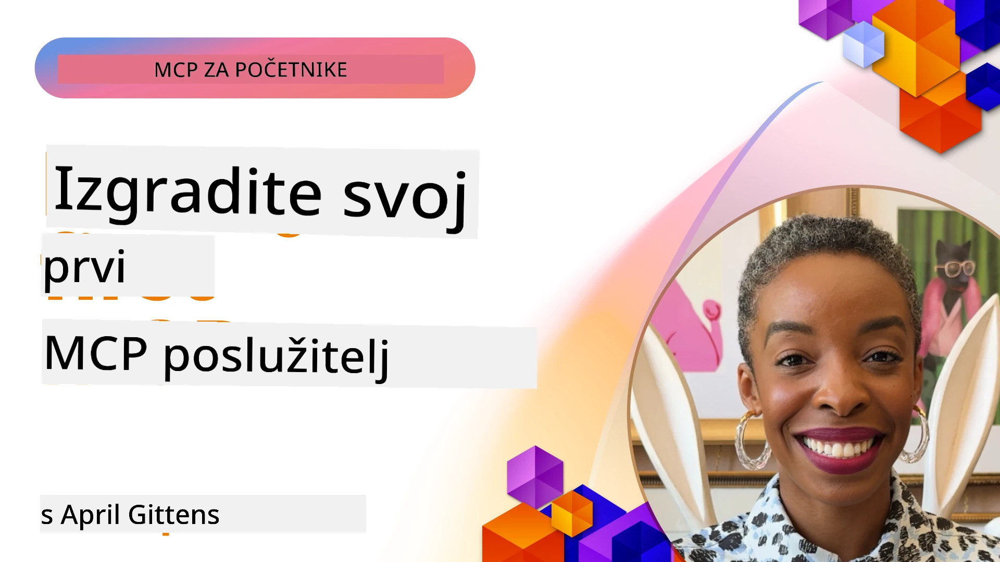

## Početak  

_(Kliknite na gornju sliku da pogledate video ove lekcije)_

Ovaj odjeljak sastoji se od nekoliko lekcija:

- **1 Vaš prvi poslužitelj**, u ovoj prvoj lekciji naučit ćete kako stvoriti svoj prvi poslužitelj i pregledati ga alatom za inspekciju, vrijednim načinom za testiranje i otklanjanje pogrešaka vašeg poslužitelja, [na lekciju](01-first-server/README.md)

- **2 Klijent**, u ovoj lekciji naučit ćete kako napisati klijenta koji se može povezati s vašim poslužiteljem, [na lekciju](02-client/README.md)

- **3 Klijent s LLM-om**, još bolji način pisanja klijenta je dodavanje LLM-a tako da može "pregovarati" s vašim poslužiteljem o tome što učiniti, [na lekciju](03-llm-client/README.md)

- **4 Korištenje načina rada GitHub Copilot Agent za poslužitelj u Visual Studio Code-u**. Ovdje gledamo kako pokrenuti naš MCP poslužitelj iz Visual Studio Code-a, [na lekciju](04-vscode/README.md)

- **5 stdio Transport Server** stdio transport je preporučeni standard za lokalnu komunikaciju MCP poslužitelja i klijenta, pružajući sigurnu komunikaciju temeljenu na potprocesima s ugrađenom izolacijom procesa [na lekciju](05-stdio-server/README.md)

- **6 HTTP Streaming s MCP-om (Streamable HTTP)**. Naučite o modernom HTTP streaming transportu (preporučeni pristup za udaljene MCP poslužitelje prema [MCP specifikaciji 2025-11-25](https://spec.modelcontextprotocol.io/specification/2025-11-25/basic/transports/#streamable-http)), obavijestima o napretku i kako implementirati skalabilne, real-time MCP poslužitelje i klijente koristeći Streamable HTTP. [na lekciju](06-http-streaming/README.md)

- **7 Korištenje AI Toolkit-a za VSCode** za korištenje i testiranje vaših MCP klijenata i poslužitelja [na lekciju](07-aitk/README.md)

- **8 Testiranje**. Ovdje ćemo se posebno usredotočiti na različite načine testiranja našeg poslužitelja i klijenta, [na lekciju](08-testing/README.md)

- **9 Implementacija**. Ovaj će se dio pozabaviti različitim načinima implementacije vaših MCP rješenja, [na lekciju](09-deployment/README.md)

- **10 Napredno korištenje poslužitelja**. Ovaj dio obuhvaća napredno korištenje poslužitelja, [na lekciju](./10-advanced/README.md)

- **11 Autentikacija**. Ovaj dio obuhvaća kako dodati jednostavnu autentikaciju, od Basic Auth do korištenja JWT-a i RBAC-a. Preporučuje se da započnete ovdje, a zatim pogledate Napredne teme u poglavlju 5 i dodatno ojačate sigurnost prema preporukama u poglavlju 2, [na lekciju](./11-simple-auth/README.md)

- **12 MCP hostovi**. Konfigurirajte i koristite popularne MCP host klijente uključujući Claude Desktop, Cursor, Cline i Windsurf. Naučite vrste transporta i rješavanje problema, [na lekciju](./12-mcp-hosts/README.md)

- **13 MCP inspektor**. Debugirajte i testirajte svoje MCP poslužitelje interaktivno pomoću alata MCP Inspector. Naučite rješavati probleme s alatima, resursima i protokol porukama, [na lekciju](./13-mcp-inspector/README.md)

Model Context Protocol (MCP) je otvoreni protokol koji standardizira kako aplikacije pružaju kontekst LLM-ovima. Zamislite MCP kao USB-C priključak za AI aplikacije - pruža standardiziran način povezivanja AI modela s različitim izvorima podataka i alatima.

## Ciljevi učenja

Na kraju ove lekcije moći ćete:

- Postaviti razvojna okruženja za MCP u C#, Javi, Pythonu, TypeScriptu i JavaScriptu
- Izgraditi i implementirati osnovne MCP poslužitelje s prilagođenim značajkama (resursi, upiti i alati)
- Kreirati host aplikacije koje se povezuju s MCP poslužiteljima
- Testirati i otklanjati pogreške MCP implementacija
- Razumjeti uobičajene izazove postavljanja i njihova rješenja
- Povezati vaše MCP implementacije s popularnim LLM servisima

## Postavljanje vašeg MCP okruženja

Prije nego što počnete raditi s MCP-om, važno je pripremiti razvojno okruženje i razumjeti osnovni tijek rada. Ovaj odjeljak će vas voditi kroz početne korake postavljanja kako bi osigurali nesmetan početak s MCP-om.

### Preduvjeti

Prije nego što započnete s razvojem MCP-a, provjerite imate li:

- **Razvojno okruženje**: za odabrani jezik (C#, Java, Python, TypeScript ili JavaScript)
- **IDE/Urednik**: Visual Studio, Visual Studio Code, IntelliJ, Eclipse, PyCharm ili bilo koji moderni uređivač koda
- **Upravitelji paketa**: NuGet, Maven/Gradle, pip ili npm/yarn
- **API ključevi**: za bilo koje AI usluge koje planirate koristiti u svojim host aplikacijama

### Službeni SDK-ovi

U nadolazećim poglavljima vidjet ćete rješenja izrađena korištenjem Pythona, TypeScripta, Jave i .NET-a. Ovdje su svi službeno podržani SDK-ovi.

MCP pruža službene SDK-ove za više jezika (usklađeno s [MCP specifikacijom 2025-11-25](https://spec.modelcontextprotocol.io/specification/2025-11-25/)):
- [C# SDK](https://github.com/modelcontextprotocol/csharp-sdk) - održava se u suradnji s Microsoftom
- [Java SDK](https://github.com/modelcontextprotocol/java-sdk) - održava se u suradnji sa Spring AI
- [TypeScript SDK](https://github.com/modelcontextprotocol/typescript-sdk) - službena implementacija za TypeScript
- [Python SDK](https://github.com/modelcontextprotocol/python-sdk) - službena Python implementacija (FastMCP)
- [Kotlin SDK](https://github.com/modelcontextprotocol/kotlin-sdk) - službena Kotlin implementacija
- [Swift SDK](https://github.com/modelcontextprotocol/swift-sdk) - održava se u suradnji s Loopwork AI
- [Rust SDK](https://github.com/modelcontextprotocol/rust-sdk) - službena Rust implementacija
- [Go SDK](https://github.com/modelcontextprotocol/go-sdk) - službena Go implementacija

## Ključne spoznaje

- Postavljanje MCP razvojnog okruženja je jednostavno uz SDK-ove specifične za jezik
- Izgradnja MCP poslužitelja uključuje kreiranje i registriranje alata s jasnim shemama
- MCP klijenti se povezuju s poslužiteljima i modelima za proširene mogućnosti
- Testiranje i otklanjanje pogrešaka ključni su za pouzdane MCP implementacije
- Opcije implementacije variraju od lokalnog razvoja do rješenja u oblaku

## Vježbanje

Imamo skup primjera koji nadopunjuju vježbe koje ćete vidjeti u svim poglavljima ovog odjeljka. Dodatno, svako poglavlje također ima vlastite vježbe i zadatke

- [Java Kalkulator](./samples/java/calculator/README.md)
- [.Net Kalkulator](../../../03-GettingStarted/samples/csharp)
- [JavaScript Kalkulator](./samples/javascript/README.md)
- [TypeScript Kalkulator](./samples/typescript/README.md)
- [Python Kalkulator](../../../03-GettingStarted/samples/python)

## Dodatni resursi

- [Izgradite agente koristeći Model Context Protocol na Azure](https://learn.microsoft.com/azure/developer/ai/intro-agents-mcp)
- [Remote MCP s Azure Container Apps (Node.js/TypeScript/JavaScript)](https://learn.microsoft.com/samples/azure-samples/mcp-container-ts/mcp-container-ts/)
- [.NET OpenAI MCP Agent](https://learn.microsoft.com/samples/azure-samples/openai-mcp-agent-dotnet/openai-mcp-agent-dotnet/)

## Što slijedi

Započnite s prvom lekcijom: [Kreiranje vašeg prvog MCP poslužitelja](01-first-server/README.md)

Nakon što završite ovaj modul, nastavite na: [Modul 4: Praktična implementacija](../04-PracticalImplementation/README.md)

---

<!-- CO-OP TRANSLATOR DISCLAIMER START -->
**Napomena**:
Ovaj dokument preveden je uz pomoć AI usluge za prijevod [Co-op Translator](https://github.com/Azure/co-op-translator). Iako nastojimo postići točnost, imajte na umu da automatizirani prijevodi mogu sadržavati pogreške ili netočnosti. Izvorni dokument na izvornom jeziku treba smatrati autoritativnim izvorom. Za važne informacije preporučuje se profesionalni ljudski prijevod. Ne snosimo odgovornost za bilo kakva nesporazume ili pogrešne interpretacije proizašle iz korištenja ovog prijevoda.
<!-- CO-OP TRANSLATOR DISCLAIMER END -->