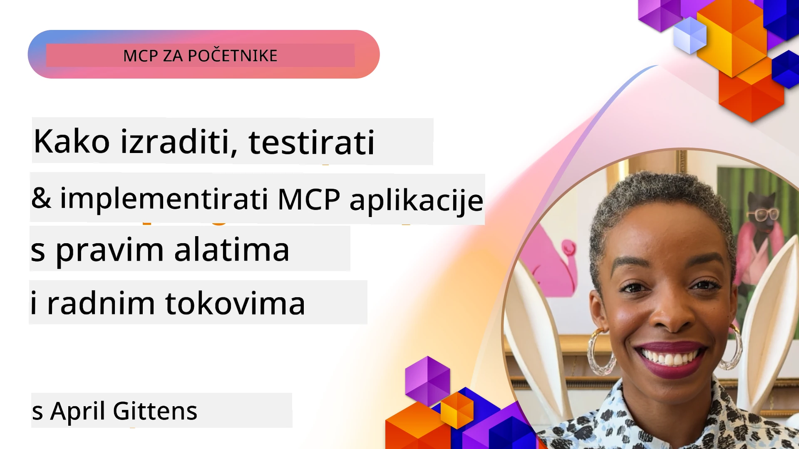

# Praktična implementacija

[](https://youtu.be/vCN9-mKBDfQ)

_(Kliknite sliku gore za pregled videa ove lekcije)_

Praktična implementacija je mjesto gdje snaga Model Context Protocol-a (MCP) postaje opipljiva. Dok je razumijevanje teorije i arhitekture iza MCP-a važno, stvarna vrijednost se pojavljuje kada ove koncepte primjenjujete za izgradnju, testiranje i implementaciju rješenja koja rješavaju stvarne probleme. Ova poglavlja premošćuju jaz između konceptualnog znanja i praktičnog razvoja, vodeći vas kroz proces izrade MCP-baziranih aplikacija.

Bilo da razvijate inteligentne asistente, integrirate AI u poslovne tokove rada ili gradite prilagođene alate za obradu podataka, MCP pruža fleksibilnu osnovu. Njegov dizajn neovisno o jeziku i službeni SDK-ovi za popularne programske jezike čine ga dostupnim širokom krugu developera. Iskorištavanjem ovih SDK-ova možete brzo prototipirati, iterirati i skalirati svoja rješenja na različitim platformama i okruženjima.

U sljedećim odjeljcima pronaći ćete praktične primjere, uzorke koda i strategije implementacije koje demonstriraju kako implementirati MCP u C#, Java sa Springom, TypeScript, JavaScript i Pythonu. Također ćete naučiti kako otklanjati pogreške i testirati MCP servere, upravljati API-jima i implementirati rješenja u oblak koristeći Azure. Ovi praktični resursi osmišljeni su da ubrzaju vaše učenje i pomognu vam samouvjereno izgraditi robusne, produkcijski spremne MCP aplikacije.

## Pregled

Ova lekcija se fokusira na praktične aspekte implementacije MCP-a u više programskih jezika. Istražit ćemo kako koristiti MCP SDK-ove u C#, Java sa Springom, TypeScriptu, JavaScriptu i Pythonu za izgradnju robusnih aplikacija, otklanjanje pogrešaka i testiranje MCP servera te kreiranje višekratno upotrebljivih resursa, promptova i alata.

## Ciljevi učenja

Na kraju ove lekcije, moći ćete:

- Implementirati MCP rješenja koristeći službene SDK-ove na različitim programskim jezicima
- Sistematski otklanjati pogreške i testirati MCP servere
- Kreirati i koristiti funkcije servera (Resurse, Prompte i Alate)
- Dizajnirati efikasne MCP radne tokove za složene zadatke
- Optimizirati MCP implementacije za performanse i pouzdanost

## Službeni SDK resursi

Model Context Protocol nudi službene SDK-ove za više jezika (usklađene s [MCP specifikacijom 2025-11-25](https://spec.modelcontextprotocol.io/specification/2025-11-25/)):

- [C# SDK](https://github.com/modelcontextprotocol/csharp-sdk)
- [Java sa Spring SDK](https://github.com/modelcontextprotocol/java-sdk) **Napomena:** zahtijeva ovisnost o [Project Reactor](https://projectreactor.io). (Pogledajte [raspravu broj 246](https://github.com/orgs/modelcontextprotocol/discussions/246).)
- [TypeScript SDK](https://github.com/modelcontextprotocol/typescript-sdk)
- [Python SDK](https://github.com/modelcontextprotocol/python-sdk)
- [Kotlin SDK](https://github.com/modelcontextprotocol/kotlin-sdk)
- [Go SDK](https://github.com/modelcontextprotocol/go-sdk)

## Rad s MCP SDK-ovima

Ovaj odjeljak donosi praktične primjere implementacije MCP-a u više programskih jezika. Primjere koda možete pronaći u direktoriju `samples`, organiziranom prema jeziku.

### Dostupni primjeri

Repozitorij sadrži [primjere implementacija](../../../04-PracticalImplementation/samples) u sljedećim jezicima:

- [C#](./samples/csharp/README.md)
- [Java sa Springom](./samples/java/containerapp/README.md)
- [TypeScript](./samples/typescript/README.md)
- [JavaScript](./samples/javascript/README.md)
- [Python](./samples/python/README.md)

Svaki primjer demonstrira ključne MCP koncepte i obrasce implementacije za specifični jezik i ekosustav.

### Praktični vodiči

Dodatni vodiči za praktičnu MCP implementaciju:

- [Paginacija i veliki skupovi podataka](./pagination/README.md) - Obrada paginacije temeljene na pokazivaču za alate, resurse i velike skupove podataka

## Ključne značajke servera

MCP serveri mogu implementirati bilo koju kombinaciju ovih značajki:

### Resursi

Resursi pružaju kontekst i podatke korisniku ili AI modelu za korištenje:

- Spremišta dokumenata
- Baze znanja
- Strukturirani izvori podataka
- Datotečni sustavi

### Prompti

Prompti su predlošci poruka i radnih tokova za korisnike:

- Unaprijed definirani predlošci razgovora
- Vođeni obrasci interakcije
- Specijalizirane strukture dijaloga

### Alati

Alati su funkcije koje AI model izvršava:

- Alati za obradu podataka
- Integracije s vanjskim API-jima
- Računalne sposobnosti
- Funkcionalnost pretraživanja

## Primjeri implementacije: C# implementacija

Službeni C# SDK repozitorij sadrži nekoliko primjera implementacije koji demonstriraju različite aspekte MCP-a:

- **Osnovni MCP klijent**: Jednostavan primjer koji prikazuje kako kreirati MCP klijenta i pozvati alate
- **Osnovni MCP server**: Minimalna implementacija servera s osnovnom registracijom alata
- **Napredni MCP server**: Potpuno opremljen server s registracijom alata, autentikacijom i rukovanjem greškama
- **Integracija s ASP.NET**: Primjeri koji demonstriraju integraciju s ASP.NET Core
- **Obrasci implementacije alata**: Razni obrasci za implementaciju alata s različitim razinama složenosti

MCP C# SDK je u preview fazi i API-ji se mogu mijenjati. Kontinuirano ćemo ažurirati ovaj blog dok SDK evoluira.

### Ključne značajke

- [C# MCP Nuget ModelContextProtocol](https://www.nuget.org/packages/ModelContextProtocol)
- Izrada vašeg [prvog MCP servera](https://devblogs.microsoft.com/dotnet/build-a-model-context-protocol-mcp-server-in-csharp/).

Za kompletne primjere implementacije u C#, posjetite [službeni repozitorij C# SDK primjera](https://github.com/modelcontextprotocol/csharp-sdk)

## Primjer implementacije: Java sa Springom

Java sa Spring SDK nudi robusne opcije implementacije MCP-a s enterprise značajkama.

### Ključne značajke

- Integracija Spring Frameworka
- Snažna tip sigurnost
- Podrška reaktivnom programiranju
- Sveobuhvatno rukovanje greškama

Za kompletan primjer implementacije Java sa Springom pogledajte [Java with Spring sample](samples/java/containerapp/README.md) u direktoriju uzoraka.

## Primjer implementacije: JavaScript implementacija

JavaScript SDK pruža lagani i fleksibilni pristup implementaciji MCP-a.

### Ključne značajke

- Podrška za Node.js i preglednike
- Promise-based API
- Jednostavna integracija s Express i drugim frameworkovima
- Podrška za WebSocket za streaming

Za kompletan primjer implementacije u JavaScriptu pogledajte [JavaScript sample](samples/javascript/README.md) u direktoriju uzoraka.

## Primjer implementacije: Python implementacija

Python SDK nudi pythonistički pristup implementaciji MCP-a s izvrsnim integracijama ML frameworka.

### Ključne značajke

- Async/await podrška s asyncio
- Integracija s FastAPI-jem
- Jednostavna registracija alata
- Izvorna integracija s popularnim ML bibliotekama

Za kompletan primjer implementacije u Pythonu pogledajte [Python sample](samples/python/README.md) u direktoriju uzoraka.

## Upravljanje API-jem

Azure API Management sjajan je odgovor na pitanje kako osigurati MCP servere. Ideja je postaviti Azure API Management instancu ispred vašeg MCP servera te pustiti da ona rukuje značajkama koje će vam vjerojatno trebati poput:

- ograničavanja brzine poziva
- upravljanja tokenima
- nadzora
- balansiranja opterećenja
- sigurnosti

### Azure primjer

Evo primjera Azure-a koji upravo to čini, tj. [kreiranje MCP servera i njegovo osiguravanje s Azure API Managementom](https://github.com/Azure-Samples/remote-mcp-apim-functions-python).

Pogledajte kako se odvija autorizacijski protok na donjoj slici:


Na prethodnoj slici događa se sljedeće:

- Autentikacija/autorizacija odvija se pomoću Microsoft Entra.
- Azure API Management djeluje kao ulazna točka (gateway) i koristi politike za usmjeravanje i upravljanje prometom.
- Azure Monitor bilježi sve zahtjeve za daljnju analizu.

#### Autorizacijski protok

Pogledajmo autorizacijski protok detaljnije:


#### MCP specifikacija autorizacije

Saznajte više o [MCP specifikaciji autorizacije](https://spec.modelcontextprotocol.io/specification/2025-11-25/basic/authorization/)

## Implementacija Remote MCP servera na Azure

Pogledajmo možemo li implementirati ranije spomenuti uzorak:

1. Klonirajte repozitorij

    ```bash
    git clone https://github.com/Azure-Samples/remote-mcp-apim-functions-python.git
    cd remote-mcp-apim-functions-python
    ```

1. Registrirajte pružatelja resursa `Microsoft.App`.

   - Ako koristite Azure CLI, pokrenite `az provider register --namespace Microsoft.App --wait`.
   - Ako koristite Azure PowerShell, pokrenite `Register-AzResourceProvider -ProviderNamespace Microsoft.App`. Nakon nekog vremena pokrenite `(Get-AzResourceProvider -ProviderNamespace Microsoft.App).RegistrationState` da provjerite je li registracija završena.

1. Pokrenite ovu [azd](https://aka.ms/azd) naredbu za provisioniranje API upravljanja uslugom, funkcijskog appa (s kodom) i svih drugih potrebnih Azure resursa

    ```shell
    azd up
    ```

    Ova naredba trebala bi implementirati sve cloud resurse na Azureu

### Testiranje vašeg servera s MCP Inspektorom

1. U **novom terminal prozoru** instalirajte i pokrenite MCP Inspector

    ```shell
    npx @modelcontextprotocol/inspector
    ```

    Trebali biste vidjeti sučelje slično:

    

1. Kliknite CTRL i otvorite MCP Inspector web aplikaciju s URL-a koji prikazuje aplikacija (npr. [http://127.0.0.1:6274/#resources](http://127.0.0.1:6274/#resources))
1. Postavite tip prijenosa na `SSE`
1. Postavite URL na vaš API Management SSE endpoint koji je prikazan nakon `azd up` i **povežite se**:

    ```shell
    https://<apim-servicename-from-azd-output>.azure-api.net/mcp/sse
    ```

1. **Popis alata**. Kliknite na alat i **pokrenite alat**.

Ako su svi koraci prošli uspješno, sada biste trebali biti povezani s MCP serverom i uspjeli ste pozvati alat.

## MCP serveri za Azure

[Remote-mcp-functions](https://github.com/Azure-Samples/remote-mcp-functions-dotnet): Ovaj skup repozitorija služi kao brzi predložak za izgradnju i implementaciju prilagođenih udaljenih MCP (Model Context Protocol) servera koristeći Azure Functions s Pythonom, C# .NET-om ili Node/TypeScriptom.

Primjeri pružaju kompletno rješenje koje omogućuje developerima da:

- Izgrade i pokrenu lokalno: Razvijaju i otklanjaju greške na MCP serveru lokalno
- Implementiraju u Azure: Jednostavno implementiraju u oblak pomoću jednostavne naredbe azd up
- Povežu se s klijentima: Povezuju se s MCP serverom iz različitih klijenata uključujući VS Code-ov Copilot agent mode i MCP Inspector alat

### Ključne značajke

- Sigurnost dizajnirana unaprijed: MCP server je zaštićen pomoću ključeva i HTTPS-a
- Opcije autentikacije: Podržava OAuth koristeći ugrađenu autentikaciju i/ili API Management
- Izolacija mreže: Omogućava izolaciju mreže koristeći Azure Virtual Networks (VNET)
- Serverless arhitektura: Koristi Azure Functions za skalabilno, događajno vođeno izvršavanje
- Lokalni razvoj: Sveobuhvatna podrška za lokalni razvoj i otklanjanje problema
- Jednostavna implementacija: Pojednostavljen proces implementacije u Azure

Repozitorij uključuje sve potrebne konfiguracijske datoteke, izvorni kod i infrastrukturne definicije za brzo započinjanje s produkcijski spremnom MCP server implementacijom.

- [Azure Remote MCP Functions Python](https://github.com/Azure-Samples/remote-mcp-functions-python) - Primjer implementacije MCP-a koristeći Azure Functions s Pythonom

- [Azure Remote MCP Functions .NET](https://github.com/Azure-Samples/remote-mcp-functions-dotnet) - Primjer implementacije MCP-a koristeći Azure Functions s C# .NET-om

- [Azure Remote MCP Functions Node/Typescript](https://github.com/Azure-Samples/remote-mcp-functions-typescript) - Primjer implementacije MCP-a koristeći Azure Functions s Node/TypeScriptom.

## Ključne spoznaje

- MCP SDK-ovi pružaju jezično specifične alate za implementaciju robusnih MCP rješenja
- Proces otklanjanja pogrešaka i testiranja je ključan za pouzdane MCP aplikacije
- Višekratno upotrebljivi predlošci prompta omogućuju dosljedne AI interakcije
- Dobro dizajnirani radni tokovi mogu orkestrirati složene zadatke koristeći više alata
- Implementacija MCP rješenja zahtijeva razmatranje sigurnosti, performansi i rukovanja greškama

## Vježba

Dizajnirajte praktični MCP radni tok koji rješava stvarni problem iz vaše domene:

1. Identificirajte 3-4 alata koji bi bili korisni za rješavanje tog problema
2. Napravite dijagram radnog toka koji prikazuje kako ti alati međusobno djeluju
3. Implementirajte osnovnu verziju jednog od alata koristeći preferirani programski jezik
4. Kreirajte predložak prompta koji bi pomogao modelu da učinkovito koristi vaš alat

## Dodatni resursi

---

## Što je dalje

Sljedeće: [Napredne teme](../05-AdvancedTopics/README.md)

---

<!-- CO-OP TRANSLATOR DISCLAIMER START -->
**Odricanje od odgovornosti**:
Ovaj dokument je preveden korištenjem AI usluge za prevođenje [Co-op Translator](https://github.com/Azure/co-op-translator). Iako nastojimo postići točnost, imajte na umu da automatski prijevodi mogu sadržavati pogreške ili netočnosti. Izvorni dokument na njegovom izvornom jeziku treba smatrati autoritativnim izvorom. Za važne informacije preporučuje se profesionalni ljudski prijevod. Ne snosimo odgovornost za bilo kakva nesporazuma ili pogrešna tumačenja koja proizlaze iz uporabe ovog prijevoda.
<!-- CO-OP TRANSLATOR DISCLAIMER END -->