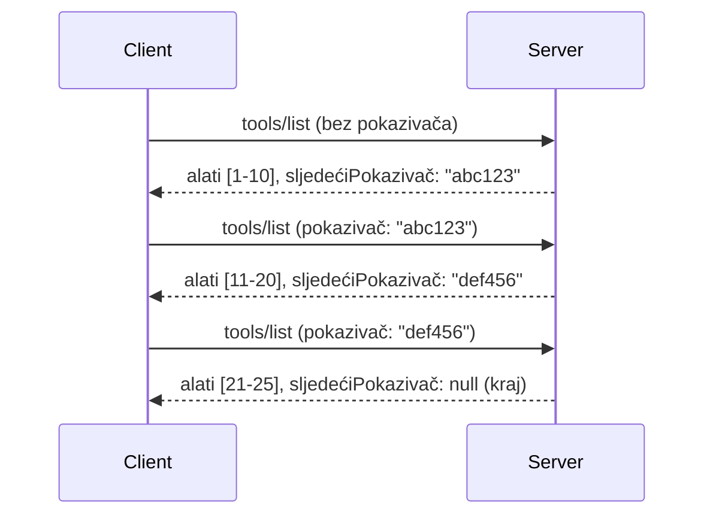

# Straničenje i Veliki Skupovi Rezultata u MCP-u

Kada vaš MCP poslužitelj obrađuje velike skupove podataka - bilo da je riječ o listanju tisuća datoteka, zapisa iz baze podataka ili rezultata pretraživanja - potrebni su straničenje za efikasno upravljanje memorijom i pružanje responzivnog korisničkog iskustva. Ovaj vodič pokriva kako implementirati i koristiti straničenje u MCP-u.

## Zašto je Straničenje Važno

Bez straničenja, veliki odgovori mogu uzrokovati:

- **Ispraznjenje memorije** - Učitavanje milijuna zapisa odjednom
- **Spora vremena odziva** - Korisnici čekaju dok se svi podatci učitaju
- **Greške zbog isteka vremena** - Zahtjevi prelaze vremenska ograničenja
- **Loše performanse AI-a** - LLM-ovi imaju poteškoća s masivnim kontekstom

MCP koristi **straničenje bazirano na kursoru** za pouzdano i konzistentno listanje kroz skupove rezultata.

---

## Kako MCP Straničenje Radi

### Koncept Kursora

**Kursor** je neprozirni niz znakova koji označava vašu poziciju u skupu rezultata. Zamislite ga kao oznaku stranice u dugoj knjizi.


### Straničenje u MCP Metodama

Sljedeće MCP metode podržavaju straničenje:

| Metoda | Vraća | Podrška za Kursor |
|--------|--------|-------------------|
| `tools/list` | Definicije alata | ✅ |
| `resources/list` | Definicije resursa | ✅ |
| `prompts/list` | Definicije prompta | ✅ |
| `resources/templates/list` | Predlošci resursa | ✅ |

---

## Implementacija na Poslužitelju

### Python (FastMCP)

```python
from mcp.server import Server
from mcp.types import Tool, ListToolsResult
import math

app = Server("paginated-server")

# Simulirani veliki skup podataka
ALL_TOOLS = [
    Tool(name=f"tool_{i}", description=f"Tool number {i}", inputSchema={})
    for i in range(100)
]

PAGE_SIZE = 10

@app.list_tools()
async def list_tools(cursor: str | None = None) -> ListToolsResult:
    """List tools with pagination support."""
    
    # Dekodiraj pokazivač da dobiješ početni indeks
    start_index = 0
    if cursor:
        try:
            start_index = int(cursor)
        except ValueError:
            start_index = 0
    
    # Dohvati stranicu rezultata
    end_index = min(start_index + PAGE_SIZE, len(ALL_TOOLS))
    page_tools = ALL_TOOLS[start_index:end_index]
    
    # Izračunaj sljedeći pokazivač
    next_cursor = None
    if end_index < len(ALL_TOOLS):
        next_cursor = str(end_index)
    
    return ListToolsResult(
        tools=page_tools,
        nextCursor=next_cursor
    )
```

### TypeScript

```typescript
import { Server } from "@modelcontextprotocol/sdk/server/index.js";
import { ListToolsResultSchema } from "@modelcontextprotocol/sdk/types.js";

const server = new Server({
  name: "paginated-server",
  version: "1.0.0"
});

// Simulirani veliki skup podataka
const ALL_TOOLS = Array.from({ length: 100 }, (_, i) => ({
  name: `tool_${i}`,
  description: `Tool number ${i}`,
  inputSchema: { type: "object", properties: {} }
}));

const PAGE_SIZE = 10;

server.setRequestHandler(ListToolsResultSchema, async (request) => {
  // Dekodiraj kursor
  let startIndex = 0;
  if (request.params?.cursor) {
    startIndex = parseInt(request.params.cursor, 10) || 0;
  }
  
  // Dohvati stranicu rezultata
  const endIndex = Math.min(startIndex + PAGE_SIZE, ALL_TOOLS.length);
  const pageTools = ALL_TOOLS.slice(startIndex, endIndex);
  
  // Izračunaj sljedeći kursor
  const nextCursor = endIndex < ALL_TOOLS.length ? String(endIndex) : undefined;
  
  return {
    tools: pageTools,
    nextCursor
  };
});
```

### Java (Spring MCP)

```java
@Service
public class PaginatedToolService {
    
    private static final int PAGE_SIZE = 10;
    private final List<Tool> allTools;
    
    public PaginatedToolService() {
        // Inicijaliziraj veliki skup podataka
        this.allTools = IntStream.range(0, 100)
            .mapToObj(i -> new Tool("tool_" + i, "Tool number " + i, Map.of()))
            .collect(Collectors.toList());
    }
    
    @McpMethod("tools/list")
    public ListToolsResult listTools(@Param("cursor") String cursor) {
        // Dekodiraj pokazivač
        int startIndex = 0;
        if (cursor != null && !cursor.isEmpty()) {
            try {
                startIndex = Integer.parseInt(cursor);
            } catch (NumberFormatException e) {
                startIndex = 0;
            }
        }
        
        // Dohvati stranicu rezultata
        int endIndex = Math.min(startIndex + PAGE_SIZE, allTools.size());
        List<Tool> pageTools = allTools.subList(startIndex, endIndex);
        
        // Izračunaj sljedeći pokazivač
        String nextCursor = endIndex < allTools.size() ? String.valueOf(endIndex) : null;
        
        return new ListToolsResult(pageTools, nextCursor);
    }
}
```

---

## Implementacija na Klijentu

### Python Klijent

```python
from mcp import ClientSession

async def get_all_tools(session: ClientSession) -> list:
    """Fetch all tools using pagination."""
    all_tools = []
    cursor = None
    
    while True:
        result = await session.list_tools(cursor=cursor)
        all_tools.extend(result.tools)
        
        if result.nextCursor is None:
            break
        cursor = result.nextCursor
    
    return all_tools

# Upotreba
async with client_session as session:
    tools = await get_all_tools(session)
    print(f"Found {len(tools)} tools")
```

### TypeScript Klijent

```typescript
import { Client } from "@modelcontextprotocol/sdk/client/index.js";

async function getAllTools(client: Client): Promise<Tool[]> {
  const allTools: Tool[] = [];
  let cursor: string | undefined = undefined;
  
  do {
    const result = await client.listTools({ cursor });
    allTools.push(...result.tools);
    cursor = result.nextCursor;
  } while (cursor);
  
  return allTools;
}

// Korištenje
const tools = await getAllTools(client);
console.log(`Found ${tools.length} tools`);
```

### Uzorak Lijenog Učitavanja

Za vrlo velike skupove podataka, učitavajte stranice na zahtjev:

```python
class PaginatedToolIterator:
    """Lazily iterate through paginated tools."""
    
    def __init__(self, session: ClientSession):
        self.session = session
        self.cursor = None
        self.buffer = []
        self.exhausted = False
    
    async def __anext__(self):
        # Vrati iz međuspremnika ako je dostupan
        if self.buffer:
            return self.buffer.pop(0)
        
        # Provjeri jesmo li iscrpili sve stranice
        if self.exhausted:
            raise StopAsyncIteration
        
        # Dohvati sljedeću stranicu
        result = await self.session.list_tools(cursor=self.cursor)
        self.buffer = list(result.tools)
        self.cursor = result.nextCursor
        
        if self.cursor is None:
            self.exhausted = True
        
        if not self.buffer:
            raise StopAsyncIteration
        
        return self.buffer.pop(0)
    
    def __aiter__(self):
        return self

# Upotreba - memorijski učinkovito za velike skupove podataka
async for tool in PaginatedToolIterator(session):
    process_tool(tool)
```

---

## Straničenje za Resurse

Resursi često trebaju straničenje za direktorije ili velike skupove podataka:

```python
from mcp.server import Server
from mcp.types import Resource, ListResourcesResult
import os

app = Server("file-server")

@app.list_resources()
async def list_resources(cursor: str | None = None) -> ListResourcesResult:
    """List files in directory with pagination."""
    
    directory = "/data/files"
    all_files = sorted(os.listdir(directory))
    
    # Dekodiraj pokazivač (indeks datoteke)
    start_index = int(cursor) if cursor else 0
    page_size = 20
    end_index = min(start_index + page_size, len(all_files))
    
    # Napravi listu resursa za ovu stranicu
    resources = []
    for filename in all_files[start_index:end_index]:
        filepath = os.path.join(directory, filename)
        resources.append(Resource(
            uri=f"file://{filepath}",
            name=filename,
            mimeType="application/octet-stream"
        ))
    
    # Izračunaj sljedeći pokazivač
    next_cursor = str(end_index) if end_index < len(all_files) else None
    
    return ListResourcesResult(
        resources=resources,
        nextCursor=next_cursor
    )
```

---

## Strategije Dizajna Kursora

### Strategija 1: Na temelju indeksa (Jednostavno)

```python
# Kursor je samo indeks
cursor = "50"  # Počni s artiklom 50
```

**Prednosti:** Jednostavno, bez stanja
**Nedostaci:** Rezultati se mogu pomaknuti ako se dodaju/uklone stavke

### Strategija 2: Na temelju ID-a (Stabilno)

```python
# Kursor je zadnji viđeni ID
cursor = "item_abc123"  # Počni nakon ove stavke
```

**Prednosti:** Stabilno čak i ako se stavke mijenjaju
**Nedostaci:** Potrebni su uređeni ID-ovi

### Strategija 3: Kodirano stanje (Kompleksno)

```python
import base64
import json

def encode_cursor(state: dict) -> str:
    return base64.b64encode(json.dumps(state).encode()).decode()

def decode_cursor(cursor: str) -> dict:
    return json.loads(base64.b64decode(cursor).decode())

# Kursor sadrži više polja stanja
cursor = encode_cursor({
    "offset": 50,
    "filter": "active",
    "sort": "name"
})
```

**Prednosti:** Može kodirati kompleksno stanje
**Nedostaci:** Složenije, veći nizovi kursora

---

## Najbolje Prakse

### 1. Odaberite Primjerene Veličine Stranica

```python
# Razmotrite veličinu podataka
PAGE_SIZE_SMALL_ITEMS = 100   # Jednostavni metapodaci
PAGE_SIZE_MEDIUM_ITEMS = 20   # Složeniji objekti
PAGE_SIZE_LARGE_ITEMS = 5     # Kompleksan sadržaj
```

### 2. Graceful Rukovanje Neispravnim Kursorima

```python
@app.list_tools()
async def list_tools(cursor: str | None = None) -> ListToolsResult:
    try:
        start_index = int(cursor) if cursor else 0
        if start_index < 0 or start_index >= len(ALL_TOOLS):
            start_index = 0  # Resetiraj na početak
    except (ValueError, TypeError):
        start_index = 0  # Neispravan pokazivač, započni ispočetka
    # ...
```

### 3. Uključite Ukupan Broj (Opcionalno)

```python
return ListToolsResult(
    tools=page_tools,
    nextCursor=next_cursor,
    # Neke implementacije uključuju ukupno za napredak sučelja
    _meta={"total": len(ALL_TOOLS)}
)
```

### 4. Testirajte Krajnje Slučajeve

```python
async def test_pagination():
    # Prazan skup rezultata
    result = await session.list_tools()
    assert result.tools == []
    assert result.nextCursor is None
    
    # Jedna stranica
    result = await session.list_tools()
    assert len(result.tools) <= PAGE_SIZE
    
    # Nevažeći kursor
    result = await session.list_tools(cursor="invalid")
    assert result.tools  # Trebao bi vratiti prvu stranicu
```

---

## Česte Zamke

### ❌ Vraćanje Svim Rezultata pa Straničenje na Klijentu

```python
# LOŠE: Učitava sve u memoriju
@app.list_tools()
async def list_tools() -> ListToolsResult:
    all_tools = load_all_tools()  # 1 milijun alata!
    return ListToolsResult(tools=all_tools)
```

### ✅ Straničenje na Izvoru Podataka

```python
# DOBRO: Učitava samo ono što je potrebno
@app.list_tools()
async def list_tools(cursor: str | None = None) -> ListToolsResult:
    offset = int(cursor) if cursor else 0
    tools = await db.query_tools(offset=offset, limit=PAGE_SIZE)
    return ListToolsResult(tools=tools, nextCursor=...)
```

---

## Što Slijedi

- [Modul 5.14 - Inženjerstvo Konteksta](../../05-AdvancedTopics/mcp-contextengineering/README.md)
- [Modul 8 - Najbolje Prakse](../../08-BestPractices/README.md)
- [3.8 - Testiranje Vašeg MCP Poslužitelja](../../03-GettingStarted/08-testing/README.md)

---

## Dodatni Resursi

- [MCP Specifikacija - Straničenje](https://spec.modelcontextprotocol.io/specification/2025-11-25/)
- [Objašnjenje Straničenja Baziranog na Kursoru](https://slack.engineering/evolving-api-pagination-at-slack/)
- [Python SDK testovi straničenja](https://github.com/modelcontextprotocol/python-sdk/blob/main/tests/client/test_list_methods_cursor.py)

---

<!-- CO-OP TRANSLATOR DISCLAIMER START -->
**Odricanje odgovornosti**:  
Ovaj dokument preveden je pomoću AI usluge za prevođenje [Co-op Translator](https://github.com/Azure/co-op-translator). Iako težimo točnosti, imajte na umu da automatski prijevodi mogu sadržavati pogreške ili netočnosti. Izvorni dokument na njegovom izvornom jeziku smatra se službenim i autoritativnim izvorom. Za ključne informacije preporučuje se profesionalni ljudski prijevod. Ne snosimo odgovornost za bilo kakve nesporazume ili kriva tumačenja koja proizlaze iz upotrebe ovog prijevoda.
<!-- CO-OP TRANSLATOR DISCLAIMER END -->