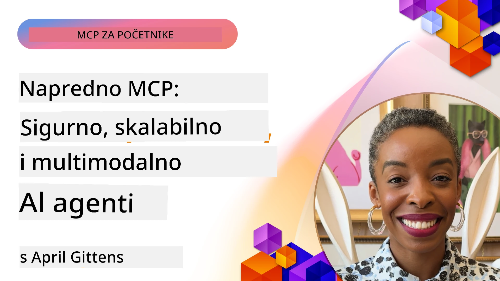

# Napredne teme u MCP-u

_(Kliknite na gornju sliku da pogledate video ove lekcije)_

Ovo poglavlje pokriva niz naprednih tema u implementaciji Model Context Protocol-a (MCP), uključujući višemodalnu integraciju, skalabilnost, najbolje sigurnosne prakse i enterprise integraciju. Ove teme su ključne za izradu robusnih i spremnih za produkciju MCP aplikacija koje mogu zadovoljiti zahtjeve modernih AI sustava.

## Pregled

Ova lekcija istražuje napredne koncepte u implementaciji Model Context Protocol-a, usredotočujući se na višemodalnu integraciju, skalabilnost, najbolje sigurnosne prakse i enterprise integraciju. Ove teme su bitne za izgradnju MCP aplikacija proizvodne kvalitete koje mogu rukovati složenim zahtjevima u enterprise okruženjima.

## Ciljevi učenja

Na kraju ove lekcije, moći ćete:

- Implementirati višemodalne mogućnosti unutar MCP okvira
- Dizajnirati skalabilne MCP arhitekture za scenarije visokih zahtjeva
- Primijeniti najbolje sigurnosne prakse u skladu s sigurnosnim principima MCP-a
- Integrirati MCP sa enterprise AI sustavima i okvirima
- Optimizirati performanse i pouzdanost u produkcijskim okruženjima

## Lekcije i primjeri projekata

| Link | Naslov | Opis |
|------|--------|------|
| [5.1 Integracija s Azure](./mcp-integration/README.md) | Integracija s Azure | Naučite kako integrirati vaš MCP Server na Azure |
| [5.2 Višemodalni primjer](./mcp-multi-modality/README.md) | MCP Višemodalni primjeri | Primjeri za audio, sliku i višemodalni odgovor |
| [5.3 MCP OAuth2 primjer](../../../05-AdvancedTopics/mcp-oauth2-demo) | MCP OAuth2 Demo | Minimalna Spring Boot aplikacija koja prikazuje OAuth2 s MCP-om, i kao Authorization i kao Resource Server. Demonstrira sigurno izdavanje tokena, zaštićene krajnje točke, implementaciju na Azure Container Apps i integraciju s API Managementom. |
| [5.4 Root konteksti](./mcp-root-contexts/README.md) | Root konteksti | Saznajte više o root kontekstu i kako ih implementirati |
| [5.5 Rutiranje](./mcp-routing/README.md) | Rutiranje | Naučite različite vrste rutiranja |
| [5.6 Uzorkovanje](./mcp-sampling/README.md) | Uzorkovanje | Naučite kako raditi s uzorkovanjem |
| [5.7 Skaliranje](./mcp-scaling/README.md) | Skaliranje | Naučite o skaliranju |
| [5.8 Sigurnost](./mcp-security/README.md) | Sigurnost | Osigurajte svoj MCP Server |
| [5.9 Web pretraživanje MCP](./web-search-mcp/README.md) | Web pretraživanje MCP | Python MCP server i klijent koji se integriraju sa SerpAPI za pretraživanje weba, vijesti, proizvoda i Q&A u stvarnom vremenu. Demonstrira orkestraciju višestrukih alata, integraciju vanjskih API-ja i robusno upravljanje greškama. |
| [5.10 Streaming u stvarnom vremenu](./mcp-realtimestreaming/README.md) | Streaming | Streaming podataka u stvarnom vremenu postao je bitan u današnjem svijetu vođenom podacima, gdje tvrtke i aplikacije zahtijevaju trenutačni pristup informacijama za pravovremene odluke.|
| [5.11 Pretraživanje weba u stvarnom vremenu](./mcp-realtimesearch/README.md) | Web pretraživanje | Kako MCP transformira pretraživanje weba u stvarnom vremenu pružajući standardizirani pristup upravljanju kontekstom među AI modelima, tražilicama i aplikacijama.| 
| [5.12 Autentifikacija Entra ID za Model Context Protocol servere](./mcp-security-entra/README.md) | Entra ID Autentifikacija | Microsoft Entra ID pruža robusno rješenje za upravljanje identitetom i pristupom u oblaku, pomažući osigurati da samo ovlašteni korisnici i aplikacije mogu komunicirati s vašim MCP serverom.|
| [5.13 Integracija Azure AI Foundry agenta](./mcp-foundry-agent-integration/README.md) | Azure AI Foundry integracija | Naučite kako integrirati Model Context Protocol servere s Azure AI Foundry agentima, omogućujući snažnu orkestraciju alata i enterprise AI mogućnosti sa standardiziranim vezama na vanjske izvore podataka.|
| [5.14 Inženjerstvo konteksta](./mcp-contextengineering/README.md) | Inženjerstvo konteksta | Buduće mogućnosti tehnika inženjerstva konteksta za MCP servere, uključujući optimizaciju konteksta, dinamičko upravljanje kontekstom i strategije za efikasno prompt inženjerstvo unutar MCP okvira.|
| [5.15 MCP prilagođeni transport](./mcp-transport/README.md) | Prilagođeni transport | Naučite kako implementirati prilagođene transportne mehanizme za specijalizirane MCP komunikacijske scenarije.|
| [5.16 Dubinski pregled značajki protokola](./mcp-protocol-features/README.md) | Značajke protokola | Savladajte napredne značajke protokola uključujući obavijesti o napretku, otkazivanje zahtjeva, predloške resursa i obrasce upravljanja greškama.|

> **Novo u MCP specifikaciji 2025-11-25**: specifikacija sada uključuje eksperimentalnu podršku za **Zadatke** (operacije dugotrajnog izvršavanja s praćenjem napretka), **Bilješke o alatima** (metapodaci o ponašanju alata radi sigurnosti), **URL način ispitivanja** (zahtjev za specifičnim URL sadržajem od klijenata) i poboljšane **Rootove** (za upravljanje kontekstom radnog prostora). Pogledajte [MCP changelog specifikacije](https://spec.modelcontextprotocol.io/) za potpune detalje.

## Dodatne reference

Za najnovije informacije o naprednim MCP temama pogledajte:
- [MCP dokumentacija](https://modelcontextprotocol.io/)
- [MCP specifikacija (2025-11-25)](https://spec.modelcontextprotocol.io/specification/2025-11-25/)
- [GitHub Repozitorij](https://github.com/modelcontextprotocol)
- [OWASP MCP Top 10](https://microsoft.github.io/mcp-azure-security-guide/mcp/) - Sigurnosni rizici i mitigacije
- [MCP Security Summit radionica (Sherpa)](https://azure-samples.github.io/sherpa/) - Praktična sigurnosna edukacija

## Ključne poruke

- Višemodalne MCP implementacije proširuju AI mogućnosti izvan obrade teksta
- Skalabilnost je ključna za enterprise implementacije, a može se postići horizontalnim i vertikalnim skaliranjem
- Sveobuhvatne sigurnosne mjere štite podatke i osiguravaju ispravan pristup
- Enterprise integracija s platformama poput Azure OpenAI i Microsoft AI Foundry povećava MCP sposobnosti
- Napredne MCP implementacije koriste optimizirane arhitekture i pažljivo upravljanje resursima

## Vježba

Dizajnirajte enterprise razinu MCP implementacije za specifični slučaj uporabe:

1. Identificirajte višemodalne zahtjeve za vaš slučaj uporabe
2. Izložite sigurnosne kontrole potrebne za zaštitu osjetljivih podataka
3. Dizajnirajte skalabilnu arhitekturu koja može podnijeti promjenjivo opterećenje
4. Planirajte točke integracije s enterprise AI sustavima
5. Dokumentirajte potencijalna uska grla performansi i strategije za njihovo ublažavanje

## Dodatni resursi

- [Azure OpenAI dokumentacija](https://learn.microsoft.com/en-us/azure/ai-services/openai/)
- [Microsoft AI Foundry dokumentacija](https://learn.microsoft.com/en-us/ai-services/)

---

## Što slijedi

Istražite lekcije u ovom modulu počevši s: [5.1 MCP Integracija](./mcp-integration/README.md)

Nakon što završite ovaj modul, nastavite na: [Modul 6: Zajednički doprinosi](../06-CommunityContributions/README.md)

---

<!-- CO-OP TRANSLATOR DISCLAIMER START -->
**Odricanje od odgovornosti**:
Ovaj je dokument preveden pomoću AI prevoditeljskog servisa [Co-op Translator](https://github.com/Azure/co-op-translator). Iako nastojimo postići točnost, imajte na umu da automatski prijevodi mogu sadržavati pogreške ili netočnosti. Izvorni dokument na izvornom jeziku treba smatrati službenim izvorom. Za kritične informacije preporučuje se profesionalni ljudski prijevod. Ne preuzimamo odgovornost za bilo kakva nesporazume ili pogrešna tumačenja koja proizlaze iz korištenja ovog prijevoda.
<!-- CO-OP TRANSLATOR DISCLAIMER END -->