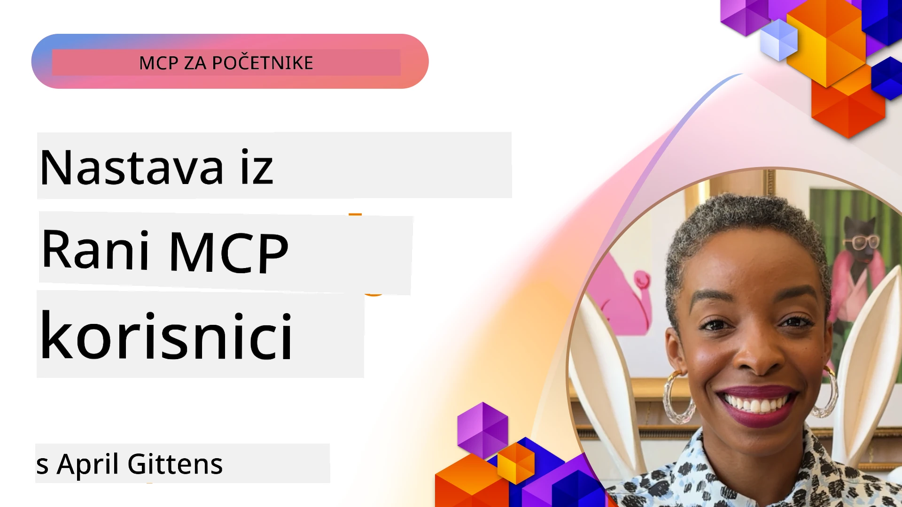

# 🌟 Lekcije od ranih korisnika

[](https://youtu.be/jds7dSmNptE)

_(Kliknite na sliku gore za pregled videa ove lekcije)_

## 🎯 Što ovaj modul pokriva

Ovaj modul istražuje kako stvarne organizacije i programeri koriste Model Context Protocol (MCP) za rješavanje stvarnih izazova i poticanje inovacija. Kroz detaljne studije slučaja, praktične projekte i primjere, otkrit ćete kako MCP omogućuje sigurnu, skalabilnu AI integraciju koja povezuje jezične modele, alate i podatke poduzeća.

### 📚 Pogledajte MCP u akciji

Želite li vidjeti primjenu ovih principa na alatima spremnim za produkciju? Pogledajte naš [**10 Microsoft MCP servera koji transformiraju produktivnost programera**](microsoft-mcp-servers.md), koji prikazuje stvarne Microsoft MCP servere koje možete koristiti već danas.

## Pregled

Ova lekcija istražuje kako su rani korisnici iskoristili Model Context Protocol (MCP) za rješavanje stvarnih problema i poticanje inovacija u različitim industrijama. Kroz detaljne studije slučaja i praktične projekte, vidjet ćete kako MCP omogućuje standardiziranu, sigurnu i skalabilnu AI integraciju — povezujući velike jezične modele, alate i podatke poduzeća u jedinstvenom okviru. Steći ćete praktično iskustvo u dizajniranju i izradi rješenja temeljenih na MCP-u, naučiti iz provjerenih obrazaca implementacije i otkriti najbolje prakse za implementaciju MCP-a u produkcijskim okruženjima. Lekcija također ističe nove trendove, buduće smjerove i open-source resurse koji će vam pomoći da ostanete na čelu MCP tehnologije i njenog evoluirajućeg ekosustava.

## Ciljevi učenja

- Analizirati stvarne implementacije MCP-a u različitim industrijama  
- Dizajnirati i izgraditi kompletne aplikacije temeljene na MCP-u  
- Istražiti nove trendove i buduće smjerove u MCP tehnologiji  
- Primijeniti najbolje prakse u stvarnim razvojnim scenarijima  

## Stvarne implementacije MCP-a

### Studija slučaja 1: Automatizacija korisničke podrške poduzeća

Multinacionalna kompanija implementirala je rješenje bazirano na MCP-u za standardizaciju AI interakcija kroz njihove sustave korisničke podrške. Ovo im je omogućilo:

- Kreiranje jedinstvenog sučelja za više LLM pružatelja usluga  
- Održavanje dosljednog upravljanja promptovima među odjelima  
- Uvođenje robusnih sigurnosnih i usklađenosnih kontrola  
- Jednostavno prebacivanje između različitih AI modela prema specifičnim potrebama  

**Tehnička implementacija:**

```python
# Implementacija Python MCP poslužitelja za korisničku podršku
import logging
import asyncio
from modelcontextprotocol import create_server, ServerConfig
from modelcontextprotocol.server import MCPServer
from modelcontextprotocol.transports import create_http_transport
from modelcontextprotocol.resources import ResourceDefinition
from modelcontextprotocol.prompts import PromptDefinition
from modelcontextprotocol.tool import ToolDefinition

# Konfigurirajte zapisivanje dnevnika
logging.basicConfig(level=logging.INFO)

async def main():
    # Kreirajte konfiguraciju poslužitelja
    config = ServerConfig(
        name="Enterprise Customer Support Server",
        version="1.0.0",
        description="MCP server for handling customer support inquiries"
    )
    
    # Inicijalizirajte MCP poslužitelj
    server = create_server(config)
    
    # Registrirajte resurse baze znanja
    server.resources.register(
        ResourceDefinition(
            name="customer_kb",
            description="Customer knowledge base documentation"
        ),
        lambda params: get_customer_documentation(params)
    )
    
    # Registrirajte predloške upita
    server.prompts.register(
        PromptDefinition(
            name="support_template",
            description="Templates for customer support responses"
        ),
        lambda params: get_support_templates(params)
    )
    
    # Registrirajte alate za podršku
    server.tools.register(
        ToolDefinition(
            name="ticketing",
            description="Create and update support tickets"
        ),
        handle_ticketing_operations
    )
    
    # Pokrenite poslužitelj s HTTP transportom
    transport = create_http_transport(port=8080)
    await server.run(transport)

if __name__ == "__main__":
    asyncio.run(main())
```
  
**Rezultati:** 30% smanjenje troškova modela, 45% poboljšanje konzistentnosti odgovora i poboljšana usklađenost u globalnim operacijama.

### Studija slučaja 2: Zdravstveni dijagnostički asistent

Zdravstveni pružatelj usluga razvio je MCP infrastrukturu za integraciju više specijaliziranih medicinskih AI modela uz osiguravanje zaštite osjetljivih pacijentovih podataka:

- Besprijekorno prebacivanje između općih i specijalističkih medicinskih modela  
- Stroge kontrole privatnosti i audita  
- Integracija s postojećim sustavima elektroničkih zdravstvenih kartona (EHR)  
- Dosljedna inženjerija promptova za medicinsku terminologiju  

**Tehnička implementacija:**

```csharp
// C# MCP host application implementation in healthcare application
using Microsoft.Extensions.DependencyInjection;
using ModelContextProtocol.SDK.Client;
using ModelContextProtocol.SDK.Security;
using ModelContextProtocol.SDK.Resources;

public class DiagnosticAssistant
{
    private readonly MCPHostClient _mcpClient;
    private readonly PatientContext _patientContext;
    
    public DiagnosticAssistant(PatientContext patientContext)
    {
        _patientContext = patientContext;
        
        // Configure MCP client with healthcare-specific settings
        var clientOptions = new ClientOptions
        {
            Name = "Healthcare Diagnostic Assistant",
            Version = "1.0.0",
            Security = new SecurityOptions
            {
                Encryption = EncryptionLevel.Medical,
                AuditEnabled = true
            }
        };
        
        _mcpClient = new MCPHostClientBuilder()
            .WithOptions(clientOptions)
            .WithTransport(new HttpTransport("https://healthcare-mcp.example.org"))
            .WithAuthentication(new HIPAACompliantAuthProvider())
            .Build();
    }
    
    public async Task<DiagnosticSuggestion> GetDiagnosticAssistance(
        string symptoms, string patientHistory)
    {
        // Create request with appropriate resources and tool access
        var resourceRequest = new ResourceRequest
        {
            Name = "patient_records",
            Parameters = new Dictionary<string, object>
            {
                ["patientId"] = _patientContext.PatientId,
                ["requestingProvider"] = _patientContext.ProviderId
            }
        };
        
        // Request diagnostic assistance using appropriate prompt
        var response = await _mcpClient.SendPromptRequestAsync(
            promptName: "diagnostic_assistance",
            parameters: new Dictionary<string, object>
            {
                ["symptoms"] = symptoms,
                patientHistory = patientHistory,
                relevantGuidelines = _patientContext.GetRelevantGuidelines()
            });
            
        return DiagnosticSuggestion.FromMCPResponse(response);
    }
}
```
  
**Rezultati:** Poboljšani dijagnostički prijedlozi za liječnike pri potpunoj usklađenosti s HIPAA-om te značajno smanjenje mijenjanja konteksta između sustava.

### Studija slučaja 3: Financijske usluge za analizu rizika

Financijska institucija implementirala je MCP kako bi standardizirala procese analize rizika u različitim odjelima:

- Kreiran jedinstven interfejs za modele kreditnog rizika, detekcije prijevara i investicijskog rizika  
- Implementirane stroge kontrole pristupa i verzioniranje modela  
- Osigurana audibilnost svih AI preporuka  
- Održavan dosljedni format podataka kroz različite sustave  

**Tehnička implementacija:**

```java
// Java MCP poslužitelj za procjenu financijskog rizika
import org.mcp.server.*;
import org.mcp.security.*;

public class FinancialRiskMCPServer {
    public static void main(String[] args) {
        // Kreiraj MCP poslužitelj s funkcijama usklađenosti financija
        MCPServer server = new MCPServerBuilder()
            .withModelProviders(
                new ModelProvider("risk-assessment-primary", new AzureOpenAIProvider()),
                new ModelProvider("risk-assessment-audit", new LocalLlamaProvider())
            )
            .withPromptTemplateDirectory("./compliance/templates")
            .withAccessControls(new SOCCompliantAccessControl())
            .withDataEncryption(EncryptionStandard.FINANCIAL_GRADE)
            .withVersionControl(true)
            .withAuditLogging(new DatabaseAuditLogger())
            .build();
            
        server.addRequestValidator(new FinancialDataValidator());
        server.addResponseFilter(new PII_RedactionFilter());
        
        server.start(9000);
        
        System.out.println("Financial Risk MCP Server running on port 9000");
    }
}
```
  
**Rezultati:** Poboljšana usklađenost s regulativama, 40% brži ciklusi implementacije modela i poboljšana konzistentnost procjene rizika kroz odjele.

### Studija slučaja 4: Microsoft Playwright MCP server za automatizaciju preglednika

Microsoft je razvio [Playwright MCP server](https://github.com/microsoft/playwright-mcp) za omogućavanje sigurne, standardizirane automatizacije preglednika putem Model Context Protocola. Ovaj server spreman za produkciju omogućuje AI agentima i LLM-ovima interakciju s web preglednicima na kontroliran, auditiran i proširiv način — omogućavajući scenarije poput automatiziranog web testiranja, ekstrakcije podataka i end-to-end tokova rada.

> **🎯 Alat spreman za produkciju**  
>  
> Ova studija slučaja prikazuje pravi MCP server koji možete koristiti odmah! Saznajte više o Playwright MCP serveru i još 9 drugih Microsoft MCP servera spremnih za produkciju u našem [**Vodiču za Microsoft MCP servere**](microsoft-mcp-servers.md#8--playwright-mcp-server).

**Ključne značajke:**  
- Izlaže mogućnosti automatizacije preglednika (navigacija, popunjavanje obrazaca, snimanje zaslona, itd.) kao MCP alate  
- Implementira stroge kontrole pristupa i sandboxing za sprječavanje neovlaštenih radnji  
- Pruža detaljne audite za sve interakcije s preglednikom  
- Podržava integraciju s Azure OpenAI i drugim LLM pružateljima za automatizaciju vođenu agentima  
- Pokreće mogućnosti pregledavanja weba u GitHub Copilot Coding Agentu  

**Tehnička implementacija:**

```typescript
// TypeScript: Registracija Playwright alata za automatizaciju preglednika u MCP poslužitelju
import { createServer, ToolDefinition } from 'modelcontextprotocol';
import { launch } from 'playwright';

const server = createServer({
  name: 'Playwright MCP Server',
  version: '1.0.0',
  description: 'MCP server for browser automation using Playwright'
});

// Registrirajte alat za navigaciju do URL-a i snimanje zaslona
server.tools.register(
  new ToolDefinition({
    name: 'navigate_and_screenshot',
    description: 'Navigate to a URL and capture a screenshot',
    parameters: {
      url: { type: 'string', description: 'The URL to visit' }
    }
  }),
  async ({ url }) => {
    const browser = await launch();
    const page = await browser.newPage();
    await page.goto(url);
    const screenshot = await page.screenshot();
    await browser.close();
    return { screenshot };
  }
);

// Pokrenite MCP poslužitelj
server.listen(8080);
```
  
**Rezultati:**  

- Omogućena sigurna, programska automatizacija preglednika za AI agente i LLM  
- Smanjen manuelni napor testiranja i poboljšana pokrivenost testovima za web aplikacije  
- Pruža ponovno iskoristiv, proširiv okvir za integraciju alata baziranih na pregledniku u okruženju poduzeća  
- Pokreće mogućnosti web pregledavanja u GitHub Copilot-u  

**Reference:**  

- [Playwright MCP Server GitHub repozitorij](https://github.com/microsoft/playwright-mcp)  
- [Microsoft AI i rješenja za automatizaciju](https://azure.microsoft.com/en-us/products/ai-services/)

### Studija slučaja 5: Azure MCP – Model Context Protocol razine poduzeća kao usluga

Azure MCP server ([https://aka.ms/azmcp](https://aka.ms/azmcp)) je Microsoftova upravljana implementacija Model Context Protocola razine poduzeća, dizajnirana za pružanje skalabilnih, sigurnih i usklađenih MCP serverskih mogućnosti kao cloud usluge. Azure MCP omogućuje organizacijama brzo postavljanje, upravljanje i integraciju MCP servera s Azure AI, podacima i sigurnosnim uslugama, smanjujući operativne troškove i ubrzavajući prihvaćanje AI-a.

> **🎯 Alat spreman za produkciju**  
>  
> Ovo je pravi MCP server koji možete koristiti odmah! Saznajte više o Azure AI Foundry MCP serveru u našem [**Vodiču za Microsoft MCP servere**](microsoft-mcp-servers.md).

- Potpuno upravljano MCP serversko hostanje s ugrađenim skaliranjem, nadzorom i sigurnošću  
- Izvorna integracija s Azure OpenAI, Azure AI Search i drugim Azure uslugama  
- Autentikacija i autorizacija razine poduzeća putem Microsoft Entra ID  
- Podrška za prilagođene alate, predloške promptova i konektore resursa  
- Usklađenost sa sigurnosnim i regulatornim zahtjevima razine poduzeća  

**Tehnička implementacija:**

```yaml
# Example: Azure MCP server deployment configuration (YAML)
apiVersion: mcp.microsoft.com/v1
kind: McpServer
metadata:
  name: enterprise-mcp-server
spec:
  modelProviders:
    - name: azure-openai
      type: AzureOpenAI
      endpoint: https://<your-openai-resource>.openai.azure.com/
      apiKeySecret: <your-azure-keyvault-secret>
  tools:
    - name: document_search
      type: AzureAISearch
      endpoint: https://<your-search-resource>.search.windows.net/
      apiKeySecret: <your-azure-keyvault-secret>
  authentication:
    type: EntraID
    tenantId: <your-tenant-id>
  monitoring:
    enabled: true
    logAnalyticsWorkspace: <your-log-analytics-id>
```
  
**Rezultati:**  
- Smanjeno vrijeme do vrijednosti za AI projekte razine poduzeća pružanjem platforme spremne za korištenje i usklađene MCP server platforme  
- Pojednostavljena integracija LLM-ova, alata i izvora podataka poduzeća  
- Poboljšana sigurnost, promatranje i operativna učinkovitost MCP radnih opterećenja  
- Poboljšana kvaliteta koda uz najbolje prakse Azure SDK-a i aktualne obrasce autentikacije  

**Reference:**  
- [Azure MCP Dokumentacija](https://aka.ms/azmcp)  
- [Azure MCP Server GitHub repozitorij](https://github.com/Azure/azure-mcp)  
- [Azure AI usluge](https://azure.microsoft.com/en-us/products/ai-services/)  
- [Microsoft MCP centar](https://mcp.azure.com)

## Studija slučaja 6: NLWeb

MCP (Model Context Protocol) je protokol u nastajanju za chatbotove i AI asistente za interakciju s alatima. Svaka NLWeb instanca također je MCP server, koji podržava jednu osnovnu metodu, ask, koja se koristi za postavljanje pitanja web stranici na prirodnom jeziku. Povratni odgovor koristi schema.org, široko korišteni vokabular za opisivanje web podataka. Pojednostavljeno rečeno, MCP je NLWeb kao što je HTTP za HTML. NLWeb kombinira protokole, formate schema.org i primjere koda kako bi pomogao stranicama brzo stvoriti ove krajnje točke, što koristi i ljudima kroz konverzacijska sučelja i strojevima kroz prirodnu interakciju agent-agent.

Postoje dva različita dijela NLWeb-a.  
- Protokol, vrlo jednostavan za početak, za sučelje sa stranicom na prirodnom jeziku i format koji koristi json i schema.org za povratni odgovor. Pogledajte dokumentaciju o REST API-u za više detalja.  
- Jednostavna implementacija (1) koja koristi postojeću semantiku, za stranice koje se mogu apstrahirati kao liste stavki (proizvodi, recepti, atrakcije, recenzije itd.). Zajedno s nizom korisničkih sučelja, stranice lako mogu pružiti konverzacijska sučelja prema svom sadržaju. Pogledajte dokumentaciju o Tijeku chat upita za više detalja kako to funkcionira.

**Reference:**  
- [Azure MCP Dokumentacija](https://aka.ms/azmcp)  
- [NLWeb](https://github.com/microsoft/NlWeb)

### Studija slučaja 7: Azure AI Foundry MCP Server – Integracija enterprise AI agenata

Azure AI Foundry MCP serveri pokazuju kako se MCP može koristiti za orkestraciju i upravljanje AI agentima i radnim tokovima u poslovnim okruženjima. Integracijom MCP-a s Azure AI Foundry, organizacije mogu standardizirati interakcije agenata, koristiti Foundry upravljanje radnim tokovima i osigurati sigurne i skalabilne implementacije.

> **🎯 Alat spreman za produkciju**  
>
> Ovo je pravi MCP server koji možete koristiti danas! Saznajte više o Azure AI Foundry MCP Serveru u našem [**Vodiču za Microsoft MCP servere**](microsoft-mcp-servers.md#9--azure-ai-foundry-mcp-server).

**Ključne značajke:**  
- Sveobuhvatan pristup Azure AI ekosustavu, uključujući katalog modela i upravljanje implementacijama  
- Indeksiranje znanja putem Azure AI Search za RAG aplikacije  
- Alati za evaluaciju performansi AI modela i osiguranje kvalitete  
- Integracija s Azure AI Foundry Catalog i Labs za najsuvremenije istraživačke modele  
- Mogućnosti upravljanja agentima i evaluacije za produkcijske scenarije  

**Rezultati:**  
- Brzo prototipiranje i snažan nadzor radnih tokova AI agenata  
- Besprijekorna integracija s Azure AI uslugama za napredne scenarije  
- Jedinstveno sučelje za izgradnju, implementaciju i nadzor pipelineova agenata  
- Poboljšana sigurnost, usklađenost i operativna učinkovitost za poduzeća  
- Ubrzano prihvaćanje AI-a uz održavanje kontrole nad složenim procesima vođenim agentima  

**Reference:**  
- [Azure AI Foundry MCP Server GitHub repozitorij](https://github.com/azure-ai-foundry/mcp-foundry)  
- [Integracija Azure AI agenata s MCP-om (Microsoft Foundry Blog)](https://devblogs.microsoft.com/foundry/integrating-azure-ai-agents-mcp/)

### Studija slučaja 8: Foundry MCP Playground – Eksperimentiranje i prototipiranje

Foundry MCP Playground nudi spremno za korištenje okruženje za eksperimentiranje s MCP serverima i integracijama Azure AI Foundry. Programeri mogu brzo prototipirati, testirati i evaluirati AI modele i radne tokove agenata koristeći resurse iz Azure AI Foundry Catalog i Labs. Playground pojednostavljuje postavljanje, pruža primjere projekata i podržava suradnički razvoj, čineći lakim istraživanje najboljih praksi i novih scenarija uz minimalni napor. Posebno je koristan za timove koji žele potvrditi ideje, dijeliti eksperimente i ubrzati učenje bez potrebe za složenom infrastrukturom. Smanjujući barijeru ulaska, playground potiče inovacije i doprinos zajednice u ekosustavu MCP i Azure AI Foundry.

**Reference:**

- [Foundry MCP Playground GitHub repozitorij](https://github.com/azure-ai-foundry/foundry-mcp-playground)

### Studija slučaja 9: Microsoft Learn Docs MCP Server – Pristup dokumentaciji putem AI-ja

Microsoft Learn Docs MCP Server je usluga hostana u oblaku koja AI asistentima omogućuje pristup službenoj Microsoft dokumentaciji u stvarnom vremenu putem Model Context Protocola. Ovaj server spreman za produkciju povezan je s opsežnim Microsoft Learn ekosustavom i omogućuje semantičko pretraživanje kroz sve službene Microsoft izvore.

> **🎯 Alat spreman za produkciju**  
>  
> Ovo je pravi MCP server koji možete koristiti danas! Saznajte više o Microsoft Learn Docs MCP Serveru u našem [**Vodiču za Microsoft MCP servere**](microsoft-mcp-servers.md#1--microsoft-learn-docs-mcp-server).

**Ključne značajke:**  
- Pristup u stvarnom vremenu službenoj Microsoft dokumentaciji, Azure dokumentima i Microsoft 365 dokumentaciji  
- Napredne mogućnosti semantičkog pretraživanja koje razumiju kontekst i namjeru  
- Uvijek ažurirane informacije jer je sadržaj Microsoft Learn-a objavljen odmah  
- Opsežno pokrivanje kroz Microsoft Learn, Azure dokumentaciju i izvore Microsoft 365  
- Vraća do 10 visokokvalitetnih sadržajnih dijelova s naslovima članaka i URL-ovima  

**Zašto je ključno:**  
- Rješava problem "zastarjelih AI znanja" za Microsoft tehnologije  
- Osigurava da AI asistenti imaju pristup najnovijim značajkama .NET-a, C#, Azure-a i Microsoft 365  
- Pruža autoritativne, izvornoproglašene informacije za točnu generaciju koda  
- Neophodno za programere koji rade s brzo razvijajućim Microsoft tehnologijama  

**Rezultati:**  
- Drastično poboljšana točnost AI generiranog koda za Microsoft tehnologije  
- Smanjeno vrijeme provedeno tražeći aktualnu dokumentaciju i najbolje prakse  
- Poboljšana produktivnost programera uz dohvat dokumentacije svjestan konteksta  
- Besprijekorna integracija s razvojnim radnim tokovima bez napuštanja IDE-a  

**Reference:**  
- [Microsoft Learn Docs MCP Server GitHub repozitorij](https://github.com/MicrosoftDocs/mcp)  
- [Microsoft Learn dokumentacija](https://learn.microsoft.com/)

## Praktični projekti

### Projekt 1: Izradite MCP server s više pružatelja usluga

**Cilj:** Kreirati MCP server koji može rutirati zahtjeve prema više pružatelja AI modela na temelju specifičnih kriterija.

**Zahtjevi:**

- Podrška za najmanje tri različita pružatelja modela (npr. OpenAI, Anthropic, lokalni modeli)  
- Implementirati mehanizam rutiranja na temelju metapodataka zahtjeva  
- Izraditi sustav konfiguracije za upravljanje vjerodajnicama pružatelja  
- Dodati keširanje za optimizaciju performansi i troškova  
- Izgraditi jednostavnu nadzornu ploču za praćenje korištenja  

**Koraci implementacije:**

1. Postavite osnovnu MCP infrastrukturu servera  
2. Implementirajte adaptere pružatelja za svaku uslugu AI modela  
3. Kreirajte rutirnu logiku na temelju atributa zahtjeva  
4. Dodajte mehanizme keširanja za česte zahtjeve  
5. Razvijte nadzornu ploču za praćenje  
6. Testirajte s različitim obrascima zahtjeva  

**Tehnologije:** Odaberite između Python (.NET/Java/Python prema vašim preferencijama), Redis za keširanje i jednostavan web framework za nadzornu ploču.

### Projekt 2: Sustav za upravljanje promptovima razine poduzeća
**Cilj:** Razviti sustav temeljen na MCP-u za upravljanje, verzioniranje i implementaciju predložaka upita u cijeloj organizaciji.

**Zahtjevi:**

- Kreirati centraliziranu pohranu za predloške upita
- Implementirati sustave za verzioniranje i odobravanje
- Izgraditi mogućnosti testiranja predložaka s uzorcima unosa
- Razviti kontrole pristupa temeljene na ulogama
- Kreirati API za dohvat i implementaciju predložaka

**Koraci implementacije:**

1. Dizajnirati shemu baze podataka za pohranu predložaka
2. Kreirati osnovni API za CRUD operacije predložaka
3. Implementirati sustav verzioniranja
4. Izgraditi tijek odobravanja
5. Razviti okvir za testiranje
6. Kreirati jednostavno web sučelje za upravljanje
7. Integrirati s MCP serverom

**Tehnologije:** Vaš odabrani backend framework, SQL ili NoSQL baza podataka i frontend framework za sučelje upravljanja.

### Projekt 3: Platforma za generiranje sadržaja temeljena na MCP-u

**Cilj:** Izgraditi platformu za generiranje sadržaja koja koristi MCP za pružanje dosljednih rezultata za različite vrste sadržaja.

**Zahtjevi:**

- Podrška za više formata sadržaja (blog postovi, društvene mreže, marketinški tekstovi)
- Implementacija generiranja temeljenog na predlošcima s opcijama prilagodbe
- Kreirati sustav za pregled i povratne informacije o sadržaju
- Pratiti metrike performansi sadržaja
- Podrška za verzioniranje i iteraciju sadržaja

**Koraci implementacije:**

1. Postaviti MCP klijentsku infrastrukturu
2. Kreirati predloške za različite vrste sadržaja
3. Izgraditi tok generiranja sadržaja
4. Implementirati sustav pregleda
5. Razviti sustav za praćenje metrika
6. Kreirati korisničko sučelje za upravljanje predlošcima i generiranje sadržaja

**Tehnologije:** Vaš preferirani programski jezik, web framework i sustav baze podataka.

## Budući smjerovi MCP tehnologije

### Rastući trendovi

1. **Višemedijalni MCP**
   - Proširenje MCP-a za standardiziranje interakcija s modelima za slike, zvuk i video
   - Razvoj sposobnosti međumodalnog rasuđivanja
   - Standardizirani formati upita za različite modalitete

2. **Federirana MCP infrastruktura**
   - Distribuirane MCP mreže koje mogu dijeliti resurse između organizacija
   - Standardizirani protokoli za sigurno dijeljenje modela
   - Tehnike privatnog računanja

3. **MCP tržnice**
   - Ekosustavi za dijeljenje i unovčavanje MCP predložaka i dodataka
   - Procesi osiguranja kvalitete i certificiranja
   - Integracija s tržnicama modela

4. **MCP za Edge računarstvo**
   - Prilagodba MCP standarda za uređaje s ograničenim resursima na rubu mreže
   - Optimizirani protokoli za okruženja s malim propusnim opsegom
   - Specijalizirane MCP implementacije za IoT ekosustave

5. **Regulatorni okviri**
   - Razvoj MCP proširenja za usklađenost s regulativama
   - Standardizirane audit staze i sučelja za objašnjivost
   - Integracija s novim okvirima za upravljanje AI-jem

### MCP rješenja od Microsofta

Microsoft i Azure razvili su nekoliko open-source repozitorija za pomoć developerima u implementaciji MCP-a u raznim scenarijima:

#### Microsoft Organization

1. [playwright-mcp](https://github.com/microsoft/playwright-mcp) - Playwright MCP server za automatizaciju preglednika i testiranje
2. [files-mcp-server](https://github.com/microsoft/files-mcp-server) - Implementacija OneDrive MCP servera za lokalno testiranje i doprinos zajednici
3. [NLWeb](https://github.com/microsoft/NlWeb) - NLWeb je kolekcija otvorenih protokola i pripadajućih open-source alata. Fokusiran je na uspostavu temeljne sloja za AI Web

#### Azure-Samples Organization

1. [mcp](https://github.com/Azure-Samples/mcp) - Linkovi na primjere, alate i resurse za izgradnju i integraciju MCP servera na Azureu koristeći više programskih jezika
2. [mcp-auth-servers](https://github.com/Azure-Samples/mcp-auth-servers) - Referentni MCP serveri koji demonstriraju autentikaciju u skladu sa specifikacijom Model Context Protocola
3. [remote-mcp-functions](https://github.com/Azure-Samples/remote-mcp-functions) - Početna stranica za implementacije Remote MCP Servera u Azure Functions s linkovima na repozitorije za razne jezike
4. [remote-mcp-functions-python](https://github.com/Azure-Samples/remote-mcp-functions-python) - Brzi početak za izradu i deployment prilagođenih Remote MCP servera koristeći Azure Functions s Pythonom
5. [remote-mcp-functions-dotnet](https://github.com/Azure-Samples/remote-mcp-functions-dotnet) - Brzi početak za izradu i deployment prilagođenih Remote MCP servera koristeći Azure Functions s .NET/C#
6. [remote-mcp-functions-typescript](https://github.com/Azure-Samples/remote-mcp-functions-typescript) - Brzi početak za izradu i deployment prilagođenih Remote MCP servera koristeći Azure Functions s TypeScriptom
7. [remote-mcp-apim-functions-python](https://github.com/Azure-Samples/remote-mcp-apim-functions-python) - Azure API Management kao AI gateway za Remote MCP servere koristeći Python
8. [AI-Gateway](https://github.com/Azure-Samples/AI-Gateway) - APIM ❤️ AI eksperimenti uključujući MCP mogućnosti, integraciju s Azure OpenAI i AI Foundry

Ovi repozitoriji nude razne implementacije, predloške i resurse za rad s Model Context Protocolom kroz različite programske jezike i Azure servise. Pokrivaju širok spektar upotreba od osnovnih implementacija servera do autentikacije, deploymentsa u oblaku i scenarija integracije u poduzećima.

#### MCP direktorij resursa

Direktorij [MCP Resources](https://github.com/microsoft/mcp/tree/main/Resources) u službenom Microsoft MCP repozitoriju pruža odabranu kolekciju uzoraka resursa, predložaka upita i definicija alata za korištenje s Model Context Protocol serverima. Ovaj direktorij je osmišljen da pomogne developerima da brzo započnu s MCP-om nudeći višekratne građevne blokove i primjere najboljih praksi za:

- **Predloške upita:** Spremni za upotrebu predlošci upita za uobičajene AI zadatke i scenarije, prilagodljivi za vlastite MCP server implementacije.
- **Definicije alata:** Primjeri shema alata i metapodataka za standardiziranje integracije i pozivanja alata u različitim MCP serverima.
- **Primjeri resursa:** Primjeri definicija resursa za povezivanje s izvorima podataka, API-jima i vanjskim servisima unutar MCP okvira.
- **Referentne implementacije:** Praktični primjeri koji pokazuju kako strukturirati i organizirati resurse, upite i alate u stvarnim MCP projektima.

Ovi resursi ubrzavaju razvoj, promiču standardizaciju i pomažu osigurati najbolje prakse pri izgradnji i implementaciji rješenja temeljenih na MCP-u.

#### MCP direktorij resursa

- [MCP Resources (Uzorci upita, alati i definicije resursa)](https://github.com/microsoft/mcp/tree/main/Resources)

### Istraživačke mogućnosti

- Učinkovite tehnike optimizacije upita unutar MCP okvira
- Sigurnosni modeli za višekorisnički MCP deployment
- Benchmark testovi performansi između različitih MCP implementacija
- Formalne metode verifikacije MCP servera

## Zaključak

Model Context Protocol (MCP) brzo oblikuje budućnost standardizirane, sigurne i međusobno povezive AI integracije u raznim industrijama. Kroz studije slučaja i praktične projekte u ovom poglavlju, vidjeli ste kako rani korisnici — uključujući Microsoft i Azure — koriste MCP za rješavanje stvarnih izazova, ubrzavanje usvajanja AI-ja i osiguravanje usklađenosti, sigurnosti i skalabilnosti. Modularni pristup MCP-a omogućuje organizacijama povezivanje velikih jezičnih modela, alata i podataka iz poduzeća u jedinstveni, provjerljivi okvir. Kako MCP nastavlja rasti, aktivno sudjelovanje u zajednici, istraživanje open-source resursa i primjena najboljih praksi bit će ključni za izgradnju robusnih AI rješenja spremnih za budućnost.

## Dodatni resursi

- [MCP Foundry GitHub repozitorij](https://github.com/azure-ai-foundry/mcp-foundry)
- [Foundry MCP Playground](https://github.com/azure-ai-foundry/foundry-mcp-playground)
- [Integracija Azure AI agenata s MCP-om (Microsoft Foundry Blog)](https://devblogs.microsoft.com/foundry/integrating-azure-ai-agents-mcp/)
- [MCP GitHub repozitorij (Microsoft)](https://github.com/microsoft/mcp)
- [MCP direktorij resursa (Uzorci upita, alati i definicije resursa)](https://github.com/microsoft/mcp/tree/main/Resources)
- [MCP zajednica i dokumentacija](https://modelcontextprotocol.io/introduction)
- [MCP specifikacija (2025-11-25)](https://spec.modelcontextprotocol.io/specification/2025-11-25/)
- [Dokumentacija Azure MCP-a](https://aka.ms/azmcp)
- [OWASP MCP Top 10](https://microsoft.github.io/mcp-azure-security-guide/mcp/) - Najbolje sigurnosne prakse
- [Playwright MCP Server GitHub repozitorij](https://github.com/microsoft/playwright-mcp)
- [Files MCP Server (OneDrive)](https://github.com/microsoft/files-mcp-server)
- [Azure-Samples MCP](https://github.com/Azure-Samples/mcp)
- [MCP Auth Servers (Azure-Samples)](https://github.com/Azure-Samples/mcp-auth-servers)
- [Remote MCP Functions (Azure-Samples)](https://github.com/Azure-Samples/remote-mcp-functions)
- [Remote MCP Functions Python (Azure-Samples)](https://github.com/Azure-Samples/remote-mcp-functions-python)
- [Remote MCP Functions .NET (Azure-Samples)](https://github.com/Azure-Samples/remote-mcp-functions-dotnet)
- [Remote MCP Functions TypeScript (Azure-Samples)](https://github.com/Azure-Samples/remote-mcp-functions-typescript)
- [Remote MCP APIM Functions Python (Azure-Samples)](https://github.com/Azure-Samples/remote-mcp-apim-functions-python)
- [AI-Gateway (Azure-Samples)](https://github.com/Azure-Samples/AI-Gateway)
- [Microsoft AI i rješenja za automatizaciju](https://azure.microsoft.com/en-us/products/ai-services/)

## Vježbe

1. Analizirajte jednu od studija slučaja i predložite alternativni pristup implementaciji.
2. Odaberite jednu od ideja za projekt i izradite detaljnu tehničku specifikaciju.
3. Istražite industriju koja nije pokrivena studijama slučaja i izložite kako MCP može riješiti specifične izazove te industrije.
4. Istražite jedan od budućih smjerova i osmislite koncept novog MCP proširenja za podršku istom.

## Što slijedi

Istražite više: [Microsoft MCP Servers](./microsoft-mcp-servers.md)

Nastavite na: [Modul 8: Najbolje prakse](../08-BestPractices/README.md)

---

<!-- CO-OP TRANSLATOR DISCLAIMER START -->
**Odricanje od odgovornosti**:
Ovaj dokument preveden je pomoću AI prevoditeljskog servisa [Co-op Translator](https://github.com/Azure/co-op-translator). Iako nastojimo postići točnost, imajte na umu da automatski prijevodi mogu sadržavati pogreške ili netočnosti. Izvorni dokument na njegovom izvornom jeziku treba smatrati autoritativnim izvorom. Za važne informacije preporuča se profesionalni ljudski prijevod. Nismo odgovorni za bilo kakva nesporazuma ili pogrešna tumačenja koja proizlaze iz korištenja ovog prijevoda.
<!-- CO-OP TRANSLATOR DISCLAIMER END -->