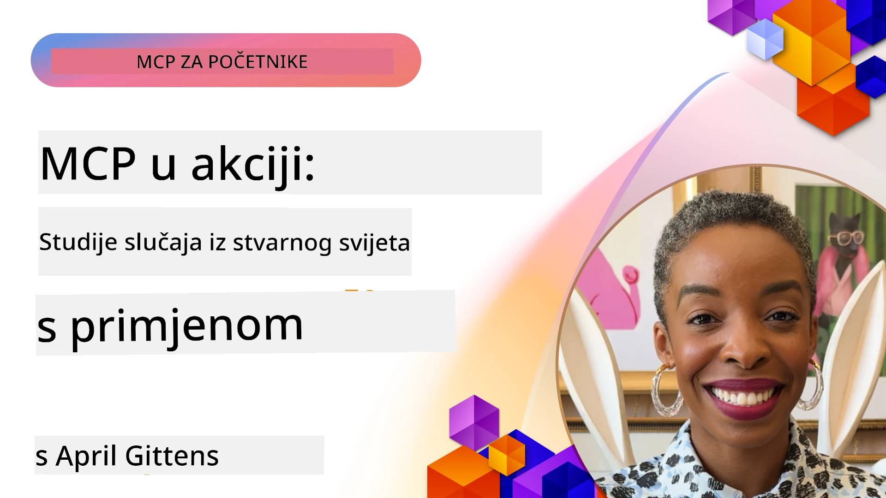

# MCP u praksi: Studije slučaja iz stvarnog svijeta

_(Kliknite na sliku iznad za pregled video lekcije)_

Model Context Protocol (MCP) mijenja način na koji AI aplikacije komuniciraju s podacima, alatima i uslugama. Ovaj odjeljak prikazuje studije slučaja iz stvarnog svijeta koje demonstriraju praktične primjene MCP-a u različitim poslovnim scenarijima.

## Pregled

Ovaj odjeljak prikazuje konkretne primjere implementacija MCP-a, ističući kako organizacije koriste ovaj protokol za rješavanje složenih poslovnih izazova. Pregledom ovih studija slučaja steći ćete uvid u svestranost, skalabilnost i praktične koristi MCP-a u stvarnim situacijama.

## Ključni ciljevi učenja

Istraživanjem ovih studija slučaja vi ćete:

- Razumjeti kako se MCP može primijeniti za rješavanje specifičnih poslovnih problema
- Naučiti o različitim obrascima integracije i arhitektonskim pristupima
- Prepoznati najbolje prakse za implementaciju MCP-a u poslovnim okruženjima
- Steći uvid u izazove i rješenja na koja se nailazi u stvarnim implementacijama
- Identificirati prilike za primjenu sličnih obrazaca u vlastitim projektima

## Istaknute studije slučaja

### 1. [Azure AI Travel Agents – Referentna implementacija](./travelagentsample.md)

Ova studija slučaja proučava Microsoftovo opsežno referentno rješenje koje demonstrira kako izgraditi aplikaciju za planiranje putovanja s više agenata pokretanih AI-em koristeći MCP, Azure OpenAI i Azure AI Search. Projekt prikazuje:

- Orkestraciju višestrukih agenata putem MCP-a
- Integraciju podataka poduzeća s Azure AI Search
- Sigurnu, skalabilnu arhitekturu koristeći Azure usluge
- Proširive alate s ponovno upotrebljivim MCP komponentama
- Konverzacijsko korisničko iskustvo pokretano Azure OpenAI-em

Arhitektonski i implementacijski detalji pružaju vrijedne uvide u izgradnju složenih sustava s više agenata gdje MCP djeluje kao sloj koordinacije.

### 2. [Ažuriranje stavki u Azure DevOpsu iz YouTube podataka](./UpdateADOItemsFromYT.md)

Ova studija slučaja pokazuje praktičnu primjenu MCP-a za automatizaciju radnih tijekova. Prikazuje kako MCP alati mogu:

- Izvući podatke s online platformi (YouTube)
- Ažurirati stavke posla u Azure DevOps sustavima
- Kreirati ponovljive automatizirane radne tijekove
- Integrirati podatke između različitih sustava

Ovaj primjer ilustrira kako čak i relativno jednostavne MCP implementacije mogu donijeti značajno povećanje učinkovitosti automatiziranjem rutinskih zadataka i poboljšanjem konzistentnosti podataka između sustava.

### 3. [Preuzimanje dokumentacije u stvarnom vremenu s MCP-om](./docs-mcp/README.md)

Ova studija slučaja vodi vas kroz povezivanje Python konzolnog klijenta s MCP poslužiteljem za preuzimanje i evidentiranje Microsoftove dokumentacije u stvarnom vremenu koja je kontekstualno osviještena. Naučit ćete kako:

- Spojiti se na MCP poslužitelj koristeći Python klijent i službeni MCP SDK
- Koristiti streaming HTTP klijente za učinkovito preuzimanje podataka u stvarnom vremenu
- Pozivati dokumentacijske alate na poslužitelju i zapisivati odgovore izravno u konzolu
- Integrirati ažuriranu Microsoft dokumentaciju u svoj radni tijek bez napuštanja terminala

Poglavlje uključuje praktični zadatak, minimalni radni uzorak koda te poveznice na dodatne resurse za dublje učenje. Pogledajte puni vodič i kod u povezanom poglavlju kako biste razumjeli kako MCP može transformirati pristup dokumentaciji i produktivnost programera u konzolnim okolišima.

### 4. [Interaktivna web aplikacija za generiranje plana učenja s MCP-om](./docs-mcp/README.md)

Ova studija slučaja prikazuje kako izgraditi interaktivnu web aplikaciju koristeći Chainlit i Model Context Protocol (MCP) za generiranje personaliziranih planova učenja za bilo koju temu. Korisnici mogu navesti predmet (npr. "AI-900 certifikacija") i trajanje učenja (npr. 8 tjedana), a aplikacija će ponuditi preporuku sadržaja tjedan po tjedan. Chainlit omogućava konverzacijsko sučelje u obliku chata, čineći iskustvo zanimljivim i prilagodljivim.

- Konverzacijska web aplikacija pokretana Chainlitom
- Korisnički definirani upiti za temu i trajanje
- Preporuke sadržaja tjedan po tjedan koristeći MCP
- Prilagodljivi odgovori u stvarnom vremenu unutar chat sučelja

Projekt prikazuje kako se konverzacijski AI i MCP mogu kombinirati za izradu dinamičnih obrazovnih alata usmjerenih prema korisniku u modernom web okruženju.

### 5. [Dokumentacija unutar editora s MCP poslužiteljem u VS Code-u](./docs-mcp/README.md)

Ova studija slučaja pokazuje kako možete dovesti Microsoft Learn Docs izravno u VS Code okruženje koristeći MCP poslužitelj — nema više prebacivanja između kartica preglednika! Vidjet ćete kako:

- Odmah pretraživati i čitati dokumentaciju unutar VS Code-a koristeći MCP panel ili command palette
- Referencirati dokumentaciju i umetati poveznice izravno u README ili markdown datoteke tečaja
- Koristiti GitHub Copilot i MCP zajedno za besprijekornu AI-pokretanu dokumentaciju i rad s kodom
- Validirati i poboljšati svoju dokumentaciju uz povratne informacije u stvarnom vremenu i točnost iz Microsoft izvora
- Integrirati MCP s GitHub radnim tijekovima za kontinuiranu validaciju dokumentacije

Implementacija uključuje:

- Primjer `.vscode/mcp.json` konfiguracije za jednostavno postavljanje
- Vodiče uz snimke zaslona koji prikazuju iskustvo unutar editora
- Savjete za kombiniranje Copilota i MCP-a za maksimalnu produktivnost

Ovaj scenarij je idealan za autore tečajeva, pisce dokumentacije i developere koji žele ostati fokusirani u svom editoru dok rade s dokumentacijom, Copilotom i alatima za validaciju — sve pokretano MCP-om.

### 6. [Stvaranje MCP poslužitelja u APIM-u](./apimsample.md)

Ova studija slučaja pruža korak-po-korak vodič kako kreirati MCP poslužitelj koristeći Azure API Management (APIM). Ovaj vodič obuhvaća:

- Postavljanje MCP poslužitelja u Azure API Managementu
- Izlaganje API operacija kao MCP alata
- Konfiguraciju politika za ograničenje brzine i sigurnost
- Testiranje MCP poslužitelja koristeći Visual Studio Code i GitHub Copilot

Ovaj primjer ilustrira kako iskoristiti Azure mogućnosti za stvaranje robusnog MCP poslužitelja koji se može koristiti u raznim aplikacijama, poboljšavajući integraciju AI sustava s poduzećkim API-ima.

### 7. [GitHub MCP Registry — ubrzavanje agentne integracije](https://github.com/mcp)

Ova studija slučaja proučava kako GitHub MCP Registry, lansiran u rujnu 2025., rješava ključni izazov u AI ekosustavu: fragmentirani pronalazak i implementaciju MCP poslužitelja.

#### Pregled
**MCP Registry** rješava rastući problem raspršenih MCP poslužitelja po repozitorijima i registrima, što je prije usporavalo i otežavalo integraciju. Ovi poslužitelji omogućuju AI agentima interakciju s vanjskim sustavima poput API-ja, baza podataka i izvora dokumentacije.

#### Izjava problema
Razvojni programeri koji grade agentne radne tokove suočavali su se s nekoliko izazova:
- **Loša otkrivost** MCP poslužitelja na različitim platformama
- **Ponavljajući upiti za postavljanje** raspršeni po forumima i dokumentaciji
- **Sigurnosni rizici** od neprovjerenih i nepouzdanih izvora
- **Nedostatak standardizacije** u kvaliteti i kompatibilnosti poslužitelja

#### Arhitektura rješenja
GitHub MCP Registry centralizira pouzdane MCP poslužitelje s ključnim značajkama:
- **Jednim klikom instalacija** putem VS Code-a za jednostavno postavljanje
- **Sortiranje signala nad šumom** na temelju ocjena, aktivnosti i potvrda zajednice
- **Izravna integracija** s GitHub Copilotom i drugim MCP-kompatibilnim alatima
- **Otvoreni model doprinosa** koji omogućuje zajednici i poduzećima doprinos

#### Poslovni utjecaj
Registar donosi mjerljive koristi:
- **Brže uključivanje** programera koristeći alate poput Microsoft Learn MCP Servera koji izravno struji službenu dokumentaciju agentima
- **Poboljšana produktivnost** putem specijaliziranih poslužitelja poput `github-mcp-server` koji omogućuju prirodno jezičnu GitHub automatizaciju (kreiranje PR-ova, ponovni pokreti CI-a, skeniranje koda)
- **Veće povjerenje u ekosustav** zahvaljujući kuriranim popisima i transparentnim standardima konfiguracije

#### Strateška vrijednost
Za stručnjake specijalizirane za upravljanje životnim ciklusom agenata i reproducibilne radne tokove, MCP Registry pruža:
- **Modularnu implementaciju agenata** s standardiziranim komponentama
- **Pipelineove za evaluaciju** temeljene na registru za konzistentno testiranje i validaciju
- **Međualatnu interoperabilnost** koja omogućava besprijekornu integraciju među različitim AI platformama

Ova studija slučaja pokazuje da MCP Registry nije samo direktorij — to je temeljna platforma za skalabilnu, stvarnu integraciju modela i implementaciju agentnih sustava.

## Zaključak

Ove sedam sveobuhvatnih studija slučaja pokazuju iznimnu svestranost i praktične primjene Model Context Protocola u različitim stvarnim scenarijima. Od složenih sustava za planiranje putovanja s više agenata i upravljanja API-ima u poduzećima do pojednostavljenih radnih tokova dokumentacije i revolucionarnog GitHub MCP Registra, ovi primjeri pokazaju kako MCP pruža standardiziran, skalabilan način povezivanja AI sustava s alatima, podacima i uslugama potrebnim za isporuku izuzetne vrijednosti.

Studije slučaja obuhvaćaju više dimenzija MCP implementacije:
- **Integracija u poduzećima**: Azure API Management i automatizacija Azure DevOpsa
- **Orkestracija više agenata**: planiranje putovanja s koordiniranim AI agentima
- **Produktivnost programera**: integracija VS Code-a i pristup dokumentaciji u stvarnom vremenu
- **Razvoj ekosustava**: GitHub MCP Registry kao temeljna platforma
- **Obrazovne primjene**: generatori interaktivnih planova učenja i konverzacijska sučelja

Istražujući ove implementacije, stječete ključne uvide u:
- **Arhitektonske obrasce** za različite vrste i opsege primjene
- **Strategije implementacije** koje balansiraju funkcionalnost i održivost
- **Sigurnosne i skalabilne** aspekte za produkcijske implementacije
- **Najbolje prakse** za razvoj MCP poslužitelja i integraciju klijenata
- **Razmišljanje o ekosustavu** za izgradnju povezanih AI-pokretanih rješenja

Ovi primjeri zajedno pokazuju da MCP nije samo teorijski okvir, već zreo, spreman za produkciju protokol koji omogućuje praktična rješenja za složene poslovne izazove. Bilo da gradite jednostavne alate za automatizaciju ili sofisticirane sustave s više agenata, obrasci i pristupi ovdje ilustrirani pružaju čvrstu osnovu za vaše vlastite MCP projekte.

## Dodatni resursi

- [Azure AI Travel Agents GitHub repozitorij](https://github.com/Azure-Samples/azure-ai-travel-agents)
- [Azure DevOps MCP alat](https://github.com/microsoft/azure-devops-mcp)
- [Playwright MCP alat](https://github.com/microsoft/playwright-mcp)
- [Microsoft Docs MCP poslužitelj](https://github.com/MicrosoftDocs/mcp)
- [GitHub MCP Registry — ubrzavanje agentne integracije](https://github.com/mcp)
- [MCP primjeri iz zajednice](https://github.com/microsoft/mcp)

## Što slijedi

- Prethodni: [Modul 8: Najbolje prakse](../08-BestPractices/README.md)
- Sljedeći: [Modul 10: Pojednostavljenje AI radnih tokova: Izgradnja MCP poslužitelja s AI Toolkitom](../10-StreamliningAIWorkflowsBuildingAnMCPServerWithAIToolkit/README.md)

---

<!-- CO-OP TRANSLATOR DISCLAIMER START -->
**Izjava o odricanju od odgovornosti**:  
Ovaj dokument je preveden korištenjem AI usluge prevođenja [Co-op Translator](https://github.com/Azure/co-op-translator). Iako nastojimo postići točnost, imajte na umu da automatski prijevodi mogu sadržavati pogreške ili netočnosti. Izvorni dokument na izvornom jeziku treba smatrati autoritativnim izvorom. Za kritične informacije preporučuje se profesionalni ljudski prijevod. Nismo odgovorni za bilo kakva nesporazuma ili pogrešna tumačenja koja proizlaze iz korištenja ovog prijevoda.
<!-- CO-OP TRANSLATOR DISCLAIMER END -->