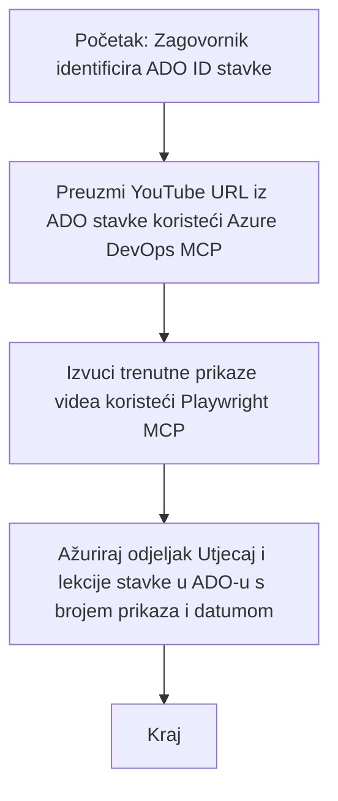

# Studija slučaja: Ažuriranje Azure DevOps stavki podacima s YouTubea pomoću MCP-a

> **Odricanje:** Postoje postojeći online alati i izvještaji koji mogu automatizirati proces ažuriranja Azure DevOps stavki podacima s platformi poput YouTubea. Sljedeći scenarij je ponuđen isključivo kao primjer upotrebe za ilustraciju kako se MCP alati mogu primijeniti za zadatke automatizacije i integracije.

## Pregled

Ova studija slučaja pokazuje jedan primjer kako se Model Context Protocol (MCP) i njegovi alati mogu koristiti za automatizaciju procesa ažuriranja radnih stavki u Azure DevOpsu (ADO) informacijama preuzetim s online platformi, poput YouTubea. Opisani scenarij je samo jedna ilustracija šireg spektra mogućnosti ovih alata, koje se mogu prilagoditi za mnoge slične potrebe automatizacije.

U ovom primjeru, zagovornik prati online sesije koristeći ADO stavke, gdje svaka stavka sadrži URL YouTube videa. Korištenjem MCP alata, zagovornik može održavati ADO stavke ažurnima s najnovijim metrima videa, poput broja pregleda, na ponovljiv i automatiziran način. Ovaj pristup se može generalizirati i na druge slučajeve gdje je potrebno integrirati informacije s online izvora u ADO ili druge sustave.

## Scenarij

Zagovornik je odgovoran za praćenje utjecaja online sesija i angažmana zajednice. Svaka sesija je evidentirana kao radna stavka u ADO-u unutar projekta 'DevRel', a radna stavka sadrži polje za URL YouTube videa. Kako bi točno izvijestio o dosegu sesije, zagovornik treba ažurirati ADO stavku s trenutnim brojem pregleda videa i datumom kada su te informacije dohvaćene.

## Korišteni alati

- [Azure DevOps MCP](https://github.com/microsoft/azure-devops-mcp): Omogućuje programski pristup i ažuriranja ADO radnih stavki putem MCP-a.
- [Playwright MCP](https://github.com/microsoft/playwright-mcp): Automatizira radnje u pregledniku za izvlačenje živih podataka s web stranica, poput statistika YouTube videa.

## Korak-po-korak tijek rada

1. **Identificirajte ADO stavku**: Započnite s ID-em radne stavke u ADO-u (npr. 1234) u projektu 'DevRel'.
2. **Preuzmite YouTube URL**: Koristite Azure DevOps MCP alat da dohvatite YouTube URL iz radne stavke.
3. **Izvadite broj pregleda videa**: Koristite Playwright MCP alat za navigaciju do YouTube URL-a i ekstrakciju trenutnog broja pregleda.
4. **Ažurirajte ADO stavku**: Napišite najnoviji broj pregleda i datum dohvaćanja u odjeljak 'Impact and Learnings' radne stavke u ADO-u koristeći Azure DevOps MCP alat.

## Primjer upita

```bash
- Work with the ADO Item ID: 1234
- The project is '2025-Awesome'
- Get the YouTube URL for the ADO item
- Use Playwright to get the current views from the YouTube video
- Update the ADO item with the current video views and the updated date of the information
```

## Mermaid dijagram toka


## Tehnička implementacija

- **MCP orkestracija**: Tijek rada orkestrira MCP server, koji koordinira korištenje oba alata, Azure DevOps MCP i Playwright MCP.
- **Automatizacija**: Proces se može pokrenuti ručno ili zakazati za redovito izvršavanje kako bi se ADO stavke održavale ažurnima.
- **Proširivost**: Isti obrazac može se proširiti za ažuriranje ADO stavki s drugim online metrima (npr. lajkovi, komentari) ili s drugih platformi.

## Rezultati i utjecaj

- **Učinkovitost**: Smanjuje ručni rad zagovornika automatiziranjem dohvaćanja i ažuriranja metrika videa.
- **Točnost**: Osigurava da ADO stavke odražavaju najnovije dostupne podatke s online izvora.
- **Ponovljivost**: Pruža višekratno upotrebljiv tijek rada za slične scenarije koji uključuju druge izvore podataka ili metrike.

## Reference

- [Azure DevOps MCP](https://github.com/microsoft/azure-devops-mcp)
- [Playwright MCP](https://github.com/microsoft/playwright-mcp)
- [Model Context Protocol (MCP)](https://modelcontextprotocol.io/)

## Što slijedi

- Natrag na: [Pregled Studija slučaja](./README.md)
- Sljedeće: [Preuzimanje dokumentacije u stvarnom vremenu s MCP-om](./docs-mcp/README.md)

---

<!-- CO-OP TRANSLATOR DISCLAIMER START -->
**Odricanje od odgovornosti**:
Ovaj je dokument preveden koristeći AI uslugu prevođenja [Co-op Translator](https://github.com/Azure/co-op-translator). Iako težimo točnosti, imajte na umu da automatizirani prijevodi mogu sadržavati pogreške ili netočnosti. Izvorni dokument na izvornom jeziku treba se smatrati autoritativnim izvorom. Za kritične informacije preporučuje se profesionalni ljudski prijevod. Nismo odgovorni za bilo kakva nesporazuma ili kriva tumačenja koja proizlaze iz korištenja ovog prijevoda.
<!-- CO-OP TRANSLATOR DISCLAIMER END -->