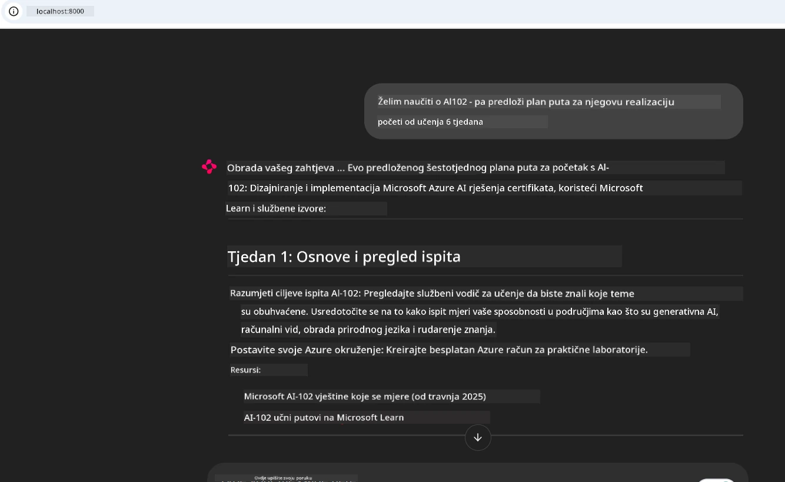
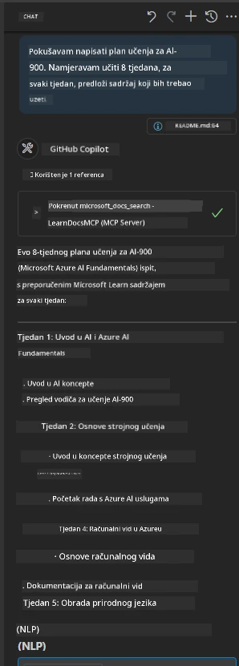

# Studija slučaja: Povezivanje na Microsoft Learn Docs MCP poslužitelj iz klijenta

Jeste li se ikada našli kako skačete između stranica s dokumentacijom, Stack Overflowa i beskonačnih kartica pretraživača, dok pokušavate riješiti problem u svom kodu? Možda imate drugi monitor samo za dokumentaciju ili stalno prebacujete prozore između IDE-a i preglednika. Zar ne bi bilo bolje da dokumentaciju dovedete ravno u svoj radni proces — integriranu u svoje aplikacije, IDE ili čak vlastite prilagođene alate? U ovoj studiji slučaja istražit ćemo kako točno to napraviti povezivanjem izravno na Microsoft Learn Docs MCP poslužitelj iz vlastite klijentske aplikacije.

## Pregled

Moderni razvoj nije samo pisanje koda — radi se o pronalaženju pravih informacija u pravo vrijeme. Dokumentacija je svugdje, ali rijetko tamo gdje vam je najpotrebnija: unutar vaših alata i radnih procesa. Integriranjem dohvaćanja dokumentacije izravno u vaše aplikacije, možete uštedjeti vrijeme, smanjiti prebacivanje konteksta i povećati produktivnost. U ovom odjeljku pokazat ćemo vam kako povezati klijenta na Microsoft Learn Docs MCP poslužitelj, tako da možete pristupiti dokumentaciji u stvarnom vremenu, svjesnoj konteksta, bez napuštanja vaše aplikacije.

Proći ćemo kroz postupak uspostave veze, slanja zahtjeva i učinkovite obrade tokova odgovora. Ovaj pristup ne samo da pojednostavljuje radni proces, već i otvara vrata izradi pametnijih i korisnijih alata za programere.

## Ciljevi učenja

Zašto ovo radimo? Zato što su najbolja iskustva za programere ona koja uklanjaju zapreke. Zamislite svijet u kojem vaš uređivač koda, chatbot ili web aplikacija mogu trenutno odgovoriti na pitanja o dokumentaciji koristeći najnoviji sadržaj s Microsoft Learn. Na kraju ovog poglavlja znat ćete kako:

- Razumjeti osnove komunikacije MCP poslužitelj-klijent za dokumentaciju
- Implementirati konzolnu ili web aplikaciju za povezivanje na Microsoft Learn Docs MCP poslužitelj
- Koristiti streaming HTTP klijente za dohvat dokumentacije u stvarnom vremenu
- Pratiti i tumačiti odgovore dokumentacije u svojoj aplikaciji

Vidjet ćete kako vam ove vještine mogu pomoći izgraditi alate koji nisu samo reaktivni, nego doista interaktivni i svjesni konteksta.

## Scenarij 1 - Dohvat dokumentacije u stvarnom vremenu s MCP-om

U ovom scenariju pokazat ćemo vam kako povezati klijenta na Microsoft Learn Docs MCP poslužitelj, tako da možete pristupiti dokumentaciji u stvarnom vremenu, svjesnoj konteksta, bez napuštanja vaše aplikacije.

Primijenimo to u praksi. Vaš zadatak je napisati aplikaciju koja se povezuje na Microsoft Learn Docs MCP poslužitelj, poziva alat `microsoft_docs_search` i zapisuje tok odgovora u konzolu.

### Zašto ovaj pristup?
Jer to je temelj za izgradnju naprednijih integracija — bilo da želite pokrenuti chatbota, proširenje IDE-a ili web nadzornu ploču.

Kod i upute za ovaj scenarij pronaći ćete u mapi [`solution`](./solution/README.md) unutar ove studije slučaja. Koraci će vas voditi kroz postavljanje veze:
- Koristite službeni MCP SDK i HTTP klijent s podrškom za streamanje za uspostavu veze
- Pozovite alat `microsoft_docs_search` sa parametrima upita za dohvat dokumentacije
- Implementirajte pravilno evidentiranje i obradu pogrešaka
- Kreirajte interaktivno sučelje konzole za omogućavanje unosa više upita za pretraživanje

Ovaj scenarij demonstrira kako:
- Povezati se na Docs MCP poslužitelj
- Poslati upit
- Parsirati i ispisati rezultate

Evo kako bi mogao izgledati rad rješenja:

```
Prompt> What is Azure Key Vault?
Answer> Azure Key Vault is a cloud service for securely storing and accessing secrets. ...
```

Ispod je minimalni uzorak rješenja. Cijeli kod i detalji dostupni su u mapi rješenja.

<details>
<summary>Python</summary>

```python
import asyncio
from mcp.client.streamable_http import streamablehttp_client
from mcp import ClientSession

async def main():
    async with streamablehttp_client("https://learn.microsoft.com/api/mcp") as (read_stream, write_stream, _):
        async with ClientSession(read_stream, write_stream) as session:
            await session.initialize()
            result = await session.call_tool("microsoft_docs_search", {"query": "Azure Functions best practices"})
            print(result.content)

if __name__ == "__main__":
    asyncio.run(main())
```

- Za potpunu implementaciju i evidentiranje pogledajte [`scenario1.py`](../../../../09-CaseStudy/docs-mcp/solution/python/scenario1.py).
- Za upute instalacije i korištenja pogledajte datoteku [`README.md`](./solution/python/README.md) u istoj mapi.
</details>

## Scenarij 2 - Interaktivna web aplikacija za generator studijskog plana s MCP-om

U ovom scenariju naučit ćete kako integrirati Docs MCP u web razvojni projekt. Cilj je omogućiti korisnicima pretraživanje Microsoft Learn dokumentacije izravno s web sučelja, čineći dokumentaciju trenutno dostupnom unutar vaše aplikacije ili stranice.

Vidjet ćete kako:
- Postaviti web aplikaciju
- Povezati se na Docs MCP poslužitelj
- Obraditi korisnički unos i prikazati rezultate

Evo kako bi mogao izgledati rad rješenja:

```
User> I want to learn about AI102 - so suggest the roadmap to get it started from learn for 6 weeks

Assistant> Here’s a detailed 6-week roadmap to start your preparation for the AI-102: Designing and Implementing a Microsoft Azure AI Solution certification, using official Microsoft resources and focusing on exam skills areas:

---
## Week 1: Introduction & Fundamentals
- **Understand the Exam**: Review the [AI-102 exam skills outline](https://learn.microsoft.com/en-us/credentials/certifications/exams/ai-102/).
- **Set up Azure**: Sign up for a free Azure account if you don't have one.
- **Learning Path**: [Introduction to Azure AI services](https://learn.microsoft.com/en-us/training/modules/intro-to-azure-ai/)
- **Focus**: Get familiar with Azure portal, AI capabilities, and necessary tools.

....more weeks of the roadmap...

Let me know if you want module-specific recommendations or need more customized weekly tasks!
```

Ispod je minimalni uzorak rješenja. Cijeli kod i detalji dostupni su u mapi rješenja.



<details>
<summary>Python (Chainlit)</summary>

Chainlit je okvir za izradu konverzacijskih AI web aplikacija. Omogućuje jednostavno kreiranje interaktivnih chatbota i pomoćnika koji mogu pozivati MCP alate i prikazivati rezultate u stvarnom vremenu. Idealno je za brzo prototipiranje i korisnička sučelja prilagođena korisnicima.

```python
import chainlit as cl
import requests

MCP_URL = "https://learn.microsoft.com/api/mcp"

@cl.on_message
def handle_message(message):
    query = {"question": message}
    response = requests.post(MCP_URL, json=query)
    if response.ok:
        result = response.json()
        cl.Message(content=result.get("answer", "No answer found.")).send()
    else:
        cl.Message(content="Error: " + response.text).send()
```

- Za potpunu implementaciju pogledajte [`scenario2.py`](../../../../09-CaseStudy/docs-mcp/solution/python/scenario2.py).
- Za upute o postavljanju i pokretanju pogledajte [`README.md`](./solution/python/README.md).
</details>

## Scenarij 3: Dokumentacija unutar uređivača s MCP poslužiteljem u VS Code-u

Ako želite Microsoft Learn Docs dobiti izravno unutar vašeg VS Code uređivača (umjesto prebacivanja kartica preglednika), možete koristiti MCP poslužitelj u uređivaču. To vam omogućuje:
- Pretraživanje i čitanje dokumentacije u VS Code-u bez napuštanja razvojnog okruženja.
- Referenciranje dokumentacije i umetanje poveznica izravno u README ili datoteke tečaja.
- Korištenje GitHub Copilot i MCP-a zajedno za besprijekoran AI-pokretan tijek rada s dokumentacijom.

**Vidjet ćete kako:**
- Dodati valjanu `.vscode/mcp.json` datoteku u korijen vašeg radnog prostora (pogledajte primjer dolje).
- Otvoriti MCP ploču ili koristiti paletu naredbi u VS Code-u za pretraživanje i umetanje dokumenata.
- Referencirati dokumentaciju izravno u markdown datotekama dok radite.
- Kombinirati ovaj tijek rada s GitHub Copilot-om za još veću produktivnost.

Evo primjera kako postaviti MCP poslužitelj u VS Code-u:

```json
{
  "servers": {
    "LearnDocsMCP": {
      "url": "https://learn.microsoft.com/api/mcp"
    }
  }
}
```

</details>

> Za detaljni vodič sa snimkama zaslona i korak-po-korak uputama pogledajte [`README.md`](./solution/scenario3/README.md).



Ovaj pristup je idealan za sve koji razvijaju tehničke tečajeve, pišu dokumentaciju ili razvijaju kod koji zahtijeva česta referenciranja.

## Ključne lekcije

Integracija dokumentacije izravno u vaše alate nije samo zgodna — to je revolucija za produktivnost. Povezujući se na Microsoft Learn Docs MCP poslužitelj iz svojih klijenata, možete:

- Ukloniti prebacivanje konteksta između koda i dokumentacije
- Dohvatiti ažuriranu, kontekstualno svjesnu dokumentaciju u stvarnom vremenu
- Izgraditi pametnije, interaktivnije alate za programere

Ove vještine pomoći će vam u izradi rješenja koja nisu samo učinkovita, nego i ugodna za korištenje.

## Dodatni resursi

Za produbljivanje razumijevanja istražite ove službene resurse:

- [Microsoft Learn Docs MCP Server (GitHub)](https://github.com/MicrosoftDocs/mcp)
- [Početak rada s Azure MCP Serverom (mcp-python)](https://learn.microsoft.com/en-us/azure/developer/azure-mcp-server/get-started#create-the-python-app)
- [Što je Azure MCP Server?](https://learn.microsoft.com/en-us/azure/developer/azure-mcp-server/)
- [Uvod u Model Context Protocol (MCP)](https://modelcontextprotocol.io/introduction)
- [Dodavanje pluginova s MCP Servera (Python)](https://learn.microsoft.com/en-us/semantic-kernel/concepts/plugins/adding-mcp-plugins)

## Što slijedi

- Natrag na: [Pregled studija slučaja](../README.md)
- Nastavite na: [Modul 10: Pojednostavljenje AI radnih tokova s AI Toolkitom](../../10-StreamliningAIWorkflowsBuildingAnMCPServerWithAIToolkit/README.md)

---

<!-- CO-OP TRANSLATOR DISCLAIMER START -->
**Napomena**:  
Ovaj je dokument preveden pomoću AI prevoditeljskog servisa [Co-op Translator](https://github.com/Azure/co-op-translator). Iako težimo točnosti, imajte na umu da automatski prijevodi mogu sadržavati pogreške ili netočnosti. Izvorni dokument na izvornom jeziku treba smatrati autoritativnim izvorom. Za kritične informacije preporučuje se profesionalni ljudski prijevod. Ne snosimo odgovornost za nikakva nesporazuma ili pogrešna tumačenja koja proizlaze iz uporabe ovog prijevoda.
<!-- CO-OP TRANSLATOR DISCLAIMER END -->