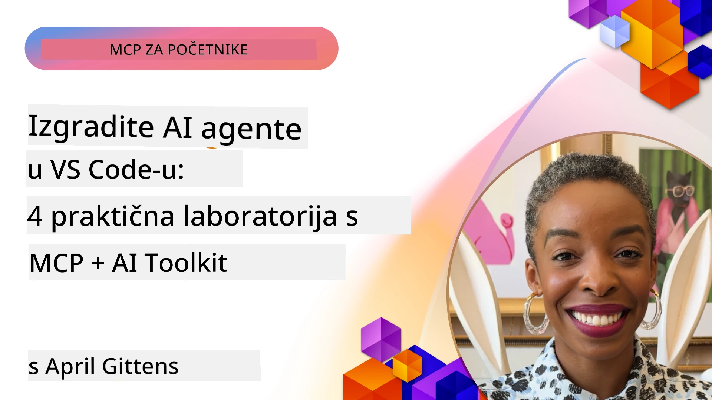

# Optimizacija AI Radnih Tokova: Izgradnja MCP Poslužitelja s AI Toolkitom

## 🎯 Pregled

_(Kliknite sliku gore za prikaz videa ovog lekcije)_

Dobrodošli u **Radionicu Model Context Protocol (MCP)**! Ova sveobuhvatna praktična radionica kombinira dvije vrhunske tehnologije za revoluciju u razvoju AI aplikacija:

- **🔗 Model Context Protocol (MCP)**: Otvoreni standard za besprijekornu integraciju AI alata
- **🛠️ AI Toolkit za Visual Studio Code (AITK)**: Microsoftov moćan dodatak za razvoj AI-a

### 🎓 Što ćete naučiti

Na kraju ove radionice savladat ćete umjetnost izgradnje inteligentnih aplikacija koje povezuju AI modele s alatima i uslugama iz stvarnog svijeta. Od automatiziranog testiranja do prilagođenih API integracija, steći ćete praktične vještine za rješavanje složenih poslovnih izazova.

## 🏗️ Tehnološki Sloj

### 🔌 Model Context Protocol (MCP)

MCP je **"USB-C za AI"** - univerzalni standard koji povezuje AI modele s vanjskim alatima i izvorima podataka.

**✨ Ključne Značajke:**

- 🔄 **Standardizirana Integracija**: Univerzalno sučelje za povezivanje AI alata
- 🏛️ **Fleksibilna Arhitektura**: Lokalni i udaljeni poslužitelji preko stdio/SSE prijenosa
- 🧰 **Bogati Ekosustav**: Alati, upiti i resursi u jednom protokolu
- 🔒 **Pripremljeno za Poduzeća**: Ugrađena sigurnost i pouzdanost

**🎯 Zašto je MCP važan:**
Baš kao što je USB-C uklonio kaos s kabelima, MCP uklanja složenost AI integracija. Jedan protokol, beskonačne mogućnosti.

### 🤖 AI Toolkit za Visual Studio Code (AITK)

Microsoftov vodeći dodatak za razvoj AI koji pretvara VS Code u AI moćnik.

**🚀 Osnovne Mogućnosti:**

- 📦 **Katalog Modela**: Pristup modelima iz Azure AI, GitHub, Hugging Face, Ollama
- ⚡ **Lokalna Inferencija**: ONNX-optimizirano izvršavanje na CPU/GPU/NPU
- 🏗️ **Agent Builder**: Vizualni razvoj AI agenata s MCP integracijom
- 🎭 **Višemodalnost**: Podrška za tekst, viziju i strukturirani izlaz

**💡 Prednosti Razvoja:**

- Implementacija modela bez konfiguracije
- Vizualno oblikovanje upita
- Okruženje za testiranje u stvarnom vremenu
- Besprijekorna integracija MCP poslužitelja

## 📚 Put učenja

### [🚀 Modul 1: Osnove AI Toolkita](./lab1/README.md)

**Trajanje**: 15 minuta

- 🛠️ Instalacija i konfiguracija AI Toolkita za VS Code
- 🗂️ Istražite Katalog Modela (100+ modela s GitHub, ONNX, OpenAI, Anthropic, Google)
- 🎮 Savladajte Interaktivni Igralište za testiranje modela uživo
- 🤖 Izgradite svog prvog AI agenta pomoću Agent Buildera
- 📊 Procijenite performanse modela s ugrađenim metrima (F1, relevantnost, sličnost, koherencija)
- ⚡ Naučite batch obradu i mogućnosti višemodalne podrške

**🎯 Ishod učenja**: Kreirajte funkcionalnog AI agenta s potpunim razumijevanjem mogućnosti AITK-a

### [🌐 Modul 2: MCP i osnove AI Toolkita](./lab2/README.md)

**Trajanje**: 20 minuta

- 🧠 Savladajte arhitekturu i koncepte Model Context Protocola (MCP)
- 🌐 Istražite Microsoftov ekosustav MCP poslužitelja
- 🤖 Izgradite agenta za automatizaciju preglednika koristeći Playwright MCP poslužitelj
- 🔧 Integrirajte MCP poslužitelje s AI Toolkit Agent Builderom
- 📊 Konfigurirajte i testirajte MCP alate unutar svojih agenata
- 🚀 Izvezite i implementirajte agente s MCP potporom za produkcijsko korištenje

**🎯 Ishod učenja**: Implementirajte AI agenta pojačanog vanjskim alatima kroz MCP

### [🔧 Modul 3: Napredni MCP razvoj s AI Toolkitom](./lab3/README.md)

**Trajanje**: 20 minuta

- 💻 Stvorite prilagođene MCP poslužitelje pomoću AI Toolkita
- 🐍 Konfigurirajte i koristite najnoviji MCP Python SDK (v1.9.3)
- 🔍 Postavite i iskoristite MCP Inspector za ispravljanje pogrešaka
- 🛠️ Izgradite Weather MCP poslužitelj s profesionalnim postupcima ispravljanja
- 🧪 Ispravljajte MCP poslužitelje u okruženjima Agent Builder i Inspector

**🎯 Ishod učenja**: Razvijte i otklonite pogreške prilagođenih MCP poslužitelja s modernim alatima

### [🐙 Modul 4: Praktični MCP razvoj - prilagođeni GitHub Clone poslužitelj](./lab4/README.md)

**Trajanje**: 30 minuta

- 🏗️ Izgradite stvarni GitHub Clone MCP poslužitelj za razvojne radne tokove
- 🔄 Implementirajte pametno kloniranje spremišta s validacijom i upravljanjem pogreškama
- 📁 Kreirajte inteligentno upravljanje direktorijem i integraciju s VS Codeom
- 🤖 Koristite GitHub Copilot Agent Mode s prilagođenim MCP alatima
- 🛡️ Primijenite pouzdanost spremnu za produkciju i kompatibilnost na više platformi

**🎯 Ishod učenja**: Implementirajte MCP poslužitelj spreman za produkciju koji optimizira stvarne razvojne radne tokove

## 💡 Primjena u stvarnom svijetu i utjecaj

### 🏢 Primjeri u poduzećima

#### 🔄 Automatizacija DevOps-a

Transformirajte svoj razvojni radni tok inteligentnom automatizacijom:

- **Pametno upravljanje spremištima**: AI-nadzirana revizija i odluke o spajanju koda
- **Inteligentni CI/CD**: Automatizirana optimizacija pipeline-a bazirana na promjenama koda
- **Triage problema**: Automatska klasifikacija i dodjela bugova

#### 🧪 Revolucija osiguranja kvalitete

Unaprijedite testiranje AI-pokretanom automatizacijom:

- **Inteligentna generacija testova**: Automatsko kreiranje sveobuhvatnih testnih setova
- **Vizualno regresijsko testiranje**: AI detekcija promjena korisničkog sučelja
- **Praćenje performansi**: Proaktivno prepoznavanje i rješavanje problema

#### 📊 Inteligencija data pipeline-a

Izgradite pametnije radne tokove obrade podataka:

- **Prilagodljivi ETL procesi**: Samo-optimizirajuće transformacije podataka
- **Detekcija anomalija**: Praćenje kvalitete podataka u stvarnom vremenu
- **Inteligentno usmjeravanje**: Pametno upravljanje protokom podataka

#### 🎧 Unapređenje korisničkog iskustva

Stvarajte iznimne interakcije s korisnicima:

- **Podrška svjesna konteksta**: AI agenti s pristupom povijesti korisnika
- **Proaktivno rješavanje problema**: Prediktivna korisnička služba
- **Integracija na više kanala**: Jedinstveno AI iskustvo na svim platformama

## 🛠️ Preduvjeti i postavljanje

### 💻 Sistemski zahtjevi

| Komponenta | Zahtjev | Napomene |
|-----------|-------------|-------|
| **Operativni sustav** | Windows 10+, macOS 10.15+, Linux | Bilo koji moderni OS |
| **Visual Studio Code** | Najnovija stabilna verzija | Potrebno za AITK |
| **Node.js** | v18.0+ i npm | Za razvoj MCP poslužitelja |
| **Python** | 3.10+ | Opcionalno za Python MCP poslužitelje |
| **Memorija** | Minimum 8GB RAM-a | 16GB preporučeno za lokalne modele |

### 🔧 Razvojno okruženje

#### Preporučeni VS Code dodaci

- **AI Toolkit** (ms-windows-ai-studio.windows-ai-studio)
- **Python** (ms-python.python)
- **Python Debugger** (ms-python.debugpy)
- **GitHub Copilot** (GitHub.copilot) - Opcionalno, ali korisno

#### Opcionalni alati

- **uv**: Moderni Python upravitelj paketa
- **MCP Inspector**: Vizualni alat za ispravljanje MCP poslužitelja
- **Playwright**: Za primjere web automatizacije

## 🎖️ Ishodi učenja i put certifikacije

### 🏆 Popis za provjeru usavršavanja vještina

Završetkom ove radionice postići ćete stručnost u:

#### 🎯 Temeljnim kompetencijama

- [ ] **MCP Protokol stručnost**: Duboko razumijevanje arhitekture i obrazaca implementacije
- [ ] **AITK vještina**: Ekspertno korištenje AI Toolkita za brzi razvoj
- [ ] **Razvoj prilagođenih poslužitelja**: Izrada, implementacija i održavanje produkcijskih MCP poslužitelja
- [ ] **Izvrsnost u integraciji alata**: Besprijekorna povezanost AI-a s postojećim radnim tokovima razvoja
- [ ] **Primjena rješavanja problema**: Primjena stečenih vještina na stvarne poslovne izazove

#### 🔧 Tehničke vještine

- [ ] Postavljanje i konfiguracija AI Toolkita u VS Codeu
- [ ] Dizajn i implementacija prilagođenih MCP poslužitelja
- [ ] Integracija GitHub modela s MCP arhitekturom
- [ ] Izgradnja automatiziranih testnih tijekova s Playwrightom
- [ ] Implementacija AI agenata za produkcijsko korištenje
- [ ] Otklanjanje pogrešaka i optimizacija izvedbe MCP poslužitelja

#### 🚀 Napredne mogućnosti

- [ ] Arhitektura AI integracija na razini poduzeća
- [ ] Implementacija sigurnosnih najboljih praksi za AI aplikacije
- [ ] Dizajn skalabilnih MCP poslužiteljskih arhitektura
- [ ] Kreiranje prilagođenih lanaca alata za specifične domene
- [ ] Mentorstvo drugih u AI-native razvoju

## 📖 Dodatni resursi

- [MCP Specifikacija (2025-11-25)](https://spec.modelcontextprotocol.io/specification/2025-11-25/)
- [AI Toolkit GitHub Repozitorij](https://github.com/microsoft/vscode-ai-toolkit)
- [Zbirka Primjera MCP Poslužitelja](https://github.com/modelcontextprotocol/servers)
- [Priručnik Najboljih Praksi](https://modelcontextprotocol.io/docs/best-practices)
- [OWASP MCP Top 10](https://microsoft.github.io/mcp-azure-security-guide/mcp/) - Najbolje sigurnosne prakse

---

**🚀 Spremni za revoluciju u svom AI razvojnom tijeku rada?**

Izgradimo zajedno budućnost inteligentnih aplikacija uz MCP i AI Toolkit!

## Što slijedi

Nastavite na: [Modul 11: MCP Server Praktične Radionice](../11-MCPServerHandsOnLabs/README.md)

---

<!-- CO-OP TRANSLATOR DISCLAIMER START -->
**Odricanje od odgovornosti**:
Ovaj dokument je preveden pomoću AI prevoditeljske usluge [Co-op Translator](https://github.com/Azure/co-op-translator). Iako težimo točnosti, molimo imajte na umu da automatski prijevodi mogu sadržavati pogreške ili netočnosti. Izvorni dokument na izvornom jeziku treba smatrati autoritativnim izvorom. Za kritične informacije preporučuje se profesionalni ljudski prijevod. Nismo odgovorni za bilo kakve nesporazume ili pogrešna tumačenja proizašla iz korištenja ovog prijevoda.
<!-- CO-OP TRANSLATOR DISCLAIMER END -->