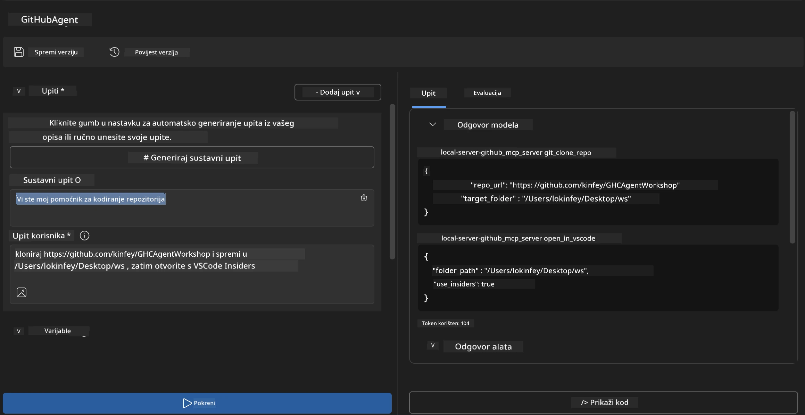
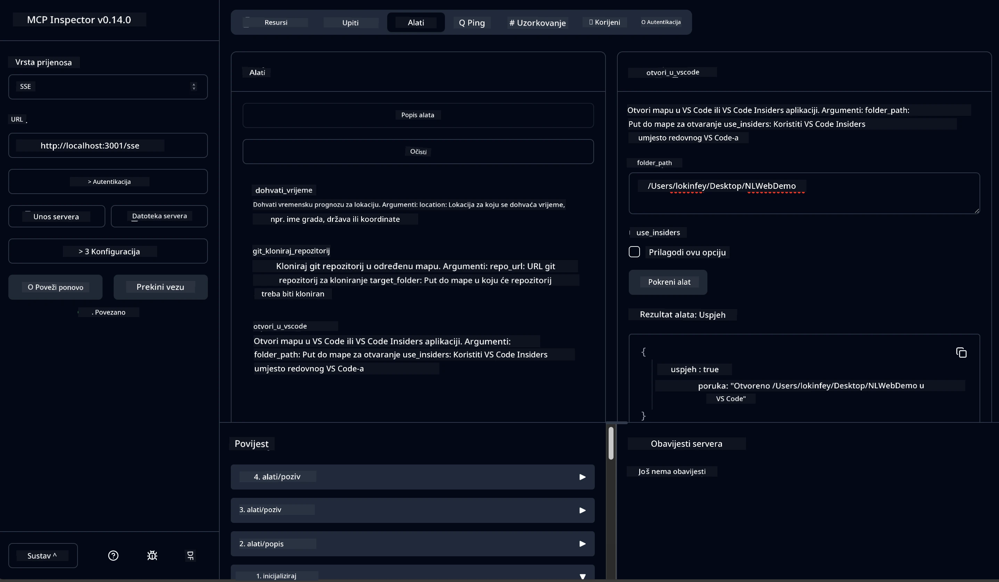

# 🐙 Modul 4: Praktični razvoj MCP-a - Prilagođeni GitHub klon poslužitelj


> **⚡ Brzi početak:** Izgradite MCP poslužitelj spreman za produkciju koji automatizira kloniranje GitHub repozitorija i integraciju s VS Codeom za samo 30 minuta!

## 🎯 Ciljevi učenja

Do kraja ovog laboratorija moći ćete:

- ✅ Kreirati prilagođeni MCP poslužitelj za stvarne razvojne tokove rada
- ✅ Implementirati funkcionalnost kloniranja GitHub repozitorija putem MCP-a
- ✅ Integrirati prilagođene MCP poslužitelje s VS Codeom i Agent Builderom
- ✅ Koristiti GitHub Copilot Agent Mode s prilagođenim MCP alatima
- ✅ Testirati i postaviti prilagođene MCP poslužitelje u produkcijska okruženja

## 📋 Preduvjeti

- Završeni Laboratoriji 1-3 (osnove i napredni razvoj MCP-a)
- Pretplata na GitHub Copilot ([dostupna besplatna registracija](https://github.com/github-copilot/signup))
- VS Code s ekstenzijama AI Toolkit i GitHub Copilot
- Instaliran i konfiguriran Git CLI

## 🏗️ Pregled projekta

### **Izazov stvarnog razvoja**
Kao programeri često koristimo GitHub za kloniranje repozitorija i otvaranje istih u VS Code ili VS Code Insiders. Ovaj ručni proces uključuje:
1. Otvaranje terminala/command prompta
2. Navigiranje do željenog direktorija
3. Pokretanje `git clone` naredbe
4. Otvaranje VS Codea u kloniranom direktoriju

**Naše MCP rješenje pretvara ovaj proces u jednu inteligentnu naredbu!**

### **Što ćete napraviti**
**GitHub Clone MCP Server** (`git_mcp_server`) koji pruža:

| Značajka | Opis | Prednost |
|---------|-------------|---------|
| 🔄 **Pametno kloniranje repozitorija** | Klonira GitHub repozitorije s provjerom valjanosti | Automatizirana provjera pogrešaka |
| 📁 **Pametno upravljanje direktorijima** | Sigurno provjerava i kreira direktorije | Sprječava prepisivanje |
| 🚀 **Višeplatformska integracija s VS Codeom** | Otvara projekte u VS Code/Insiders | Besprijekoran prijelaz u razvojni tok |
| 🛡️ **Robusno rukovanje pogreškama** | Rukuje mrežnim, dopuštenjima i problemima s putanjama | Pouzdanost spremna za produkciju |

---

## 📖 Korak-po-korak implementacija

### Korak 1: Kreirajte GitHub agenta u Agent Builderu

1. **Pokrenite Agent Builder** kroz ekstenziju AI Toolkita
2. **Kreirajte novog agenta** s konfiguracijom:
   ```
   Agent Name: GitHubAgent
   ```

3. **Inicijalizirajte prilagođeni MCP poslužitelj:**
   - Idite na **Tools** → **Add Tool** → **MCP Server**
   - Odaberite **"Create A new MCP Server"**
   - Odaberite **Python predložak** za maksimalnu fleksibilnost
   - **Ime poslužitelja:** `git_mcp_server`

### Korak 2: Konfigurirajte GitHub Copilot Agent Mode

1. **Otvorite GitHub Copilot** u VS Codeu (Ctrl/Cmd + Shift + P → "GitHub Copilot: Open")
2. **Odaberite Agent Model** u Copilot sučelju
3. **Odaberite model Claude 3.7** za poboljšane mogućnosti rezoniranja
4. **Omogućite MCP integraciju** za pristup alatima

> **💡 Profesionalni savjet:** Claude 3.7 pruža bolje razumijevanje razvojnih tokova rada i obrazaca za rukovanje pogreškama.

### Korak 3: Implementirajte glavnu funkcionalnost MCP poslužitelja

**Koristite sljedeći detaljni prompt s GitHub Copilot Agent Mode:**

```
Create two MCP tools with the following comprehensive requirements:

🔧 TOOL A: clone_repository
Requirements:
- Clone any GitHub repository to a specified local folder
- Return the absolute path of the successfully cloned project
- Implement comprehensive validation:
  ✓ Check if target directory already exists (return error if exists)
  ✓ Validate GitHub URL format (https://github.com/user/repo)
  ✓ Verify git command availability (prompt installation if missing)
  ✓ Handle network connectivity issues
  ✓ Provide clear error messages for all failure scenarios

🚀 TOOL B: open_in_vscode
Requirements:
- Open specified folder in VS Code or VS Code Insiders
- Cross-platform compatibility (Windows/Linux/macOS)
- Use direct application launch (not terminal commands)
- Auto-detect available VS Code installations
- Handle cases where VS Code is not installed
- Provide user-friendly error messages

Additional Requirements:
- Follow MCP 1.9.3 best practices
- Include proper type hints and documentation
- Implement logging for debugging purposes
- Add input validation for all parameters
- Include comprehensive error handling
```

### Korak 4: Testirajte svoj MCP poslužitelj

#### 4a. Test u Agent Builderu

1. **Pokrenite debug konfiguraciju** za Agent Builder
2. **Konfigurirajte svog agenta ovim sistemskim promptom:**

```
SYSTEM_PROMPT:
You are my intelligent coding repository assistant. You help developers efficiently clone GitHub repositories and set up their development environment. Always provide clear feedback about operations and handle errors gracefully.
```

3. **Testirajte s realnim scenarijima korisnika:**

```
USER_PROMPT EXAMPLES:

Scenario : Basic Clone and Open
"Clone {Your GitHub Repo link such as https://github.com/kinfey/GHCAgentWorkshop
 } and save to {The global path you specify}, then open it with VS Code Insiders"
```



**Očekivani rezultati:**
- ✅ Uspješno kloniranje s potvrdom putanje
- ✅ Automatsko pokretanje VS Codea
- ✅ Jasne poruke o pogreškama za nevažeće scenarije
- ✅ Ispravno rukovanje rubnim slučajevima

#### 4b. Test u MCP Inspectoru



---


**🎉 Čestitamo!** Uspješno ste kreirali praktični, produkcijski MCP poslužitelj koji rješava stvarne razvojne izazove. Vaš prilagođeni GitHub klon poslužitelj demonstrira snagu MCP-a za automatizaciju i poboljšanje produktivnosti programera.

### 🏆 Postignuće otključano:
- ✅ **MCP Developer** - Kreirali ste prilagođeni MCP poslužitelj
- ✅ **Workflow Automator** - Pojednostavili razvojne procese  
- ✅ **Integration Expert** - Povezali ste više razvojnih alata
- ✅ **Produkcijsko spreman** - Izradili ste rješenja za postavljanje u produkciju

---

## 🎓 Završetak radionice: Vaše putovanje s Model Context Protocol

**Dragi sudionice radionice,**

Čestitamo na završetku svih četiri modula radionice Model Context Protocol! Prošli ste dug put od razumijevanja osnovnih pojmova AI Toolkita do izgradnje produkcijski spremnih MCP poslužitelja koji rješavaju stvarne razvojne izazove.

### 🚀 Podsjetnik na vaš put učenja:

**[Modul 1](../lab1/README.md)**: Počeli ste istraživanjem osnova AI Toolkita, testiranjem modela i izradom svog prvog AI agenta.

**[Modul 2](../lab2/README.md)**: Naučili ste MCP arhitekturu, integrirali Playwright MCP i konstruirali prvog agenta za automatizaciju preglednika.

**[Modul 3](../lab3/README.md)**: Napredovali ste u razvoju prilagođenih MCP poslužitelja s Weather MCP poslužiteljem i svladali alate za otklanjanje pogrešaka.

**[Modul 4](../lab4/README.md)**: Sada ste primijenili sve da napravite praktični alat za automatizaciju radnog tijeka s GitHub repozitorijem.

### 🌟 Što ste savladali:

- ✅ **Eko sustav AI Toolkita**: modeli, agenti i obrasci integracije
- ✅ **MCP arhitektura**: klijent-poslužitelj dizajn, komunikacijski protokoli i sigurnost
- ✅ **Razvojni alati**: od Playgrounda do Inspectora do produkcijske implementacije
- ✅ **Prilagođeni razvoj**: izgradnja, testiranje i postavljanje vlastitih MCP poslužitelja
- ✅ **Praktične primjene**: rješavanje stvarnih izazova radnog toka uz AI

### 🔮 Vaši sljedeći koraci:

1. **Izradite vlastiti MCP poslužitelj**: primijenite ove vještine za automatizaciju svojih jedinstvenih tijekova rada
2. **Pridružite se MCP zajednici**: podijelite svoja djela i učite od drugih
3. **Istražite naprednu integraciju**: povežite MCP poslužitelje s enterprise sustavima
4. **Doprinesite open sourceu**: pomozite u poboljšanju MCP alata i dokumentacije

Zapamtite, ova radionica je tek početak. Eko sustav Model Context Protocol brzo se razvija, a vi ste sada opremljeni da budete na čelu AI-pokretanih razvojnih alata.

**Hvala vam na sudjelovanju i predanosti učenju!**

Nadamo se da vam je radionica dala ideje koje će promijeniti način na koji gradite i komunicirate s AI alatima u vašem razvoju.

**Sretno kodiranje!**

---

## Što slijedi

Čestitamo na završetku svih laboratorija u Modulu 10!

- Natrag na: [Pregled Modula 10](../README.md)
- Nastavite na: [Modul 11: MCP server praktični laboratoriji](../../11-MCPServerHandsOnLabs/README.md)

---

<!-- CO-OP TRANSLATOR DISCLAIMER START -->
**Odricanje od odgovornosti**:
Ovaj dokument preveden je korištenjem AI usluge za prevođenje [Co-op Translator](https://github.com/Azure/co-op-translator). Iako težimo točnosti, imajte na umu da automatski prijevodi mogu sadržavati pogreške ili netočnosti. Izvorni dokument na izvornom jeziku smatra se službenim i autoritativnim. Za važne informacije preporučuje se profesionalni prijevod od strane čovjeka. Nismo odgovorni za bilo kakva nesporazuma ili kriva tumačenja koja proizađu iz korištenja ovog prijevoda.
<!-- CO-OP TRANSLATOR DISCLAIMER END -->