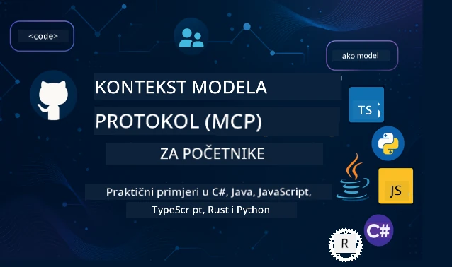

 

[](https://GitHub.com/microsoft/mcp-for-beginners/graphs/contributors)
[](https://GitHub.com/microsoft/mcp-for-beginners/issues)
[](https://GitHub.com/microsoft/mcp-for-beginners/pulls)
[](http://makeapullrequest.com)

[](https://GitHub.com/microsoft/mcp-for-beginners/watchers)
[](https://GitHub.com/microsoft/mcp-for-beginners/fork)
[](https://GitHub.com/microsoft/mcp-for-beginners/stargazers)


[](https://discord.gg/nTYy5BXMWG)

Slijedite ove korake da započnete s korištenjem ovih resursa:
1. **Forkaj repozitorij**: Kliknite [](https://GitHub.com/microsoft/mcp-for-beginners/fork)
2. **Klonirajte repozitorij**:   `git clone https://github.com/microsoft/mcp-for-beginners.git`
3. **Pridružite se** [](https://discord.gg/nTYy5BXMWG)


### 🌐 Podrška za više jezika

#### Podržano putem GitHub Action (Automatski i uvijek ažurno)

<!-- CO-OP TRANSLATOR LANGUAGES TABLE START -->
[Arabic](../ar/README.md) | [Bengali](../bn/README.md) | [Bugarski](../bg/README.md) | [Burmanski (Myanmar)](../my/README.md) | [Kineski (pojednostavljeni)](../zh-CN/README.md) | [Kineski (tradicionalni, Hong Kong)](../zh-HK/README.md) | [Kineski (tradicionalni, Macau)](../zh-MO/README.md) | [Kineski (tradicionalni, Taiwan)](../zh-TW/README.md) | [Hrvatski](./README.md) | [Češki](../cs/README.md) | [Danski](../da/README.md) | [Nizozemski](../nl/README.md) | [Estonski](../et/README.md) | [Finski](../fi/README.md) | [Francuski](../fr/README.md) | [Njemački](../de/README.md) | [Grčki](../el/README.md) | [Hebrejski](../he/README.md) | [Hindi](../hi/README.md) | [Mađarski](../hu/README.md) | [Indonezijski](../id/README.md) | [Talijanski](../it/README.md) | [Japanski](../ja/README.md) | [Kannada](../kn/README.md) | [Korejski](../ko/README.md) | [Litvanski](../lt/README.md) | [Malajski](../ms/README.md) | [Malajalamski](../ml/README.md) | [Marathi](../mr/README.md) | [Nepalski](../ne/README.md) | [Nigerdijski pidžin](../pcm/README.md) | [Norveški](../no/README.md) | [Perzijski (Farsi)](../fa/README.md) | [Poljski](../pl/README.md) | [Portugalski (Brazil)](../pt-BR/README.md) | [Portugalski (Portugal)](../pt-PT/README.md) | [Punjabi (Gurmukhi)](../pa/README.md) | [Rumunjski](../ro/README.md) | [Ruski](../ru/README.md) | [Srpski (ćirilica)](../sr/README.md) | [Slovački](../sk/README.md) | [Slovenski](../sl/README.md) | [Španjolski](../es/README.md) | [Svahili](../sw/README.md) | [Švedski](../sv/README.md) | [Tagalog (Filipinski)](../tl/README.md) | [Tamilski](../ta/README.md) | [Telugu](../te/README.md) | [Tajlandski](../th/README.md) | [Turski](../tr/README.md) | [Ukrajinski](../uk/README.md) | [Urdu](../ur/README.md) | [Vijetnamski](../vi/README.md)

> **Radije klonirati lokalno?**
>
> Ovaj repozitorij uključuje više od 50 prijevoda jezika što znatno povećava veličinu preuzimanja. Za kloniranje bez prijevoda koristite sparse checkout:
>
> **Bash / macOS / Linux:**
> ```bash
> git clone --filter=blob:none --sparse https://github.com/microsoft/mcp-for-beginners.git
> cd mcp-for-beginners
> git sparse-checkout set --no-cone '/*' '!translations' '!translated_images'
> ```
>
> **CMD (Windows):**
> ```cmd
> git clone --filter=blob:none --sparse https://github.com/microsoft/mcp-for-beginners.git
> cd mcp-for-beginners
> git sparse-checkout set --no-cone "/*" "!translations" "!translated_images"
> ```
>
> Ovo vam daje sve što vam treba za završetak tečaja uz puno brže preuzimanje.
<!-- CO-OP TRANSLATOR LANGUAGES TABLE END -->

# 🚀 Kurikulum Model Context Protokola (MCP) za početnike

## **Naučite MCP s praktičnim primjerima koda u C#, Java, JavaScript, Rust, Python i TypeScript**

## 🧠 Pregled Kurikuluma Model Context Protokola
Dobrodošli na vaše putovanje u Model Context Protocol! Ako ste se ikada pitali kako AI aplikacije komuniciraju s različitim alatima i uslugama, uskoro ćete otkriti elegantno rješenje koje mijenja način na koji programeri grade inteligentne sustave.

Zamislite MCP kao univerzalnog prevoditelja za AI aplikacije - baš kao što USB priključci dopuštaju povezivanje bilo kojeg uređaja na vaše računalo, MCP omogućava AI modelima povezivanje s bilo kojim alatom ili uslugom na standardiziran način. Bilo da gradite svoj prvi chatbot ili radite na složenim AI radnim tokovima, razumijevanje MCP-a dat će vam moć stvaranja sposobnijih i fleksibilnijih aplikacija.

Ovaj kurikulum je dizajniran s strpljenjem i pažnjom za vaše učenje. Počet ćemo s jednostavnim konceptima koje već razumijete i postupno graditi vašu stručnost kroz praktičnu vježbu u vašem omiljenom programskom jeziku. Svaki korak uključuje jasna objašnjenja, praktične primjere i mnogo poticaja tijekom puta.

Do kraja ovog putovanja, imat ćete samopouzdanje za izgradnju vlastitih MCP servera, njihovu integraciju s popularnim AI platformama i razumijevanje kako ova tehnologija preoblikuje budućnost razvoja AI. Započnimo ovu uzbudljivu avanturu zajedno!

### Službena dokumentacija i specifikacije

Ovaj kurikulum je usklađen s **MCP Specifikacijom 2025-11-25** (najnovije stabilno izdanje). MCP specifikacija koristi verzioniranje bazirano na datumu (u formatu GGGG-MM-DD) kako bi se osigurala jasna evidencija verzija protokola.

Ovi resursi postaju vrijedniji kako vaše razumijevanje raste, ali nemojte osjećati pritisak da odmah pročitate sve. Počnite s područjima koja vas najviše zanimaju!
- 📘 [MCP Dokumentacija](https://modelcontextprotocol.io/) – Ovo je vaš glavni izvor za korak-po-korak vodiče i korisničke priručnike. Dokumentacija je napisana imajući na umu početnike, pružajući jasne primjere koje možete slijediti vlastitim tempom.
- 📜 [MCP Specifikacija](https://modelcontextprotocol.io/specification/2025-11-25) – Smatrajte ovo vašim opsežnim referentnim priručnikom. Kako budete radili kroz kurikulum, vraćat ćete se ovdje za traženje specifičnih detalja i istraživanje naprednih značajki.
- 📜 [MCP Specifikacija Verzija](https://modelcontextprotocol.io/specification/versioning) – Sadrži informacije o povijesti verzija protokola i načinu na koji MCP koristi verzioniranje bazirano na datumu (GGGG-MM-DD format).
- 🧑‍💻 [MCP GitHub Repozitorij](https://github.com/modelcontextprotocol) – Ovdje ćete pronaći SDK-ove, alate i uzorke koda u više programskih jezika. To je kao riznica praktičnih primjera i spremnih za korištenje komponenti.
- 🌐 [MCP Zajednica](https://github.com/orgs/modelcontextprotocol/discussions) – Pridružite se drugim učenicima i iskusnim programerima u diskusijama o MCP-u. To je poticajna zajednica gdje su pitanja dobrodošla, a znanje slobodno dijeljeno.
  
## Ciljevi učenja

Do kraja ovog kurikuluma osjećat ćete se sigurni i uzbuđeno zbog svojih novih sposobnosti. Evo što ćete postići:

• **Razumjeti osnove MCP-a**: Shvatit ćete što je Model Context Protocol i zašto revolucionira način na koji AI aplikacije međusobno surađuju, koristeći analogije i primjere koji su smisleni.

• **Izgraditi svoj prvi MCP server**: Stvarat ćete radni MCP server u vašem omiljenom programskom jeziku, počevši od jednostavnih primjera i postupno razvijajući svoje vještine.

• **Povezati AI modele s pravim alatima**: Naučit ćete kako premostiti jaz između AI modela i stvarnih usluga, dajući svojim aplikacijama moćne nove mogućnosti.

• **Implementirati najbolje sigurnosne prakse**: Razumjet ćete kako održati svoje MCP implementacije sigurnima, štiteći i svoje aplikacije i korisnike.

• **Sigurno implementirati u produkciju**: Znati ćete kako prenijeti svoje MCP projekte iz razvoja u produkciju, koristeći praktične strategije implementacije koje funkcioniraju u stvarnom okruženju.

• **Pridružiti se MCP zajednici**: Postat ćete dio rastuće zajednice programera koji oblikuju budućnost razvoja AI aplikacija.

## Osnovna pozadina

Prije nego skočimo u pojedinosti MCP-a, pobrinimo se da vam osnovni koncepti budu jasni. Ne brinite ako niste stručnjak u ovim područjima – objasnit ćemo sve što trebate znati dok idemo!

### Razumijevanje protokola (Temelj)

Zamislite protokol kao pravila za razgovor. Kad nazovete prijatelja, oboje znate reći „bok“ na poziv, naizmjence razgovarate i kažete „doviđenja“ kad završite. Računalni programi trebaju slična pravila za učinkovitu komunikaciju.

MCP je protokol – skup dogovorenih pravila koji pomažu AI modelima i aplikacijama imati produktivne „razgovore“ s alatima i uslugama. Kao što pravila razgovora čine ljudsku komunikaciju glatkom, tako MCP čini komunikaciju AI aplikacija pouzdanijom i snažnijom.

### Odnosi klijent-server (Kako programi rade zajedno)

Već svakodnevno koristite odnose klijent-server! Kada koristite web preglednik (klijent) da posjetite web stranicu, povezujete se s web poslužiteljem koji vam šalje sadržaj stranice. Preglednik zna kako zatražiti informacije, a poslužitelj zna kako odgovoriti.

U MCP-u imamo sličan odnos: AI modeli djeluju kao klijenti koji traže informacije ili akcije, dok MCP serveri pružaju te mogućnosti. To je kao da AI ima pomoćnika (server) kojem može tražiti izvršavanje specifičnih zadataka.

### Zašto je standardizacija važna (Što omogućuje suradnju)

Zamislite da svaki proizvođač automobila koristi različite oblike crpki za gorivo – trebali biste poseban adapter za svaki auto! Standardizacija znači dogovor o jedinstvenim pristupima kako bi stvari radile zajedno nesmetano.

MCP osigurava ovu standardizaciju za AI aplikacije. Umjesto da svaki AI model treba poseban kôd za rad s svakim alatom, MCP stvara univerzalan način njihove komunikacije. To znači da programeri mogu izgraditi alate jednom i neka rade s mnogim različitim AI sustavima.

## 🧭 Pregled vašeg puta učenja

Vaše MCP putovanje pažljivo je strukturirano da postupno gradi vaše samopouzdanje i vještine. Svaka faza uvodi nove koncepte dok potvrđuje ono što ste već naučili.

### 🌱 Faza osnove: Razumijevanje osnova (Moduli 0-2)

Ovdje počinje vaša avantura! Predstavit ćemo vam MCP koncepte koristeći poznate analogije i jednostavne primjere. Razumjet ćete što je MCP, zašto postoji i kako se uklapa u širi svijet razvoja AI.

• **Modul 0 - Uvod u MCP**: Počet ćemo istraživati što je MCP i zašto je toliko važan za moderne AI aplikacije. Vidjet ćete stvarne primjere MCP-a u akciji i razumjeti kako rješava česte probleme s kojima se programeri susreću.

• **Modul 1 - Objašnjeni osnovni koncepti**: Ovdje ćete naučiti ključne gradivne blokove MCP-a. Koristit ćemo mnogo analogija i vizualnih primjera da ovi koncepti budu prirodni i lako razumljivi.

• **Modul 2 - Sigurnost u MCP-u**: Sigurnost možda zvuči zastrašujuće, ali pokazat ćemo vam kako MCP uključuje ugrađene sigurnosne značajke i naučit ćemo vas najboljim praksama koje štite vaše aplikacije od početka.

### 🔨 Faza izgradnje: Izrada prvih implementacija (Modul 3)

Sad počinje prava zabava! Dobit ćete praktično iskustvo u izgradnji stvarnih MCP servera i klijenata. Ne brinite – počinjemo jednostavno i vodimo vas kroz svaki korak.
Ovaj modul uključuje više praktičnih vodiča koji vam omogućuju vježbu u vašem omiljenom programskom jeziku. Stvorit ćete svoj prvi poslužitelj, izgraditi klijenta za povezivanje s njim, pa čak i integrirati se s popularnim alatima za razvoj poput VS Codea.

Svaki vodič sadrži kompletne primjere koda, savjete za rješavanje problema i objašnjenja zašto donosimo određene dizajnerske odluke. Na kraju ove faze imat ćete radeće MCP implementacije na koje ćete biti ponosni!

### 🚀 Faza rasta: Napredni koncepti i primjena u stvarnom svijetu (Moduli 4-5)

Nakon što svladate osnove, spremni ste istražiti sofisticiranije značajke MCP-a. Pokrit ćemo praktične strategije implementacije, tehnike otklanjanja pogrešaka i napredne teme poput integracije multimodalne umjetne inteligencije.

Naučit ćete i kako skalirati svoje MCP implementacije za produkcijsku upotrebu te integrirati se s oblačnim platformama poput Azurea. Ovi moduli pripremaju vas za izgradnju MCP rješenja koja mogu odgovoriti na zahtjeve iz stvarnog svijeta.

### 🌟 Faza usavršavanja: Zajednica i specijalizacija (Moduli 6-11)

Završna faza usredotočuje se na pridruživanje MCP zajednici i specijalizaciju u područjima koja vas najviše zanimaju. Naučit ćete kako doprinositi open-source MCP projektima, implementirati napredne obrasce autentifikacije i graditi sveobuhvatna rješenja integrirana s bazama podataka.

Modul 11 zaslužuje posebno spominjanje – to je kompletan put učenja kroz 13 praktičnih radionica koji vas uči kako izgraditi produkcijski spremne MCP poslužitelje s integracijom PostgreSQL-a. To je poput završnog projekta koji objedinjuje sve što ste naučili!

### 📚 Struktura cjelokupnog kurikuluma

| Modul | Tema | Opis | Link |
|--------|-------|-------------|------|
| **Modul 0-3: Osnove** | | | |
| 00 | Uvod u MCP | Pregled Model Context Protocola i njegova značaja u AI pipelineima | [Pročitajte više](./00-Introduction/README.md) |
| 01 | Objašnjeni osnovni koncepti | Dubinska eksploracija osnovnih MCP koncepata | [Pročitajte više](./01-CoreConcepts/README.md) |
| 02 | Sigurnost u MCP-u | Sigurnosne prijetnje i najbolje prakse | [Pročitajte više](./02-Security/README.md) |
| 03 | Početak rada s MCP-om | Postavljanje okruženja, osnovni poslužitelji/klijenti, integracija | [Pročitajte više](./03-GettingStarted/README.md) |
| **Modul 3: Izgradnja prvog poslužitelja i klijenta** | | | |
| 3.1 | Prvi poslužitelj | Izradite svoj prvi MCP poslužitelj | [Vodič](./03-GettingStarted/01-first-server/README.md) |
| 3.2 | Prvi klijent | Razviti osnovnog MCP klijenta | [Vodič](./03-GettingStarted/02-client/README.md) |
| 3.3 | Klijent s LLM-om | Integrirajte velike jezične modele | [Vodič](./03-GettingStarted/03-llm-client/README.md) |
| 3.4 | Integracija VS Codea | Koristite MCP poslužitelje u VS Codeu | [Vodič](./03-GettingStarted/04-vscode/README.md) |
| 3.5 | stdio poslužitelj | Stvorite poslužitelje koristeći stdio transport | [Vodič](./03-GettingStarted/05-stdio-server/README.md) |
| 3.6 | HTTP streaming | Implementirajte HTTP streaming u MCP-u | [Vodič](./03-GettingStarted/06-http-streaming/README.md) |
| 3.7 | AI toolkit | Koristite AI toolkit s MCP-om | [Vodič](./03-GettingStarted/07-aitk/README.md) |
| 3.8 | Testiranje | Testirajte implementaciju MCP poslužitelja | [Vodič](./03-GettingStarted/08-testing/README.md) |
| 3.9 | Deploy | Postavite MCP poslužitelje u produkciju | [Vodič](./03-GettingStarted/09-deployment/README.md) |
| 3.10 | Napredna uporaba poslužitelja | Koristite napredne poslužitelje za napredne značajke i poboljšanu arhitekturu | [Vodič](./03-GettingStarted/10-advanced/README.md) |
| 3.11 | Jednostavna autentifikacija | Poglavlje koje vam pokazuje autentifikaciju od početka i RBAC | [Vodič](./03-GettingStarted/11-simple-auth/README.md) |
| 3.12 | MCP poslužitelji | Konfigurirajte Claude Desktop, Cursor, Cline i druge MCP hostove | [Vodič](./03-GettingStarted/12-mcp-hosts/README.md) |
| 3.13 | MCP Inspector | Otklonite pogreške i testirajte MCP poslužitelje s alatom Inspector | [Vodič](./03-GettingStarted/13-mcp-inspector/README.md) |
| **Modul 4-5: Praktično i napredno** | | | |
| 04 | Praktična implementacija | SDK-ovi, otklanjanje pogrešaka, testiranje, ponovno upotrebljivi prompt šabloni | [Pročitajte više](./04-PracticalImplementation/README.md) |
| 4.1 | Paginacija | Rukujte velikim skupovima rezultata pomoću paginacije temeljene na kursoru | [Vodič](./04-PracticalImplementation/pagination/README.md) |
| 05 | Napredne teme u MCP-u | Multimodalna AI, skaliranje, korporativna upotreba | [Pročitajte više](./05-AdvancedTopics/README.md) |
| 5.1 | Azure integracija | MCP integracija s Azureom | [Vodič](./05-AdvancedTopics/mcp-integration/README.md) |
| 5.2 | Multimodalnost | Rad s višestrukim modalitetima | [Vodič](./05-AdvancedTopics/mcp-multi-modality/README.md) |
| 5.3 | OAuth2 demo | Implementirajte OAuth2 autentifikaciju | [Vodič](./05-AdvancedTopics/mcp-oauth2-demo/README.md) |
| 5.4 | Root konteksti | Razumijevanje i implementacija root konteksta | [Vodič](./05-AdvancedTopics/mcp-root-contexts/README.md) |
| 5.5 | Rutiranje | MCP strategije rutiranja | [Vodič](./05-AdvancedTopics/mcp-routing/README.md) |
| 5.6 | Uzorkovanje | Tehnike uzorkovanja u MCP-u | [Vodič](./05-AdvancedTopics/mcp-sampling/README.md) |
| 5.7 | Skaliranje | Skaliranje MCP implementacija | [Vodič](./05-AdvancedTopics/mcp-scaling/README.md) |
| 5.8 | Sigurnost | Napredne sigurnosne razmatranja | [Vodič](./05-AdvancedTopics/mcp-security/README.md) |
| 5.9 | Web pretraživanje | Implementirajte mogućnosti web pretraživanja | [Vodič](./05-AdvancedTopics/web-search-mcp/README.md) |
| 5.10 | Realtime streaming | Izgradite funkcionalnost streaming u stvarnom vremenu | [Vodič](./05-AdvancedTopics/mcp-realtimestreaming/README.md) |
| 5.11 | Realtime pretraživanje | Implementirajte pretraživanje u stvarnom vremenu | [Vodič](./05-AdvancedTopics/mcp-realtimesearch/README.md) |
| 5.12 | Entra ID autentifikacija | Autentifikacija s Microsoft Entra ID | [Vodič](./05-AdvancedTopics/mcp-security-entra/README.md) |
| 5.13 | Foundry integracija | Integrirajte s Azure AI Foundry | [Vodič](./05-AdvancedTopics/mcp-foundry-agent-integration/README.md) |
| 5.14 | Inženjering konteksta | Tehnike za učinkovito inženjerstvo konteksta | [Vodič](./05-AdvancedTopics/mcp-contextengineering/README.md) |
| 5.15 | MCP prilagođeni transport | Implementacije prilagođenih transporta | [Vodič](./05-AdvancedTopics/mcp-transport/README.md) |
| 5.16 | Značajke protokola | Obavijesti o napretku, otkazivanje, predlošci resursa | [Vodič](./05-AdvancedTopics/mcp-protocol-features/README.md) |
| **Modul 6-10: Zajednica i najbolje prakse** | | | |
| 06 | Doprinos zajednici | Kako doprinositi MCP ekosustavu | [Vodič](./06-CommunityContributions/README.md) |
| 07 | Uvidi iz ranog usvajanja | Priče o implementaciji u stvarnom svijetu | [Vodič](./07-LessonsfromEarlyAdoption/README.md) |
| 08 | Najbolje prakse za MCP | Performanse, otpornost na kvarove, otpornost | [Vodič](./08-BestPractices/README.md) |
| 09 | MCP studije slučaja | Primjeri praktičnih implementacija | [Vodič](./09-CaseStudy/README.md) |
| 10 | Praktična radionica | Izgradnja MCP poslužitelja s AI toolkitom | [Radionica](./10-StreamliningAIWorkflowsBuildingAnMCPServerWithAIToolkit/README.md) |
| **Modul 11: MCP Server praktične radionice** | | | |
| 11 | Integracija MCP servera s bazom podataka | Sveobuhvatni put učenja kroz 13 radionica o integraciji s PostgreSQL | [Radionice](./11-MCPServerHandsOnLabs/README.md) |
| 11.1 | Uvod | Pregled MCP-a s integracijom baze podataka i slučaj upotrebe maloprodajne analitike | [Radionica 00](./11-MCPServerHandsOnLabs/00-Introduction/README.md) |
| 11.2 | Osnovna arhitektura | Razumijevanje MCP serverske arhitekture, slojeva baze i sigurnosnih obrazaca | [Radionica 01](./11-MCPServerHandsOnLabs/01-Architecture/README.md) |
| 11.3 | Sigurnost i višekorisnički pristup | Sigurnost na razini retka, autentifikacija i pristup podacima za više korisnika | [Radionica 02](./11-MCPServerHandsOnLabs/02-Security/README.md) |
| 11.4 | Postavljanje okruženja | Postavljanje razvojnog okruženja, Docker, Azure resursi | [Radionica 03](./11-MCPServerHandsOnLabs/03-Setup/README.md) |
| 11.5 | Dizajn baze podataka | Postavljanje PostgreSQL-a, dizajn šeme za maloprodaju i uzorak podataka | [Radionica 04](./11-MCPServerHandsOnLabs/04-Database/README.md) |
| 11.6 | Implementacija MCP servera | Izgradnja FastMCP poslužitelja s integracijom baze podataka | [Radionica 05](./11-MCPServerHandsOnLabs/05-MCP-Server/README.md) |
| 11.7 | Razvoj alata | Izrada alata za upite u bazi i introspekciju šema | [Radionica 06](./11-MCPServerHandsOnLabs/06-Tools/README.md) |
| 11.8 | Semantičko pretraživanje | Implementacija vektorskih ugrađivanja s Azure OpenAI i pgvector | [Radionica 07](./11-MCPServerHandsOnLabs/07-Semantic-Search/README.md) |
| 11.9 | Testiranje i otklanjanje pogrešaka | Strategije testiranja, alati za otklanjanje pogrešaka i metode provjere | [Radionica 08](./11-MCPServerHandsOnLabs/08-Testing/README.md) |
| 11.10 | Integracija s VS Codeom | Konfiguracija MCP integracije u VS Code i korištenje AI chata | [Radionica 09](./11-MCPServerHandsOnLabs/09-VS-Code/README.md) |
| 11.11 | Strategije postavljanja | Deploy preko Dockera, Azure Container Apps i razmatranja skaliranja | [Radionica 10](./11-MCPServerHandsOnLabs/10-Deployment/README.md) |
| 11.12 | Praćenje | Application Insights, logiranje, nadzor performansi | [Radionica 11](./11-MCPServerHandsOnLabs/11-Monitoring/README.md) |
| 11.13 | Najbolje prakse | Optimizacija performansi, povećanje sigurnosti i savjeti za produkciju | [Radionica 12](./11-MCPServerHandsOnLabs/12-Best-Practices/README.md) |

### 💻 Primjeri kod projekata

Jedan od najuzbudljivijih dijelova učenja MCP-a je vidjeti kako vaše koderske vještine rastu postupno. Dizajnirali smo naše primjere koda da počnu jednostavno i postupno postaju sofisticiraniji kako vaše razumijevanje produbljuje. Evo kako uvodimo koncepte – s kodom koji je lako razumljiv, ali demonstrira stvarne MCP principe, razumjet ćete ne samo što ovaj kod radi, nego i zašto je tako strukturiran te kako se uklapa u veće MCP aplikacije.

#### Osnovni MCP kalkulator primjeri

| Jezik | Opis | Link |
|----------|-------------|------|
| C# | MCP primjerni poslužitelj | [Pogledaj kod](./03-GettingStarted/samples/csharp/README.md) |
| Java | MCP kalkulator | [Pogledaj kod](./03-GettingStarted/samples/java/calculator/README.md) |
| JavaScript | MCP demo | [Pogledaj kod](./03-GettingStarted/samples/javascript/README.md) |
| Python | MCP poslužitelj | [Pogledaj kod](../../03-GettingStarted/samples/python/mcp_calculator_server.py) |
| TypeScript | MCP primjer | [Pogledaj kod](./03-GettingStarted/samples/typescript/README.md) |
| Rust | MCP primjer | [Pogledaj kod](./03-GettingStarted/samples/rust/README.md) |

#### Napredne MCP implementacije

| Jezik | Opis | Link |
|----------|-------------|------|
| C# | Napredni primjer | [Pogledaj kod](./04-PracticalImplementation/samples/csharp/README.md) |
| Java sa Springom | Primjer Container App | [Pogledaj kod](./04-PracticalImplementation/samples/java/containerapp/README.md) |
| JavaScript | Napredni primjer | [Pogledaj kod](./04-PracticalImplementation/samples/javascript/README.md) |
| Python | Složena implementacija | [Pogledaj kod](./04-PracticalImplementation/samples/python/README.md) |
| TypeScript | Primjer Container | [Pogledaj kod](./04-PracticalImplementation/samples/typescript/README.md) |


## 🎯 Preduvjeti za učenje MCP-a

Da biste iz ovog kurikuluma izvukli maksimum, trebate imati:

- Osnovno znanje programiranja u barem jednom od sljedećih jezika: C#, Java, JavaScript, Python ili TypeScript
- Razumijevanje modela klijent-poslužitelj i API-ja
- Poznavanje REST i HTTP koncepata
- (Opcionalno) Pozadina u AI/ML konceptima

- Pridruživanje našim zajedničkim raspravama za podršku

## 📚 Vodič za učenje i resursi

Ovo spremište uključuje nekoliko resursa koji će vam pomoći da se učinkovito snalazite i učite:

### Vodič za učenje
Sveobuhvatni [Studijski vodič](./study_guide.md) dostupan je kako bi vam pomogao učinkovito se snalaziti u ovom spremištu. Ova vizualna karta kurikuluma prikazuje kako su sve teme povezane i pruža smjernice o tome kako učinkovito koristiti uzorke projekata. Posebno je koristan ako ste vizualni učenik koji voli vidjeti cjelokupnu sliku.

Vodič uključuje:
- Vizualnu kartu kurikuluma koja prikazuje sve obuhvaćene teme
- Detaljnu analizu svakog odjeljka spremišta
- Upute o tome kako koristiti uzorke projekata
- Preporučene putove učenja za različite razine vještina
- Dodatne resurse koji nadopunjuju vaše putovanje učenjem

### Dnevnici promjena

Održavamo detaljan [Dnevnik promjena](./changelog.md) koji prati sve značajne nadopune materijala kurikuluma, tako da možete biti u toku s najnovijim poboljšanjima i dodacima.
- Dodavanje novog sadržaja
- Strukturne promjene
- Poboljšanja značajki
- Ažuriranja dokumentacije

## 🛠️ Kako učinkovito koristiti ovaj kurikulum

Svaka lekcija u ovom vodiču uključuje:

1. Jasna objašnjenja MCP koncepata  
2. Primjere koda uživo na više jezika  
3. Vježbe za izgradnju stvarnih MCP aplikacija  
4. Dodatne izvore za napredne učenike

### Učimo MCP s C# - serija tutorijala
Upoznajmo Model Context Protocol (MCP), najmoderniji okvir dizajniran za standardizaciju interakcija između AI modela i klijentskih aplikacija. Kroz ovu početnički prilagođenu sesiju, uvest ćemo vas u MCP i voditi kroz kreiranje vašeg prvog MCP poslužitelja.
#### C#: [https://aka.ms/letslearnmcp-csharp](https://aka.ms/letslearnmcp-csharp)
#### Java: [https://aka.ms/letslearnmcp-java](https://aka.ms/letslearnmcp-java)
#### JavaScript: [https://aka.ms/letslearnmcp-javascript](https://aka.ms/letslearnmcp-javascript)
#### Python: [https://aka.ms/letslearnmcp-python](https://aka.ms/letslearnmcp-python)

## 🎓 Vaše MCP putovanje počinje

Čestitamo! Upravo ste napravili prvi korak u uzbudljivom putovanju koje će proširiti vaše programske sposobnosti i povezati vas s najnovijim dostignućima u razvoju umjetne inteligencije.

### Što ste već postigli

Čitajući ovaj uvod, već ste započeli gradnju svog temelja znanja o MCP-u. Razumijete što je MCP, zašto je važan i kako će vam ovaj kurikulum pomoći na vašem putu učenja. To je značajan uspjeh i početak vaše stručnosti u ovoj važnoj tehnologiji.

### Avantura koja vas čeka

Kako napredujete kroz module, zapamtite da je svaki stručnjak nekad bio početnik. Koncepti koji vam sada mogu izgledati složeno postat će vam sasvim prirodni dok ih budete prakticirali i primjenjivali. Svaki mali korak gradi moćne sposobnosti koje će vam služiti tijekom cijele razvojne karijere.

### Vaša mreža podrške

Pridružujete se zajednici učenika i stručnjaka koji su strastveni u vezi s MCP-om i željni pomoći drugima da uspiju. Bilo da ste zapeli na nekom kodiranju ili ste uzbuđeni podijeliti neki napredak, zajednica je tu da podrži vaše putovanje.

Ako zapnete ili imate pitanja o izradi AI aplikacija, pridružite se drugim učenicima i iskusnim programerima u raspravama o MCP-u. To je podržavajuća zajednica u kojoj su pitanja dobrodošla, a znanje se slobodno dijeli.

[](https://discord.gg/nTYy5BXMWG)

Ako imate povratne informacije o proizvodu ili pronađete greške tijekom razvoja, posjetite:

[](https://aka.ms/foundry/forum)

### Spremni za početak?

Vaša MCP avantura počinje sada! Počnite s Modulom 0 kako biste započeli svoja prva praktična MCP iskustva ili istražite uzorke projekata da vidite što ćete izrađivati. Zapamtite - svaki je stručnjak započeo točno tamo gdje ste vi sada, i s upornošću i praksom zadivit ćete se što sve možete postići.

Dobrodošli u svijet razvoja Model Context Protocola. Izgradimo nešto nevjerojatno zajedno!

## 🤝 Doprinos učenju zajednice

Ovaj kurikulum jača s doprinosima učenika poput vas! Bilo da ispravljate tipografsku pogrešku, predlažete jasnije objašnjenje ili dodajete novi primjer, vaši doprinosi pomažu drugim početnicima da uspiju.

Zahvaljujemo Microsoftovom Vrijednom Profesionalcu [Shivam Goyal](https://www.linkedin.com/in/shivam2003/) za doprinos uzorcima koda.

Proces doprinosa osmišljen je da bude dobrodošao i podržavajući. Većina doprinosa zahtijeva Sporazum o licenci za doprinos (CLA), no automatizirani alati će vas glatko voditi kroz postupak.

## 📜 Učenje otvorenog koda

Ovaj cijeli kurikulum dostupan je pod MIT [LICENCOM](../../LICENSE), što znači da ga možete slobodno koristiti, modificirati i dijeliti. To podržava našu misiju da znanje o MCP-u učinimo dostupnim programerima širom svijeta.
## 🤝 Upute za doprinos

Ovaj projekt pozdravlja doprinose i prijedloge. Većina doprinosa zahtijeva da se složite sa
Sporazumom o licenci za doprinos (CLA) kojim izjavljujete da imate pravo, i stvarno nam dajete
prava za korištenje vašeg doprinosa. Za detalje posjetite <https://cla.opensource.microsoft.com>.

Kada pošaljete zahtjev za povlačenje (pull request), CLA bot će automatski odrediti treba li vam CLA te će označiti PR odgovarajuće (npr. statusna provjera, komentar). Jednostavno slijedite upute koje bot pruži. Ovo ćete morati napraviti samo jednom za sva spremišta koja koriste naš CLA.

Ovaj projekt usvojio je [Microsoft Open Source Code of Conduct](https://opensource.microsoft.com/codeofconduct/).
Za više informacija pogledajte [Često postavljana pitanja o Kodeksu ponašanja](https://opensource.microsoft.com/codeofconduct/faq/) ili
kontaktirajte [opencode@microsoft.com](mailto:opencode@microsoft.com) za dodatna pitanja ili komentare.

---

*Spremni za započeti svoje MCP putovanje? Počnite s [Modul 00 - Uvod u MCP](./00-Introduction/README.md) i napravite prve korake u svijetu razvoja Model Context Protocola!*


## 🎒 Ostali tečajevi
Naš tim proizvodi i druge tečajeve! Pogledajte:

<!-- CO-OP TRANSLATOR OTHER COURSES START -->
### LangChain
[](https://aka.ms/langchain4j-for-beginners)
[](https://aka.ms/langchainjs-for-beginners?WT.mc_id=m365-94501-dwahlin)
[](https://github.com/microsoft/langchain-for-beginners?WT.mc_id=m365-94501-dwahlin)
---

### Azure / Edge / MCP / Agenti
[](https://github.com/microsoft/AZD-for-beginners?WT.mc_id=academic-105485-koreyst)
[](https://github.com/microsoft/edgeai-for-beginners?WT.mc_id=academic-105485-koreyst)
[](https://github.com/microsoft/mcp-for-beginners?WT.mc_id=academic-105485-koreyst)
[](https://github.com/microsoft/ai-agents-for-beginners?WT.mc_id=academic-105485-koreyst)

---
 
### Serija generativne AI
[](https://github.com/microsoft/generative-ai-for-beginners?WT.mc_id=academic-105485-koreyst)
[-9333EA?style=for-the-badge&labelColor=E5E7EB&color=9333EA)](https://github.com/microsoft/Generative-AI-for-beginners-dotnet?WT.mc_id=academic-105485-koreyst)
[-C084FC?style=for-the-badge&labelColor=E5E7EB&color=C084FC)](https://github.com/microsoft/generative-ai-for-beginners-java?WT.mc_id=academic-105485-koreyst)
[-E879F9?style=for-the-badge&labelColor=E5E7EB&color=E879F9)](https://github.com/microsoft/generative-ai-with-javascript?WT.mc_id=academic-105485-koreyst)

---
 
### Osnovno učenje
[](https://aka.ms/ml-beginners?WT.mc_id=academic-105485-koreyst)
[](https://aka.ms/datascience-beginners?WT.mc_id=academic-105485-koreyst)
[](https://aka.ms/ai-beginners?WT.mc_id=academic-105485-koreyst)
[](https://github.com/microsoft/Security-101?WT.mc_id=academic-96948-sayoung)
[](https://aka.ms/webdev-beginners?WT.mc_id=academic-105485-koreyst)
[](https://aka.ms/iot-beginners?WT.mc_id=academic-105485-koreyst)
[](https://github.com/microsoft/xr-development-for-beginners?WT.mc_id=academic-105485-koreyst)

---
 
### Serija Copilot
[](https://aka.ms/GitHubCopilotAI?WT.mc_id=academic-105485-koreyst)
[](https://github.com/microsoft/mastering-github-copilot-for-dotnet-csharp-developers?WT.mc_id=academic-105485-koreyst)
[](https://github.com/microsoft/CopilotAdventures?WT.mc_id=academic-105485-koreyst)
<!-- CO-OP TRANSLATOR OTHER COURSES END -->

---

<!-- CO-OP TRANSLATOR DISCLAIMER START -->
**Odricanje od odgovornosti**:
Ovaj dokument je preveden pomoću AI prevoditeljskog servisa [Co-op Translator](https://github.com/Azure/co-op-translator). Iako težimo točnosti, imajte na umu da automatski prijevodi mogu sadržavati pogreške ili netočnosti. Izvorni dokument na izvornom jeziku treba smatrati službenim i relevantnim izvorom. Za kritične informacije preporučuje se profesionalni ljudski prijevod. Nismo odgovorni za bilo kakve nesporazume ili pogrešne interpretacije koje nastanu korištenjem ovog prijevoda.
<!-- CO-OP TRANSLATOR DISCLAIMER END -->