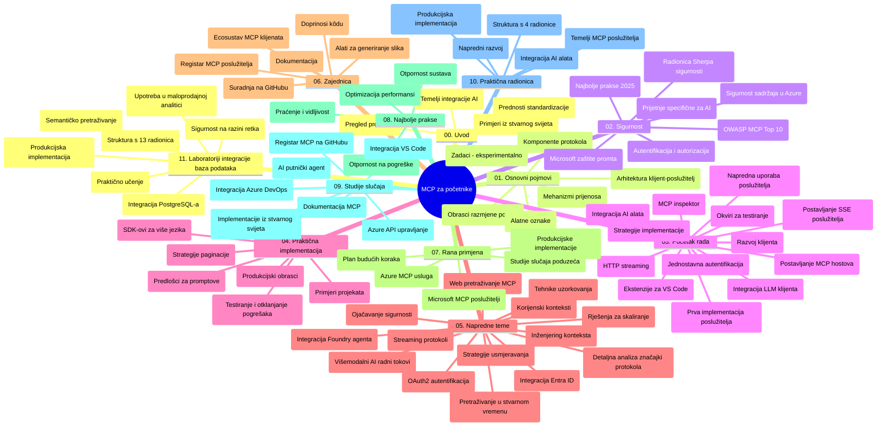

# Model Context Protocol (MCP) za početnike - Vodič za učenje

Ovaj vodič za učenje pruža pregled strukture i sadržaja repozitorija za kurikulum "Model Context Protocol (MCP) za početnike". Koristite ovaj vodič za učinkovito snalaženje u repozitoriju i maksimalno iskorištavanje dostupnih resursa.

## Pregled repozitorija

Model Context Protocol (MCP) je standardizirani okvir za interakcije između AI modela i klijentskih aplikacija. Izvorno kreiran od strane Anthropic-a, MCP sada održava šira MCP zajednica kroz službenu GitHub organizaciju. Ovaj repozitorij pruža opsežan kurikulum s praktičnim primjerima koda u C#, Javi, JavaScriptu, Pythonu i TypeScriptu, namijenjen AI programerima, sistemskim arhitektima i softverskim inženjerima.

## Vizualna karta kurikuluma

## Struktura repozitorija

Repozitorij je organiziran u jedanaest glavnih dijelova, od kojih se svaki fokusira na različite aspekte MCP-a:

1. **Uvod (00-Introduction/)**
   - Pregled Model Context Protocola
   - Zašto je standardizacija važna u AI procesima
   - Praktične upotrebe i koristi

2. **Osnovni pojmovi (01-CoreConcepts/)**
   - Klijent-poslužitelj arhitektura
   - Ključne komponente protokola
   - Obrasci poruka u MCP-u

3. **Sigurnost (02-Security/)**
   - Sigurnosne prijetnje u sustavima temeljenima na MCP-u
   - Najbolje prakse za sigurnu implementaciju
   - Strategije autentikacije i autorizacije
   - **Sveobuhvatna dokumentacija o sigurnosti**:
     - MCP Sigurnosne najbolje prakse 2025
     - Vodič za implementaciju Azure Content Safety
     - MCP sigurnosne kontrole i tehnologije
     - MCP najbolje prakse – brzi pregled
   - **Ključne sigurnosne teme**:
     - Napadi ubrizgavanja prompta i trovanje alata
     - Preuzimanje sesije i problemi zbunjenog zastupnika
     - Ranljivosti prosljeđivanja tokena
     - Pretjerane dozvole i kontrola pristupa
     - Sigurnost lanca opskrbe za AI komponente
     - Integracija Microsoft Prompt Shields

4. **Početak rada (03-GettingStarted/)**
   - Postavljanje i konfiguracija okruženja
   - Kreiranje osnovnih MCP poslužitelja i klijenata
   - Integracija s postojećim aplikacijama
   - Uključuje dijelove za:
     - Prvu implementaciju poslužitelja
     - Razvoj klijenta
     - Integraciju LLM klijenata
     - Integraciju u VS Code
     - Server-Sent Events (SSE) poslužitelj
     - Naprednu upotrebu poslužitelja
     - HTTP streaming
     - AI Toolkit integraciju
     - Strategije testiranja
     - Smjernice za implementaciju

5. **Praktična implementacija (04-PracticalImplementation/)**
   - Korištenje SDK-ova u raznim programskim jezicima
   - Tehnike otklanjanja pogrešaka, testiranja i validacije
   - Izrada ponovljivih predložaka prompta i međufera
   - Primjeri projekata s konkretnim implementacijama

6. **Napredne teme (05-AdvancedTopics/)**
   - Tehnike inženjeringa konteksta
   - Integracija Foundry agenta
   - Višemodalni AI workflow-i
   - Demo autentikacije preko OAuth2
   - Pretraživanje u stvarnom vremenu
   - Streaming u stvarnom vremenu
   - Implementacija root konteksta
   - Strategije usmjeravanja
   - Tehnike ispisa uzorka (sampling)
   - Pristupi skaliranju
   - Sigurnosna razmatranja
   - Integracija Entra ID sigurnosti
   - Integracija web pretraživanja

7. **Doprinosi zajednice (06-CommunityContributions/)**
   - Kako doprinijeti kodom i dokumentacijom
   - Suradnja putem GitHub-a
   - Poboljšanja vođena od zajednice i povratne informacije
   - Korištenje različitih MCP klijenata (Claude Desktop, Cline, VSCode)
   - Rad s popularnim MCP poslužiteljima uključujući generiranje slika

8. **Lekcije iz rane primjene (07-LessonsfromEarlyAdoption/)**
   - Implementacije iz stvarnog svijeta i priče o uspjehu
   - Izgradnja i implementacija rješenja temeljenih na MCP-u
   - Trendovi i buduća mapa puta
   - **Vodič za Microsoft MCP poslužitelje**: Sveobuhvatan vodič za 10 proizvodno spremnih Microsoft MCP poslužitelja, uključujući:
     - Microsoft Learn Docs MCP poslužitelj
     - Azure MCP poslužitelj (15+ specijaliziranih konektora)
     - GitHub MCP poslužitelj
     - Azure DevOps MCP poslužitelj
     - MarkItDown MCP poslužitelj
     - SQL Server MCP poslužitelj
     - Playwright MCP poslužitelj
     - Dev Box MCP poslužitelj
     - Azure AI Foundry MCP poslužitelj
     - Microsoft 365 Agents Toolkit MCP poslužitelj

9. **Najbolje prakse (08-BestPractices/)**
   - Podešavanje performansi i optimizacija
   - Dizajn otpornog MCP sustava
   - Strategije testiranja i otpornosti

10. **Studije slučaja (09-CaseStudy/)**
    - **Sedam sveobuhvatnih studija slučaja** koje pokazuju svestranost MCP-a u raznovrsnim scenarijima:
    - **Azure AI Travel Agents**: Multi-agent orkestracija s Azure OpenAI i AI Search
    - **Azure DevOps integracija**: Automatizacija radnih procesa s YouTube podacima
    - **Dohvat dokumentacije u stvarnom vremenu**: Python konzolni klijent sa streaming HTTP-om
    - **Generator interaktivnog plana učenja**: Chainlit web-aplikacija s konverzacijskim AI
    - **Dokumentacija unutar uređivača**: Integracija u VS Code s GitHub Copilot workflow-ima
    - **Azure API upravljanje**: Poslovna API integracija s kreiranjem MCP poslužitelja
    - **GitHub MCP registar**: Razvoj ekosustava i platforme za agentsku integraciju
    - Primjeri implementacije pokrivaju poslovnu integraciju, produktivnost programera i razvoj ekosustava

11. **Praktična radionica (10-StreamliningAIWorkflowsBuildingAnMCPServerWithAIToolkit/)**
    - Sveobuhvatna praksa koja kombinira MCP sa AI Toolkitom
    - Izgradnja inteligentnih aplikacija koje povezuju AI modele s alatima iz stvarnog svijeta
    - Praktični moduli koji pokrivaju osnove, razvoj prilagođenih poslužitelja i strategije implementacije u produkciju
    - **Struktura radionice**:
      - Laboratorij 1: Osnove MCP poslužitelja
      - Laboratorij 2: Napredni razvoj MCP poslužitelja
      - Laboratorij 3: Integracija AI Toolkita
      - Laboratorij 4: Implementacija i skaliranje u produkciji
    - Pristup učenju temeljen na laboratorijima sa korak-po-korak uputama

12. **Laboratoriji integracije MCP servera s bazama podataka (11-MCPServerHandsOnLabs/)**
    - **Sveobuhvatni put učenja kroz 13 laboratorija** za izgradnju proizvodno spremnih MCP poslužitelja s PostgreSQL integracijom
    - **Implementacija analitike za maloprodaju iz stvarnog svijeta** koristeći Zava Retail primjer
    - **Poslovni obrasci** uključujući Row Level Security (RLS), semantičko pretraživanje i višekorisnički pristup podacima
    - **Potpuna struktura laboratorija**:
      - **Laboratoriji 00-03: Osnove** - Uvod, arhitektura, sigurnost, postavljanje okruženja
      - **Laboratoriji 04-06: Izgradnja MCP poslužitelja** - Dizajn baze podataka, implementacija MCP poslužitelja, razvoj alata
      - **Laboratoriji 07-09: Napredne značajke** - Semantičko pretraživanje, testiranje i otklanjanje pogrešaka, integracija u VS Code
      - **Laboratoriji 10-12: Produkcija i najbolje prakse** - Implementacija, nadzor, optimizacija
    - **Obuhvaćene tehnologije**: FastMCP framework, PostgreSQL, Azure OpenAI, Azure Container Apps, Application Insights
    - **Ishodi učenja**: Proizvodno spremni MCP poslužitelji, obrasci integracije baza podataka, AI-pokretana analitika, poslovna sigurnost

## Dodatni resursi

Repozitorij sadrži pomoćne materijale:

- **Mapa Images**: Sadrži dijagrame i ilustracije korištene u cijelom kurikulumu
- **Prijevodi**: Podrška za više jezika s automatskim prijevodima dokumentacije
- **Službeni MCP resursi**:
  - [MCP dokumentacija](https://modelcontextprotocol.io/)
  - [MCP specifikacija](https://spec.modelcontextprotocol.io/)
  - [MCP GitHub repozitorij](https://github.com/modelcontextprotocol)

## Kako koristiti ovaj repozitorij

1. **Sekvencijalno učenje**: Pratite poglavlja redom (od 00 do 11) za strukturirano učenje.
2. **Fokus na određeni jezik**: Ako vas zanima poseban programski jezik, istražite direktorije sa uzorcima za implementacije u vašem omiljenom jeziku.
3. **Praktična implementacija**: Počnite s odjeljkom "Getting Started" za postavljanje okruženja i kreiranje prvog MCP poslužitelja i klijenta.
4. **Napredno istraživanje**: Kad ste spremni s osnovama, zaronite u napredne teme za proširenje znanja.
5. **Sudjelovanje u zajednici**: Pridružite se MCP zajednici putem GitHub diskusija i Discord kanala kako biste se povezali s ekspertima i drugim programerima.

## MCP klijenti i alati

Kurikulum pokriva različite MCP klijente i alate:

1. **Službeni klijenti**:
   - Visual Studio Code
   - MCP u Visual Studio Codeu
   - Claude Desktop
   - Claude u VSCode-u
   - Claude API

2. **Klijenti zajednice**:
   - Cline (temeljeno na terminalu)
   - Cursor (uređivač koda)
   - ChatMCP
   - Windsurf

3. **Alati za upravljanje MCP-om**:
   - MCP CLI
   - MCP Manager
   - MCP Linker
   - MCP Router

## Popularni MCP poslužitelji

Repozitorij uvodi razne MCP poslužitelje, uključujući:

1. **Službeni Microsoft MCP poslužitelji**:
   - Microsoft Learn Docs MCP poslužitelj
   - Azure MCP poslužitelj (15+ specijaliziranih konektora)
   - GitHub MCP poslužitelj
   - Azure DevOps MCP poslužitelj
   - MarkItDown MCP poslužitelj
   - SQL Server MCP poslužitelj
   - Playwright MCP poslužitelj
   - Dev Box MCP poslužitelj
   - Azure AI Foundry MCP poslužitelj
   - Microsoft 365 Agents Toolkit MCP poslužitelj

2. **Službeni referentni poslužitelji**:
   - Filesystem
   - Fetch
   - Memory
   - Sequential Thinking

3. **Generiranje slika**:
   - Azure OpenAI DALL-E 3
   - Stable Diffusion WebUI
   - Replicate

4. **Razvojni alati**:
   - Git MCP
   - Terminal Control
   - Code Assistant

5. **Specijalizirani poslužitelji**:
   - Salesforce
   - Microsoft Teams
   - Jira & Confluence

## Doprinos

Ovaj repozitorij poziva doprinose iz zajednice. Pogledajte odjeljak Doprinosi zajednice za upute kako učinkovito doprinijeti MCP ekosustavu.

----

*Ovaj vodič za učenje zadnji je put ažuriran 5. veljače 2026., odražavajući najnoviju MCP specifikaciju 2025-11-25 i pruža pregled repozitorija prema tom datumu. Sadržaj repozitorija može biti ažuriran nakon tog datuma.*

---

<!-- CO-OP TRANSLATOR DISCLAIMER START -->
**Odricanje od odgovornosti**:
Ovaj dokument je preveden pomoću AI usluge za prevođenje [Co-op Translator](https://github.com/Azure/co-op-translator). Iako težimo točnosti, molimo imajte na umu da automatski prijevodi mogu sadržavati pogreške ili netočnosti. Izvorni dokument na izvornom jeziku treba smatrati autoritativnim izvorom. Za važne informacije preporučuje se profesionalni ljudski prijevod. Ne snosimo odgovornost za bilo kakva nesporazume ili pogrešne interpretacije proizašle iz korištenja ovog prijevoda.
<!-- CO-OP TRANSLATOR DISCLAIMER END -->