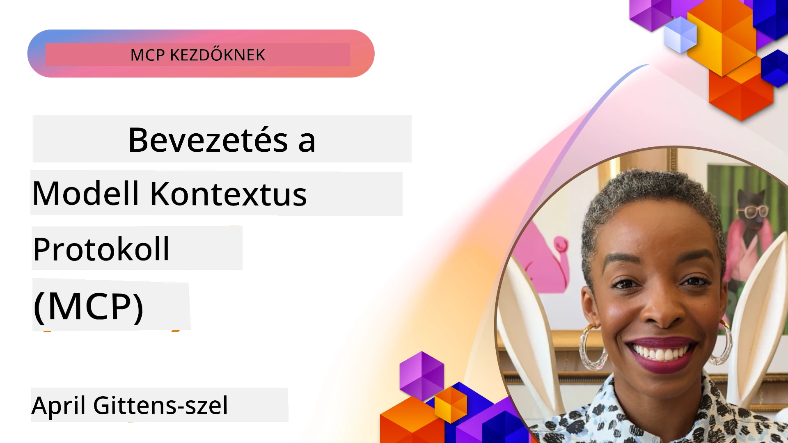
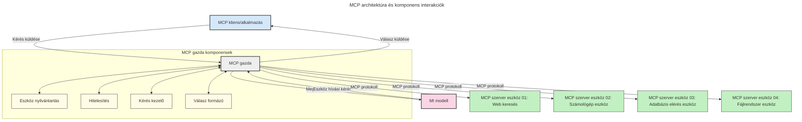

# Bevezetés a Model Context Protocol (MCP) témakörébe: Miért fontos a skálázható AI alkalmazások számára

[](https://youtu.be/agBbdiOPLQA)

_(Kattintson a fenti képre a lecke videójának megtekintéséhez)_

A generatív AI alkalmazások nagy előrelépést jelentenek, mivel gyakran lehetővé teszik a felhasználó számára, hogy természetes nyelvi utasításokat adjon az alkalmazásnak. Azonban, ahogy egyre több időt és erőforrást fektetnek ezekbe az alkalmazásokba, fontos, hogy biztosítsuk a funkciók és erőforrások egyszerű integrálását úgy, hogy könnyen bővíthető legyen, az alkalmazás több modell használatát is támogassa, és kezelje a különböző modellbeli részleteket. Röviden: generatív AI alkalmazásokat könnyű elkezdeni fejleszteni, de ahogy nőnek és egyre összetettebbé válnak, szükségessé válik egy architektúra meghatározása, és valószínűleg egy szabványra kell támaszkodni, hogy az alkalmazások következetesen épüljenek fel. Itt jön képbe az MCP, amely rendezi a dolgokat és biztosítja a szabványt.

---

## **🔍 Mi az a Model Context Protocol (MCP)?**

A **Model Context Protocol (MCP)** egy **nyílt, szabványosított interfész**, amely lehetővé teszi a Nagy Nyelvi Modellek (LLM-ek) zökkenőmentes együttműködését külső eszközökkel, API-kkal és adatokkal. Egységes architektúrát kínál az AI modellek funkcionalitásának kibővítésére a tanító adatokon túl, így intelligensebb, skálázhatóbb és gyorsabban reagáló AI rendszereket tesz lehetővé.

---

## **🎯 Miért fontos a szabványosítás az AI-ban**

Ahogy a generatív AI alkalmazások egyre összetettebbé válnak, létfontosságú szabványokat alkalmazni, amelyek biztosítják a **skálázhatóságot, bővíthetőséget, karbantarthatóságot**, illetve segítenek **elkerülni a szállítófüggőséget**. Az MCP ezeket az igényeket az alábbi módokon kezeli:

- Modell-eszköz integrációk egységesítése
- Sérülékeny, egyedi megoldások csökkentése
- Több különböző gyártótól származó modell együttélésének lehetővé tétele egy ökoszisztémán belül

**Megjegyzés:** Az MCP ugyan nyílt szabványként határozza meg magát, de nincs terv ilyen szabványosításra sem az IEEE, sem az IETF, W3C, ISO vagy más szabványosító testületek keretében.

---

## **📚 Tanulási célok**

A cikk végére képes leszel:

- Meghatározni a **Model Context Protocol (MCP)** fogalmát és felhasználási eseteit
- Megérteni, hogyan szabványosítja az MCP a modell és eszköz közti kommunikációt
- Azonosítani az MCP architektúra főbb összetevőit
- Felfedezni az MCP valós üzleti és fejlesztési alkalmazásait

---

## **💡 Miért forradalmi a Model Context Protocol (MCP)**

### **🔗 Az MCP megoldja az AI interakciók széttagoltságát**

Az MCP előtt a modellek és eszközök integrálásához:

- Egyedi kód írása kellett eszköz-modell páronként
- Nem szabványosított API-k minden gyártónál
- Gyakori meghibásodások frissítések miatt
- Gyenge skálázhatóság sok eszköz esetén

### **✅ Az MCP szabványosítás előnyei**

| **Előny**                | **Leírás**                                                                     |
|--------------------------|--------------------------------------------------------------------------------|
| Interoperabilitás        | Az LLM-ek zökkenőmentesen működnek együtt különböző gyártók eszközeivel        |
| Következetesség          | Egységes viselkedés platformok és eszközök között                             |
| Újrahasznosíthatóság     | Egyszer épített eszközök új projektekben és rendszerekben is használhatók      |
| Gyorsabb fejlesztés      | Standardizált, plug-and-play interfészek használatával csökken a fejlesztési idő |

---

## **🧱 MCP magas szintű architektúra áttekintése**

Az MCP egy **kliens-szerver modell**, ahol:

- **MCP hosztok** futtatják az AI modelleket
- **MCP kliensek** indítják a kéréseket
- **MCP szerverek** szolgáltatják a kontextust, eszközöket és képességeket

### **Főbb összetevők:**

- **Erőforrások** – statikus vagy dinamikus adatok a modellek számára  
- **Promotok** – előre definiált munkafolyamatok irányított generáláshoz  
- **Eszközök** – végrehajtható funkciók, mint keresés, számítások  
- **Mintavételezés** – ügynöki viselkedés rekurzív interakciókon keresztül
- **Kiváltás** – szerver által kezdeményezett kérdések a felhasználótól
- **Gyökerek** – fájlrendszer-határok a szerver hozzáférésének szabályozására

### **Protokoll architektúra:**

Az MCP két rétegű architektúrát használ:
- **Adat réteg**: JSON-RPC 2.0 alapú kommunikáció életciklus-kezeléssel és primitívekkel
- **Szállítási réteg**: STDIO (helyi) és Streamable HTTP SSE-vel (távoli) kommunikációs csatornák

---

## Hogyan működnek az MCP szerverek

Az MCP szerverek az alábbi módon működnek:

- **Kérés folyamata**:
    1. Egy kérést egy végfelhasználó vagy annak nevében eljáró szoftver indít.
    2. Az **MCP kliens** elküldi a kérést egy **MCP hosztnak**, amely kezeli az AI modell futtatókörnyezetét.
    3. Az **AI modell** megkapja a felhasználói promptot, és kérheti külső eszközök vagy adatok elérését egy vagy több eszközhíváson keresztül.
    4. Az **MCP hoszt**, nem maga a modell, kommunikál a megfelelő **MCP szerver(ek) kel** a szabványos protokollt használva.
- **MCP hoszt funkciói**:
    - **Eszközregiszter**: karbantartja az elérhető eszközök és képességeik katalógusát.
    - **Hitelesítés**: ellenőrzi a jogosultságokat az eszközhozzáféréshez.
    - **Kéréskezelő**: feldolgozza a modell által küldött eszközkéréseket.
    - **Válaszformázó**: eszköz kimeneteit olyan formátumba alakítja, amit a modell ért meg.
- **MCP szerver végrehajtás**:
    - Az **MCP hoszt** továbbítja az eszközhívásokat egy vagy több, speciális funkciókat kínáló **MCP szervernek** (pl. keresés, számítások, adatbázis-lekérdezések).
    - Az **MCP szerverek** végrehajtják a műveleteket és egységes formátumban visszaküldik az eredményeket az **MCP hosztnak**.
    - Az **MCP hoszt** formázza és továbbítja ezeket az eredményeket az **AI modellnek**.
- **Válasz befejezése**:
    - Az **AI modell** beépíti az eszközök kimeneteit a végső válaszba.
    - Az **MCP hoszt** visszaküldi ezt a választ az **MCP kliensnek**, amely továbbítja az végfelhasználónak vagy a hívó szoftvernek.
    


## 👨‍💻 Hogyan építsünk MCP szervert (példákkal)

Az MCP szerverek lehetővé teszik az LLM-ek képességeinek bővítését adatok és funkcionalitás biztosításával.

Készen áll kipróbálni? Íme néhány nyelv- és/vagy technológiai stack specifikus SDK, példákkal egyszerű MCP szerverek létrehozásához különböző nyelveken/tech stackeken:

- **Python SDK**: https://github.com/modelcontextprotocol/python-sdk

- **TypeScript SDK**: https://github.com/modelcontextprotocol/typescript-sdk

- **Java SDK**: https://github.com/modelcontextprotocol/java-sdk

- **C#/.NET SDK**: https://github.com/modelcontextprotocol/csharp-sdk


## 🌍 MCP valós alkalmazási esetei

Az MCP széles körű alkalmazásokat tesz lehetővé az AI képességek kibővítésén keresztül:

| **Alkalmazás**              | **Leírás**                                                                     |
|------------------------------|--------------------------------------------------------------------------------|
| Vállalati adat integráció    | LLM-ek csatlakoztatása adatbázisokhoz, CRM-ekhez vagy belső eszközökhöz        |
| Ügynöki AI rendszerek        | Autonóm ügynökök engedélyezése eszközhozzáféréssel és döntési munkafolyamatokkal |
| Többmodalitású alkalmazások  | Szöveg, kép és hang eszközök kombinálása egyetlen egységes AI alkalmazásban   |
| Valós idejű adat integráció  | Élő adatok bevitele az AI interakciókba a pontosabb, aktuális kimenetekért     |


### 🧠 MCP = Univerzális szabvány az AI interakciókhoz

A Model Context Protocol (MCP) olyan univerzális szabványként működik az AI interakciókhoz, mint amilyen a USB-C a fizikai eszközcsatlakozásokhoz. Az AI világában az MCP egységes interfészt biztosít, amely lehetővé teszi, hogy a modellek (kliensek) zökkenőmentesen integrálódjanak külső eszközökkel és adatforrásokkal (szerverekkel). Ez megszünteti az egyedi, különböző protokollok szükségességét minden API-hoz vagy adatforráshoz.

Az MCP kompatibilis eszköz (MCP szerverként említve) egységes szabvány szerint működik. Ezek a szerverek felsorolhatják a nyújtott eszközöket vagy műveleteket, és végrehajthatják ezeket, amikor egy AI ügynök kéri. Az MCP-kompatibilis AI ügynök platformok képesek felfedezni a szervereken elérhető eszközöket és a szabványos protokollon keresztül meghívni azokat.

### 💡 Megkönnyíti a tudáshoz való hozzáférést

Az eszközök nyújtása mellett az MCP megkönnyíti a tudáshoz való hozzáférést is. Lehetővé teszi, hogy az alkalmazások kontextust nyújtsanak az LLM-eknek, összekapcsolva őket különféle adatforrásokkal. Például egy MCP szerver képviselheti egy vállalat dokumentumtárát, lehetővé téve az ügynökök számára, hogy igény szerint releváns információkat szerezzenek. Egy másik szerver speciális műveleteket kezelhet, például e-mailek küldését vagy rekordok frissítését. Az ügynök szemszögéből ezek csupán eszközök, néhány adatot (tudás kontextust) visszaad, mások pedig műveleteket hajtanak végre. Az MCP hatékonyan kezeli mindkettőt.

Egy ügynök, amely csatlakozik egy MCP szerverhez, automatikusan megismeri a szerver elérhető képességeit és hozzáférhető adatait egy szabványos formátumon keresztül. Ez a szabványosítás dinamikus eszköz rendelkezésre állást tesz lehetővé. Például egy új MCP szerver hozzáadása egy ügynök rendszeréhez azonnali használhatóságot biztosít a funkciók számára anélkül, hogy az ügynök utasításait tovább kellene testreszabni.

Ez az egyszerűsített integráció összhangban áll az alábbi ábrán bemutatott folyamattal, ahol a szerverek eszközöket és tudást biztosítanak, elősegítve az zökkenőmentes együttműködést a rendszerek között.

### 👉 Példa: Skálázható ügynök megoldás

```mermaid
---
title: Skálázható Ügynök Megoldás MCP-vel
description: Egy diagram, amely bemutatja, hogyan lép kapcsolatba a felhasználó egy LLM-mel, amely több MCP szerverhez csatlakozik, ahol minden szerver tudást és eszközöket nyújt, így egy skálázható MI rendszer architektúrát létrehozva
---
graph TD
    User -->|Prompt| LLM
    LLM -->|Válasz| User
    LLM -->|MCP| ServerA
    LLM -->|MCP| ServerB
    ServerA -->|Univerzális csatlakozó| ServerB
    ServerA --> TudásA
    ServerA --> EszközökA
    ServerB --> TudásB
    ServerB --> EszközökB

    subgraph Server A
        TudásA[Tudás]
        EszközökA[Eszközök]
    end

    subgraph Server B
        TudásB[Tudás]
        EszközökB[Eszközök]
    end
```Az Universal Connector lehetővé teszi, hogy az MCP szerverek kommunikáljanak és megosszák képességeiket egymással, lehetővé téve, hogy ServerA feladatokat delegáljon ServerB-nek vagy hozzáférjen annak eszközeihez és tudásához. Ez az eszközök és adatok federációját valósítja meg a szerverek között, támogatva a skálázható és moduláris ügynök architektúrákat. Mivel az MCP szabványosítja az eszközök közzétételét, az ügynökök dinamikusan felfedezhetik és irányíthatják a kéréseket a szerverek között anélkül, hogy kódba ágyazott integrációkra lenne szükség.

Eszköz- és tudás-federáció: Eszközök és adatok elérhetők szerverek között, lehetővé téve skálázhatóbb és modulárisabb ügynöki architektúrákat.

### 🔄 Fejlett MCP forgatókönyvek kliensoldali LLM integrációval

Az alap MCP architektúrán túl léteznek fejlett forgatókönyvek, ahol mind kliens, mind szerver tartalmaz LLM-et, lehetővé téve összetettebb interakciókat. Az alábbi ábrán a **Kliensalkalmazás** lehet egy IDE, amely több MCP eszközt tesz elérhetővé az LLM által történő használatra:

```mermaid
---
title: Fejlett MCP forgatókönyvek kliens-szerver LLM integrációval
description: Egy szekvenciadiagram, amely részletesen bemutatja a felhasználó, kliensalkalmazás, kliens LLM, több MCP szerver és szerver LLM közötti interakció folyamatát, illusztrálva az eszközfelismerést, felhasználói interakciót, közvetlen eszközhívást és a funkciók tárgyalási szakaszát
---
sequenceDiagram
    autonumber
    actor User as 👤 Felhasználó
    participant ClientApp as 🖥️ Kliensalkalmazás
    participant ClientLLM as 🧠 Kliens LLM
    participant Server1 as 🔧 MCP Szerver 1
    participant Server2 as 📚 MCP Szerver 2
    participant ServerLLM as 🤖 Szerver LLM
    
    %% Discovery Phase
    rect rgb(220, 240, 255)
        Note over ClientApp, Server2: ESZKÖZ FELISMERÉSI SZAKASZ
        ClientApp->>+Server1: Elérhető eszközök/erőforrások lekérése
        Server1-->>-ClientApp: Eszközlista visszaküldése (JSON)
        ClientApp->>+Server2: Elérhető eszközök/erőforrások lekérése
        Server2-->>-ClientApp: Eszközlista visszaküldése (JSON)
        Note right of ClientApp: Kombinált eszköz<br/>katalógus helyi tárolása
    end
    
    %% User Interaction
    rect rgb(255, 240, 220)
        Note over User, ClientLLM: FELHASZNÁLÓI INTERAKCIÓS SZAKASZ
        User->>+ClientApp: Természetes nyelvű utasítás bevitele
        ClientApp->>+ClientLLM: Utasítás + eszközkatalógus továbbítása
        ClientLLM->>-ClientLLM: Utasítás elemzése és eszközök kiválasztása
    end
    
    %% Scenario A: Direct Tool Calling
    alt Közvetlen Eszközhívás
        rect rgb(220, 255, 220)
            Note over ClientApp, Server1: A FORGATÓKÖNYV: KÖZVETLEN ESZKÖZHÍVÁS
            ClientLLM->>+ClientApp: Eszköz végrehajtásának kérése
            ClientApp->>+Server1: Meghatározott eszköz végrehajtása
            Server1-->>-ClientApp: Eredmények visszaküldése
            ClientApp->>+ClientLLM: Eredmények feldolgozása
            ClientLLM-->>-ClientApp: Válasz generálása
            ClientApp-->>-User: Végső válasz megjelenítése
        end
    
    %% Scenario B: Feature Negotiation (VS Code style)
    else Funkció Tárgyalás (VS Code stílus)
        rect rgb(255, 220, 220)
            Note over ClientApp, ServerLLM: B FORGATÓKÖNYV: FUNKCIÓ TÁRGYALÁS
            ClientLLM->>+ClientApp: Szükséges képességek azonosítása
            ClientApp->>+Server2: Funkciók/képességek tárgyalása
            Server2->>+ServerLLM: További kontextus kérése
            ServerLLM-->>-Server2: Kontextus biztosítása
            Server2-->>-ClientApp: Elérhető funkciók visszaküldése
            ClientApp->>+Server2: Tárgyalt eszközök hívása
            Server2-->>-ClientApp: Eredmények visszaküldése
            ClientApp->>+ClientLLM: Eredmények feldolgozása
            ClientLLM-->>-ClientApp: Válasz generálása
            ClientApp-->>-User: Végső válasz megjelenítése
        end
    end
```
## 🔐 Az MCP gyakorlati előnyei

Az MCP használatának gyakorlati előnyei:

- **Frissesség**: A modellek hozzáférhetnek az aktuális, képzésen túli információkhoz
- **Képességbővítés**: A modellek speciális eszközöket használhatnak olyan feladatokra, amelyekre nem voltak kiképezve
- **Csökkentett hamis információ**: Külső adatforrások tényalapú megalapozást biztosítanak
- **Adatvédelem**: Érzékeny adatok biztonságos környezetben maradhatnak, nem kell őket promptokba ágyazni

## 📌 Főbb tanulságok

A MCP használatának legfőbb tanulságai:

- Az **MCP** szabványosítja, hogyan kommunikálnak az AI modellek eszközökkel és adatokkal
- Támogatja a **bővíthetőséget, következetességet és interoperabilitást**
- Az MCP segít **csökkenteni a fejlesztési időt, javítani a megbízhatóságot és bővíteni a modell képességeit**
- A kliens-szerver architektúra **rugalmas, bővíthető AI alkalmazásokat tesz lehetővé**

## 🧠 Gyakorlat

Gondolkozzon el egy AI alkalmazáson, amelyet érdekesnek találna fejleszteni.

- Milyen **külső eszközök vagy adatok** növelhetnék a képességeit?
- Hogyan tehetné az MCP az integrációt **egyszerűbbé és megbízhatóbbá**?

## További erőforrások

- [MCP GitHub tárház](https://github.com/modelcontextprotocol)


## Mi következik

Következő: [1. fejezet: Alapfogalmak](../01-CoreConcepts/README.md)

---

<!-- CO-OP TRANSLATOR DISCLAIMER START -->
**Felelősségkizárás**:
Ezt a dokumentumot az AI fordító szolgáltatás, a [Co-op Translator](https://github.com/Azure/co-op-translator) segítségével fordítottuk. Bár a pontosságra törekszünk, kérjük, vegye figyelembe, hogy az automatikus fordítások hibákat vagy pontatlanságokat tartalmazhatnak. Az eredeti, anyanyelvi dokumentum tekinthető a hiteles forrásnak. Fontos információk esetén professzionális emberi fordítást javaslunk. A jelen fordítás használatából eredő félreértésekért vagy helytelen értelmezésekért nem vállalunk felelősséget.
<!-- CO-OP TRANSLATOR DISCLAIMER END -->