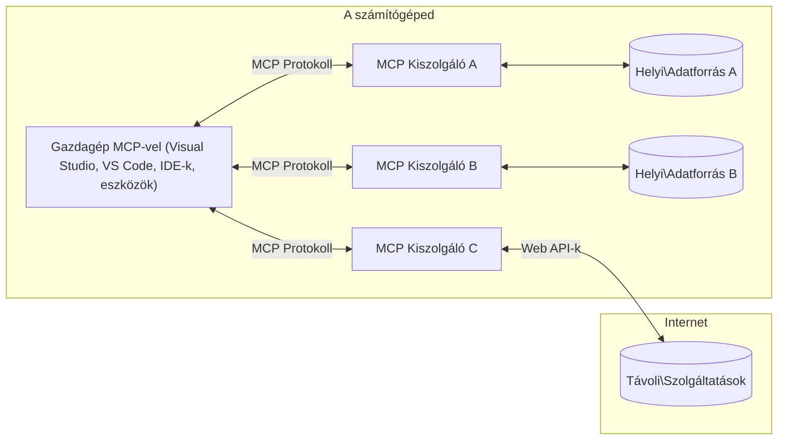

# MCP Alapfogalmak: A Model Context Protocol mesteri elsajátítása az AI integrációhoz

[](https://youtu.be/earDzWGtE84)

_(Kattints a fenti képre a videó megtekintéséhez)_

A [Model Context Protocol (MCP)](https://github.com/modelcontextprotocol) egy erőteljes, szabványosított keretrendszer, amely optimalizálja a kommunikációt a Nagy Nyelvi Modellek (LLM-ek) és külső eszközök, alkalmazások, valamint adatforrások között.  
Ez az útmutató végigvezeti Önt az MCP alapfogalmain. Megismerheti a kliens-szerver architektúrát, a lényeges komponenseket, a kommunikáció működését és a megvalósítás legjobb gyakorlatait.

- **Explicit felhasználói beleegyezés**: Minden adat-hozzáféréshez és művelethez a végrehajtás előtt explicit felhasználói jóváhagyás szükséges. A felhasználóknak pontosan érteniük kell, milyen adatokhoz férnek hozzá és milyen műveleteket hajtanak végre, részletes jogosultság- és engedélykezeléssel.

- **Adatvédelmi védelem**: A felhasználói adatok csak explicit beleegyezéssel kerülnek megosztásra, és az egész interakciós életciklus alatt erős hozzáférés-vezérlés védi őket. A megvalósítások meg kell akadályozzák az illetéktelen adatátvitelt és szigorú adatvédelmi határokat kell fenntartaniuk.

- **Biztonságos eszközvégrehajtás**: Minden eszközhívás explicit felhasználói beleegyezést igényel, mely világosan ismerteti az eszköz funkcióit, paramétereit és lehetséges hatásait. Erős biztonsági korlátoknak kell megakadályozniuk a nem szándékolt, nem biztonságos vagy rosszindulatú eszközhasználatot.

- **Transzport réteg biztonság**: Minden kommunikációs csatornának meg kell felelnie a megfelelő titkosítási és hitelesítési mechanizmusoknak. Távoli kapcsolatok esetén biztonságos transzport protokollokat és megfelelő hitelesítési adatkezelést kell alkalmazni.

#### Megvalósítási irányelvek:

- **Jogosultságkezelés**: Finoman szabályozható jogosultsági rendszerek létrehozása, melyek lehetővé teszik a felhasználók számára a hozzáférhető szerverek, eszközök és erőforrások kezelését  
- **Hitelesítés és autorizáció**: Biztonságos hitelesítési módszerek alkalmazása (OAuth, API kulcsok) megfelelő tokenkezeléssel és lejárattal  
- **Paraméterérvényesítés**: Minden paraméter és adatbevitel ellenőrzése a meghatározott sémák szerint az injekciós támadások megelőzése érdekében  
- **Audit naplózás**: Minden művelet átfogó naplózása a biztonsági megfigyelés és megfelelőség érdekében  

## Áttekintés

Ez a lecke bemutatja a Model Context Protocol (MCP) ökoszisztéma alapvető architektúráját és komponenseit. Megismerkedik a kliens-szerver modellel, a kulcsfontosságú részegységekkel és a MCP interakciókat működtető kommunikációs mechanizmusokkal.

## Fő tanulási célok

A lecke végére Ön:

- Megérti az MCP kliens-szerver architektúrát.  
- Azonosítja a Hosztok, Kliensek és Szerverek szerepeit és felelősségeit.  
- Elemzi azokat az alapvető jellemzőket, amelyek rugalmas integrációs réteget biztosítanak az MCP-nek.  
- Megtanulja, hogyan áramlik az információ az MCP ökoszisztémában.  
- Gyakorlati betekintést szerez .NET, Java, Python és JavaScript kódpéldákon keresztül.  

## MCP architektúra: Alaposabb áttekintés

Az MCP ökoszisztéma kliens-szerver modellen alapul. Ez a moduláris felépítés lehetővé teszi, hogy az AI alkalmazások hatékonyan lépjenek kapcsolatba eszközökkel, adatbázisokkal, API-kkal és kontextuális erőforrásokkal. Nézzük át ezt az architektúrát főbb komponenseire bontva.

Az MCP alapvetően egy kliens-szerver architektúrát követ, melyben egy hoszt alkalmazás csatlakozhat több szerverhez is:


- **MCP hosztok**: Olyan programok, mint a VSCode, Claude Desktop, IDE-k vagy AI eszközök, melyek az MCP-n keresztül akarnak adatot elérni  
- **MCP kliensek**: Protokoll kliensek, melyek 1:1 kapcsolatokat tartanak fenn szerverekkel  
- **MCP szerverek**: Könnyűsúlyú programok, melyek a szabványos Model Context Protocolon keresztül konkrét képességeket tesznek elérhetővé  
- **Helyi adatforrások**: A számítógép fájljai, adatbázisai és szolgáltatásai, melyekhez az MCP szerverek biztonságosan hozzáférhetnek  
- **Távoli szolgáltatások**: Interneten elérhető külső rendszerek, melyekhez az MCP szerverek API-kon keresztül csatlakozhatnak  

Az MCP Protokoll egy fejlődő szabvány dátum-alapú verziózással (YYYY-MM-DD formátum). A jelenlegi protokoll verzió **2025-11-25**. Megtekintheti a legfrissebb frissítéseket a [protokoll specifikáción](https://modelcontextprotocol.io/specification/2025-11-25/)

### 1. Hosztok

A Model Context Protocolban (MCP) a **Hosztok** olyan AI alkalmazások, melyek elsődleges felületként szolgálnak a felhasználók és a protokoll közötti interakcióhoz. A hosztok koordinálják és menedzselik az MCP szerverekhez létrejött kapcsolatokat úgy, hogy dedikált MCP klienseket hoznak létre minden egyes szerverkapcsolathoz. Példák hosztokra:

- **AI alkalmazások**: Claude Desktop, Visual Studio Code, Claude Code  
- **Fejlesztői környezetek**: IDE-k és kód szerkesztők MCP integrációval  
- **Egyedi alkalmazások**: Célzott AI ügynökök és eszközök  

A **Hosztok** azok az alkalmazások, amelyek koordinálják az AI modell interakciókat. Ezek:

- **AI modellek koordinálása**: LLM-ek futtatása vagy velük való kommunikáció válaszok generálásához és AI munkafolyamatok irányításához  
- **Kliens kapcsolatkezelés**: Minden MCP szerverkapcsolathoz önálló MCP kliens létrehozása és fenntartása  
- **Felhasználói felület irányítása**: A beszélgetés kezelését, a felhasználói interakciókat és a válaszok megjelenítését végzik  
- **Biztonság érvényesítése**: Jogosultságok, biztonsági korlátok és hitelesítés kezelése  
- **Felhasználói hozzájárulás kezelése**: A felhasználói jóváhagyások kezelése az adathozzáféréshez és az eszközök futtatásához  

### 2. Kliensek

A **Kliensek** elengedhetetlen komponensei a hoszt alkalmazásnak, mivel dedikált, egyedi kapcsolatok fenntartásáért felelősek az MCP szerverekhez. Minden MCP kliens a hoszt által jön létre egy adott MCP szerverhez való kapcsolódáshoz, biztosítva szervezett és biztonságos kommunikációs csatornákat. Több kliens lehetővé teszi, hogy a hoszt több szerverhez egyszerre kapcsolódjon.

A **Kliensek** a hoszt alkalmazáson belüli kapcsolódó komponensek. Ezek:

- **Protokoll kommunikáció**: JSON-RPC 2.0 kérések küldése a szerverekhez helyzetekkel és utasításokkal  
- **Képesség tárgyalás**: A szerverekkel történő kezdeti kapcsolódáskor a támogatott funkciók és protokoll verziók egyeztetése  
- **Eszközvégrehajtás**: A modellek eszközigényeinek kezelése és a válaszok feldolgozása  
- **Valós idejű frissítések**: Értesítések és valós idejű információk kezelése a szerverektől  
- **Válaszfeldolgozás**: A szerver válaszainak feldolgozása és formázása a felhasználók számára történő megjelenítéshez  

### 3. Szerverek

A **Szerverek** azok a programok, melyek kontextust, eszközöket és képességeket nyújtanak az MCP kliensek számára. Futtathatók a hoszt alkalmazással azonos gépen (helyi), vagy távoli, külső platformokon is, és felelősek a kliensigények kezeléséért és strukturált válaszok szolgáltatásáért. A szerverek specifikus funkciókat tesznek elérhetővé a szabványos Model Context Protocolon keresztül.

A **Szerverek** olyan szolgáltatások, amelyek kontextust és képességeket biztosítanak. Ezek:

- **Funkciók regisztrálása**: Az elérhető primitívek (erőforrások, promptok, eszközök) regisztrálása és bemutatása a klienseknek  
- **Kérés feldolgozás**: Eszköz hívások, erőforrás-kérések és prompt kérelmek fogadása és végrehajtása a kliensektől  
- **Kontextus biztosítása**: Kontextuális információk és adatok nyújtása a modell válaszainak gazdagításához  
- **Állapotkezelés**: Ülésállapot fenntartása és állapotfüggő interakciók kezelése szükség esetén  
- **Valós idejű értesítések**: Értesítések küldése a képességváltozásokról és frissítésekről a kapcsolódó kliensekhez  

A szervereket bárki fejlesztheti, hogy speciális funkciókkal bővítse a modell képességeit. Támogatják a helyi és távoli telepítési scenáriókat is.

### 4. Szerver primitívek

A Model Context Protocolban (MCP) a szerverek három fő **primitívet** nyújtanak, melyek az alapvető építőelemeket alkotják az interaktív kliens, hoszt és nyelvi modell közötti gazdag kommunikációhoz. Ezek a primitívek meghatározzák, milyen típusú kontextuális információk és akciók érhetők el a protokollon keresztül.

Az MCP szerverek bármilyen kombinációban kiteszik az alábbi három alapvető primitívet:

#### Erőforrások

**Erőforrások** olyan adatforrások, melyek kontextuális információt szolgáltatnak AI alkalmazásoknak. Állandó vagy dinamikus tartalmat képviselnek, melyek gazdagítják a modell megértését és döntéshozatalát:

- **Kontextuális adatok**: Strukturált információk és kontextus AI modell felhasználásra  
- **Tudásbázisok**: Dokumentum-gyűjtemények, cikkek, kézikönyvek és kutatási anyagok  
- **Helyi adatforrások**: Fájlok, adatbázisok és lokális rendszerinformációk  
- **Külső adatok**: API válaszok, webszolgáltatások és távoli rendszeradatok  
- **Dinamikus tartalom**: Olyan valós idejű adatok, melyek külső feltételek függvényében frissülnek  

Az erőforrások URI-k által azonosíthatók, és `resources/list` metódussal listázhatók, valamint `resources/read`-del lekérhetők:

```text
file://documents/project-spec.md
database://production/users/schema
api://weather/current
```

#### Promptok

A **Promptok** újrahasznosítható sablonok, melyek segítik a nyelvi modellekkel való interakciók strukturálását. Standardizált interakciós mintákat és előre elkészített munkafolyamatokat kínálnak:

- **Sablonalapú interakciók**: Előstruktúrált üzenetek és beszélgetésindítók  
- **Munkafolyamat sablonok**: Szabványosított lépéssorozatok gyakori feladatokhoz és interakciókhoz  
- **Few-shot példák**: Példa alapú sablonok modell utasításhoz  
- **Rendszer promptok**: Alapvető promptok, melyek definiálják a modell viselkedését és kontextusát  
- **Dinamikus sablonok**: Paraméterezett promptok, melyek alkalmazkodnak az adott kontextushoz  

A promptok támogatják a változó cserét, és `prompts/list` metódussal felfedezhetők, `prompts/get`-tel elérhetők:

```markdown
Generate a {{task_type}} for {{product}} targeting {{audience}} with the following requirements: {{requirements}}
```

#### Eszközök

Az **Eszközök** olyan futtatható funkciók, melyeket az AI modellek hívhatnak meg speciális műveletek elvégzésére. Az MCP ökoszisztéma "igéi", amelyek lehetővé teszik a modellek számára a külső rendszerekkel való interakciót:

- **Futtatható függvények**: Elkülönült műveletek, melyeket a modellek meghatározott paraméterekkel indíthatnak  
- **Külső rendszerek integrációja**: API hívások, adatbázis lekérdezések, fájlműveletek, számítások  
- **Egyedi azonosító**: Minden eszköznek egyedi neve, leírása és paraméter sémája van  
- **Strukturált be- és kimenet**: Az eszközök validált paramétereket fogadnak és strukturált, típusos válaszokat adnak  
- **Akcióképességek**: Lehetővé teszi, hogy modellek valós műveleteket hajtsanak végre és élő adatokat szerezzenek be  

Az eszközök a JSON Schema segítségével vannak definiálva a paraméter érvényesítéshez, `tools/list` paranccsal felfedezhetők és `tools/call`-lal hívhatóak meg. Az eszközök tartalmazhatnak **ikonokat** is, mint extra metaadatokat a jobb felhasználói megjelenítés érdekében.

**Eszköz annotációk**: Az eszközök viselkedési jegyzeteket támogatnak (pl. `readOnlyHint`, `destructiveHint`), melyek jelzik, hogy az eszköz csak olvasható vagy destruktív jellegű, segítve a klienseket a megalapozott döntések meghozatalában az eszközvégrehajtással kapcsolatban.

Példa eszköz definícióra:

```typescript
server.tool(
  "search_products", 
  {
    query: z.string().describe("Search query for products"),
    category: z.string().optional().describe("Product category filter"),
    max_results: z.number().default(10).describe("Maximum results to return")
  }, 
  async (params) => {
    // Végrehajtja a keresést és visszaadja a strukturált eredményeket
    return await productService.search(params);
  }
);
```

## Kliens primitívek

A Model Context Protocolban (MCP) a **kliensek** is kitakarhatnak primitíveket, melyek lehetővé teszik, hogy a szerverek további képességeket kérjenek a hoszt alkalmazástól. Ezek a kliensoldali primitívek gazdagabb, interaktívabb szerver megvalósításokat tesznek lehetővé, melyek hozzáférnek az AI modell képességeihez és a felhasználói interakciókhoz.

### Sampling

A **Sampling** lehetővé teszi a szerverek számára, hogy nyelvi modell kiegészítéseket kérjenek a kliens AI alkalmazástól. Ez a primitív lehetővé teszi, hogy a szerverek LLM képességekhez férjenek hozzá anélkül, hogy saját modellt építenének be:

- **Modelltől független hozzáférés**: A szerverek kérhetnek kiegészítéseket anélkül, hogy LLM SDK-kat vagy modell-hozzáférést kezelnének  
- **Szerver által kezdeményezett AI**: A szerverek önállóan generálhatnak tartalmat a kliens AI modellje segítségével  
- **Rekurzív LLM interakciók**: Komplex szcenáriók támogatása, ahol a szerverek AI segítségére szorulnak feldolgozáshoz  
- **Dinamikus tartalom generálás**: A szerverek kontextuális válaszokat hozhatnak létre a hoszt modelljével  
- **Eszköz hívási támogatás**: A szerverek `tools` és `toolChoice` paramétereket küldhetnek, hogy a kliens modellje eszközöket hívjon minta végrehajtás közben  

A sampling a `sampling/complete` metóduson keresztül indul, ahol a szerver befejezési kéréseket küld a klienseknek.

### Gyökerek (Roots)

A **Gyökerek** egy szabványosított módot biztosítanak a klienseknek, hogy fájlrendszer-beli határokat tegyenek elérhetővé a szervereknek, segítve a szervereket megérteni, mely könyvtárakhoz és fájlokhoz van hozzáférésük:

- **Fájlrendszer határok**: Definiálják, hol működhetnek a szerverek a fájlrendszeren belül  
- **Hozzáférés szabályozása**: Segítik a szervereket annak megértésében, hogy mely könyvtárakat és fájlokat érhetnek el jogosultsággal  
- **Dinamikus frissítések**: A kliensek értesítik a szervereket, ha megváltozik a gyökér lista  
- **URI-alapú azonosítás**: A gyökerek `file://` URI-k segítségével azonosítják az elérhető könyvtárakat és fájlokat  

A gyökerek a `roots/list` metódussal listázhatók, és a kliensek értesítéseket küldenek a `notifications/roots/list_changed` metódussal gyökeret módosításkor.

### Információkérés (Elicitation)

Az **Információkérés** lehetővé teszi a szerverek számára, hogy további információkat vagy megerősítést kérjenek a felhasználóktól a kliens interfészen keresztül:

- **Felhasználói bevitel kérése**: A szerverek további adatot kérhetnek, ha az szükséges az eszköz végrehajtásához  
- **Megerősítő párbeszédablakok**: Felhasználói jóváhagyást kérhetnek érzékeny vagy hatásos műveletekhez  
- **Interaktív munkafolyamatok**: Lépésenkénti felhasználói interakciók létrehozását teszik lehetővé  
- **Dinamikus paramétergyűjtés**: Hiányzó vagy opcionális paraméterek begyűjtése eszközvégrehajtás közben  

Az információkérési kéréseket a `elicitation/request` metódus segítségével küldik, hogy a kliens begyűjtse a felhasználói adatokat az interfészen keresztül.

**URL módú információkérés**: A szerverek kérhetnek URL-alapú felhasználói interakciókat is, lehetővé téve, hogy a felhasználók külső weboldalakra irányuljanak hitelesítésre, megerősítésre vagy adatrögzítésre.

### Naplózás (Logging)

A **Naplózás** lehetővé teszi a szerverek számára, hogy strukturált naplóüzeneteket küldjenek a klienseknek hibakeresési, megfigyelési és működés átláthatósági célokra:

- **Hibakeresési támogatás**: Részletes végrehajtási naplók biztosítása a problémák feltárásához  
- **Működés figyelése**: Állapotfrissítések és teljesítményadatok küldése a klienseknek  
- **Hibajelentés**: Részletes hiba kontextus és diagnosztikai információk biztosítása  
- **Audit nyomvonalak**: Átfogó naplók létrehozása a szerver műveleteiről és döntéseiről  

A naplóüzenetek a kliens felé küldve átláthatóságot biztosítanak a szerver működésében és támogatják a hibakeresést.

## Információáramlás az MCP-ben

A Model Context Protocol (MCP) meghatároz egy strukturált információáramlást a hosztok, kliensek, szerverek és modellek között. Ennek a folyamatnak az ismerete segít megérteni, hogyan dolgozódnak fel a felhasználói kérések, valamint hogyan épülnek be külső eszközök és adatok a modell válaszaiba.

- **A hoszt kezdeményezi a kapcsolatot**  
  A hoszt alkalmazás (például egy IDE vagy csevegőfelület) kapcsolatot létesít egy MCP szerverrel, jellemzően STDIO, WebSocket vagy más támogatott transzporton keresztül.

- **Képességek egyeztetése**  
  A kliens (a hosztba ágyazva) és a szerver kicserélik a támogatott funkciókra, eszközökre, erőforrásokra és protokoll verziókra vonatkozó információkat. Ez biztosítja, hogy mindkét fél tisztában legyen a session során elérhető képességekkel.

- **Felhasználói kérés**  
  A felhasználó interakcióba lép a hoszttal (pl. prompt vagy parancs megadása). A hoszt összegyűjti ezt a bemenetet, és továbbítja a kliensnek feldolgozásra.

- **Erőforrás vagy eszköz használata**  
  - A kliens további kontextust vagy erőforrásokat kérhet a szervertől (például fájlokat, adatbázis bejegyzéseket vagy tudásbázis cikkeket), hogy gazdagítsa a modell megértését.  
  - Ha a modell azt állapítja meg, hogy egy eszköz használata szükséges (pl. adat lekérdezése, számítás végrehajtása vagy API hívás), a kliens eszköz meghívási kérést küld a szervernek, megadva az eszköz nevét és paramétereit.

- **Szerver végrehajtás**  

  A szerver megkapja az erőforrás- vagy eszközkérést, végrehajtja a szükséges műveleteket (például függvény futtatása, adatbázis lekérdezése vagy fájl lekérése), majd strukturált formátumban visszaküldi az eredményeket az ügyfélnek.

- **Válaszgenerálás**  
  Az ügyfél integrálja a szerver válaszait (erőforrásadatok, eszközkimenetek stb.) a folyamatban lévő modell interakcióba. A modell ezeket az információkat használja egy átfogó és kontextusban releváns válasz generálásához.

- **Eredmény Bemutatás**  
  A hoszt megkapja az ügyféltől az utolsó kimenetet, és azt bemutatja a felhasználónak, gyakran tartalmazva a modell által generált szöveget és az eszközök vagy erőforrás-keresések eredményeit.

Ez a folyamat lehetővé teszi, hogy az MCP fejlett, interaktív és kontextusérzékeny AI alkalmazásokat támogasson azáltal, hogy zökkenőmentesen kapcsolja össze a modelleket külső eszközökkel és adatforrásokkal.

## Protokoll Architektúra és Rétegek

Az MCP két elkülönült architekturális rétegből áll, amelyek együttműködnek a teljes kommunikációs keretrendszer biztosításáért:

### Adat Réteg

Az **Adat Réteg** az MCP protokoll magját valósítja meg **JSON-RPC 2.0** alapokon. Ez a réteg határozza meg az üzenetszerkezetet, szemantikát és interakciós mintákat:

#### Fő komponensek:

- **JSON-RPC 2.0 Protokoll**: Minden kommunikáció szabványosított JSON-RPC 2.0 üzenetformátumot használ módszerhívásokhoz, válaszokhoz és értesítésekhez
- **Életciklus-kezelés**: Kezeli a kapcsolat inicializálását, képességek egyeztetését és a munkamenet lezárását ügyfelek és szerverek között
- **Szerver Primitívek**: Lehetővé teszi, hogy a szerverek alapvető funkcionalitást nyújtsanak eszközökön, erőforrásokon és promptokon keresztül
- **Ügyfél Primitívek**: Lehetővé teszi, hogy a szerverek kéréseket küldjenek LLM mintavételre, felhasználói bemenet begyűjtésére és naplóüzenetek küldésére
- **Valós idejű Értesítések**: Támogatja az aszinkron értesítéseket dinamikus frissítésekhez, polling nélkül

#### Főbb jellemzők:

- **Protokoll verzió egyeztetés**: Dátum alapú verziókezelést használ (ÉÉÉÉ-HH-NN) a kompatibilitás biztosításához
- **Képesség felfedezés**: Az ügyfelek és szerverek a kezdeti szakaszban megosztják a támogatott funkciókat
- **Állapotkövető munkamenetek**: Több interakció során megőrzi a kapcsolat állapotát a kontextus folytonossága érdekében

### Szállítási Réteg

A **Szállítási Réteg** kezeli a kommunikációs csatornákat, az üzenetek keretezését és az azonosítást az MCP résztvevők között:

#### Támogatott szállítási módok:

1. **STDIO Szállítás**:  
   - Standard be- és kimeneti adatfolyamokat használ közvetlen folyamatkommunikációhoz  
   - Optimális helyi folyamatokhoz ugyanazon a gépen hálózati overhead nélkül  
   - Gyakori helyi MCP szerver implementációknál

2. **Streamelhető HTTP Szállítás**:  
   - HTTP POST-ot használ ügyfél-szerver üzenetekhez  
   - Opcionális Server-Sent Events (SSE) a szerver-ügyfél irányú streameléshez  
   - Távoli szerverekkel való kommunikációt tesz lehetővé hálózaton keresztül  
   - Támogatja a szabványos HTTP hitelesítést (bearer tokenek, API kulcsok, egyedi fejléc)  
   - MCP ajánlja az OAuth használatát az biztonságos token alapú hitelesítéshez

#### Szállítási absztrakció:

A szállítási réteg elrejti a kommunikációs részleteket az adat réteg elől, lehetővé téve ugyanazt a JSON-RPC 2.0 üzenetformátumot minden szállítási mechanizmuson keresztül. Ez az absztrakció lehetővé teszi az alkalmazások számára, hogy zökkenőmentesen váltsanak helyi és távoli szerverek között.

### Biztonsági megfontolások

Az MCP implementációknak több kritikus biztonsági elvet kell követniük a biztonságos, megbízható és védett működés érdekében minden protokoll művelet során:

- **Felhasználói hozzájárulás és kontroll**: A felhasználóknak kifejezett beleegyezést kell adniuk, mielőtt bármilyen adathoz hozzáférés vagy művelet történik. Világos kontrollal kell rendelkezniük, hogy milyen adatokat osztanak meg és milyen műveletek engedélyezettek, amit intuitív felhasználói felületek támogassanak a tevékenységek áttekintésére és jóváhagyására.

- **Adatvédelem**: A felhasználói adatokat csak kifejezett hozzájárulás mellett szabad megosztani és megfelelő hozzáférésvezérléssel kell védeni. Az MCP implementációknak meg kell akadályozniuk az illetéktelen adatátvitelt és biztosítaniuk kell a magánélet védelmét minden interakció során.

- **Eszközbiztonság**: Bármely eszköz meghívása előtt kifejezett felhasználói hozzájárulás szükséges. A felhasználóknak világosan érteniük kell az egyes eszközök funkcióit, emellett szigorú biztonsági határokat kell érvényesíteni nem kívánt vagy veszélyes műveletek megakadályozására.

Ezen biztonsági alapelvek alkalmazásával az MCP biztosítja a felhasználói bizalmat, adatvédelmet és biztonságot az összes protokoll-interakció során, miközben erőteljes AI integrációkat tesz lehetővé.

## Kód példák: Főbb komponensek

Az alábbiakban néhány népszerű programozási nyelvben találhatók példák arra, hogyan lehet megvalósítani az MCP szerver főbb komponenseit és eszközeit.

### .NET példa: Egyszerű MCP szerver készítése eszközökkel

Íme egy gyakorlati .NET kód példa, amely bemutatja, hogyan kell megvalósítani egy egyszerű MCP szervert egyedi eszközökkel. A példa bemutatja az eszközök definiálását és regisztrálását, a kérések kezelését és a szerver MCP-vel való összekapcsolását.

```csharp
using System;
using System.Threading.Tasks;
using ModelContextProtocol.Server;
using ModelContextProtocol.Server.Transport;
using ModelContextProtocol.Server.Tools;

public class WeatherServer
{
    public static async Task Main(string[] args)
    {
        // Create an MCP server
        var server = new McpServer(
            name: "Weather MCP Server",
            version: "1.0.0"
        );
        
        // Register our custom weather tool
        server.AddTool<string, WeatherData>("weatherTool", 
            description: "Gets current weather for a location",
            execute: async (location) => {
                // Call weather API (simplified)
                var weatherData = await GetWeatherDataAsync(location);
                return weatherData;
            });
        
        // Connect the server using stdio transport
        var transport = new StdioServerTransport();
        await server.ConnectAsync(transport);
        
        Console.WriteLine("Weather MCP Server started");
        
        // Keep the server running until process is terminated
        await Task.Delay(-1);
    }
    
    private static async Task<WeatherData> GetWeatherDataAsync(string location)
    {
        // This would normally call a weather API
        // Simplified for demonstration
        await Task.Delay(100); // Simulate API call
        return new WeatherData { 
            Temperature = 72.5,
            Conditions = "Sunny",
            Location = location
        };
    }
}

public class WeatherData
{
    public double Temperature { get; set; }
    public string Conditions { get; set; }
    public string Location { get; set; }
}
```


### Java példa: MCP szerver komponensek

Ez a példa ugyanazt az MCP szerver- és eszközregisztrációt mutatja be, mint a fenti .NET példa, viszont Java nyelven megvalósítva.

```java
import io.modelcontextprotocol.server.McpServer;
import io.modelcontextprotocol.server.McpToolDefinition;
import io.modelcontextprotocol.server.transport.StdioServerTransport;
import io.modelcontextprotocol.server.tool.ToolExecutionContext;
import io.modelcontextprotocol.server.tool.ToolResponse;

public class WeatherMcpServer {
    public static void main(String[] args) throws Exception {
        // MCP szerver létrehozása
        McpServer server = McpServer.builder()
            .name("Weather MCP Server")
            .version("1.0.0")
            .build();
            
        // Egy időjárás eszköz regisztrálása
        server.registerTool(McpToolDefinition.builder("weatherTool")
            .description("Gets current weather for a location")
            .parameter("location", String.class)
            .execute((ToolExecutionContext ctx) -> {
                String location = ctx.getParameter("location", String.class);
                
                // Időjárási adatok lekérése (egyszerűsített)
                WeatherData data = getWeatherData(location);
                
                // Formázott válasz visszaadása
                return ToolResponse.content(
                    String.format("Temperature: %.1f°F, Conditions: %s, Location: %s", 
                    data.getTemperature(), 
                    data.getConditions(), 
                    data.getLocation())
                );
            })
            .build());
        
        // Szerver csatlakoztatása stdio transzporttal
        try (StdioServerTransport transport = new StdioServerTransport()) {
            server.connect(transport);
            System.out.println("Weather MCP Server started");
            // A szerver futtatása a folyamat leállításáig
            Thread.currentThread().join();
        }
    }
    
    private static WeatherData getWeatherData(String location) {
        // A megvalósítás egy időjárási API-t hívna meg
        // Egyszerűsítve a példa kedvéért
        return new WeatherData(72.5, "Sunny", location);
    }
}

class WeatherData {
    private double temperature;
    private String conditions;
    private String location;
    
    public WeatherData(double temperature, String conditions, String location) {
        this.temperature = temperature;
        this.conditions = conditions;
        this.location = location;
    }
    
    public double getTemperature() {
        return temperature;
    }
    
    public String getConditions() {
        return conditions;
    }
    
    public String getLocation() {
        return location;
    }
}
```


### Python példa: MCP szerver építése

Ez a példa a fastmcp használatával készült, kérjük, telepítse azt először:

```python
pip install fastmcp
```
Kód minta:

```python
#!/usr/bin/env python3
import asyncio
from fastmcp import FastMCP
from fastmcp.transports.stdio import serve_stdio

# FastMCP szerver létrehozása
mcp = FastMCP(
    name="Weather MCP Server",
    version="1.0.0"
)

@mcp.tool()
def get_weather(location: str) -> dict:
    """Gets current weather for a location."""
    return {
        "temperature": 72.5,
        "conditions": "Sunny",
        "location": location
    }

# Alternatív megközelítés osztály használatával
class WeatherTools:
    @mcp.tool()
    def forecast(self, location: str, days: int = 1) -> dict:
        """Gets weather forecast for a location for the specified number of days."""
        return {
            "location": location,
            "forecast": [
                {"day": i+1, "temperature": 70 + i, "conditions": "Partly Cloudy"}
                for i in range(days)
            ]
        }

# Osztályeszközök regisztrálása
weather_tools = WeatherTools()

# A szerver indítása
if __name__ == "__main__":
    asyncio.run(serve_stdio(mcp))
```


### JavaScript példa: MCP szerver létrehozása

Ez a példa bemutatja, hogyan lehet MCP szervert létrehozni JavaScript-ben, és hogyan lehet regisztrálni két, időjárással kapcsolatos eszközt.

```javascript
// Az hivatalos Model Context Protocol SDK használata
import { McpServer } from "@modelcontextprotocol/sdk/server/mcp.js";
import { StdioServerTransport } from "@modelcontextprotocol/sdk/server/stdio.js";
import { z } from "zod"; // Paraméter ellenőrzéshez

// MCP szerver létrehozása
const server = new McpServer({
  name: "Weather MCP Server",
  version: "1.0.0"
});

// Egy időjárás eszköz definiálása
server.tool(
  "weatherTool",
  {
    location: z.string().describe("The location to get weather for")
  },
  async ({ location }) => {
    // Ez általában egy időjárás API-t hívna meg
    // Egyszerűsítve a bemutatóhoz
    const weatherData = await getWeatherData(location);
    
    return {
      content: [
        { 
          type: "text", 
          text: `Temperature: ${weatherData.temperature}°F, Conditions: ${weatherData.conditions}, Location: ${weatherData.location}` 
        }
      ]
    };
  }
);

// Egy előrejelző eszköz definiálása
server.tool(
  "forecastTool",
  {
    location: z.string(),
    days: z.number().default(3).describe("Number of days for forecast")
  },
  async ({ location, days }) => {
    // Ez általában egy időjárás API-t hívna meg
    // Egyszerűsítve a bemutatóhoz
    const forecast = await getForecastData(location, days);
    
    return {
      content: [
        { 
          type: "text", 
          text: `${days}-day forecast for ${location}: ${JSON.stringify(forecast)}` 
        }
      ]
    };
  }
);

// Segédfüggvények
async function getWeatherData(location) {
  // API hívás szimulálása
  return {
    temperature: 72.5,
    conditions: "Sunny",
    location: location
  };
}

async function getForecastData(location, days) {
  // API hívás szimulálása
  return Array.from({ length: days }, (_, i) => ({
    day: i + 1,
    temperature: 70 + Math.floor(Math.random() * 10),
    conditions: i % 2 === 0 ? "Sunny" : "Partly Cloudy"
  }));
}

// A szerver csatlakoztatása stdio kapcsolaton keresztül
const transport = new StdioServerTransport();
server.connect(transport).catch(console.error);

console.log("Weather MCP Server started");
```


Ez a JavaScript példa demonstrálja, hogyan lehet MCP klienst létrehozni, amely kapcsolódik egy szerverhez, küld egy promptot, és feldolgozza a választ, beleértve az esetleges eszközhívásokat is.

## Biztonság és jogosultságkezelés

Az MCP számos beépített fogalmat és mechanizmust tartalmaz a protokoll során az biztonság és jogosultságok kezelésére:

1. **Eszköz jogosultság irányítás**:  
   Az ügyfelek megadhatják, hogy mely eszközöket használhatja a modell egy munkamenet során. Ez biztosítja, hogy csak kifejezetten engedélyezett eszközök legyenek elérhetők, csökkentve az akaratlan vagy veszélyes műveletek kockázatát. A jogosultságok dinamikusan konfigurálhatók a felhasználói preferenciák, szervezeti szabályzatok vagy az interakció kontextusa alapján.

2. **Hitelesítés**:  
   A szerverek megkövetelhetik a hitelesítést, mielőtt hozzáférést adnak eszközökhöz, erőforrásokhoz vagy érzékeny műveletekhez. Ez magában foglalhat API kulcsokat, OAuth tokeneket vagy más hitelesítési eljárásokat. A megfelelő hitelesítés biztosítja, hogy csak megbízható ügyfelek és felhasználók használhassák a szerveroldali képességeket.

3. **Érvényesítés**:  
   Minden eszközhívás paraméterei ellenőrzésre kerülnek. Minden eszköz meghatározza a paraméterek várható típusait, formátumait és korlátait, és a szerver ennek megfelelően validálja a beérkező kéréseket. Ez megakadályozza a hibás vagy rosszindulatú adatok eljutását az eszközök kódjához, és segít fenntartani az eljárások integritását.

4. **Sebességkorlátozás**:  
   A túlzott használat megakadályozása és a szerver erőforrások tisztességes kihasználása érdekében az MCP szerverek bevezettethetnek sebességkorlátozást az eszközhívásokra és az erőforrás-hozzáférésre. Ezek lehetnek felhasználóra, munkamenetre vagy globálisan alkalmazva, megakadályozva a szolgáltatásmegtagadásos támadásokat vagy erőforrás túlterhelést.

E mechanizmusok kombinációjával az MCP biztonságos alapot nyújt a nyelvi modellek külső eszközökkel és adatforrásokkal való integrációjához, miközben a felhasználóknak és fejlesztőknek finomhangolt hozzáférés- és használatszabályozást biztosít.

## Protokoll üzenetek és kommunikációs folyamat

Az MCP kommunikáció strukturált **JSON-RPC 2.0** üzeneteket használ, hogy világos és megbízható interakciókat tegyen lehetővé a hosztok, ügyfelek és szerverek között. A protokoll speciális üzenetmintákat definiál különböző műveletekhez:

### Alapvető üzenettípusok:

#### **Inicializációs üzenetek**
- **`initialize` kérés**: Kapcsolat létrehozása és protokoll verzió, képességek egyeztetése  
- **`initialize` válasz**: Támogatott funkciók és szerver információ megerősítése  
- **`notifications/initialized`**: Jelzi, hogy az inicializáció befejeződött és a munkamenet készen áll

#### **Felfedező üzenetek**
- **`tools/list` kérés**: A szerver által elérhető eszközök felfedezése
- **`resources/list` kérés**: Elérhető erőforrások (adatforrások) listázása
- **`prompts/list` kérés**: Elérhető prompt minták lekérése

#### **Végrehajtási üzenetek**  
- **`tools/call` kérés**: Egy adott eszköz végrehajtása megadott paraméterekkel
- **`resources/read` kérés**: Egy adott erőforrás tartalmának lekérése
- **`prompts/get` kérés**: Prompt minta lehívása opcionális paraméterekkel

#### **Ügyfél oldali üzenetek**
- **`sampling/complete` kérés**: A szerver kéri a LLM kiegészítést az ügyféltől
- **`elicitation/request`**: A szerver kér felhasználói bemenetet az ügyfél felületén keresztül
- **Naplózási üzenetek**: A szerver strukturált naplóüzeneteket küld az ügyfélnek

#### **Értesítési üzenetek**
- **`notifications/tools/list_changed`**: A szerver értesíti az ügyfelet az eszközök változásáról
- **`notifications/resources/list_changed`**: A szerver értesíti az ügyfelet az erőforrások változásáról  
- **`notifications/prompts/list_changed`**: A szerver értesíti az ügyfelet a promptok változásáról

### Üzenetszerkezet:

Minden MCP üzenet a JSON-RPC 2.0 formátumot követi:
- **Kérés üzenetek**: tartalmazzák az `id`-t, `method`-ot és opcionálisan `params`-t
- **Válasz üzenetek**: tartalmazzák az `id`-t és vagy `result`-ot vagy `error`-t  
- **Értesítési üzenetek**: tartalmazzák a `method`-ot és opcionálisan `params`-t (nincs `id` és válasz nem várható)

Ez a strukturált kommunikáció biztosítja a megbízható, nyomon követhető és bővíthető interakciókat, támogatva olyan fejlett forgatókönyveket, mint a valós idejű frissítések, eszközláncolás és robosztus hibakezelés.

### Feladatok (kísérleti)

A **Feladatok** egy kísérleti funkció, amely tartós végrehajtási burkokat biztosít, lehetővé téve az MCP kérések eredményeinek késleltetett lekérését és állapotkövetését:

- **Hosszú futású műveletek**: Költséges számítások, munkafolyamat automatizálás és kötegelt feldolgozás nyomon követése
- **Eredmények késleltetett lekérése**: Polling a feladat állapotára és eredmény lekérése a művelet befejeződésekor
- **Állapotkövetés**: A feladat haladásának követése definiált életciklus állapotokon keresztül
- **Többlépéses műveletek**: Bonyolult munkafolyamatok támogatása, amelyek több interakción keresztül futnak

A feladatok standard MCP kéréseket burkolnak aszinkron végrehajtási minták lehetővé tételéhez, amikor a műveletek nem fejeződnek be azonnal.

## Főbb tanulságok

- **Architektúra**: MCP kliens-szerver architektúrát használ, ahol a hosztok több kliens kapcsolatot kezelnek szerverekhez
- **Résztvevők**: Ökoszisztéma hosztokból (AI alkalmazások), kliensekből (protokoll csatlakozók), és szerverekből (képesség szolgáltatók) áll  
- **Szállítási mechanizmusok**: Kommunikáció támogatja az STDIO (helyi) és Streamelhető HTTP-t opcionális SSE-vel (távoli)
- **Alapvető primitívek**: A szerverek expozálják az eszközöket (futtatható funkciók), erőforrásokat (adatforrások) és promptokat (sablonok)
- **Ügyfél primitívek**: A szerverek kérhetnek mintavételt (LLM kiegészítést eszközhívás támogatással), bemenetkérést (felhasználói bevitel, URL mód), rootokat (fájlrendszer határok) és naplózást az ügyféltől
- **Kísérleti funkciók**: A feladatok tartós végrehajtási burkokat biztosítanak hosszú műveletekhez
- **Protokoll alapja**: JSON-RPC 2.0, dátum alapú verziókezeléssel (aktuális: 2025-11-25)
- **Valós idejű képességek**: Támogatja az értesítéseket dinamikus frissítésekhez és valós idejű szinkronizációhoz
- **Biztonság mindenekelőtt**: Kifejezett felhasználói hozzájárulás, adatvédelem és biztonságos szállítás alapkövetelmény

## Gyakorlat

Tervezzen egy egyszerű MCP eszközt, amely hasznos lehet az Ön területén. Határozza meg:
1. Az eszköz nevét
2. Milyen paramétereket fogad el
3. Milyen kimenetet ad vissza
4. Hogyan használhatná egy modell ezt az eszközt a felhasználók problémáinak megoldására


---

## Mi következik

Következő: [2. fejezet: Biztonság](../02-Security/README.md)

---

<!-- CO-OP TRANSLATOR DISCLAIMER START -->
**Nyilatkozat**:
Ez a dokumentum az AI fordító szolgáltatás [Co-op Translator](https://github.com/Azure/co-op-translator) segítségével készült. Bár a pontosságra törekszünk, kérjük, vegye figyelembe, hogy az automatikus fordítások hibákat vagy pontatlanságokat tartalmazhatnak. Az eredeti dokumentum az anyanyelvén tekintendő hiteles forrásnak. Kritikus információk esetén professzionális emberi fordítást javasolunk. A fordítás használatából eredő bármilyen félreértésért vagy téves értelmezésért nem vállalunk felelősséget.
<!-- CO-OP TRANSLATOR DISCLAIMER END -->