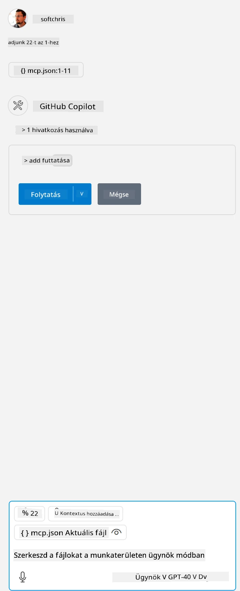

Ez megfelel egy olyan parancs futtatásának, mint például: `node build/index.js`.

- Módosítsd ezt a szerver bejegyzést úgy, hogy megfeleljen annak, hol található a szerver fájlod, vagy annak, ami szükséges a szerver indításához a választott futtatókörnyezet és szerver helye alapján.

## A funkciók használata a szerveren

- Kattints a `play` ikonra, miután hozzáadtad az *mcp.json* fájlt a *./vscode* mappához,

    Figyeld meg, hogy a segédeszköz ikon megváltozik, és megnő az elérhető eszközök száma. A segédeszköz ikon a GitHub Copilot csevegőmezője fölött található.

## Egy eszköz futtatása

- Írj be egy parancsot a csevegőablakba, amely megfelel az eszköz leírásának. Például az `add` eszköz elindításához írj be valami ilyesmit: "add 3 to 20".

    Látnod kell, hogy egy eszköz jelenik meg a csevegő szövegdoboz fölött, amely arra kér, hogy válaszd ki az eszköz futtatását, ahogy az alábbi képen látható:

    

    Az eszköz kiválasztása egy numerikus eredményt kell, hogy adjon, például "23"-at, ha a korábban említett parancsot írtad be.

**Jogi nyilatkozat**:  
Ez a dokumentum az AI fordító szolgáltatás, a [Co-op Translator](https://github.com/Azure/co-op-translator) segítségével készült. Bár a pontosságra törekszünk, kérjük, vegye figyelembe, hogy az automatikus fordítások hibákat vagy pontatlanságokat tartalmazhatnak. Az eredeti dokumentum az anyanyelvén tekintendő hiteles forrásnak. Kritikus információk esetén professzionális emberi fordítást javaslunk. Nem vállalunk felelősséget a fordítás használatából eredő félreértésekért vagy téves értelmezésekért.