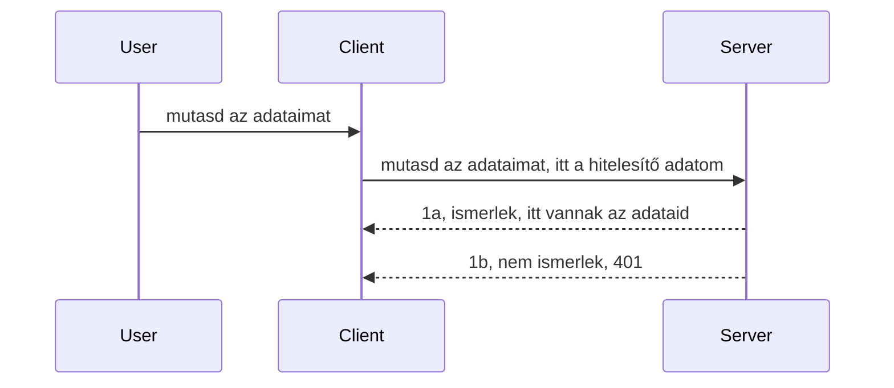

# Egyszerű hitelesítés

Az MCP SDK-k támogatják az OAuth 2.1 használatát, ami - hogy igazságosak legyünk - meglehetősen összetett folyamat, amely olyan fogalmakat is magában foglal, mint a hitelesítő szerver, erőforrás-szerver, hitelesítő adatok elküldése, egy kód megszerzése, a kód kicserélése egy hordozó tokenre, amíg végül el nem érjük az erőforrás adatokat. Ha még nem használtál OAuth-t, ami egy nagyszerű megoldás, érdemes először egy alap szintű hitelesítéssel kezdeni, és onnan fokozatosan egyre jobb és biztonságosabb megoldások felé haladni. Ezért létezik ez a fejezet, hogy felkészítsen a fejlettebb hitelesítésre.

## Hitelesítés, mit is értünk ez alatt?

A hitelesítés rövidítése az authenticáció és az autorizáció. Az elképzelés az, hogy két dolgot kell elvégeznünk:

- **Authentikáció**, ami annak a folyamata, hogy kiderítsük, beengedjük-e az illetőt a házunkba, vagyis megállapítsuk, hogy "itt lehet", vagyis hozzáfér az erőforrás-szerverünkhöz, ahol az MCP Server funkciói működnek.
- **Autorizáció**, ami annak a folyamata, hogy eldöntsük, hogy egy felhasználónak hozzá kell-e férnie a kért specifikus erőforrásokhoz, például ezekhez a rendelésekhez vagy termékekhez, vagy például csak olvashatja a tartalmat, de nem törölheti.

## Hitelesítő adatok: hogyan azonosítjuk magunkat a rendszer felé

A legtöbb webfejlesztő általában úgy gondol a hitelesítésre, hogy valamiféle hitelesítő adatot küld a szervernek, általában egy titkot, amely kijelenti, hogy a felhasználónak joga van ott lenni "Authentikáció". Ez a hitelesítő adat általában egy base64 kódolt felhasználónév és jelszó vagy egy API kulcs, amellyel a felhasználó egyedileg azonosítható.

Ezt általában egy "Authorization" nevű fejlécen keresztül küldik el így:

```json
{ "Authorization": "secret123" }
```

Ezt szokták "basic authentication"-nak hívni. A teljes folyamat az alábbiak szerint működik:


Most, hogy érthető, hogyan működik a folyamat szempontjából, hogyan valósítjuk meg? A legtöbb webkiszolgálónak van egy köztes réteg (middleware) fogalma, egy kódrészlet, amely a kérés feldolgozása során fut, és ellenőrzi a hitelesítő adatokat, és ha ezek érvényesek, engedi tovább a kérést. Ha nem, akkor hitelesítési hibát kapsz. Nézzük, hogyan valósítható meg ez:

**Python**

```python
class AuthMiddleware(BaseHTTPMiddleware):
    async def dispatch(self, request, call_next):

        has_header = request.headers.get("Authorization")
        if not has_header:
            print("-> Missing Authorization header!")
            return Response(status_code=401, content="Unauthorized")

        if not valid_token(has_header):
            print("-> Invalid token!")
            return Response(status_code=403, content="Forbidden")

        print("Valid token, proceeding...")
       
        response = await call_next(request)
        # adj hozzá bármilyen ügyfél fejlécet vagy módosítsd valahogyan a választ
        return response


starlette_app.add_middleware(CustomHeaderMiddleware)
```

Itt:

- Létrehoztunk egy `AuthMiddleware` nevű köztes réteget, amelynek a `dispatch` metódusa fut a webkiszolgáló által.
- Hozzáadtuk a middleware-t a webkiszolgálóhoz:

    ```python
    starlette_app.add_middleware(AuthMiddleware)
    ```

- Megírtuk az érvényesítési logikát, amely ellenőrzi, hogy van-e Authorization fejléc és érvényes-e a küldött titok:

    ```python
    has_header = request.headers.get("Authorization")
    if not has_header:
        print("-> Missing Authorization header!")
        return Response(status_code=401, content="Unauthorized")

    if not valid_token(has_header):
        print("-> Invalid token!")
        return Response(status_code=403, content="Forbidden")
    ```

    ha a titok jelen van és érvényes, akkor engedjük a kérést tovább a `call_next` meghívásával és visszaadjuk a választ.

    ```python
    response = await call_next(request)
    # adj hozzá bármilyen egyedi fejléceket, vagy módosítsd a választ valamilyen módon
    return response
    ```

A működés itt az, hogy amikor egy webkérés érkezik a szerver felé, a middleware fut, és a megvalósítástól függően vagy átengedi a kérést, vagy hibát ad vissza, jelezve, hogy a kliensnek nincs jogosultsága folytatni.

**TypeScript**

Itt Express népszerű keretrendszerrel készítünk egy köztes réteget, amely elkapja a kérést, mielőtt az az MCP Serverhez érkezne. Íme a kód ehhez:

```typescript
function isValid(secret) {
    return secret === "secret123";
}

app.use((req, res, next) => {
    // 1. Authorization fejléc jelen van?
    if(!req.headers["Authorization"]) {
        res.status(401).send('Unauthorized');
    }
    
    let token = req.headers["Authorization"];

    // 2. Érvényesség ellenőrzése.
    if(!isValid(token)) {
        res.status(403).send('Forbidden');
    }

   
    console.log('Middleware executed');
    // 3. Továbbítja a kérést a kérésfeldolgozási lánc következő lépéséhez.
    next();
});
```

Ebben a kódban:

1. Ellenőrizzük, hogy az Authorization fejléc jelen van-e, ha nem, 401 hibát küldünk.
2. Megvizsgáljuk, hogy a hitelesítő adat/token érvényes-e, ha nem, 403 hibát küldünk.
3. Végül átengedjük a kérést a kérés csővezetéken, és visszaadjuk a kért erőforrást.

## Gyakorlat: Hitelesítés megvalósítása

Alkalmazzuk a tudásunkat és próbáljuk ki a megvalósítást. A terv a következő:

Szerver

- Hozz létre egy webszervert és egy MCP példányt.
- Valósíts meg egy köztes réteget (middleware) a szerveren.

Kliens

- Küldj webkérést hitelesítő adattal, a fejlécen keresztül.

### -1- Webszerver és MCP példány létrehozása

Az első lépésünk, hogy létrehozzuk a webszerver példányt és az MCP Servert.

**Python**

Itt létrehozunk egy MCP Server példányt, készítünk egy starlette webalkalmazást és futtatjuk uvicornnal.

```python
# MCP szerver létrehozása

app = FastMCP(
    name="MCP Resource Server",
    instructions="Resource Server that validates tokens via Authorization Server introspection",
    host=settings["host"],
    port=settings["port"],
    debug=True
)

# starlette webalkalmazás létrehozása
starlette_app = app.streamable_http_app()

# alkalmazás kiszolgálása uvicorn segítségével
async def run(starlette_app):
    import uvicorn
    config = uvicorn.Config(
            starlette_app,
            host=app.settings.host,
            port=app.settings.port,
            log_level=app.settings.log_level.lower(),
        )
    server = uvicorn.Server(config)
    await server.serve()

run(starlette_app)
```

Ebben a kódban:

- Létrehozzuk az MCP Servert.
- Építjük a starlette webalkalmazást az MCP Serverből, `app.streamable_http_app()`.
- Futtatjuk és szolgáltatjuk a webalkalmazást uvicornnal `server.serve()`.

**TypeScript**

Itt létrehozunk egy MCP Server példányt.

```typescript
const server = new McpServer({
      name: "example-server",
      version: "1.0.0"
    });

    // ... szerver erőforrások, eszközök és parancsok beállítása ...
```

Az MCP Server létrehozását a POST /mcp útvonal definícióján belül kell végrehajtani, így vegyük át az előző kódot és mozgassuk így:

```typescript
import express from "express";
import { randomUUID } from "node:crypto";
import { McpServer } from "@modelcontextprotocol/sdk/server/mcp.js";
import { StreamableHTTPServerTransport } from "@modelcontextprotocol/sdk/server/streamableHttp.js";
import { isInitializeRequest } from "@modelcontextprotocol/sdk/types.js"

const app = express();
app.use(express.json());

// Térkép a transportok session ID szerint történő tárolására
const transports: { [sessionId: string]: StreamableHTTPServerTransport } = {};

// Kezelje a POST kéréseket kliens-szerver kommunikációhoz
app.post('/mcp', async (req, res) => {
  // Ellenőrizze a meglévő session ID-t
  const sessionId = req.headers['mcp-session-id'] as string | undefined;
  let transport: StreamableHTTPServerTransport;

  if (sessionId && transports[sessionId]) {
    // Újrahasználja a meglévő transportot
    transport = transports[sessionId];
  } else if (!sessionId && isInitializeRequest(req.body)) {
    // Új inicializációs kérés
    transport = new StreamableHTTPServerTransport({
      sessionIdGenerator: () => randomUUID(),
      onsessioninitialized: (sessionId) => {
        // Tárolja a transportot session ID szerint
        transports[sessionId] = transport;
      },
      // A DNS újracímzés elleni védelem alapértelmezés szerint ki van kapcsolva a visszamenőleges kompatibilitás érdekében. Ha ezt a szervert
      // helyileg futtatja, győződjön meg róla, hogy beállítja:
      // enableDnsRebindingProtection: true,
      // allowedHosts: ['127.0.0.1'],
    });

    // Tisztítsa meg a transportot lezáráskor
    transport.onclose = () => {
      if (transport.sessionId) {
        delete transports[transport.sessionId];
      }
    };
    const server = new McpServer({
      name: "example-server",
      version: "1.0.0"
    });

    // ... állítsa be a szerver erőforrásokat, eszközöket és felhívásokat ...

    // Csatlakozás az MCP szerverhez
    await server.connect(transport);
  } else {
    // Érvénytelen kérés
    res.status(400).json({
      jsonrpc: '2.0',
      error: {
        code: -32000,
        message: 'Bad Request: No valid session ID provided',
      },
      id: null,
    });
    return;
  }

  // Kezelje a kérelmet
  await transport.handleRequest(req, res, req.body);
});

// Újrahasználható kezelő a GET és DELETE kérésekhez
const handleSessionRequest = async (req: express.Request, res: express.Response) => {
  const sessionId = req.headers['mcp-session-id'] as string | undefined;
  if (!sessionId || !transports[sessionId]) {
    res.status(400).send('Invalid or missing session ID');
    return;
  }
  
  const transport = transports[sessionId];
  await transport.handleRequest(req, res);
};

// Kezelje a GET kéréseket a szerver-kliens értesítésekhez SSE-n keresztül
app.get('/mcp', handleSessionRequest);

// Kezelje a DELETE kéréseket a session megszüntetéséhez
app.delete('/mcp', handleSessionRequest);

app.listen(3000);
```

Most látható, hogy az MCP Server létrehozása az `app.post("/mcp")`-be került.

Lépjünk a következő lépésre, azaz a middleware létrehozására, hogy ellenőrizhessük a bejövő hitelesítő adatokat.

### -2- Middleware megvalósítása a szerveren

Most jöjjön a middleware rész. Létrehozunk egy köztes réteget, amely megkeresi a hitelesítő adatot az `Authorization` fejlécben és ellenőrzi annak érvényességét. Ha elfogadható, a kérés tovább halad, hogy elvégezze a szükséges feladatot (például eszközök listázása, erőforrás olvasása vagy bármilyen MCP funkció, amit a kliens kér).

**Python**

A middleware létrehozásához készítsünk egy osztályt, amely öröklődik a `BaseHTTPMiddleware`-ből. Két érdekes elem van:

- A kérés `request`, amelyből beolvassuk a fejléc információkat.
- `call_next`, egy visszahívás, amit meg kell hívnunk, ha a kliens hozott elfogadható hitelesítő adatot.

Először kezeljük, ha az `Authorization` fejléc hiányzik:

```python
has_header = request.headers.get("Authorization")

# nincs fejléc, hibázzon 401-gyel, különben lépjen tovább.
if not has_header:
    print("-> Missing Authorization header!")
    return Response(status_code=401, content="Unauthorized")
```

Itt egy 401 nem jogosult üzenetet küldünk, mert a kliens nem sikeresen hitelesített.

Ezután ha megérkezett hitelesítő adat, ellenőrizni kell az érvényességét így:

```python
 if not valid_token(has_header):
    print("-> Invalid token!")
    return Response(status_code=403, content="Forbidden")
```

Látható, hogy itt 403 tiltott üzenetet küldünk. Nézzük a teljes middleware-t, ami mindezt megvalósítja:

```python
class AuthMiddleware(BaseHTTPMiddleware):
    async def dispatch(self, request, call_next):

        has_header = request.headers.get("Authorization")
        if not has_header:
            print("-> Missing Authorization header!")
            return Response(status_code=401, content="Unauthorized")

        if not valid_token(has_header):
            print("-> Invalid token!")
            return Response(status_code=403, content="Forbidden")

        print("Valid token, proceeding...")
        print(f"-> Received {request.method} {request.url}")
        response = await call_next(request)
        response.headers['Custom'] = 'Example'
        return response

```

Nagyszerű, de mi az a `valid_token` függvény? Itt van alább:
:

```python
# NE használd éles környezetben - fejleszd tovább !!
def valid_token(token: str) -> bool:
    # távolítsd el a "Bearer " előtagot
    if token.startswith("Bearer "):
        token = token[7:]
        return token == "secret-token"
    return False
```

Természetesen ez fejlesztésre szorul.

FONTOS: Soha ne tárold az ilyen titkokat kódon belül. Ideális esetben egy adatforrásból vagy egy identitás szolgáltatótól (IDP) kell lekérni az összehasonlításhoz szükséges értéket, vagy még jobb, az IDP végezze a validációt.

**TypeScript**

Express-ben a megvalósításhoz hívni kell a `use` metódust, ami middleware funkciókat fogad.

Meg kell:

- Hozzáférni a kérés objektum `Authorization` tulajdonságához.
- Érvényesíteni a hitelesítő adatot, és ha ez sikeres, továbbengedi a kérést, a kliens MCP kérése végrehajtódik (pl. eszközlistázás, erőforrás olvasása vagy bármilyen MCP funkció).

Itt ellenőrizzük, hogy az `Authorization` fejléc megvan-e, ha nincs, akkor megállítjuk a kérést:

```typescript
if(!req.headers["authorization"]) {
    res.status(401).send('Unauthorized');
    return;
}
```

Ha a fejléc hiányzik, 401-es hibát kapunk.

Ezután ellenőrizzük, hogy a hitelesítő adat érvényes-e, ha nem, újra leállítjuk a kérést, de most másik üzenettel:

```typescript
if(!isValid(token)) {
    res.status(403).send('Forbidden');
    return;
} 
```

Itt 403-as hibát kapsz.

Teljes kód:

```typescript
app.use((req, res, next) => {
    console.log('Request received:', req.method, req.url, req.headers);
    console.log('Headers:', req.headers["authorization"]);
    if(!req.headers["authorization"]) {
        res.status(401).send('Unauthorized');
        return;
    }
    
    let token = req.headers["authorization"];

    if(!isValid(token)) {
        res.status(403).send('Forbidden');
        return;
    }  

    console.log('Middleware executed');
    next();
});
```

Beállítottuk a webszervert, hogy elfogadjon köztes réteget a kliens által elküldött hitelesítő adat ellenőrzésére. Mi a helyzet a klienssel?

### -3- Webkérés elküldése hitelesítő adattal a fejlécen keresztül

Biztosítani kell, hogy a kliens átadja a hitelesítő adatot a fejlécben. Mivel MCP klienst fogunk használni, meg kell néznünk, hogyan kell ezt megtenni.

**Python**

A kliens oldalán a hitelesítő adatot tartalmazó fejlécet így kell átadni:

```python
# NE kódold be mereven az értéket, legalább környezeti változóban vagy biztonságosabb tárolóban legyen
token = "secret-token"

async with streamablehttp_client(
        url = f"http://localhost:{port}/mcp",
        headers = {"Authorization": f"Bearer {token}"}
    ) as (
        read_stream,
        write_stream,
        session_callback,
    ):
        async with ClientSession(
            read_stream,
            write_stream
        ) as session:
            await session.initialize()
      
            # TODO, amit a kliensben el akarsz végeztetni, pl. eszközök listázása, eszközök hívása stb.
```

Látható, hogy a `headers` objektumot így töltjük fel: `headers = {"Authorization": f"Bearer {token}"}`.

**TypeScript**

Ezt két lépésben oldhatjuk meg:

1. Létrehozunk egy konfigurációs objektumot a hitelesítő adatunkkal.
2. Átadjuk ezt a konfigurációs objektumot a transzportnak.

```typescript

// NE kódolj be mereven értéket, mint itt látható. Legalább legyen környezeti változóként, és használj valami olyat, mint a dotenv (fejlesztési módban).
let token = "secret123"

// határozz meg egy kliens szállítási opció objektumot
let options: StreamableHTTPClientTransportOptions = {
  sessionId: sessionId,
  requestInit: {
    headers: {
      "Authorization": "secret123"
    }
  }
};

// add át az opciók objektumot a szállításnak
async function main() {
   const transport = new StreamableHTTPClientTransport(
      new URL(serverUrl),
      options
   );
```

Itt látható, hogy létre kellett hoznunk egy `options` objektumot, melyben a fejléceket a `requestInit` alatt adtuk meg.

FONTOS: Hogyan lehet ezt tovább javítani? A jelenlegi megvalósításnak vannak problémái. Először is, a hitelesítő adat egyszerű átvitele kockázatos, hacsak nem használunk legalább HTTPS-t. Még akkor is, a hitelesítő adat ellopható, ezért kell egy olyan rendszer, ahol könnyen visszavonhatjuk a tokent, és további ellenőrzéseket adhatunk hozzá, például hogy honnan érkezik a kérés, túl gyakran történik-e (bot-szerű viselkedés), tehát számos aggály van.

Ugyanakkor azt kell mondani, hogy nagyon egyszerű API-knál, ahol nem szeretnéd, hogy bárki azonosítás nélkül hívja az API-t, ez jó kezdet.

A fentiek tudatában próbáljuk meg megerősíteni a biztonságot egy szabványos formátum, a JSON Web Token (JWT) használatával.

## JSON Web Tokenek, JWT

Tehát, próbáljuk javítani az egyszerű hitelesítő adatok használatát. Milyen azonnali előnyöket kapunk JWT használatával?

- **Biztonsági fejlesztések**. Basic auth-nál a felhasználónevet és jelszót base64 kódolt tokenként (vagy API kulcsként) ismételten elküldjük, ami növeli a kockázatot. JWT-nél a felhasználónév és jelszó alapján kapsz egy tokent, ami időben korlátozott, vagyis lejár. A JWT lehetővé teszi a finomhangolt hozzáférés szabályozását szerepek, scope-ok és jogosultságok szerint.
- **Állapotmentesség és skálázhatóság**. A JWT önmagában tárolja az összes felhasználói információt, így nincs szükség szerver oldali munkamenet tárolására. A tokent helyben is validálhatjuk.
- **Interoperabilitás és federáció**. A JWT az Open ID Connect alapja, és ismert identitás szolgáltatókkal használatos, például Entra ID, Google Identity vagy Auth0. Lehetővé teszi az egységes bejelentkezést (SSO) és egyéb vállalati szintű funkciókat.
- **Modularitás és rugalmasság**. A JWT használható API átjárókkal, mint Azure API Management, NGINX, és támogatja a felhasználói hitelesítési forgatókönyveket, szerver-szerver közötti kommunikációt, beleértve a személyesítést és delegálást.
- **Teljesítmény és gyorsítótárazás**. A JWT-k dekódolás után gyorsítótárazhatók, ami csökkenti az elemzési igényt. Ez különösen hasznos nagy forgalmú alkalmazásoknál, mivel növeli az áteresztőképességet és csökkenti az infrastruktúra terhelését.
- **Fejlett funkciók**. Támogatja az introspekciót (szerver oldali validálás) és a visszavonást (a token érvénytelenítése).

Ezekkel a előnyökkel nézzük meg, hogyan léphetünk a következő szintre a megvalósításunkban.

## Hogyan alakítsuk át az alap hitelesítést JWT-vé

A fő változások a következők:

- **JWT token konstrukció megtanulása**, amely előkészíti a kliens és szerver közötti kommunikációhoz.
- **JWT token validálása**, és ha érvényes, akkor hozzáférést adni az erőforrásokhoz.
- **Biztonságos token tárolás**. Hogyan tároljuk ezt a tokent.
- **Útvonalak védelme**. Meg kell védenünk az útvonalakat, esetünkben az MCP specifikus útvonalakat és funkciókat.
- **Frissítő tokenek hozzáadása**. Biztosítani kell, hogy rövid életű tokeneket létrehozzunk, és hosszú életű frissítő tokeneket, amelyekkel új tokeneket szerezhetünk, ha az eredeti lejár. Emellett legyen frissítő végpont és forgatási stratégia.

### -1- JWT token konstrukció

Elsőként a JWT token a következő részekből áll:

- **fejléc**, amely az algoritmust és a token típust tartalmazza.
- **hasznos teher (payload)**, amely állítmányokat tartalmaz, például sub (a felhasználó vagy entitás, amit a token képvisel – hitelesítési esetben tipikusan a felhasználói azonosító), exp (lejárat időpontja), role (szerepkör)
- **aláírás**, amely egy titokkal vagy privát kulccsal van aláírva.

Ehhez kell építenünk a fejlécet, a hasznos terhet és az enkódolt tokent.

**Python**

```python

import jwt
import jwt
from jwt.exceptions import ExpiredSignatureError, InvalidTokenError
import datetime

# Titkos kulcs a JWT aláírásához
secret_key = 'your-secret-key'

header = {
    "alg": "HS256",
    "typ": "JWT"
}

# a felhasználói információ és annak állításai és lejárati ideje
payload = {
    "sub": "1234567890",               # Tárgy (felhasználói azonosító)
    "name": "User Userson",                # Egyéni állítás
    "admin": True,                     # Egyéni állítás
    "iat": datetime.datetime.utcnow(),# Kibocsátás ideje
    "exp": datetime.datetime.utcnow() + datetime.timedelta(hours=1)  # Lejárat
}

# kódolás
encoded_jwt = jwt.encode(payload, secret_key, algorithm="HS256", headers=header)
```

Ebben a kódban:

- Meghatározunk egy fejlécet, amely HS256 algoritmust és JWT típust használ.
- Felépítjük a payloadot, amely tartalmazza az alanyt vagy felhasználói azonosítót, felhasználónevet, szerepkört, mikor adták ki és mikor jár le, így megvalósítva az időbeli korlátozottságot.

**TypeScript**

Ehhez néhány függőségre lesz szükségünk, amelyek segítenek a JWT token létrehozásában.

Függőségek

```sh

npm install jsonwebtoken
npm install --save-dev @types/jsonwebtoken
```

Most, hogy ez megvan, hozzuk létre a fejlécet és a payloadot, és azon keresztül az enkódolt tokent.

```typescript
import jwt from 'jsonwebtoken';

const secretKey = 'your-secret-key'; // Használj környezeti változókat éles környezetben

// Definiáld a hasznos terhet
const payload = {
  sub: '1234567890',
  name: 'User usersson',
  admin: true,
  iat: Math.floor(Date.now() / 1000), // Kiállítás időpontja
  exp: Math.floor(Date.now() / 1000) + 60 * 60 // 1 órán belül lejár
};

// Határozd meg a fejlécet (opcionális, a jsonwebtoken alapértelmezéseket állít be)
const header = {
  alg: 'HS256',
  typ: 'JWT'
};

// Hozd létre a tokent
const token = jwt.sign(payload, secretKey, {
  algorithm: 'HS256',
  header: header
});

console.log('JWT:', token);
```

Ez a token:

HS256-tal van aláírva,
1 óráig érvényes,
Tartalmazza a következő állítmányokat: sub, name, admin, iat és exp.

### -2- Token validálása

Egy token érvényességét is ellenőriznünk kell, ezt a szerveren kell megtenni, hogy biztosak legyünk benne, amit a kliens küld, az valóban érvényes. Számos ellenőrzést kell elvégeznünk, például a token szerkezetét és érvényességét. Javasolt további ellenőrzéseket is végezni, például azt, hogy a felhasználó létezik-e a rendszerünkben, és így tovább.

A token validálásához dekódolni kell, hogy el tudjuk olvasni és ellenőrizni az érvényességét:

**Python**

```python

# Kódold vissza és ellenőrizd a JWT-t
try:
    decoded = jwt.decode(token, secret_key, algorithms=["HS256"])
    print("✅ Token is valid.")
    print("Decoded claims:")
    for key, value in decoded.items():
        print(f"  {key}: {value}")
except ExpiredSignatureError:
    print("❌ Token has expired.")
except InvalidTokenError as e:
    print(f"❌ Invalid token: {e}")

```

Ebben a kódban a `jwt.decode`-et hívjuk meg a tokennel, titkos kulccsal és az algoritmussal. Figyeld meg, hogy try-catch szerkezetet használunk, mert sikertelen validáció esetén kivétel keletkezik.

**TypeScript**

Itt a `jwt.verify`-t kell hívnunk, hogy megkapjuk a token dekódolt változatát, amit tovább elemzhetünk. Ha ez a hívás meghiúsul, az jelenti, hogy a token szerkezete hibás vagy nem érvényes.

```typescript

try {
  const decoded = jwt.verify(token, secretKey);
  console.log('Decoded Payload:', decoded);
} catch (err) {
  console.error('Token verification failed:', err);
}
```

MEGJEGYZÉS: ahogy korábban említettük, érdemes további ellenőrzéseket végezni annak biztosítására, hogy a token egy valós felhasználót azonosít a rendszerünkben, és hogy a felhasználónak a megfelelő jogosultságai vannak.
Ezután nézzük meg a szerepalapú hozzáférés-ellenőrzést, más néven RBAC-ot.

## Szerepalapú hozzáférés-ellenőrzés hozzáadása

Az ötlet az, hogy ki akarjuk fejezni, hogy a különböző szerepek különböző jogosultságokkal rendelkeznek. Például feltételezzük, hogy egy adminisztrátor mindent megtehet, a normál felhasználók írhatnak/olvashatnak, a vendégek pedig csak olvashatnak. Ezért itt van néhány lehetséges jogosultsági szint:

- Admin.Write  
- User.Read  
- Guest.Read  

Nézzük meg, hogyan valósíthatunk meg ilyen szabályozást middleware-rel. A middleware-eket hozzáadhatjuk útvonalanként, valamint az összes útvonalhoz is.

**Python**

```python
from starlette.middleware.base import BaseHTTPMiddleware
from starlette.responses import JSONResponse
import jwt

# NE legyen a titok a kódban, ez csak bemutató célokra szolgál. Olvasd be biztonságos helyről.
SECRET_KEY = "your-secret-key" # tedd környezeti változóba
REQUIRED_PERMISSION = "User.Read"

class JWTPermissionMiddleware(BaseHTTPMiddleware):
    async def dispatch(self, request, call_next):
        auth_header = request.headers.get("Authorization")
        if not auth_header or not auth_header.startswith("Bearer "):
            return JSONResponse({"error": "Missing or invalid Authorization header"}, status_code=401)

        token = auth_header.split(" ")[1]
        try:
            decoded = jwt.decode(token, SECRET_KEY, algorithms=["HS256"])
        except jwt.ExpiredSignatureError:
            return JSONResponse({"error": "Token expired"}, status_code=401)
        except jwt.InvalidTokenError:
            return JSONResponse({"error": "Invalid token"}, status_code=401)

        permissions = decoded.get("permissions", [])
        if REQUIRED_PERMISSION not in permissions:
            return JSONResponse({"error": "Permission denied"}, status_code=403)

        request.state.user = decoded
        return await call_next(request)


```
  
Van néhány különböző módja annak, hogy hozzáadjuk a middleware-t, az alábbiak szerint:

```python

# 1. lehetőség: köztes szoftver hozzáadása a starlette alkalmazás építése közben
middleware = [
    Middleware(JWTPermissionMiddleware)
]

app = Starlette(routes=routes, middleware=middleware)

# 2. lehetőség: köztes szoftver hozzáadása a starlette alkalmazás már megépült után
starlette_app.add_middleware(JWTPermissionMiddleware)

# 3. lehetőség: köztes szoftver hozzáadása útvonalanként
routes = [
    Route(
        "/mcp",
        endpoint=..., # kezelő
        middleware=[Middleware(JWTPermissionMiddleware)]
    )
]
```
  
**TypeScript**

Használhatjuk az `app.use`-t és egy middleware-t, amely minden kérésnél lefut.

```typescript
app.use((req, res, next) => {
    console.log('Request received:', req.method, req.url, req.headers);
    console.log('Headers:', req.headers["authorization"]);

    // 1. Ellenőrizze, hogy az engedélyezési fejléc elküldésre került-e

    if(!req.headers["authorization"]) {
        res.status(401).send('Unauthorized');
        return;
    }
    
    let token = req.headers["authorization"];

    // 2. Ellenőrizze, hogy a token érvényes-e
    if(!isValid(token)) {
        res.status(403).send('Forbidden');
        return;
    }  

    // 3. Ellenőrizze, hogy a tokenhez tartozó felhasználó létezik-e a rendszerünkben
    if(!isExistingUser(token)) {
        res.status(403).send('Forbidden');
        console.log("User does not exist");
        return;
    }
    console.log("User exists");

    // 4. Ellenőrizze, hogy a token megfelelő jogosultságokkal rendelkezik-e
    if(!hasScopes(token, ["User.Read"])){
        res.status(403).send('Forbidden - insufficient scopes');
    }

    console.log("User has required scopes");

    console.log('Middleware executed');
    next();
});

```
  
Elég sok dolgot bízhatunk a middleware-re, és amit a middleware-nek KELL csinálnia, nevezetesen:

1. Ellenőrizze, hogy az autorizációs fejléc jelen van-e  
2. Ellenőrizze, hogy a token érvényes-e, meghívjuk az `isValid` metódust, amelyet mi írtunk, hogy ellenőrizze a JWT token integritását és érvényességét.  
3. Ellenőrizze, hogy a felhasználó létezik-e a rendszerünkben, ezt meg kell tennünk.

   ```typescript
    // felhasználók az adatbázisban
   const users = [
     "user1",
     "User usersson",
   ]

   function isExistingUser(token) {
     let decodedToken = verifyToken(token);

     // TEENDŐ, ellenőrizze, hogy létezik-e a felhasználó az adatbázisban
     return users.includes(decodedToken?.name || "");
   }
   ```
  
Fent egy nagyon egyszerű `users` listát hoztunk létre, amelynek nyilvánvalóan adatbázisban kellene lennie.

4. Ezen felül azt is ellenőriznünk kell, hogy a token rendelkezik-e a megfelelő jogosultságokkal.

   ```typescript
   if(!hasScopes(token, ["User.Read"])){
        res.status(403).send('Forbidden - insufficient scopes');
   }
   ```
  
A fenti middleware kódban azt ellenőrizzük, hogy a token tartalmazza-e a User.Read jogosultságot, ha nem, 403-as hibát küldünk. Lent van a `hasScopes` segédfüggvény.

   ```typescript
   function hasScopes(scope: string, requiredScopes: string[]) {
     let decodedToken = verifyToken(scope);
    return requiredScopes.every(scope => decodedToken?.scopes.includes(scope));
  }  
   ```

Have a think which additional checks you should be doing, but these are the absolute minimum of checks you should be doing.

Using Express as a web framework is a common choice. There are helpers library when you use JWT so you can write less code.

- `express-jwt`, helper library that provides a middleware that helps decode your token.
- `express-jwt-permissions`, this provides a middleware `guard` that helps check if a certain permission is on the token.

Here's what these libraries can look like when used:

```typescript
const express = require('express');
const jwt = require('express-jwt');
const guard = require('express-jwt-permissions')();

const app = express();
const secretKey = 'your-secret-key'; // put this in env variable

// Decode JWT and attach to req.user
app.use(jwt({ secret: secretKey, algorithms: ['HS256'] }));

// Check for User.Read permission
app.use(guard.check('User.Read'));

// multiple permissions
// app.use(guard.check(['User.Read', 'Admin.Access']));

app.get('/protected', (req, res) => {
  res.json({ message: `Welcome ${req.user.name}` });
});

// Error handler
app.use((err, req, res, next) => {
  if (err.code === 'permission_denied') {
    return res.status(403).send('Forbidden');
  }
  next(err);
});

```
  
Most már láttad, hogyan használható a middleware hitelesítésre és jogosultságkezelésre is, de mi a helyzet az MCP-vel, változtat-e a hitelesítési módon? Nézzük meg a következő részben.

### -3- RBAC hozzáadása az MCP-hez

Eddig láttad, hogyan adhatsz hozzá RBAC-ot middleware segítségével, azonban MCP esetén nincs könnyű mód, hogy funkciónkénti RBAC-ot adj hozzá, szóval mit tegyünk? Nos, egyszerűen csak kell egy ilyen kód, ami ebben az esetben ellenőrzi, hogy az ügyfélnek joga van-e meghívni egy adott eszközt:

Több lehetőséged is van, hogyan valósítsd meg a funkciónkénti RBAC-ot, íme néhány:

- Adj hozzá ellenőrzést minden eszközhöz, erőforráshoz, prompthoz, ahol ellenőrizned kell a jogosultsági szintet.

   **python**

   ```python
   @tool()
   def delete_product(id: int):
      try:
          check_permissions(role="Admin.Write", request)
      catch:
        pass # a kliens hitelesítése sikertelen, hitelesítési hibát dobjon
   ```
  
   **typescript**

   ```typescript
   server.registerTool(
    "delete-product",
    {
      title: Delete a product",
      description: "Deletes a product",
      inputSchema: { id: z.number() }
    },
    async ({ id }) => {
      
      try {
        checkPermissions("Admin.Write", request);
        // teendő, küldd el az azonosítót a productService-nek és a remote entry-nek
      } catch(Exception e) {
        console.log("Authorization error, you're not allowed");  
      }

      return {
        content: [{ type: "text", text: `Deletected product with id ${id}` }]
      };
    }
   );
   ```
  

- Használj fejlettebb szerver-oldali megközelítést és kéréskezelőket, így minimalizálhatod azokat a helyeket, ahol az ellenőrzést el kell végezni.

   **Python**

   ```python
   
   tool_permission = {
      "create_product": ["User.Write", "Admin.Write"],
      "delete_product": ["Admin.Write"]
   }

   def has_permission(user_permissions, required_permissions) -> bool:
      # user_permissions: a felhasználó által birtokolt jogosultságok listája
      # required_permissions: az eszközhöz szükséges jogosultságok listája
      return any(perm in user_permissions for perm in required_permissions)

   @server.call_tool()
   async def handle_call_tool(
     name: str, arguments: dict[str, str] | None
   ) -> list[types.TextContent]:
    # Tegyük fel, hogy a request.user.permissions a felhasználó jogosultságainak listája
     user_permissions = request.user.permissions
     required_permissions = tool_permission.get(name, [])
     if not has_permission(user_permissions, required_permissions):
        # Dobjon hibát "Nincs jogosultságod a(z) {name} eszköz hívásához"
        raise Exception(f"You don't have permission to call tool {name}")
     # folytassa és hívja meg az eszközt
     # ...
   ```   
      

   **TypeScript**

   ```typescript
   function hasPermission(userPermissions: string[], requiredPermissions: string[]): boolean {
       if (!Array.isArray(userPermissions) || !Array.isArray(requiredPermissions)) return false;
       // Igaz értéket ad vissza, ha a felhasználónak van legalább egy szükséges jogosultsága
       
       return requiredPermissions.some(perm => userPermissions.includes(perm));
   }
  
   server.setRequestHandler(CallToolRequestSchema, async (request) => {
      const { params: { name } } = request;
  
      let permissions = request.user.permissions;
  
      if (!hasPermission(permissions, toolPermissions[name])) {
         return new Error(`You don't have permission to call ${name}`);
      }
  
      // folytasd..
   });
   ```
  
   Megjegyzés: gondoskodnod kell arról, hogy a middleware hozzárendelje a dekódolt tokent a kérés `user` tulajdonságához, így az előző kód egyszerűbb lesz.

### Összefoglalás

Most, hogy megbeszéltük, hogyan lehet hozzáadni RBAC támogatást általánosan és kifejezetten MCP-hez, itt az ideje, hogy saját magad próbálj meg biztonságot megvalósítani, hogy megértsd az eléd tett koncepciókat.

## Feladat 1: Építs egy mcp szervert és mcp ügyfelet alapvető hitelesítéssel

Itt azt alkalmazod, amit tanultál a hitelesítő adatok fejlécen keresztüli küldéséről.

## Megoldás 1

[Solution 1](./code/basic/README.md)

## Feladat 2: Frissítsd az 1. feladat megoldását JWT használatára

Vedd az első megoldást, de ezúttal javítsuk tovább!

Basic Auth helyett használjuk a JWT-t.

## Megoldás 2

[Solution 2](./solution/jwt-solution/README.md)

## Kihívás

Add hozzá az eszközönkénti RBAC-ot, amit a "RBAC hozzáadása az MCP-hez" szakaszban ismertettünk.

## Összefoglaló

Remélhetőleg sokat tanultál ebben a fejezetben a semmilyen biztonságtól, az alapvető biztonságon át a JWT-ig és annak MCP-be való integrációjáig.

Egy szilárd alapot építettünk egyedi JWT-kkel, de ahogy növekszünk, egy szabványos identitásmodellt alkalmazunk. Egy IdP, mint az Entra vagy a Keycloak bevezetése lehetővé teszi, hogy a token kibocsátását, érvényesítését és életciklus-kezelését egy megbízható platformra bízzuk — így minket az alkalmazás logikája és a felhasználói élmény érdekelhet.

Ehhez van egy [fejlettebb fejezetünk az Entráról](../../05-AdvancedTopics/mcp-security-entra/README.md).

## Mi következik

- Következő: [MCP hosztok beállítása](../12-mcp-hosts/README.md)

---

<!-- CO-OP TRANSLATOR DISCLAIMER START -->
**Jogi nyilatkozat**:
Ez a dokumentum az AI fordító szolgáltatás, a [Co-op Translator](https://github.com/Azure/co-op-translator) segítségével készült. Bár pontosságra törekszünk, kérjük, vegye figyelembe, hogy az automatikus fordítások hibákat vagy pontatlanságokat tartalmazhatnak. Az eredeti dokumentum, annak anyanyelvén tekintendő hivatalos forrásnak. Fontos információk esetén profi, emberi fordítást javaslunk. Nem vállalunk felelősséget az ebből eredő félreértésekért vagy téves értelmezésekért.
<!-- CO-OP TRANSLATOR DISCLAIMER END -->