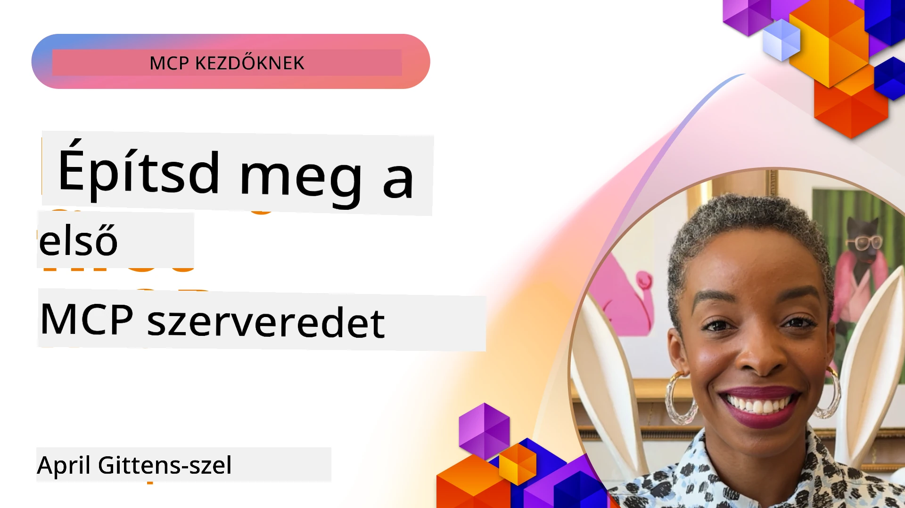

## Első lépések  

_(Kattints a fenti képre a lecke videójának megtekintéséhez)_

Ez a szakasz több leckéből áll:

- **1 Az első szervered**, ebben az első leckében megtanulod, hogyan készítsd el az első szervered, és hogyan vizsgáld meg az inspector eszközzel, amely értékes mód a szerver tesztelésére és hibakeresésére, [a leckéhez](01-first-server/README.md)

- **2 Kliens**, ebben a leckében megtanulod, hogyan írj klienst, amely csatlakozni tud a szerveredhez, [a leckéhez](02-client/README.md)

- **3 Kliens LLM-mel**, egy még jobb módja a kliens írásának, ha LLM-et adsz hozzá, így „tárgyalhat” a szervereddel arról, mit tegyen, [a leckéhez](03-llm-client/README.md)

- **4 Egy szerver GitHub Copilot Agent módban Visual Studio Code-ban**. Itt megvizsgáljuk, hogyan futtathatjuk MCP szerverünket közvetlenül a Visual Studio Code-ból, [a leckéhez](04-vscode/README.md)

- **5 stdio Transport Server**, az stdio transzport az ajánlott szabvány a lokális MCP szerver-kliens kommunikációra, biztonságos alfolyamat alapú kommunikációt és beépített folyamat izolációt biztosítva [a leckéhez](05-stdio-server/README.md)

- **6 HTTP Streaming MCP-vel (Streamable HTTP)**. Ismerd meg a modern HTTP streaming transzportot (az ajánlott megközelítés távoli MCP szerverekhez a [MCP Specifikáció 2025-11-25](https://spec.modelcontextprotocol.io/specification/2025-11-25/basic/transports/#streamable-http) szerint), az előrehaladási értesítéseket, valamint hogyan lehet megvalósítani skálázható, valós idejű MCP szervereket és klienseket Streamable HTTP használatával. [a leckéhez](06-http-streaming/README.md)

- **7 AI Eszközkészlet használata VSCode-hoz**, hogy fogyaszd és teszteld MCP kliens és szerver megvalósításaidat [a leckéhez](07-aitk/README.md)

- **8 Tesztelés**, itt különösen arra fókuszálunk, hogyan tudjuk különböző módokon tesztelni a szerverünket és kliensünket, [a leckéhez](08-testing/README.md)

- **9 Telepítés**, ez a fejezet különböző telepítési módokat tekint át MCP megoldásaid számára, [a leckéhez](09-deployment/README.md)

- **10 Haladó szerverhasználat**, ez a fejezet a haladó szerverhasználatról szól, [a leckéhez](./10-advanced/README.md)

- **11 Hitelesítés**, ez a fejezet egyszerű hitelesítés hozzáadását coverálja, az alap Hitelesítéstől a JWT és RBAC használatáig. Javasolt itt kezdeni, majd megnézni a Haladó témákat az 5. fejezetben, és további biztonsági megerősítéseket végezni a 2. fejezet javaslatai alapján, [a leckéhez](./11-simple-auth/README.md)

- **12 MCP Hostok**, népszerű MCP host kliensek konfigurálása és használata, beleértve Claude Desktopot, Cursort, Cline-t és Windsurföt. Ismerd meg a transzport típusokat és hibakeresést, [a leckéhez](./12-mcp-hosts/README.md)

- **13 MCP Inspector**, interaktív hibakeresés és tesztelés MCP szervereken az MCP Inspector eszköz segítségével. Ismerd meg a hibakereső eszközöket, erőforrásokat és protokoll üzeneteket, [a leckéhez](./13-mcp-inspector/README.md)

A Model Context Protocol (MCP) egy nyílt protokoll, amely szabványosítja, hogyan biztosítsanak az alkalmazások kontextust az LLM-ek számára. Gondolj az MCP-re úgy, mint az AI alkalmazások USB-C portjára - szabványos módot ad AI modellek különböző adatforrásokhoz és eszközökhöz való csatlakoztatásához.

## Tanulási célok

A lecke végére képes leszel:

- MCP fejlesztő környezetek beállítása C#, Java, Python, TypeScript és JavaScript nyelveken
- Alap MCP szerverek építése egyedi funkciókkal (erőforrások, promptok, eszközök) és telepítésük
- Host alkalmazások létrehozása, amelyek csatlakoznak MCP szerverekhez
- MCP implementációk tesztelése és hibakeresése
- A gyakori beállítási kihívások és megoldásaik megértése
- MCP megvalósítások csatlakoztatása népszerű LLM szolgáltatásokhoz

## Környezeted beállítása MCP-hez

Mielőtt elkezdenél MCP-vel dolgozni, fontos előkészíteni a fejlesztői környezetet és megérteni az alapvető munkafolyamatot. Ez a szakasz végigvezet az első beállítási lépéseken, hogy gördülékeny legyen az indulás MCP-vel.

### Előfeltételek

Mielőtt belevágnál az MCP fejlesztésbe, győződj meg arról, hogy rendelkezel:

- **Fejlesztői környezet**: a választott nyelvhez (C#, Java, Python, TypeScript vagy JavaScript)
- **IDE/Szerkesztő**: Visual Studio, Visual Studio Code, IntelliJ, Eclipse, PyCharm vagy bármely modern kódszerkesztő
- **Csomagkezelők**: NuGet, Maven/Gradle, pip vagy npm/yarn
- **API kulcsok**: bármely AI szolgáltatáshoz, amelyeket host alkalmazásaidban tervezel használni

### Hivatalos SDK-k

A következő fejezetekben Python, TypeScript, Java és .NET megoldásokat fogsz látni. Itt vannak az összes hivatalosan támogatott SDK-k.

Az MCP hivatalos SDK-kat kínál több nyelven (összhangban a [MCP Specifikáció 2025-11-25](https://spec.modelcontextprotocol.io/specification/2025-11-25/) dokumentummal):
- [C# SDK](https://github.com/modelcontextprotocol/csharp-sdk) - Microsoft együttműködéssel karbantartva
- [Java SDK](https://github.com/modelcontextprotocol/java-sdk) - Spring AI együttműködéssel karbantartva
- [TypeScript SDK](https://github.com/modelcontextprotocol/typescript-sdk) - Hivatalos TypeScript megvalósítás
- [Python SDK](https://github.com/modelcontextprotocol/python-sdk) - Hivatalos Python megvalósítás (FastMCP)
- [Kotlin SDK](https://github.com/modelcontextprotocol/kotlin-sdk) - Hivatalos Kotlin megvalósítás
- [Swift SDK](https://github.com/modelcontextprotocol/swift-sdk) - Loopwork AI-val együttműködésben karbantartva
- [Rust SDK](https://github.com/modelcontextprotocol/rust-sdk) - Hivatalos Rust megvalósítás
- [Go SDK](https://github.com/modelcontextprotocol/go-sdk) - Hivatalos Go megvalósítás

## Fontos tudnivalók

- Az MCP fejlesztői környezet beállítása egyszerű a nyelvspecifikus SDK-k használatával
- MCP szerverek építése eszközök létrehozását és regisztrációját jelenti világos sémákkal
- MCP kliensek kapcsolódnak szerverekhez és modellekhez, hogy kiterjesztett képességeket használjanak ki
- A tesztelés és hibakeresés elengedhetetlen a megbízható MCP implementációkhoz
- A telepítési lehetőségek a helyi fejlesztéstől a felhő alapú megoldásokig terjednek

## Gyakorlás

Van egy mintagyűjteményünk, amely kiegészíti az elméletet minden fejezetben ezen a szakaszon belül. Emellett minden fejezetnek megvannak a saját gyakorlatai és feladatai is.

- [Java számológép](./samples/java/calculator/README.md)
- [.Net számológép](../../../03-GettingStarted/samples/csharp)
- [JavaScript számológép](./samples/javascript/README.md)
- [TypeScript számológép](./samples/typescript/README.md)
- [Python számológép](../../../03-GettingStarted/samples/python)

## További források

- [Ügynökök építése Model Context Protocol segítségével Azure-on](https://learn.microsoft.com/azure/developer/ai/intro-agents-mcp)
- [Távoli MCP Azure Container Apps használatával (Node.js/TypeScript/JavaScript)](https://learn.microsoft.com/samples/azure-samples/mcp-container-ts/mcp-container-ts/)
- [.NET OpenAI MCP ügynök](https://learn.microsoft.com/samples/azure-samples/openai-mcp-agent-dotnet/openai-mcp-agent-dotnet/)

## Mi következik

Kezdd az első leckével: [Az első MCP szerver létrehozása](01-first-server/README.md)

Ha befejezted ezt a modult, folytasd: [4. modul: Gyakorlati megvalósítás](../04-PracticalImplementation/README.md)

---

<!-- CO-OP TRANSLATOR DISCLAIMER START -->
**Kizáró nyilatkozat**:
Ezt a dokumentumot az AI fordító szolgáltatás, a [Co-op Translator](https://github.com/Azure/co-op-translator) segítségével fordítottuk le. Bár igyekszünk pontosak lenni, kérjük, vegye figyelembe, hogy az automatikus fordítások hibákat vagy pontatlanságokat tartalmazhatnak. Az eredeti, anyanyelvű dokumentum tekintendő hiteles forrásnak. Fontos információk esetén szakmai, emberi fordítást javaslunk. Nem vállalunk felelősséget a fordítás használatából eredő félreértésekért vagy hibás értelmezésekért.
<!-- CO-OP TRANSLATOR DISCLAIMER END -->