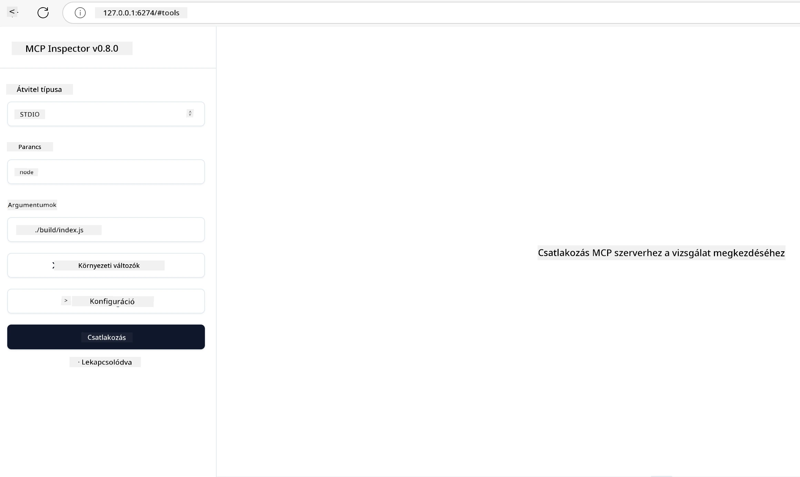

# Gyakorlati megvalósítás

[](https://youtu.be/vCN9-mKBDfQ)

_(Kattints a fenti képre a tanóra videójának megtekintéséhez)_

A gyakorlati megvalósítás az a pont, ahol a Model Context Protocol (MCP) ereje kézzelfoghatóvá válik. Bár az MCP mögötti elmélet és architektúra megértése fontos, az igazi érték akkor mutatkozik meg, amikor ezeket a fogalmakat alkalmazod megoldások építésére, tesztelésére és telepítésére, amelyek valós problémákat oldanak meg. Ez a fejezet áthidalja a fogalmi tudás és a gyakorlati fejlesztés közötti szakadékot, és végigvezet a MCP-alapú alkalmazások életre keltésének folyamatán.

Akár intelligens asszisztenseket fejlesztesz, AI-t integrálsz üzleti munkafolyamatokba, vagy egyedi eszközöket építesz adatfeldolgozáshoz, az MCP rugalmas alapot biztosít. Nyelvfüggetlen kialakítása és a népszerű programozási nyelvekhez kínált hivatalos SDK-k széles fejlesztői kör számára teszik elérhetővé. Ezeket az SDK-kat kihasználva gyorsan prototípust készíthetsz, iterálhatsz és skálázhatod megoldásaidat különböző platformokon és környezetekben.

A következő szakaszokban gyakorlati példákat, mintakódokat és telepítési stratégiákat találsz, amelyek bemutatják, hogyan valósítható meg az MCP C#, Java Spring, TypeScript, JavaScript és Python nyelveken. Megtanulod továbbá, hogyan hibakeresd és teszteld MCP szervereidet, kezelj API-kat, és hogyan telepíts megoldásokat a felhőbe Azure használatával. Ezek a gyakorlati források gyorsítják a tanulást és segítenek magabiztosan építeni megbízható, éles MCP alkalmazásokat.

## Áttekintés

Ez a tanóra az MCP gyakorlati megvalósítására fókuszál több programozási nyelven keresztül. Megvizsgáljuk, hogyan használhatók az MCP SDK-k C#, Java Spring, TypeScript, JavaScript és Python nyelveken stabil alkalmazások építésére, MCP szerverek hibakeresésére és tesztelésére, valamint újrahasznosítható erőforrások, promptok és eszközök létrehozására.

## Tanulási célok

A tanóra végére képes leszel:

- MCP megoldások megvalósítása hivatalos SDK-k használatával különböző programozási nyelveken
- MCP szerverek szisztematikus hibakeresése és tesztelése
- Szerverfunkciók (Erőforrások, Promptok és Eszközök) létrehozása és használata
- Hatékony MCP munkafolyamatok tervezése összetett feladatokhoz
- MCP megvalósítások optimalizálása teljesítmény és megbízhatóság szempontjából

## Hivatalos SDK források

A Model Context Protocol hivatalos SDK-kat kínál több nyelvhez (összhangban a [MCP 2025-11-25 specifikációval](https://spec.modelcontextprotocol.io/specification/2025-11-25/)):

- [C# SDK](https://github.com/modelcontextprotocol/csharp-sdk)
- [Java Spring SDK](https://github.com/modelcontextprotocol/java-sdk) **Megjegyzés:** szükséges a [Project Reactor](https://projectreactor.io) függőség. (Lásd a [246-os vitát](https://github.com/orgs/modelcontextprotocol/discussions/246).)
- [TypeScript SDK](https://github.com/modelcontextprotocol/typescript-sdk)
- [Python SDK](https://github.com/modelcontextprotocol/python-sdk)
- [Kotlin SDK](https://github.com/modelcontextprotocol/kotlin-sdk)
- [Go SDK](https://github.com/modelcontextprotocol/go-sdk)

## MCP SDK-k használata

Ez a szakasz gyakorlati példákat mutat be az MCP több programozási nyelven való megvalósítására. A `samples` könyvtárban találhatók mintakódok nyelvenként rendezve.

### Elérhető minták

A tárház a következő nyelveken tartalmaz [példamegvalósításokat](../../../04-PracticalImplementation/samples):

- [C#](./samples/csharp/README.md)
- [Java Spring](./samples/java/containerapp/README.md)
- [TypeScript](./samples/typescript/README.md)
- [JavaScript](./samples/javascript/README.md)
- [Python](./samples/python/README.md)

Minden minta bemutatja a kulcsfontosságú MCP koncepciókat és megvalósítási mintákat adott nyelv és ökoszisztéma számára.

### Gyakorlati útmutatók

További útmutatók gyakorlati MCP megvalósításhoz:

- [Lapozás és nagy eredményhalmazok](./pagination/README.md) – Kurzor alapú lapozás kezelése eszközökhöz, erőforrásokhoz és nagy adattömegekhez

## Alapszerver funkciók

Az MCP szerverek bármilyen kombinációját megvalósíthatják az alábbi funkcióknak:

### Erőforrások

Az erőforrások a felhasználó vagy AI modell számára kontextust és adatokat biztosítanak:

- Dokumentumtárak
- Tudásbázisok
- Strukturált adatforrások
- Fájlrendszerek

### Promptok

A promptok sablonos üzenetek és munkafolyamatok a felhasználóknak:

- Előre definiált beszélgetési sablonok
- Irányított interakciós minták
- Specializált párbeszéd struktúrák

### Eszközök

Az eszközök az AI modell által végrehajtható funkciók:

- Adatfeldolgozó segédeszközök
- Külső API integrációk
- Számítási képességek
- Keresési funkcionalitás

## Mintamegvalósítások: C# megvalósítás

A hivatalos C# SDK tárház több mintamegvalósítást tartalmaz, amelyek az MCP különböző aspektusait mutatják be:

- **Alap MCP kliens**: Egyszerű példa MCP kliens létrehozására és eszközök hívására
- **Alap MCP szerver**: Minimális szervermegvalósítás alapvető eszközregisztrációval
- **Fejlett MCP szerver**: Teljes funkcionalitású szerver eszközregisztrációval, hitelesítéssel és hibakezeléssel
- **ASP.NET integráció**: Példák ASP.NET Core integrációra
- **Eszközmegvalósítási minták**: Különböző minták eszközök megvalósítására eltérő komplexitással

Az MCP C# SDK előzetes verzióban van, az API-k változhatnak. Folyamatosan frissítjük ezt a blogot az SDK fejlődésével.

### Főbb jellemzők

- [C# MCP Nuget ModelContextProtocol](https://www.nuget.org/packages/ModelContextProtocol)
- Az [első MCP szerver építése](https://devblogs.microsoft.com/dotnet/build-a-model-context-protocol-mcp-server-in-csharp/).

A teljes C# megvalósítási mintákért látogass el a [hivatalos C# SDK mintatárhelyre](https://github.com/modelcontextprotocol/csharp-sdk)

## Mintamegvalósítás: Java Spring megvalósítás

A Java Spring SDK robosztus MCP megvalósítási lehetőségeket kínál vállalati szintű funkciókkal.

### Főbb jellemzők

- Spring Framework integráció
- Erős típusbiztonság
- Reaktív programozás támogatása
- Átfogó hibakezelés

A teljes Java Spring megvalósítási mintáért lásd a [Java Spring mintát](samples/java/containerapp/README.md) a mintakönyvtárban.

## Mintamegvalósítás: JavaScript megvalósítás

A JavaScript SDK könnyű és rugalmas megközelítést kínál az MCP megvalósításhoz.

### Főbb jellemzők

- Node.js és böngésző támogatás
- Promise-alapú API
- Könnyű integráció Express-szel és egyéb keretrendszerekkel
- WebSocket támogatás adatfolyamhoz

A teljes JavaScript megvalósítási mintáért lásd a [JavaScript mintát](samples/javascript/README.md) a mintakönyvtárban.

## Mintamegvalósítás: Python megvalósítás

A Python SDK pythonos megközelítést nyújt az MCP megvalósításhoz kiváló gépi tanulási keretrendszer integrációkkal.

### Főbb jellemzők

- Async/await támogatás asyncio-val
- FastAPI integráció
- Egyszerű eszközregisztráció
- Natives integráció népszerű ML könyvtárakkal

A teljes Python megvalósítási mintáért lásd a [Python mintát](samples/python/README.md) a mintakönyvtárban.

## API kezelés

Az Azure API Management kiváló megoldás az MCP szerverek biztonságossá tételére. Az ötlet, hogy egy Azure API Management példányt helyezel az MCP szerver elé, és az kezeli az olyan funkciókat, amelyeket valószínűleg szeretnél, például:

- forgalomkorlátozás
- tokenkezelés
- monitorozás
- terheléselosztás
- biztonság

### Azure minta

Itt van egy Azure minta, amely pontosan ezt teszi, azaz [MCP szerver létrehozása és Azure API Managementgel történő védelme](https://github.com/Azure-Samples/remote-mcp-apim-functions-python).

Az alábbi képen látható az engedélyezési folyamat:


A fenti képen a következők történnek:

- A hitelesítés/engedélyezés Microsoft Entra segítségével zajlik.
- Az Azure API Management mint kapu működik, és irányítási szabályokat alkalmaz a forgalom kezelésére.
- Az Azure Monitor minden kérelmet naplóz további elemzéshez.

#### Engedélyezési folyamat

Nézzük meg részletesebben az engedélyezési folyamatot:


#### MCP engedélyezési specifikáció

Tudj meg többet az [MCP engedélyezési specifikációjáról](https://spec.modelcontextprotocol.io/specification/2025-11-25/basic/authorization/)

## Távoli MCP szerver telepítése Azure-ra

Nézzük meg, hogy telepíthetjük-e az előbb említett mintát:

1. Klónozd le a tárházat

    ```bash
    git clone https://github.com/Azure-Samples/remote-mcp-apim-functions-python.git
    cd remote-mcp-apim-functions-python
    ```

1. Regisztráld a `Microsoft.App` erőforrást szolgáltatót.

   - Ha Azure CLI-t használsz, futtasd: `az provider register --namespace Microsoft.App --wait`.
   - Ha Azure PowerShellt használsz, futtasd: `Register-AzResourceProvider -ProviderNamespace Microsoft.App`. Ezután egy idő után futtasd `(Get-AzResourceProvider -ProviderNamespace Microsoft.App).RegistrationState`, hogy ellenőrizd a regisztráció állapotát.

1. Futtasd ezt az [azd](https://aka.ms/azd) parancsot az api management szolgáltatás, function app (kóddal) és minden egyéb szükséges Azure erőforrás létrehozásához

    ```shell
    azd up
    ```

    Ez a parancs telepíti az összes felhő erőforrást az Azure-on

### MCP Inspectorral a szerver tesztelése

1. Egy **új terminál ablakban** telepítsd és futtasd az MCP Inspectort

    ```shell
    npx @modelcontextprotocol/inspector
    ```

    Ilyen felületet kell látnod:

    

1. CTRL kattintással töltsd be az MCP Inspector webalkalmazást a program által megjelenített URL-ről (pl. [http://127.0.0.1:6274/#resources](http://127.0.0.1:6274/#resources))
1. Állítsd a szállítási típust `SSE`-re
1. Állítsd be az URL-t az `azd up` parancs után megjelenő API Management SSE végpontra, majd **Csatlakozás**:

    ```shell
    https://<apim-servicename-from-azd-output>.azure-api.net/mcp/sse
    ```

1. **Eszközök listázása**. Kattints egy eszközre és **Eszköz futtatása**.

Ha minden lépés sikeres volt, most csatlakozva vagy az MCP szerverhez, és sikeresen hívtál meg egy eszközt.

## MCP szerverek Azure-hoz

[Remote-mcp-functions](https://github.com/Azure-Samples/remote-mcp-functions-dotnet): Ez a tárház-csomag gyorsindító sablont kínál egyedi távoli MCP (Model Context Protocol) szerverek építéséhez és üzembe helyezéséhez Azure Functions használatával Python, C# .NET vagy Node/TypeScript nyelveken.

A minták teljes megoldást nyújtanak, amely lehetővé teszi a fejlesztők számára:

- Helyi fejlesztés és futtatás: MCP szerver fejlesztése és hibakeresése helyi gépen
- Telepítés Azure-ba: Egyszerű telepítés a felhőbe egyetlen azd up paranccsal
- Csatlakozás kliensekről: Kapcsolódás az MCP szerverhez különféle klienseken keresztül, beleértve a VS Code Copilot ügynök módját és az MCP Inspectort

### Főbb jellemzők

- Biztonság tervezési elv szerint: MCP szerver kulcsokkal és HTTPS-en keresztül védett
- Hitelesítési lehetőségek: OAuth támogatás beépített hitelesítéssel és/vagy API Managementtel
- Hálózati izoláció: Azure Virtuális Hálózatokkal (VNET) lehetséges hálózati izoláció
- Szerver nélküli architektúra: Azure Functions használata skálázható, eseményvezérelt végrehajtáshoz
- Helyi fejlesztés: Teljes körű helyi fejlesztési és hibakeresési támogatás
- Egyszerű telepítés: Egyszerűsített telepítési folyamat Azure-ba

A tárház tartalmaz minden szükséges konfigurációs fájlt, forráskódot és infrastruktúra definíciót a gyors induláshoz és éles MCP szerver megvalósításhoz.

- [Azure Remote MCP Functions Python](https://github.com/Azure-Samples/remote-mcp-functions-python) – MCP minta megvalósítása Azure Functions használatával Pythonban

- [Azure Remote MCP Functions .NET](https://github.com/Azure-Samples/remote-mcp-functions-dotnet) – MCP minta megvalósítása Azure Functions használatával C# .NET-ben

- [Azure Remote MCP Functions Node/Typescript](https://github.com/Azure-Samples/remote-mcp-functions-typescript) – MCP minta megvalósítása Azure Functions használatával Node/TypeScript környezetben.

## Főbb tanulságok

- Az MCP SDK-k nyelvspecifikus eszközöket biztosítanak robosztus MCP megoldások megvalósításához
- A hibakeresési és tesztelési folyamat kritikus a megbízható MCP alkalmazásokhoz
- Újrahasznosítható prompt sablonok egységes AI interakciókat tesznek lehetővé
- Jól megtervezett munkafolyamatok képesek összetett feladatokat irányítani több eszköz használatával
- MCP megoldások megvalósítása során figyelembe kell venni a biztonságot, teljesítményt és hibakezelést

## Gyakorlat

Tervezzen egy gyakorlati MCP munkafolyamatot, amely valós problémát old meg az Ön területén:

1. Azonosítson 3-4 olyan eszközt, amelyek hasznosak lehetnek a probléma megoldásához
2. Készítsen munkafolyamat-diagramot, amely bemutatja, hogyan lépnek kölcsönhatásba ezek az eszközök
3. Valósítson meg egy egyszerű változatot az egyik eszközből a preferált nyelvén
4. Készítsen egy prompt sablont, amely segít a modellnek hatékonyan használni az eszközét

## További források

---

## Mi következik

Következő: [Haladó témák](../05-AdvancedTopics/README.md)

---

<!-- CO-OP TRANSLATOR DISCLAIMER START -->
**Felelősségkizárás**:
Ez a dokumentum az AI fordító szolgáltatás, a [Co-op Translator](https://github.com/Azure/co-op-translator) segítségével készült. Bár a pontosságra törekszünk, kérjük, vegye figyelembe, hogy az automatikus fordítások tartalmazhatnak hibákat vagy pontatlanságokat. A dokumentum eredeti nyelvű változata tekintendő hivatalos forrásnak. Fontos információk esetén profi emberi fordítást javasolunk. Nem vállalunk felelősséget a fordítás használatából eredő félreértésekért vagy félreértelmezésekért.
<!-- CO-OP TRANSLATOR DISCLAIMER END -->