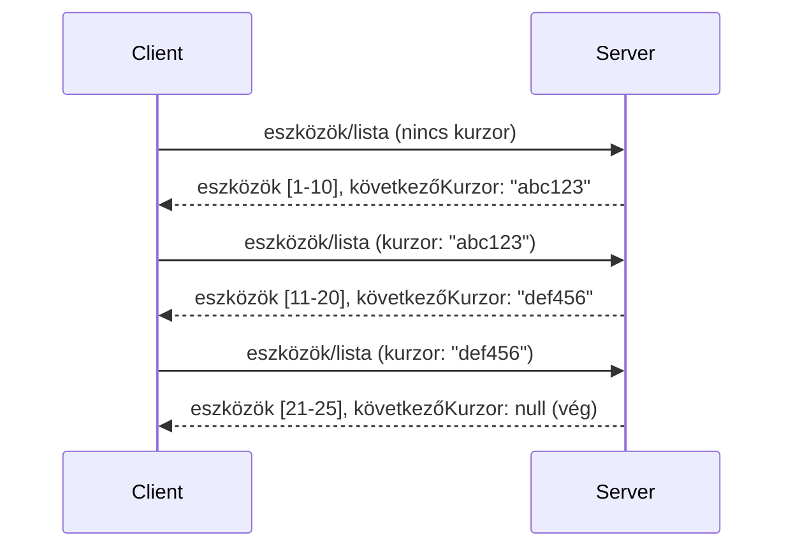

# Lapozás és Nagy Eredményhalmazok az MCP-ben

Amikor az MCP szervere nagy adatállományokat kezel - legyen szó akár több ezer fájl, adatbázis rekord vagy keresési találat listázásáról -, szükség van lapozásra a memória hatékony kezelése és a gyors válaszidők biztosítása érdekében. Ez az útmutató bemutatja, hogyan valósítható meg és használható a lapozás az MCP-ben.

## Miért Fontos a Lapozás

Lapozás nélkül a nagy válaszok a következőket okozhatják:

- **Memória kimerülése** - Egyszerre több millió rekord betöltése
- **Lassú válaszidő** - A felhasználók megvárják az összes adat betöltését
- **Időtúllépési hibák** - A kérések túllépik az időkorlátokat
- **Gyenge AI teljesítmény** - A LLM-ek nehezen boldogulnak hatalmas kontextusokkal

Az MCP **kurzor-alapú lapozást** használ a megbízható és következetes eredményoldalazáshoz.

---

## Hogyan Működik az MCP Lapozás

### A Kurzor Fogalma

A **kurzor** egy átlátszatlan karakterlánc, amely az eredményhalmazon belüli helyzetedet jelöli. Olyan, mint egy könyvjelző egy hosszú könyvben.


### Lapozás az MCP Metódusokban

Ezek az MCP metódusok támogatják a lapozást:

| Metódus | Visszatérési érték | Kurzor támogatás |
|--------|--------------------|------------------|
| `tools/list` | Eszköz definíciók | ✅ |
| `resources/list` | Erőforrás definíciók | ✅ |
| `prompts/list` | Prompt definíciók | ✅ |
| `resources/templates/list` | Erőforrás sablonok | ✅ |

---

## Szerver Oldali Megvalósítás

### Python (FastMCP)

```python
from mcp.server import Server
from mcp.types import Tool, ListToolsResult
import math

app = Server("paginated-server")

# Szimulált nagy adathalmaz
ALL_TOOLS = [
    Tool(name=f"tool_{i}", description=f"Tool number {i}", inputSchema={})
    for i in range(100)
]

PAGE_SIZE = 10

@app.list_tools()
async def list_tools(cursor: str | None = None) -> ListToolsResult:
    """List tools with pagination support."""
    
    # Dekódolja a kurzort a kezdő index megszerzéséhez
    start_index = 0
    if cursor:
        try:
            start_index = int(cursor)
        except ValueError:
            start_index = 0
    
    # Eredmények oldalának lekérése
    end_index = min(start_index + PAGE_SIZE, len(ALL_TOOLS))
    page_tools = ALL_TOOLS[start_index:end_index]
    
    # Következő kurzor kiszámítása
    next_cursor = None
    if end_index < len(ALL_TOOLS):
        next_cursor = str(end_index)
    
    return ListToolsResult(
        tools=page_tools,
        nextCursor=next_cursor
    )
```

### TypeScript

```typescript
import { Server } from "@modelcontextprotocol/sdk/server/index.js";
import { ListToolsResultSchema } from "@modelcontextprotocol/sdk/types.js";

const server = new Server({
  name: "paginated-server",
  version: "1.0.0"
});

// Szimulált nagyméretű adatállomány
const ALL_TOOLS = Array.from({ length: 100 }, (_, i) => ({
  name: `tool_${i}`,
  description: `Tool number ${i}`,
  inputSchema: { type: "object", properties: {} }
}));

const PAGE_SIZE = 10;

server.setRequestHandler(ListToolsResultSchema, async (request) => {
  // Dekódolja a kurzort
  let startIndex = 0;
  if (request.params?.cursor) {
    startIndex = parseInt(request.params.cursor, 10) || 0;
  }
  
  // Eredmények oldalának lekérése
  const endIndex = Math.min(startIndex + PAGE_SIZE, ALL_TOOLS.length);
  const pageTools = ALL_TOOLS.slice(startIndex, endIndex);
  
  // Következő kurzor kiszámítása
  const nextCursor = endIndex < ALL_TOOLS.length ? String(endIndex) : undefined;
  
  return {
    tools: pageTools,
    nextCursor
  };
});
```

### Java (Spring MCP)

```java
@Service
public class PaginatedToolService {
    
    private static final int PAGE_SIZE = 10;
    private final List<Tool> allTools;
    
    public PaginatedToolService() {
        // Nagy adatkészlet inicializálása
        this.allTools = IntStream.range(0, 100)
            .mapToObj(i -> new Tool("tool_" + i, "Tool number " + i, Map.of()))
            .collect(Collectors.toList());
    }
    
    @McpMethod("tools/list")
    public ListToolsResult listTools(@Param("cursor") String cursor) {
        // Mutató dekódolása
        int startIndex = 0;
        if (cursor != null && !cursor.isEmpty()) {
            try {
                startIndex = Integer.parseInt(cursor);
            } catch (NumberFormatException e) {
                startIndex = 0;
            }
        }
        
        // Eredmények oldalának lekérése
        int endIndex = Math.min(startIndex + PAGE_SIZE, allTools.size());
        List<Tool> pageTools = allTools.subList(startIndex, endIndex);
        
        // Következő mutató kiszámítása
        String nextCursor = endIndex < allTools.size() ? String.valueOf(endIndex) : null;
        
        return new ListToolsResult(pageTools, nextCursor);
    }
}
```

---

## Kliens Oldali Megvalósítás

### Python Kliens

```python
from mcp import ClientSession

async def get_all_tools(session: ClientSession) -> list:
    """Fetch all tools using pagination."""
    all_tools = []
    cursor = None
    
    while True:
        result = await session.list_tools(cursor=cursor)
        all_tools.extend(result.tools)
        
        if result.nextCursor is None:
            break
        cursor = result.nextCursor
    
    return all_tools

# Használat
async with client_session as session:
    tools = await get_all_tools(session)
    print(f"Found {len(tools)} tools")
```

### TypeScript Kliens

```typescript
import { Client } from "@modelcontextprotocol/sdk/client/index.js";

async function getAllTools(client: Client): Promise<Tool[]> {
  const allTools: Tool[] = [];
  let cursor: string | undefined = undefined;
  
  do {
    const result = await client.listTools({ cursor });
    allTools.push(...result.tools);
    cursor = result.nextCursor;
  } while (cursor);
  
  return allTools;
}

// Használat
const tools = await getAllTools(client);
console.log(`Found ${tools.length} tools`);
```

### Lusta Betöltés Mintázat

Nagyon nagy adatállományok esetén töltsd be az oldalakat igény szerint:

```python
class PaginatedToolIterator:
    """Lazily iterate through paginated tools."""
    
    def __init__(self, session: ClientSession):
        self.session = session
        self.cursor = None
        self.buffer = []
        self.exhausted = False
    
    async def __anext__(self):
        # Visszatérés a pufferből, ha elérhető
        if self.buffer:
            return self.buffer.pop(0)
        
        # Ellenőrizze, hogy elfogytak-e az összes oldal
        if self.exhausted:
            raise StopAsyncIteration
        
        # Következő oldal lekérése
        result = await self.session.list_tools(cursor=self.cursor)
        self.buffer = list(result.tools)
        self.cursor = result.nextCursor
        
        if self.cursor is None:
            self.exhausted = True
        
        if not self.buffer:
            raise StopAsyncIteration
        
        return self.buffer.pop(0)
    
    def __aiter__(self):
        return self

# Használat - memóriahatékony nagy adathalmazok esetén
async for tool in PaginatedToolIterator(session):
    process_tool(tool)
```

---

## Lapozás az Erőforrásoknál

Az erőforrásoknál gyakran szükséges lapozás mappák vagy nagy adatállományok esetén:

```python
from mcp.server import Server
from mcp.types import Resource, ListResourcesResult
import os

app = Server("file-server")

@app.list_resources()
async def list_resources(cursor: str | None = None) -> ListResourcesResult:
    """List files in directory with pagination."""
    
    directory = "/data/files"
    all_files = sorted(os.listdir(directory))
    
    # Kurzor dekódolása (fájl index)
    start_index = int(cursor) if cursor else 0
    page_size = 20
    end_index = min(start_index + page_size, len(all_files))
    
    # Erőforrás lista létrehozása ehhez az oldalhoz
    resources = []
    for filename in all_files[start_index:end_index]:
        filepath = os.path.join(directory, filename)
        resources.append(Resource(
            uri=f"file://{filepath}",
            name=filename,
            mimeType="application/octet-stream"
        ))
    
    # Következő kurzor kiszámítása
    next_cursor = str(end_index) if end_index < len(all_files) else None
    
    return ListResourcesResult(
        resources=resources,
        nextCursor=next_cursor
    )
```

---

## Kurzor Tervezési Stratégiák

### Stratégia 1: Index Alapú (Egyszerű)

```python
# A kurzor csak az index
cursor = "50"  # Kezdje az 50. elemtől
```

**Előnyök:** Egyszerű, állapotmentes  
**Hátrányok:** Az eredmények eltolódhatnak, ha elemek kerülnek be vagy ki

### Stratégia 2: ID Alapú (Stabil)

```python
# A kurzor az utoljára látott azonosító
cursor = "item_abc123"  # Ezt az elemet követően kezdődik
```

**Előnyök:** Stabil, még ha az elemek változnak is  
**Hátrányok:** Sorrendben lévő azonosítók szükségesek

### Stratégia 3: Titkosított Állapot (Összetett)

```python
import base64
import json

def encode_cursor(state: dict) -> str:
    return base64.b64encode(json.dumps(state).encode()).decode()

def decode_cursor(cursor: str) -> dict:
    return json.loads(base64.b64decode(cursor).decode())

# A kurzor több állapotmezőt tartalmaz
cursor = encode_cursor({
    "offset": 50,
    "filter": "active",
    "sort": "name"
})
```

**Előnyök:** Képes bonyolult állapotok kódolására  
**Hátrányok:** Komplexebb, nagyobb kurzor karakterláncok

---

## Legjobb Gyakorlatok

### 1. Válassz Megfelelő Oldalméretet

```python
# Vegyük figyelembe az adatmennyiséget
PAGE_SIZE_SMALL_ITEMS = 100   # Egyszerű metaadatok
PAGE_SIZE_MEDIUM_ITEMS = 20   # Gazdagabb objektumok
PAGE_SIZE_LARGE_ITEMS = 5     # Összetett tartalom
```

### 2. Kezeld Gráciánsan az Érvénytelen Kurzorokat

```python
@app.list_tools()
async def list_tools(cursor: str | None = None) -> ListToolsResult:
    try:
        start_index = int(cursor) if cursor else 0
        if start_index < 0 or start_index >= len(ALL_TOOLS):
            start_index = 0  # Visszaállítás a kezdethez
    except (ValueError, TypeError):
        start_index = 0  # Érvénytelen kurzor, kezdjük elölről
    # ...
```

### 3. Tartalmazza az Összesített Eredmény Számot (Opcionális)

```python
return ListToolsResult(
    tools=page_tools,
    nextCursor=next_cursor,
    # Néhány megvalósítás tartalmazza az összesített értéket a felhasználói felület haladásához
    _meta={"total": len(ALL_TOOLS)}
)
```

### 4. Teszteld a Szélsőséges Eseteket

```python
async def test_pagination():
    # Üres eredményhalmaz
    result = await session.list_tools()
    assert result.tools == []
    assert result.nextCursor is None
    
    # Egyetlen oldal
    result = await session.list_tools()
    assert len(result.tools) <= PAGE_SIZE
    
    # Érvénytelen kurzor
    result = await session.list_tools(cursor="invalid")
    assert result.tools  # Az első oldalt kell visszaadnia
```

---

## Gyakori Hibák

### ❌ MINDEN Eredmény Visszaadása, Majd Kliens Oldali Lapozás

```python
# ROSSZ: Minden betöltése a memóriába
@app.list_tools()
async def list_tools() -> ListToolsResult:
    all_tools = load_all_tools()  # 1 millió eszköz!
    return ListToolsResult(tools=all_tools)
```

### ✅ Lapozás az Adatforrásnál

```python
# JÓ: Csak a szükséges dolgokat tölti be
@app.list_tools()
async def list_tools(cursor: str | None = None) -> ListToolsResult:
    offset = int(cursor) if cursor else 0
    tools = await db.query_tools(offset=offset, limit=PAGE_SIZE)
    return ListToolsResult(tools=tools, nextCursor=...)
```

---

## Mi Következik

- [5.14 Modul - Kontextus Mérnökség](../../05-AdvancedTopics/mcp-contextengineering/README.md)
- [8. Modul - Legjobb Gyakorlatok](../../08-BestPractices/README.md)
- [3.8 - Az MCP Szerver Tesztelése](../../03-GettingStarted/08-testing/README.md)

---

## További Erőforrások

- [MCP Specifikáció - Lapozás](https://spec.modelcontextprotocol.io/specification/2025-11-25/)
- [Kurzor-alapú Lapozás Magyarázat](https://slack.engineering/evolving-api-pagination-at-slack/)
- [Python SDK lapozás tesztjei](https://github.com/modelcontextprotocol/python-sdk/blob/main/tests/client/test_list_methods_cursor.py)

---

<!-- CO-OP TRANSLATOR DISCLAIMER START -->
**Jogi nyilatkozat**:  
Ez a dokumentum az AI fordító szolgáltatás [Co-op Translator](https://github.com/Azure/co-op-translator) használatával készült. Bár a pontosságra törekszünk, kérjük, vegye figyelembe, hogy az automatikus fordítások tartalmazhatnak hibákat vagy pontatlanságokat. Az eredeti, anyanyelvi dokumentum tekintendő hivatalos forrásnak. Kritikus információk esetén professzionális emberi fordítást javaslunk. Nem vállalunk felelősséget az ebből eredő félreértésekért vagy félreértelmezésekért.
<!-- CO-OP TRANSLATOR DISCLAIMER END -->