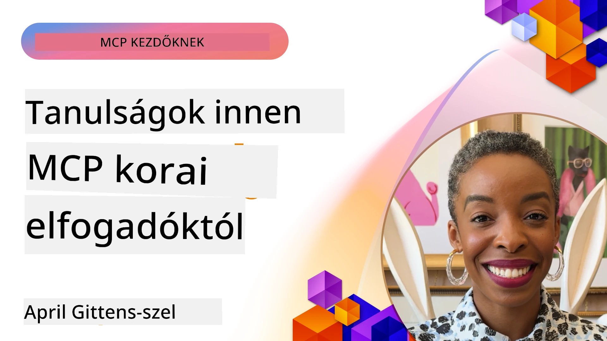

# 🌟 Tanulságok a korai alkalmazóktól

[](https://youtu.be/jds7dSmNptE)

_(Kattintson a fenti képre a lecke videójának megtekintéséhez)_

## 🎯 Mit fed le ez a modul

Ez a modul azt vizsgálja, hogyan használják a valós szervezetek és fejlesztők a Model Context Protocolt (MCP), hogy valós kihívásokat oldjanak meg és ösztönözzék az innovációt. Részletes esettanulmányokon, gyakorlati projekteken és példákon keresztül felfedezheti, hogyan teszi az MCP lehetővé a biztonságos, skálázható AI integrációt, amely összekapcsolja a nyelvi modelleket, eszközöket és vállalati adatokat.

### 📚 Nézze meg az MCP működés közben

Szeretné látni, hogyan alkalmazzák ezeket az elveket a termelésre kész eszközökön? Tekintse meg a [**10 Microsoft MCP szervert, amelyek átalakítják a fejlesztők termelékenységét**](microsoft-mcp-servers.md), amely bemutatja a valódi Microsoft MCP szervereket, amelyeket ma is használhat.

## Összefoglaló

Ez a lecke bemutatja, hogyan használták a korai alkalmazók a Model Context Protocolt (MCP), hogy valós iparági kihívásokat oldjanak meg és ösztönözzék az innovációt. Részletes esettanulmányokon és gyakorlati projekteken keresztül megtapasztalhatja, hogyan teszi lehetővé az MCP a szabványosított, biztonságos és skálázható AI integrációt — összekapcsolva a nagy nyelvi modelleket, az eszközöket és a vállalati adatokat egy egységes keretrendszerben. Gyakorlati tapasztalatot szerez MCP-alapú megoldások tervezésében és építésében, megtanulja a bevált megvalósítási mintákat, és megismeri a legjobb gyakorlatokat az MCP telepítéséhez éles környezetekben. A lecke emellett kiemeli a feltörekvő trendeket, jövőbeli irányokat és nyílt forráskódú erőforrásokat, hogy segítsen Önnek az MCP technológia élvonalában maradni és megérteni annak fejlődő ökoszisztémáját.

## Tanulási célok

- Elemzi a valós ipari MCP megvalósításokat
- Tervez és épít teljes MCP-alapú alkalmazásokat
- Felfedezi az MCP technológia feltörekvő trendjeit és jövőbeli irányait
- Alkalmazza a legjobb gyakorlatokat valós fejlesztési helyzetekben

## Valós MCP megvalósítások

### Esettanulmány 1: Vállalati ügyfélszolgálati automatizálás

Egy multinacionális vállalat MCP-alapú megoldást vezetett be az AI interakciók szabványosítására az ügyfélszolgálati rendszereikben. Ez lehetővé tette számukra, hogy:

- Egyesített felületet hozzanak létre több LLM szolgáltató számára
- Egységes prompt menedzsmentet tartsanak fenn az osztályok között
- Szilárd biztonsági és megfelelőségi kontrollokat vezessenek be
- Könnyen váltsanak különböző AI modellek között az adott igények szerint

**Műszaki megvalósítás:**

```python
# Python MCP szerver implementáció ügyféltámogatáshoz
import logging
import asyncio
from modelcontextprotocol import create_server, ServerConfig
from modelcontextprotocol.server import MCPServer
from modelcontextprotocol.transports import create_http_transport
from modelcontextprotocol.resources import ResourceDefinition
from modelcontextprotocol.prompts import PromptDefinition
from modelcontextprotocol.tool import ToolDefinition

# Naplózás konfigurálása
logging.basicConfig(level=logging.INFO)

async def main():
    # Szerver konfiguráció létrehozása
    config = ServerConfig(
        name="Enterprise Customer Support Server",
        version="1.0.0",
        description="MCP server for handling customer support inquiries"
    )
    
    # MCP szerver inicializálása
    server = create_server(config)
    
    # Tudásbázis erőforrások regisztrálása
    server.resources.register(
        ResourceDefinition(
            name="customer_kb",
            description="Customer knowledge base documentation"
        ),
        lambda params: get_customer_documentation(params)
    )
    
    # Prompt sablonok regisztrálása
    server.prompts.register(
        PromptDefinition(
            name="support_template",
            description="Templates for customer support responses"
        ),
        lambda params: get_support_templates(params)
    )
    
    # Támogató eszközök regisztrálása
    server.tools.register(
        ToolDefinition(
            name="ticketing",
            description="Create and update support tickets"
        ),
        handle_ticketing_operations
    )
    
    # Szerver indítása HTTP átvitellel
    transport = create_http_transport(port=8080)
    await server.run(transport)

if __name__ == "__main__":
    asyncio.run(main())
```
  
**Eredmények:** 30%-os költségcsökkenés a modelleken, 45%-os javulás a válasz stabilitásában, valamint fokozott megfelelőség a globális műveletek során.

### Esettanulmány 2: Egészségügyi diagnosztikai asszisztens

Egy egészségügyi szolgáltató MCP infrastruktúrát fejlesztett ki több szakosodott orvosi AI modell integrálására, miközben biztosította a szenzitív betegadatok védelmét:

- Zökkenőmentes váltás általános és szakosodott orvosi modellek között
- Szigorú adatvédelmi szabályozások és audit naplózás
- Integráció a meglévő Elektronikus Betegnyilvántartó (EHR) rendszerekkel
- Következetes prompt készítés az orvosi terminológia számára

**Műszaki megvalósítás:**

```csharp
// C# MCP host application implementation in healthcare application
using Microsoft.Extensions.DependencyInjection;
using ModelContextProtocol.SDK.Client;
using ModelContextProtocol.SDK.Security;
using ModelContextProtocol.SDK.Resources;

public class DiagnosticAssistant
{
    private readonly MCPHostClient _mcpClient;
    private readonly PatientContext _patientContext;
    
    public DiagnosticAssistant(PatientContext patientContext)
    {
        _patientContext = patientContext;
        
        // Configure MCP client with healthcare-specific settings
        var clientOptions = new ClientOptions
        {
            Name = "Healthcare Diagnostic Assistant",
            Version = "1.0.0",
            Security = new SecurityOptions
            {
                Encryption = EncryptionLevel.Medical,
                AuditEnabled = true
            }
        };
        
        _mcpClient = new MCPHostClientBuilder()
            .WithOptions(clientOptions)
            .WithTransport(new HttpTransport("https://healthcare-mcp.example.org"))
            .WithAuthentication(new HIPAACompliantAuthProvider())
            .Build();
    }
    
    public async Task<DiagnosticSuggestion> GetDiagnosticAssistance(
        string symptoms, string patientHistory)
    {
        // Create request with appropriate resources and tool access
        var resourceRequest = new ResourceRequest
        {
            Name = "patient_records",
            Parameters = new Dictionary<string, object>
            {
                ["patientId"] = _patientContext.PatientId,
                ["requestingProvider"] = _patientContext.ProviderId
            }
        };
        
        // Request diagnostic assistance using appropriate prompt
        var response = await _mcpClient.SendPromptRequestAsync(
            promptName: "diagnostic_assistance",
            parameters: new Dictionary<string, object>
            {
                ["symptoms"] = symptoms,
                patientHistory = patientHistory,
                relevantGuidelines = _patientContext.GetRelevantGuidelines()
            });
            
        return DiagnosticSuggestion.FromMCPResponse(response);
    }
}
```
  
**Eredmények:** Javított diagnosztikai javaslatok az orvosok számára, teljes HIPAA megfelelőség megtartása mellett, valamint jelentős csökkenés a rendszerek közötti kontextusváltásban.

### Esettanulmány 3: Pénzügyi szolgáltatások kockázatelemzése

Egy pénzügyi intézmény MCP-t vezetett be kockázatelemzési folyamataik szabványosítására különböző osztályok között:

- Egyesített interfészt hoztak létre hitelkockázat, csalásfelderítés és befektetési kockázati modellekhez
- Szigorú hozzáférés-vezérlést és modell verziókezelést alkalmaztak
- Biztosították az összes AI ajánlás auditálhatóságát
- Megtartották az adatformátum egységességét a különböző rendszerek között

**Műszaki megvalósítás:**

```java
// Java MCP szerver pénzügyi kockázatértékeléshez
import org.mcp.server.*;
import org.mcp.security.*;

public class FinancialRiskMCPServer {
    public static void main(String[] args) {
        // MCP szerver létrehozása pénzügyi megfelelőségi funkciókkal
        MCPServer server = new MCPServerBuilder()
            .withModelProviders(
                new ModelProvider("risk-assessment-primary", new AzureOpenAIProvider()),
                new ModelProvider("risk-assessment-audit", new LocalLlamaProvider())
            )
            .withPromptTemplateDirectory("./compliance/templates")
            .withAccessControls(new SOCCompliantAccessControl())
            .withDataEncryption(EncryptionStandard.FINANCIAL_GRADE)
            .withVersionControl(true)
            .withAuditLogging(new DatabaseAuditLogger())
            .build();
            
        server.addRequestValidator(new FinancialDataValidator());
        server.addResponseFilter(new PII_RedactionFilter());
        
        server.start(9000);
        
        System.out.println("Financial Risk MCP Server running on port 9000");
    }
}
```
  
**Eredmények:** Javított szabályozási megfelelőség, 40%-kal gyorsabb modell bevezetési ciklusok, és javított kockázatértékelési állandóság az osztályok között.

### Esettanulmány 4: Microsoft Playwright MCP Server böngészőautomatizáláshoz

A Microsoft kifejlesztette a [Playwright MCP szervert](https://github.com/microsoft/playwright-mcp), hogy biztonságos, szabványosított böngészőautomatizálást tegyen lehetővé a Model Context Protocol segítségével. Ez a termelésre kész szerver lehetővé teszi AI ügynököknek és LLM-eknek, hogy kontrollált, auditálható és bővíthető módon lépjenek kapcsolatba web böngészőkkel — lehetővé téve olyan felhasználási eseteket, mint az automatizált web tesztelés, adatkinyerés és végponttól végpontig tartó munkafolyamatok.

> **🎯 Termelésre Kész Eszköz**  
>  
> Ez az esettanulmány egy valós MCP szervert mutat be, amelyet már ma használhat! Tudjon meg többet a Playwright MCP szerverről és további 9 termelésre kész Microsoft MCP szerverről az [**Microsoft MCP szerverek útmutatójában**](microsoft-mcp-servers.md#8--playwright-mcp-server).

**Főbb jellemzők:**
- Böngészőautomatizálási képességek (navigáció, űrlapkitöltés, képernyőkép készítés stb.) MCP eszközként való kitettsége
- Szigorú hozzáférés-vezérlés és sandbox kialakítása az illetéktelen műveletek megelőzésére
- Részletes audit naplók biztosítása minden böngészős interakcióról
- Integráció támogatása az Azure OpenAI-val és más LLM szolgáltatókkal az ügynökalapú automatizációhoz
- A GitHub Copilot Coding Agent böngészési képességeinek meghajtása

**Műszaki megvalósítás:**

```typescript
// TypeScript: Playwright böngésző automatizálási eszközök regisztrálása egy MCP szerveren
import { createServer, ToolDefinition } from 'modelcontextprotocol';
import { launch } from 'playwright';

const server = createServer({
  name: 'Playwright MCP Server',
  version: '1.0.0',
  description: 'MCP server for browser automation using Playwright'
});

// Egy eszköz regisztrálása URL-re navigáláshoz és képernyőkép készítéséhez
server.tools.register(
  new ToolDefinition({
    name: 'navigate_and_screenshot',
    description: 'Navigate to a URL and capture a screenshot',
    parameters: {
      url: { type: 'string', description: 'The URL to visit' }
    }
  }),
  async ({ url }) => {
    const browser = await launch();
    const page = await browser.newPage();
    await page.goto(url);
    const screenshot = await page.screenshot();
    await browser.close();
    return { screenshot };
  }
);

// MCP szerver indítása
server.listen(8080);
```
  
**Eredmények:**  
- Biztonságos, programozott böngészőautomatizálás AI ügynökök és LLM-ek számára  
- Csökkentett kézi tesztelési erőfeszítés és javított tesztlefedettség webalkalmazásoknál  
- Újrahasználható, bővíthető keretrendszer böngészőalapú eszközintegrációhoz vállalati környezetekben  
- Megtáplálja a GitHub Copilot böngészési lehetőségeit  

**Hivatkozások:**  
- [Playwright MCP Server GitHub tároló](https://github.com/microsoft/playwright-mcp)  
- [Microsoft AI és automatizálási megoldások](https://azure.microsoft.com/en-us/products/ai-services/)

### Esettanulmány 5: Azure MCP – Vállalati szintű Model Context Protocol szolgáltatásként

Az Azure MCP Server ([https://aka.ms/azmcp](https://aka.ms/azmcp)) a Microsoft által kezelt, vállalati szintű Model Context Protocol megvalósítás, amely a skálázható, biztonságos és megfelelőségi MCP szerver képességeket felhőalapú szolgáltatásként nyújtja. Az Azure MCP lehetővé teszi a szervezetek számára az MCP szerverek gyors telepítését, kezelését és integrációját az Azure AI, adat- és biztonsági szolgáltatásaival, csökkentve az üzemeltetési terheket és felgyorsítva az AI elfogadását.

> **🎯 Termelésre Kész Eszköz**  
>  
> Ez valódi MCP szerver, amelyet már ma használhat! Tudjon meg többet az Azure AI Foundry MCP Serverről az [**Microsoft MCP szerverek útmutatójában**](microsoft-mcp-servers.md).

- Teljesen menedzselt MCP szerver hosztolás beépített skálázással, monitorozással és biztonsági funkciókkal  
- Natív integráció az Azure OpenAI, Azure AI Search és egyéb Azure szolgáltatásokkal  
- Vállalati hitelesítés és jogosultságkezelés Microsoft Entra ID-n keresztül  
- Támogatás egyedi eszközökhöz, prompt sablonokhoz és erőforrás csatlakozókhoz  
- Megfelelés a vállalati biztonsági és jogszabályi követelményeknek  

**Műszaki megvalósítás:**

```yaml
# Example: Azure MCP server deployment configuration (YAML)
apiVersion: mcp.microsoft.com/v1
kind: McpServer
metadata:
  name: enterprise-mcp-server
spec:
  modelProviders:
    - name: azure-openai
      type: AzureOpenAI
      endpoint: https://<your-openai-resource>.openai.azure.com/
      apiKeySecret: <your-azure-keyvault-secret>
  tools:
    - name: document_search
      type: AzureAISearch
      endpoint: https://<your-search-resource>.search.windows.net/
      apiKeySecret: <your-azure-keyvault-secret>
  authentication:
    type: EntraID
    tenantId: <your-tenant-id>
  monitoring:
    enabled: true
    logAnalyticsWorkspace: <your-log-analytics-id>
```
  
**Eredmények:**  
- Csökkentették az AI projektek bevételhez jutási idejét a kész, megfelelőségi MCP szerver platformmal  
- Egyszerűsítették az LLM-ek, eszközök és vállalati adatforrások integrációját  
- Javították az MCP terhelések biztonságát, észlelhetőségét és működési hatékonyságát  
- Megnövelték a kódminőséget az Azure SDK legjobb gyakorlataival és a korszerű hitelesítési mintákkal  

**Hivatkozások:**  
- [Azure MCP Dokumentáció](https://aka.ms/azmcp)  
- [Azure MCP Server GitHub tároló](https://github.com/Azure/azure-mcp)  
- [Azure AI Szolgáltatások](https://azure.microsoft.com/en-us/products/ai-services/)  
- [Microsoft MCP Központ](https://mcp.azure.com)

## Esettanulmány 6: NLWeb  
Az MCP (Model Context Protocol) egy feltörekvő protokoll chatbotok és AI asszisztensek számára, hogy eszközökkel lépjenek kapcsolatba. Minden NLWeb példány egyúttal MCP szerver is, amely egy lényegi "ask" metódust támogat, amellyel weboldalakat lehet természetes nyelven kérdezni. A visszakapott válasz a schema.org szabványt használja, amely egy széles körben használt webadat-leíró nyelvezet. Szabadon fogalmazva, az MCP az NLWebhez hasonló módon viszonyul a HTTP-hez, mint a HTML-hez. Az NLWeb egyesíti a protokollokat, a Schema.org formátumokat és mintakódokat, hogy a webhelyek gyorsan létrehozhassák ezeket a végpontokat, előnyöket biztosítva mind az embereknek a beszélgetési felületeken keresztül, mind a gépeknek az ügynök-ügynökkel történő természetes interakció révén.

Az NLWeb két különálló összetevőből áll:  
- Egy protokoll, amely nagyon egyszerűen kezdődik, hogy egy webhelyhez természetes nyelven lehessen interfészelni, valamint egy formátum, amely json-t és schema.org-t használ a válaszban. További részletekért lásd a REST API dokumentációt.  
- Egy egyszerű megvalósítás, amely az (1) pontot használja, meglévő jelöléseket alkalmazva, olyan helyeken, amelyeket elemlistákként lehet absztrahálni (termékek, receptek, látnivalók, értékelések stb.). Ezeket egy felhasználói felület widget készlettel együtt a webhelyek könnyen biztosíthatnak beszélgetési felületeket tartalmukhoz. További részletekért lásd a Life of a chat query dokumentációt.

**Hivatkozások:**  
- [Azure MCP Dokumentáció](https://aka.ms/azmcp)  
- [NLWeb](https://github.com/microsoft/NlWeb)

### Esettanulmány 7: Azure AI Foundry MCP Szerver – Vállalati AI ügynök integráció

Az Azure AI Foundry MCP szerverek bemutatják, hogyan lehet az MCP-t használni AI ügynökök és munkafolyamatok szervezésére és menedzselésére vállalati környezetben. Az MCP integrálásával az Azure AI Foundry-val a szervezetek szabványosíthatják az ügynökök interakcióját, kihasználhatják a Foundry munkafolyamat-kezelését, és biztosíthatják a biztonságos, skálázható telepítést.

> **🎯 Termelésre Kész Eszköz**  
>  
> Ez valódi MCP szerver, amelyet már ma használhat! Tudjon meg többet az Azure AI Foundry MCP Serverről az [**Microsoft MCP szerverek útmutatójában**](microsoft-mcp-servers.md#9--azure-ai-foundry-mcp-server).

**Főbb jellemzők:**  
- Átfogó hozzáférés az Azure AI ökoszisztémához, beleértve a modell katalógusokat és telepítéskezelést  
- Tudásindexelés az Azure AI Search segítségével RAG alkalmazásokhoz  
- Értékelő eszközök az AI modell teljesítményének és minőségbiztosításának méréséhez  
- Integráció az Azure AI Foundry katalógussal és laborokkal a legújabb kutatási modellekhez  
- Ügynök menedzsment és értékelési képességek éles környezetekben  

**Eredmények:**  
- Gyors prototípus készítés és robusztus monitoring AI ügynök munkafolyamatokhoz  
- Zökkenőmentes integráció az Azure AI szolgáltatásokkal fejlett forgatókönyvekhez  
- Egységes felület ügynök pipeline-ok építéséhez, telepítéséhez és monitorozásához  
- Javított biztonság, megfelelőség és működési hatékonyság vállalatok számára  
- Felgyorsított AI elfogadás miközben kontrollt tart komplex ügynök vezérelt folyamatok felett  

**Hivatkozások:**  
- [Azure AI Foundry MCP Server GitHub tároló](https://github.com/azure-ai-foundry/mcp-foundry)  
- [Azure AI ügynökök MCP-vel integrálva (Microsoft Foundry Blog)](https://devblogs.microsoft.com/foundry/integrating-azure-ai-agents-mcp/)

### Esettanulmány 8: Foundry MCP Playground – Kísérletezés és prototípus készítés

A Foundry MCP Playground egy kész, használatra kész környezetet kínál az MCP szerverek és az Azure AI Foundry integrációk kipróbálására. A fejlesztők gyorsan készíthetnek prototípusokat, tesztelhetnek és értékelhetnek AI modelleket és ügynök munkafolyamatokat az Azure AI Foundry katalógusából és laborból származó erőforrásokkal. A playground leegyszerűsíti a beállítást, mintaprojekteket kínál, és támogatja az együttműködést, így könnyen lehet felfedezni a legjobb gyakorlatokat és új forgatókönyveket minimális költséggel. Különösen hasznos csapatok számára, amelyek ötleteket szeretnének validálni, kísérleteket megosztani és gyorsítani a tanulást bonyolult infrastruktúra nélkül. Ezáltal elősegíti az innovációt és a közösségi hozzájárulásokat az MCP és az Azure AI Foundry ökoszisztéma területén.

**Hivatkozások:**  
- [Foundry MCP Playground GitHub tároló](https://github.com/azure-ai-foundry/foundry-mcp-playground)

### Esettanulmány 9: Microsoft Learn Docs MCP Server – AI vezérelt dokumentáció-hozzáférés

A Microsoft Learn Docs MCP Server egy felhőalapú szolgáltatás, amely AI asszisztenseknek valós idejű hozzáférést ad a hivatalos Microsoft dokumentációhoz a Model Context Protocol segítségével. Ez a termelésre kész szerver kapcsolódik a kiterjedt Microsoft Learn ökoszisztémához és lehetővé teszi a szemantikus keresést az összes hivatalos Microsoft forrás között.

> **🎯 Termelésre Kész Eszköz**  
>  
> Ez valódi MCP szerver, amelyet már ma használhat! Tudjon meg többet a Microsoft Learn Docs MCP Serverről az [**Microsoft MCP szerverek útmutatójában**](microsoft-mcp-servers.md#1--microsoft-learn-docs-mcp-server).

**Főbb jellemzők:**  
- Valós idejű hozzáférés a hivatalos Microsoft dokumentációkhoz, Azure dokumentációkhoz és Microsoft 365 dokumentációhoz  
- Fejlett szemantikus keresési képességek, amelyek megértik a kontextust és a szándékot  
- Mindig naprakész információ, ahogy a Microsoft Learn tartalom megjelenik  
- Átfogó lefedettség a Microsoft Learn, az Azure dokumentáció és a Microsoft 365 források között  
- Akár 10 magas színvonalú tartalomdarabot ad vissza cikkcímekkel és URL-ekkel  

**Miért kritikus:**  
- Megoldja a "elavult AI tudás" problémát Microsoft technológiák esetén  
- Biztosítja, hogy az AI asszisztensek hozzáférjenek a legújabb .NET, C#, Azure és Microsoft 365 funkciókhoz  
- Hiteles, első fél által biztosított információt nyújt a pontos kódgeneráláshoz  
- Létfontosságú a gyorsan fejlődő Microsoft technológiákkal dolgozó fejlesztők számára  

**Eredmények:**  
- Drasztikusan javította az AI által generált kód pontosságát Microsoft technológiák esetén  
- Csökkentette az aktuális dokumentáció és legjobb gyakorlatok keresésére fordított időt  
- Növelte a fejlesztők termelékenységét kontextusérzékeny dokumentáció lekéréssel  
- Zökkenőmentes integráció a fejlesztési munkafolyamatokba IDE elhagyása nélkül  

**Hivatkozások:**  
- [Microsoft Learn Docs MCP Server GitHub tároló](https://github.com/MicrosoftDocs/mcp)  
- [Microsoft Learn Dokumentáció](https://learn.microsoft.com/)

## Gyakorlati projektek

### Projekt 1: Többszolgáltatós MCP szerver építése

**Cél:** Olyan MCP szerver létrehozása, amely képes kérésirányítást végezni több AI modell szolgáltató között adott kritériumok alapján.

**Követelmények:**

- Legalább három különböző modell szolgáltató támogatása (pl. OpenAI, Anthropic, helyi modellek)  
- Kérés metaadatok alapján történő irányítási mechanizmus megvalósítása  
- Konfigurációs rendszer kialakítása a szolgáltató hitelesítő adataihoz  
- Gyorsítótárazás hozzáadása a teljesítmény és költségek optimalizálásához  
- Egyszerű irányítópult építése a használat monitorozásához  

**Megvalósítás lépései:**

1. Alap MCP szerver infrastruktúra felállítása  
2. Szolgáltató adapterek megvalósítása az egyes AI modell szolgáltatásokhoz  
3. Irányítási logika megalkotása a kérés attribútumai alapján  
4. Gyorsítótárazási mechanizmusok hozzáadása gyakori kérésekhez  
5. Monitorozó irányítópult fejlesztése  
6. Tesztelés különböző kérésmintákkal  

**Technológiák:** Válasszon Python-t (vagy .NET/Java/Python preferencia szerint), Redis-t gyorsítótárazáshoz, valamint egy egyszerű webes keretrendszert az irányítópulthoz.

### Projekt 2: Vállalati prompt menedzsment rendszer
**Cél:** Egy MCP-alapú rendszer fejlesztése a vállalaton belüli prompt sablonok kezelésére, verziózására és telepítésére.

**Követelmények:**

- Egy központosított tároló létrehozása a prompt sablonok számára
- Verziózás és jóváhagyási munkafolyamatok megvalósítása
- Sablon tesztelési képességek kiépítése mintabemenetekkel
- Szerepalapú hozzáférés-vezérlés fejlesztése
- API létrehozása a sablonok lekéréséhez és telepítéséhez

**Megvalósítási lépések:**

1. Az adatbázis sémájának megtervezése a sablonok tárolásához
2. Az alap API létrehozása a sablon CRUD műveletekhez
3. A verziózási rendszer megvalósítása
4. A jóváhagyási munkafolyamat felépítése
5. A tesztelési keretrendszer fejlesztése
6. Egyszerű webes felület készítése a kezeléshez
7. Integráció egy MCP szerverrel

**Technológiák:** A backend keretrendszer, SQL vagy NoSQL adatbázis és egy frontend keretrendszer szabadon választott kombinációja a kezelőfelülethez.

### 3. projekt: MCP-alapú tartalomgeneráló platform

**Cél:** Egy tartalomgeneráló platform létrehozása, amely az MCP-re támaszkodva biztosít egységes eredményeket különféle tartalomtípusok esetén.

**Követelmények:**

- Több tartalomformátum támogatása (blogbejegyzések, közösségi média posztok, marketing szövegek)
- Sablonalapú generálás testreszabási lehetőségekkel
- Tartalmi áttekintő és visszajelző rendszer létrehozása
- Tartalom teljesítménymutatók követése
- Tartalom verziózásának és iterációjának támogatása

**Megvalósítási lépések:**

1. Az MCP kliens infrastruktúra beállítása
2. Sablonok létrehozása különböző tartalomtípusokra
3. A tartalomgenerálási folyamat kiépítése
4. Az áttekintő rendszer megvalósítása
5. Teljesítménymutatók követésének fejlesztése
6. Felhasználói felület létrehozása a sablonkezeléshez és tartalomgeneráláshoz

**Technológiák:** Ön által preferált programozási nyelv, webes keretrendszer és adatbázis rendszer.

## Az MCP technológia jövője

### Feltörekvő trendek

1. **Multimodális MCP**
   - Az MCP kiterjesztése képi, hang és videó modellekkel való szabványos interakcióra
   - Keresztszegmenses következtetési képességek fejlesztése
   - Szabványosított prompt formátumok különböző modalitásokhoz

2. **Federált MCP infrastruktúra**
   - Elosztott MCP hálózatok, amelyek megoszthatják az erőforrásokat szervezetek között
   - Szabványosított protokollok a biztonságos modellmegosztáshoz
   - Adatvédelmi szempontból megőrző számítási technikák

3. **MCP piacterek**
   - Ökoszisztémák az MCP sablonok és bővítmények megosztására és monetizálására
   - Minőségbiztosítási és tanúsítási folyamatok
   - Integráció modell piacokkal

4. **MCP az él számítástechnikában**
   - MCP szabványok adaptálása erőforrás-korlátozott él eszközökre
   - Alacsony sávszélességű környezetekre optimalizált protokollok
   - Különleges MCP megvalósítások IoT ökoszisztémákhoz

5. **Szabályozói keretek**
   - MCP kiterjesztések fejlesztése a szabályozási megfeleléshez
   - Szabványosított audit nyomvonalak és magyarázhatósági interfészek
   - Integráció az újonnan kialakuló AI-kormányzati keretrendszerekkel

### MCP megoldások a Microsoft-tól

A Microsoft és az Azure több nyílt forráskódú adattárat fejlesztett ki, amelyek segítik a fejlesztőket az MCP különféle forgatókönyvek szerinti implementálásában:

#### Microsoft szervezet

1. [playwright-mcp](https://github.com/microsoft/playwright-mcp) – Playwright MCP szerver böngésző automatizáláshoz és teszteléshez
2. [files-mcp-server](https://github.com/microsoft/files-mcp-server) – OneDrive MCP szerver megvalósítás helyi teszteléshez és közösségi hozzájáruláshoz
3. [NLWeb](https://github.com/microsoft/NlWeb) – Az NLWeb nyílt protokollok és kapcsolódó nyílt forráskódú eszközök gyűjteménye, amely az AI Web alaprétegének létrehozását célozza

#### Azure-Samples szervezet

1. [mcp](https://github.com/Azure-Samples/mcp) – Példák, eszközök és erőforrások az MCP szerverek Azure-ban történő építéséhez és integrálásához több nyelven
2. [mcp-auth-servers](https://github.com/Azure-Samples/mcp-auth-servers) – Referencia MCP szerverek a jelenlegi Model Context Protocol autentikációs specifikációval
3. [remote-mcp-functions](https://github.com/Azure-Samples/remote-mcp-functions) – Kezdőoldal az Azure Functions alapú távoli MCP szerver implementációkhoz, nyelvspecifikus adattárakhoz
4. [remote-mcp-functions-python](https://github.com/Azure-Samples/remote-mcp-functions-python) – Gyorsindító sablon egyedi távoli MCP szerverek építéséhez és telepítéséhez Python használatával Azure Functions-ban
5. [remote-mcp-functions-dotnet](https://github.com/Azure-Samples/remote-mcp-functions-dotnet) – Gyorsindító sablon egyedi távoli MCP szerverek építéséhez és telepítéséhez .NET/C# használatával Azure Functions-ban
6. [remote-mcp-functions-typescript](https://github.com/Azure-Samples/remote-mcp-functions-typescript) – Gyorsindító sablon egyedi távoli MCP szerverek építéséhez és telepítéséhez TypeScript használatával Azure Functions-ban
7. [remote-mcp-apim-functions-python](https://github.com/Azure-Samples/remote-mcp-apim-functions-python) – Azure API Management mint AI átjáró a távoli MCP szerverekhez Python nyelven
8. [AI-Gateway](https://github.com/Azure-Samples/AI-Gateway) – APIM ❤️ AI kísérletek MCP képességekkel, integrálva Azure OpenAI és AI Foundry-val

Ezek az adattárak különféle megvalósításokat, sablonokat és erőforrásokat kínálnak az MCP-vel történő munkához különböző programozási nyelveken és Azure szolgáltatásokkal. Lefedik az alap szerver megvalósításokat, autentikációt, felhőbe telepítést és vállalati integrációs forgatókönyveket.

#### MCP erőforrás könyvtár

A [MCP Resources directory](https://github.com/microsoft/mcp/tree/main/Resources) a hivatalos Microsoft MCP adattárban egy válogatott gyűjtemény mintapéldákat, prompt sablonokat és eszköz definíciókat tartalmaz, amelyeket az Model Context Protocol szerverekhez használhatók. Ez a könyvtár segíti a fejlesztőket az MCP gyorsabb elsajátításában, újrahasznosítható építőelemek és bevált példák biztosításával:

- **Prompt sablonok:** Kész, az általános AI feladatokra és forgatókönyvekre szabható prompt sablonok, amelyeket az MCP szerver implementációidhoz igazíthatsz.
- **Eszköz definíciók:** Példa eszköz sémák és metaadatok az eszköz integráció és hívás szabványosítására az MCP szervereken.
- **Erőforrás minták:** Példa erőforrás definíciók adatokhoz, API-khoz és külső szolgáltatásokhoz való kapcsolódáshoz az MCP keretrendszerben.
- **Referencia megvalósítások:** Gyakorlati minták, amelyek bemutatják az erőforrások, promptok és eszközök struktúráját és rendszerezését valós MCP projektekben.

Ezek az erőforrások felgyorsítják a fejlesztést, támogatják a szabványosítást, és elősegítik a bevált gyakorlatok alkalmazását MCP alapú megoldások építése és telepítése során.

#### MCP erőforrás könyvtár

- [MCP Resources (Mintapromptok, eszközök és erőforrás definíciók)](https://github.com/microsoft/mcp/tree/main/Resources)

### Kutatási lehetőségek

- Hatékony promptoptimalizációs technikák MCP keretek közt
- Biztonsági modellek többbérlős MCP telepítésekhez
- Teljesítménymérés különféle MCP megvalósítások esetén
- Formális verifikációs módszerek MCP szerverekhez

## Összefoglaló

A Model Context Protocol (MCP) gyorsan alakítja a jövőt az iparágakon átívelő, szabványosított, biztonságos és interoperábilis AI integrációban. A tananyagban bemutatott esettanulmányok és interaktív projektek révén megismerted, hogyan használják az MCP-t korai alkalmazók – köztük a Microsoft és az Azure –, hogy valós problémákat oldjanak meg, felgyorsítsák az AI elterjedését, valamint biztosítsák a megfelelést, biztonságot és skálázhatóságot. Az MCP moduláris megközelítést alkalmazva lehetővé teszi szövegmodellek, eszközök és vállalati adatok összekapcsolását egységes, auditálható keretrendszerben. Ahogy az MCP fejlődik, a közösségi részvétel, nyílt forráskódú források felfedezése és a bevált gyakorlati újítások alkalmazása kulcsfontosságú lesz a robosztus, jövőálló AI-megoldások kialakításához.

## További források

- [MCP Foundry GitHub adattár](https://github.com/azure-ai-foundry/mcp-foundry)
- [Foundry MCP játszótér](https://github.com/azure-ai-foundry/foundry-mcp-playground)
- [Azure AI ügynökök integrálása MCP-vel (Microsoft Foundry blog)](https://devblogs.microsoft.com/foundry/integrating-azure-ai-agents-mcp/)
- [MCP GitHub adattár (Microsoft)](https://github.com/microsoft/mcp)
- [MCP erőforrás könyvtár (mintapromptok, eszközök és erőforrás definíciók)](https://github.com/microsoft/mcp/tree/main/Resources)
- [MCP közösség és dokumentáció](https://modelcontextprotocol.io/introduction)
- [MCP specifikáció (2025-11-25)](https://spec.modelcontextprotocol.io/specification/2025-11-25/)
- [Azure MCP dokumentáció](https://aka.ms/azmcp)
- [OWASP MCP Top 10](https://microsoft.github.io/mcp-azure-security-guide/mcp/) – Biztonsági bevált gyakorlatok
- [Playwright MCP Server GitHub adattár](https://github.com/microsoft/playwright-mcp)
- [Files MCP Server (OneDrive)](https://github.com/microsoft/files-mcp-server)
- [Azure-Samples MCP](https://github.com/Azure-Samples/mcp)
- [MCP Auth Servers (Azure-Samples)](https://github.com/Azure-Samples/mcp-auth-servers)
- [Remote MCP Functions (Azure-Samples)](https://github.com/Azure-Samples/remote-mcp-functions)
- [Remote MCP Functions Python (Azure-Samples)](https://github.com/Azure-Samples/remote-mcp-functions-python)
- [Remote MCP Functions .NET (Azure-Samples)](https://github.com/Azure-Samples/remote-mcp-functions-dotnet)
- [Remote MCP Functions TypeScript (Azure-Samples)](https://github.com/Azure-Samples/remote-mcp-functions-typescript)
- [Remote MCP APIM Functions Python (Azure-Samples)](https://github.com/Azure-Samples/remote-mcp-apim-functions-python)
- [AI-Gateway (Azure-Samples)](https://github.com/Azure-Samples/AI-Gateway)
- [Microsoft AI és automatizálási megoldások](https://azure.microsoft.com/en-us/products/ai-services/)

## Gyakorlatok

1. Elemezzen egy esettanulmányt és javasoljon alternatív megvalósítási megközelítést.
2. Válasszon egy projektötletet és készítsen részletes műszaki specifikációt.
3. Kutassa fel egy, az esettanulmányokban nem tárgyalt iparágat, és vázolja fel, hogyan oldhatná meg az MCP az adott iparág specifikus kihívásait.
4. Vizsgáljon meg egy jövőbeni fejlesztési irányt, és készítsen koncepciót egy új MCP kiterjesztéshez, amely támogatja azt.

## Mi következik

Fedezd fel tovább: [Microsoft MCP szerverek](./microsoft-mcp-servers.md)

Folytatás: [8. modul: Bevált gyakorlatok](../08-BestPractices/README.md)

---

<!-- CO-OP TRANSLATOR DISCLAIMER START -->
**Jogi nyilatkozat**:
Ezt a dokumentumot az AI fordító szolgáltatás [Co-op Translator](https://github.com/Azure/co-op-translator) segítségével fordítottuk. Bár igyekszünk a pontosságra, kérjük, vegye figyelembe, hogy az automatikus fordítások hibákat vagy pontatlanságokat tartalmazhatnak. Az eredeti dokumentum az anyanyelvén tekintendő hiteles forrásnak. Kritikus információk esetén professzionális, emberi fordítást javaslunk. Nem vállalunk felelősséget az ebből adódó félreértésekért vagy helytelen értelmezésekért.
<!-- CO-OP TRANSLATOR DISCLAIMER END -->