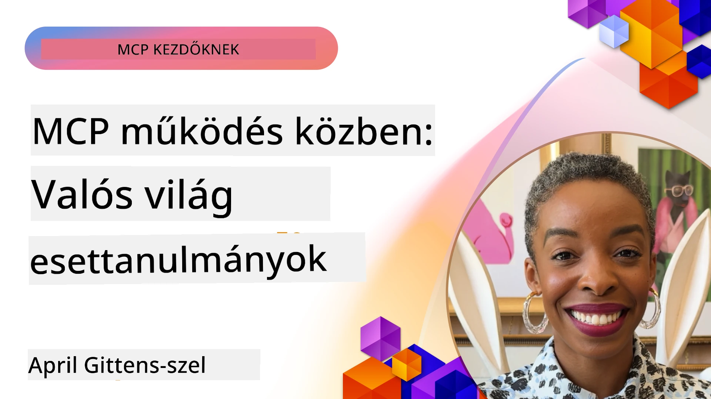

# MCP a gyakorlatban: Valós esettanulmányok

_(Kattintson a fenti képre a lecke videójának megtekintéséhez)_

A Model Context Protocol (MCP) átalakítja, hogyan lépnek kapcsolatba az AI alkalmazások az adatokkal, eszközökkel és szolgáltatásokkal. Ez a rész valós esettanulmányokat mutat be, amelyek a MCP gyakorlati alkalmazásait szemléltetik különböző vállalati helyzetekben.

## Összefoglaló

Ebben a szakaszban konkrét MCP megvalósítási példákat láthat, amelyek kiemelik, hogyan használják a szervezetek ezt a protokollt összetett üzleti kihívások megoldására. Ezeknek az esettanulmányoknak a megvizsgálásával betekintést nyerhet a MCP sokoldalúságába, skálázhatóságába és gyakorlati előnyeibe valós élethelyzetekben.

## Fő tanulási célok

Ezeknek az esettanulmányoknak a megismerésével Ön:

- Megérti, hogyan alkalmazható a MCP konkrét üzleti problémák megoldására
- Megismeri a különböző integrációs mintákat és architekturális megközelítéseket
- Felismeri a MCP vállalati környezetben történő bevezetésének legjobb gyakorlatait
- Megtudja azokat a kihívásokat és megoldásokat, amelyek a valós megvalósítások során felmerülnek
- Azonosítja azokat a lehetőségeket, amelyeken keresztül hasonló mintákat alkalmazhat saját projektjeiben

## Kiemelt esettanulmányok

### 1. [Azure AI Utazási ügynökök – Referenciaimplementáció](./travelagentsample.md)

Ez az esettanulmány bemutatja a Microsoft átfogó referencia megoldását, amely szemlélteti, hogyan lehet MCP-vel, Azure OpenAI-val és Azure AI Search-sel többügynökös, AI-alapú utazástervező alkalmazást építeni. A projekt bemutatja:

- Többügynökös összehangolás MCP-n keresztül
- Vállalati adatintegráció Azure AI Search segítségével
- Biztonságos, skálázható architektúra Azure szolgáltatásokkal
- Kiterjeszthető eszköztár újrafelhasználható MCP komponensekkel
- Beszélgetésalapú felhasználói élmény Azure OpenAI erőforrásokkal

Az architektúra és megvalósítás részletei értékes betekintést adnak összetett, többügynökös rendszerek építésébe MCP koordinációs rétegként történő alkalmazásával.

### 2. [Azure DevOps elemek frissítése YouTube adatból](./UpdateADOItemsFromYT.md)

Ez az esettanulmány a MCP gyakorlati alkalmazását mutatja be munkafolyamatok automatizálására. Megmutatja, hogyan lehet MCP eszközökkel:

- Adatokat kinyerni online platformokról (YouTube)
- Munkafolyamat-elemeket frissíteni Azure DevOps rendszerekben
- Ismételhető automatizált munkafolyamatokat létrehozni
- Adatokat integrálni eltérő rendszerek között

Ez a példa illusztrálja, hogy még viszonylag egyszerű MCP megvalósítások is jelentős hatékonyságnövekedést eredményezhetnek rutin feladatok automatizálásával és az adatok konzisztenciájának javításával.

### 3. [Valós idejű dokumentáció lekérése MCP-vel](./docs-mcp/README.md)

Ez az esettanulmány végigvezeti Önt egy Python konzol kliens MCP szerverhez történő csatlakoztatásán, hogy valós idejű, kontextus-érzékeny Microsoft dokumentációt kérjen le és naplózzon. Megtanulhatja, hogyan lehet:

- Egy MCP szerverhez csatlakozni Python klienssel és az hivatalos MCP SDK-val
- Streaming HTTP kliens használatával hatékony, valós idejű adatlekérést végezni
- A szerveren dokumentációs eszközöket hívni, és a válaszokat közvetlenül a konzolra naplózni
- Naprakész Microsoft dokumentációt integrálni a munkafolyamatba anélkül, hogy elhagyná a terminált

A fejezet gyakorlati feladatot, minimális működő kódmintát és további mélyebb tanulási forrásokat tartalmaz. Tekintse meg a teljes lépésről-lépésre leírást és a kódot a linkelt fejezetben, hogy megértse, hogyan képes a MCP forradalmasítani a dokumentációhoz való hozzáférést és a fejlesztői termelékenységet konzolos környezetekben.

### 4. [Interaktív tanulási terv generátor webalkalmazás MCP-vel](./docs-mcp/README.md)

Ez az esettanulmány bemutatja, hogyan lehet Chainlit és a Model Context Protocol (MCP) használatával interaktív webalkalmazást építeni, amely személyre szabott tanulási terveket generál bármilyen témához. A felhasználók megadhatnak egy témakört (például "AI-900 tanúsítás") és egy tanulási időszakot (pl. 8 hét), és az alkalmazás heti bontásban ajánlja a tartalmakat. A Chainlit beszélgetés-alapú csevegőfelületet biztosít, így az élmény vonzó és alkalmazkodó.

- Chainlit által működtetett beszélgetésalapú webalkalmazás
- Felhasználói által vezérelt témamegjelölés és időtartam
- Heti bontású tartalomajánlások MCP segítségével
- Valós idejű, adaptív válaszok egy csevegőfelületen

A projekt szemlélteti, hogyan lehet ötvözni a beszélgetéses AI-t és az MCP-t dinamikus, felhasználó-központú oktatási eszközök létrehozásához modern webkörnyezetben.

### 5. [Dokumentációk szerkesztőben MCP szerverrel VS Code-ban](./docs-mcp/README.md)

Ez az esettanulmány bemutatja, hogyan hozhatja be a Microsoft Learn Dokumentációkat közvetlenül a VS Code környezetébe az MCP szerver segítségével – semmi több böngészőfül váltás! Megtapasztalhatja, hogyan lehet:

- Azonnal keresni és olvasni dokumentációkat VS Code-ban az MCP panel vagy parancspaletta segítségével
- Hivatkozásokat beszúrni közvetlenül README vagy tanfolyam markdown fájlokba
- Használni a GitHub Copilot-ot és MCP-t együtt zökkenőmentes, AI-alapú dokumentációs és kód munkafolyamatokhoz
- Valós idejű visszacsatolással validálni és fejleszteni dokumentációját, Microsoft-hitelesített pontossággal
- Integrálni az MCP-t GitHub munkafolyamatokkal a folyamatos dokumentáció validáció érdekében

A megvalósítás tartalmazza:

- Példát `.vscode/mcp.json` konfigurációra az egyszerű beállításhoz
- Képernyőképes bemutatót a szerkesztőbeli élményről
- Tippeket a Copilot és MCP együttes használatához a maximális termelékenység érdekében

Ez a forgatókönyv ideális tanfolyamkészítőknek, dokumentáció íróknak és fejlesztőknek, akik a szerkesztőjükben szeretnének maradni, miközben dokumentációval, Copilot-tal és validációs eszközökkel dolgoznak – mindezt MCP támogatással.

### 6. [APIM MCP szerver létrehozása](./apimsample.md)

Ez az esettanulmány lépésről lépésre bemutatja, hogyan hozhat létre MCP szervert Azure API Menedzsment (APIM) használatával. Lefedi:

- MCP szerver beállítása Azure API Menedzsmentben
- API műveletek MCP eszközökként történő megjelenítése
- Szabályok konfigurálása sebességkorlátozásra és biztonságra
- MCP szerver tesztelése Visual Studio Code és GitHub Copilot segítségével

Ez a példa bemutatja, hogyan használhatja ki az Azure képességeit egy robusztus MCP szerver létrehozásához, amely különféle alkalmazásokban használható az AI rendszerek vállalati API-kkal történő integrációjának fejlesztésére.

### 7. [GitHub MCP Registry — Ügynöki integráció gyorsítása](https://github.com/mcp)

Ez az esettanulmány azt vizsgálja, hogyan kezeli a GitHub 2025 szeptemberében indított MCP Registry-je az AI ökoszisztéma egyik kritikus kihívását: a Model Context Protocol (MCP) szerverek széttöredezett felfedezését és telepítését.

#### Áttekintés
Az **MCP Registry** megoldja a különböző tárhelyeken és regiszterekben szétszórt MCP szerverek használatával járó nehézségeket, amelyek korábban lassúvá és hibaforrássá tették az integrációt. Ezek a szerverek lehetővé teszik, hogy AI ügynökök külső rendszerekkel (API-k, adatbázisok, dokumentációs források) lépjenek kapcsolatba.

#### Problémafelvetés
Az ügynöki munkafolyamatokat építő fejlesztők számos kihívással szembesültek:
- **Alacsony felfedezhetőség** különböző platformokon átívelően
- **Ismétlődő kérdések** elterjedve fórumokon és dokumentációkban
- **Biztonsági kockázatok** nem ellenőrzött és nem megbízható forrásokból
- **Szabványosítás hiánya** a szerverek minőségében és kompatibilitásában

#### Megoldás architektúra
A GitHub MCP Registry központosítja a megbízható MCP szervereket kulcsfontosságú jellemzőkkel:
- **Egykattintásos telepítés** VS Code integráción keresztül a gördülékeny beállításhoz
- **Jel-zaj arány szerinti rendezés** csillagok, aktivitás és közösségi validáció alapján
- **Közvetlen integráció** a GitHub Copilot és más MCP-kompatibilis eszközökkel
- **Nyílt hozzájárulási modell**, amely lehetővé teszi a közösségi és vállalati partnerek számára a részvételt

#### Üzleti hatás
A regiszter mérhető javulásokat hozott:
- **Gyorsabb belépés** a fejlesztőknek Microsoft Learn MCP szerverével, amely közvetlenül továbbítja a hivatalos dokumentációt az ügynököknek
- **Jobb termelékenység** specializált szerverekkel, például a `github-mcp-server`-rel, amely természetes nyelvű GitHub automatizációt tesz lehetővé (PR létrehozás, CI újrafuttatás, kódfelmérés)
- **Erősebb ökoszisztéma bizalom** gondosan válogatott listákkal és átlátható konfigurációs szabványokkal

#### Stratégiai érték
Az ügynök-életciklus menedzsmentjére és reprodukálható munkafolyamatokra szakosodott gyakorlatiasok számára az MCP Registry:

- **Moduláris ügynök telepítési képességek** szabványosított komponensekkel
- **Regiszter által támogatott értékelési csővezetékek** következetes tesztelés és validáció érdekében
- **Eszközök közötti interoperabilitás** a különböző AI platformok zökkenőmentes integrációjához

Ez az esettanulmány azt mutatja, hogy az MCP Registry nem csupán egy katalógus – alapvető platform a skálázható, valós modellekkel való integrációhoz és ügynöki rendszerek telepítéséhez.

## Összegzés

Ezek a hét átfogó esettanulmány kiemelik a Model Context Protocol kivételes sokoldalúságát és gyakorlati alkalmazásait különféle valós helyzetekben. Az összetett többügynökös utazástervező rendszerektől és vállalati API menedzsmenttől a dokumentációs munkafolyamatok egyszerűsítéséig és a forradalmi GitHub MCP Registry-ig ezek a példák bemutatják, hogyan biztosít a MCP egy szabványosított, skálázható megoldást az AI rendszerek és a szükséges eszközök, adatok, szolgáltatások összekapcsolásához, amelyekkel kiemelkedő értéket nyújtanak.

Az esettanulmányok több szempontból lefedik a MCP megvalósítását:
- **Vállalati integráció**: Azure API Menedzsment és Azure DevOps automatizáció
- **Többügynökös összehangolás**: Utazástervezés koordinált AI ügynökökkel
- **Fejlesztői termelékenység**: VS Code integráció és valós idejű dokumentáció-hozzáférés
- **Ökoszisztéma fejlesztés**: GitHub MCP Registry mint alapvető platform
- **Oktatási alkalmazások**: Interaktív tanulási terv generátorok és beszélgetésalapú felületek

Ezeknek a megvalósításoknak a tanulmányozásával kardinális ismereteket szerezhet:
- **Architekturális mintákat** különböző méretekhez és használati esetekhez
- **Megvalósítási stratégiákat**, amelyek egyensúlyt teremtenek a funkcionalitás és fenntarthatóság között
- **Biztonsági és skálázhatósági** szempontokat éles környezetben
- **Legjobb gyakorlatokat** MCP szerver fejlesztés és kliens integráció terén
- **Ökoszisztéma szemléletet** összekapcsolt AI-megoldások építéséhez

Ezek a példák együttesen bizonyítják, hogy a MCP nem csupán elméleti keretrendszer, hanem egy kiforrott, gyártásra kész protokoll, amely gyakorlati megoldásokat tesz lehetővé összetett üzleti kihívásokra. Legyen szó egyszerű automatizációs eszközökről vagy kifinomult többügynökös rendszerekről, a bemutatott minták és megközelítések szilárd alapot biztosítanak saját MCP projektjeihez.

## További források

- [Azure AI Travel Agents GitHub tároló](https://github.com/Azure-Samples/azure-ai-travel-agents)
- [Azure DevOps MCP eszköz](https://github.com/microsoft/azure-devops-mcp)
- [Playwright MCP eszköz](https://github.com/microsoft/playwright-mcp)
- [Microsoft Docs MCP szerver](https://github.com/MicrosoftDocs/mcp)
- [GitHub MCP Registry — Ügynöki integráció gyorsítása](https://github.com/mcp)
- [MCP közösségi példák](https://github.com/microsoft/mcp)

## Mi következik?

- Előző: [8. modul: Legjobb gyakorlatok](../08-BestPractices/README.md)
- Következő: [10. modul: AI munkafolyamatok egyszerűsítése: MCP szerver építése AI eszköztárral](../10-StreamliningAIWorkflowsBuildingAnMCPServerWithAIToolkit/README.md)

---

<!-- CO-OP TRANSLATOR DISCLAIMER START -->
**Nyilatkozat**:
Ezt a dokumentumot az AI fordító szolgáltatásával, a [Co-op Translator](https://github.com/Azure/co-op-translator) segítségével fordítottuk le. Bár igyekszünk a pontosságra, kérjük, vegye figyelembe, hogy az automatikus fordítások hibákat vagy pontatlanságokat tartalmazhatnak. Az eredeti, anyanyelvi dokumentum tekinthető hiteles forrásnak. Kritikus információk esetén profi emberi fordítást javaslunk. Nem vállalunk felelősséget a fordítás használatából eredő félreértésekért vagy téves értelmezésekért.
<!-- CO-OP TRANSLATOR DISCLAIMER END -->