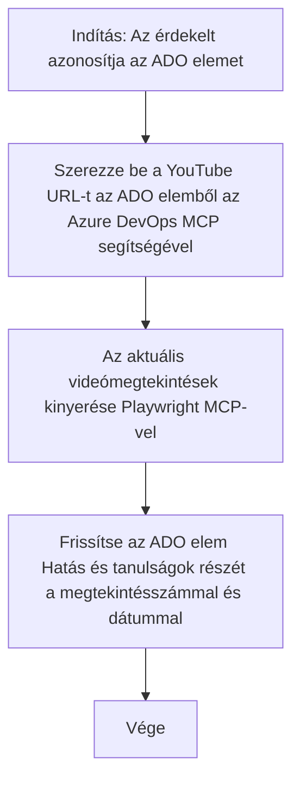

# Esettanulmány: Azure DevOps elemek frissítése YouTube adatokkal MCP segítségével

> **Jogi nyilatkozat:** Léteznek már online eszközök és jelentések, amelyek automatizálni tudják az Azure DevOps elemek frissítését olyan platformokról származó adatokkal, mint a YouTube. Az alábbi forgatókönyvet kizárólag mintáként közöljük annak bemutatására, hogyan alkalmazhatók az MCP eszközök automatizálási és integrációs feladatokra.

## Áttekintés

Ez az esettanulmány egy példát mutat be arra, hogy a Model Context Protocol (MCP) és eszközei hogyan használhatók az Azure DevOps (ADO) munkafeladatok online forrásokból, például a YouTube-ról származó információkkal történő automatikus frissítésére. A leírt forgatókönyv csak egy illusztráció ezeknek az eszközöknek a szélesebb körű képességeire, amelyek sok hasonló automatizálási igényhez alkalmazhatók.

Ebben a példában egy Advocate nyomon követi az online szekciókat ADO elemek használatával, ahol minden elem egy YouTube videó URL-jét tartalmazza. Az MCP eszközök segítségével az Advocate ismételhető és automatizált módon naprakészen tudja tartani az ADO elemeket a legfrissebb videó metrikákkal, például megtekintésszámmal. Ez a megközelítés általánosítható más esetekben is, amikor online forrásból származó információt kell integrálni az ADO-ba vagy más rendszerekbe.

## Forgatókönyv

Egy Advocate felelős az online szekciók és közösségi elköteleződések hatásának nyomon követéséért. Minden szekciót rögzít az ADO 'DevRel' projektjében, mint munkafeladatot, és a munkafeladat tartalmaz egy mezőt a YouTube videó URL-jével. A szekció elérésének pontos jelentéséhez az Advocate-nek frissítenie kell az ADO elemet a videó jelenlegi megtekintésszámával és az információ lekérésének dátumával.

## Használt eszközök

- [Azure DevOps MCP](https://github.com/microsoft/azure-devops-mcp): Programozott hozzáférést és frissítéseket tesz lehetővé az ADO munkafeladatokhoz MCP-n keresztül.
- [Playwright MCP](https://github.com/microsoft/playwright-mcp): Böngészőműveleteket automatizál élő adatok kinyeréséhez weboldalakról, például YouTube videó statisztikákból.

## Lépésről lépésre munkafolyamat

1. **ADO elem azonosítása**: Kezdj az ADO munkafeladat azonosítójával (például 1234) a 'DevRel' projektből.
2. **YouTube URL lekérése**: Használd az Azure DevOps MCP eszközt az URL lekéréséhez a munkafeladatból.
3. **Videó megtekintések kinyerése**: Használd a Playwright MCP eszközt a YouTube URL-en való navigáláshoz és a jelenlegi megtekintésszám kinyeréséhez.
4. **ADO elem frissítése**: Írd be a legfrissebb megtekintésszámot és a lekérés dátumát az ADO munkafeladat 'Impact and Learnings' részébe az Azure DevOps MCP eszköz segítségével.

## Példa prompt

```bash
- Work with the ADO Item ID: 1234
- The project is '2025-Awesome'
- Get the YouTube URL for the ADO item
- Use Playwright to get the current views from the YouTube video
- Update the ADO item with the current video views and the updated date of the information
```

## Mermaid Flowchart


## Technikai megvalósítás

- **MCP koordináció**: A munkafolyamatot egy MCP szerver irányítja, amely összehangolja az Azure DevOps MCP és a Playwright MCP eszközök használatát.
- **Automatizálás**: A folyamat manuálisan indítható vagy rendszeres időközönként ütemezhető az ADO elemek naprakészen tartásához.
- **Kiterjeszthetőség**: Ugyanez a minta alkalmazható más online metrikák (például lájkok, kommentek) vagy más platformokból származó adatok ADO elemek frissítésére.

## Eredmények és hatás

- **Hatékonyság**: Csökkenti az Advocate-ek manuális munkáját azáltal, hogy automatizálja a videó metrikák lekérését és frissítését.
- **Pontosság**: Biztosítja, hogy az ADO elemek a legfrissebb online forrásból származó adatokkal legyenek naprakészek.
- **Ismételhetőség**: Újrahasznosítható munkafolyamatot nyújt hasonló forgatókönyvekhez, amelyek más adatforrásokat vagy metrikákat érintenek.

## Hivatkozások

- [Azure DevOps MCP](https://github.com/microsoft/azure-devops-mcp)
- [Playwright MCP](https://github.com/microsoft/playwright-mcp)
- [Model Context Protocol (MCP)](https://modelcontextprotocol.io/)

## Mi következik

- Vissza: [Esettanulmányok áttekintése](./README.md)
- Következő: [Valós idejű dokumentum lekérés MCP-vel](./docs-mcp/README.md)

---

<!-- CO-OP TRANSLATOR DISCLAIMER START -->
**Jogi nyilatkozat**:
Ezt a dokumentumot az AI fordító szolgáltatás, a [Co-op Translator](https://github.com/Azure/co-op-translator) segítségével fordítottuk. Bár a pontosságra törekszünk, kérjük, vegye figyelembe, hogy az automatikus fordítások hibákat vagy pontatlanságokat tartalmazhatnak. Az eredeti, anyanyelvi dokumentum tekintendő hivatalos forrásnak. Fontos információk esetén javasolt professzionális, emberi fordítást igénybe venni. Nem vállalunk felelősséget a fordítás használatából eredő félreértésekért vagy téves értelmezésekért.
<!-- CO-OP TRANSLATOR DISCLAIMER END -->